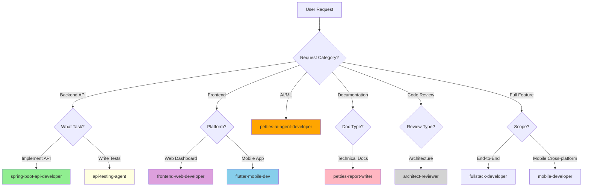

# AGENTS.md

This file provides guidance to Petties agents when working with code in this repository.

## Project Timeline

- **Project:** Petties - Veterinary Appointment Booking Platform
- **Timeline:** 13 Sprints (1 week/Sprint), 10/12/2025 - 11/03/2026
- **WBS Reference:** `docs-references/documentation/WBS_PETTIES_14_SPRINTS.md`
- **Documentation Path:** `docs-references/`

## Project Overview

Petties is a veterinary appointment booking platform connecting pet owners with veterinary clinics. The platform uses a clinic-centric model where pet owners book with clinics, and clinic managers assign appropriate vets.

## Architecture

**Monorepo with 4 main services:**

- `petties-web/` - React 19 + Vite + TypeScript (Admin/Clinic dashboards)
- `backend-spring/petties/` - Spring Boot 4.0 + Java 21 (REST API)
- `petties-agent-serivce/` - FastAPI + Python 3.12 (AI Single Agent + ReAct)
- `petties_mobile/` - Flutter 3.5 (Pet Owner/Vet mobile app)

**Databases:** PostgreSQL 16 (primary), MongoDB 7 (documents), Redis 7 (OTP/cache), Qdrant Cloud (vectors), Firebase (push messages)

**AI Layer:** Single Agent với ReAct pattern (LangGraph), **LLM Provider (Cloud API Only):** **OpenRouter**, LlamaIndex for RAG, Qdrant Cloud for vectors, Cohere for embeddings.
## Development Commands

### Quick Start (Databases only, services local)
```bash
docker-compose -f docker-compose.dev.yml up -d postgres mongodb redis
```

### Web Frontend
```bash
cd petties-web
npm install
npm run dev          # http://localhost:5173
npm run build        # Production build
npm run lint         # ESLint
```

### Backend (Spring Boot)
```bash
cd backend-spring/petties
mvn spring-boot:run              # http://localhost:8080
mvn test                         # Run all tests
mvn test -Dtest=UserTest         # Single test class
mvn clean package -DskipTests    # Build JAR
```

### AI Service (FastAPI)
```bash
cd petties-agent-serivce
python -m venv venv && venv\Scripts\activate  # Windows
pip install -r requirements.txt
alembic upgrade head                           # Run migrations
python -m uvicorn app.main:app --reload --port 8000  # http://localhost:8000
pytest                                         # Run all tests
pytest tests/test_api.py -v                    # Single test file
```

### Mobile (Flutter)
```bash
cd petties_mobile
flutter pub get
flutter run           # Development
flutter test          # Run tests
flutter build apk     # Android release
flutter build ipa     # iOS release
```

### Docker
```bash
docker-compose -f docker-compose.dev.yml up --build -d   # Full stack
docker-compose -f docker-compose.dev.yml logs -f backend # Service logs
docker-compose -f docker-compose.dev.yml down -v         # Reset (deletes data)
```

## Role-Platform Matrix

| Role | Web | Mobile |
|------|-----|--------|
| PET_OWNER | - | Mobile only |
| VET | Web + Mobile | Web + Mobile |
| CLINIC_OWNER | Web only | - |
| CLINIC_MANAGER | Web only | - |
| ADMIN | Web only | - |

## Key Technical Patterns

### Backend (Spring Boot)
- Layered: Controller → Service → Repository
- JWT auth with refresh tokens (Spring Security 6.x)
- Global exception handling via `GlobalExceptionHandler`
- Validation with Vietnamese messages on DTOs (`@NotBlank`, `@Size`, etc.)
- Profiles: `dev` (local Docker DBs), `test` (Cloud DBs), `prod` (Neon/Atlas/Redis Cloud)
- Redis for OTP storage with TTL (Registration & Password Reset,..)

### Frontend (React)
- State management: Zustand stores (`src/store/`)
- API calls: Axios with centralized client (`src/services/api/`)
- Routing: React Router v7 with role-based guards
- Styling: Tailwind CSS v4 with **Neobrutalism** design (no rounded corners, thick black borders, offset shadows)

### AI Service (FastAPI)
- Single Agent: LangGraph với ReAct pattern (Thought → Action → Observation)
- Config: DB-based dynamic configuration (prompt, parameters, tools)
- Tools: FastMCP với @mcp.tool decorator
  - `pet_care_qa` - RAG-based Q&A
  - `symptom_search` - Symptom → Disease lookup
  - `search_clinics` - Find nearby clinics
  - `check_slots` - Check available slots
  - `create_booking` - Create booking via chat
- LLM: OpenRouter Cloud API (gemini-2.0-flash, llama-3.3-70b, claude-3.5-sonnet)
- RAG: LlamaIndex + Qdrant Cloud + Cohere embed-multilingual-v3


### Mobile (Flutter)
- State: Provider pattern
- Routing: GoRouter with role-based guards
- Auth: JWT stored in SharedPreferences, Google Sign-In supported

## Design System

**Style: Neobrutalism**
- Borders: 4px solid black, no border-radius
- Shadows: `4px 4px 0 #1c1917` (offset, no blur)
- Colors: Amber palette (primary), Stone palette (neutral)
- Typography: Inter font, uppercase headings, font-weight 700
- **No emojis in UI** - use Heroicons instead

## Environment & Deployment

### Three Environments

| Environment | FE URL | BE URL | Branch | Database |
|-------------|--------|--------|--------|----------|
| **Local Dev** | `localhost:5173` | `localhost:8080` | `feature/*` | Docker |
| **Test** | `test.petties.world` | `api-test.petties.world` | `develop` | Neon Test Branch |
| **Production** | `www.petties.world` | `api.petties.world` | `main` | Neon Main |

### CI/CD Pipeline (GitHub Actions)

| Workflow | Trigger | Purpose |
|----------|---------|--------|
| `ci.yml` | PR → develop, main | Build + Lint + Test (Frontend, Backend, AI Service) |
| `deploy-test.yml` | Push → develop | Auto Deploy to EC2 Test Environment |
| `deploy-ec2.yml` | Push → main | Auto Deploy to EC2 Production |
| `mobile-ci-cd.yml` | Manual Dispatch | Build & Deploy Mobile App (Android/iOS) to Firebase/TestFlight |


### Docker Compose Files

| File | Use Case |
|------|----------|
| `docker-compose.dev.yml` | Local development (full stack) |
| `docker-compose.test.yml` | Test Env on EC2 (ports 8081/8001) |
| `docker-compose.prod.yml` | Production on EC2 (ports 8080/8000) |

Copy `.env.example` to `.env` for local, `.env.test` for Test Env.

## Project Rules
0. Always response in Vietnamese.
1. Always references in `docs-references/` folder to avoid out of scope.
2. Always comprehensive all plan and got a user accepted before execute code.
3. Always clearly dev environment, test environment and production environment, make sure best practice project structure.
4. Pet owner not use web (only mobile app), vet also use mobile app, clinic owner only use web, clinic manager only use web, admin web only.
5. Always comprehensive project structure, never missing any folder and file, always follows best practice.
6. Always ensure APIs Spring Boot design have API documentation (Swagger).
7. **Environments**: "dev" = localhost (feature/* branches), "test" = test.petties.world + api-test.petties.world (develop branch), "prod" = www.petties.world + api.petties.world (main branch).
8. If update docs, should update the docs to lasted version and date.
9. Make sure get context all project structure before coding to avoid duplicate.
10. When write docs do not import any description use ASCII art (┌, ─, │, └, etc.), should add mermaid diagram code (if any) and necessary content.
11. Create Unit Testing and System testing for new feature use JUnit for Spring Boot and pytest for Python.
12. If done feature or usecase should be update to docs-references to update project status, checklist, etc,...
13. Always follow the app design style for the frontend in `docs-references/`.
14. Từ giờ, mỗi khi bạn thêm trường mới vào Entity trong Java, hãy nhớ tạo thêm file migration tương ứng nhé! Chi tiết trong file DATABASE_MIGRATION_GUIDE.md
Tạo Script: Tạo file SQL mới với định dạng V<Timestamp>__<tên_mô_tả>.sql.
Sai: V2__add_phone.sql (Dễ trùng nếu 2 người cùng làm).
Đúng: V202412301030__add_phone_to_users.sql (Định dạng: V + NămThángNgàyGiờPhút).
Lưu ý: Giữa Version và Mô tả phải có 2 dấu gạch dưới (__).
Áp dụng: Flyway sẽ tự động chạy script này khi ứng dụng khởi động.

## Documentation-First Development Rule

15. **TRƯỚC KHI CODE bất kỳ feature nào**, PHẢI chuẩn bị nội dung documentation để cập nhật vào:

    **A. PETTIES_SRS.md - Phần 3.2 Functional Requirements:**
    Theo format mẫu đã có (xem 3.2.1 - 3.2.6):
    ```
    #### 3.2.X [Feature Name]
    **Function trigger:**
    - **Navigation path:** [Screen Path]
    - **Timing Frequency:** [When triggered]

    **Function description:**
    - **Actors/Roles:** [Who uses]
    - **Purpose:** [What it does]
    - **Interface:** [UI elements]
    - **Data processing:** [Step-by-step flow]

    **Screen layout:** *(Add screen UI here)*

    **Function details:**
    - **Data:** [Request/Response objects]
    - **Validation:** [Error handling rules]
    - **Business rules:** [Business logic]
    - **Normal case:** [Happy path]
    - **Abnormal case:** [Error scenarios]
    ```

    **B. REPORT_4_SDD_SYSTEM_DESIGN.md - Phần 3. DETAILED DESIGN:**
    Theo format mẫu đã có (xem 3.1, 3.2, 3.3):
    ```
    ### 3.X [Feature Name]
    [Feature description paragraph]

    #### 3.X.1 Class Diagram
    ```mermaid
    classDiagram
        [Controller, Service, Entity, DTO classes]
    ```

    #### 3.X.2 Class Specifications
    **1. [ControllerName]**
    - **Responsibility:** [What it does]
    - **Key Methods:** [Method list with descriptions]

    **2. [ServiceName]**
    - **Responsibility:** [Business logic]
    - **Key Methods:** [Method list]

    #### 3.X.3 Sequence Diagram: [Main Flow]
    ```mermaid
    sequenceDiagram
        [Actor → UI → Controller → Service → Repository → DB flow]
    ```
    ```

    **Workflow:**
    1. Khi nhận yêu cầu implement feature mới → Dùng `petties-report-writer` agent để tạo documentation draft
    2. Trình bày documentation cho user review & approve
    3. SAU KHI user approve documentation → Mới bắt đầu code với các agents tương ứng
    4. Sau khi code xong → Cập nhật lại documentation nếu có thay đổi

## Context & Clarification Rules

14. **Ambiguous Questions**: If a user question is ambiguous or missing important information, first list the missing details and ask clarifying questions instead of guessing.
15. **Context Priority**: When answering about code, always prioritize context from:
    - `docs-references/` folder (PETTIES_Features.md, WBS, etc.)
    - Existing codebase files
    - Previous conversation
    - General knowledge (last resort)
16. **Confirm Understanding**: Before proposing major changes, summarize your current understanding in 3-5 bullet points and ask user to confirm or correct.
17. **Insufficient Context**: If context is insufficient, clearly state that you are unsure and explain which additional files or information are needed (e.g., "I need to see the BookingController.java to understand the current implementation").
18. **Multiple Interpretations**: When multiple interpretations are possible, explicitly describe each interpretation and ask the user which one is correct before implementing.
19. **File References**: For every answer involving code, mention which files, modules, or components you are assuming to be relevant:
    - Backend: `backend-spring/petties/src/main/java/com/petties/...`
    - Web: `petties-web/src/...`
    - Mobile: `petties_mobile/lib/...`
    - AI Service: `petties-agent-serivce/app/...`



**Important Notes:**
- ❌ **KHÔNG phải Multi-Agent** (no supervisor, no specialized agents)
- ✅ **Single Agent + Multiple Tools** architecture
- ❌ **KHÔNG dùng local Ollama** - Cloud API only (OpenRouter)
- ✅ **Tools are code-based** với semantic descriptions, NOT auto-imported từ Swagger

**Keywords:** Single Agent, ReAct, LangGraph, @mcp.tool, RAG, Qdrant Cloud, OpenRouter, WebSocket, system prompt, hyperparameters, knowledge base

**Ví dụ:**
- "Thêm tool `search_clinics` để agent tìm phòng khám gần user"
- "Thiết lập RAG pipeline với Qdrant Cloud cho pet care Q&A"
- "Config ReAct flow visualization trong Admin Dashboard"
- "Implement system prompt versioning cho agent"
- "Thêm hyperparameters slider cho Temperature tuning"
- "Debug ReAct loop: Thought → Action → Observation"

---

## Important Documentation

**Features & Architecture:**
- `docs-references/documentation/PETTIES_Features.md` - Complete feature list
- `docs-references/documentation/TECHNICAL SCOPE PETTIES - AGENT MANAGEMENT.md` - AI architecture
- `docs-references/documentation/VET_SCHEDULING_STRATEGY.md` - Slot-based booking system
- `docs-references/documentation/BUSINESS_WORKFLOW_BPMN.md` - Business processes

**Development & Deployment:**
- `docs-references/development/SOURCE_CODE_MANAGEMENT_RULES.md` - Git workflow for team of 5
- `docs-references/deployment/EC2_PRODUCTION_DEPLOYMENT.md` - EC2 deployment guide
- `docs-references/deployment/VERCEL_PRODUCTION_SETUP.md` - Vercel FE setup
- `docs-references/deployment/TEST_ENVIRONMENT_SETUP.md` - Test Env setup guide

**Design:**
- `docs-references/design/design-style-guide.md` - Neobrutalism UI guide
