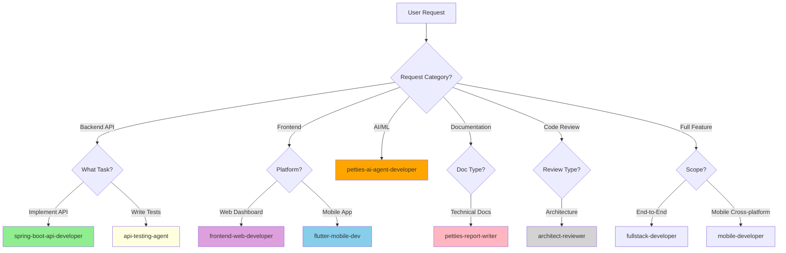

# AGENTS.md

This file provides guidance to Petties agents when working with code in this repository.

## Project Timeline

- **Project:** Petties - Veterinary Appointment Booking Platform
- **Timeline:** 13 Sprints (1 week/Sprint), 10/12/2025 - 11/03/2026
- **WBS Reference:** `docs-references/documentation/WBS_PETTIES_14_SPRINTS.md`
- **Documentation Path:** `docs-references/`

## Project Overview

Petties is a veterinary appointment booking platform connecting pet owners with veterinary clinics. The platform uses a clinic-centric model where pet owners book with clinics, and clinic managers assign appropriate vets.

## Project Rules

- Hạn chế dùng PowerShell để replace text trong file; ưu tiên `apply_patch` để chỉnh sửa nội dung một cách rõ ràng, an toàn và dễ review.
- Nếu bắt buộc phải dùng PowerShell cho thay đổi nội dung, chỉ dùng cho thao tác nhỏ và phải kiểm tra lại diff ngay sau đó.

## Architecture

**Monorepo with 4 main services:**

- `petties-web/` - React 19 + Vite + TypeScript (Admin/Clinic dashboards)
- `backend-spring/petties/` - Spring Boot 4.0 + Java 21 (REST API)
- `petties-agent-serivce/` - FastAPI + Python 3.12 (AI Single Agent + ReAct)
- `petties_mobile/` - Flutter 3.5 (Pet Owner/Staff mobile app)

**Databases:** PostgreSQL 16 (primary), MongoDB 7 (documents), Redis 7 (OTP/cache), Qdrant Cloud (vectors), Firebase (push messages)

**AI Layer:** Single Agent với ReAct pattern (LangGraph), **LLM Provider (Cloud API Only):** **OpenRouter**, LlamaIndex for RAG, Qdrant Cloud for vectors, Cohere for embeddings.

## Development Commands

### Quick Start (Databases only, services local)
```bash
docker-compose -f docker-compose.dev.yml up -d postgres mongodb redis
```

### Web Frontend
```bash
cd petties-web
npm install
npm run dev          # http://localhost:5173
npm run build        # Production build
npm run lint         # ESLint
```

### Backend (Spring Boot)
```bash
cd backend-spring/petties
mvn spring-boot:run              # http://localhost:8080
mvn test                         # Run all tests
mvn test -Dtest=UserTest         # Single test class
mvn clean package -DskipTests    # Build JAR
```

### AI Service (FastAPI)
```bash
cd petties-agent-serivce
python -m venv venv && venv\Scripts\activate  # Windows
pip install -r requirements.txt
alembic upgrade head                           # Run migrations
python -m uvicorn app.main:app --reload --port 8000  # http://localhost:8000
pytest                                         # Run all tests
pytest tests/test_api.py -v                    # Single test file
```

### Mobile (Flutter)
```bash
cd petties_mobile
flutter pub get
flutter run           # Development
flutter test          # Run tests
flutter build apk     # Android release
flutter build ipa     # iOS release
```

### Docker
```bash
docker-compose -f docker-compose.dev.yml up --build -d   # Full stack
docker-compose -f docker-compose.dev.yml logs -f backend # Service logs
docker-compose -f docker-compose.dev.yml down -v         # Reset (deletes data)
```

## Role-Platform Matrix

| Role | Web | Mobile |
|------|-----|--------|
| PET_OWNER | - | Mobile only |
| STAFF | Web + Mobile | Web + Mobile |
| CLINIC_OWNER | Web only | - |
| CLINIC_MANAGER | Web only | - |
| ADMIN | Web only | - |

## Key Technical Patterns

### Backend (Spring Boot)
- Layered: Controller -> Service -> Repository
- JWT auth with refresh tokens (Spring Security 6.x)
- Global exception handling via `GlobalExceptionHandler`
- Validation with Vietnamese messages on DTOs (`@NotBlank`, `@Size`, etc.)
- Profiles: `dev` (local Docker DBs), `test` (Cloud DBs), `prod` (Neon/Atlas/Redis Cloud)
- Redis for OTP storage with TTL (Registration & Password Reset,..)
- Booking statuses are only `PENDING -> CONFIRMED -> IN_PROGRESS -> COMPLETED`; check-in, checkout, arrived, start-moving are actions/events, not statuses

### Frontend (React)
- State management: Zustand stores (`src/store/`)
- API calls: Axios with centralized client (`src/services/api/`)
- Routing: React Router v7 with role-based guards
- Styling: Tailwind CSS v4 with **Neobrutalism** design (no rounded corners, thick black borders, offset shadows)

### AI Service (FastAPI)
- Single Agent: LangGraph với ReAct pattern (Thought -> Action -> Observation)
- Config: DB-based dynamic configuration (prompt, parameters, tools)
- Tools: FastMCP với @mcp.tool decorator
  - `pet_knowledge_search` - Tra cứu cẩm nang/kiến thức thú y (Hybrid: RAG + Case Memory)
  - `web_search` - Tìm thêm nguồn web khi knowledge base chưa đủ
  - `get_user_pets` - Lấy danh sách thú cưng của user để tư vấn/đặt lịch đúng
  - `search_clinics_nearby` - Tìm phòng khám gần vị trí
  - `get_clinic_services` - Lấy danh sách dịch vụ của phòng khám
  - `check_available_slots` - Kiểm tra slot trống theo ngày/dịch vụ
  - `create_booking_for_user` - Tạo booking sau khi người dùng xác nhận rõ ràng
- LLM: OpenRouter Cloud API (gemini-2.0-flash, llama-3.3-70b, claude-3.5-sonnet)
- RAG: LlamaIndex + Qdrant Cloud + Cohere embed-multilingual-v3
- Visual Case Memory: lưu case đã xác nhận vào Qdrant collection `petties_case_memory_v2` với named vectors `text` (Cohere) + `image` (Jina CLIP v2, 1024 chiều)
- Image embeddings: dùng Jina Embeddings API với model cố định `jina-clip-v2`, chỉ nhận URL `https` hoặc base64 (data URL) và trả về vector 1024 chiều khớp với cấu hình Case Memory
- Ưu tiên tool dữ liệu cá nhân hóa (`get_user_pets`, ...) cho các câu hỏi kiểu “thú cưng của tôi/hồ sơ của bé”; chỉ gọi knowledge base khi người dùng hỏi kiến thức/chăm sóc/triệu chứng chung
- Tool runtime: trước khi gọi FastMCP, lọc tham số theo `input_schema.properties` để loại key dư (ví dụ `type`) nhằm tránh lỗi Pydantic `Unexpected keyword argument`
- Streaming: WebSocket có thể gửi đầy đủ thought/action/observation; client nên mặc định chỉ hiển thị thought/stream cho UX, và bật debug mode để xem tool_call/tool_result khi cần
- Cấu hình Jina: `JINA_API_KEY` (và tùy chọn `JINA_IMAGE_EMBED_MODEL`) được lưu trong bảng `system_settings` và có thể chỉnh từ trang Admin Knowledge (cùng trang với Cohere/Qdrant), kèm nút test `/api/v1/settings/test-jina` để kiểm tra kết nối và dimension

### Mobile (Flutter)
- State: Provider pattern
- Routing: GoRouter with role-based guards
- Auth: JWT stored in SharedPreferences, Google Sign-In supported
- Codebase dùng role `STAFF`; `VET` chỉ nên xuất hiện như specialty hoặc tên kỹ thuật legacy

## Design System

**Style: Soft Neobrutalism** (Updated March 2025)

Friendly Brutalist - Giữ bản sắc brutalist nhưng mềm mại, thân thiện hơn.

### Core Elements
| Element | Value | Tailwind Class |
|---------|-------|----------------|
| **Border** | 2px solid #1c1917 | `border-2 border-stone-900` |
| **Card Radius** | 12px | `rounded-xl` |
| **Button/Input Radius** | 8px | `rounded-lg` |
| **Card Shadow** | 4px 4px 0 #1c1917 | `shadow-[4px_4px_0_#1c1917]` |
| **Button Shadow** | 3px 3px 0 #1c1917 | `shadow-[3px_3px_0_#1c1917]` |
| **Input Shadow** | 2px 2px 0 #1c1917 | `shadow-[2px_2px_0_#1c1917]` |

### Color Palette
| Color | Hex | Use Case |
|-------|-----|----------|
| **Amber-600** (Primary) | `#d97706` | Primary buttons, brand identity |
| **Coral** | `#FF6B6B` | Featured cards, CTAs, warnings |
| **Mint/Teal** | `#38B2AC` | Success states, health-related |
| **Blue** | `#4299E1` | Info, links, secondary actions |
| **Yellow** | `#FBBF24` | Highlights, badges |
| **Stone-900** | `#1c1917` | Text, borders, shadows |

### Typography
| Element | Style |
|---------|-------|
| Page Headings | `font-bold`, **normal case** (không uppercase) |
| Card Titles | `font-bold text-lg`, normal case |
| Button Text | `font-bold uppercase` |
| Labels | `text-xs font-bold uppercase` |

### UI Rules (QUAN TRỌNG)
- **KHONG DUNG EMOJI trong UI** - Dùng Heroicons thay thế (MoonIcon, ArrowRightIcon, etc.)
- **No border-radius > 12px** except for badges/avatars (use `rounded-full`)
- **No blur shadows** - always offset shadows only
- CSS file: `petties-web/src/styles/brutalist.css`
- Style guide: `docs-references/design/design-style-guide.md` (Reference Implementation: Sidebar, typography scale nav/sidebar, icon system)

## Vietnamese-Only Rule (User-Facing Text)

**Tất cả user-facing text PHẢI bằng Tiếng Việt 100%, KHÔNG lẫn lộn tiếng Anh:**

| Component | Example (Đúng) | Example (Sai) |
|-----------|----------------|---------------|
| Toast messages | `showToast('success', 'Đã lưu thành công')` | `showToast('success', 'Saved successfully')` |
| Exception messages | `throw new BadRequestException("Dữ liệu không hợp lệ")` | `throw new BadRequestException("Invalid data")` |
| Validation messages | `@NotBlank(message = "Không được để trống")` | `@NotBlank(message = "Must not be blank")` |
| Error responses | `"Vị trí phòng khám chưa được thiết lập"` | `"Clinic location not available"` |
| UI labels/buttons | `Đăng nhập`, `Xác nhận` | `Login`, `Confirm` |

**Quy tắc áp dụng:**
- **Backend (Spring Boot):** Tất cả exception messages trong Services
- **Frontend (React/Flutter):** Tất cả toast messages, error states, validation text, button labels
- **API responses:** Error messages trả về cho client
- **Log messages giữ tiếng Anh:** `log.info()`, `log.error()` - vì logs dành cho developers

## Documentation Language Rule

**Technical documentation and internal design documents may use English by default to reduce encoding/mojibake risk.**

**Apply this rule as follows:**
- **User-facing text:** Must remain Vietnamese 100%.
- **Technical docs in `docs-references/`:** Prefer English when the content is internal, technical, architectural, testing, deployment, or developer-oriented.
- **Mixed documents:** If a document contains both user-facing copy and technical content, keep user-facing examples in Vietnamese but write the explanatory/technical sections in English.
- **Encoding safety:** Always save docs as UTF-8 and verify readability after editing. If Vietnamese text shows encoding issues and the document is not user-facing, rewrite that section in English instead of leaving mojibake in the repo.

## No Browser Native Dialogs Rule

**KHÔNG sử dụng `window.alert()`, `window.confirm()`, `window.prompt()` trong Frontend:**

| Action | Thay thế bằng |
|--------|---------------|
| Thông báo lỗi/thành công | `showToast('error', 'Lỗi...')` hoặc `showToast('success', '...')` |
| Xác nhận hành động nguy hiểm | **ConfirmModal** component với Neobrutalism style |
| Nhập dữ liệu đơn giản | **Modal** hoặc **Form** component |

**Pattern cho Confirm Modal:**
```tsx
// Sai - Không dùng
if (window.confirm('Bạn có chắc muốn xóa?')) { ... }

// Đúng - Dùng ConfirmModal
const [showConfirm, setShowConfirm] = useState(false)
<ConfirmModal
  isOpen={showConfirm}
  title="Xác nhận xóa"
  message="Bạn có chắc muốn xóa mục này?"
  confirmText="Xóa"
  cancelText="Hủy"
  onConfirm={() => handleDelete()}
  onCancel={() => setShowConfirm(false)}
/>
```

## Environment & Deployment

### Three Environments

| Environment | FE URL | BE URL | Branch | Database |
|-------------|--------|--------|--------|----------|
| **Local Dev** | `localhost:5173` | `localhost:8080` | `feature/*` | Docker |
| **Test** | `test.petties.world` | `api-test.petties.world` | `develop` | Neon Test Branch |
| **Production** | `www.petties.world` | `api.petties.world` | `main` | Neon Main |

### CI/CD Pipeline (GitHub Actions)

| Workflow | Trigger | Purpose |
|----------|---------|--------|
| `ci.yml` | PR -> develop, main | Build + Lint + Test (Frontend, Backend, AI Service) |
| `deploy-test.yml` | Push -> develop | Auto Deploy to EC2 Test Environment |
| `deploy-ec2.yml` | Push -> main | Auto Deploy to EC2 Production |
| `mobile-ci-cd.yml` | Manual Dispatch | Build & Deploy Mobile App (Android/iOS) to Firebase/TestFlight |

### Docker Compose Files

| File | Use Case |
|------|----------|
| `docker-compose.dev.yml` | Local development (full stack) |
| `docker-compose.test.yml` | Test Env on EC2 (ports 8081/8001) |
| `docker-compose.prod.yml` | Production on EC2 (ports 8080/8000) |

Copy `.env.example` to `.env` for local, `.env.test` for Test Env.

## Project Rules
0. Always response in Vietnamese. Agent được phép tự chạy các lệnh build/test/lint/verify trong workspace khi user đã cho phép rõ ràng; nếu chưa có cho phép thì chỉ hướng dẫn lệnh để user tự chạy.
1. Always references in `docs-references/` folder to avoid out of scope.
2. Always comprehensive all plan and got a user accepted before execute code.
3. Always clearly dev environment, test environment and production environment, make sure best practice project structure.
4. Pet owner not use web (only mobile app), vet also use mobile app, clinic owner only use web, clinic manager only use web, admin web only.
5. Always comprehensive project structure, never missing any folder and file, always follows best practice.
6. Always ensure APIs Spring Boot design have API documentation (Swagger).
7. **Environments**: "dev" = localhost (feature/* branches), "test" = test.petties.world + api-test.petties.world (develop branch), "prod" = www.petties.world + api.petties.world (main branch).
8. If update docs, should update the docs to lasted version and date.
9. For technical/internal documentation, English is preferred by default to avoid encoding issues; only keep Vietnamese for user-facing copy, business wording that must stay Vietnamese, or when the user explicitly requests Vietnamese documentation.
10. Make sure get context all project structure before coding to avoid duplicate.
11. When write docs do not import any description use ASCII art (`┌`, `─`, `│`, `└`, etc.), should add mermaid diagram code (if any) and necessary content.
12. Create Unit Testing and System testing for new feature use JUnit for Spring Boot and pytest for Python.
13. If done feature or usecase should be update to docs-references to update project status, checklist, etc,...
14. Always follow the app design style for the frontend in `docs-references/`.
15. Always verify encoding UTF-8 sau khi tạo hoặc sửa file source/config/doc. Ưu tiên UTF-8 không BOM cho source code, tránh mojibake/ký tự lạ, và khi có dấu hiệu lỗi encoding thì phải kiểm tra, chuẩn hóa, rồi verify lại trước khi ship.
16. Từ giờ, mỗi khi bạn thêm trường mới vào Entity trong Java, hãy nhớ tạo thêm file migration tương ứng nhé! Chi tiết trong file DATABASE_MIGRATION_GUIDE.md
Tạo Script: Tạo file SQL mới với định dạng V<Timestamp>__<tên_mô_tả>.sql.
Sai: V2__add_phone.sql (Dễ trùng nếu 2 người cùng làm).
Đúng: V202412301030__add_phone_to_users.sql (Định dạng: V + NămThángNgàyGiờPhút).
Lưu ý: Giữa Version và Mô tả phải có 2 dấu gạch dưới (__).
Áp dụng: Flyway sẽ tự động chạy script này khi ứng dụng khởi động.
16.1. Nếu thực hiện thay đổi lớn/quan trọng (major feature, refactor lớn, bugfix production, thay đổi kiến trúc), PHẢI cập nhật `PROJECT_STATUS.md` thường xuyên, rõ ràng, và theo code-based evidence (liệt kê module/files/test-status thực tế), không cập nhật theo ước lượng cảm tính.

## Documentation-First Development Rule

17. **TRƯỚC KHI CODE bất kỳ feature nào**, PHẢI chuẩn bị nội dung documentation để cập nhật vào:

    **A. PETTIES_SRS.md - Phần 3.2 Functional Requirements:**
    Theo format mẫu đã có (xem 3.2.1 - 3.2.6):

    **B. REPORT_4_SDD_SYSTEM_DESIGN.md - Phần 3. DETAILED DESIGN:**
    Theo format mẫu đã có (xem 3.1, 3.2, 3.3):

18. **Deadcode Detection Rule**: Trước khi commit hoặc khi user yêu cầu, PHẢI kiểm tra deadcode:
    - **Backend (Spring Boot)**: Method không được gọi bởi Controller/Service khác, API endpoint không được route trong SecurityConfig, Entity không được sử dụng trong codebase
    - **Frontend (React)**: Page/Component không được import trong App.tsx hoặc Router, unused imports, CSS không sử dụng
    - **AI Service (FastAPI)**: Tool/MCP endpoint không được đăng ký trong main.py
    - **Detection tools**: Sử dụng IDE inspection, `mvn dependency:tree`, `npm run lint -- --max-warnings=0`, hoặc chạy script phân tích
    - **Khi phát hiện deadcode**: Báo cáo chi tiết (file, dòng, lý do nghi ngờ) và đề xuất plan xóa bao gồm:
      1. Liệt kê tất cả deadcode tìm thấy theo module
      2. Xác định impact (có phụ thuộc không, có test references không)
      3. Đề xuất action: Xóa hoàn toàn, đánh dấu @Deprecated, hay giữ lại với lý do
      4. Timeline: Immediate (ngay), next sprint, hoặc backlog

19. **Periodic System Health Check**: Định kỳ (mỗi sprint cuối hoặc khi có major release), agent PHẢI chạy full deadcode check và báo cáo tổng thể:
    - Tổng số deadcode theo từng service (Backend/Web/AI)
    - Xu hướng so với lần trước (tăng/giảm)
    - Khuyến nghị cleanup priority

    **Workflow:**
    1. Khi nhận yêu cầu implement feature mới -> Dùng `petties-report-writer` agent để tạo documentation draft
    2. Trình bày documentation cho user review & approve
    3. SAU KHI user approve documentation -> Mới bắt đầu code với các agents tương ứng
    4. Sau khi code xong -> Cập nhật lại documentation nếu có thay đổi

### Deadcode Detection Workflow

1. **Khi nào chạy:**
   - Trước khi commit (rule 18)
   - Định kỳ mỗi sprint (rule 19)
   - Khi user yêu cầu

2. **Cách chạy:**

   **Backend (Spring Boot):**
   ```bash
   cd backend-spring/petties
   mvn dependency:analyze  # Kiểm tra unused dependencies
   # Hoặc dùng IDE inspection
   ```

   **Frontend (React/Web):**
   ```bash
   cd petties-web
   npm run lint  # Kiểm tra unused imports, dead code
   ```

   **AI Service (FastAPI):**
   - Kiểm tra tools trong main.py có được đăng ký không

3. **Báo cáo kết quả cho user:**
   ```
   ## Deadcode Report
   
   ### Backend
   - [File:Method] - Lý do nghi ngờ - Action đề xuất
   
   ### Frontend  
   - [File:Component] - Lý do nghi ngờ - Action đề xuất
   
   ### AI Service
   - [Tool] - Lý do nghi ngờ - Action đề xuất
   
   === Tổng: X items ===
   
   ### Đề xuất Plan Xóa:
   1. [Priority] - [Action] - [Timeline]
   ```

4. **Action options:**
   - **Xóa hoàn toàn**: Khi chắc chắn không dùng
   - **Đánh dấu @Deprecated**: Khi còn tham chiếu nhưng sẽ loại bỏ
   - **Giữ lại**: Khi có lý do hợp lý (future use, backward compatibility)

## Context & Clarification Rules
If you read you and see control characters that look out of place, assume this is an issue reading non-ascii characters in the file. Any attempt to use apply_patch on a line with these control-characters will fail, often with an error like "Failed to find expected lines". You MUST NOT try to bypass this issue by deleting and recreating the file. You MUST MOT write those control glyphs back into the file. You SHOULD hand control back to the user and tell them where you're seeing these glyphs and that they prevent you from modifying certain lines.

20. **Ambiguous Questions**: If a user question is ambiguous or missing important information, first list the missing details and ask clarifying questions instead of guessing.
21. **Context Priority**: When answering about code, always prioritize context from:
    - `docs-references/` folder (PETTIES_Features.md, WBS, etc.)
    - Existing codebase files
    - Previous conversation
    - General knowledge (last resort)
22. **Confirm Understanding**: Before proposing major changes, summarize your current understanding in 3-5 bullet points and ask user to confirm or correct.
23. **Insufficient Context**: If context is insufficient, clearly state that you are unsure and explain which additional files or information are needed (e.g., "I need to see the BookingController.java to understand the current implementation").
24. **Multiple Interpretations**: When multiple interpretations are possible, explicitly describe each interpretation and ask the user which one is correct before implementing.
25. **File References**: For every answer involving code, mention which files, modules, or components you are assuming to be relevant:
    - Backend: `backend-spring/petties/src/main/java/com/petties/...`
    - Web: `petties-web/src/...`
    - Mobile: `petties_mobile/lib/...`
    - AI Service: `petties-agent-serivce/app/...`


```mermaid
flowchart TD
    A[User Request] --> B{Request Category?}

    B -->|Backend API| C{What Task?}
    C -->|Implement API| D[spring-boot-api-developer]
    C -->|Write Tests| E[api-testing-agent]

    B -->|Frontend| F{Platform?}
    F -->|Web Dashboard| G[frontend-web-developer]
    F -->|Mobile App| H[flutter-mobile-dev]

    B -->|AI/ML| I[petties-ai-agent-developer]

    B -->|Documentation| J{Doc Type?}
    J -->|Technical Docs| K[petties-report-writer]

    B -->|Code Review| L{Review Type?}
    L -->|Architecture| M[architect-reviewer]

    B -->|Full Feature| N{Scope?}
    N -->|End-to-End| O[fullstack-developer]
    N -->|Mobile Cross-platform| P[mobile-developer]

    style D fill:#90EE90
    style E fill:#FFFFE0
    style G fill:#DDA0DD
    style H fill:#87CEEB
    style I fill:#FFA500
    style K fill:#FFB6C1
    style M fill:#D3D3D3
```
**Important Notes:**
- ❌ **KHÔNG phải Multi-Agent** (no supervisor, no specialized agents)
- ✅ **Single Agent + Multiple Tools** architecture
- ❌ **KHÔNG dùng local Ollama** - Cloud API only (OpenRouter)
- ✅ **Tools are code-based** với semantic descriptions, NOT auto-imported từ Swagger

**Keywords:** Single Agent, ReAct, LangGraph, @mcp.tool, RAG, Qdrant Cloud, OpenRouter, WebSocket, system prompt, hyperparameters, knowledge base

**Ví dụ:**
- "Thêm tool `search_clinics` để agent tìm phòng khám gần user"
- "Thiết lập RAG pipeline với Qdrant Cloud cho pet care Q&A"
- "Config ReAct flow visualization trong Admin Dashboard"
- "Implement system prompt versioning cho agent"
- "Thêm hyperparameters slider cho Temperature tuning"
- "Debug ReAct loop: Thought -> Action -> Observation"

---

## Important Documentation

**Features & Architecture:**
- `docs-references/documentation/PETTIES_Features.md` - Complete feature list
- `docs-references/documentation/TECHNICAL SCOPE PETTIES - AGENT MANAGEMENT.md` - AI architecture
- `docs-references/documentation/BUSINESS_WORKFLOW_BPMN.md` - Business processes

**Development & Deployment:**
- `docs-references/development/SOURCE_CODE_MANAGEMENT_RULES.md` - Git workflow for team of 5
- `docs-references/deployment/EC2_PRODUCTION_DEPLOYMENT.md` - EC2 deployment guide
- `docs-references/deployment/VERCEL_PRODUCTION_SETUP.md` - Vercel FE setup
- `docs-references/deployment/TEST_ENVIRONMENT_SETUP.md` - Test Env setup guide

**Design:**
- `docs-references/design/design-style-guide.md` - Soft Neobrutalism UI guide; Reference Implementation: Sidebar (UI/UX, typography, icon)

## Skills
A skill is a set of local instructions to follow that is stored in a `SKILL.md` file. Below is the list of skills that can be used. Each entry includes a name, description, and file path so you can open the source for full instructions when using a specific skill.
### Available skills
- code-review-excellence: Master effective code review practices to provide constructive feedback, catch bugs early, and foster knowledge sharing while maintaining team morale. Use when reviewing pull requests, establishing review standards, or mentoring developers. (file: D:/SEP490/petties/.agents/skills/code-review-excellence/SKILL.md)
- mermaidjs-v11: Create diagrams and visualizations using Mermaid.js v11 syntax. Use when generating flowcharts, sequence diagrams, class diagrams, state diagrams, ER diagrams, Gantt charts, user journeys, timelines, architecture diagrams, or any of 24+ diagram types. Supports JavaScript API integration, CLI rendering to SVG/PNG/PDF, theming, configuration, and accessibility features. Essential for documentation, technical diagrams, project planning, system architecture, and visual communication. (file: D:/SEP490/petties/.agents/skills/mermaidjs-v11/SKILL.md)
- petties-docker-monitor: Monitor và debug Docker containers trong Petties project - check logs, container status, restart services. Sử dụng khi cần troubleshoot issues trong development hoặc production. (file: D:/SEP490/petties/.agents/skills/petties-docker-monitor/SKILL.md)
- petties-git-commit: Tạo commit message theo Conventional Commits cho các thay đổi đã thực hiện. Sử dụng khi cần commit code, tạo commit message chuẩn, hoặc review changes trước khi push. (file: D:/SEP490/petties/.agents/skills/petties-git-commit/SKILL.md)
- petties-onboarding: Hiểu toàn bộ project Petties từ A-Z - architecture, modules, tiến độ, code structure, rules. Sử dụng khi cần deep understanding hoặc làm feature phức tạp. (file: D:/SEP490/petties/.agents/skills/petties-onboarding/SKILL.md)
- petties-quick-context: Lấy context nhanh về project Petties - tiến độ, architecture, modules, sprint hiện tại. Sử dụng khi bắt đầu session mới hoặc cần nhắc lại context project. (file: D:/SEP490/petties/.agents/skills/petties-quick-context/SKILL.md)
- petties-review-module: Review chi tiết một feature/function/module trong project Petties - kiểm tra code, documentation, tests, và status. Sử dụng khi cần review module Chat, Booking, VetShift, etc. (file: D:/SEP490/petties/.agents/skills/petties-review-module/SKILL.md)
- doc: Use when the task involves reading, creating, or editing `.docx` documents, especially when formatting or layout fidelity matters; prefer `python-docx` plus the bundled `scripts/render_docx.py` for visual checks. (file: C:/Users/TAN/.codex/skills/doc/SKILL.md)
- find-skills: Helps users discover and install agent skills when they ask questions like "how do I do X", "find a skill for X", "is there a skill that can...", or express interest in extending capabilities. This skill should be used when the user is looking for functionality that might exist as an installable skill. (file: C:/Users/TAN/.agents/skills/find-skills/SKILL.md)
- gh-fix-ci: Use when a user asks to debug or fix failing GitHub PR checks that run in GitHub Actions; use `gh` to inspect checks and logs, summarize failure context, draft a fix plan, and implement only after explicit approval. Treat external providers (for example Buildkite) as out of scope and report only the details URL. (file: C:/Users/TAN/.codex/skills/gh-fix-ci/SKILL.md)
- playwright: Use when the task requires automating a real browser from the terminal (navigation, form filling, snapshots, screenshots, data extraction, UI-flow debugging) via `playwright-cli` or the bundled wrapper script. (file: C:/Users/TAN/.codex/skills/playwright/SKILL.md)
- playwright-interactive: Persistent browser and Electron interaction through `js_repl` for fast iterative UI debugging. (file: C:/Users/TAN/.codex/skills/playwright-interactive/SKILL.md)
- screenshot: Use when the user explicitly asks for a desktop or system screenshot (full screen, specific app or window, or a pixel region), or when tool-specific capture capabilities are unavailable and an OS-level capture is needed. (file: C:/Users/TAN/.codex/skills/screenshot/SKILL.md)
- spreadsheet: Use when tasks involve creating, editing, analyzing, or formatting spreadsheets (`.xlsx`, `.csv`, `.tsv`) with formula-aware workflows, cached recalculation, and visual review. (file: C:/Users/TAN/.codex/skills/spreadsheet/SKILL.md)
- openai-docs: Use when the user asks how to build with OpenAI products or APIs and needs up-to-date official documentation with citations, help choosing the latest model for a use case, or explicit GPT-5.4 upgrade and prompt-upgrade guidance; prioritize OpenAI docs MCP tools, use bundled references only as helper context, and restrict any fallback browsing to official OpenAI domains. (file: C:/Users/TAN/.codex/skills/.system/openai-docs/SKILL.md)
- skill-creator: Guide for creating effective skills. This skill should be used when users want to create a new skill (or update an existing skill) that extends Codex's capabilities with specialized knowledge, workflows, or tool integrations. (file: C:/Users/TAN/.codex/skills/.system/skill-creator/SKILL.md)
- skill-installer: Install Codex skills into $CODEX_HOME/skills from a curated list or a GitHub repo path. Use when a user asks to list installable skills, install a curated skill, or install a skill from another repo (including private repos). (file: C:/Users/TAN/.codex/skills/.system/skill-installer/SKILL.md)
### How to use skills
- Discovery: The list above is the skills available in this session (name + description + file path). Skill bodies live on disk at the listed paths.
- Trigger rules: If the user names a skill (with `$SkillName` or plain text) OR the task clearly matches a skill's description shown above, you must use that skill for that turn. Multiple mentions mean use them all. Do not carry skills across turns unless re-mentioned.
- Missing/blocked: If a named skill isn't in the list or the path can't be read, say so briefly and continue with the best fallback.
- How to use a skill (progressive disclosure):
  1) After deciding to use a skill, open its `SKILL.md`. Read only enough to follow the workflow.
  2) When `SKILL.md` references relative paths (e.g., `scripts/foo.py`), resolve them relative to the skill directory listed above first, and only consider other paths if needed.
  3) If `SKILL.md` points to extra folders such as `references/`, load only the specific files needed for the request; don't bulk-load everything.
  4) If `scripts/` exist, prefer running or patching them instead of retyping large code blocks.
  5) If `assets/` or templates exist, reuse them instead of recreating from scratch.
- Coordination and sequencing:
  - If multiple skills apply, choose the minimal set that covers the request and state the order you'll use them.
  - Announce which skill(s) you're using and why (one short line). If you skip an obvious skill, say why.
- Context hygiene:
  - Keep context small: summarize long sections instead of pasting them; only load extra files when needed.
  - Avoid deep reference-chasing: prefer opening only files directly linked from `SKILL.md` unless you're blocked.
  - When variants exist (frameworks, providers, domains), pick only the relevant reference file(s) and note that choice.
- Safety and fallback: If a skill can't be applied cleanly (missing files, unclear instructions), state the issue, pick the next-best approach, and continue.

<!-- gitnexus:start -->
# GitNexus — Code Intelligence

This project is indexed by GitNexus as **petties** (13525 symbols, 36133 relationships, 300 execution flows). Use the GitNexus MCP tools to understand code, assess impact, and navigate safely.

> If any GitNexus tool warns the index is stale, run `npx gitnexus analyze` in terminal first.

## Always Do

- **MUST run impact analysis before editing any symbol.** Before modifying a function, class, or method, run `gitnexus_impact({target: "symbolName", direction: "upstream"})` and report the blast radius (direct callers, affected processes, risk level) to the user.
- **MUST run `gitnexus_detect_changes()` before committing** to verify your changes only affect expected symbols and execution flows.
- **MUST warn the user** if impact analysis returns HIGH or CRITICAL risk before proceeding with edits.
- When exploring unfamiliar code, use `gitnexus_query({query: "concept"})` to find execution flows instead of grepping. It returns process-grouped results ranked by relevance.
- When you need full context on a specific symbol — callers, callees, which execution flows it participates in — use `gitnexus_context({name: "symbolName"})`.

## When Debugging

1. `gitnexus_query({query: "<error or symptom>"})` — find execution flows related to the issue
2. `gitnexus_context({name: "<suspect function>"})` — see all callers, callees, and process participation
3. `READ gitnexus://repo/petties/process/{processName}` — trace the full execution flow step by step
4. For regressions: `gitnexus_detect_changes({scope: "compare", base_ref: "main"})` — see what your branch changed

## When Refactoring

- **Renaming**: MUST use `gitnexus_rename({symbol_name: "old", new_name: "new", dry_run: true})` first. Review the preview — graph edits are safe, text_search edits need manual review. Then run with `dry_run: false`.
- **Extracting/Splitting**: MUST run `gitnexus_context({name: "target"})` to see all incoming/outgoing refs, then `gitnexus_impact({target: "target", direction: "upstream"})` to find all external callers before moving code.
- After any refactor: run `gitnexus_detect_changes({scope: "all"})` to verify only expected files changed.

## Never Do

- NEVER edit a function, class, or method without first running `gitnexus_impact` on it.
- NEVER ignore HIGH or CRITICAL risk warnings from impact analysis.
- NEVER rename symbols with find-and-replace — use `gitnexus_rename` which understands the call graph.
- NEVER commit changes without running `gitnexus_detect_changes()` to check affected scope.

## Tools Quick Reference

| Tool | When to use | Command |
|------|-------------|---------|
| `query` | Find code by concept | `gitnexus_query({query: "auth validation"})` |
| `context` | 360-degree view of one symbol | `gitnexus_context({name: "validateUser"})` |
| `impact` | Blast radius before editing | `gitnexus_impact({target: "X", direction: "upstream"})` |
| `detect_changes` | Pre-commit scope check | `gitnexus_detect_changes({scope: "staged"})` |
| `rename` | Safe multi-file rename | `gitnexus_rename({symbol_name: "old", new_name: "new", dry_run: true})` |
| `cypher` | Custom graph queries | `gitnexus_cypher({query: "MATCH ..."})` |

## Impact Risk Levels

| Depth | Meaning | Action |
|-------|---------|--------|
| d=1 | WILL BREAK — direct callers/importers | MUST update these |
| d=2 | LIKELY AFFECTED — indirect deps | Should test |
| d=3 | MAY NEED TESTING — transitive | Test if critical path |

## Resources

| Resource | Use for |
|----------|---------|
| `gitnexus://repo/petties/context` | Codebase overview, check index freshness |
| `gitnexus://repo/petties/clusters` | All functional areas |
| `gitnexus://repo/petties/processes` | All execution flows |
| `gitnexus://repo/petties/process/{name}` | Step-by-step execution trace |

## Self-Check Before Finishing

Before completing any code modification task, verify:
1. `gitnexus_impact` was run for all modified symbols
2. No HIGH/CRITICAL risk warnings were ignored
3. `gitnexus_detect_changes()` confirms changes match expected scope
4. All d=1 (WILL BREAK) dependents were updated

## Keeping the Index Fresh

After committing code changes, the GitNexus index becomes stale. Re-run analyze to update it:

```bash
npx gitnexus analyze
```

If the index previously included embeddings, preserve them by adding `--embeddings`:

```bash
npx gitnexus analyze --embeddings
```

To check whether embeddings exist, inspect `.gitnexus/meta.json` — the `stats.embeddings` field shows the count (0 means no embeddings). **Running analyze without `--embeddings` will delete any previously generated embeddings.**

> Claude Code users: A PostToolUse hook handles this automatically after `git commit` and `git merge`.

## CLI

| Task | Read this skill file |
|------|---------------------|
| Understand architecture / "How does X work?" | `.claude/skills/gitnexus/gitnexus-exploring/SKILL.md` |
| Blast radius / "What breaks if I change X?" | `.claude/skills/gitnexus/gitnexus-impact-analysis/SKILL.md` |
| Trace bugs / "Why is X failing?" | `.claude/skills/gitnexus/gitnexus-debugging/SKILL.md` |
| Rename / extract / split / refactor | `.claude/skills/gitnexus/gitnexus-refactoring/SKILL.md` |
| Tools, resources, schema reference | `.claude/skills/gitnexus/gitnexus-guide/SKILL.md` |
| Index, status, clean, wiki CLI commands | `.claude/skills/gitnexus/gitnexus-cli/SKILL.md` |

<!-- gitnexus:end -->
