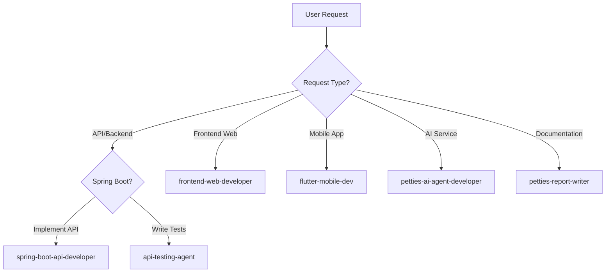

# CLAUDE.md

This file provides guidance to Claude Code (claude.ai/code) when working with code in this repository.

## Project Timeline

- **Project:** Petties - Veterinary Appointment Booking Platform
- **Timeline:** 13 Sprints (1 week/Sprint), 10/12/2025 - 11/03/2026
- **WBS Reference:** `docs-references/documentation/WBS_PETTIES_14_SPRINTS.md`
- **Documentation Path:** `docs-references/`

## Project Overview

Petties is a veterinary appointment booking platform connecting pet owners with veterinary clinics. The platform uses a clinic-centric model where pet owners book with clinics, and clinic managers assign appropriate vets.

## Architecture

**Monorepo with 4 main services:**

- `petties-web/` - React 19 + Vite + TypeScript (Admin/Clinic dashboards)
- `backend-spring/petties/` - Spring Boot 4.0 + Java 21 (REST API)
- `petties-agent-serivce/` - FastAPI + Python 3.12 (AI Multi-Agent System)
- `petties_mobile/` - Flutter 3.5 (Pet Owner/Vet mobile app)

**Databases:** PostgreSQL 16 (primary), MongoDB 7 (documents), Qdrant Cloud (vectors), firebase (push messages)

**AI Layer:** LangGraph multi-agent system (Main/Booking/Medical/Research agents), Ollama (hybrid local for dev/cloud for prod), LlamaIndex for RAG

## Development Commands

### Quick Start (Databases only, services local)
```bash
docker-compose -f docker-compose.dev.yml up -d postgres mongodb
```

### Web Frontend
```bash
cd petties-web
npm install
npm run dev          # http://localhost:5173
npm run build        # Production build
npm run lint         # ESLint
```

### Backend (Spring Boot)
```bash
cd backend-spring/petties
mvn spring-boot:run              # http://localhost:8080
mvn test                         # Run all tests
mvn test -Dtest=UserTest         # Single test class
mvn clean package -DskipTests    # Build JAR
```

### AI Service (FastAPI)
```bash
cd petties-agent-serivce
python -m venv venv && venv\Scripts\activate  # Windows
pip install -r requirements.txt
alembic upgrade head                           # Run migrations
python -m uvicorn app.main:app --reload --port 8000  # http://localhost:8000
pytest                                         # Run all tests
pytest tests/test_api.py -v                    # Single test file
```

### Mobile (Flutter)
```bash
cd petties_mobile
flutter pub get
flutter run           # Development
flutter test          # Run tests
flutter build apk     # Android release
flutter build ipa     # iOS release
```

### Docker
```bash
docker-compose -f docker-compose.dev.yml up --build -d   # Full stack
docker-compose -f docker-compose.dev.yml logs -f backend # Service logs
docker-compose -f docker-compose.dev.yml down -v         # Reset (deletes data)
```

## Role-Platform Matrix

| Role | Web | Mobile |
|------|-----|--------|
| PET_OWNER | - | Mobile only |
| VET | Web + Mobile | Web + Mobile |
| CLINIC_OWNER | Web only | - |
| CLINIC_MANAGER | Web only | - |
| ADMIN | Web only | - |

## Key Technical Patterns

### Backend (Spring Boot)
- Layered: Controller → Service → Repository
- JWT auth with refresh tokens (Spring Security 6.x)
- Global exception handling via `GlobalExceptionHandler`
- Validation with Vietnamese messages on DTOs (`@NotBlank`, `@Size`, etc.)
- Profiles: `dev` (local Docker DBs), `prod` (Neon/Atlas)

### Frontend (React)
- State management: Zustand stores (`src/store/`)
- API calls: Axios with centralized client (`src/services/api/`)
- Routing: React Router v7 with role-based guards
- Styling: Tailwind CSS v4 with **Neobrutalism** design (no rounded corners, thick black borders, offset shadows)

### AI Service (FastAPI)
- Multi-agent: LangGraph with supervisor pattern
- Config: DB-based dynamic configuration (agents, prompts, tools)
- Tools: Code-based only (scanned from `app/core/tools/`)
- LLM: Ollama hybrid (local `http://localhost:11434` or cloud with `OLLAMA_API_KEY`)

### Mobile (Flutter)
- State: Provider pattern
- Routing: GoRouter with role-based guards
- Auth: JWT stored in SharedPreferences, Google Sign-In supported

## Design System

**Style: Neobrutalism**
- Borders: 4px solid black, no border-radius
- Shadows: `4px 4px 0 #1c1917` (offset, no blur)
- Colors: Amber palette (primary), Stone palette (neutral)
- Typography: Inter font, uppercase headings, font-weight 700
- **No emojis in UI** - use Heroicons instead

## Environment & Deployment

### Three Environments

| Environment | FE URL | BE URL | Branch | Database |
|-------------|--------|--------|--------|----------|
| **Local Dev** | `localhost:5173` | `localhost:8080` | `feature/*` | Docker |
| **Test** | `test.petties.world` | `api-test.petties.world` | `develop` | Neon Test Branch |
| **Production** | `www.petties.world` | `api.petties.world` | `main` | Neon Main |

### CI/CD Pipeline (GitHub Actions)

| Workflow | Trigger | Purpose |
|----------|---------|--------|
| `ci.yml` | PR → develop/main | Build + Test (gate before merge) |
| `deploy-test.yml` | Push develop | Auto deploy Test Env |
| `deploy-ec2.yml` | Push main | Auto deploy Production |

### Docker Compose Files

| File | Use Case |
|------|----------|
| `docker-compose.dev.yml` | Local development (full stack) |
| `docker-compose.test.yml` | Test Env on EC2 (ports 8081/8001) |
| `docker-compose.prod.yml` | Production on EC2 (ports 8080/8000) |

Copy `.env.example` to `.env` for local, `.env.test` for Test Env.

## Project Rules
0. Always response in Vietnamese.
1. Always references in `docs-references/` folder to avoid out of scope.
2. Always comprehensive all plan and got a user accepted before execute code.
3. Always clearly dev environment and production environment, make sure best practice project structure.
4. Pet owner not use web (only mobile app), vet also use mobile app, clinic owner only use web, clinic manager only use web, admin web only.
5. Always comprehensive project structure, never missing any folder and file, always follows best practice.
6. Always ensure APIs Spring Boot design have API documentation (Swagger).
7. **Environments**: "dev" = localhost (feature/* branches), "test" = test.petties.world + api-test.petties.world (develop branch), "prod" = www.petties.world + api.petties.world (main branch).
8. If update docs, should update the docs to lasted version and date.
9. Make sure get context all project structure before coding to avoid duplicate.
10. When write docs do not import any description use ASCII art (┌, ─, │, └, etc.), should add mermaid diagram code (if any) and necessary content.
11. Create Unit Testing and System testing for new feature use JUnit for Spring Boot and pytest for Python.
12. If done feature or usecase should be update to docs-references to update project status, checklist, etc,...
13. Always follow the app design style for the frontend in `docs-references/`.

## Context & Clarification Rules

14. **Ambiguous Questions**: If a user question is ambiguous or missing important information, first list the missing details and ask clarifying questions instead of guessing.
15. **Context Priority**: When answering about code, always prioritize context from:
    - `docs-references/` folder (PETTIES_Features.md, WBS, etc.)
    - Existing codebase files
    - Previous conversation
    - General knowledge (last resort)
16. **Confirm Understanding**: Before proposing major changes, summarize your current understanding in 3-5 bullet points and ask user to confirm or correct.
17. **Insufficient Context**: If context is insufficient, clearly state that you are unsure and explain which additional files or information are needed (e.g., "I need to see the BookingController.java to understand the current implementation").
18. **Multiple Interpretations**: When multiple interpretations are possible, explicitly describe each interpretation and ask the user which one is correct before implementing.
19. **File References**: For every answer involving code, mention which files, modules, or components you are assuming to be relevant:
    - Backend: `backend-spring/petties/src/main/java/com/petties/...`
    - Web: `petties-web/src/...`
    - Mobile: `petties_mobile/lib/...`
    - AI Service: `petties-agent-serivce/app/...`

## Sub-Agent Routing Rules

Dự án có 6 specialized sub-agents để xử lý các task phức tạp. Claude Code PHẢI delegate task đến đúng agent dựa trên routing rules sau:

### Agent Overview

| Agent | Model | Directory | Chuyên môn |
|-------|-------|-----------|------------|
| `spring-boot-api-developer` | opus | `backend-spring/petties/` | Spring Boot REST APIs, Entity, Service, Controller |
| `frontend-web-developer` | sonnet | `petties-web/` | React 19, TypeScript, Neobrutalism UI |
| `flutter-mobile-dev` | opus | `petties_mobile/` | Flutter, Riverpod, GoRouter |
| `petties-ai-agent-developer` | opus | `petties-agent-serivce/` | LangGraph, FastMCP, RAG, WebSocket |
| `api-testing-agent` | sonnet | `backend-spring/petties/src/test/` | JUnit 5, Mockito, Integration tests |
| `petties-report-writer` | sonnet | `docs-references/` | SRS, SDD, Testing docs, Diagrams |

### Routing Decision Matrix



### Routing Rules Chi Tiết

#### 1. `spring-boot-api-developer` - Backend API Development
**Trigger khi user yêu cầu:**
- Tạo Entity, Repository, Service, Controller mới
- Thêm endpoint REST API
- Implement business logic trong Service layer
- Thêm validation, exception handling
- Tạo DTOs (Request/Response)
- Cấu hình Spring Security cho endpoints

**Keywords:** API, endpoint, entity, service, controller, DTO, validation, Spring Boot

**Ví dụ:**
- "Tạo API quản lý booking"
- "Thêm endpoint lấy danh sách clinic"
- "Implement service tính toán slot khám"

---

#### 2. `frontend-web-developer` - React Web Dashboard
**Trigger khi user yêu cầu:**
- Tạo trang dashboard mới cho Admin/Clinic Owner/Clinic Manager/Vet
- Tạo components UI (forms, tables, cards, modals)
- Implement Zustand stores
- Kết nối API với Axios
- Fix styling theo Neobrutalism

**Keywords:** trang, component, dashboard, form, table, React, Zustand, Tailwind, Neobrutalism

**Ví dụ:**
- "Tạo trang quản lý lịch hẹn cho Clinic Manager"
- "Thêm component bảng danh sách thú cưng"
- "Fix styling không đúng Neobrutalism"

**Lưu ý:** KHÔNG dùng cho PET_OWNER features (họ chỉ dùng mobile)

---

#### 3. `flutter-mobile-dev` - Flutter Mobile App
**Trigger khi user yêu cầu:**
- Tạo màn hình mobile mới cho Pet Owner hoặc Vet
- Tạo widgets reusable
- Implement Riverpod providers
- Cấu hình GoRouter navigation
- Tích hợp API services

**Keywords:** màn hình, screen, widget, Flutter, Riverpod, GoRouter, mobile

**Ví dụ:**
- "Tạo màn hình đặt lịch khám cho pet owner"
- "Thêm Riverpod provider cho appointment list"
- "Fix navigation từ home sang booking"

---

#### 4. `petties-ai-agent-developer` - AI Agent Service
**Trigger khi user yêu cầu:**
- Tạo/modify LangGraph agents (Main, Booking, Medical, Research)
- Implement FastMCP tools với @mcp.tool decorator
- Xây dựng RAG pipeline (LlamaIndex + Cohere + Qdrant)
- Cấu hình WebSocket streaming
- Tích hợp OpenRouter API

**Keywords:** agent, LangGraph, MCP tool, RAG, Qdrant, WebSocket, AI service, embedding

**Ví dụ:**
- "Tạo Booking Agent xử lý đặt lịch"
- "Thêm tool tìm kiếm phòng khám gần đây"
- "Thiết lập RAG pipeline cho tư vấn y tế"

---

#### 5. `api-testing-agent` - Backend API Testing
**Trigger khi user yêu cầu:**
- Viết unit tests với JUnit 5 + Mockito
- Viết integration tests với @SpringBootTest
- Test authentication/authorization flows
- Review test coverage
- Viết tests cho endpoint mới vừa implement

**Keywords:** test, JUnit, Mockito, @SpringBootTest, coverage, unit test, integration test

**Ví dụ:**
- "Viết tests cho booking endpoint"
- "Test authentication flow"
- "Kiểm tra test coverage cho VetController"

**Best Practice:** SAU KHI `spring-boot-api-developer` implement xong API, LUÔN gọi `api-testing-agent` để viết tests.

---

#### 6. `petties-report-writer` - Technical Documentation
**Trigger khi user yêu cầu:**
- Viết Use Cases, User Stories (SRS - Report 3)
- Viết API Design, Sequence/Class diagrams (SDD - Report 4)
- Viết Test Plans, Test Cases (Testing Docs - Report 5)
- Cập nhật Functional/Non-functional Requirements
- Tạo Mermaid diagrams

**Keywords:** use case, user story, requirements, SRS, SDD, test case, test plan, diagram, documentation, report

**Ví dụ:**
- "Viết Use Case cho tính năng đặt lịch"
- "Tạo Sequence Diagram cho flow thanh toán"
- "Viết Test Cases cho feature quản lý clinic"

---

### Workflow Khuyến Nghị

Khi implement feature mới, follow thứ tự sau:

1. **Plan** - Dùng `petties-report-writer` để viết Use Cases, Requirements
2. **Backend** - Dùng `spring-boot-api-developer` để implement APIs
3. **Test Backend** - Dùng `api-testing-agent` để viết tests cho APIs
4. **Frontend/Mobile** - Dùng `frontend-web-developer` hoặc `flutter-mobile-dev`
5. **AI Integration** - Dùng `petties-ai-agent-developer` nếu cần AI features
6. **Documentation** - Dùng `petties-report-writer` để update docs

### Parallel Execution

Có thể chạy song song các agents khi tasks độc lập:
- `spring-boot-api-developer` + `frontend-web-developer` (nếu API contract đã rõ)
- `api-testing-agent` cho nhiều controllers cùng lúc
- `petties-report-writer` cho nhiều diagrams khác nhau

## Important Documentation

**Features & Architecture:**
- `docs-references/documentation/PETTIES_Features.md` - Complete feature list
- `docs-references/documentation/TECHNICAL SCOPE PETTIES - AGENT MANAGEMENT.md` - AI architecture
- `docs-references/documentation/VET_SCHEDULING_STRATEGY.md` - Slot-based booking system
- `docs-references/documentation/BUSINESS_WORKFLOW_BPMN.md` - Business processes

**Development & Deployment:**
- `docs-references/development/SOURCE_CODE_MANAGEMENT_RULES.md` - Git workflow for team of 5
- `docs-references/deployment/EC2_PRODUCTION_DEPLOYMENT.md` - EC2 deployment guide
- `docs-references/deployment/VERCEL_PRODUCTION_SETUP.md` - Vercel FE setup
- `docs-references/deployment/TEST_ENVIRONMENT_SETUP.md` - Test Env setup guide

**Design:**
- `docs-references/design/design-style-guide.md` - Neobrutalism UI guide
