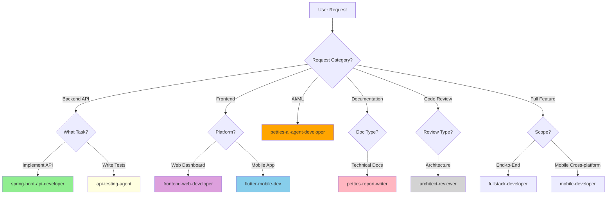

# CLAUDE.md

This file provides guidance to Claude Code (claude.ai/code) when working with code in this repository.

## Project Timeline

- **Project:** Petties - Veterinary Appointment Booking Platform
- **Timeline:** 13 Sprints (1 week/Sprint), 10/12/2025 - 11/03/2026
- **WBS Reference:** `docs-references/documentation/WBS_PETTIES_14_SPRINTS.md`
- **Documentation Path:** `docs-references/`

## Project Overview

Petties is a veterinary appointment booking platform connecting pet owners with veterinary clinics. The platform uses a clinic-centric model where pet owners book with clinics, and clinic managers assign appropriate vets.

## Architecture

**Monorepo with 4 main services:**

- `petties-web/` - React 19 + Vite + TypeScript (Admin/Clinic dashboards)
- `backend-spring/petties/` - Spring Boot 4.0 + Java 21 (REST API)
- `petties-agent-serivce/` - FastAPI + Python 3.12 (AI Single Agent + ReAct)
- `petties_mobile/` - Flutter 3.5 (Pet Owner/Vet mobile app)

**Databases:** PostgreSQL 16 (primary), MongoDB 7 (documents), Redis 7 (OTP/cache), Qdrant Cloud (vectors), Firebase (push messages)

**AI Layer:** Single Agent với ReAct pattern (LangGraph), **LLM Provider (Cloud API Only):** **OpenRouter**, LlamaIndex for RAG, Qdrant Cloud for vectors, Cohere for embeddings.
## Development Commands

### Quick Start (Databases only, services local)
```bash
docker-compose -f docker-compose.dev.yml up -d postgres mongodb redis
```

### Web Frontend
```bash
cd petties-web
npm install
npm run dev          # http://localhost:5173
npm run build        # Production build
npm run lint         # ESLint
```

### Backend (Spring Boot)
```bash
cd backend-spring/petties
mvn spring-boot:run              # http://localhost:8080
mvn test                         # Run all tests
mvn test -Dtest=UserTest         # Single test class
mvn clean package -DskipTests    # Build JAR
```

### AI Service (FastAPI)
```bash
cd petties-agent-serivce
python -m venv venv && venv\Scripts\activate  # Windows
pip install -r requirements.txt
alembic upgrade head                           # Run migrations
python -m uvicorn app.main:app --reload --port 8000  # http://localhost:8000
pytest                                         # Run all tests
pytest tests/test_api.py -v                    # Single test file
```

### Mobile (Flutter)
```bash
cd petties_mobile
flutter pub get
flutter run           # Development
flutter test          # Run tests
flutter build apk     # Android release
flutter build ipa     # iOS release
```

### Docker
```bash
docker-compose -f docker-compose.dev.yml up --build -d   # Full stack
docker-compose -f docker-compose.dev.yml logs -f backend # Service logs
docker-compose -f docker-compose.dev.yml down -v         # Reset (deletes data)
```

## Role-Platform Matrix

| Role | Web | Mobile |
|------|-----|--------|
| PET_OWNER | - | Mobile only |
| VET | Web + Mobile | Web + Mobile |
| CLINIC_OWNER | Web only | - |
| CLINIC_MANAGER | Web only | - |
| ADMIN | Web only | - |

## Key Technical Patterns

### Backend (Spring Boot)
- Layered: Controller → Service → Repository
- JWT auth with refresh tokens (Spring Security 6.x)
- Global exception handling via `GlobalExceptionHandler`
- Validation with Vietnamese messages on DTOs (`@NotBlank`, `@Size`, etc.)
- Profiles: `dev` (local Docker DBs), `test` (Cloud DBs), `prod` (Neon/Atlas/Redis Cloud)
- Redis for OTP storage with TTL (Registration & Password Reset,..)

### Frontend (React)
- State management: Zustand stores (`src/store/`)
- API calls: Axios with centralized client (`src/services/api/`)
- Routing: React Router v7 with role-based guards
- Styling: Tailwind CSS v4 with **Neobrutalism** design (no rounded corners, thick black borders, offset shadows)

### AI Service (FastAPI)
- Single Agent: LangGraph với ReAct pattern (Thought → Action → Observation)
- Config: DB-based dynamic configuration (prompt, parameters, tools)
- Tools: FastMCP với @mcp.tool decorator
  - `pet_care_qa` - RAG-based Q&A
  - `symptom_search` - Symptom → Disease lookup
  - `search_clinics` - Find nearby clinics
  - `check_slots` - Check available slots
  - `create_booking` - Create booking via chat
- LLM: OpenRouter Cloud API (gemini-2.0-flash, llama-3.3-70b, claude-3.5-sonnet)
- RAG: LlamaIndex + Qdrant Cloud + Cohere embed-multilingual-v3


### Mobile (Flutter)
- State: Provider pattern
- Routing: GoRouter with role-based guards
- Auth: JWT stored in SharedPreferences, Google Sign-In supported

## Design System

**Style: Neobrutalism**
- Borders: 4px solid black, no border-radius
- Shadows: `4px 4px 0 #1c1917` (offset, no blur)
- Colors: Amber palette (primary), Stone palette (neutral)
- Typography: Inter font, uppercase headings, font-weight 700
- **No emojis in UI** - use Heroicons instead

## Environment & Deployment

### Three Environments

| Environment | FE URL | BE URL | Branch | Database |
|-------------|--------|--------|--------|----------|
| **Local Dev** | `localhost:5173` | `localhost:8080` | `feature/*` | Docker |
| **Test** | `test.petties.world` | `api-test.petties.world` | `develop` | Neon Test Branch |
| **Production** | `www.petties.world` | `api.petties.world` | `main` | Neon Main |

### CI/CD Pipeline (GitHub Actions)

| Workflow | Trigger | Purpose |
|----------|---------|--------|
| `ci.yml` | PR → develop, main | Build + Lint + Test (Frontend, Backend, AI Service) |
| `deploy-test.yml` | Push → develop | Auto Deploy to EC2 Test Environment |
| `deploy-ec2.yml` | Push → main | Auto Deploy to EC2 Production |
| `mobile-ci-cd.yml` | Manual Dispatch | Build & Deploy Mobile App (Android/iOS) to Firebase/TestFlight |


### Docker Compose Files

| File | Use Case |
|------|----------|
| `docker-compose.dev.yml` | Local development (full stack) |
| `docker-compose.test.yml` | Test Env on EC2 (ports 8081/8001) |
| `docker-compose.prod.yml` | Production on EC2 (ports 8080/8000) |

Copy `.env.example` to `.env` for local, `.env.test` for Test Env.

## Project Rules
0. Always response in Vietnamese.
1. Always references in `docs-references/` folder to avoid out of scope.
2. Always comprehensive all plan and got a user accepted before execute code.
3. Always clearly dev environment, test environment and production environment, make sure best practice project structure.
4. Pet owner not use web (only mobile app), vet also use mobile app, clinic owner only use web, clinic manager only use web, admin web only.
5. Always comprehensive project structure, never missing any folder and file, always follows best practice.
6. Always ensure APIs Spring Boot design have API documentation (Swagger).
7. **Environments**: "dev" = localhost (feature/* branches), "test" = test.petties.world + api-test.petties.world (develop branch), "prod" = www.petties.world + api.petties.world (main branch).
8. If update docs, should update the docs to lasted version and date.
9. Make sure get context all project structure before coding to avoid duplicate.
10. When write docs do not import any description use ASCII art (┌, ─, │, └, etc.), should add mermaid diagram code (if any) and necessary content.
11. Create Unit Testing and System testing for new feature use JUnit for Spring Boot and pytest for Python.
12. If done feature or usecase should be update to docs-references to update project status, checklist, etc,...
13. Always follow the app design style for the frontend in `docs-references/`.
14. Từ giờ, mỗi khi bạn thêm trường mới vào Entity trong Java, hãy nhớ tạo thêm file migration tương ứng nhé! Chi tiết trong file DATABASE_MIGRATION_GUIDE.md
Tạo Script: Tạo file SQL mới với định dạng V<Timestamp>__<tên_mô_tả>.sql.
Sai: V2__add_phone.sql (Dễ trùng nếu 2 người cùng làm).
Đúng: V202412301030__add_phone_to_users.sql (Định dạng: V + NămThángNgàyGiờPhút).
Lưu ý: Giữa Version và Mô tả phải có 2 dấu gạch dưới (__).
Áp dụng: Flyway sẽ tự động chạy script này khi ứng dụng khởi động.

## Context & Clarification Rules

14. **Ambiguous Questions**: If a user question is ambiguous or missing important information, first list the missing details and ask clarifying questions instead of guessing.
15. **Context Priority**: When answering about code, always prioritize context from:
    - `docs-references/` folder (PETTIES_Features.md, WBS, etc.)
    - Existing codebase files
    - Previous conversation
    - General knowledge (last resort)
16. **Confirm Understanding**: Before proposing major changes, summarize your current understanding in 3-5 bullet points and ask user to confirm or correct.
17. **Insufficient Context**: If context is insufficient, clearly state that you are unsure and explain which additional files or information are needed (e.g., "I need to see the BookingController.java to understand the current implementation").
18. **Multiple Interpretations**: When multiple interpretations are possible, explicitly describe each interpretation and ask the user which one is correct before implementing.
19. **File References**: For every answer involving code, mention which files, modules, or components you are assuming to be relevant:
    - Backend: `backend-spring/petties/src/main/java/com/petties/...`
    - Web: `petties-web/src/...`
    - Mobile: `petties_mobile/lib/...`
    - AI Service: `petties-agent-serivce/app/...`

## Sub-Agent Routing Rules

Dự án có **9 specialized sub-agents** để xử lý các task phức tạp. Claude Code PHẢI delegate task đến đúng agent dựa trên routing rules sau:

### Agent Overview

**Petties-Specific Agents (6):**
| Agent | Model | Color | Directory | Chuyên môn |
|-------|-------|-------|-----------|------------|
| `spring-boot-api-developer` | opus | green | `backend-spring/petties/` | Spring Boot REST APIs, Entity, Service, Controller, DTOs |
| `frontend-web-developer` | sonnet | purple | `petties-web/` | React 19, TypeScript, Zustand, Neobrutalism UI |
| `flutter-mobile-dev` | opus | default | `petties_mobile/` | Flutter, Dart, Riverpod, GoRouter, Mobile UI |
| `petties-ai-agent-developer` | opus | orange | `petties-agent-serivce/` | Single Agent, ReAct (LangGraph), FastMCP, RAG, OpenRouter, Qdrant |
| `api-testing-agent` | sonnet | yellow | `backend-spring/petties/src/test/` | JUnit 5, Mockito, @WebMvcTest, API Testing |
| `petties-report-writer` | sonnet | pink | `docs-references/` | SRS, SDD, Testing docs, Use Cases, Mermaid diagrams |

**General-Purpose Agents (3):**
| Agent | Model | Color | Use Case |
|-------|-------|-------|----------|
| `architect-reviewer` | opus | gray | Architecture review, SOLID principles, design patterns |
| `mobile-developer` | sonnet | default | Cross-platform mobile (React Native/Flutter), offline sync |
| `fullstack-developer` | opus | default | Full-stack end-to-end features (Node.js, React, databases) |

### Routing Decision Matrix



### Routing Rules Chi Tiết

#### 1. `spring-boot-api-developer` - Backend API Development
**Trigger khi user yêu cầu:**
- Tạo Entity, Repository, Service, Controller mới
- Thêm endpoint REST API
- Implement business logic trong Service layer
- Thêm validation, exception handling
- Tạo DTOs (Request/Response)
- Cấu hình Spring Security cho endpoints

**Keywords:** API, endpoint, entity, service, controller, DTO, validation, Spring Boot

**Ví dụ:**
- "Tạo API quản lý booking"
- "Thêm endpoint lấy danh sách clinic"
- "Implement service tính toán slot khám"

---

#### 2. `frontend-web-developer` - React Web Dashboard
**Trigger khi user yêu cầu:**
- Tạo trang dashboard mới cho Admin/Clinic Owner/Clinic Manager/Vet
- Tạo components UI (forms, tables, cards, modals)
- Implement Zustand stores
- Kết nối API với Axios
- Fix styling theo Neobrutalism

**Keywords:** trang, component, dashboard, form, table, React, Zustand, Tailwind, Neobrutalism

**Ví dụ:**
- "Tạo trang quản lý lịch hẹn cho Clinic Manager"
- "Thêm component bảng danh sách thú cưng"
- "Fix styling không đúng Neobrutalism"

**Lưu ý:** KHÔNG dùng cho PET_OWNER features (họ chỉ dùng mobile)

---

#### 3. `flutter-mobile-dev` - Flutter Mobile App
**Trigger khi user yêu cầu:**
- Tạo màn hình mobile mới cho Pet Owner hoặc Vet
- Tạo widgets reusable
- Implement Riverpod providers
- Cấu hình GoRouter navigation
- Tích hợp API services

**Keywords:** màn hình, screen, widget, Flutter, Riverpod, GoRouter, mobile

**Ví dụ:**
- "Tạo màn hình đặt lịch khám cho pet owner"
- "Thêm Riverpod provider cho appointment list"
- "Fix navigation từ home sang booking"

---

#### 4. `petties-ai-agent-developer` - AI Agent Service
**Trigger khi user yêu cầu:**
- Develop/modify **Single Agent** với **ReAct pattern** (LangGraph)
- Implement FastMCP tools với `@mcp.tool` decorator (code-based, NOT Swagger import)
- Xây dựng RAG pipeline (LlamaIndex + Cohere embeddings + Qdrant Cloud)
- Cấu hình WebSocket streaming cho real-time chat
- Tích hợp **OpenRouter Cloud API** (gemini-2.0-flash, llama-3.3-70b, claude-3.5-sonnet)
- Develop Admin Dashboard cho Agent Management:
  - Agent enable/disable, system prompt editor
  - Hyperparameters config (Temperature, Max Tokens, Top-P)
  - Tool governance (enable/disable individual tools)
  - Knowledge base management (upload docs, test retrieval)
  - ReAct flow visualization & debugging

**Important Notes:**
- ❌ **KHÔNG phải Multi-Agent** (no supervisor, no specialized agents)
- ✅ **Single Agent + Multiple Tools** architecture
- ❌ **KHÔNG dùng local Ollama** - Cloud API only (OpenRouter)
- ✅ **Tools are code-based** với semantic descriptions, NOT auto-imported từ Swagger

**Keywords:** Single Agent, ReAct, LangGraph, @mcp.tool, RAG, Qdrant Cloud, OpenRouter, WebSocket, system prompt, hyperparameters, knowledge base

**Ví dụ:**
- "Thêm tool `search_clinics` để agent tìm phòng khám gần user"
- "Thiết lập RAG pipeline với Qdrant Cloud cho pet care Q&A"
- "Config ReAct flow visualization trong Admin Dashboard"
- "Implement system prompt versioning cho agent"
- "Thêm hyperparameters slider cho Temperature tuning"
- "Debug ReAct loop: Thought → Action → Observation"

---

#### 5. `api-testing-agent` - Backend API Testing
**Trigger khi user yêu cầu:**
- Viết unit tests với JUnit 5 + Mockito
- Viết integration tests với @SpringBootTest
- Test authentication/authorization flows
- Review test coverage
- Viết tests cho endpoint mới vừa implement

**Keywords:** test, JUnit, Mockito, @SpringBootTest, coverage, unit test, integration test

**Ví dụ:**
- "Viết tests cho booking endpoint"
- "Test authentication flow"
- "Kiểm tra test coverage cho VetController"

**Best Practice:** SAU KHI `spring-boot-api-developer` implement xong API, LUÔN gọi `api-testing-agent` để viết tests.

---

#### 6. `petties-report-writer` - Technical Documentation
**Trigger khi user yêu cầu:**
- Viết Use Cases, User Stories (SRS - Report 3)
- Viết API Design, Sequence/Class diagrams (SDD - Report 4)
- Viết Test Plans, Test Cases (Testing Docs - Report 5)
- Cập nhật Functional/Non-functional Requirements
- Tạo Mermaid diagrams

**Keywords:** use case, user story, requirements, SRS, SDD, test case, test plan, diagram, documentation, report

**Ví dụ:**
- "Viết Use Case cho tính năng đặt lịch"
- "Tạo Sequence Diagram cho flow thanh toán"
- "Viết Test Cases cho feature quản lý clinic"

---

#### 7. `architect-reviewer` - Architecture Review
**Trigger khi user yêu cầu:**
- Review code cho architectural consistency
- Kiểm tra SOLID principles violations
- Phân tích service boundaries và dependencies
- Review pull request với structural changes
- Đánh giá design patterns trong codebase
- Validate refactoring approach

**Keywords:** architecture, review, SOLID, design pattern, refactoring, dependency, modularity

**Ví dụ:**
- "Review architecture của booking service"
- "Kiểm tra code có vi phạm SOLID principles không"
- "Phân tích dependencies giữa các modules"

**Lưu ý:** Dùng khi cần architectural perspective, KHÔNG dùng cho feature implementation.

---

#### 8. `mobile-developer` - Cross-Platform Mobile
**Trigger khi user yêu cầu:**
- Implement React Native features (nếu project có RN)
- Tích hợp native modules (iOS/Android)
- Thiết lập offline-first data sync
- Cấu hình push notifications cross-platform
- Optimize app performance và bundle size
- Setup build configuration cho app stores

**Keywords:** React Native, native module, offline sync, push notification, app performance, cross-platform

**Ví dụ:**
- "Setup push notifications cho cả iOS và Android"
- "Implement offline sync với SQLite"
- "Tích hợp native camera module"

**Lưu ý:** Dùng khi cần cross-platform mobile expertise. Nếu chỉ Flutter, dùng `flutter-mobile-dev`.

---

#### 9. `fullstack-developer` - Full-Stack End-to-End
**Trigger khi user yêu cầu:**
- Implement complete feature từ database đến UI
- Setup new microservice với Node.js/Express/FastAPI
- Integrate frontend với backend APIs
- Design database schema và migrations
- Setup CI/CD pipeline cho full stack
- Implement authentication flow end-to-end

**Keywords:** full-stack, end-to-end, microservice, Node.js, Express, database design, CI/CD

**Ví dụ:**
- "Implement payment feature từ database đến UI"
- "Setup new microservice cho notifications"
- "Tạo authentication flow hoàn chỉnh"

**Lưu ý:** Dùng khi cần end-to-end implementation NGOÀI các agents Petties-specific. Ưu tiên dùng Petties agents trước.

---

### Agent Collaboration Patterns

Một số tasks phức tạp cần nhiều agents làm việc cùng nhau. Dưới đây là các collaboration patterns khuyến nghị:

#### Pattern 1: Feature Implementation (Sequential)
```
petties-report-writer (Use Cases)
  → spring-boot-api-developer (APIs)
  → api-testing-agent (Tests)
  → frontend-web-developer/flutter-mobile-dev (UI)
  → petties-report-writer (Update docs)
```

**Ví dụ:** Implement feature "Pet Vaccination Management"
1. `petties-report-writer`: Viết Use Cases, Requirements
2. `spring-boot-api-developer`: Tạo Vaccination Entity, Service, Controller
3. `api-testing-agent`: Viết tests cho Vaccination endpoints
4. `flutter-mobile-dev`: Tạo màn hình vaccination records cho pet owner
5. `petties-report-writer`: Cập nhật SDD với API docs

---

#### Pattern 2: Parallel Development (Concurrent)
```
[spring-boot-api-developer] + [frontend-web-developer] + [flutter-mobile-dev]
  (Chạy song song khi API contract đã được define)
```

**Điều kiện:** API contract (endpoints, request/response schemas) đã rõ ràng

**Ví dụ:** Implement "Clinic Search" feature
- Backend dev implement search API
- Web dev tạo search UI cho admin
- Mobile dev tạo search screen cho pet owner
(Cả 3 agents chạy song song dựa trên API contract đã định nghĩa)

---

#### Pattern 3: AI-Enhanced Feature (Hybrid)
```
spring-boot-api-developer (REST APIs)
  + petties-ai-agent-developer (AI Service)
  → flutter-mobile-dev (Mobile UI with AI chat)
```

**Ví dụ:** Implement "AI Symptom Checker"
1. `spring-boot-api-developer`: Tạo API lưu chat history, pet medical records
2. `petties-ai-agent-developer`: Implement Single Agent với `symptom_search` tool + RAG pipeline
3. `flutter-mobile-dev`: Tạo chat UI với WebSocket streaming + ReAct flow display

---

#### Pattern 4: Code Quality Assurance (Review → Fix)
```
spring-boot-api-developer (Implement feature)
  → architect-reviewer (Review architecture)
  → api-testing-agent (Add tests)
  → spring-boot-api-developer (Refactor based on feedback)
```

**Ví dụ:** Implement new Payment Service
1. `spring-boot-api-developer`: Implement PaymentService
2. `architect-reviewer`: Review service boundaries, dependency injection
3. `api-testing-agent`: Add comprehensive test coverage
4. `spring-boot-api-developer`: Refactor theo architectural feedback

---

### Priority Matrix

Khi một user request có thể trigger nhiều agents, sử dụng priority matrix này để chọn agent phù hợp:

| Request Type | Primary Agent | Fallback Agent | Notes |
|-------------|---------------|----------------|-------|
| Spring Boot API implementation | `spring-boot-api-developer` | `fullstack-developer` | Luôn ưu tiên Petties-specific agent |
| React Web UI | `frontend-web-developer` | `fullstack-developer` | Petties agent hiểu Neobrutalism design |
| Flutter Mobile | `flutter-mobile-dev` | `mobile-developer` | flutter-mobile-dev biết Petties architecture |
| AI Agent/RAG | `petties-ai-agent-developer` | - | Chỉ có agent này có LangGraph expertise |
| API Testing | `api-testing-agent` | - | Specialized cho Petties testing strategy |
| Documentation | `petties-report-writer` | - | Hiểu Petties docs structure |
| Architecture Review | `architect-reviewer` | - | General agent, không Petties-specific |
| Cross-platform Mobile | `flutter-mobile-dev` | `mobile-developer` | Petties dùng Flutter, không RN |
| Full-stack Feature | Combine Petties agents | `fullstack-developer` | Break down thành subtasks cho specific agents |

**Quy tắc vàng:** LUÔN ưu tiên Petties-specific agents (1-6) trước khi dùng general agents (7-9).

---

### Workflow Khuyến Nghị

#### Workflow A: New Feature Implementation (Full Cycle)
```
1. Plan          → petties-report-writer (Use Cases, Requirements)
2. Backend       → spring-boot-api-developer (APIs)
3. Test Backend  → api-testing-agent (Unit & Integration tests)
4. Frontend/Mobile:
   - Web         → frontend-web-developer
   - Mobile      → flutter-mobile-dev
5. AI (if needed) → petties-ai-agent-developer
6. Documentation → petties-report-writer (Update SDD, Testing docs)
```

**Thời điểm:** Khi implement feature mới hoàn chỉnh

---

#### Workflow B: Bug Fix (Quick Fix)
```
1. Identify Layer → Grep/Read tools
2. Fix Code:
   - Backend Bug  → spring-boot-api-developer
   - Web Bug      → frontend-web-developer
   - Mobile Bug   → flutter-mobile-dev
3. Add Test      → api-testing-agent (prevent regression)
```

**Thời điểm:** Khi fix bug trong existing code

---

#### Workflow C: Refactoring (Quality Improvement)
```
1. Review        → architect-reviewer (architectural analysis)
2. Plan Refactor → List files and approach
3. Refactor:
   - Backend     → spring-boot-api-developer
   - Frontend    → frontend-web-developer
4. Test Coverage → api-testing-agent (ensure no regression)
```

**Thời điểm:** Khi cải thiện code quality

---

#### Workflow D: AI Feature Addition
```
1. Backend API   → spring-boot-api-developer (endpoints for AI service)
2. AI Service    → petties-ai-agent-developer (Single Agent + ReAct, @mcp.tool tools, RAG)
3. Frontend:
   - Web         → frontend-web-developer (admin dashboard: agent config, tool management)
   - Mobile      → flutter-mobile-dev (chat UI với WebSocket + ReAct flow display)
4. Testing       → api-testing-agent (API tests)
5. Documentation → petties-report-writer (Single Agent architecture diagrams)
```

**Thời điểm:** Khi thêm AI-powered features

---

### Parallel Execution Strategy

Có thể chạy song song các agents khi tasks độc lập:

**Scenario 1: API Contract Ready**
```bash
# Chạy song song sau khi define API contract
spring-boot-api-developer + frontend-web-developer + flutter-mobile-dev
```

**Scenario 2: Multiple Controllers Testing**
```bash
# Test nhiều controllers cùng lúc
api-testing-agent (BookingController) + api-testing-agent (ClinicController) + api-testing-agent (VetController)
```

**Scenario 3: Documentation Parallel**
```bash
# Tạo nhiều diagrams/docs đồng thời
petties-report-writer (Sequence Diagrams) + petties-report-writer (Test Cases) + petties-report-writer (API Docs)
```

**Lưu ý:** Chỉ chạy parallel khi tasks KHÔNG phụ thuộc lẫn nhau.

---

### Decision Guidelines

**Khi không chắc chắn agent nào phù hợp, hỏi bản thân:**

1. **Task thuộc layer nào?**
   - Database/Entity → `spring-boot-api-developer`
   - Business Logic/Service → `spring-boot-api-developer`
   - REST API/Controller → `spring-boot-api-developer`
   - Web UI → `frontend-web-developer`
   - Mobile UI → `flutter-mobile-dev`
   - AI/ML → `petties-ai-agent-developer`

2. **Task liên quan đến test?**
   - API Testing → `api-testing-agent`
   - Frontend Testing → `frontend-web-developer` (có thể tự test)
   - Mobile Testing → `flutter-mobile-dev` (có thể tự test)

3. **Task liên quan đến docs?**
   - Use Cases/Requirements/Diagrams → `petties-report-writer`

4. **Task cần architectural review?**
   - Code review, SOLID, patterns → `architect-reviewer`

5. **Task là end-to-end feature mới?**
   - Break down thành subtasks cho các Petties agents
   - Nếu quá phức tạp → `fullstack-developer` (as fallback)

**Rule of thumb:** Khi có doubt, luôn ưu tiên Petties-specific agents (1-6) vì chúng hiểu rõ project architecture và conventions.

## Important Documentation

**Features & Architecture:**
- `docs-references/documentation/PETTIES_Features.md` - Complete feature list
- `docs-references/documentation/TECHNICAL SCOPE PETTIES - AGENT MANAGEMENT.md` - AI architecture
- `docs-references/documentation/VET_SCHEDULING_STRATEGY.md` - Slot-based booking system
- `docs-references/documentation/BUSINESS_WORKFLOW_BPMN.md` - Business processes

**Development & Deployment:**
- `docs-references/development/SOURCE_CODE_MANAGEMENT_RULES.md` - Git workflow for team of 5
- `docs-references/deployment/EC2_PRODUCTION_DEPLOYMENT.md` - EC2 deployment guide
- `docs-references/deployment/VERCEL_PRODUCTION_SETUP.md` - Vercel FE setup
- `docs-references/deployment/TEST_ENVIRONMENT_SETUP.md` - Test Env setup guide

**Design:**
- `docs-references/design/design-style-guide.md` - Neobrutalism UI guide
