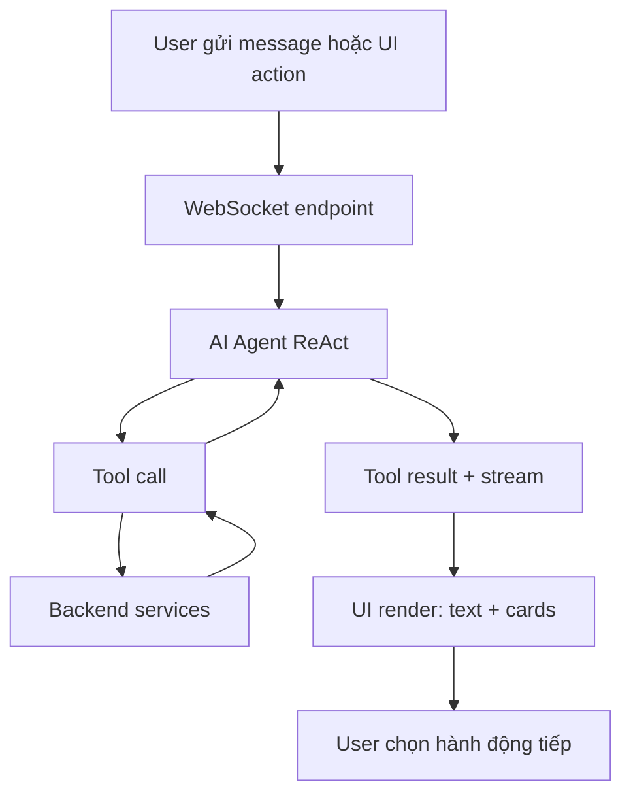
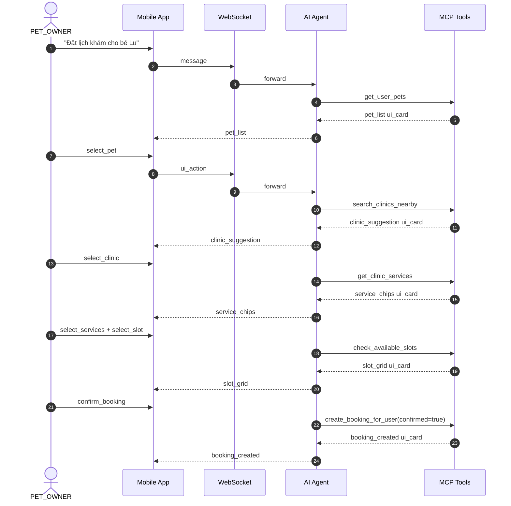

# Sách hướng dẫn sử dụng AI Agent/Chatbot

Version: 1.0.0  
Last Updated: 2026-04-03  
Scope: Hướng dẫn vận hành AI Agent/Chatbot cho PET_OWNER, STAFF, CLINIC_MANAGER, CLINIC_OWNER và ADMIN

---

## 1. Mục tiêu tài liệu

Tài liệu này hướng dẫn sử dụng đầy đủ AI Agent/Chatbot theo từng vai trò, tập trung vào:

- Chat ReAct qua WebSocket
- Interactive booking an toàn cho PET_OWNER
- Copilot hỗ trợ vận hành phòng khám cho CLINIC_MANAGER/CLINIC_OWNER
- Runbook cấu hình, giám sát và xử lý sự cố cho đội kỹ thuật/ADMIN

---

## 2. Vai trò, kênh dùng và phạm vi

| Vai trò | Nền tảng | Mục tiêu chính | Ghi chú |
|---|---|---|---|
| PET_OWNER | Mobile | Hỏi đáp sức khỏe, đặt lịch qua chat | Booking chỉ tạo sau xác nhận rõ ràng |
| STAFF | Web/Mobile | Tra cứu nghiệp vụ trong phạm vi cho phép | Không thay thế quy trình EMR chính thức |
| CLINIC_MANAGER | Web | Copilot quản lý dịch vụ, vận hành | Write action cần cơ chế xác nhận |
| CLINIC_OWNER | Web | Copilot setup và tối ưu phòng khám | Ưu tiên HITL cho mọi thao tác ghi dữ liệu |
| ADMIN | Web | Cấu hình model/tool/knowledge, monitor | Chủ yếu quản trị, không là end-user chat thường xuyên |

---

## 3. Kiến trúc luồng chat tổng quan



Tham chiếu chi tiết:

- `docs-references/ai-agent/AI_CHAT_WEBSOCKET_CONTRACT.md`

---

## 4. WebSocket contract cần nắm

### 4.1 Kết nối

- Endpoint:
  - `ws(s)://<AI_SERVICE_ROOT>/ws/chat/{session_id}?token=<JWT>&context_type=BUSINESS_CHAT`
- Payload truyền và nhận đều ở dạng JSON.

### 4.2 Client gửi lên server

1. Tin nhắn thường:

```json
{ "message": "Tôi muốn đặt lịch tiêm phòng cho bé Lu" }
```

2. UI action:

```json
{
  "message": "",
  "ui_action": { "type": "select_pet", "pet_id": "pet-123" }
}
```

Lưu ý quan trọng:

- Khi gửi `ui_action`, phải giữ `message` là chuỗi rỗng để tránh lưu nhầm JSON action vào history text.

### 4.3 Server trả về client

Event chuẩn:

- `connected`, `history`, `ack`, `thinking`, `tool_call`, `tool_result`, `stream`, `complete`, `error`

UI card tiêu biểu:

- `pet_list`
- `clinic_suggestion`
- `service_chips`
- `slot_grid`
- `booking_summary`
- `booking_created`
- `vaccination_card`

---

## 5. Luồng đặt lịch interactive chuẩn (PET_OWNER)



Nguyên tắc an toàn:

- Không tạo booking nếu chưa có `confirm_booking` rõ ràng.
- Không confirm ngầm chỉ từ câu chat mơ hồ.

---

## 6. Prompt mẫu theo vai trò

### 6.1 PET_OWNER

- "Đặt lịch khám tổng quát cho bé Mít vào cuối tuần"
- "Tìm phòng khám gần tôi có dịch vụ triệt sản"
- "Chó nhà tôi nôn 2 lần, tôi cần theo dõi gì"

### 6.2 CLINIC_MANAGER

- "Liệt kê dịch vụ đang hoạt động"
- "Dịch vụ nào được đặt nhiều nhất tuần này"
- "Gợi ý tin nhắn nhắc lịch tái khám cho khách hàng"

### 6.3 CLINIC_OWNER

- "Tạo danh mục dịch vụ cho clinic mới phục vụ chó mèo"
- "Cập nhật giá dịch vụ tiêm phòng 5 bệnh thành 220000"

### 6.4 STAFF

- "Tra cứu lịch sử chăm sóc gần nhất của thú cưng này"
- "Tóm tắt thông tin ca trước khi khám"

---

## 7. Copilot Clinic và cơ chế HITL

Trong Copilot Clinic, các thao tác ghi dữ liệu phải qua xác nhận người dùng:

1. AI đề xuất hoặc preview thay đổi
2. User xác nhận
3. Hệ thống mới gọi API ghi dữ liệu
4. Trả toast kết quả và lưu vết audit

Tài liệu thao tác chi tiết:

- `docs-references/ai-agent/AI_COPILOT_CLINIC_USER_MANUAL.md`

---

## 8. Quy tắc vận hành an toàn

### 8.1 Booking safety

- Chỉ tạo booking khi có xác nhận rõ ràng
- Luôn tóm tắt thông tin trước bước xác nhận cuối

### 8.2 Tool safety

- Chỉ gọi tool đúng vai trò được cấp quyền
- Với thao tác write, cần guard xác nhận

### 8.3 Chat safety

- Không lưu thông tin nhạy cảm ngoài phạm vi cần thiết
- Không trả lời vượt thẩm quyền lâm sàng khi thiếu dữ liệu

---

## 9. Cấu hình hệ thống cho ADMIN

### 9.1 Cấu hình cần kiểm tra định kỳ

- LLM provider và model theo vai trò
- Prompt cấu hình cho từng context
- Danh sách tool bật/tắt
- Key tích hợp: OpenRouter, Cohere, Qdrant, Jina

### 9.2 Kiểm tra nhanh các kết nối

- Test Jina endpoint: `POST /api/v1/settings/test-jina`
- Kiểm tra model, token limit, timeout ở trang Admin Settings/Knowledge

### 9.3 Chính sách remap model

- Theo dõi log cảnh báo remap model legacy
- Cập nhật model active để tránh drift giữa cấu hình và runtime

---

## 10. Monitoring và observability

### 10.1 Dòng sự kiện chuẩn để theo dõi

- `thinking -> tool_call -> tool_result -> stream -> complete`

### 10.2 Chỉ số cần theo dõi

- Tỷ lệ hoàn tất booking flow
- Tỷ lệ lỗi tool theo loại action
- Thời gian phản hồi trung bình theo role/context
- Tỷ lệ reconnect WebSocket

### 10.3 Audit bắt buộc

- `session_id`, `user_id`, `role`, `context_type`
- `ui_action.type` ở các bước booking
- Tool nào đã gọi, kết quả thành công/thất bại
- Trạng thái xác nhận trước khi tạo booking

---

## 11. Troubleshooting matrix

| Sự cố | Dấu hiệu | Hướng xử lý |
|---|---|---|
| Không kết nối được chat | Không nhận `connected` | Kiểm tra JWT, endpoint WS, context_type |
| Không hiển thị UI card | Có `tool_result` nhưng UI trống | Kiểm tra renderer mapping theo `ui_card.type` |
| Booking không tạo | Flow dừng ở summary | Kiểm tra có gửi `confirm_booking` chưa |
| Tool timeout | Chat dừng ở `thinking` lâu | Kiểm tra backend dependency và timeout policy |
| Role bị từ chối | Nhận lỗi quyền | Kiểm tra token role và policy tool |
| Nội dung trả lời lệch phong cách | Câu trả lời không đúng guideline | Rà soát prompt config theo role/context |

---

## 12. Checklist QA/UAT cho Chatbot

### 12.1 Smoke checklist

- Kết nối WS thành công và nhận `connected`
- Gửi message text nhận stream hoàn chỉnh
- Interactive booking chạy đủ chuỗi card
- Booking chỉ tạo khi `confirm_booking`
- Error event hiển thị đúng khi tool fail

### 12.2 Regression checklist

- Reconnect vẫn khôi phục được history
- UI action không làm bẩn history text
- Role khác nhau nhận đúng quyền tool
- Không có booking tạo ngầm

---

## 13. FAQ

### Q1: Vì sao phải dùng card thay vì chat text thuần cho booking?
Card giúp thu thập dữ liệu có cấu trúc, giảm nhầm lẫn và bảo đảm bước xác nhận an toàn.

### Q2: Chatbot có tự động xác nhận booking khi user nói "ok" không?
Không. Flow chuẩn yêu cầu hành động xác nhận rõ ràng (`confirm_booking`).

### Q3: Có thể dùng cùng một prompt cho mọi role không?
Không nên. Mỗi role có phạm vi nghiệp vụ và guardrail khác nhau.

### Q4: Khi tool hỏng thì chatbot xử lý thế nào?
Agent trả error/fallback phù hợp, không được âm thầm tạo booking hoặc ghi dữ liệu sai.

---

## 14. Tài liệu liên quan

- `docs-references/ai-agent/AI_CHAT_WEBSOCKET_CONTRACT.md`
- `docs-references/ai-agent/AI_CHATBOT_HIGHLEVEL.md`
- `docs-references/ai-agent/AI_SERVICE_USE_CASES_BY_ROLE.md`
- `docs-references/ai-agent/AI_COPILOT_CLINIC_USER_MANUAL.md`
- `docs-references/documentation/TECHNICAL SCOPE PETTIES - AGENT MANAGEMENT.md`

---

## 15. Lịch sử cập nhật

| Date | Version | Changes |
|---|---|---|
| 2026-04-03 | 1.0.0 | Tạo mới handbook AI Agent/Chatbot tiếng Việt có dấu |
