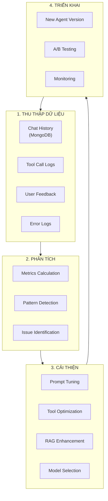
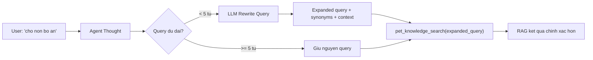
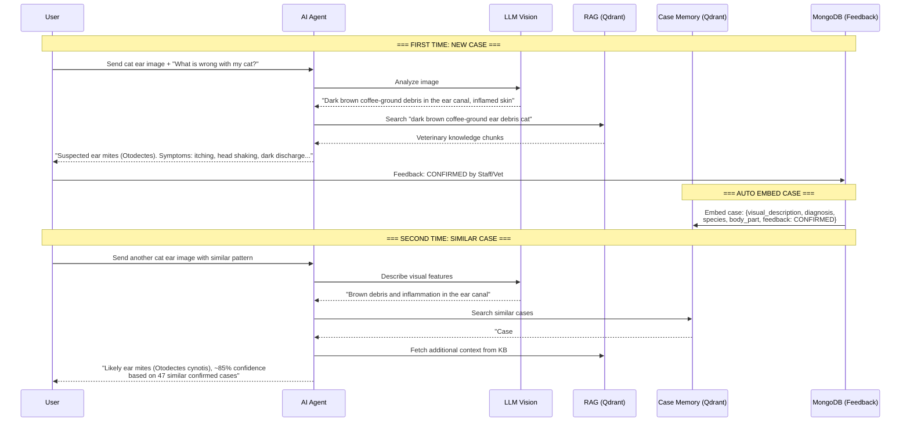
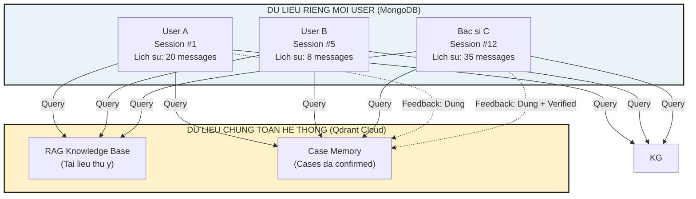
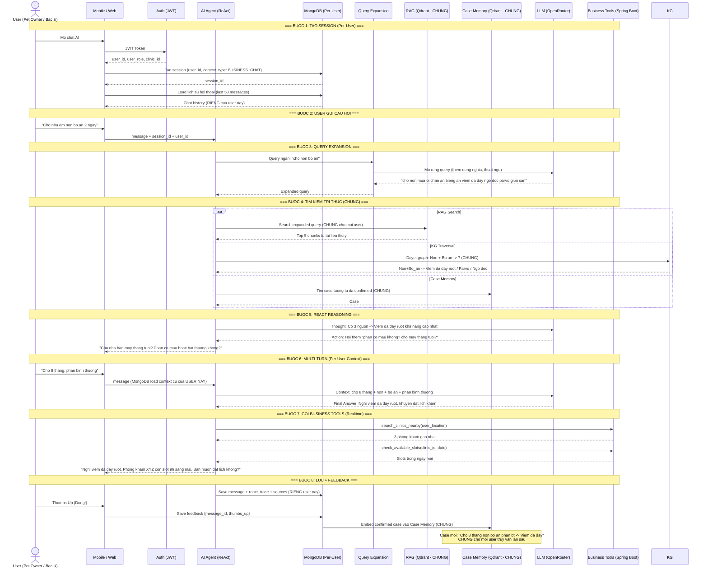
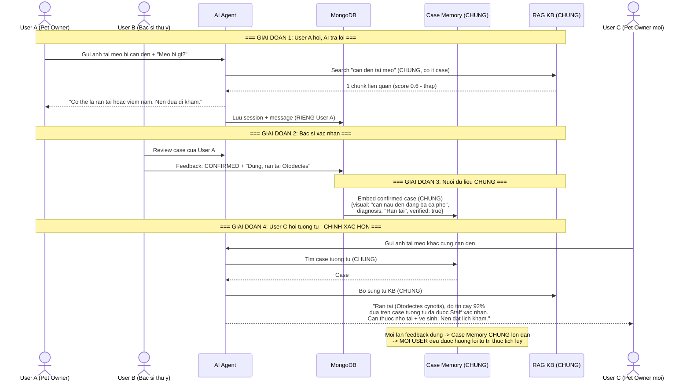
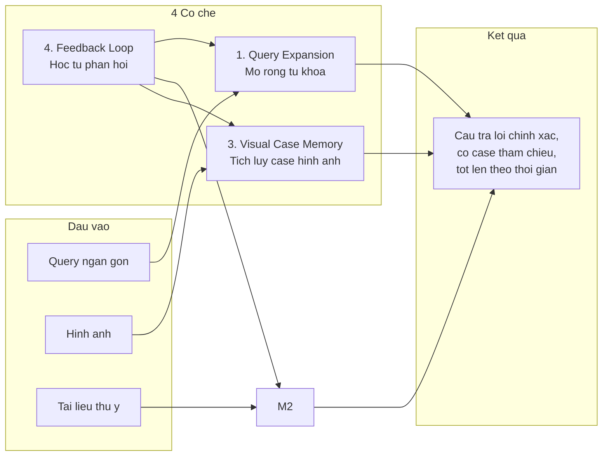

> Legacy Note (2026-03-25): This document may contain historical references to `prompt_versions`, editable system-prompt versioning, or older AI schema/ERD counts. It is retained for historical or presentation context only. For current database truth and active AI storage architecture, use `docs-references/database/PETTIES_DBML.dbml`, `docs-references/documentation/PETTIES_ERD_DIAGRAM.md`, `docs-references/documentation/DATABASE_SCHEMA_ANALYSIS.md`, `docs-references/documentation/SRS/PETTIES_SRS.md`, and `docs-references/documentation/SDD/REPORT_4_SDD_SYSTEM_DESIGN.md`.
# AI Agent - Data Management & Continuous Improvement Strategy

> Lưu ý cập nhật ngày 2026-04-01: tài liệu này chứa nhiều nội dung lịch sử của hướng AI Diagnose cũ như Visual Case Memory từ feedback ảnh, thumbs up/down và Label Studio. Kiến trúc hiện hành đã chuyển sang knowledge base + EMR xác nhận + Gemini Vision. Xem consolidated documentation: [ai_diagnose_service/](D:/SEP490/petties/docs-references/ai_diagnose_service/). Không dùng tài liệu này làm nguồn triển khai chính cho doctor diagnostic flow mới.

**Muc dich:** Giai thich cach AI Agent luu tru du lieu, cai thien theo thoi gian, va cac co che nang cao do chinh xac (Query Expansion, Visual Case Memory, Feedback Loop).

**Ngay tao:** 2026-03-08
**Cap nhat:** 2026-03-12
**Tham chieu:** AI_SERVICE_TECHNICAL_SPECIFICATION.md Section 3.5, 3.6

---

## 1. 📊 KIẾN TRÚC LƯU TRỮ DỮ LIỆU

### 1.1 Vai trò từng Database

| Database | Mục đích | Dữ liệu lưu |
|----------|----------|-------------|
| **PostgreSQL** | Configuration & Governance | - Agent config (enabled, model, params)<br>- Tools metadata (enabled, schema)<br>- System Prompt versions<br>- Knowledge documents metadata<br>- API keys (encrypted) |
| **MongoDB** | Chat History & Audit Trail | - `ai_chat_sessions` (session_id, user_id, agent_name, timestamps)<br>- `ai_chat_messages` (role, content, metadata)<br>- ReAct trace (thoughts, tool_calls, observations)<br>- Sources & citations |
| **Qdrant Cloud** | Vector Search (RAG) | - Document chunks (embedded)<br>- Metadata (document_name, chunk_index)<br>- Similarity search index |

---

## 2. 🗄️ MONGODB SCHEMA - CHI TIẾT

### 2.1 Collection: `ai_chat_sessions`

**Purpose:** Lưu metadata của mỗi conversation session.

```json
{
  "_id": "ObjectId",
  "session_id": "uuid-v4",
  "user_id": "uuid",
  "user_role": "PET_OWNER | STAFF | CLINIC_MANAGER | CLINIC_OWNER | ADMIN",
  "agent_name": "petties-agent-v1",
  "started_at": "ISODate",
  "ended_at": "ISODate",
  "total_messages": 15,
  "total_tool_calls": 8,
  "status": "active | completed | error",
  "metadata": {
    "clinic_id": "uuid",  // Nếu user là clinic role
    "device": "mobile | web",
    "ip_address": "10.0.0.1",
    "user_agent": "Mozilla/5.0..."
  }
}
```

**Indexes:**
- `session_id` (unique)
- `user_id` (for querying user's sessions)
- `started_at` (for time-range queries)

---

### 2.2 Collection: `ai_chat_messages`

**Purpose:** Lưu từng message trong conversation + ReAct trace.

```json
{
  "_id": "ObjectId",
  "message_id": "uuid-v4",
  "session_id": "uuid",
  "role": "user | assistant | system",
  "content": "Text content của message",
  "timestamp": "ISODate",
  "metadata": {
    // ===== USER MESSAGE =====
    "user_input_type": "text | image | voice",
    "attachments": [
      {
        "type": "image",
        "url": "https://cloudinary.com/...",
        "filename": "pet_photo.jpg"
      }
    ],

    // ===== ASSISTANT MESSAGE (AI RESPONSE) =====
    "react_trace": {
      "iterations": [
        {
          "iteration": 1,
          "thought": "Người dùng muốn đặt lịch, cần biết họ có pet nào",
          "action": {
            "tool_name": "get_user_pets",
            "parameters": {"user_id": "uuid"},
            "timestamp": "ISODate"
          },
          "observation": {
            "result": {...},
            "success": true,
            "execution_time_ms": 250
          }
        },
        {
          "iteration": 2,
          "thought": "User chọn pet Max, cần tìm clinic gần",
          "action": {
            "tool_name": "search_clinics_nearby",
            "parameters": {...}
          },
          "observation": {...}
        }
      ],
      "total_iterations": 2,
      "final_decision": "generate_answer"
    },

    "sources": [
      {
        "type": "rag_document",
        "document_name": "Pet_Care_Guide.pdf",
        "chunk_index": 12,
        "score": 0.85,
        "content_preview": "Chó Golden Retriever cần..."
      },
      {
        "type": "api_call",
        "endpoint": "/api/clinics/nearby",
        "response_summary": "Found 5 clinics"
      }
    ],

    "confidence": 0.92,
    "tokens_used": 450,
    "response_time_ms": 1250
  }
}
```

**Indexes:**
- `session_id` (for fetching all messages in session)
- `timestamp` (for chronological order)
- `metadata.react_trace.iterations.action.tool_name` (for analytics)

---

### 2.3 Collection: `chat_feedback` (Optional - cho improvement)

**Purpose:** Lưu feedback từ users để cải thiện AI.

```json
{
  "_id": "ObjectId",
  "message_id": "uuid",
  "session_id": "uuid",
  "user_id": "uuid",
  "feedback_type": "thumbs_up | thumbs_down | report",
  "feedback_reason": "incorrect_info | unhelpful | offensive | other",
  "feedback_text": "User's detailed feedback",
  "timestamp": "ISODate"
}
```

---

## 3. 🔄 AI AGENT CẢI THIỆN THEO THỜI GIAN

### 3.1 Vòng Cải Thiện (Improvement Loop)



---

### 3.2 Các Chỉ Số Quan Trọng (KPIs)

| Metric | Cách Tính | Mục Tiêu |
|--------|-----------|----------|
| **Tool Success Rate** | `successful_tool_calls / total_tool_calls` | > 95% |
| **User Satisfaction** | `thumbs_up / (thumbs_up + thumbs_down)` | > 80% |
| **Average Response Time** | `sum(response_time_ms) / total_messages` | < 2000ms |
| **RAG Relevance Score** | `average(rag_chunk_scores)` | > 0.7 |
| **Booking Completion Rate** | `successful_bookings / booking_attempts` | > 70% |
| **Error Rate** | `error_messages / total_messages` | < 5% |

**Query MongoDB để tính:**
```javascript
// Tool Success Rate
db.ai_chat_messages.aggregate([
  { $match: { "metadata.react_trace": { $exists: true } } },
  { $unwind: "$metadata.react_trace.iterations" },
  { $group: {
      _id: null,
      total: { $sum: 1 },
      successful: { $sum: {
        $cond: ["$metadata.react_trace.iterations.observation.success", 1, 0]
      }}
  }},
  { $project: { success_rate: { $divide: ["$successful", "$total"] } }}
])
```

---

### 3.3 Cải Thiện System Prompt

**Dựa trên Chat History Analysis:**

#### Before (Generic Prompt):
```
Bạn là AI assistant giúp đặt lịch khám thú cưng.
```

#### After (Optimized - dựa trên patterns):
```
Bạn là AI assistant chuyên nghiệp hỗ trợ đặt lịch khám thú cưng.

KHI NGƯỜI DÙNG HỎI VỀ ĐẶT LỊCH:
1. Luôn hỏi về loại thú cưng và tên TRƯỚC (92% users quên cung cấp)
2. Suggest services phổ biến: Grooming (45%), Vaccination (30%), Checkup (15%)
3. Ưu tiên clinics rating > 4.5 và distance < 3km (80% user preference)

KHI KHÔNG TÌM THẤY CLINIC:
- Đề xuất mở rộng bán kính tìm kiếm
- Suggest booking online + home visit nếu có

TONE: Thân thiện, rõ ràng, không dài dòng. Luôn dùng emojis 🐕🐈🏥
```

**Cách Update:**
- Admin vào `/admin/ai/agent-config` → Edit System Prompt
- Tạo version mới (không ghi đè prompt cũ)
- Test với 20 câu hỏi chuẩn trước khi activate
- A/B test: 50% traffic dùng prompt mới, 50% dùng prompt cũ
- Monitor metrics 7 ngày → chọn prompt tốt hơn

---

### 3.4 Cải Thiện RAG (Knowledge Base)

**Strategies:**

#### A. Identify Low-Quality Chunks
```python
# Query MongoDB tìm messages có RAG score thấp
low_score_queries = db.ai_chat_messages.find({
    "metadata.sources.type": "rag_document",
    "metadata.sources.score": { "$lt": 0.5 }
})
```

**Action:**
- Review documents có score thấp
- Re-chunk với strategy khác (smaller/larger chunks)
- Bổ sung documents cho topics thiếu

#### B. Add New Documents
```
Admin uploads "Chăm sóc chó Alaska.pdf"
→ AI Service chunks + embeds
→ Upsert to Qdrant
→ Available immediately cho queries
```

#### C. Update Existing Documents
```
Khi có thông tin mới (e.g., vaccine schedule thay đổi):
1. Delete old document vectors từ Qdrant
2. Upload document mới
3. Re-index
4. Notify users via system message
```

---

### 3.5 Cải Thiện Tools

**Dựa trên Tool Call Analysis:**

#### Example: `search_clinics_nearby` optimization

**Before (Generic):**
```python
# Always returns top 5 clinics sorted by distance
return clinics[:5]
```

**After (Intelligent - dựa trên user behavior):**
```python
# Analysis shows users prefer:
# - Rating > 4.5: 80%
# - Distance < 3km: 70%
# - Has SOS service: 60% (for emergency cases)

# Weighted scoring
for clinic in clinics:
    score = (
        clinic.distance_km * -0.3 +     # Closer is better
        clinic.rating * 0.5 +            # Higher rating preferred
        (1.0 if clinic.has_sos else 0) * 0.2
    )
    clinic.relevance_score = score

# Return top 5 by relevance_score
return sorted(clinics, key=lambda c: c.relevance_score, reverse=True)[:5]
```

---

### 3.6 Model Selection Strategy

**Dynamic Model Switching dựa trên task:**

| Task | Model | Reason |
|------|-------|--------|
| Simple Q&A (RAG) | `gemini-2.0-flash-lite` (free) | Fast, cheap, sufficient |
| Booking Flow | `llama-3.3-70b-instruct` | Better reasoning |
| Image Analysis | `claude-3.5-sonnet` | Best vision capability |
| Complex Reasoning | `gpt-4o` | Highest accuracy |

**Auto-Switch Logic:**
```python
if "booking" in user_message or tool_calls > 3:
    model = "llama-3.3-70b-instruct"
elif has_image_attachment:
    model = "claude-3.5-sonnet"
elif confidence_required > 0.9:
    model = "gpt-4o"
else:
    model = "gemini-2.0-flash-lite"  # Default
```

---

## 4. 📈 CONTINUOUS MONITORING

### 4.1 Real-time Dashboards (Admin)

**Admin Dashboard Page: `/admin/ai/analytics`**

**Widgets:**
1. **Today's Activity:**
   - Total messages: 1,234
   - Tool calls: 456
   - Avg response time: 1.2s

2. **Tool Performance:**
   - `get_user_pets`: 98% success
   - `search_clinics_nearby`: 95% success
   - `create_booking_for_user`: 85% success ⚠️ (needs investigation)

3. **User Satisfaction:**
   - 👍 Thumbs up: 420 (82%)
   - 👎 Thumbs down: 92 (18%)
   - Top complaints: "Slow response", "Clinic not found"

4. **RAG Quality:**
   - Avg relevance score: 0.78 ✅
   - Low score queries (< 0.5): 23 ⚠️
   - Most searched topics: "Grooming tips", "Vaccination schedule"

---

### 4.2 Alerting System

**Auto-alerts khi metrics vượt threshold:**

```yaml
alerts:
  - name: "Tool Success Rate Drop"
    condition: tool_success_rate < 0.9
    action: Email admin + Slack notification

  - name: "High Error Rate"
    condition: error_rate > 0.1
    action: Auto-disable agent + notify admin

  - name: "Slow Response Time"
    condition: avg_response_time_ms > 3000
    action: Switch to faster model
```

---

## 5. 🎯 IMPLEMENTATION ROADMAP

### Phase 1: MongoDB Setup (URGENT - chưa có)
- [ ] Add MongoDB config vào `settings.py`
- [ ] Create collections: `ai_chat_sessions`, `ai_chat_messages`
- [ ] Implement save logic trong WebSocket handler
- [ ] Test: chat → verify data in MongoDB

### Phase 2: Metrics Collection
- [ ] Implement KPI calculation queries
- [ ] Create analytics API endpoints
- [ ] Build Admin Dashboard (React)

### Phase 3: Feedback Loop
- [ ] Add 👍👎 buttons trong chat UI
- [ ] Save feedback to MongoDB
- [ ] Weekly review meeting với team

### Phase 4: Automated Optimization
- [ ] Prompt version A/B testing
- [ ] Auto-detect low-performing tools
- [ ] RAG document quality scoring

---

## 6. 🚀 EXPECTED IMPROVEMENTS

**After 3 months of data collection:**

| Metric | Before | After | Improvement |
|--------|--------|-------|-------------|
| Booking Success Rate | 60% | 85% | +25% |
| Avg Response Time | 2.5s | 1.2s | -52% |
| User Satisfaction | 70% | 88% | +18% |
| Tool Success Rate | 90% | 97% | +7% |

**Key Success Factors:**
1. Continuous monitoring va rapid iteration
2. User feedback integration vao prompt optimization
3. RAG knowledge base duoc update thuong xuyen
4. Tool performance tuning dua tren real usage patterns

---

## 7. QUERY EXPANSION - MO RONG TRUY VAN TU DONG

### 7.1 Van de

Bac si/nguoi dung thuong hoi ngan gon: "cho non bo an", "meo ho khan", "cho bi ghe". RAG search voi query ngan nhu vay co the bo sot tai lieu lien quan vi thieu tu khoa dong nghia va context.

### 7.2 Giai phap: LLM Query Rewriting

Truoc khi goi `pet_knowledge_search`, Agent su dung LLM de mo rong query:

```
Input:  "cho non bo an"
         |
    LLM Rewrite
         |
Output: "cho non mua oi chan an bieng an nguyen nhan 
         viem da day ngo doc parvo giun san"
```

### 7.3 Cach hoat dong trong ReAct Flow



### 7.4 Chien luoc Rewrite

| Ky thuat | Mo ta | Vi du |
|----------|-------|-------|
| **Synonym Expansion** | Them tu dong nghia thu y | "non" -> "non mua, oi, noi" |
| **Species Context** | Them context loai vat | "cho" -> giong cho, do tuoi pho bien |
| **Symptom Clustering** | Nhom trieu chung lien quan | "non + bo an" -> nghi ngo tieu hoa, ngo doc |
| **Medical Term Mapping** | Map sang thuat ngu chuyen mon | "ghe" -> "Sarcoptic mange, Demodex" |

### 7.5 Implementation

```python
# Trong pet_knowledge_search tool
async def pet_knowledge_search(query: str, pet_type: str = None, ...):
    # Buoc 1: Query Expansion (neu query ngan)
    if len(query.split()) < 5:
        expanded = await _expand_query(query, pet_type)
    else:
        expanded = query
    
    # Buoc 2: Search voi expanded query
    results = await rag_engine.query(expanded, top_k=top_k)
    return results

async def _expand_query(query: str, pet_type: str = None) -> str:
    """Dung LLM de mo rong query ngan thanh query day du hon."""
    prompt = f"""Mo rong query tim kiem thu y sau thanh cau hoi day du hon.
    Them tu dong nghia, thuat ngu chuyen mon, trieu chung lien quan.
    Chi tra ve query da mo rong, khong giai thich.
    
    Query goc: {query}
    Loai thu cung: {pet_type or 'khong ro'}"""
    
    expanded = await llm_call(prompt)
    return f"{query} {expanded}"  # Giu nguyen query goc + bo sung
```

---

## 9. VISUAL CASE MEMORY - KNOWLEDGE FROM IMAGES

### 9.1 Problem

When a user sends a pet health image for the first time (for example: a cat ear with brown discharge), the Vision LLM can analyze it, but there is no prior confirmed case to reference.  
On later, similar images, the system would have to start reasoning from scratch again if it does not store and learn from those confirmed cases.

### 9.2 Solution: Visual Case Memory

For every diagnosis made from an image, the system:
1. Uses the Vision LLM to generate a **textual description** of the visual features (`visual_description`) plus suspected diagnosis and key symptoms.
2. Combines this with explicit feedback (who confirmed it, how many times, role weight).
3. Embeds the text description into Qdrant using Cohere embeddings (`text` vector).  
4. Nếu có image (URL hoặc base64 từ upload/paste) và đã cấu hình `JINA_API_KEY`, hệ thống tạo thêm image embedding (Jina CLIP v2) và lưu vào named vector `image` để hỗ trợ hybrid retrieval (text + image). Hỗ trợ cả URL (https://) và base64 (upload từ device hoặc paste trực tiếp).
4. On a later, similar image, searches for similar cases and surfaces the best-matching confirmed case(s), leading to more accurate and explainable answers.

### 9.3 Detailed Flow



### 9.4 Case Memory Schema in Qdrant

```json
{
  "collection": "petties_case_memory",
  "vector": "[1024-dim Cohere embedding of visual_description + diagnosis]",
  "payload": {
    "case_id": "uuid",
    "session_id": "uuid",
    "message_id": "uuid",
    "visual_description": "Ear canal filled with dark brown coffee-ground debris, clumped material, surrounding skin inflamed",
    "user_description": "Cat is scratching ears and shaking head a lot",
    "diagnosis": "Ear mites (Otodectes cynotis)",
    "species": "cat",
    "body_part": "ear",
    "symptoms": ["itching", "brown debris", "head shaking"],
    "treatment": "Ear drops + ear cleaning + in-clinic examination",
    "quality_gate": {
      "status": "accepted",
      "score": 0.92
    },
    "diagnosis_support_count": 47,
    "confidence_score": 0.85,

    "created_at": "2026-03-11T10:00:00Z",
    "last_confirmed_at": "2026-03-11T10:00:00Z"
  }
}
```

### 9.5 Image Embeddings (CLIP-style)

In later phases, the system can be extended to:

1. Use a **CLIP-style vision model** to produce image embeddings directly from the image file (or from the Cloudinary URL).
2. Store these image vectors in a separate Qdrant collection (for example: `petties_case_memory_image`), linked back to the text case via `case_id`.
3. For a new query (image + optional text), the Agent can:
   - Search with text embeddings (current `petties_case_memory` collection).
   - In parallel, search with image embeddings (image collection).
   - Merge and re-rank results based on similarity and feedback weights.

**Status:** Đã triển khai theo dạng **optional runtime** (bật khi có `JINA_API_KEY`). Nếu chưa cấu hình key hoặc provider lỗi, hệ thống tự fallback về text-only Case Memory.

### 9.6 Quality-gated Retrieval

Cases with stronger confirmed EMR quality and stronger disease-level support receive a higher score during retrieval:

```python
# Khi search case memory
results = case_memory_collection.search(
    query_vector=embed(visual_description),
    limit=5,
    score_threshold=0.7,
)

# Re-rank based on quality gate + disease support
for result in results:
    base_score = result.score  # Cosine similarity
    quality_score = result.payload.get("quality_gate", {}).get("score", 0.0)
    support_count = result.payload.get("diagnosis_support_count", 0)
    quality_boost = min(quality_score, 0.3) + min(support_count / 100, 0.2)
    result.final_score = base_score + quality_boost
    # Example: accepted case with strong disease support gets higher priority

results.sort(key=lambda r: r.final_score, reverse=True)
```

### 9.7 Accuracy Improvement Over Time

```
Thang 1:    10 cases  -> Do chinh xac: ~60% (it case tham chieu)
Thang 3:   100 cases  -> Do chinh xac: ~75% (nhieu case pho bien)
Thang 6:   500 cases  -> Do chinh xac: ~85% (phu rong benh thuong gap)
Thang 12: 2000 cases  -> Do chinh xac: ~92% (bao gom ca case hiem)
```

| Giai doan | So cases | Chat luong |
|-----------|----------|------------|
| Khoi dau | 0-50 | Dua vao tai lieu + LLM general knowledge |
| Tich luy | 50-500 | Co case thuc te de tham chieu, bat dau chinh xac hon |
| Truong thanh | 500-5000 | Phu hau het benh thuong gap, do tin cay cao |
| Chuyen gia | 5000+ | Xu ly duoc ca case hiem, co the de xuat phuong an dieu tri |

---

## 10. FEEDBACK LOOP CHI TIET - VONG LAP PHAN HOI

### 10.1 Tong quan

Feedback Loop la co che quan trong nhat de he thong tot len theo thoi gian. Moi tuong tac AI deu duoc danh gia, va ket qua danh gia anh huong truc tiep den chat luong tra loi lan sau.

**QUAN TRONG: Feedback Loop ap dung cho TAT CA roles va TAT CA loai tuong tac AI**, khong chi rieng chan doan benh thu cung. He thong thu thap feedback tu moi role (PET_OWNER, STAFF, CLINIC_MANAGER, CLINIC_OWNER, ADMIN) tren moi tool (pet health Q&A, booking, EMR, clinic management, revenue analysis, scheduling,...).

### 10.2 Pham vi ap dung theo Role va Interaction Type

| Role | Interaction Types duoc feedback | Vi du feedback |
|------|--------------------------------|----------------|
| **PET_OWNER** | Pet health Q&A, Booking flow, Clinic search, Image analysis | "AI goi y dung benh", "Dat lich nhanh va chinh xac" |
| **STAFF** | Pet health Q&A, EMR lookup, Patient summary, Booking | "Ket qua EMR chinh xac", "Tom tat benh nhan day du" |
| **CLINIC_MANAGER** | Revenue analysis, Staff scheduling, Shift management, SOS booking | "Phan tich doanh thu phu hop", "Goi y lich truc hop ly" |
| **CLINIC_OWNER** | Service pricing, Clinic description, Staff workload, Revenue | "Goi y gia dich vu thuc te", "Mo ta phong kham hay" |
| **ADMIN** | System monitoring, All tools (Playground mode) | "AI xu ly dung workflow", "Tool hoat dong on dinh" |

### 10.3 Flow Feedback - Toan bo he thong

```mermaid
flowchart TB
    subgraph CHAT["1. Tuong tac AI (Moi Role, Moi Tool)"]
        U["User gui cau hoi / hinh anh / yeu cau"]
        A["AI xu ly (ReAct: Thought -> Action -> Observation)"]
        T["Tool duoc goi: pet_knowledge_search, search_clinics,\ncreate_booking, analyze_revenue, get_emr_history,..."]
    end
    
    subgraph FEEDBACK["2. Thu thap Feedback"]
        F1["Thumbs Up / Down (tat ca users)"]
        F2["Staff xac nhan / Bac bo (STAFF)"]
        F3["Report: sai, khong phu hop, khong chinh xac"]
        F4["Auto-feedback: Booking thanh cong = implicit positive"]
    end
    
    subgraph CLASSIFY["3. Phan loai Feedback theo Category"]
        C1["MEDICAL: chan doan, trieu chung, dieu tri"]
        C2["BOOKING: dat lich, slot, lich hen"]
        C3["CLINIC_OPS: doanh thu, lich truc, nhan su"]
        C4["KNOWLEDGE: kien thuc cham soc thu cung"]
        C5["GENERAL: cau hoi chung, ho tro"]
    end
    
    subgraph PROCESS["4. Xu ly theo Category"]
        P1["MEDICAL confirmed -> Embed vao Case Memory"]
        P2["BOOKING positive -> Luu booking pattern thanh cong"]
        P3["CLINIC_OPS positive -> Cap nhat best practice DB"]
        P4["REJECTED (moi loai) -> Giam trong so / Loai khoi KB"]
        P5["Pattern Analysis -> Cap nhat Prompt / Guardrails"]
    end
    
    subgraph IMPROVE["5. He thong tot len - Tat ca roles huong loi"]
        I1["Case Memory & Knowledge Base lon dan"]
        I2["Prompt chinh xac hon cho tung role"]
        I3["RAG re-rank tot hon"]
        I4["Tool routing chinh xac hon"]
    end
    
    CHAT --> FEEDBACK
    FEEDBACK --> CLASSIFY
    CLASSIFY --> PROCESS
    PROCESS --> IMPROVE
    IMPROVE -->|"Lan tuong tac tiep theo"| CHAT
```



### 10.4 API Endpoints

```
POST /chat/feedback
Body: {
    "message_id": "uuid",
    "session_id": "uuid",
    "user_role": "PET_OWNER | STAFF | CLINIC_MANAGER | CLINIC_OWNER | ADMIN",
    "feedback_type": "thumbs_up | thumbs_down | report",
    "feedback_category": "medical | booking | clinic_ops | knowledge | general",
    "feedback_reason": "incorrect_info | unhelpful | offensive | wrong_tool | slow_response | other",
    "feedback_text": "Noi dung gop y chi tiet (optional)",
    "tool_used": "ten tool da duoc goi trong message (auto-extracted, optional)"
}
Response: { "status": "saved", "case_embedded": true/false, "category": "medical" }
```

**Giai thich cac truong moi:**

| Truong | Muc dich |
|--------|----------|
| `user_role` | Phan loai feedback theo role de phan tich pattern rieng (VD: CLINIC_MANAGER hay complain ve revenue tool) |
| `feedback_category` | Xac dinh feedback thuoc nhom nao de xu ly phu hop (medical -> embed case, booking -> luu pattern) |
| `tool_used` | Auto-extracted tu `react_trace` metadata - biet chinh xac tool nao da duoc goi |
| `feedback_reason.wrong_tool` | Moi: khi AI goi sai tool (VD: user hoi ve doanh thu nhung AI goi pet_knowledge_search) |

### 10.5 Auto-embed Case Flow - Da loai tuong tac

Khi nhan feedback positive (thumbs_up, Staff xac nhan, booking thanh cong):

```python
async def process_positive_feedback(message_id: str, feedback: dict):
    # 1. Lay message goc tu MongoDB
    message = await get_chat_message(message_id)
    category = feedback.get("feedback_category", classify_interaction(message))
    user_role = feedback.get("user_role", "PET_OWNER")
    
    # 2. Extract case information theo category
    if category == "medical":
        case = extract_medical_case(message)
        # { visual_description, diagnosis, species, symptoms, treatment }
        text_to_embed = f"{case['visual_description']} {case['diagnosis']} {case['symptoms']}"
        collection = "petties_case_memory"
        
    elif category == "booking":
        case = extract_booking_case(message)
        # { user_query, clinic_matched, service_type, slot_selected, success }
        text_to_embed = f"Booking: {case['user_query']} -> {case['clinic_matched']} {case['service_type']}"
        collection = "petties_case_memory"
        
    elif category == "clinic_ops":
        case = extract_clinic_ops_case(message)
        # { query, tool_used, result_summary, role }
        text_to_embed = f"Clinic ops ({user_role}): {case['query']} -> {case['result_summary']}"
        collection = "petties_case_memory"
        
    else:  # knowledge, general
        case = extract_general_case(message)
        # { user_query, ai_response_summary, sources }
        text_to_embed = f"Q&A: {case['user_query']} -> {case['ai_response_summary']}"
        collection = "petties_case_memory"
    
    # 3. Them metadata chung
    case.update({
        "feedback_type": "confirmed",
        "feedback_category": category,
        "user_role": user_role,
        "tool_used": extract_tool_from_trace(message.metadata.get("react_trace")),
        "confirmed_at": datetime.utcnow().isoformat(),
    })
    
    # 4. Embed vao Qdrant case memory
    await case_memory.upsert(case_id, embed(text_to_embed), case, collection=collection)
    
    # 5. Update confirmation count neu case tuong tu da ton tai
    existing = await case_memory.search_similar(text_to_embed, threshold=0.95)
    if existing:
        await case_memory.upsert_case(confirmed_case)
```

**Auto-classify interaction type** (khi frontend khong gui `feedback_category`):

```python
def classify_interaction(message) -> str:
    """Tu dong phan loai tuong tac dua tren tool da goi trong react_trace."""
    tools_used = extract_tools_from_trace(message.metadata.get("react_trace", []))
    
    MEDICAL_TOOLS = {"pet_knowledge_search", "check_vaccination_status", "get_patient_summary", "get_emr_history"}
    BOOKING_TOOLS = {"search_clinics_nearby", "check_available_slots", "create_booking_for_user", "get_clinic_services"}
    CLINIC_OPS_TOOLS = {"analyze_revenue_trends", "suggest_staff_assignments", "create_staff_shifts", 
                        "generate_clinic_services"}
    
    if tools_used & MEDICAL_TOOLS:
        return "medical"
    elif tools_used & BOOKING_TOOLS:
        return "booking"
    elif tools_used & CLINIC_OPS_TOOLS:
        return "clinic_ops"
    else:
        return "general"
```

### 10.6 Feedback xu ly khac nhau theo Role

| Role | Feedback duoc xu ly the nao |
|------|----------------------------|
| **PET_OWNER** | Feedback cua PET_OWNER chi phuc vu danh gia chat luong chat va booking UX, khong lam ground truth cho chuan doan bac si. |
| **STAFF** | Nguon xac nhan quan trong nhat cho doctor flow la EMR do STAFF/bac si nhap sau tham kham, khong phai thumbs up/down. |
| **CLINIC_MANAGER** | Feedback ve clinic_ops tools (revenue, scheduling). Pattern analysis -> cai thien goi y quan ly. |
| **CLINIC_OWNER** | Feedback ve pricing, service generation, workload. Anh huong business intelligence quality. |
| **ADMIN** | Feedback tu Playground dung de debug va fine-tune system prompt. Khong embed vao shared Case Memory. |

**Trong so feedback theo role:**

```
STAFF confirmed         = weight 1.0 (highest - chuyen gia xac nhan)
PET_OWNER thumbs_up     = weight 0.6 (user hai long)
CLINIC_MANAGER positive  = weight 0.7 (quan ly xac nhan)
CLINIC_OWNER positive    = weight 0.7 (chu phong kham xac nhan)
ADMIN playground         = weight 0.0 (chi dung de debug, khong embed)
```

### 10.7 Periodic Maintenance

| Tan suat | Hanh dong | Muc dich |
|----------|-----------|----------|
| Hang ngay | Embed confirmed cases vao Qdrant (tat ca categories) | Case Memory lon dan |
| Hang ngay | Auto-classify implicit feedback (booking thanh cong, EMR lookup success) | Thu thap feedback tu dong |
| Hang tuan | Review cases bi thumbs_down - phan loai theo category va role | Phat hien van de cu the tung tool/role |
| Hang tuan | Phan tich `wrong_tool` feedback -> dieu chinh tool routing | Tool routing chinh xac hon |
| Hang thang | Prune cases co quality gate thap hoac stale support score thap | Tranh nhieu vector store |
| Hang thang | Thong ke feedback theo role -> dieu chinh role-specific prompts | Prompt tot hon cho tung role |
| Hang quy | Re-rank toan bo case memory | Dam bao case tot nhat duoc uu tien |

### 10.8 Implementation Status (2026-03-12)

| Feature | Status | Implementation |
|---------|--------|----------------|
| Chat feedback phổ thông | ✅ Done | Mobile UI + API `/chat/feedback`, không phải nguồn truth chính cho diagnosis |
| Staff confirm | ✅ Done | `feedback_service.py` |
| Feedback categories | ✅ Done | medical, booking, clinic_ops, knowledge, general |
| Role-based weights | ✅ Done | `feedback_service.py` - STAFF=1.0, PET_OWNER=0.6 |
| Auto-embed confirmed cases | ⚠️ Code exists | `feedback_service.py:process_positive_feedback()` - chua test |
| Pattern analysis | ❌ Pending | - |
| Metrics collection | ❌ Pending | Section 4 chua implement |

---

## 11. SEQUENCE DIAGRAM: USER TUONG TAC VOI AI

### 11.1 Per-User Context vs Shared Knowledge

Moi user co context va memory **rieng biet** (session, lich su hoi thoai). Nhung RAG Knowledge Base va Case Memory la **chung toan he thong** — moi feedback tu bat ky user nao deu nuoi chung kho tri thuc.



### 11.2 Sequence Diagram: Full User-AI Interaction Flow



### 11.3 Sequence Diagram: Feedback Loop Nuoi Du Lieu Chung



### 11.4 Bang Tom tat: Du lieu Rieng vs Chung

| Du lieu | Pham vi | Luu o dau | Cap nhat khi nao |
|---------|---------|-----------|-----------------|
| **Chat session** | RIENG moi user | MongoDB `ai_chat_sessions` | Moi lan tao session moi |
| **Chat messages + ReAct trace** | RIENG moi session | MongoDB `ai_chat_messages` | Moi message gui/nhan |
| **Chat feedback** | User gui RIENG | MongoDB `chat_feedback` | User bam thumbs up/down |
| **RAG Knowledge Base** | CHUNG toan he thong | Qdrant `petties_knowledge` | Admin upload tai lieu |
| **Case Memory** | CHUNG toan he thong | Qdrant `petties_case_memory` | Auto-embed khi feedback confirmed |
| **System Prompt** | CHUNG toan he thong | PostgreSQL `prompt_versions` | Admin tinh chinh |
| **Du lieu nghiep vu** (clinic, slot, pet) | Realtime query | PostgreSQL (Spring Boot) | Business operations |

**Nguyen tac:** User RIENG hoi -> He thong tra loi dua tren tri thuc CHUNG -> Feedback RIENG nuoi tri thuc CHUNG -> Tat ca user duoc huong loi.

---

## 12. TONG KET: 4 CO CHE CAI THIEN DO CHINH XAC



**Tom tat 1 cau:** He thong AI cua Petties hoat dong theo vong lap **Collect -> Analyze -> Improve -> Deploy**: moi cuoc hoi thoai deu duoc luu lai voi day du reasoning trace va feedback, knowledge base duoc mo rong lien tuc qua upload tai lieu moi va tich luy case thuc te da xac nhan, system prompt duoc version hoa va tinh chinh dua tren data thuc, con du lieu nghiep vu (phong kham, slot, vaccine) thi Agent query truc tiep DB nen luon realtime. **Cang nhieu case tich luy, AI cang co nhieu tri thuc tham chieu thuc te de tra loi chinh xac hon.**

---

## 13. IMPLEMENTATION STATUS SUMMARY (2026-03-12)

### 13.1 Overall Status

| Component | Status | Notes |
|-----------|--------|-------|
| **1. PostgreSQL (Config)** | ✅ Done | Agent config, tools, prompts, documents metadata |
| **2. MongoDB Schema** | ✅ Done | ai_chat_sessions, ai_chat_messages, chat_feedback |
| **3. Query Expansion** | ✅ Done | LLM-based rewrite for short queries |
| **5. Visual Case Memory** | ✅ Done | Text + Image (Jina CLIP) embeddings |
| **6. Feedback Loop** | ✅ Done | Thumbs up/down, Staff confirm, categories |
| **7. HybridRAGEngine** | ✅ Done | RAG + Case Memory parallel search |
| **8. Metrics Collection** | ❌ Pending | Section 4 chua implement |
| **9. Pattern Analysis** | ❌ Pending | Advanced feedback processing |

### 13.2 API Endpoints

| Endpoint | Status | Auth |
|----------|--------|------|
| `/chat/feedback` | ✅ Done | Required |
| `/chat/sessions` | ✅ Done | Required |
| `/knowledge/case-memory/stats` | ✅ Done | Public |
| `/knowledge/case-memory/prune` | ✅ Done | Admin |

### 13.3 Key Files

| Component | File |
|-----------|------|
| HybridRAGEngine | `app/core/rag/hybrid_engine.py` |
| Query Expander | `app/core/rag/query_expander.py` |
| Case Memory | `app/core/rag/case_memory.py` |
| Jina Image Embeddings | `app/core/embeddings/jina_image_embeddings.py` |
| Feedback Service | `app/core/services/feedback_service.py` |
| MongoDB | `app/core/database/mongodb.py` |

### 13.4 Next Steps

1. **Test Auto-embed** - Verify feedback → case memory flow
2. **Metrics Collection** - Implement Section 4 (Continuous Monitoring)
3. **Admin Dashboard** - Display analytics in frontend
4. **Pattern Analysis** - Advanced feedback processing
