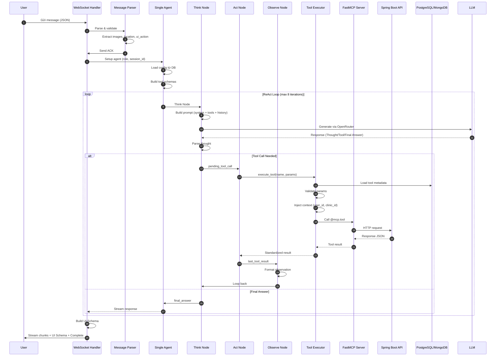

# AI Chatbot Architecture - Petties

**Version:** 1.0.0  
**Last Updated:** 2026-04-01  
**Service:** petties-agent-serivce (FastAPI + Python 3.12)  
**Architecture:** Single Agent + ReAct Pattern (LangGraph) + FastMCP Tools

> Current runtime note (2026-04-02): WebSocket is the canonical real-time chat path. REST session-message POST remains a persist-only helper, not the primary AI response flow.

---

## 1. Tổng Quan Kiến Trúc

Petties AI Chatbot sử dụng kiến trúc **Single Agent với ReAct Pattern** (Reasoning + Acting), được xây dựng trên nền tảng:

- **LangGraph** - StateGraph để quản lý luồng ReAct loop
- **FastMCP** - Code-based tools với decorator `@mcp.tool`
- **OpenRouter** - LLM Provider (Cloud API Only)
- **PostgreSQL** - Tool metadata, agent configuration
- **MongoDB** - Chat history, booking session state
- **Qdrant + Cohere** - RAG pipeline cho knowledge base

### 1.1 Nguyên Tắc Thiết Kế

```
┌─────────────────────────────────────────────────────────────┐
│                    Petties AI Chatbot                        │
├─────────────────────────────────────────────────────────────┤
│  Single Agent + Multiple Tools (NOT Multi-Agent)            │
│  - Cloud API Only (OpenRouter) - NO local Ollama            │
│  - Tools are code-based với @mcp.tool decorator             │
│  - RAG ONLY cho Pet Owner Q&A                               │
│  - Clinic Operations: Structured queries to PostgreSQL      │
└─────────────────────────────────────────────────────────────┘
```

### 1.2 Thành Phần Chính

| Thành Phần | Công Nghệ | Vai Trò |
|------------|-----------|---------|
| **FastAPI** | Python 3.12 | REST API + WebSocket server |
| **LangGraph** | StateGraph | ReAct loop orchestration |
| **FastMCP** | Decorator-based | Tool registration & execution |
| **OpenRouter** | Cloud API | LLM inference (Gemini, Claude, Llama) |
| **PostgreSQL** | Flyway migrations | Tool metadata, agent config |
| **MongoDB** | Motor async driver | Chat history, booking state |
| **Qdrant Cloud** | Vector DB | Knowledge base embeddings |
| **Cohere** | Embedding API | Multilingual embeddings |

---

## 2. Vòng Đời Xử Lý (Request Lifecycle)

### 2.1 Sequence Diagram - Full Flow



### 2.2 Chi Tiết Từng Giai Đoạn

#### Giai Đoạn 1: Parse Message

**File:** `app/api/websocket/chat.py` - `_parse_raw_message()`

```python
# Input: Raw WebSocket message (JSON string)
{
    "message": "Tìm phòng khám PetCare cho bé Mèo",
    "images": ["https://..."],
    "location": {"lat": 10.76, "lng": 106.69},
    "ui_action": {"type": "select_pet", "pet_id": "uuid"}
}

# Output: ParsedMessage
{
    "user_message": "Tìm phòng khám PetCare cho bé Mèo",
    "image_urls": ["https://..."],
    "location": {"lat": 10.76, "lng": 106.69},
    "ui_action": {"type": "select_pet", "pet_id": "uuid"}
}
```

#### Giai Đoạn 2: Setup Agent

**File:** `app/api/websocket/chat.py` - `_setup_agent()`

1. Load agent configuration từ PostgreSQL
2. Tạo `ToolRuntimeContext` (user_id, role, auth_token, clinic_id)
3. Fetch chat history từ MongoDB (limit: 20 messages)
4. Build tool schemas cho LLM

#### Giai Đoạn 3: ReAct Loop

**File:** `app/core/agents/single_agent.py`

```
START → Think → Should Continue? → Act → Observe → Think (loop)
                                    ↓
                                   END
```

| Node | Vai Trò | Output |
|------|---------|--------|
| **Think** | LLM reasoning, tool selection | `pending_tool_call` hoặc `final_answer` |
| **Act** | Execute tool via MCP | `last_tool_result` |
| **Observe** | Format tool result cho LLM | `current_observation` |

#### Giai Đoạn 4: Stream Response

**File:** `app/api/websocket/chat.py` - `_stream_and_collect()`

| Message Type | Nội Dung | Khi Nào Gửi |
|--------------|----------|-------------|
| `ack` | Xác nhận nhận message | Ngay khi parse xong |
| `agent_info` | Agent metadata (optional client-side) | Sau khi setup agent |
| `thinking` | Reasoning step summary | Mỗi Think node |
| `tool_call` | Tool đang được gọi | Mỗi Act node |
| `tool_result` | Kết quả tool | Mỗi Observe node |
| `thinking_stream` | Real-time thinking chunks | Streaming UX |
| `stream` | Final answer chunks | Khi có final_answer |
| `ui_schema` | Main structured UI contract | Sau khi có tool result |
| `booking_state_update` | Booking state | Cuối stream |
| `complete` | Stream finished | Kết thúc |
| `error` | Error message | Khi có lỗi |

---

## 3. ReAct Pattern - Chi Tiết

### 3.1 State Definition

**File:** `app/core/agents/state.py`

```python
class ReActState(TypedDict):
    messages: List[BaseMessage]        # Chat history
    react_steps: List[ReActStep]       # ReAct steps (thought/action/observation)
    current_thought: str               # LLM reasoning
    pending_tool_call: Dict            # Tool call pending execution
    last_tool_result: Any              # Last tool execution result
    current_observation: str           # Formatted tool result
    should_end: bool                   # Flag to end loop
    final_answer: str                  # Final response
    iteration: int                     # Current iteration count
```

### 3.2 Think Node - LLM Reasoning

**File:** `app/core/agents/single_agent.py` - `_think_node()`

**Prompt Structure:**
```
=== NHÂN CÁCH & QUY TẮC NGHIỆP VỤ ===
[Admin-editable system prompt từ DB]

=== QUY TẮC REACT FORMAT ===
Thought: [Giải thích ngắn]
Tool: [Tên tool]
Tool Input: { "param": "value" }

=== TRẠNG THÁI BOOKING DRAFT ===
Current Stage: IDLE
Collected Params: {}
Missing Fields: ["pet_id", "clinic_id"]

=== CÔNG CỤ CÓ SẴN ===
- search_clinics_nearby: Tìm phòng khám...
- get_user_pets: Lấy danh sách thú cưng...
...

=== HỘI THOẠI GẦN ĐÂY ===
User: Tìm phòng khám PetCare
Assistant: Mình đang tìm...

CÂU HỎI CỦA NGƯỜI DÙNG:
Tìm phòng khám PetCare cho bé Mèo
```

Notes:
- Booking-specific prompt blocks are shown only when booking tools are enabled for the current role/context.
- Explicit clinic names should stay on the canonical clinic-discovery path via `search_clinics_nearby` + `clinic_hint`.
- Exact slot confirmation must come from `check_available_slots`, not from clinic discovery alone.

**Decision Logic:**
1. Parse LLM response → Extract tool name + params
2. Validate tool exists in enabled_tools
3. Check params not empty (policy-based)
4. Loop prevention: Detect repetitive tool calls
5. Recovery: If no tool selected on iteration 0 → Run strict JSON router prompt

### 3.3 Act Node - Tool Execution

**File:** `app/core/agents/single_agent.py` - `_act_node()`

```python
# Execution flow:
1. Check tool is enabled
2. Call execute_tool(tool_name, params)
3. Load tool metadata từ PostgreSQL
4. Validate params against schema
5. Inject context (user_id, clinic_id)
6. Execute via FastMCP
7. Return standardized result
```

### 3.4 Observe Node - Result Processing

**File:** `app/core/agents/single_agent.py` - `_observe_node()`

```python
# Format tool result:
if success is False:
    observation = format_tool_observation({
        "error_code": "CLINIC_NOT_FOUND",
        "message": "Không tìm thấy...",
        "suggestion": "Vui lòng..."
    })
elif "data" in tool_result:
    observation = format_tool_observation(tool_result["data"])
else:
    observation = json.dumps(tool_result)
```

---

## 4. Tool System - FastMCP

### 4.1 Tool Registration Flow

```
@ mcp_server.tool decorator
    ↓
FastMCP server registers tool
    ↓
scanner.py scans tools → Sync to PostgreSQL `Tool` table
    ↓
Agent loads tool schemas from DB
    ↓
LLM receives tool descriptions in prompt
```

### 4.2 Tool Categories (26 Tools)

#### Booking Tools (8)

| Tool | Description | Key Params |
|------|-------------|------------|
| `get_user_pets` | Lấy danh sách thú cưng | `user_id`, `pet_hint` |
| `get_clinic_services` | Lấy dịch vụ phòng khám | `clinic_id`, `pet_species`, `service_hint` |
| `check_vaccination_status` | Kiểm tra lịch tiêm chủng | `pet_id`, `vaccine_template_id` |
| `search_clinics_nearby` | Tìm phòng khám (tên/vị trí) | `clinic_hint`, `latitude`, `longitude` |
| `check_available_slots` | Kiểm tra slot trống | `clinic_id`, `date`, `service_ids` |
| `create_booking_for_user` | Tạo booking | `pet_id`, `clinic_id`, `booking_date`, `confirmed` |
| `get_my_booking_info` | Xem chi tiết booking | `booking_id`, `booking_code` |
| `list_my_bookings` | Danh sách booking của user | `status`, `limit` |

Runtime note:
- `search_clinics_nearby` is the canonical clinic-discovery tool for business chat, including explicit clinic-name requests via `clinic_hint`.
- `search_clinics_by_name` exists as a compatibility helper but is not the standard role-whitelisted booking path.

#### Booking Session Tools (7)

| Tool | Description |
|------|-------------|
| `start_booking_session` | Bắt đầu phiên đặt lịch |
| `get_booking_session` | Lấy booking session hiện tại |
| `end_booking_session` | Kết thúc phiên đặt lịch |
| `update_booking_draft` | Cập nhật draft |
| `get_booking_draft_summary` | Tóm tắt draft |
| `suspend_booking_session` | Tạm dừng session |
| `resume_booking_session` | Tiếp tục session |

#### Medical/RAG Tools (5)

| Tool | Description |
|------|-------------|
| `pet_knowledge_search` | Tìm kiếm kiến thức (RAG) |
| `get_staff_patients` | Lấy danh sách bệnh nhân của staff |
| `get_patient_summary` | Tóm tắt hồ sơ y tế |
| `get_emr_history` | Lịch sử bệnh án |
| `get_pet_health_summary` | Tổng hợp sức khỏe pet |

#### Utility Tools (5)

| Tool | Description |
|------|-------------|
| `get_current_datetime` | Ngày giờ hiện tại (VN timezone) |
| `resolve_date_time` | Chuyển đổi ngày giờ tiếng Việt |
| `extract_booking_entities` | Trích xuất thực thể đặt lịch |
| `validate_booking_readiness` | Kiểm tra draft đủ dữ liệu |
| `resolve_booking_context` | Lấy runtime context |

#### Common Tools (1)

| Tool | Description |
|------|-------------|
| `web_search` | Tìm kiếm web (Tavily API) |

### 4.3 Tool Execution Flow

**File:** `app/core/tools/executor.py`

```
execute_tool(name, params)
    ↓
1. Load tool từ PostgreSQL (Tool.name = name)
    ↓
2. Normalize params (strip whitespace, aliases)
    ↓
3. Validate against input_schema
    ↓
4. Inject context (user_id, clinic_id, session_id)
    ↓
5. Filter params by schema properties
    ↓
6. Call FastMCP tool (@mcp.tool decorated function)
    ↓
7. Normalize output
    ↓
8. Return standardized response
```

### 4.4 Tool Response Contract

**Success Response:**
```json
{
    "success": true,
    "data": {
        "clinics": [...],
        "total_found": 5,
        "message": null
    },
    "tool_name": "search_clinics_nearby"
}
```

**Error Response:**
```json
{
    "success": false,
    "error_code": "CLINIC_NOT_FOUND",
    "message": "Không tìm thấy phòng khám...",
    "recoverable": true,
    "suggestion": "Vui lòng kiểm tra lại tên...",
    "tool_name": "search_clinics_nearby"
}
```

---

## 5. WebSocket Chat Handler

### 5.1 Connection Lifecycle

```
1. Client connects → /ws/chat/{session_id}?token=JWT
2. Server accepts → Send ACK
3. Authentication → Decode JWT
4. Subscription check → Verify active subscription
5. Session management → Load/create chat session
6. Agent setup → Load config, build tool schemas
7. Stream → ReAct loop events
8. Finalize → Save message, send complete
9. Disconnect → Cleanup
```

### 5.2 Message Types

| Type | Direction | Content |
|------|-----------|---------|
| `ack` | Server → Client | Acknowledgment |
| `agent_info` | Server → Client | Agent metadata (optional for UI) |
| `thinking` | Server → Client | Reasoning step |
| `tool_call` | Server → Client | Tool being called |
| `tool_result` | Server → Client | Tool result |
| `thinking_stream` | Server → Client | Real-time thinking |
| `stream` | Server → Client | Final answer chunks |
| `ui_schema` | Server → Client | Main structured UI component schema |
| `booking_state_update` | Server → Client | Booking state |
| `complete` | Server → Client | Stream finished |
| `error` | Server → Client | Error occurred |

### 5.3 UI Schema Generation

**File:** `app/core/presentation/builder.py`

Tools return structured business data → Presentation layer converts to `ui_schema`:

```json
{
    "version": "v1",
    "components": [
        {
            "type": "clinic_card",
            "data": {
                "id": "uuid",
                "name": "PetCare Clinic",
                "address": "123 Đường ABC",
                "distance_km": 2.5
            }
        }
    ]
}
```

**Component Types:**
- `clinic_card` - Phòng khám
- `pet_card` - Thú cưng
- `service_chip` - Dịch vụ
- `slot_button` - Khung giờ
- `vaccination_card` - Tiêm chủng
- `emr_summary` - Bệnh án
- `booking_summary` - Tóm tắt booking
- `error_card` - Lỗi
- `empty_state` - Trống

---

## 6. Booking Session State Machine

### 6.1 States

```
IDLE → COLLECTING → CONFIRMING → COMPLETED
  ↓        ↓           ↓
CANCELLED  COLLECTING  COLLECTING
```

| State | Description |
|-------|-------------|
| `IDLE` | Không có phiên đặt lịch |
| `COLLECTING` | Đang thu thập thông tin |
| `CONFIRMING` | Đã đủ thông tin, chờ xác nhận |
| `COMPLETED` | Booking đã được tạo |
| `CANCELLED` | Người dùng hủy |

### 6.2 State Transitions

| Action | From → To | Tool |
|--------|-----------|------|
| Start booking | IDLE → COLLECTING | `start_booking_session` |
| Update draft | COLLECTING → COLLECTING | `update_booking_draft` |
| Validate | COLLECTING → CONFIRMING | `validate_booking_readiness` |
| Confirm | CONFIRMING → COMPLETED | `create_booking_for_user` |
| Cancel | Any → CANCELLED | `end_booking_session` |
| Suspend | COLLECTING → SUSPENDED | `suspend_booking_session` |
| Resume | SUSPENDED → COLLECTING | `resume_booking_session` |

---

## 7. Hướng Dẫn Thêm Tool Mới

### 7.1 Step-by-Step

#### Step 1: Tạo Tool Function

**File:** `app/core/tools/mcp_tools/booking_tools.py` (hoặc file mới)

```python
@mcp_server.tool
@_standardize_booking_tool_response
async def my_new_tool(
    param1: str,
    param2: Optional[int] = None,
) -> Dict[str, Any]:
    """Mô tả chức năng bằng tiếng Việt.

    Sử dụng khi:
    - User hỏi về X
    - User muốn làm Y

    Params:
        param1: Mô tả tham số 1
        param2: Mô tả tham số 2

    Returns:
        result: Kết quả xử lý
        message: Thông báo
    """
    try:
        token = _require_auth_token()
    except AuthenticationRequiredError as e:
        return {
            "result": None,
            "message": str(e),
            "requires_auth": True,
        }

    client = get_backend_client()
    try:
        data = await client.my_backend_method(token, param1)
    except BackendClientError as exc:
        logger.error(f"my_new_tool failed: {exc}")
        return _attach_booking_error_metadata(
            {"result": None, "message": f"Lỗi: {exc}"},
            error_code="INTERNAL_ERROR",
            suggestion="Vui lòng thử lại sau.",
            recoverable=True,
        )

    return {
        "result": data,
        "message": None,
    }
```

#### Step 2: Import Trong `__init__.py`

**File:** `app/core/tools/mcp_tools/__init__.py`

```python
from app.core.tools.mcp_tools import booking_tools  # Đã có
# Tool tự động register khi import module
```

#### Step 3: Thêm Vào `SYSTEM_MANAGED_TOOLS`

**File:** `app/core/tools/scanner.py`

```python
SYSTEM_MANAGED_TOOLS = {
    # ... existing tools ...
    "my_new_tool",  # Thêm vào đây
}
```

#### Step 4: Sync Tool Metadata

```bash
# Tool sẽ tự động sync khi AI service khởi động
# Hoặc chạy scanner thủ công:
python -m app.core.tools.scanner
```

#### Step 5: Test Tool

```python
import asyncio
from app.core.tools.mcp_server import mcp_server

async def test_tool():
    tools = await mcp_server.get_tools()
    result = await tools["my_new_tool"](param1="test")
    print(result)

asyncio.run(test_tool())
```

### 7.2 Tool Naming Conventions

| Pattern | Example | Description |
|---------|---------|-------------|
| `get_*` | `get_user_pets` | Lấy dữ liệu |
| `list_*` | `list_my_bookings` | Danh sách |
| `search_*` | `search_clinics_nearby` | Tìm kiếm |
| `check_*` | `check_available_slots` | Kiểm tra |
| `create_*` | `create_booking_for_user` | Tạo mới |
| `update_*` | `update_booking_draft` | Cập nhật |
| `start_*` | `start_booking_session` | Bắt đầu |
| `end_*` | `end_booking_session` | Kết thúc |

---

## 8. Đề Xuất Tools Tương Lai

### 8.1 Ưu Tiên Cao

| Tool | Mô Tả | Lợi Ích |
|------|-------|---------|
| `cancel_booking` | Hủy lịch đặt | User có thể hủy qua chat |
| `modify_booking` | Sửa lịch đặt | User có thể đổi ngày/giờ |
| `get_clinic_reviews` | Xem đánh giá | Hỗ trợ quyết định chọn phòng khám |
| `get_payment_info` | Xem thanh toán | Theo dõi chi phí |

### 8.2 Ưu Tiên Trung Bình

| Tool | Mô Tả | Lợi Ích |
|------|-------|---------|
| `send_push_notification` | Gửi thông báo | Nhắc nhở lịch khám |
| `get_emergency_contacts` | Liên hệ khẩn cấp | SOS support |
| `get_clinic_operating_hours` | Giờ làm việc | Thông tin phòng khám |
| `get_service_categories` | Danh mục dịch vụ | Phân loại dịch vụ |

### 8.3 Ưu Tiên Thấp

| Tool | Mô Tả | Lợi Ích |
|------|-------|---------|
| `get_pet_growth_chart` | Biểu đồ phát triển | Theo dõi sức khỏe |
| `compare_clinics` | So sánh phòng khám | Đánh giá đa chiều |
| `get_health_tips` | Mẹo sức khỏe | Chăm sóc tại nhà |
| `get_vaccination_schedule` | Lịch tiêm chủng | Nhắc nhở tiêm phòng |

---

## 9. Cấu Hình & Deployment

### 9.1 Environment Variables

```bash
# Backend
SPRING_BACKEND_URL=http://localhost:8080

# LLM
OPENROUTER_API_KEY=sk-or-...

# RAG
COHERE_API_KEY=...
QDRANT_URL=https://...
QDRANT_API_KEY=...
QDRANT_COLLECTION_NAME=petties_knowledge

# Database
DATABASE_URL=postgresql+asyncpg://...
MONGODB_URL=mongodb://...

# Settings
MCP_TIMEOUT=30
AGENT_STREAM_TOTAL_TIMEOUT_SECONDS=120
AGENT_STREAM_IDLE_TIMEOUT_SECONDS=30
CHAT_HISTORY_CONTEXT_LIMIT=20
```

### 9.2 Database Tables

| Table | Purpose |
|-------|---------|
| `tools` | Tool metadata, schemas, enabled status |
| `agents` | Agent configuration, system prompts |
| `agent_tools` | Agent-tool mapping |
| `system_settings` | Global settings (API keys, etc.) |

### 9.3 MongoDB Collections

| Collection | Purpose |
|------------|---------|
| `chat_sessions` | Chat session metadata |
| `chat_messages` | Individual messages with ReAct trace |
| `booking_states` | Active booking session states |

---

## 10. Troubleshooting

### 10.1 Common Issues

| Issue | Cause | Solution |
|-------|-------|----------|
| Tool not found | Not in SYSTEM_MANAGED_TOOLS | Add to scanner.py |
| Tool returns error | Backend API error | Check backend_client.py |
| LLM doesn't call tool | Tool not in prompt | Check tool_schemas loaded |
| Infinite loop | Loop prevention failed | Check max_iterations |
| Auth error | Missing JWT token | Check _require_auth_token() |

### 10.2 Debug Mode

Enable debug logging:
```python
import logging
logging.getLogger("app.core.agents").setLevel(logging.DEBUG)
logging.getLogger("app.core.tools").setLevel(logging.DEBUG)
```

### 10.3 Testing Tools

```bash
# Test individual tool
python -c "
import asyncio
from app.core.tools.mcp_server import mcp_server

async def test():
    tools = await mcp_server.get_tools()
    result = await tools['search_clinics_nearby'](clinic_hint='PetCare')
    print(result)

asyncio.run(test())
"
```

---

## 11. Performance Considerations

### 11.1 Latency Breakdown

| Stage | Typical Time | Optimization |
|-------|--------------|--------------|
| Parse message | <10ms | Minimal processing |
| Agent setup | 50-100ms | Cache tool schemas |
| LLM call (Think) | 1-3s | Use fast models (Gemini Flash) |
| Tool execution | 100-500ms | Async HTTP, connection pooling |
| Stream response | <50ms | Chunked streaming |

### 11.2 Rate Limiting

- **LLM Calls:** Max 8 iterations per message
- **Tool Calls:** Max 3 tools per iteration
- **Backend API:** Retry with exponential backoff (3 attempts)
- **WebSocket Timeout:** 120s total, 30s idle

### Client-Side Retry Mechanism

- **Web (StaffAIChatPage.tsx):** Auto-reconnect với MAX_RECONNECT_ATTEMPTS = 3, RECONNECT_INTERVAL_MS = 2000, hiển thị số lần reconnect đang thực hiện
- **Mobile (Flutter):** Auto-reconnect với _maxReconnectAttempts = 2, error mapping + friendly message

---

## 12. Security

### 12.1 Authentication

- JWT token required for authenticated tools
- Token passed via WebSocket query param
- Tools check auth via `_require_auth_token()`

### 12.2 Authorization

- Role-based tool access (PET_OWNER, STAFF, CLINIC_OWNER)
- Tool policy system in `app/core/tools/tool_policy.py`
- Context injection limited to user's scope

### 12.3 Data Protection

- Chat history stored in MongoDB with user_id
- Booking state isolated per session
- No sensitive data in logs

---

## 11. Runtime Truth (Canonical Implementation)

> This section consolidates the current implementation truth from `AI_CHATBOT_RUNTIME_TRUTH.md`. Use it to resolve drift between prompt wording, tool metadata, frontend contracts, and presentation materials.

### 11.1 Canonical Runtime Entry Points

- **Real-time chat:** WebSocket `petties-agent-serivce/app/api/websocket/chat.py`
- **Session CRUD and history retrieval:** `petties-agent-serivce/app/api/routes/chat.py`
- **REST** `POST /api/v1/chat/sessions/{session_id}/messages`: persist-only helper, not the main AI response path

### 11.2 Canonical Business-Chat Tooling

#### Pet owner and booking-capable roles

- `pet_knowledge_search`
- `web_search`
- `get_user_pets`
- `start_booking_session`
- `get_booking_session`
- `update_booking_draft`
- `get_booking_draft_summary`
- `suspend_booking_session`
- `resume_booking_session`
- `end_booking_session`
- `search_clinics_nearby`
- `search_clinics_by_name`
- `get_clinic_services`
- `get_clinic_detail`
- `check_available_slots`
- `check_vaccination_status`
- `create_booking_for_user`
- `get_my_booking_info`
- `list_my_bookings`
- `quick_booking_search` **(NEW - Fast Booking)**

#### Staff clinical/business chat

- `pet_knowledge_search`
- `get_staff_patients`
- `get_patient_summary`
- `get_emr_history`
- `get_pet_health_summary`
- `check_vaccination_status`

### 11.3 Fast Booking Flow (NEW)

**QUAN TRỌNG: AI trong booking KHÔNG PHẢI là chính**

AI chỉ hữu ích khi:
- User không biết chọn service nào → AI tư vấn service phù hợp
- User không biết clinic nào tốt → AI tìm và so sánh clinic
- User cần tư vấn sức khỏe → AI hỗ trợ sau đó booking được luôn

**Flow chính (User tự đặt):**
```
User → App Form → Submit → Done (không cần AI)
```

**Flow AI (Khi cần tư vấn):**
```
User hỏi "Chó tôi bị gì?" → AI tư vấn (pet_knowledge_search)
                            ↓
User hỏi "Phòng khám nào tốt?" → AI tìm clinic (quick_booking_search)
                            ↓
User hỏi "Có những dịch vụ nào?" → AI hiện services + tư vấn
                            ↓
User nói "Đặt đi" → AI tạo booking (create_booking_for_user)
```

**Tool mới:** `quick_booking_search`
- Tìm clinic + service + slot trong 1 lần gọi
- Ưu tiên theo: clinic_hint → service_hint → location
- Trả về `clinics_with_slots`, `suggested_clinic`, `suggested_slot`, `missing_info`

**Benefits:**
- Giảm số lần gọi tool (1 thay vì 4-5)
- Tạo draft ngay lập tức
- User biết đã có gì / còn thiếu gì

### 11.4 Multi-Service & Multi-Pets Support

**Multi-service:** `create_booking_for_user` hỗ trợ `service_ids: List[str]`
```python
create_booking_for_user(
    pet_id="uuid",
    service_ids=["svc1", "svc2"],  # Nhiều dịch vụ
    ...
)
```

**Multi-pets:** `create_booking_for_user` hỗ trợ `items: List[Dict]`
```python
create_booking_for_user(
    items=[
        {"pet_id": "uuid1", "service_ids": ["svc1", "svc2"]},
        {"pet_id": "uuid2", "service_ids": ["svc1"]}
    ],
    ...
)
```

### 11.5 Booking Routing Truth

- `search_clinics_nearby` is the canonical clinic-discovery tool.
- If the user names a clinic explicitly, the agent should still use `search_clinics_nearby` with `clinic_hint`.
- `check_available_slots` is the canonical slot-confirmation tool.
- Do not claim exact slot availability based only on clinic search output.
- Booking session tools are active support tools for booking-capable roles.

### 11.6 Symptom Q&A Fast Path

- For simple PET_OWNER or ADMIN-playground symptom/care questions with explicit pet type and no booking/record intent, runtime may bypass the full tool-selection loop.
- Direct call `pet_knowledge_search` first with fast profile: `top_k=2`, `enable_kg=False`, `enable_case_memory=False`, `enable_query_expansion=False`.
- If knowledge base returns no useful results, auto-fallback to `web_search` when enabled.
- Final synthesis should prefer direct first-aid guidance first, then red flags / when-to-see-vet.

### 11.7 Timing Telemetry

- `pet_knowledge_search` returns timing metadata for hybrid retrieval stages.
- `web_search` returns timing metadata for Tavily and total web lookup duration.
- WebSocket `complete` payload includes performance summary with total response time and tool timing snapshots.

### 11.8 Personalization Truth

- If user says "my pet" / "bé nhà tôi" without clear pet name and answer depends on specific pet profile, resolve pet first with `get_user_pets`.
- Do not jump straight to generic knowledge or web search when request depends on specific pet identity.

### 11.9 Reasoning UX Truth

- Live reasoning text is phrased as short Vietnamese narrative, e.g., `Đang suy luận: mình thấy...`.
- Client UX should prefer this narrative reasoning text over generic loader labels.
- `thinking_stream` should update the live reasoning bubble, but should not be counted as separate trace step.

### 11.10 Removed Tools (Deprecated)

| Tool | Reason |
|------|--------|
| `get_current_datetime` | Redundant - use `resolve_date_time` |
| `extract_booking_entities` | Redundant - replaced by `quick_booking_search` |
| `validate_booking_readiness` | Redundant - `create_booking_for_user` already validates |

---

*Document Version: 1.1.0*  
*Last Updated: 2026-04-03*  
*Maintained By: Petties AI Team*
