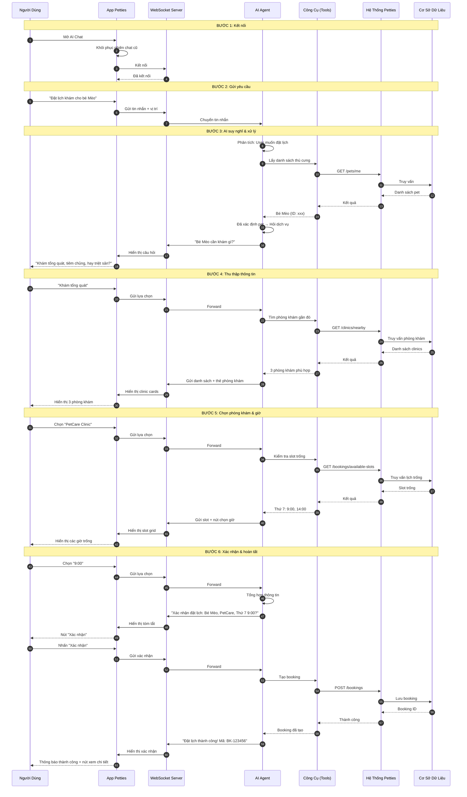
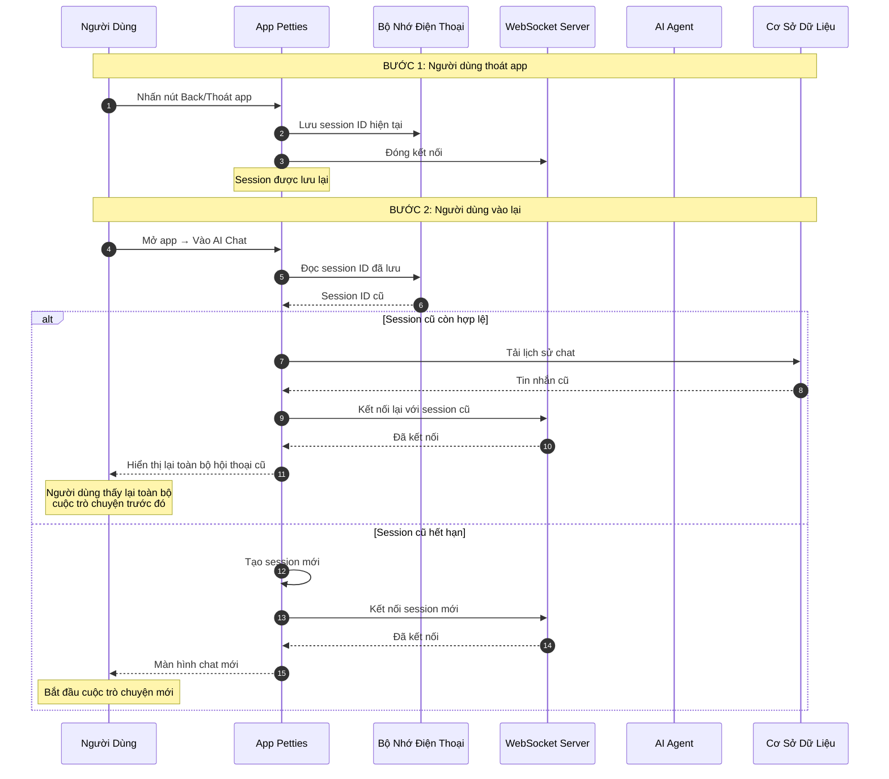

# Petties AI Chatbot - Hướng Dẫn Tổng Quan

**Phiên bản:** 1.0.0  
**Cập nhật:** 01/04/2026  
**Dành cho:** Khách hàng, Người dùng cuối, Stakeholders

---

## 1. AI Chatbot Là Gì?

Petties AI Chatbot là **trợ lý ảo thông minh** được tích hợp trong ứng dụng Petties, giúp chủ thú cưng và nhân viên phòng khám:

- **Tư vấn sức khỏe thú cưng** - Nhận diện triệu chứng, hướng dẫn chăm sóc
- **Đặt lịch khám tự động** - Tìm phòng khám, chọn dịch vụ, đặt lịch chỉ bằng vài câu chat
- **Tra cứu thông tin** - Lịch tiêm chủng, hồ sơ y tế, đánh giá phòng khám
- **Hỗ trợ 24/7** - Luôn sẵn sàng, không cần chờ nhân viên

> **Không cần học cách dùng** - Chỉ cần chat như nói chuyện với người thật!

---

## 2. AI Chatbot Làm Được Gì?

### 2.1. Đặt Lịch Khám Thông Minh

```
Bạn: "Đặt lịch khám cho bé Mèo nhà tôi"
AI:  "Bé Mèo của bạn cần khám gì? Khám tổng quát, tiêm chủng, hay triệt sản?"
Bạn: "Khám tổng quát"
AI:  "Phòng khám PetCare còn slot trống thứ 7 này lúc 9:00 và 14:00. Bạn chọn giờ nào?"
Bạn: "9:00 đi"
AI:  "Đã đặt lịch thành công! Hẹn gặp bé Mèo tại PetCare vào thứ 7, 9:00 sáng."
```

**Chỉ 3 bước đơn giản:**
1. Nói muốn đặt lịch
2. Chọn dịch vụ và giờ
3. Xác nhận rõ ràng - Xong!

> Booking chỉ được tạo sau khi AI tóm tắt lại thông tin và người dùng xác nhận rõ ràng.

### 2.2. Tìm Phòng Khám Phù Hợp

```
Bạn: "Tìm phòng khám có dịch vụ triệt sản gần quận 1"
AI:  "Mình tìm được 3 phòng khám gần bạn:
      1. PetCare Clinic - 1.2km, đánh giá 4.8/5
      2. Happy Vet - 2.5km, đánh giá 4.5/5
      3. Animal Hospital - 3.1km, đánh giá 4.9/5
      Bạn muốn xem chi tiết phòng khám nào?"
```

### 2.3. Tư Vấn Sức Khỏe

```
Bạn: "Chó nhà tôi bị nôn, phải làm sao?"
AI:  "Chó nôn có thể do nhiều nguyên nhân. Bé nhà bạn:
      - Nôn mấy lần rồi?
      - Có kèm tiêu chảy không?
      - Ăn uống bình thường không?
      
      Nếu nôn liên tục > 3 lần hoặc nôn ra máu, cần đưa đi khám NGAY.
      Còn nếu chỉ nôn 1-2 lần, có thể cho nhịn ăn 12 tiếng và theo dõi."
```

### 2.4. Tra Cứu Hồ Sơ

```
Bạn: "Bé Mèo nhà tôi tiêm mũi nào tiếp theo?"
AI:  "Bé Mèo đã tiêm:
      - Mũi 1: Feline Distemper (15/01/2026)
      - Mũi 2: Feline Leukemia (15/02/2026)
      
      Mũi tiếp theo cần tiêm:
      - Mũi 3: Feline Distemper (15/03/2026) - ĐÃ QUÁ HẠN!
      
      Bạn có muốn đặt lịch tiêm ngay không?"
```

---

## 3. Cách Hoạt Động - Swimlane Diagram

### 3.1. Luồng Đặt Lịch Khám



### 3.2. Luồng Tư Vấn Sức Khỏe

```mermaid
sequenceDiagram
    autonumber
    participant User as Người Dùng
    participant Mobile as App Petties
    participant AI as AI Agent
    participant Tools as Công Cụ (Tools)
    participant Backend as Hệ Thống Petties
    participant DB as Cơ Sở Dữ Liệu
    participant KB as Knowledge Base (RAG)

    Note over User,KB: BƯỚC 1: Gửi câu hỏi
    User->>Mobile: "Chó nhà tôi bị nôn phải làm sao?"
    Mobile->>AI: Gửi qua WebSocket

    Note over User,KB: BƯỚC 2: AI phân tích & tra cứu
    AI->>AI: Nhận diện: Câu hỏi về triệu chứng
    AI->>Tools: pet_knowledge_search
    Tools->>KB: Tìm kiếm RAG
    KB-->>Tools: Kiến thức liên quan
    Tools-->>AI: Kết quả tìm kiếm

    AI->>AI: Hỏi thêm thông tin
    AI->>Mobile: "Bé nôn mấy lần? Có kèm triệu chứng khác không?"
    Mobile-->>User: Hiển thị câu hỏi

    Note over User,KB: BƯỚC 3: Thu thập thông tin bổ sung
    User->>Mobile: "Nôn 2 lần, kèm tiêu chảy"
    Mobile->>AI: Gửi thông tin
    AI->>Tools: pet_knowledge_search
    Tools->>KB: Tra cứu triệu chứng
    KB-->>Tools: Bệnh có thể
    Tools-->>AI: Kết quả

    Note over User,KB: BƯỚC 4: Trả lời & khuyến nghị
    AI->>AI: Tổng hợp kết quả
    AI->>Mobile: "Có thể do viêm dạ dày ruột. Nên:
                 1. Nhịn ăn 12 tiếng
                 2. Cho uống nước điện giải
                 3. Nếu không cải thiện → đi khám
                 
                 Bạn có muốn đặt lịch khám không?"
    Mobile-->>User: Hiển thị tư vấn + nút đặt lịch
```

### 3.3. Luồng Khi Người Dùng Thoát & Vào Lại



---

## 4. Kiến Trúc Đơn Giản Hóa

```
┌─────────────────────────────────────────────────────────────┐
│                     Petties AI Chatbot                       │
├─────────────────────────────────────────────────────────────┤
│                                                              │
│  ┌──────────┐    ┌──────────┐    ┌──────────┐              │
│  │  Người   │◄──►│   App    │◄──►│  AI Agent│              │
│  │   Dùng   │    │  Mobile  │    │ (ReAct)  │              │
│  └──────────┘    └──────────┘    └──────────┘              │
│                                      │                       │
│                    ┌─────────────────┼─────────────────┐    │
│                    ▼                 ▼                 ▼    │
│              ┌──────────┐    ┌──────────┐    ┌──────────┐ │
│              │  Công cụ │    │ Kiến thức│    │  Phòng   │ │
│              │  (Tools) │    │   (RAG)  │    │   khám   │ │
│              └──────────┘    └──────────┘    └──────────┘ │
│                    │                                       │
│                    ▼                                       │
│              ┌──────────┐                                 │
│              │  Backend │                                 │
│              │ Spring   │                                 │
│              │  Boot    │                                 │
│              └──────────┘                                 │
│                                                              │
└─────────────────────────────────────────────────────────────┘
```

### 4.1. Giải Thích Các Thành Phần

| Thành Phần | Vai Trò | Ví Dụ |
|------------|---------|-------|
| **App Mobile** | Giao diện chat, hiển thị kết quả | Màn hình chat, thẻ phòng khám, nút chọn giờ |
| **AI Agent** | Bộ não - hiểu yêu cầu, quyết định hành động | Phân tích "đặt lịch" → biết cần hỏi pet, dịch vụ, giờ |
| **Công cụ (Tools)** | Tay chân - thực hiện hành động cụ thể | Tìm phòng khám, kiểm tra slot, tạo booking |
| **Kiến thức (RAG)** | Thư viện - chứa kiến thức chăm sóc thú cưng | Triệu chứng bệnh, cách chăm sóc, dinh dưỡng |
| **Backend** | Hệ thống chính - quản lý dữ liệu | Lưu booking, quản lý phòng khám, hồ sơ y tế |

---

## 5. Tính Năng Nổi Bật

### 5.1. Hiểu Ngữ Cảnh

AI nhớ toàn bộ cuộc trò chuyện:

```
Bạn: "Đặt lịch cho bé Mèo"
AI:  "Bé Mèo cần khám gì?"
Bạn: "Khám tổng quát"        ← AI biết "bé Mèo" từ câu trước
AI:  "Phòng khám nào?"
Bạn: "Gần tôi"               ← AI biết đang nói về phòng khám
AI:  "Tìm được 3 phòng khám gần bạn..."
```

### 5.2. Đa Ngôn Ngữ Tự Nhiên

Không cần học cú pháp - nói chuyện bình thường:

- "Đặt lịch khám" ✓
- "Book lịch" ✓
- "Hẹn gặp bác sĩ" ✓
- "Cho bé đi khám" ✓

### 5.3. Gợi Ý Thông Minh

AI tự động gợi ý dựa trên ngữ cảnh:

- Đang đặt lịch → Gợi ý: "Thứ 7 này", "Sáng mai", "Cuối tuần"
- Hỏi về tiêm chủng → Gợi ý: "Lịch tiêm của bé", "Đặt lịch tiêm"
- Triệu chứng nguy hiểm → Gợi ý: "Đặt lịch khám ngay"

### 5.4. Hiển Thị Trực Quan

Không chỉ text - AI hiển thị:

- **Thẻ phòng khám** - Hình ảnh, đánh giá, khoảng cách
- **Nút chọn giờ** - Grid các slot trống, nhấn là chọn
- **Service chips** - Danh sách dịch vụ, chọn dễ dàng
- **Tóm tắt booking** - Xem lại trước khi xác nhận

---

## 6. Thêm Tính Năng Mới

### 6.1. Cách Hoạt Động

AI Chatbot được thiết kế **mở rộng dễ dàng** - giống như lắp thêm công cụ mới cho trợ lý:

```
┌─────────────────────────────────────────────────────────────┐
│                    Thêm Tính Năng Mới                        │
├─────────────────────────────────────────────────────────────┤
│                                                              │
│  Bước 1: Định nghĩa "công cụ" mới                           │
│  ┌──────────────────────────────────────────────────────┐   │
│  │ Tool: "huy_lich_kham"                                │   │
│  │ Mô tả: Hủy lịch khám đã đặt                          │   │
│  │ Input: booking_id                                    │   │
│  └──────────────────────────────────────────────────────┘   │
│                                                              │
│  Bước 2: AI tự động học cách dùng                           │
│  ┌──────────────────────────────────────────────────────┐   │
│  │ Khi user nói "hủy lịch" → AI hiểu → gọi tool mới    │   │
│  └──────────────────────────────────────────────────────┘   │
│                                                              │
│  Bước 3: Sync vào hệ thống                                  │
│  ┌──────────────────────────────────────────────────────┐   │
│  │ Tự động đăng ký khi khởi động service                 │   │
│  └──────────────────────────────────────────────────────┘   │
│                                                              │
└─────────────────────────────────────────────────────────────┘
```

### 6.2. Ví Dụ Thực Tế

**Muốn thêm tính năng "Xem đánh giá phòng khám":**

1. Tạo tool `get_clinic_reviews(clinic_id)` → Trả về danh sách đánh giá
2. AI tự hiểu: Khi user hỏi "phòng khám này có tốt không?" → gọi tool mới
3. Hiển thị: Thẻ đánh giá với sao ⭐⭐⭐⭐⭐ và nhận xét

**Không cần sửa code AI** - chỉ cần thêm tool, AI tự học cách dùng!

---

## 7. Tính Năng Tương Lai

### 7.1. Đang Phát Triển

| Tính Năng | Mô Tả | Lợi Ích |
|-----------|-------|---------|
| **Hủy lịch qua chat** | Nói "hủy lịch thứ 7" → AI tự hủy | Tiện lợi, không cần vào app |
| **Sửa lịch qua chat** | "Đổi lịch sang chủ nhật" → AI tự sửa | Linh hoạt thời gian |
| **Nhắc nhở tự động** | AI tự gửi nhắc nhở trước lịch khám | Giảm quên lịch, no-show |
| **Đánh giá sau khám** | AI hỏi trải nghiệm sau khi khám | Cải thiện chất lượng |

### 7.2. Kế Hoạch Dài Hạn

| Tính Năng | Mô Tả | Lợi Ích |
|-----------|-------|---------|
| **Nhận diện ảnh** | Chụp ảnh triệu chứng → AI phân tích | Chẩn đoán nhanh hơn |
| **Đa ngôn ngữ** | Hỗ trợ tiếng Anh, tiếng Trung | Mở rộng thị trường |
| **Voice chat** | Nói chuyện bằng giọng nói | Tiện lợi hơn |
| **Tích hợp Zalo** | Chat qua Zalo | Tiếp cận nhiều user hơn |

---

## 8. Câu Hỏi Thường Gặp

### Q: AI có thay thế bác sĩ thú y không?
**A:** Không. AI chỉ hỗ trợ tư vấn ban đầu và đặt lịch. Chẩn đoán cuối cùng luôn cần bác sĩ thú y.

### Q: AI có nhớ thông tin cá nhân không?
**A:** AI chỉ nhớ thông tin trong phiên chat hiện tại. Dữ liệu được bảo mật và không chia sẻ bên thứ ba.

### Q: Nếu AI không hiểu câu hỏi thì sao?
**A:** AI sẽ hỏi lại để làm rõ. Bạn có thể diễn đạt lại câu hỏi theo cách khác.

### Q: AI có hoạt động 24/7 không?
**A:** Có. AI luôn sẵn sàng hỗ trợ, kể cả ngoài giờ làm việc của phòng khám.

### Q: Làm sao để AI thông minh hơn?
**A:** AI được cập nhật kiến thức thường xuyên. Mỗi lần tương tác giúp AI hiểu ngữ cảnh tốt hơn.

---

## 9. Liên Hệ Hỗ Trợ

| Kênh | Thông Tin |
|------|-----------|
| **Email** | support@petties.world |
| **Hotline** | 1900 xxxx |
| **Giờ hỗ trợ** | 8:00 - 22:00 (Thứ 2 - Chủ nhật) |

---

*Tài liệu phiên bản 1.0.0 - Cập nhật 01/04/2026*  
*Petties - Nền tảng đặt lịch khám thú y thông minh*
