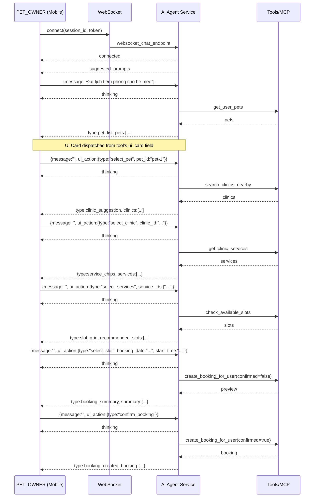
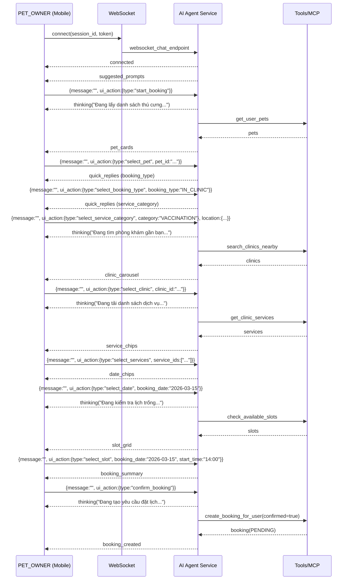

# Hợp Đồng WebSocket AI Chat (Interactive Booking)

**Phiên bản:** 2.0  
**Ngày cập nhật:** 2026-03-22

Tài liệu này mô tả hợp đồng dữ liệu WebSocket giữa Mobile App (PET_OWNER) và AI Agent Service cho trải nghiệm chat ReAct + đặt lịch bằng Interactive Components.

> **Cập nhật v2.0:** UI Cards được define trực tiếp trong tool return values (`ui_card` field). chat.py dùng generic dispatcher - không còn hardcoded extraction.

## Mục tiêu UX
- Giảm nhập liệu: ưu tiên chips/cards/carousel/slot grid.
- Minh bạch trạng thái: luôn có một dòng trạng thái ngắn để người dùng biết AI đang làm gì.
- Không tạo booking ngoài ý muốn: chỉ tạo booking khi người dùng bấm nút **XÁC NHẬN ĐẶT LỊCH**.
- Clinic manager là người xác nhận thời gian cuối: booking được tạo ở trạng thái chờ xác nhận.

## Kết nối
- Endpoint: `ws(s)://<AI_SERVICE_ROOT>/ws/chat/{session_id}?token=<JWT>&context_type=BUSINESS_CHAT`
- Client gửi/nhận JSON.

## Client -> Server (Outgoing)

### 1) Gửi tin nhắn thường
```json
{ "message": "Tôi muốn đặt lịch tiêm phòng cho bé Lu" }
```

### 2) Gửi UI action (bắt buộc có `message: ""`)
Lưu ý: để tránh server lưu nguyên JSON string vào chat history, client luôn gửi `message` rỗng.

```json
{
  "message": "",
  "ui_action": { "type": "start_booking" },
  "location": { "lat": 10.7626, "lng": 106.6602 }
}
```

Các `ui_action.type` chính (Interactive Booking):
- `start_booking`
- `select_pet` (`pet_id`)
- `select_booking_type` (`booking_type`: `IN_CLINIC` | `HOME_VISIT`)
- `select_service_category` (`category`: `CONSULT` | `VACCINATION` | `GROOMING`)
- `select_clinic` (`clinic_id`)
- `select_services` (`service_ids`: string[])
- `select_date` (`booking_date`: `YYYY-MM-DD`)
- `select_slot` (`booking_date`, `start_time`)
- `confirm_booking`
- `cancel_or_change`

## Server -> Client (Incoming)

### A) Event tiêu chuẩn (ReAct streaming)
- `connected`: handshake OK
- `history`: restore lịch sử message
- `ack`: server đã nhận message
- `thinking`: trạng thái ngắn (hoặc thought trong ReAct)
- `tool_call`: AI đang gọi tool nào
- `tool_result`: tool trả về (có thể dùng để debug)
- `stream`: token text trả về theo luồng
- `complete`: kết thúc lượt trả lời
- `error`: lỗi

### B) Event cho Interactive Components (v2.0 - Generic UI Cards)

> **Design Change:** Thay vì hardcoded event names, server dùng generic `extract_ui_card()` để đọc `ui_card` từ tool return values.

| UI Card Type | Tool Source | Trigger | Fields |
|--------------|-------------|---------|--------|
| `clinic_suggestion` | `search_clinics_nearby` | Success with clinics | `clinics[]`, `total_found`, `location` |
| `service_chips` | `get_clinic_services` | Success with services | `clinic_id`, `services[]`, `message` |
| `slot_grid` | `check_available_slots` | Success with slots | `clinic_id`, `booking_date`, `recommended_slots[]`, `alternative_slots[]`, `total_slots` |
| `booking_summary` | `create_booking_for_user` | Not confirmed yet | `pet_id`, `clinic_id`, `clinic_name`, `booking_date`, `start_time`, `service_ids[]`, `booking_type`, `notes`, `home_address` |
| `booking_created` | `create_booking_for_user` | Confirmed success | `booking{}` (single) hoặc `bookings[]` (multi-pet) |
| `pet_list` | `get_user_pets` | Success with pets | `pets[]` (id, name, species, breed, age_years, avatar_url) |
| `vaccination_card` | `check_vaccination_status` | Always | `pet_id`, `history[]`, `upcoming[]` |

**Generic Payload Format:**
```json
{
  "type": "<ui_card_type>",
  "<additional_fields>": "...",
  "timestamp": "2026-03-22T10:30:00Z"
}
```

**Ví dụ `clinic_suggestion`:**
```json
{
  "type": "clinic_suggestion",
  "clinics": [
    {
      "id": "clinic-uuid",
      "name": "Phòng khám Thú Y ABC",
      "address": "123 Nguyễn Trãi, Q1",
      "distance_km": 1.2,
      "rating": 4.5,
      "has_sos": true,
      "operating_hours": "T2-CN: 8:00-20:00"
    }
  ],
  "total_found": 3,
  "location": {"lat": 10.7626, "lng": 106.6602, "address": "Quận 1, TP.HCM"},
  "timestamp": "2026-03-22T10:30:00Z"
}
```

**Ví dụ `service_chips`:**
```json
{
  "type": "service_chips",
  "clinic_id": "clinic-uuid",
  "services": [
    {"id": "svc-1", "name": "Khám tổng quát", "category": "CONSULT", "base_price": 150000},
    {"id": "svc-2", "name": "Tiêm phòng dại", "category": "VACCINATION", "base_price": 200000}
  ],
  "message": "Mình đã lấy được danh sách dịch vụ phù hợp. Bạn chọn dịch vụ cần đặt lịch nhé.",
  "timestamp": "2026-03-22T10:30:00Z"
}
```

**Ví dụ `slot_grid`:**
```json
{
  "type": "slot_grid",
  "clinic_id": "clinic-uuid",
  "booking_date": "2026-03-25",
  "service_ids": ["svc-1"],
  "service_names": ["Khám tổng quát"],
  "recommended_slots": [
    {"start_time": "09:00", "end_time": "09:30", "duration_minutes": 30},
    {"start_time": "10:00", "end_time": "10:30", "duration_minutes": 30}
  ],
  "alternative_slots": [
    {"start_time": "14:00", "end_time": "14:30", "duration_minutes": 30}
  ],
  "total_slots": 3,
  "message": "Mình đã tìm được các khung giờ phù hợp. Bạn chọn một khung giờ để tiếp tục nhé.",
  "timestamp": "2026-03-22T10:30:00Z"
}
```

**Ví dụ `booking_summary`:**
```json
{
  "type": "booking_summary",
  "pet_id": "pet-uuid",
  "clinic_id": "clinic-uuid",
  "clinic_name": "Phòng khám Thú Y ABC",
  "booking_date": "2026-03-25",
  "start_time": "09:00",
  "service_ids": ["svc-1"],
  "booking_type": "IN_CLINIC",
  "notes": "Bé mèo 2 tháng tuổi",
  "home_address": null,
  "message": "Mình đã tổng hợp đủ thông tin cơ bản. Bạn xác nhận để mình tạo yêu cầu đặt lịch nhé.",
  "timestamp": "2026-03-22T10:30:00Z"
}
```

**Ví dụ `booking_created`:**
```json
{
  "type": "booking_created",
  "booking": {
    "id": "booking-uuid",
    "booking_code": "BK202603220001",
    "status": "PENDING",
    "pet_name": "Bé Lu",
    "clinic_name": "Phòng khám Thú Y ABC",
    "date": "2026-03-25",
    "time": "09:00",
    "type": "IN_CLINIC",
    "services": ["Khám tổng quát"]
  },
  "message": "Da tao yeu cau booking cho Bé Lu tai Phòng khám Thú Y ABC. Clinic manager se xac nhan sau.",
  "timestamp": "2026-03-22T10:30:00Z"
}
```

**Ví dụ `pet_list`:**
```json
{
  "type": "pet_list",
  "pets": [
    {"id": "pet-1", "name": "Bé Lu", "species": "CAT", "breed": "Mèo ta", "age_years": 2, "avatar_url": "https://..."},
    {"id": "pet-2", "name": "Bé Mu", "species": "DOG", "breed": "Poodle", "age_years": 1, "avatar_url": "https://..."}
  ],
  "timestamp": "2026-03-22T10:30:00Z"
}
```

## Quy tắc xác nhận (đảm bảo an toàn)
- Server chỉ gọi tool `create_booking_for_user` khi:
  - Flow Interactive nhận `ui_action.type = confirm_booking`, hoặc
  - Tool call có `confirmed=true` từ UI action.
- Text-based booking trong `BUSINESS_CHAT` của `PET_OWNER` bị chặn không cho "confirm ngầm".

## Trạng thái ngắn (Status Line)
- Client hiển thị status dựa trên các event: `thinking`, `tool_call`, `tool_result`, `stream`.
- Với Interactive Booking, server gửi `thinking` trước khi gọi từng tool để người dùng không sốt ruột.

## Streaming mượt
- Client nên buffer token `stream` và flush theo cụm (ví dụ 50-80ms) để tránh giật.

## Khôi phục khi reconnect
- Server lưu `metadata.last_ui_event` (chỉ với UI event có thể tương tác) và gửi lại sau `history` để người dùng tiếp tục flow.

## Architecture: Tool Self-Contained UI Cards

```
┌─────────────────────────────────────────────────────────────┐
│ Tool Implementation (booking_tools.py)                      │
│                                                              │
│ return {                                                     │
│   "data": result,                                            │
│   "ui_card": {                                               │
│     "type": "clinic_suggestion",                            │
│     "clinics": [...],                                        │
│     "total_found": 5,                                       │
│     "location": {...}                                       │
│   }                                                          │
│ }                                                            │
└─────────────────────────────────────────────────────────────┘
                         │
                         ▼
┌─────────────────────────────────────────────────────────────┐
│ Generic Dispatcher (chat.py)                                  │
│                                                              │
│ def extract_ui_card(step):                                   │
│     return step.tool_result.get("ui_card")                   │
│                                                              │
│ # KHÔNG hardcoded tool names                                 │
└─────────────────────────────────────────────────────────────┘
                         │
                         ▼
┌─────────────────────────────────────────────────────────────┐
│ WebSocket -> Client                                           │
│                                                              │
│ {"type": "clinic_suggestion", "clinics": [...], ...}         │
└─────────────────────────────────────────────────────────────┘
```

**Thêm tool mới:**
```python
@mcp_server.tool
async def my_new_tool(...) -> Dict:
    result = await do_something(...)
    
    return {
        "data": result,
        "ui_card": {
            "type": "my_new_card",
            "field1": result.value1,
            "field2": result.value2,
        }
    }
```

## Sequence Diagram (Interactive Booking - v2.0)


### 2) Gửi UI action (bắt buộc có `message: ""`)
Lưu ý: để tránh server lưu nguyên JSON string vào chat history, client luôn gửi `message` rỗng.

```json
{
  "message": "",
  "ui_action": { "type": "start_booking" },
  "location": { "lat": 10.7626, "lng": 106.6602 }
}
```

Các `ui_action.type` chính (Interactive Booking):
- `start_booking`
- `select_pet` (`pet_id`)
- `select_booking_type` (`booking_type`: `IN_CLINIC` | `HOME_VISIT`)
- `select_service_category` (`category`: `CONSULT` | `VACCINATION` | `GROOMING`)
- `select_clinic` (`clinic_id`)
- `select_services` (`service_ids`: string[])
- `select_date` (`booking_date`: `YYYY-MM-DD`)
- `select_slot` (`booking_date`, `start_time`)
- `confirm_booking`
- `cancel_or_change`

## Server -> Client (Incoming)

### A) Event tiêu chuẩn (ReAct streaming)
- `connected`: handshake OK
- `history`: restore lịch sử message
- `ack`: server đã nhận message
- `thinking`: trạng thái ngắn (hoặc thought trong ReAct)
- `tool_call`: AI đang gọi tool nào
- `tool_result`: tool trả về (có thể dùng để debug)
- `stream`: token text trả về theo luồng
- `complete`: kết thúc lượt trả lời
- `error`: lỗi
- `clinic_suggestion`: gợi ý phòng khám (legacy)

### B) Event cho Interactive Components (Booking)
- `suggested_prompts`: chips gợi ý khi mở chat
- `pet_cards`: danh sách thú cưng dạng card
- `quick_replies`: lựa chọn nhanh (hình thức khám / nhóm dịch vụ)
- `clinic_carousel`: danh sách phòng khám dạng carousel
- `service_chips`: chips chọn dịch vụ (multi-select)
- `date_chips`: chips chọn ngày
- `slot_grid`: chips chọn giờ theo ngày
- `booking_summary`: thẻ tóm tắt + 2 nút hành động
- `booking_created`: thông báo đã tạo yêu cầu đặt lịch

Ví dụ `booking_summary`:
```json
{
  "type": "booking_summary",
  "title": "Bạn kiểm tra lại thông tin đặt lịch:",
  "summary": {
    "pet_id": "...",
    "clinic_id": "...",
    "clinic_name": "Phòng khám A",
    "service_ids": ["..."],
    "booking_date": "2026-03-15",
    "start_time": "14:00",
    "booking_type": "IN_CLINIC",
    "estimated_price": 200000
  },
  "actions": [
    { "label": "XÁC NHẬN ĐẶT LỊCH", "ui_action": { "type": "confirm_booking" } },
    { "label": "HỦY / THAY ĐỔI", "ui_action": { "type": "cancel_or_change" } }
  ],
  "timestamp": "..."
}
```

## Quy tắc xác nhận (đảm bảo an toàn)
- Server chỉ gọi tool `create_booking_for_user` khi:
  - Flow Interactive nhận `ui_action.type = confirm_booking`, hoặc
  - Tool call có `confirmed=true` từ UI action.
- Text-based booking trong `BUSINESS_CHAT` của `PET_OWNER` bị chặn không cho “confirm ngầm”.

## Trạng thái ngắn (Status Line)
- Client hiển thị status dựa trên các event: `thinking`, `tool_call`, `tool_result`, `stream`.
- Với Interactive Booking, server gửi `thinking` trước khi gọi từng tool để người dùng không sốt ruột.

## Streaming mượt
- Client nên buffer token `stream` và flush theo cụm (ví dụ 50-80ms) để tránh giật.

## Khôi phục khi reconnect
- Server lưu `metadata.last_ui_event` (chỉ với UI event có thể tương tác) và gửi lại sau `history` để người dùng tiếp tục flow.

## Sequence Diagram (Interactive Booking)

