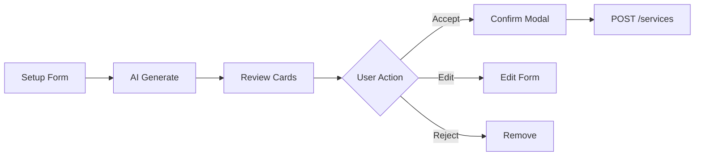
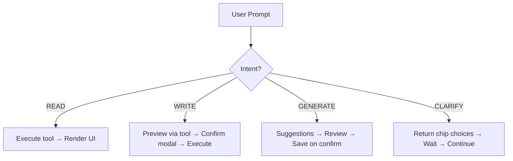

# AI Assistant cho Clinic - Implementation Plan

## IMPORTANT - Scope Separation (2026-04-03)

**Plan này bao gồm 3 scope khác nhau, cần tách rõ:**

**Platform clarification:**
- AI Assistant cho `CLINIC_OWNER` và `CLINIC_MANAGER` nằm trên Web Dashboard.
- Mobile AI chỉ dành cho `STAFF`.
- `PET_OWNER` khong nam trong scope AI Assistant va khong duoc expose route AI tren mobile.

| Package | Scope | Priority | Status |
|---------|-------|----------|--------|
| **A. Clinic Setup AI** | generate_clinic_services + review/save (SRS 3.13.1) | **HIGH** | DONE - Phase 0 |
| **B. Manager Analytics** | Read-only metrics, shifts, reviews | MEDIUM | FUTURE |
| **C. Workspace Redesign** | Notion-style full page | **FUTURE** | Not in scope |

**Xem chi tiết:** [Gap Analysis](./AI_COPILOT_CLINIC_GAP_ANALYSIS.md)

---

## 1. Overview

### 1.0 Tại Sao Cần AI Assistant Cho Clinic

#### 1.0.1 Vấn Đề Hiện Tại (Nếu Không Có AI Assistant)

| Vấn đề | Impact | Frequency |
|--------|--------|-----------|
| **Manual service entry** | Mất 2-4 giờ nhập tay từng dịch vụ khi setup clinic | Mỗi lần setup mới |
| **Không biết giá thị trường** | Owner không có baseline để pricing dịch vụ | Thường xuyên |
| **Thiếu visibility** | Manager phải vào nhiều màn hình để xem metrics | Hàng ngày |
| **Khó truy vấn nhanh** | Phải click qua nhiều menu để xem lịch trực/bookings | Hàng ngày |
| **Không có insights** | Không biết dịch vụ nào hot, dịch vụ nào ế | Hàng tuần |
| **Thao tác thủ công** | Phải vào form CRUD để đổi giá, toggle status | Thường xuyên |

#### 1.0.2 Nếu Có AI Assistant - Làm Được Gì

| Use Case | Trước (Manual) | Sau (AI Assistant) |
|----------|----------------|------------------|
| **Setup danh mục dịch vụ** | 2-4 giờ nhập tay | 5-10 phút + review |
| **Xem doanh thu** | Vào 3-4 màn hình khác nhau | 1 prompt: "Doanh thu tuần này" |
| **Kiểm tra lịch trực** | Vào calendar, filter từng ngày | 1 prompt: "Lịch trực ngày mai" |
| **Cập nhật giá dịch vụ** | Vào form edit, search, update | 1 prompt: "Đổi giá tiêm phòng thành 220k" + confirm |
| **Tìm insights** | Không có hoặc phải export Excel | 1 prompt: "Dịch vụ nào được đặt nhiều nhất?" |
| **Xem bookings pending** | Vào booking list, filter status | 1 prompt: "Bookings chờ xác nhận" |

#### 1.0.3 Cải Thiện Những Gì

| Dimension | Improvement | Measurable |
|-----------|-------------|------------|
| **Tốc độ** | Setup clinic: 4h → 10 phút | 95% reduction |
| **Tiện lợi** | Truy vấn: 5 clicks → 1 prompt | 80% fewer clicks |
| **Accessibility** | Không cần navigate nhiều menu | 1 entry point |
| **Insights** | Từ không có → có recommendations | Data-driven decisions |
| **Error reduction** | Manual entry errors → AI suggestions | Validation + review |
| **Onboarding** | Owner mới không biết bắt đầu từ đâu → AI guide | Guided setup |

#### 1.0.4 Giá Trị Cốt Lõi

- Speed: Setup trong vài phút thay vì vài giờ.
- Intelligence: Gợi ý dịch vụ va thao tac dua tren du lieu co cau truc.
- Convenience: 1 prompt de tim thong tin hoac thuc hien buoc review.
- Safety: HITL bat buoc truoc moi write action.
- Transparency: Co audit trail va feedback de theo doi.
- Collaboration: Web dashboard phu hop cho owner/manager, mobile AI tach rieng cho staff.

---

### 1.1 Mục tiêu - Phase 0 (Priority)

AI hỗ trợ CLINIC_OWNER thiết lập danh mục dịch vụ khởi tạo:
- **Generate**: Tạo danh sách dịch vụ mẫu từ master services
- **Review**: Hiển thị để user review/edit
- **Save**: Lưu vào DB sau khi user xác nhận (HITL - Human In The Loop)

**Phase 0 KHÔNG bao gồm:**
- Revenue analytics
- Staff management
- Full workspace redesign
- CRUD operations phức tạp

### 1.2 User Roles - Phase 0

| Role | Platform | Access |
|------|----------|--------|
| CLINIC_OWNER | Web | ✅ Full access (generate + review + save) |
| CLINIC_MANAGER | Web | ⚠️ View only (sau Phase 0) |
| STAFF | Mobile | Out of scope cho Clinic Setup AI; chi dung mobile AI staff workflow |
| PET_OWNER | Mobile | Khong co AI Assistant |

### 1.3 SRS References

| SRS Section | Feature | Status |
|-------------|---------|--------|
| 3.13.1 | AI Generate Clinic Services (UC-CO-14) | **✅ DONE - Phase 0** |
| 3.6.6 | Create/Update/Delete Clinic Service (UC-CO-03) | Backend done, AI tool ✅ |
| 3.6.7 | Inherit From Master Service | Backend done, AI tool ✅ |

### 1.4 Verified API Paths

| Feature | Real API Path | Method |
|---------|---------------|--------|
| List clinic services | `/api/services` | GET |
| Create service | `/api/services` | POST |
| Update service | `/api/services/{serviceId}` | PUT |
| Get master services | `/api/master-services` | GET |
| Inherit from master | `/api/services/inherit/{masterServiceId}` | POST |
| Get staff shifts | `/api/clinics/{clinicId}/shifts` | GET |
| Create shift | `/api/clinics/{clinicId}/shifts` | POST |

---

## 2. Phase 0: Clinic Setup AI (PRIORITY)

### 2.1 Tool: `generate_clinic_services` (UC-CO-14)

**Mục đích**: AI tự động tạo danh sách dịch vụ mẫu dựa trên loại hình clinic, pet types, service scope.

**User Flow (SRS 3.13.1)**:
```
1. Owner opens Clinic Setup → "AI Generate Services"
2. AI asks: "Clinic type?", "Pet types?", "Service scope?"
3. AI calls: GET /master-services → filter by criteria
4. AI returns: List of suggested services with confidence scores
5. Owner reviews: Accept/Edit/Reject từng service
6. Owner clicks: "Save All"
7. AI opens HITL confirm modal, sau đó gửi batch create intent
8. AI calls: POST /services nhiều lần theo từng service đã xác nhận
9. Success → Redirect to services list
```

**Backend Integration**:
- `GET /api/master-services` - Lấy master services để suggest
- `POST /api/services` - Tạo clinic service (batch)

**Input Parameters**:
```json
{
  "clinic_id": "uuid-123",
  "clinic_type": "general|petshop|hospital",
  "pet_types": ["dog", "cat"],
  "service_scope": ["healthcare", "vaccination", "beauty"]
}
```

**Output**:
```json
{
  "suggestions": [
    {
      "name": "Khám tổng quát",
      "service_category": "HEALTHCARE",
      "description": "Khám sức khỏe tổng quát cho thú cưng",
      "base_price": 150000,
      "duration_minutes": 30,
      "confidence": 0.95,
      "source": "master_service"
    }
  ],
  "total_suggestions": 10
}
```

**UISchema Components**:
- `service_generation_card` - Card hiển thị 1 suggestion
- `bulk_action_bar` - "Chấp nhận tất cả" / "Bỏ tất cả"
- `review_modal` - Confirm trước khi save

**HITL (Human In The Loop)**:
- ❌ AI không tự động save
- ✅ User phải review và click "Save All"
- ✅ UI phải show confirm modal

---

### 2.2 Tool: `list_clinic_services`

**Mục đích**: Liệt kê tất cả services của clinic (read-only).

**Backend Integration**:
- `GET /api/services` - Lấy danh sách services

**User Prompts**:
- "Liệt kê các dịch vụ"
- "Cho tôi xem giá tiêm phòng"

**Output**:
```json
{
  "services": [
    {
      "service_id": "uuid-1",
      "name": "Tiêm phòng 5 bệnh",
      "base_price": 200000,
      "is_active": true,
      "service_category": "VACCINATION"
    }
  ],
  "total": 15
}
```

**UISchema**: `service_list_card` (read-only, không edit trong chat)

---

### 2.3 Tool: `update_service_info` (Phase 1)

**Mục đích**: Cập nhật thông tin service (price, description, active).

**Backend Integration**:
- `PUT /api/services/{serviceId}` - Update service

**User Prompts**:
- "Đổi giá tiêm phòng thành 220k"

**HITL Required**:
- AI phải show confirm modal trước khi gọi PUT
- User phải click "Xác nhận" mới thực hiện update

**Output**:
```json
{
  "updated": true,
  "service_id": "uuid-1",
  "changes": {
    "base_price": {"old": 200000, "new": 220000}
  }
}
```

---

## 3. Future Scope (NOT in Phase 0)

### 3.1 Manager Analytics (Future Phase)

**Tools dự kiến** (chưa enable trong context policy):
- `get_clinic_overview` - Dashboard metrics
- `analyze_revenue_trends` - Revenue analytics
- `get_staff_schedule` - View shifts
- `get_appointment_insights` - Booking analytics

**Note**: Các tools này hiện đang DISABLED trong context_policy.py

### 3.2 Workspace Redesign (Future)

**Không trong scope hiện tại**:
- Notion-style workspace
- Full-page editable components
- Tab-based navigation

**Có thể revisit sau khi Phase 0 hoàn thành.**

---

## 4. Implementation Checklist

### Phase 0: Generate Services Flow

- [ ] AI Tool: `generate_clinic_services` (mcp tool)
- [ ] Backend: Map GET /master-services
- [ ] Frontend: ServiceGenerationPage hoặc reuse chat
- [ ] UI: Review cards với Accept/Edit/Reject
- [ ] UI: Confirm modal trước save
- [ ] Backend: POST /services (batch create)
- [ ] Context Policy: Enable cho CLINIC_OWNER
- [ ] Test: Integration test với real API

### Phase 0.5: List Services

- [ ] AI Tool: `list_clinic_services`
- [ ] Frontend: Service list display
- [ ] Context Policy: Enable cho CLINIC_OWNER/MANAGER

### Phase 1: Update Service (HITL)

- [ ] AI Tool: `update_service_info`
- [ ] UI: Confirm modal (bắt buộc)
- [ ] Context Policy: Enable với restrictions
- [ ] Test: Verify HITL flow

---

## 5. UI Design Notes

### 5.1 AI Assistant Composer (Required Spec)

```
┌─────────────────────────────────────────────────────────────────────────────┐
│  🤖 AI Assistant - Pet Care Quận 1                            [User: Owner]│
├─────────────────────────────────────────────────────────────────────────────┤
│  [MoonClipboardIcon Dịch vụ] [CalendarIcon Lịch trực] [ChartBarIcon Metrics]│
├─────────────────────────────────────────────────────────────────────────────┤
│                                                                             │
│  ┌─────────────────────────────────────────────────────────────────────┐   │
│  │  Workspace content (Table/Cards/Chart)                             │   │
│  │                                                                     │   │
│  └─────────────────────────────────────────────────────────────────────┘   │
│                                                                             │
├─────────────────────────────────────────────────────────────────────────────┤
│                                                                             │
│  ┌───────────────────────────────────────────────────────────────────┐    │
│  │  CurrencyDollarIcon Doanh thu tuần này  │ CalendarIcon Lịch trực ngày mai  │ │
│  │  ArrowTrendingUpIcon Bookings chờ xác nhận  │ MoonClipboardIcon Liệt kê dịch vụ │    │
│  └───────────────────────────────────────────────────────────────────┘    │
│                                                                             │
│  ┌─────────────────────────────────────────────┐ ┌────────────────────┐    │
│  │ Hỏi về lịch trực, bookings hoặc tình       │ │        GỬI        │    │
│  │ trạng vận hành...                           │ │ (amber-600 button)│    │
│  │ (2-4 lines, resizeable)                     │ └────────────────────┘    │
│  └─────────────────────────────────────────────┘                          │
│                                                                             │
│  ┌───────────────────────────────────────────────────────────────────┐    │
│  │  BuildingOfficeIcon Pet Care Q1 │ CalendarIcon Hôm nay │ BeakerIcon Tiêm phòng │ │
│  │  UserGroupIcon Bs. Minh │ AdjustmentsHorizontalIcon Bộ lọc         │    │
│  └───────────────────────────────────────────────────────────────────┘    │
│                                                                             │
└─────────────────────────────────────────────────────────────────────────────┘
```

### 5.2 Composer Layout Specification

| Row | Component | Description |
|-----|-----------|-------------|
| **1** | Prompt Suggestions | Horizontal chips: "Doanh thu tuần này", "Lịch trực ngày mai", "Bookings chờ xác nhận", "Liệt kê dịch vụ", "Đổi giá dịch vụ" |
| **2** | Textarea + Send | Textarea 2-4 lines, Soft Neobrutalism border, Send button (amber-600, right side) |
| **3** | Context Chips + Filter | Clinic name, Date, Service, Staff, Status chips + AdjustmentsHorizontalIcon |

### 5.3 Dynamic Placeholder by Role

| Role | Placeholder Text |
|------|------------------|
| **CLINIC_MANAGER** | "Hỏi về lịch trực, bookings hoặc tình trạng vận hành..." |
| **CLINIC_OWNER (Setup)** | "Mô tả loại hình clinic để AI gợi ý danh mục dịch vụ..." |
| **CLINIC_OWNER (运营)** | "Hỏi về doanh thu, hiệu suất hoặc insights kinh doanh..." |

### 5.4 Context Chips (Auto-populated)

- **Phòng khám**: Pet Care Q1 (auto from session)
- **Thời gian**: Hôm nay / Tuần này (auto, có thể change)
- **Dịch vụ**: Tiêm phòng, Khám tổng quát... (optional filter)
- **Nhân viên**: Bs. Minh, NV. Lan... (optional filter)
- **Trạng thái**: PENDING, CONFIRMED... (optional filter)

**Design**: Chips như data phụ, KHÔNG bắt user nhét vào prompt

### 5.5 Write Action Guard (Required)

```
User: "Đổi giá tiêm phòng thành 220k"
       ↓
AI detects: WRITE action (update data)
       ↓
┌─────────────────────────────────────────────────────────────────────────────┐
│  ⚠️ XÁC NHẬN THAY ĐỔI                                                       │
│  ┌─────────────────────────────────────────────────────────────────────┐   │
│  │ Dịch vụ: Tiêm phòng 5 bệnh                                          │   │
│  │ Giá cũ: 200.000 đ                                                   │   │
│  │ Giá mới: 220.000 đ                                                   │   │
│  └─────────────────────────────────────────────────────────────────────┘   │
│                         [HỦY]                [XÁC NHẬN]                    │
└─────────────────────────────────────────────────────────────────────────────┘
       ↓
User clicks "Xác nhận"
       ↓
AI calls: PUT /api/services/{id}
       ↓
Success → Update UI + Toast
```

**Rule**: AI phải trả về preview + confirm trước khi gọi API ghi dữ liệu

### 5.6 Ambiguous Prompt Handling

```
User: "Cho xem lịch" (vague)
       ↓
AI asks with chips:
┌─────────────────────────────────────────────────────────────────────────────┐
│  Bạn muốn xem lịch của ngày nào?                                          │
│  [Hôm nay] [Ngày mai] [Tuần này] [Chọn ngày khác]                         │
└─────────────────────────────────────────────────────────────────────────────┘
```

**Rule**: Khi prompt mơ hồ → AI hỏi bằng chip chọn nhanh, KHÔNG bắt user gõ lại

### 5.7 Advanced Filters

- Opens with AdjustmentsHorizontalIcon (Heroicon)
- Shows: Date range, Service category, Staff, Status filters
- NOT: mechanical typing like "period=MONTH"

### 5.8 What NOT to Do (Anti-patterns)

| Anti-pattern | Correct Approach |
|--------------|------------------|
| ❌ Empty plain "Hỏi gì cũng được" | ✅ Role-based dynamic placeholder |
| ❌ Force slash commands as main flow | ✅ Natural language + suggestions |
| ❌ Send write action directly without confirm | ✅ Preview + Confirm modal |
| ❌ Emoji in quick actions/placeholder | ✅ Heroicons only |
| ❌ Bắt user nhập period=MONTH | ✅ Filter UI với icon |

### Use Heroicons (NO EMOJI)

| Instead of | Use |
|------------|-----|
| 📋 | MoonClipboardIcon |
| 📅 | CalendarIcon |
| 📊 | ChartBarIcon |
| 💰 | CurrencyDollarIcon |
| 📈 | ArrowTrendingUpIcon |
| ✅ | CheckCircleIcon |
| ⚙️ | AdjustmentsHorizontalIcon |

### Use Mermaid for Diagrams



---

## 6. AI Assistant Business Logic (Standard Flows)

### 6.1 Prompt Classification Flow

```
User Prompt
     ↓
┌─────────────────────────────┐
│  Intent Classifier         │
│  - READ (query data)       │
│  - WRITE (update data)     │
│  - GENERATE (create new)   │
│  - CLARIFY (need info)     │
└─────────────────────────────┘
     ↓
┌─────────────────────────────┐
│  Entity Extractor          │
│  - Clinic (from session)   │
│  - Service (from name/ID)  │
│  - Date/Time               │
│  - Staff                   │
└─────────────────────────────┘
     ↓
┌─────────────────────────────┐
│  Tool Selector             │
│  - Match intent to tool    │
│  - Validate required params│
│  - Check permissions       │
└─────────────────────────────┘
```

### 6.2 Read vs Write Handling

| Intent | Behavior |
|--------|----------|
| **READ** | Execute tool → Return data → Render UI |
| **WRITE** | Return preview → Show confirm modal → Execute on confirm → Update UI |
| **GENERATE** | Show generation UI → Process → Return suggestions → Save on confirm |
| **CLARIFY** | Return clarification chips → Wait user selection → Continue |

### 6.3 Tool Selection Logic

```python
def select_tool(prompt: str, intent: str, entities: dict) -> Optional[Tool]:
    """Select appropriate tool based on intent and entities"""
    
    # READ intents
    if intent == "list_services":
        return Tool.LIST_CLINIC_SERVICES
    
    if intent == "get_metrics" and entities.get("type") == "revenue":
        return Tool.ANALYZE_REVENUE_TRENDS
    
    if intent == "get_schedule":
        return Tool.GET_STAFF_SCHEDULE
    
    # WRITE intents - require confirmation
    if intent == "update_service":
        return Tool.UPDATE_SERVICE_INFO  # Will trigger confirm flow
    
    if intent == "create_shifts":
        return Tool.CREATE_STAFF_SHIFTS  # Will trigger confirm flow
    
    # GENERATE intents
    if intent == "generate_services":
        return Tool.GENERATE_CLINIC_SERVICES  # Show suggestions
    
    return None
```

### 6.4 Response Generation Patterns

```python
def generate_response(tool_result: dict, intent: str) -> Response:
    """Generate appropriate response based on tool result and intent"""
    
    if intent == "READ":
        if has_data(tool_result):
            return Response(
                type="data_display",
                components=map_to_uicomponents(tool_result)
            )
        else:
            return Response(
                type="empty",
                message="Không tìm thấy dữ liệu"
            )
    
    if intent == "WRITE":
        if success(tool_result):
            return Response(
                type="success",
                message="Đã cập nhật thành công",
                toast=True
            )
        else:
            return Response(
                type="error",
                message=tool_result.get("error", "Lỗi khi cập nhật")
            )
    
    if intent == "GENERATE":
        return Response(
            type="suggestions",
            components=map_suggestions(tool_result),
            actions=["accept_all", "edit", "reject"]
        )
    
    if intent == "CLARIFY":
        return Response(
            type="clarification",
            chips=generate_clarification_chips(entities)
        )
```

### 6.5 Error Handling Patterns

```python
def handle_tool_error(error: ToolError, tool: Tool) -> Response:
    """Handle tool execution errors"""
    
    error_mappings = {
        ErrorCode.UNAUTHORIZED: (
            "Bạn không có quyền thực hiện thao tác này",
            "Vui liên hệ quản lý để được cấp quyền"
        ),
        ErrorCode.NOT_FOUND: (
            f"Không tìm thấy {tool.resource_name}",
            "Kiểm tra lại tên hoặc ID"
        ),
        ErrorCode.VALIDATION_ERROR: (
            "Dữ liệu không hợp lệ",
            error.details  # Show what's wrong
        ),
        ErrorCode.API_ERROR: (
            "Lỗi hệ thống",
            "Vui lòng thử lại sau ít phút"
        )
    }
    
    title, suggestion = error_mappings.get(error.code, ("Lỗi không xác định", "Thử lại"))
    
    return Response(
        type="error",
        title=title,
        suggestion=suggestion,
        recoverable=error.recoverable
    )
```

### 6.6 Session Management

```python
class CopilotSession:
    """Manage AI assistant conversation state"""
    
    def __init__(self, user_id: str, clinic_id: str, role: str):
        self.user_id = user_id
        self.clinic_id = clinic_id
        self.role = role
        self.context = {
            "current_tab": "services",  # Default tab
            "last_query": None,
            "pending_confirmation": None,  # For write actions
            "selected_services": [],  # For bulk operations
        }
    
    def update_context(self, key: str, value: Any):
        """Update session context"""
        self.context[key] = value
    
    def set_pending_confirmation(self, action: dict):
        """Store pending write action for confirmation"""
        self.context["pending_confirmation"] = action
    
    def clear_pending_confirmation(self):
        """Clear after confirmation or cancel"""
        self.context["pending_confirmation"] = None
```

### 6.7 Context Chips Generation

```python
def generate_context_chips(session: CopilotSession, entities: dict) -> list[ContextChip]:
    """Generate context chips based on session and extracted entities"""
    
    chips = [
        ContextChip(
            icon="BuildingOfficeIcon",
            label=session.clinic_name,
            value=session.clinic_id,
            type="clinic"
        )
    ]
    
    # Date filter
    if entities.get("date"):
        chips.append(ContextChip(
            icon="CalendarIcon",
            label=format_date(entities["date"]),
            value=entities["date"],
            type="date"
        ))
    
    # Service filter
    if entities.get("service"):
        chips.append(ContextChip(
            icon="BeakerIcon",
            label=entities["service"]["name"],
            value=entities["service"]["id"],
            type="service"
        ))
    
    # Staff filter
    if entities.get("staff"):
        chips.append(ContextChip(
            icon="UserGroupIcon",
            label=entities["staff"]["name"],
            value=entities["staff"]["id"],
            type="staff"
        ))
    
    return chips
```

### 6.8 Write Action Guard Implementation

```python
async def handle_write_action(prompt: str, tool: Tool, params: dict) -> Response:
    """
    Handle write actions with human-in-the-loop confirmation
    """
    
    # 1. Parse what will change
    changes = await preview_changes(tool, params)
    
    # 2. Return preview + confirmation request
    return Response(
        type="write_preview",
        title="Xác nhận thay đổi",
        changes=changes,
        confirm_action={
            "type": "execute_write",
            "tool": tool,
            "params": params
        },
        cancel_action={
            "type": "cancel_write"
        }
    )


async def execute_write_on_confirm(tool: Tool, params: dict, user_id: str) -> Response:
    """
    Execute write action after user confirmation
    """
    
    # 1. Log user action for audit
    await audit_log.log(
        user_id=user_id,
        action="confirm_write",
        tool=tool.name,
        params=params
    )
    
    # 2. Execute tool
    result = await tool.execute(params)
    
    # 3. Return success/error
    if result.success:
        return Response(
            type="success",
            message=f"Đã cập nhật {tool.resource_name}",
            toast=True,
            refresh_needed=True
        )
    else:
        return Response(
            type="error",
            message="Lỗi khi cập nhật",
            details=result.error
        )
```

---

## 7. Open Questions

1. **Analytics**: CLINIC_OWNER có cần analytics không hay chỉ setup?
2. **Workspace**: Có nên làm Notion-style không hay giữ chat?
3. **Timeline**: Khi nào bắt đầu Phase 0 implementation?

---

## 7. References

- [Gap Analysis](./AI_COPILOT_CLINIC_GAP_ANALYSIS.md)
- [SRS 3.13.1](../documentation/SRS/PETTIES_SRS.md#313-ai-generate-clinic-services)
- [Role Requirements](./AI_ASSISTANT_ROLE_REQUIREMENTS.md)

---

**Document Status**: UPDATED - 2026-04-03  
**Scope**: Phase 0 - Clinic Setup AI (Generate Services)  
**Total Sections**: 7 (Overview, Phase 0, Future Scope, Checklist, UI Design, Questions, References)


---

## 4. Implementation Checklist

### Phase 0: Generate Services Flow (✅ DONE - Backend)

- [x] AI Tool: `generate_clinic_services` (mcp tool) - `clinic_tools.py`
- [x] Backend: Map GET /master-services
- [x] Context Policy: Enable cho CLINIC_OWNER
- [x] Tool Policy: `allowed_roles=["CLINIC_OWNER"]`
- [ ] Frontend: ServiceGenerationPage hoặc reuse chat - Not started
- [ ] UI: Review cards với Accept/Edit/Reject - Not started
- [ ] Test: Integration test

### Phase 0.5: List / Update Services (✅ DONE - Backend)

- [x] AI Tool: `list_clinic_services` - `clinic_tools.py`
- [x] AI Tool: `update_service_info` (preview-only, HITL fixed 2026-04-06)
- [x] AI Tool: `execute_update_service_confirmed` (actual write after confirm)
- [x] AI Tool: `create_clinic_service`
- [x] Context Policy: Enable cho CLINIC_OWNER/MANAGER
- [ ] Frontend: UISchemaRenderer card `service_update_preview_card`

### Phase 1: Operations Copilot (✅ DONE - Backend, ⏳ Frontend)

- [x] `get_my_clinics` - Lấy danh sách clinic của user (Owner/Manager/Staff)
- [x] `get_clinic_today_summary` - Tổng quan lịch hôm nay
- [x] `view_clinic_bookings` - Xem danh sách booking
- [x] `confirm_booking_manager` / `cancel_booking_manager` - Xác nhận/Hủy booking
- [x] `get_available_staff_for_reassign` / `reassign_staff_for_service` - Phân công nhân viên
- [x] `get_staff_schedule` / `get_slot_availability` - Xem lịch trực và slots
- [x] `analyze_revenue_trends` - Doanh thu
- [x] `get_clinic_metrics` - Metrics tổng quan (top_services removed - placeholder)
- [x] `get_owner_stats_overview` - **NEW**: Thống kê tổng hợp TẤT CẢ các clinic của Owner
- [x] `get_clinic_staff` / `get_clinic_shifts` / `check_booking_availability` - Staff & shifts
- [x] Frontend: Mascot dock entrypoint on clinic manager workspace route (2026-04-06)
- [ ] Frontend: UISchemaRenderer - render các card mới:
  - [ ] `staff_schedule_card`
  - [ ] `slot_grid_card`
  - [ ] `booking_list_card`
  - [ ] `clinic_service_list_card`
  - [ ] `owner_multi_clinic_stats` (**NEW UI card**)
  - [ ] `service_update_preview_card`
  - [ ] `clinic_today_summary`

### Phase 1.5: Multi-clinic Support (✅ DONE - Backend)

- [x] AI Tool Update: All setup tools (`list_clinic_services`, `create_clinic_service`, `generate_clinic_services`, `update_service_info`) now support `target_clinic_id`.
- [x] AI Tool: `inherit_service_from_template` - Cho phép Owner add service từ mẫu vào clinic cụ thể.

#### 💡 AI Instruction for Multi-clinic Owner:
1. Luôn gọi `get_my_clinics` trước nếu chưa biết context clinic.
2. Nếu Owner có > 1 clinic, AI **PHẢI HỎI** người dùng muốn thao tác trên phòng khám nào (hoặc hiển thị danh sách để chọn) trước khi thực hiện các lệnh setup/update service.
3. Khi gọi tool setup, hãy truyền `target_clinic_id` tương ứng.


### Phase 2: Manager Analytics (Future - needs backend APIs)

- [ ] `analyze_customer_reviews` - Cần backend API (chưa có)
- [ ] `generate_care_messages` - Cần backend API (chưa có)
- [ ] `summarize_booking_trends` - Cần backend API (chưa có)
- [ ] `get_appointment_insights` - Cần aggregate API

---

## 5. UI Design Notes

### 5.1 AI Assistant Composer Layout

| Row | Component | Description |
|-----|-----------|-------------|
| **1** | Prompt Suggestions | Quick-action chips: "Lịch hôm nay", "Bookings chờ xác nhận", "Doanh thu tháng này", "Lịch trực tuần này" |
| **2** | Textarea + Send | Input, Soft Neobrutalism border, Send button (amber-600) |

### 5.2 Dynamic Placeholder by Role

| Role | Placeholder Text |
|------|-----------------|
| **CLINIC_MANAGER** | "Hỏi về lịch trực, bookings hoặc tình trạng vận hành..." |
| **CLINIC_OWNER (Setup)** | "Mô tả loại hình clinic để AI gợi ý danh mục dịch vụ..." |

### 5.3 Write Action Guard (Required)

```
User: "Đổi giá tiêm phòng thành 220k"
       ↓
AI calls: update_service_info(service_id, {"basePrice": 220000})
       ↓ (Returns PREVIEW - không gọi backend)
┌───────────────────────────────────────────────────┐
│  XÁC NHẬN THAY ĐỔI                               │
│  Dịch vụ: Tiêm phòng 5 bệnh                      │
│  Giá dịch vụ: 220000                             │
│              [HỦY]   [XÁC NHẬN]                  │
└───────────────────────────────────────────────────┘
       ↓ User clicks "Xác nhận"
AI calls: execute_update_service_confirmed(service_id, updates)
       ↓ (Real API call: PUT /api/services/{id})
Success Toast
```

### 5.4 What NOT to Do (Anti-patterns)

| Anti-pattern | Correct Approach |
|--------------|-----------------|
| Emoji trong UI | Heroicons only |
| Tự gọi backend khi update | Preview trước, execute sau confirm |
| Force slash commands | Natural language + suggestions |

---

## 6. AI Assistant Business Logic

### 6.1 Prompt Classification Flow



### 6.2 Read vs Write Handling

| Intent | Behavior |
|--------|----------|
| **READ** | Execute tool → Return data → Render UI card |
| **WRITE** | Tool returns preview (no backend call) → Frontend shows confirm modal → User confirms → execute_confirmed tool |
| **GENERATE** | Show suggestions → Review/Edit/Reject → Save on confirm |
| **CLARIFY** | Return clarification chips → Wait selection → Continue |

### 6.3 HITL Flow (2-tool pattern)

```python
# Step 1: AI calls update_service_info -> returns preview only
preview = update_service_info(service_id="uuid", updates={"basePrice": 220000})
# preview["preview"] == True, no backend called

# Step 2: User sees confirm modal, clicks "Xác nhận"
# Step 3: execute_update_service_confirmed is called
result = execute_update_service_confirmed(service_id="uuid", updates={"basePrice": 220000})
# result["success"] == True, backend called now
```

---

## 7. Open Questions

1. **UISchemaRenderer**: Cần implement các card mới: `service_update_preview_card`, `slot_grid_card`, `staff_schedule_card`, etc.
2. **Analytics Phase 2**: Khi nào có backend API cho `analyze_customer_reviews` / `generate_care_messages`?
3. **generate_clinic_services frontend**: Có nên tạo riêng `ServiceGenerationPage` hay tích hợp vào chat?

---

## 8. References

- [Gap Analysis](./AI_COPILOT_CLINIC_GAP_ANALYSIS.md)
- [SRS 3.13.1](../documentation/SRS/PETTIES_SRS.md#313-ai-generate-clinic-services)
- [Role Requirements](./AI_ASSISTANT_ROLE_REQUIREMENTS.md)

---

**Document Status**: UPDATED - 2026-04-06  
**Scope**: Phase 0 DONE (Backend) → Phase 1 DONE (Backend), Frontend partially done  
**Changes**: Removed ~2700 lines of OBSOLETE legacy content; added real tool inventory; updated HITL flow doc (2-tool pattern); documented Phase 1 tools

