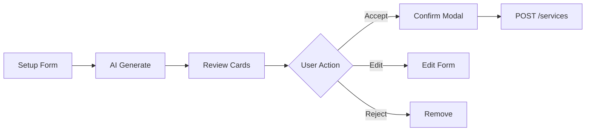

# AI Copilot cho Clinic - Implementation Plan

## IMPORTANT - Scope Separation (2026-04-03)

**Plan này bao gồm 3 scope khác nhau, cần tách rõ:**

**Platform clarification:**
- AI Copilot cho `CLINIC_OWNER` và `CLINIC_MANAGER` nằm trên Web Dashboard.
- Mobile AI chỉ dành cho `STAFF`.
- `PET_OWNER` khong nam trong scope AI Copilot va khong duoc expose route AI tren mobile.

| Package | Scope | Priority | Status |
|---------|-------|----------|--------|
| **A. Clinic Setup AI** | generate_clinic_services + review/save (SRS 3.13.1) | **HIGH** | DONE - Phase 0 |
| **B. Manager Analytics** | Read-only metrics, shifts, reviews | MEDIUM | FUTURE |
| **C. Workspace Redesign** | Notion-style full page | **FUTURE** | Not in scope |

**Xem chi tiết:** [Gap Analysis](./AI_COPILOT_CLINIC_GAP_ANALYSIS.md)

---

## 1. Overview

### 1.0 Tại Sao Cần AI Copilot Cho Clinic

#### 1.0.1 Vấn Đề Hiện Tại (Nếu Không Có AI Copilot)

| Vấn đề | Impact | Frequency |
|--------|--------|-----------|
| **Manual service entry** | Mất 2-4 giờ nhập tay từng dịch vụ khi setup clinic | Mỗi lần setup mới |
| **Không biết giá thị trường** | Owner không có baseline để pricing dịch vụ | Thường xuyên |
| **Thiếu visibility** | Manager phải vào nhiều màn hình để xem metrics | Hàng ngày |
| **Khó truy vấn nhanh** | Phải click qua nhiều menu để xem lịch trực/bookings | Hàng ngày |
| **Không có insights** | Không biết dịch vụ nào hot, dịch vụ nào ế | Hàng tuần |
| **Thao tác thủ công** | Phải vào form CRUD để đổi giá, toggle status | Thường xuyên |

#### 1.0.2 Nếu Có AI Copilot - Làm Được Gì

| Use Case | Trước (Manual) | Sau (AI Copilot) |
|----------|----------------|------------------|
| **Setup danh mục dịch vụ** | 2-4 giờ nhập tay | 5-10 phút + review |
| **Xem doanh thu** | Vào 3-4 màn hình khác nhau | 1 prompt: "Doanh thu tuần này" |
| **Kiểm tra lịch trực** | Vào calendar, filter từng ngày | 1 prompt: "Lịch trực ngày mai" |
| **Cập nhật giá dịch vụ** | Vào form edit, search, update | 1 prompt: "Đổi giá tiêm phòng thành 220k" + confirm |
| **Tìm insights** | Không có hoặc phải export Excel | 1 prompt: "Dịch vụ nào được đặt nhiều nhất?" |
| **Xem bookings pending** | Vào booking list, filter status | 1 prompt: "Bookings chờ xác nhận" |

#### 1.0.3 Cải Thiện Những Gì

| Dimension | Improvement | Measurable |
|-----------|-------------|------------|
| **Tốc độ** | Setup clinic: 4h → 10 phút | 95% reduction |
| **Tiện lợi** | Truy vấn: 5 clicks → 1 prompt | 80% fewer clicks |
| **Accessibility** | Không cần navigate nhiều menu | 1 entry point |
| **Insights** | Từ không có → có recommendations | Data-driven decisions |
| **Error reduction** | Manual entry errors → AI suggestions | Validation + review |
| **Onboarding** | Owner mới không biết bắt đầu từ đâu → AI guide | Guided setup |

#### 1.0.4 Giá Trị Cốt Lõi

- Speed: Setup trong vài phút thay vì vài giờ.
- Intelligence: Gợi ý dịch vụ va thao tac dua tren du lieu co cau truc.
- Convenience: 1 prompt de tim thong tin hoac thuc hien buoc review.
- Safety: HITL bat buoc truoc moi write action.
- Transparency: Co audit trail va feedback de theo doi.
- Collaboration: Web dashboard phu hop cho owner/manager, mobile AI tach rieng cho staff.

---

### 1.1 Mục tiêu - Phase 0 (Priority)

AI hỗ trợ CLINIC_OWNER thiết lập danh mục dịch vụ khởi tạo:
- **Generate**: Tạo danh sách dịch vụ mẫu từ master services
- **Review**: Hiển thị để user review/edit
- **Save**: Lưu vào DB sau khi user xác nhận (HITL - Human In The Loop)

**Phase 0 KHÔNG bao gồm:**
- Revenue analytics
- Staff management
- Full workspace redesign
- CRUD operations phức tạp

### 1.2 User Roles - Phase 0

| Role | Platform | Access |
|------|----------|--------|
| CLINIC_OWNER | Web | ✅ Full access (generate + review + save) |
| CLINIC_MANAGER | Web | ⚠️ View only (sau Phase 0) |
| STAFF | Mobile | Out of scope cho Clinic Setup AI; chi dung mobile AI staff workflow |
| PET_OWNER | Mobile | Khong co AI Copilot |

### 1.3 SRS References

| SRS Section | Feature | Status |
|-------------|---------|--------|
| 3.13.1 | AI Generate Clinic Services (UC-CO-14) | **✅ DONE - Phase 0** |
| 3.6.6 | Create/Update/Delete Clinic Service (UC-CO-03) | Backend done, AI tool ✅ |
| 3.6.7 | Inherit From Master Service | Backend done, AI tool ✅ |

### 1.4 Verified API Paths

| Feature | Real API Path | Method |
|---------|---------------|--------|
| List clinic services | `/api/services` | GET |
| Create service | `/api/services` | POST |
| Update service | `/api/services/{serviceId}` | PUT |
| Get master services | `/api/master-services` | GET |
| Inherit from master | `/api/services/inherit/{masterServiceId}` | POST |
| Get staff shifts | `/api/clinics/{clinicId}/shifts` | GET |
| Create shift | `/api/clinics/{clinicId}/shifts` | POST |

---

## 2. Phase 0: Clinic Setup AI (PRIORITY)

### 2.1 Tool: `generate_clinic_services` (UC-CO-14)

**Mục đích**: AI tự động tạo danh sách dịch vụ mẫu dựa trên loại hình clinic, pet types, service scope.

**User Flow (SRS 3.13.1)**:
```
1. Owner opens Clinic Setup → "AI Generate Services"
2. AI asks: "Clinic type?", "Pet types?", "Service scope?"
3. AI calls: GET /master-services → filter by criteria
4. AI returns: List of suggested services with confidence scores
5. Owner reviews: Accept/Edit/Reject từng service
6. Owner clicks: "Save All"
7. AI opens HITL confirm modal, sau đó gửi batch create intent
8. AI calls: POST /services nhiều lần theo từng service đã xác nhận
9. Success → Redirect to services list
```

**Backend Integration**:
- `GET /api/master-services` - Lấy master services để suggest
- `POST /api/services` - Tạo clinic service (batch)

**Input Parameters**:
```json
{
  "clinic_id": "uuid-123",
  "clinic_type": "general|petshop|hospital",
  "pet_types": ["dog", "cat"],
  "service_scope": ["healthcare", "vaccination", "beauty"]
}
```

**Output**:
```json
{
  "suggestions": [
    {
      "name": "Khám tổng quát",
      "service_category": "HEALTHCARE",
      "description": "Khám sức khỏe tổng quát cho thú cưng",
      "base_price": 150000,
      "duration_minutes": 30,
      "confidence": 0.95,
      "source": "master_service"
    }
  ],
  "total_suggestions": 10
}
```

**UISchema Components**:
- `service_generation_card` - Card hiển thị 1 suggestion
- `bulk_action_bar` - "Chấp nhận tất cả" / "Bỏ tất cả"
- `review_modal` - Confirm trước khi save

**HITL (Human In The Loop)**:
- ❌ AI không tự động save
- ✅ User phải review và click "Save All"
- ✅ UI phải show confirm modal

---

### 2.2 Tool: `list_clinic_services`

**Mục đích**: Liệt kê tất cả services của clinic (read-only).

**Backend Integration**:
- `GET /api/services` - Lấy danh sách services

**User Prompts**:
- "Liệt kê các dịch vụ"
- "Cho tôi xem giá tiêm phòng"

**Output**:
```json
{
  "services": [
    {
      "service_id": "uuid-1",
      "name": "Tiêm phòng 5 bệnh",
      "base_price": 200000,
      "is_active": true,
      "service_category": "VACCINATION"
    }
  ],
  "total": 15
}
```

**UISchema**: `service_list_card` (read-only, không edit trong chat)

---

### 2.3 Tool: `update_service_info` (Phase 1)

**Mục đích**: Cập nhật thông tin service (price, description, active).

**Backend Integration**:
- `PUT /api/services/{serviceId}` - Update service

**User Prompts**:
- "Đổi giá tiêm phòng thành 220k"

**HITL Required**:
- AI phải show confirm modal trước khi gọi PUT
- User phải click "Xác nhận" mới thực hiện update

**Output**:
```json
{
  "updated": true,
  "service_id": "uuid-1",
  "changes": {
    "base_price": {"old": 200000, "new": 220000}
  }
}
```

---

## 3. Future Scope (NOT in Phase 0)

### 3.1 Manager Analytics (Future Phase)

**Tools dự kiến** (chưa enable trong context policy):
- `get_clinic_overview` - Dashboard metrics
- `analyze_revenue_trends` - Revenue analytics
- `get_staff_schedule` - View shifts
- `get_appointment_insights` - Booking analytics

**Note**: Các tools này hiện đang DISABLED trong context_policy.py

### 3.2 Workspace Redesign (Future)

**Không trong scope hiện tại**:
- Notion-style workspace
- Full-page editable components
- Tab-based navigation

**Có thể revisit sau khi Phase 0 hoàn thành.**

---

## 4. Implementation Checklist

### Phase 0: Generate Services Flow

- [ ] AI Tool: `generate_clinic_services` (mcp tool)
- [ ] Backend: Map GET /master-services
- [ ] Frontend: ServiceGenerationPage hoặc reuse chat
- [ ] UI: Review cards với Accept/Edit/Reject
- [ ] UI: Confirm modal trước save
- [ ] Backend: POST /services (batch create)
- [ ] Context Policy: Enable cho CLINIC_OWNER
- [ ] Test: Integration test với real API

### Phase 0.5: List Services

- [ ] AI Tool: `list_clinic_services`
- [ ] Frontend: Service list display
- [ ] Context Policy: Enable cho CLINIC_OWNER/MANAGER

### Phase 1: Update Service (HITL)

- [ ] AI Tool: `update_service_info`
- [ ] UI: Confirm modal (bắt buộc)
- [ ] Context Policy: Enable với restrictions
- [ ] Test: Verify HITL flow

---

## 5. UI Design Notes

### 5.1 AI Copilot Composer (Required Spec)

```
┌─────────────────────────────────────────────────────────────────────────────┐
│  🤖 AI Copilot - Pet Care Quận 1                              [User: Owner]│
├─────────────────────────────────────────────────────────────────────────────┤
│  [MoonClipboardIcon Dịch vụ] [CalendarIcon Lịch trực] [ChartBarIcon Metrics]│
├─────────────────────────────────────────────────────────────────────────────┤
│                                                                             │
│  ┌─────────────────────────────────────────────────────────────────────┐   │
│  │  Workspace content (Table/Cards/Chart)                             │   │
│  │                                                                     │   │
│  └─────────────────────────────────────────────────────────────────────┘   │
│                                                                             │
├─────────────────────────────────────────────────────────────────────────────┤
│                                                                             │
│  ┌───────────────────────────────────────────────────────────────────┐    │
│  │  CurrencyDollarIcon Doanh thu tuần này  │ CalendarIcon Lịch trực ngày mai  │ │
│  │  ArrowTrendingUpIcon Bookings chờ xác nhận  │ MoonClipboardIcon Liệt kê dịch vụ │    │
│  └───────────────────────────────────────────────────────────────────┘    │
│                                                                             │
│  ┌─────────────────────────────────────────────┐ ┌────────────────────┐    │
│  │ Hỏi về lịch trực, bookings hoặc tình       │ │        GỬI        │    │
│  │ trạng vận hành...                           │ │ (amber-600 button)│    │
│  │ (2-4 lines, resizeable)                     │ └────────────────────┘    │
│  └─────────────────────────────────────────────┘                          │
│                                                                             │
│  ┌───────────────────────────────────────────────────────────────────┐    │
│  │  BuildingOfficeIcon Pet Care Q1 │ CalendarIcon Hôm nay │ BeakerIcon Tiêm phòng │ │
│  │  UserGroupIcon Bs. Minh │ AdjustmentsHorizontalIcon Bộ lọc         │    │
│  └───────────────────────────────────────────────────────────────────┘    │
│                                                                             │
└─────────────────────────────────────────────────────────────────────────────┘
```

### 5.2 Composer Layout Specification

| Row | Component | Description |
|-----|-----------|-------------|
| **1** | Prompt Suggestions | Horizontal chips: "Doanh thu tuần này", "Lịch trực ngày mai", "Bookings chờ xác nhận", "Liệt kê dịch vụ", "Đổi giá dịch vụ" |
| **2** | Textarea + Send | Textarea 2-4 lines, Soft Neobrutalism border, Send button (amber-600, right side) |
| **3** | Context Chips + Filter | Clinic name, Date, Service, Staff, Status chips + AdjustmentsHorizontalIcon |

### 5.3 Dynamic Placeholder by Role

| Role | Placeholder Text |
|------|------------------|
| **CLINIC_MANAGER** | "Hỏi về lịch trực, bookings hoặc tình trạng vận hành..." |
| **CLINIC_OWNER (Setup)** | "Mô tả loại hình clinic để AI gợi ý danh mục dịch vụ..." |
| **CLINIC_OWNER (运营)** | "Hỏi về doanh thu, hiệu suất hoặc insights kinh doanh..." |

### 5.4 Context Chips (Auto-populated)

- **Phòng khám**: Pet Care Q1 (auto from session)
- **Thời gian**: Hôm nay / Tuần này (auto, có thể change)
- **Dịch vụ**: Tiêm phòng, Khám tổng quát... (optional filter)
- **Nhân viên**: Bs. Minh, NV. Lan... (optional filter)
- **Trạng thái**: PENDING, CONFIRMED... (optional filter)

**Design**: Chips như data phụ, KHÔNG bắt user nhét vào prompt

### 5.5 Write Action Guard (Required)

```
User: "Đổi giá tiêm phòng thành 220k"
       ↓
AI detects: WRITE action (update data)
       ↓
┌─────────────────────────────────────────────────────────────────────────────┐
│  ⚠️ XÁC NHẬN THAY ĐỔI                                                       │
│  ┌─────────────────────────────────────────────────────────────────────┐   │
│  │ Dịch vụ: Tiêm phòng 5 bệnh                                          │   │
│  │ Giá cũ: 200.000 đ                                                   │   │
│  │ Giá mới: 220.000 đ                                                   │   │
│  └─────────────────────────────────────────────────────────────────────┘   │
│                         [HỦY]                [XÁC NHẬN]                    │
└─────────────────────────────────────────────────────────────────────────────┘
       ↓
User clicks "Xác nhận"
       ↓
AI calls: PUT /api/services/{id}
       ↓
Success → Update UI + Toast
```

**Rule**: AI phải trả về preview + confirm trước khi gọi API ghi dữ liệu

### 5.6 Ambiguous Prompt Handling

```
User: "Cho xem lịch" (vague)
       ↓
AI asks with chips:
┌─────────────────────────────────────────────────────────────────────────────┐
│  Bạn muốn xem lịch của ngày nào?                                          │
│  [Hôm nay] [Ngày mai] [Tuần này] [Chọn ngày khác]                         │
└─────────────────────────────────────────────────────────────────────────────┘
```

**Rule**: Khi prompt mơ hồ → AI hỏi bằng chip chọn nhanh, KHÔNG bắt user gõ lại

### 5.7 Advanced Filters

- Opens with AdjustmentsHorizontalIcon (Heroicon)
- Shows: Date range, Service category, Staff, Status filters
- NOT: mechanical typing like "period=MONTH"

### 5.8 What NOT to Do (Anti-patterns)

| Anti-pattern | Correct Approach |
|--------------|------------------|
| ❌ Empty plain "Hỏi gì cũng được" | ✅ Role-based dynamic placeholder |
| ❌ Force slash commands as main flow | ✅ Natural language + suggestions |
| ❌ Send write action directly without confirm | ✅ Preview + Confirm modal |
| ❌ Emoji in quick actions/placeholder | ✅ Heroicons only |
| ❌ Bắt user nhập period=MONTH | ✅ Filter UI với icon |

### Use Heroicons (NO EMOJI)

| Instead of | Use |
|------------|-----|
| 📋 | MoonClipboardIcon |
| 📅 | CalendarIcon |
| 📊 | ChartBarIcon |
| 💰 | CurrencyDollarIcon |
| 📈 | ArrowTrendingUpIcon |
| ✅ | CheckCircleIcon |
| ⚙️ | AdjustmentsHorizontalIcon |

### Use Mermaid for Diagrams



---

## 6. AI Copilot Business Logic (Standard Flows)

### 6.1 Prompt Classification Flow

```
User Prompt
     ↓
┌─────────────────────────────┐
│  Intent Classifier         │
│  - READ (query data)       │
│  - WRITE (update data)     │
│  - GENERATE (create new)   │
│  - CLARIFY (need info)     │
└─────────────────────────────┘
     ↓
┌─────────────────────────────┐
│  Entity Extractor          │
│  - Clinic (from session)   │
│  - Service (from name/ID)  │
│  - Date/Time               │
│  - Staff                   │
└─────────────────────────────┘
     ↓
┌─────────────────────────────┐
│  Tool Selector             │
│  - Match intent to tool    │
│  - Validate required params│
│  - Check permissions       │
└─────────────────────────────┘
```

### 6.2 Read vs Write Handling

| Intent | Behavior |
|--------|----------|
| **READ** | Execute tool → Return data → Render UI |
| **WRITE** | Return preview → Show confirm modal → Execute on confirm → Update UI |
| **GENERATE** | Show generation UI → Process → Return suggestions → Save on confirm |
| **CLARIFY** | Return clarification chips → Wait user selection → Continue |

### 6.3 Tool Selection Logic

```python
def select_tool(prompt: str, intent: str, entities: dict) -> Optional[Tool]:
    """Select appropriate tool based on intent and entities"""
    
    # READ intents
    if intent == "list_services":
        return Tool.LIST_CLINIC_SERVICES
    
    if intent == "get_metrics" and entities.get("type") == "revenue":
        return Tool.ANALYZE_REVENUE_TRENDS
    
    if intent == "get_schedule":
        return Tool.GET_STAFF_SCHEDULE
    
    # WRITE intents - require confirmation
    if intent == "update_service":
        return Tool.UPDATE_SERVICE_INFO  # Will trigger confirm flow
    
    if intent == "create_shifts":
        return Tool.CREATE_STAFF_SHIFTS  # Will trigger confirm flow
    
    # GENERATE intents
    if intent == "generate_services":
        return Tool.GENERATE_CLINIC_SERVICES  # Show suggestions
    
    return None
```

### 6.4 Response Generation Patterns

```python
def generate_response(tool_result: dict, intent: str) -> Response:
    """Generate appropriate response based on tool result and intent"""
    
    if intent == "READ":
        if has_data(tool_result):
            return Response(
                type="data_display",
                components=map_to_uicomponents(tool_result)
            )
        else:
            return Response(
                type="empty",
                message="Không tìm thấy dữ liệu"
            )
    
    if intent == "WRITE":
        if success(tool_result):
            return Response(
                type="success",
                message="Đã cập nhật thành công",
                toast=True
            )
        else:
            return Response(
                type="error",
                message=tool_result.get("error", "Lỗi khi cập nhật")
            )
    
    if intent == "GENERATE":
        return Response(
            type="suggestions",
            components=map_suggestions(tool_result),
            actions=["accept_all", "edit", "reject"]
        )
    
    if intent == "CLARIFY":
        return Response(
            type="clarification",
            chips=generate_clarification_chips(entities)
        )
```

### 6.5 Error Handling Patterns

```python
def handle_tool_error(error: ToolError, tool: Tool) -> Response:
    """Handle tool execution errors"""
    
    error_mappings = {
        ErrorCode.UNAUTHORIZED: (
            "Bạn không có quyền thực hiện thao tác này",
            "Vui liên hệ quản lý để được cấp quyền"
        ),
        ErrorCode.NOT_FOUND: (
            f"Không tìm thấy {tool.resource_name}",
            "Kiểm tra lại tên hoặc ID"
        ),
        ErrorCode.VALIDATION_ERROR: (
            "Dữ liệu không hợp lệ",
            error.details  # Show what's wrong
        ),
        ErrorCode.API_ERROR: (
            "Lỗi hệ thống",
            "Vui lòng thử lại sau ít phút"
        )
    }
    
    title, suggestion = error_mappings.get(error.code, ("Lỗi không xác định", "Thử lại"))
    
    return Response(
        type="error",
        title=title,
        suggestion=suggestion,
        recoverable=error.recoverable
    )
```

### 6.6 Session Management

```python
class CopilotSession:
    """Manage AI Copilot conversation state"""
    
    def __init__(self, user_id: str, clinic_id: str, role: str):
        self.user_id = user_id
        self.clinic_id = clinic_id
        self.role = role
        self.context = {
            "current_tab": "services",  # Default tab
            "last_query": None,
            "pending_confirmation": None,  # For write actions
            "selected_services": [],  # For bulk operations
        }
    
    def update_context(self, key: str, value: Any):
        """Update session context"""
        self.context[key] = value
    
    def set_pending_confirmation(self, action: dict):
        """Store pending write action for confirmation"""
        self.context["pending_confirmation"] = action
    
    def clear_pending_confirmation(self):
        """Clear after confirmation or cancel"""
        self.context["pending_confirmation"] = None
```

### 6.7 Context Chips Generation

```python
def generate_context_chips(session: CopilotSession, entities: dict) -> list[ContextChip]:
    """Generate context chips based on session and extracted entities"""
    
    chips = [
        ContextChip(
            icon="BuildingOfficeIcon",
            label=session.clinic_name,
            value=session.clinic_id,
            type="clinic"
        )
    ]
    
    # Date filter
    if entities.get("date"):
        chips.append(ContextChip(
            icon="CalendarIcon",
            label=format_date(entities["date"]),
            value=entities["date"],
            type="date"
        ))
    
    # Service filter
    if entities.get("service"):
        chips.append(ContextChip(
            icon="BeakerIcon",
            label=entities["service"]["name"],
            value=entities["service"]["id"],
            type="service"
        ))
    
    # Staff filter
    if entities.get("staff"):
        chips.append(ContextChip(
            icon="UserGroupIcon",
            label=entities["staff"]["name"],
            value=entities["staff"]["id"],
            type="staff"
        ))
    
    return chips
```

### 6.8 Write Action Guard Implementation

```python
async def handle_write_action(prompt: str, tool: Tool, params: dict) -> Response:
    """
    Handle write actions with human-in-the-loop confirmation
    """
    
    # 1. Parse what will change
    changes = await preview_changes(tool, params)
    
    # 2. Return preview + confirmation request
    return Response(
        type="write_preview",
        title="Xác nhận thay đổi",
        changes=changes,
        confirm_action={
            "type": "execute_write",
            "tool": tool,
            "params": params
        },
        cancel_action={
            "type": "cancel_write"
        }
    )


async def execute_write_on_confirm(tool: Tool, params: dict, user_id: str) -> Response:
    """
    Execute write action after user confirmation
    """
    
    # 1. Log user action for audit
    await audit_log.log(
        user_id=user_id,
        action="confirm_write",
        tool=tool.name,
        params=params
    )
    
    # 2. Execute tool
    result = await tool.execute(params)
    
    # 3. Return success/error
    if result.success:
        return Response(
            type="success",
            message=f"Đã cập nhật {tool.resource_name}",
            toast=True,
            refresh_needed=True
        )
    else:
        return Response(
            type="error",
            message="Lỗi khi cập nhật",
            details=result.error
        )
```

---

## 7. Open Questions

1. **Analytics**: CLINIC_OWNER có cần analytics không hay chỉ setup?
2. **Workspace**: Có nên làm Notion-style không hay giữ chat?
3. **Timeline**: Khi nào bắt đầu Phase 0 implementation?

---

## 7. References

- [Gap Analysis](./AI_COPILOT_CLINIC_GAP_ANALYSIS.md)
- [SRS 3.13.1](../documentation/SRS/PETTIES_SRS.md#313-ai-generate-clinic-services)
- [Role Requirements](./AI_ASSISTANT_ROLE_REQUIREMENTS.md)

---

**Document Status**: UPDATED - 2026-04-03  
**Scope**: Phase 0 - Clinic Setup AI (Generate Services)  
**Total Sections**: 7 (Overview, Phase 0, Future Scope, Checklist, UI Design, Questions, References)

<!-- END OF PHASE 0 PLAN - OLD CONTENT BELOW IS OBSOLETE -->

<!-- [OBSOLETE - START] Legacy content below should be removed in next cleanup

**Input Parameters**:
```python
{
    "clinic_id": UUID,
    "period": "MONTH" | "WEEK" | "DAY",  # default: MONTH
    "start_date": "2026-01-01",  # optional
    "end_date": "2026-03-31",    # optional
    "compare_with_previous": bool  # default: true
}
```

**Output**:
```python
{
    "current_period": {
        "total_revenue": 50000000,
        "qr_revenue": 30000000,
        "cash_revenue": 20000000,
        "transaction_count": 150,
        "average_transaction": 333333
    },
    "previous_period": { ... },
    "growth_percentage": 15.5,
    "trend": "increasing" | "decreasing" | "stable",
    "daily_breakdown": [
        {"date": "2026-01-01", "revenue": 1500000},
        {"date": "2026-01-02", "revenue": 1800000}
    ]
}
```

**UISchema Components**:
- `metric_card` - Hiển thị key metrics với trend indicator
- `line_chart` - Biểu đồ xu hướng
- `comparison_table` - So sánh các kỳ

---

#### 2.1.2 Tool: `get_clinic_metrics`

**Mục đích**: Lấy tổng quan metrics của clinic

**Backend Integration**:
- `GET /reports/clinic/{clinicId}/overview`
- `GET /bookings/clinic/{clinicId}/stats`
- `GET /clinics/{clinicId}`

**Input Parameters**:
```python
{
    "clinic_id": UUID,
    "period": "MONTH"  # default
}
```

**Output**:
```python
{
    "overview": {
        "total_bookings": 450,
        "completed_bookings": 380,
        "cancelled_bookings": 45,
        "no_show": 25,
        "completion_rate": 84.4,
        "no_show_rate": 5.5,
        "average_rating": 4.7,
        "total_reviews": 120,
        "active_pets": 280,
        "new_pets_this_month": 35
    },
    "services": [
        {"service_name": "Tiêm phòng", "bookings": 150, "revenue": 15000000},
        {"service_name": "Khám tổng quát", "bookings": 120, "revenue": 18000000}
    ],
    "top_clients": [
        {"client_name": "Nguyễn Văn A", "bookings": 12, "total_spent": 2400000}
    ]
}
```

**UISchema Components**:
- `dashboard_card` - Overview metrics
- `service_ranking` - Top services
- `client_leaderboard` - Top clients

---

#### 2.1.3 Tool: `compare_performance`

**Mục đích**: So sánh hiệu suất với các kỳ trước

**Input Parameters**:
```python
{
    "clinic_id": UUID,
    "current_period": "2026-03",
    "compare_periods": ["2026-02", "2025-03"]  # optional, max 3
}
```

**Output**:
```python
{
    "current": {"revenue": 50000000, "bookings": 150},
    "vs_last_month": {"revenue_change": 15.5, "bookings_change": 10.2},
    "vs_same_period_last_year": {"revenue_change": 25.0, "bookings_change": 18.5},
    "insights": [
        "Doanh thu tăng 15.5% so với tháng trước",
        "Số lượng booking tăng nhờ dịch vụ tiêm phòng mùa xuân",
        "Tỷ lệ hoàn thành cải thiện 3%"
    ]
}
```

---

### Module 2: Staff Management

#### 2.2.1 Tool: `get_staff_schedule`

**Mục đích**: Lấy lịch làm việc của nhân viên

**Backend Integration**:
- `GET /staff-shifts/clinic/{clinicId}?date={date}`
- `GET /staff-shifts/staff/{staffId}?month={month}`

**Input Parameters**:
```python
{
    "clinic_id": UUID,
    "start_date": "2026-04-01",
    "end_date": "2026-04-07",
    "staff_id": UUID  # optional, all staff if not provided
}
```

**Output**:
```python
{
    "schedule": [
        {
            "staff_id": "uuid-1",
            "staff_name": "Bs. Minh",
            "shifts": [
                {"date": "2026-04-01", "start_time": "08:00", "end_time": "14:00", "type": "morning"},
                {"date": "2026-04-01", "start_time": "14:00", "end_time": "20:00", "type": "afternoon"}
            ],
            "total_hours": 12
        }
    ],
    "unassigned_slots": [
        {"date": "2026-04-03", "time": "08:00-14:00", "role": "Veterinarian"}
    ]
}
```

---

#### 2.2.2 Tool: `suggest_staff_assignments`

**Mục đích**: Đề xuất phân công nhân viên dựa trên lịch hẹn

**Backend Integration**:
- `GET /bookings/clinic/{clinicId}?date={date}&status=CONFIRMED`
- `GET /staff-shifts/clinic/{clinicId}`

**Input Parameters**:
```python
{
    "clinic_id": UUID,
    "date": "2026-04-05",
    "consider_unconfirmed": bool  # default: false
}
```

**Output**:
```python
{
    "suggestions": [
        {
            "booking_id": "uuid-booking",
            "pet_name": "Mèo",
            "service": "Khám tổng quát",
            "suggested_staff": "Bs. Minh",
            "reason": "Bs. Minh có kinh nghiệm cao với cases mèo, lịch trống lúc 9:00"
        },
        {
            "booking_id": "uuid-booking-2",
            "pet_name": "Chó",
            "service": "Tiêm phòng",
            "suggested_staff": "NV. Lan",
            "reason": "NV. Lan làm việc ca chiều, có thể handle thêm"
        }
    ],
    "warnings": [
        "Ca sáng ngày mai thiếu 1 nhân viên phụ trách"
    ]
}
```

---

#### 2.2.3 Tool: `create_staff_shifts`

**Mục đích**: Tạo ca làm việc tự động cho nhân viên

**Backend Integration**:
- `POST /staff-shifts` - Create shift
- `GET /staffs/clinic/{clinicId}` - Get staff list

**Input Parameters**:
```python
{
    "clinic_id": UUID,
    "start_date": "2026-04-01",
    "end_date": "2026-04-07",
    "shift_config": {
        "morning": {"start": "08:00", "end": "14:00", "min_staff": 2},
        "afternoon": {"start": "14:00", "end": "20:00", "min_staff": 2},
        "full_day": {"start": "08:00", "end": "20:00", "min_staff": 1}
    },
    "exclude_dates": ["2026-04-02"]  # holidays
}
```

**Output**:
```python
{
    "proposed_shifts": [
        {
            "staff_id": "uuid-1",
            "date": "2026-04-01",
            "start_time": "08:00",
            "end_time": "14:00",
            "shift_type": "morning"
        },
        {
            "staff_id": "uuid-1",
            "date": "2026-04-01",
            "start_time": "14:00",
            "end_time": "20:00",
            "shift_type": "afternoon"
        }
    ],
    "conflicts": [],
    "can_apply": true
}
```

**UISchema Components**:
- `shift_calendar` - Calendar view của shifts
- `shift_confirmation` - Confirm button để apply

---

### Module 3: Appointment & Operations

#### 2.3.1 Tool: `get_appointment_insights`

**Mục đích**: Insights về appointments và operations

**Backend Integration**:
- `GET /bookings/clinic/{clinicId}/analytics`
- `GET /bookings/clinic/{clinicId}?status={status}`

**Input Parameters**:
```python
{
    "clinic_id": UUID,
    "period": "MONTH",
    "start_date": "2026-03-01",
    "end_date": "2026-03-31"
}
```

**Output**:
```python
{
    "busiest_times": [
        {"day_of_week": "Thứ 2", "avg_bookings": 25, "peak_hours": "9:00-11:00"},
        {"day_of_week": "Thứ 7", "avg_bookings": 30, "peak_hours": "14:00-16:00"}
    ],
    "service_demand": [
        {"service": "Tiêm phòng", "demand_score": 95, "trend": "up"},
        {"service": "Khám tổng quát", "demand_score": 80, "trend": "stable"}
    ],
    "no_show_analysis": {
        "total_no_shows": 25,
        "rate": 5.5,
        "top_reasons": [
            "Quên lịch hẹn (40%)",
            "Không tiện ghé (30%)",
            "Pet khỏe rồi (20%)"
        ]
    },
    "recommendations": [
        "Nên thêm reminder 1 ngày trước để giảm no-show",
        "Thứ 7 ca chiều có thể tăng ca để đáp ứng nhu cầu"
    ]
}
```

---

#### 2.3.2 Tool: `optimize_appointment_schedule`

**Mục đích**: Tối ưu lịch hẹn tránh conflicts

**Input Parameters**:
```python
{
    "clinic_id": UUID,
    "date": "2026-04-05",
    "constraints": {
        "max_overlap": 2,
        "prefer_same_vet_for_pet": true,
        "buffer_minutes": 15
    }
}
```

**Output**:
```python
{
    "current_schedule": [
        {"time": "09:00", "pet": "Mèo A", "service": "Khám", "vet": "Bs. Minh"},
        {"time": "09:30", "pet": "Chó B", "service": "Tiêm", "vet": "Bs. Minh"}
    ],
    "optimizations": [
        {
            "type": "reorder",
            "from": "09:30",
            "to": "10:00",
            "reason": "Giữ khoảng cách 30p giữa 2 cases khác loại pet"
        },
        {
            "type": "buffer",
            "added_after": "10:30",
            "minutes": 15,
            "reason": "Thêm buffer vì case trước có thể kéo dài"
        }
    ],
    "optimized_schedule": [...]
}
```

---

### Module 4: Customer & Growth

#### 2.4.1 Tool: `get_customer_insights`

**Mục đích**: Phân tích khách hàng

**Backend Integration**:
- `GET /pets/clinic/{clinicId}/stats`
- `GET /bookings/clinic/{clinicId}/customer-analytics`

**Input Parameters**:
```python
{
    "clinic_id": UUID,
    "period": "MONTH",
    "limit": 20  # top N customers
}
```

**Output**:
```python
{
    "customer_stats": {
        "total_customers": 450,
        "new_customers": 35,
        "returning_customers": 180,
        "repeat_rate": 40.0,
        "average_visits_per_customer": 3.2
    },
    "top_customers": [
        {
            "customer_name": "Nguyễn Văn A",
            "pet_count": 2,
            "total_bookings": 12,
            "total_spent": 2400000,
            "last_visit": "2026-03-28",
            "favorite_services": ["Tiêm phòng", "Tắm"]
        }
    ],
    "customer_segments": [
        {"segment": "VIP", "count": 45, "revenue_share": 35},
        {"segment": "Regular", "count": 120, "revenue_share": 45},
        {"segment": "New", "count": 35, "revenue_share": 10},
        {"segment": "At Risk", "count": 25, "revenue_share": 10}
    ],
    "insights": [
        "45 khách hàng VIP chiếm 35% doanh thu",
        "Có 25 khách chưa quay lại trong 60 ngày - cần re-engage"
    ]
}
```

---

#### 2.4.2 Tool: `analyze_review_sentiment`

**Mục đích**: Phân tích cảm xúc từ reviews

**Backend Integration**:
- `GET /reviews/clinic/{clinicId}?limit={limit}`
- `GET /reviews/clinic/{clinicId}/analytics`

**Input Parameters**:
```python
{
    "clinic_id": UUID,
    "period": "MONTH",
    "include_categories": true
}
```

**Output**:
```python
{
    "overall_sentiment": {
        "positive": 75,
        "neutral": 18,
        "negative": 7,
        "average_rating": 4.7
    },
    "sentiment_by_category": {
        "service_quality": {"positive": 80, "neutral": 15, "negative": 5},
        "staff": {"positive": 85, "neutral": 12, "negative": 3},
        "facility": {"positive": 70, "neutral": 20, "negative": 10},
        "pricing": {"positive": 65, "neutral": 25, "negative": 10}
    },
    "recent_negative_reviews": [
        {
            "review": "Chờ lâu quá, hơn 1 tiếng",
            "sentiment": "negative",
            "topics": ["wait_time"],
            "date": "2026-03-25"
        }
    ],
    "improvement_suggestions": [
        "Giảm thời gian chờ bằng cách tối ưu lịch hẹn",
        "Cải thiện cơ sở vật chất khu vực chờ"
    ]
}
```

---

#### 2.4.3 Tool: `suggest_marketing_campaign`

**Mục đích**: Đề xuất chiến dịch marketing

**Input Parameters**:
```python
{
    "clinic_id": UUID,
    "budget_range": "medium",  # low | medium | high
    "target_goals": ["increase_bookings", "new_customers"]
}
```

**Output**:
```python
{
    "campaigns": [
        {
            "name": "Mùa tiêm phòng xuân",
            "type": "service_promotion",
            "target": "Existing customers với pets chưa tiêm đầy đủ",
            "discount": "10% dịch vụ tiêm phòng",
            "estimated_cost": 5000000,
            "estimated_roi": 2.5,
            "duration": "1 tháng",
            "channels": ["push_notification", "email"]
        },
        {
            "name": "Giới thiệu bạn bè",
            "type": "referral",
            "target": "VIP customers",
            "incentive": "Giảm 20% cho cả người giới thiệu và được giới thiệu",
            "estimated_cost": 3000000,
            "estimated_roi": 3.0
        }
    ],
    "priority_recommendations": [
        "Ưu tiên campaign 1: ROI cao, target rõ ràng",
        "Nên chạy campaign 2 song song để tăng acquisition"
    ]
}
```

---

### Module 5: Clinic Management

#### 2.5.1 Tool: `get_clinic_overview`

**Mục đích**: Tổng quan clinic một cách tổng hợp

**Input Parameters**:
```python
{
    "clinic_id": UUID,
    "period": "MONTH"
}
```

**Output**:
```python
{
    "executive_summary": {
        "revenue": 50000000,
        "revenue_growth": 15.5,
        "total_bookings": 450,
        "booking_growth": 10.2,
        "avg_rating": 4.7,
        "rating_change": 0.2,
        "active_customers": 280
    },
    "health_indicators": {
        "completion_rate": 84.4,  # green
        "no_show_rate": 5.5,       # yellow
        "customer_satisfaction": 4.7  # green
    },
    "alerts": [
        {"type": "warning", "message": "No-show rate tăng 2% so với tháng trước"},
        {"type": "info", "message": "Dịch vụ tiêm phòng đang có nhu cầu cao"}
    ],
    "quick_actions": [
        {"action": "review_schedule", "label": "Xem lịch hẹn hôm nay"},
        {"action": "view_staff", "label": "Quản lý nhân viên"},
        {"action": "run_report", "label": "Tạo báo cáo"}
    ]
}
```

**UISchema Components**:
- `executive_dashboard` - Tổng quan với charts
- `alert_list` - Các alerts
- `quick_actions` - Action buttons

---

## 3. Technical Implementation

### 3.1 Tools Registration

```python
# scanner.py - Add new tools
SYSTEM_MANAGED_TOOLS.update({
    "analyze_revenue_trends",
    "get_clinic_metrics",
    "compare_performance",
    "get_staff_schedule",
    "suggest_staff_assignments",
    "create_staff_shifts",
    "get_appointment_insights",
    "optimize_appointment_schedule",
    "get_customer_insights",
    "analyze_review_sentiment",
    "suggest_marketing_campaign",
    "get_clinic_overview",
})
```

### 3.2 Context Policy Updates

```python
# context_policy.py - Update ROLE_BUSINESS_TOOLS
ROLE_BUSINESS_TOOLS = {
    "CLINIC_MANAGER": {
        # Existing
        "get_clinic_services",
        "search_clinics_nearby",
        # New
        "analyze_revenue_trends",
        "get_clinic_metrics",
        "compare_performance",
        "get_staff_schedule",
        "suggest_staff_assignments",
        "create_staff_shifts",
        "get_appointment_insights",
        "get_customer_insights",
        "analyze_review_sentiment",
        "get_clinic_overview",
    },
    "CLINIC_OWNER": {
        # All CLINIC_MANAGER tools +
        "optimize_appointment_schedule",
        "suggest_marketing_campaign",
    }
}
```

### 3.3 Tool Policies

```python
# tool_policy.py
"analyze_revenue_trends": ToolPolicy(
    allow_empty_params=False,
    requires_context=True,
    requires_auth=True,
    allowed_roles=["CLINIC_MANAGER", "CLINIC_OWNER"],
    description="Phân tích xu hướng doanh thu theo thời gian",
),
"get_clinic_metrics": ToolPolicy(
    allow_empty_params=False,
    requires_context=True,
    requires_auth=True,
    allowed_roles=["CLINIC_MANAGER", "CLINIC_OWNER"],
    description="Lấy tổng quan metrics của clinic",
),
# ... similar for others
```

---

## 4. Acceptance Criteria

### 4.1 Revenue & Business Intelligence

| Tool | Acceptance Criteria |
|------|---------------------|
| `analyze_revenue_trends` | - Trả về data cho ít nhất 3 period types (DAY/WEEK/MONTH)<br>- Tính đúng growth %<br>- Hiển thị breakdown theo ngày |
| `get_clinic_metrics` | - Trả về tất cả metrics: bookings, revenue, rating<br>- Tính đúng completion rate và no-show rate<br>- Top services và top clients chính xác |
| `compare_performance` | - So sánh được với ít nhất 2 kỳ trước<br>- Insights tự động generate |

### 4.2 Staff Management

| Tool | Acceptance Criteria |
|------|---------------------|
| `get_staff_schedule` | - Hiển thị đúng lịch theo ngày/tuần<br>- Phân biệt được ca sáng/chiều/toàn ngày |
| `suggest_staff_assignments` | - Đề xuất phù hợp với skill của staff<br>- Cân bằng workload giữa các staff |
| `create_staff_shifts` | - Tạo đủ shift theo config<br>- Không conflict với existing shifts |

### 4.3 Appointment & Operations

| Tool | Acceptance Criteria |
|------|---------------------|
| `get_appointment_insights` | - Thống kê đúng busiest times<br>- Phân tích đúng no-show reasons<br>- Recommendations hữu ích |
| `optimize_appointment_schedule` | - Giảm overlaps<br>- Respect buffer time<br>- Duy trì same vet preference |

### 4.4 Customer & Growth

| Tool | Acceptance Criteria |
|------|---------------------|
| `get_customer_insights` | - Tính đúng repeat rate<br>- Segment đúng customer types<br>- Top customers chính xác |
| `analyze_review_sentiment` | - Sentiment analysis chính xác ≥80%<br>- Phân loại theo categories<br>- Extract key topics |
| `suggest_marketing_campaign` | - Campaigns phù hợp với budget<br>- ROI estimates hợp lý<br>- Target audiences rõ ràng |

### 4.5 Clinic Management

| Tool | Acceptance Criteria |
|------|---------------------|
| `get_clinic_overview` | - Tổng hợp tất cả metrics chính<br>- Health indicators đúng thresholds<br>- Alerts có ý nghĩa |

---

## 5. Normal Flows

### 5.1 Revenue Analysis Flow

```
User: "Cho tôi xem doanh thu tháng này"
    ↓
AI: analyze_revenue_trends(clinic_id, period="MONTH")
    ↓
Backend API: GET /payments/history/clinic/{id}/revenue?period=MONTH
    ↓
Parse response → Build UISchema
    ↓
UI: Dashboard card với:
    - Total revenue: 50,000,000 VND
    - Growth: +15.5% vs last month
    - Line chart biểu diễn daily breakdown
    - Comparison table với tháng trước
```

### 5.2 Staff Assignment Flow

```
User: "Ai nên phụ trách các ca khám ngày mai?"
    ↓
AI: suggest_staff_assignments(clinic_id, date="2026-04-05")
    ↓
Backend APIs:
    - GET /bookings/clinic/{id}?date=2026-04-05&status=CONFIRMED
    - GET /staff-shifts/clinic/{id}?date=2026-04-05
    ↓
Analyze:
    - Map bookings với staff skills
    - Check availability
    - Consider workload balance
    ↓
UI: Suggestion cards với:
    - Booking details
    - Suggested staff
    - Reasoning (reason field)
```

### 5.3 Customer Insights Flow

```
User: "Khách hàng nào là VIP của clinic?"
    ↓
AI: get_customer_insights(clinic_id, limit=20)
    ↓
Backend APIs:
    - GET /pets/clinic/{id}/stats
    - GET /bookings/clinic/{id}/customer-analytics
    ↓
Parse → Segment customers
    ↓
UI: Customer leaderboard với:
    - Customer name, pet count
    - Total bookings, total spent
    - Favorite services
    - Segment badge (VIP/Regular/New/At Risk)
```

### 5.4 Marketing Campaign Flow

```
User: "Nên làm marketing gì để tăng booking?"
    ↓
AI: suggest_marketing_campaign(clinic_id, budget_range="medium")
    ↓
Analyze:
    - Review current metrics
    - Identify opportunities
    - Generate campaign ideas
    - Calculate ROI estimates
    ↓
UI: Campaign cards với:
    - Campaign name và type
    - Target audience
    - Discount/incentive
    - Estimated cost và ROI
    - Duration
    - Quick apply button
```

---

## 6. Error Handling

### 6.1 Error Types

| Error | Handling |
|-------|----------|
| `CLINIC_NOT_FOUND` | "Không tìm thấy thông tin phòng khám" |
| `NO_PERMISSION` | "Bạn không có quyền xem thông tin này" |
| `NO_DATA` | "Không có dữ liệu cho thời gian yêu cầu" |
| `API_TIMEOUT` | "Không thể lấy dữ liệu, vui lòng thử lại" |
| `INVALID_DATE_RANGE` | "Khoảng thời gian không hợp lệ" |

### 6.2 Fallback Responses

```
Khi không lấy được revenue data:
→ "Hiện tại không thể lấy dữ liệu doanh thu. Bạn thử lại sau nhé."

Khi không có đủ data cho insights:
→ "Cần ít nhất 7 ngày dữ liệu để phân tích. Hiện tại chưa đủ."
```

---

## 7. Priority Implementation

### Phase 0: Clinic Setup & Operations (Từ SRS 3.6, 3.13.1)
1. `generate_clinic_services` - AI generate danh mục dịch vụ (UC-CO-14, SRS 3.13.1)
2. `list_clinic_services` - Liệt kê và xem chi tiết services (NEW - SRS 3.6.6)
3. `update_service_info` - Cập nhật thông tin service (NEW - SRS 3.6.6)
4. `get_operating_hours_config` - Lấy/thiết lập giờ hoạt động (Operating Hours)
5. `get_slot_availability` - Xem trạng thái slots (block/available/booked)
6. `get_shift_summary` - Tổng quan lịch trực (Staff Shift)

### Phase 1: Core (Must Have)
6. `get_clinic_overview` - Dashboard tổng quan
7. `analyze_revenue_trends` - Revenue analytics
8. `get_staff_schedule` - Xem lịch staff

### Phase 2: Insights (Should Have)
4. `get_clinic_metrics` - Metrics chi tiết
5. `get_appointment_insights` - Appointment analytics
6. `get_customer_insights` - Customer analytics

### Phase 3: Advanced (Nice to Have)
7. `suggest_staff_assignments` - AI assignment suggestions
8. `analyze_review_sentiment` - Review sentiment
9. `compare_performance` - Performance comparison

### Phase 4: Automation (Future)
10. `create_staff_shifts` - Auto-generate shifts
11. `suggest_marketing_campaign` - Marketing suggestions

---

## 8. Use Cases Chi Tiết

### Phase 0: Clinic Setup

#### UC-01: AI Generate Clinic Services (UC-CO-14)

| Field | Description |
|-------|-------------|
| **Use Case ID** | UC-01 |
| **Tool Name** | `generate_clinic_services` |
| **SRS Reference** | SRS 3.13.1, UC-CO-14 |
| **Actor** | CLINIC_OWNER |
| **Trigger** | Click "AI Generate Services" trong Clinic Setup Wizard |
| **Postconditions** | Tạo danh mục dịch vụ cho clinic |

**Mục đích**: AI tự động tạo danh sách dịch vụ mẫu dựa trên loại hình clinic, pet types, service scope.

**Flow:**
```
1. Owner clicks "AI Generate Services" button
2. Form hiển thị: clinic_type, pet_types, service_scope, location
3. Owner điền thông tin và submit
4. AI gọi generate_clinic_services với params
5. AI parse knowledge base + master services
6. Trả về danh sách service suggestions với confidence score
7. UI render service_generation_cards
8. Owner accept/edit/reject từng service
9. Owner click "Save All" để lưu vào DB
```

**Input:**
```json
{
  "clinic_id": "uuid-123",
  "clinic_type": "general",
  "pet_types": ["dog", "cat"],
  "service_scope": ["healthcare", "beauty"],
  "location": "urban"
}
```

**Output:**
```json
{
  "services": [
    {
      "name": "Khám tổng quát",
      "category": "healthcare",
      "description": "Khám sức khỏe tổng quát...",
      "duration_minutes": 30,
      "estimated_price": 150000,
      "ai_confidence": 0.95
    }
  ]
}
```

**UISchema:** `service_generation_card`, `bulk_actions`
**Acceptance Criteria:** Tạo ≥10 services, confidence ≥0.7

---

#### UC-02: List Clinic Services (NEW - SRS 3.6.6)

| Field | Description |
|-------|-------------|
| **Use Case ID** | UC-02 |
| **Tool Name** | `list_clinic_services` |
| **SRS Reference** | SRS 3.6.6, UC-CO-03 |
| **Actor** | CLINIC_MANAGER, CLINIC_OWNER |
| **Trigger** | "Liệt kê dịch vụ" hoặc "Xem danh sách dịch vụ" |
| **Postconditions** | Hiển thị danh sách services của clinic |

**Mục đích**: Xem tất cả dịch vụ hiện có của clinic, bao gồm giá, mô tả, số lượng đặt.

**User Prompts:**
- "Liệt kê các dịch vụ của clinic"
- "Cho tôi xem giá dịch vụ tiêm phòng"
- "Service nào được đặt nhiều nhất?"
- "Service nào ít người đặt nhất?"

**Flow:**
```
1. User hỏi về services
2. AI gọi list_clinic_services với clinic_id từ context
3. Backend trả về danh sách services + stats
4. UI render service_list cards với actions
5. User có thể: xem chi tiết, lọc theo category, sort theo price/bookings
```

**Input:**
```json
{
  "clinic_id": "uuid-123",
  "category": "all",  // optional: healthcare, vaccination, beauty
  "status": "all",    // optional: active, inactive
  "sort_by": "bookings",  // optional: name, price, bookings
  "order": "desc"     // optional: asc, desc
}
```

**Output:**
```json
{
  "clinic_services": [
    {
      "service_id": "svc-001",
      "clinic_id": "clinic-123",
      "clinic_name": "Pet Care Quận 1",
      "name": "Khám tổng quát",
      "category": "healthcare",
      "description": "Khám sức khỏe tổng quát cho thú cưng",
      "base_price": 150000,
      "duration_minutes": 30,
      "is_active": true,
      "total_bookings": 62
    },
    {
      "service_id": "svc-002",
      "name": "Tiêm phòng 5 bệnh",
      "base_price": 200000,
      "total_bookings": 85
    }
  ],
  "summary": {
    "total_services": 15,
    "active_services": 12,
    "inactive_services": 3,
    "top_booked": ["Tiêm phòng 5 bệnh", "Khám tổng quát"],
    "least_booked": ["Chụp X-quang", "Phẫu thuật"]
  }
}
```

**UISchema:** `clinic_service_list`, `service_stats_summary`, `ranking_list`
**Acceptance Criteria:** 
- Hiển thị đầy đủ thông tin: name, price, description, bookings
- Hỗ trợ lọc theo category, status
- Sort theo name, price, bookings
- Hiển thị top/bottom services

---

#### UC-03: Update Service Info (NEW - SRS 3.6.6)

| Field | Description |
|-------|-------------|
| **Use Case ID** | UC-03 |
| **Tool Name** | `update_service_info` |
| **SRS Reference** | SRS 3.6.6, UC-CO-03 |
| **Actor** | CLINIC_MANAGER, CLINIC_OWNER |
| **Trigger** | "Đổi giá dịch vụ X" hoặc "Sửa thông tin dịch vụ Y" |
| **Postconditions** | Cập nhật thông tin service trong DB |

**Mục đích**: AI hỗ trợ cập nhật nhanh thông tin service (giá, mô tả, duration) mà không cần vào form CRUD thủ công. Có thể update nhiều services trong 1 lần.

**User Prompts:**
- "Đổi giá dịch vụ tiêm phòng thành 220k"
- "Cập nhật mô tả dịch vụ khám tổng quát thành 'Khám sức khỏe tổng quát cho chó mèo'"
- "Sửa giá tất cả dịch vụ tiêm phòng thành 250k"
- "Bật trạng thái dịch vụ tắm rửa"

**Flow:**
```
1. User yêu cầu cập nhật service
2. AI xác định service(s) cần update:
   - Parse tên service từ prompt
   - Gọi list_clinic_services để xác định service_id
3. AI hiển thị form xác nhận với thông tin cũ + mới
4. User xác nhận (hoặc điều chỉnh)
5. AI gọi update_service_info
6. Backend update và trả kết quả
7. UI hiển thị kết quả + danh sách updated
```

**Input:**
```json
{
  "clinic_id": "uuid-123",
  "updates": [
    {
      "service_id": "svc-002",
      "base_price": 220000,
      // optional: "description": "...", "duration_minutes": 30, "is_active": true
    },
    {
      "service_name": "Tắm rửa",  // có thể dùng name thay vì id
      "is_active": true
    }
  ]
}
```

**Output:**
```json
{
  "updated_services": [
    {
      "service_id": "svc-002",
      "name": "Tiêm phòng 5 bệnh",
      "previous_price": 200000,
      "new_price": 220000,
      "status": "updated"
    }
  ],
  "failed_updates": [],
  "message": "Đã cập nhật 1 dịch vụ thành công"
}
```

**UISchema:** `service_update_confirm`, `bulk_update_form`, `update_result`
**Acceptance Criteria:**
- Update được: price, description, duration, is_active
- Hỗ trợ update bằng service_id hoặc service_name
- Hỗ trợ bulk update nhiều services trong 1 lần
- Validate giá hợp lệ (>0), duration (>0)
- Rollback nếu có lỗi

**Error Handling:**
| Error | Message |
|-------|---------|
| SERVICE_NOT_FOUND | "Không tìm thấy dịch vụ X" |
| INVALID_PRICE | "Giá phải lớn hơn 0" |
| NO_PERMISSION | "Bạn không có quyền cập nhật dịch vụ này" |

---

#### UC-04: Configure Operating Hours

| Field | Description |
|-------|-------------|
| **Use Case ID** | UC-01 |
| **Tool Name** | `generate_clinic_services` |
| **SRS Reference** | SRS 3.13.1, UC-CO-14 |
| **Actor** | CLINIC_OWNER |
| **Trigger** | Click "AI Generate Services" trong Clinic Setup Wizard |
| **Preconditions** | Clinic đã được register và approve |
| **Postconditions** | Tạo danh mục dịch vụ cho clinic |

**Flow:**
```
1. Owner clicks "AI Generate Services" button
2. Form hiển thị: clinic_type, pet_types, service_scope, location
3. Owner điền thông tin và submit
4. AI gọi generate_clinic_services với params
5. AI parse knowledge base + master services
6. Trả về danh sách service suggestions với confidence score
7. UI render service_generation_cards
8. Owner accept/edit/reject từng service
9. Owner click "Save All" để lưu vào DB
```

**Input:**
```json
{
  "clinic_id": "uuid-123",
  "clinic_type": "general",
  "pet_types": ["dog", "cat"],
  "service_scope": ["healthcare", "beauty"],
  "location": "urban"
}
```

**Output:**
```json
{
  "services": [
    {
      "name": "Khám tổng quát",
      "category": "healthcare",
      "description": "Khám sức khỏe tổng quát...",
      "duration_minutes": 30,
      "estimated_price": 150000,
      "ai_confidence": 0.95
    }
  ]
}
```

**UISchema:** `service_generation_card`, `bulk_actions`
**Acceptance Criteria:** Tạo ≥10 services, confidence ≥0.7

---

#### UC-04: Configure Operating Hours

| Field | Description |
|-------|-------------|
| **Use Case ID** | UC-04 |
| **Tool Name** | `get_operating_hours_config` |
| **SRS Reference** | SRS 3.6.1 |
| **Actor** | CLINIC_MANAGER, CLINIC_OWNER |
| **Trigger** | "Cài đặt" quick action hoặc "Cấu hình giờ hoạt động" |
| **Preconditions** | User có quyền quản lý clinic |
| **Postconditions** | Cập nhật operating_hours trong DB |

**Flow:**
```
1. Manager click "Cài đặt" trong quick actions
2. AI gọi get_operating_hours_config với action="get"
3. Trả về current config
4. Manager có thể:
   a. Xem current config
   b. AI đề xuất cải thiện (action="suggest")
   c. Cập nhật config (action="update")
```

**Input:**
```json
{
  "clinic_id": "uuid-123",
  "action": "get" | "suggest" | "update",
  "config": { ... }  // cho action=update
}
```

**UISchema:** `operating_hours_card`, `time_picker`
**Acceptance Criteria:** Config đúng format, update thành công

---

#### UC-05: View Slot Availability

| Field | Description |
|-------|-------------|
| **Use Case ID** | UC-05 |
| **Tool Name** | `get_slot_availability` |
| **SRS Reference** | SRS 3.6.7 |
| **Actor** | CLINIC_MANAGER |
| **Trigger** | "Xem slots" trong dashboard hoặc lịch trực |
| **Preconditions** | Có shifts đã được tạo |
| **Postconditions** | Hiển thị trạng thái slots |

**Flow:**
```
1. Manager muốn xem slots trong tuần
2. AI gọi get_slot_availability với date range
3. Backend trả về summary + daily breakdown
4. UI render slot status (available/booked/blocked)
```

**Input:**
```json
{
  "clinic_id": "uuid-123",
  "start_date": "2026-04-01",
  "end_date": "2026-04-07"
}
```

**Output:**
```json
{
  "summary": {"total": 280, "available": 120, "booked": 140, "blocked": 20},
  "daily_breakdown": [...]
}
```

**UISchema:** `slot_grid`, `slot_status_badge`
**Acceptance Criteria:** Hiển thị đúng status, breakdown theo ngày

---

#### UC-06: View Shift Summary

| Field | Description |
|-------|-------------|
| **Use Case ID** | UC-06 |
| **Tool Name** | `get_shift_summary` |
| **SRS Reference** | Staff Shift Management |
| **Actor** | CLINIC_MANAGER, CLINIC_OWNER |
| **Trigger** | "Lịch trực" quick action |
| **Preconditions** | Có staff đã được assign |
| **Postconditions** | Hiển thị lịch trực của staff |

**Flow:**
```
1. Manager click "Lịch trực"
2. AI gọi get_shift_summary với date range
3. Backend trả về shifts + coverage alerts
4. UI render calendar view + staff cards
```

**UISchema:** `shift_calendar`, `staff_shift_card`, `coverage_alert`
**Acceptance Criteria:** Hiển thị đúng shifts, highlight uncovered slots

---

### Phase 1: Core

#### UC-07: Clinic Overview Dashboard

| Field | Description |
|-------|-------------|
| **Use Case ID** | UC-05 |
| **Tool Name** | `get_clinic_overview` |
| **SRS Reference** | UC-CO-05 |
| **Actor** | CLINIC_MANAGER, CLINIC_OWNER |
| **Trigger** | Mở AI Copilot chat |
| **Postconditions** | Hiển thị dashboard tổng quan |

**Flow:**
```
1. User mở AI Copilot
2. AI auto-send system prompt với quick stats
3. AI gọi get_clinic_overview
4. Trả về executive summary + health indicators + alerts
5. UI render dashboard cards
```

**UISchema:** `executive_dashboard`, `alert_list`, `quick_actions`
**Acceptance Criteria:** Hiển thị revenue, bookings, rating, alerts

---

#### UC-07: Analyze Revenue Trends

| Field | Description |
|-------|-------------|
| **Use Case ID** | UC-07 |
| **Tool Name** | `analyze_revenue_trends` |
| **SRS Reference** | UC-CO-05 |
| **Actor** | CLINIC_MANAGER, CLINIC_OWNER |
| **Trigger** | "Doanh thu" quick action hoặc hỏi "doanh thu tháng này" |
| **Preconditions** | Có payment data |
| **Postconditions** | Hiển thị biểu đồ xu hướng |

**Flow:**
```
1. User click "Doanh thu" hoặc hỏi về revenue
2. AI gọi analyze_revenue_trends với period
3. Backend trả về current + previous + growth %
4. UI render revenue_summary_card + chart
```

**UISchema:** `revenue_summary_card`, `revenue_chart`, `comparison_table`
**Acceptance Criteria:** Tính đúng growth %, chart hiển thị đúng

---

#### UC-08: View Staff Schedule

| Field | Description |
|-------|-------------|
| **Use Case ID** | UC-08 |
| **Tool Name** | `get_staff_schedule` |
| **SRS Reference** | Staff Shift Management |
| **Actor** | CLINIC_MANAGER |
| **Trigger** | "Nhân viên" quick action |
| **Preconditions** | Có staff shifts |
| **Postconditions** | Hiển thị lịch của staff |

**UISchema:** `staff_schedule_card`, `shift_list`
**Acceptance Criteria:** Hiển thị đúng shifts theo ngày

---

### Phase 2: Insights

#### UC-09: Get Clinic Metrics

| Field | Description |
|-------|-------------|
| **Use Case ID** | UC-09 |
| **Tool Name** | `get_clinic_metrics` |
| **SRS Reference** | UC-CO-05 |
| **Actor** | CLINIC_MANAGER, CLINIC_OWNER |
| **Trigger** | Hỏi "metrics" hoặc "thống kê" |
| **Postconditions** | Hiển thị metrics chi tiết |

**UISchema:** `metrics_dashboard`, `service_ranking`, `client_leaderboard`
**Acceptance Criteria:** Metrics chính xác (bookings, rating, completion rate)

---

#### UC-10: Get Appointment Insights

| Field | Description |
|-------|-------------|
| **Use Case ID** | UC-10 |
| **Tool Name** | `get_appointment_insights` |
| **SRS Reference** | UC-CO-05 |
| **Actor** | CLINIC_MANAGER |
| **Trigger** | Hỏi "insights" hoặc "xu hướng bookings" |
| **Postconditions** | Hiển thị insights về appointments |

**UISchema:** `busiest_times_chart`, `service_demand_card`, `recommendations_list`
**Acceptance Criteria:** Insights có actionable recommendations

---

#### UC-11: Get Customer Insights

| Field | Description |
|-------|-------------|
| **Use Case ID** | UC-11 |
| **Tool Name** | `get_customer_insights` |
| **SRS Reference** | UC-CO-05 |
| **Actor** | CLINIC_MANAGER, CLINIC_OWNER |
| **Trigger** | "Bệnh nhân" quick action hoặc hỏi về khách hàng |
| **Postconditions** | Hiển thị customer analytics |

**UISchema:** `customer_stats`, `customer_segments`, `top_customers_list`
**Acceptance Criteria:** Segmentation đúng, repeat rate chính xác

---

#### UC-12: View Clinic Bookings

| Field | Description |
|-------|-------------|
| **Use Case ID** | UC-12 |
| **Tool Name** | `view_clinic_bookings` |
| **SRS Reference** | UC-CO-05 |
| **Actor** | CLINIC_MANAGER |
| **Trigger** | "Bookings" quick action hoặc hỏi "danh sách booking" |
| **Postconditions** | Hiển thị bookings theo status |

**UISchema:** `booking_list_card`, `booking_filter`
**Acceptance Criteria:** Filter đúng theo status, hiển thị đầy đủ info

---

### Phase 3: Advanced

#### UC-13: Suggest Staff Assignments

| Field | Description |
|-------|-------------|
| **Use Case ID** | UC-13 |
| **Tool Name** | `suggest_staff_assignments` |
| **SRS Reference** | Staff Assignment |
| **Actor** | CLINIC_MANAGER |
| **Trigger** | Hỏi "ai nên phụ trách ca này" |
| **Postconditions** | Đề xuất staff cho bookings |

**UISchema:** `staff_suggestion_card`, `assignment_confirmation`
**Acceptance Criteria:** Suggestions phù hợp với skill + availability

---

#### UC-14: Analyze Review Sentiment

| Field | Description |
|-------|-------------|
| **Use Case ID** | UC-14 |
| **Tool Name** | `analyze_review_sentiment` |
| **SRS Reference** | UC-CO-05 |
| **Actor** | CLINIC_OWNER |
| **Trigger** | Hỏi "reviews" hoặc "đánh giá" |
| **Postconditions** | Hiển thị sentiment analysis |

**UISchema:** `sentiment_dashboard`, `review_highlights`, `improvement_suggestions`
**Acceptance Criteria:** Sentiment ≥80% accurate, categorize đúng

---

#### UC-15: Compare Performance

| Field | Description |
|-------|-------------|
| **Use Case ID** | UC-15 |
| **Tool Name** | `compare_performance` |
| **SRS Reference** | UC-CO-05 |
| **Actor** | CLINIC_OWNER |
| **Trigger** | Hỏi "so sánh với tháng trước" |
| **Postconditions** | Hiển thị comparison |

**UISchema:** `comparison_chart`, `insights_list`
**Acceptance Criteria:** So sánh đúng với ≥2 periods

---

#### UC-16: Reassign Booking Staff

| Field | Description |
|-------|-------------|
| **Use Case ID** | UC-16 |
| **Tool Name** | `reassign_booking_staff` |
| **SRS Reference** | UC-CO-06 |
| **Actor** | CLINIC_MANAGER |
| **Trigger** | Chọn booking → click "Chuyển staff" |
| **Postconditions** | Staff được chuyển, pet owner được notify |

**UISchema:** `reassign_form`, `confirmation_dialog`
**Acceptance Criteria:** Reassign thành công, notify đúng người

---

### Phase 4: Automation

#### UC-17: Auto-Create Staff Shifts

| Field | Description |
|-------|-------------|
| **Use Case ID** | UC-17 |
| **Tool Name** | `create_staff_shifts` |
| **SRS Reference** | Staff Shift Management |
| **Actor** | CLINIC_MANAGER |
| **Trigger** | Hỏi "tạo lịch tuần sau" |
| **Postconditions** | Tạo shifts trong DB |

**UISchema:** `shift_preview`, `shift_confirmation`
**Acceptance Criteria:** Tạo đủ shifts theo config, không conflict

---

#### UC-18: Suggest Marketing Campaign

| Field | Description |
|-------|-------------|
| **Use Case ID** | UC-18 |
| **Tool Name** | `suggest_marketing_campaign` |
| **SRS Reference** | UC-CO-05 |
| **Actor** | CLINIC_OWNER |
| **Trigger** | Hỏi "nên làm marketing gì" |
| **Postconditions** | Đề xuất campaigns |

**UISchema:** `campaign_card`, `campaign_budget_estimator`
**Acceptance Criteria:** ROI estimates hợp lý, target rõ ràng

---

## 9. Documentation Updates

Cần cập nhật các files sau khi implement:

| File | Updates Needed |
|------|----------------|
| `AI_CHATBOT_ARCHITECTURE.md` | Thêm section "AI Copilot for Clinic" |
| `AI_SERVICE_TECHNICAL_SPECIFICATION.md` | Thêm 12 tools mới vào tool list |
| `AI_CHATBOT_CHECKLIST.md` | Thêm checklist cho từng tool |
| `PETTIES_SRS.md` | Thêm functional requirements cho AI Copilot |
| `REPORT_4_SDD_SYSTEM_DESIGN.md` | Thêm system design cho AI Copilot module |

---

## 9. Summary

| Module | Tools | Priority |
|--------|-------|----------|
| Revenue & BI | 3 | Phase 1-2 |
| Staff Management | 3 | Phase 1-3 |
| Appointment & Ops | 2 | Phase 2-4 |
| Customer & Growth | 3 | Phase 2-4 |
| Clinic Management | 1 | Phase 1 |

### Module 6: Clinic Setup & Operations (Từ SRS 3.6, 3.13.1)

#### 2.6.1 Tool: `generate_clinic_services` (UC-CO-14)

**Mục đích**: AI tự động tạo danh mục dịch vụ mẫu cho clinic mới (SRS 3.13.1)

**Backend Integration**:
- `GET /clinics/{clinicId}` - Lấy clinic profile
- `GET /master-services` - Lấy master services template
- `POST /clinic-services` - Create clinic service
- `POST /api/ai/clinic-setup/services` - AI generate (SRS 3.13.1)

**Input Parameters**:
```python
{
    "clinic_id": UUID,
    "clinic_type": "general" | "specialty" | "emergency",
    "pet_types": ["dog", "cat", "other"],
    "service_scope": ["healthcare", "beauty", "emergency"],
    "location": "urban" | "suburban" | "rural"
}
```

**Output**:
```python
{
    "services": [
        {
            "name": "Khám tổng quát",
            "category": "healthcare",
            "description": "Khám sức khỏe tổng quát cho thú cưng...",
            "duration_minutes": 30,
            "estimated_price": 150000,
            "ai_confidence": 0.95,
            "based_on": "master_service_template"
        },
        {
            "name": "Tiêm phòng 5 bệnh",
            "category": "vaccination",
            "description": "Tiêm vaccine phòng 5 bệnh phổ biến...",
            "duration_minutes": 20,
            "estimated_price": 200000,
            "ai_confidence": 0.90,
            "based_on": "master_service_template"
        }
    ],
    "suggestions": [
        "Nên thêm dịch vụ chăm sóc răng miệng vì có nhu cầu cao ở khu vực"
    ]
}
```

**UISchema Components**:
- `service_generation_card` - Service preview với accept/edit/reject
- `bulk_actions` - Accept all, Regenerate, Save

---

#### 2.6.2 Tool: `get_operating_hours_config`

**Mục đích**: Lấy và đề xuất cấu hình giờ hoạt động (Operating Hours)

**Backend Integration**:
- `GET /clinics/{clinicId}` - Lấy operating_hours JSON
- `PUT /clinics/{clinicId}` - Update operating hours

**Input Parameters**:
```python
{
    "clinic_id": UUID,
    "action": "get" | "suggest" | "update"
}
```

**Output (get/suggest)**:
```python
{
    "current_config": {
        "monday": {"open": "07:00", "close": "19:00", "break_start": "12:00", "break_end": "13:00", "is_closed": false},
        "tuesday": {...},
        // ... other days
    },
    "suggestions": [
        {
            "type": "extend_hours",
            "day": "saturday",
            "current": "07:00-17:00",
            "suggested": "07:00-19:00",
            "reason": "Dữ liệu cho thấy 80% bookings vào thứ 7 ca chiều"
        }
    ]
}
```

---

#### 2.6.4 Tool: `get_slot_availability`

**Mục đích**: Xem trạng thái slots (block/available/booked)

**Input Parameters**:
```python
{
    "clinic_id": UUID,
    "start_date": "2026-04-01",
    "end_date": "2026-04-07",
    "staff_id": UUID  # optional
}
```

**Output**:
```python
{
    "summary": {
        "total_slots": 280,
        "available": 120,
        "booked": 140,
        "blocked": 20
    },
    "daily_breakdown": [
        {
            "date": "2026-04-01",
            "slots": [
                {"time": "08:00", "status": "available"},
                {"time": "08:30", "status": "booked"},
                {"time": "09:00", "status": "blocked", "reason": "Họp"}
            ]
        }
    ],
    "blocked_reasons": [
        {"reason": "Họp", "count": 10},
        {"reason": "Nghỉ phép", "count": 5},
        {"reason": "Bảo trì", "count": 5}
    ]
}
```

---

#### 2.6.5 Tool: `get_shift_summary`

**Mục đích**: Tổng quan lịch trực của staff (Staff Shift Management)

**Backend Integration**:
- `GET /staff-shifts/clinic/{clinicId}`
- `GET /staff-shifts/staff/{staffId}`

**Input Parameters**:
```python
{
    "clinic_id": UUID,
    "start_date": "2026-04-01",
    "end_date": "2026-04-07"
}
```

**Output**:
```python
{
    "shifts": [
        {
            "staff_id": "uuid-1",
            "staff_name": "Bs. Minh",
            "shifts": [
                {"date": "2026-04-01", "start": "08:00", "end": "14:00", "type": "morning", "slots": {"total": 12, "booked": 8, "available": 4}},
                {"date": "2026-04-01", "start": "14:00", "end": "20:00", "type": "afternoon", "slots": {"total": 12, "booked": 3, "available": 9}}
            ]
        }
    ],
    "uncovered_slots": [
        {"date": "2026-04-03", "time": "08:00-14:00", "role_needed": "Veterinarian"}
    ],
    "overstaffed_slots": [
        {"date": "2026-04-02", "time": "14:00-20:00", "staff_count": 3, "recommended": 2}
    ]
}
```

**UISchema Components**:
- `shift_calendar` - Calendar view
- `staff_shift_card` - Staff với shifts
- `coverage_alert` - Uncovered/overstaffed warnings

---

### Module 7: Booking Operations (Từ SRS UC-CO-05)

#### 2.7.1 Tool: `view_clinic_bookings` (UC-CO-05)

**Mục đích**: Xem danh sách bookings của clinic (pending/confirmed/in-progress/completed)

**Backend Integration**:
- `GET /bookings/clinic/{clinicId}?status={status}`
- `GET /bookings/clinic/{clinicId}/new` - New bookings (SRS UC-CO-05)

**Input Parameters**:
```python
{
    "clinic_id": UUID,
    "status": "PENDING" | "CONFIRMED" | "IN_PROGRESS" | "COMPLETED" | "CANCELLED",
    "date": "2026-04-01",  # optional
    "staff_id": UUID      # optional
}
```

**Output**:
```python
{
    "bookings": [
        {
            "booking_id": "uuid",
            "booking_code": "PET20260401001",
            "pet_name": "Mèo",
            "owner_name": "Nguyễn Văn A",
            "service": "Khám tổng quát",
            "status": "PENDING",
            "time": "09:00",
            "assigned_staff": "Bs. Minh",
            "notes": "Triệu chứng: ho nhẹ"
        }
    ],
    "counts": {
        "PENDING": 5,
        "CONFIRMED": 12,
        "IN_PROGRESS": 3,
        "COMPLETED": 45
    }
}
```

---

#### 2.7.2 Tool: `reassign_booking_staff` (UC-CO-06)

**Mục đích**: Gán/chuyển staff cho booking (Operational handling)

**Backend Integration**:
- `PATCH /bookings/{bookingId}/assign-staff`

**Input Parameters**:
```python
{
    "clinic_id": UUID,
    "booking_id": UUID,
    "new_staff_id": UUID,
    "reason": "Bs. Minh nghỉ phép"
}
```

**Output**:
```python
{
    "booking_id": "uuid",
    "previous_staff": "Bs. Minh",
    "new_staff": "Bs. Lan",
    "status": "reassigned",
    "notified": true
}
```

---

## 8. Frontend Design (Web Dashboard)

### 8.1 Chat Page Layout cho Clinic Roles

#### 8.1.1 Role-Based Chat Interface

```
┌─────────────────────────────────────────────────────────────┐
│  HEADER: "AI Copilot - [Clinic Name]"                      │
│  Role: CLINIC_MANAGER | CLINIC_OWNER                        │
│  Connection Status (auto-reconnect)                        │
├─────────────────────────────────────────────────────────────┤
│  SIDEBAR          │  MAIN CHAT AREA                        │
│  ┌─────────────┐   │  ┌───────────────────────────────────┐  │
│  │ Session     │   │  │ AI Copilot                        │  │
│  │ List        │   │  │ "Tôi có thể giúp gì cho clinic?"   │  │
│  │             │   │  │                                   │  │
│  │ - Hôm nay   │   │  │ Quick Actions:                     │  │
│  │ - Tuần này │   │  │ [📊 Doanh thu] [📅 Lịch trực]     │  │
│  │ - Tháng    │   │  │ [🐾 Bệnh nhân] [📋 Bookings]       │  │
│  │ - ...      │   │  │ [⚙️ Cài đặt]                       │  │
│  └─────────────┘   │  └───────────────────────────────────┘  │
│                    │  ┌───────────────────────────────────┐  │
│  Quick Stats:      │  │ User: "Xem doanh thu tháng này"    │  │
│  ┌─────────────┐   │  │                                   │  │
│  │ Revenue: 50M│   │  │ AI: [Revenue Dashboard Card]      │  │
│  │ Bookings: 45│   │  │   📈 Tăng 15% vs tháng trước      │  │
│  │ Rating: 4.7 │   │  │   ┌─────────────────────────┐     │  │
│  └─────────────┘   │  │   │ Chart: Revenue Trend    │     │  │
│                    │  │   └─────────────────────────┘     │  │
└─────────────────────────────────────────────────────────────┘
```

#### 8.1.2 Quick Actions Panel

Các quick action buttons hiển thị ngay sau greeting:

| Quick Action | Tool Called | Icon |
|--------------|-------------|------|
| **Doanh thu** | `analyze_revenue_trends` | 📊 |
| **Lịch trực** | `get_shift_summary` | 📅 |
| **Bệnh nhân** | `get_customer_insights` | 🐾 |
| **Bookings** | `view_clinic_bookings` | 📋 |
| **Nhân viên** | `get_staff_schedule` | 👨‍⚕️ |
| **Cài đặt** | `get_operating_hours_config` | ⚙️ |

---

### 8.2 UISchema Components cho Clinic Tools

#### 8.2.1 Revenue Dashboard Components

```typescript
// Component: revenue_summary_card
{
  "type": "revenue_summary_card",
  "data": {
    "total_revenue": 50000000,
    "growth_percentage": 15.5,
    "trend": "up", // up | down | stable
    "period": "Tháng 3/2026"
  },
  "actions": [
    {"type": "view_details", "label": "Xem chi tiết"},
    {"type": "compare", "label": "So sánh"}
  ]
}

// Component: revenue_chart (Line/Bar)
{
  "type": "revenue_chart",
  "data": {
    "chart_type": "line",
    "labels": ["Tuần 1", "Tuần 2", "Tuần 3", "Tuần 4"],
    "datasets": [
      {"label": "Doanh thu", "data": [10, 12, 15, 13]}
    ]
  }
}

// Component: metric_tile
{
  "type": "metric_tile",
  "data": {
    "label": "Tổng bookings",
    "value": "450",
    "change": "+10%",
    "icon": "calendar"
  }
}
```

#### 8.2.2 Shift Schedule Components

```typescript
// Component: shift_calendar
{
  "type": "shift_calendar",
  "data": {
    "view": "week", // day | week | month
    "shifts": [
      {
        "staff_name": "Bs. Minh",
        "date": "2026-04-05",
        "shifts": [
          {"start": "08:00", "end": "14:00", "type": "morning", "status": "full"}
        ]
      }
    ],
    "coverage_alerts": [
      {"type": "uncovered", "date": "2026-04-03", "time": "08:00-14:00"}
    ]
  }
}

// Component: staff_shift_card
{
  "type": "staff_shift_card",
  "data": {
    "staff_id": "uuid",
    "staff_name": "Bs. Minh",
    "avatar": "url",
    "specialty": "Nội khoa",
    "today_shifts": [
      {"time": "08:00-14:00", "type": "morning", "slots_booked": 8}
    ]
  }
}
```

#### 8.2.3 Service Generation Components

```typescript
// Component: service_generation_card
{
  "type": "service_generation_card",
  "data": {
    "name": "Khám tổng quát",
    "category": "healthcare",
    "description": "Khám sức khỏe tổng quát...",
    "duration_minutes": 30,
    "estimated_price": 150000,
    "ai_confidence": 0.95,
    "status": "pending" // pending | accepted | rejected
  },
  "actions": [
    {"type": "accept", "label": "Chấp nhận"},
    {"type": "edit", "label": "Chỉnh sửa"},
    {"type": "reject", "label": "Từ chối"}
  ]
}

// Component: service_generation_bulk_actions
{
  "type": "bulk_actions",
  "data": {
    "total_services": 15,
    "pending": 12,
    "accepted": 3
  },
  "actions": [
    {"type": "accept_all", "label": "Chấp nhận tất cả"},
    {"type": "regenerate", "label": "Tạo lại"},
    {"type": "save_all", "label": "Lưu danh mục"}
  ]
}
```

#### 8.2.4 Booking List Components

```typescript
// Component: booking_list_card
{
  "type": "booking_list_card",
  "data": {
    "status": "PENDING", // PENDING | CONFIRMED | IN_PROGRESS | COMPLETED
    "bookings": [
      {
        "booking_code": "PET20260405001",
        "pet_name": "Mèo",
        "owner_name": "Nguyễn Văn A",
        "service": "Khám tổng quát",
        "time": "09:00",
        "assigned_staff": "Bs. Minh"
      }
    ],
    "counts": {
      "PENDING": 5,
      "CONFIRMED": 12,
      "IN_PROGRESS": 3
    }
  },
  "actions": [
    {"type": "filter_status", "label": "Lọc theo trạng thái"},
    {"type": "reassign", "label": "Chuyển staff"}
  ]
}
```

---

### 8.3 Integration với StaffAIChatPage

#### 8.3.1 Role-Based Feature Flags

```typescript
interface ChatFeatureFlags {
  // Clinic-specific features (CLINIC_MANAGER, CLINIC_OWNER only)
  showQuickActions: boolean      // Show dashboard quick actions
  showRevenueDashboard: boolean  // Show revenue cards
  showShiftCalendar: boolean      // Show shift calendar
  showBookingList: boolean        // Show booking management
  enableServiceGeneration: boolean // Enable generate_clinic_services
  
  // Pet Owner features (default)
  showPetProfile: boolean
  showBookingWizard: boolean
}
```

#### 8.3.2 Context Type Updates

```typescript
// Add new context type for clinic copilot
type ChatContextType = 
  | "BUSINESS_CHAT"      // Pet Owner - general chat
  | "PLAYGROUND_TEST"    // Admin - test mode
  | "CLINIC_COPILOT"      // NEW - Clinic Manager/Owner copilot
```

#### 8.3.3 UI State Management

```typescript
// Zustand store for clinic copilot
interface ClinicCopilotStore {
  // Quick stats for sidebar
  quickStats: {
    revenue: number
    bookings: number
    rating: number
  }
  
  // Current view
  activeView: 'chat' | 'dashboard' | 'schedule'
  
  // Actions
  setQuickStats: (stats) => void
  setActiveView: (view) => void
}
```

---

### 8.4 Acceptance Criteria cho FE

| Component | Criteria |
|-----------|----------|
| **Quick Actions Panel** | Hiển thị 6 quick actions, gọi đúng tool khi click |
| **Revenue Dashboard** | Render revenue_summary_card, revenue_chart, metric_tiles |
| **Shift Calendar** | Hiển thị calendar view với shift cards, coverage alerts |
| **Service Generation** | Render service_generation_card với accept/edit/reject actions |
| **Booking List** | Filter theo status, hiển thị reassign button |
| **Role-Based Access** | Chỉ CLINIC_MANAGER/CLINIC_OWNER mới thấy clinic tools |
| **Auto-reconnect** | Giống StaffAIChatPage - 3 lần retry, hiển thị status |

---

## 10. Backend API Requirements (for Tool Implementation)

### Phase 0: Clinic Setup - Backend APIs

#### UC-01: generate_clinic_services

| Backend API | Method | Path | Status |
|-------------|--------|------|--------|
| Get clinic profile | GET | `/api/clinics/{clinicId}` | ✅ Có |
| Get master services | GET | `/api/master-services` | ✅ Có |
| Create clinic service | POST | `/api/clinic-services` | ✅ Có |
| **AI Generate Services** | POST | `/api/ai/clinic-setup/services` | ⚠️ **CẦN TẠO** |

**Note**: Cần tạo AI endpoint mới để generate services dựa trên clinic profile + master services template + knowledge base

---

#### UC-02: get_operating_hours_config

| Backend API | Method | Path | Status |
|-------------|--------|------|--------|
| Get clinic | GET | `/api/clinics/{clinicId}` | ✅ Có |
| Update clinic | PUT | `/api/clinics/{clinicId}` | ✅ Có |

**Note**: Operating hours được lưu trong Clinic entity, có thể get/update qua existing endpoints

---

#### UC-03: get_slot_availability

| Backend API | Method | Path | Status |
|-------------|--------|------|--------|
| Get shifts | GET | `/api/staff-shifts/clinics/{clinicId}/shifts` | ✅ Có |
| Get shift detail | GET | `/api/staff-shifts/shifts/{shiftId}` | ✅ Có |
| **Get slots by shift** | GET | `/api/staff-shifts/shifts/{shiftId}/slots` | ⚠️ **CẦN CHECK** |

**Note**: Cần API để lấy slots theo shift ID hoặc theo date range

---

#### UC-04: get_shift_summary

| Backend API | Method | Path | Status |
|-------------|--------|------|--------|
| Create shift | POST | `/api/staff-shifts/clinics/{clinicId}/shifts` | ✅ Có |
| Get shifts | GET | `/api/staff-shifts/clinics/{clinicId}/shifts` | ✅ Có |
| Get staff shifts | GET | `/api/staff-shifts/shifts/me` | ✅ Có |
| Get shift detail | GET | `/api/staff-shifts/shifts/{shiftId}` | ✅ Có |

**Note**: Backend đã có đủ APIs, cần wrapper trong AI tool

---

### Phase 1: Core - Backend APIs

#### UC-05: get_clinic_overview

| Backend API | Method | Path | Status |
|-------------|--------|------|--------|
| Get clinic | GET | `/api/clinics/{clinicId}` | ✅ Có |
| Get bookings by clinic | GET | `/api/bookings/clinic/{clinicId}` | ✅ Có |
| Get payment summary | GET | `/api/payments/history/clinic/{clinicId}/summary` | ⚠️ Cần check |
| Get clinic rating | GET | `/api/reviews/clinic/{clinicId}/stats` | ✅ Có |

---

#### UC-06: analyze_revenue_trends

| Backend API | Method | Path | Status |
|-------------|--------|------|--------|
| Get revenue by period | GET | `/api/payments/history/clinic/{clinicId}/revenue?period={DAY\|WEEK\|MONTH}` | ✅ Có |
| Get revenue breakdown | GET | `/api/payments/history/clinic/{clinicId}/breakdown` | ✅ Có |

---

#### UC-07: get_staff_schedule

| Backend API | Method | Path | Status |
|-------------|--------|------|--------|
| Get shifts | GET | `/api/staff-shifts/clinics/{clinicId}/shifts` | ✅ Có |
| Get staff list | GET | `/api/clinic-staffs/clinic/{clinicId}` | ✅ Có |

---

### Phase 2: Insights - Backend APIs

#### UC-08: get_clinic_metrics

| Backend API | Method | Path | Status |
|-------------|--------|------|--------|
| Get clinic stats | GET | `/api/reports/clinics/{clinicId}` | ✅ Có |
| Get bookings stats | GET | `/api/bookings/clinic/{clinicId}/stats` | ⚠️ Cần check |
| Get service stats | GET | `/api/clinic-services/clinic/{clinicId}/stats` | ⚠️ Cần check |

---

#### UC-09: get_appointment_insights

| Backend API | Method | Path | Status |
|-------------|--------|------|--------|
| Get bookings | GET | `/api/bookings/clinic/{clinicId}` | ✅ Có |
| Get bookings today | GET | `/api/bookings/clinic/{clinicId}/today` | ✅ Có |
| Get booking analytics | GET | `/api/bookings/clinic/{clinicId}/analytics` | ⚠️ Cần check |

---

#### UC-10: get_customer_insights

| Backend API | Method | Path | Status |
|-------------|--------|------|--------|
| Get pets by clinic | GET | `/api/pets/clinic/{clinicId}` | ✅ Có |
| Get customer analytics | GET | `/api/bookings/clinic/{clinicId}/customer-analytics` | ⚠️ Cần check |

---

#### UC-11: view_clinic_bookings

| Backend API | Method | Path | Status |
|-------------|--------|------|--------|
| Get bookings by clinic | GET | `/api/bookings/clinic/{clinicId}?status={status}` | ✅ Có |
| Get bookings today | GET | `/api/bookings/clinic/{clinicId}/today` | ✅ Có |
| Get new bookings | GET | `/api/bookings/clinic/{clinicId}/new` | ⚠️ Cần check |

---

### Phase 3: Advanced - Backend APIs

#### UC-12: suggest_staff_assignments

| Backend API | Method | Path | Status |
|-------------|--------|------|--------|
| Get shifts | GET | `/api/staff-shifts/clinics/{clinicId}/shifts` | ✅ Có |
| Get staff | GET | `/api/clinic-staffs/clinic/{clinicId}` | ✅ Có |
| Assign staff to booking | PATCH | `/api/bookings/{bookingId}/assign-staff` | ⚠️ Cần check |

---

#### UC-13: analyze_review_sentiment

| Backend API | Method | Path | Status |
|-------------|--------|------|--------|
| Get reviews | GET | `/api/reviews/clinic/{clinicId}` | ✅ Có |
| Get review stats | GET | `/api/reviews/clinic/{clinicId}/stats` | ⚠️ Cần check |

---

#### UC-14: compare_performance

| Backend API | Method | Path | Status |
|-------------|--------|------|--------|
| Get revenue by period | GET | `/api/payments/history/clinic/{clinicId}/revenue` | ✅ Có |
| Get bookings by period | GET | `/api/bookings/clinic/{clinicId}` | ✅ Có |

---

#### UC-15: reassign_booking_staff

| Backend API | Method | Path | Status |
|-------------|--------|------|--------|
| Assign staff | PATCH | `/api/bookings/{bookingId}/assign-staff` | ⚠️ Cần check |

---

### Phase 4: Automation - Backend APIs

#### UC-16: create_staff_shifts

| Backend API | Method | Path | Status |
|-------------|--------|------|--------|
| Create shift | POST | `/api/staff-shifts/clinics/{clinicId}/shifts` | ✅ Có |

---

#### UC-17: suggest_marketing_campaign

| Backend API | Method | Path | Status |
|-------------|--------|------|--------|
| Get clinic metrics | GET | `/api/reports/clinics/{clinicId}` | ✅ Có |
| Get customer insights | GET | `/api/bookings/clinic/{clinicId}/analytics` | ⚠️ Cần check |

---

## 11. Backend APIs Cần Tạo Mới (Flexible Design)

### 11.1 Design Principles

**Flexible API Design** - APIs phải linh hoạt để thích ứng với prompt người dùng:

| Principle | Description |
|-----------|-------------|
| **Prompt-driven** | API response tùy thuộc vào prompt của user (ít hay nhiều data) |
| **Partial response** | Có thể trả về summary hoặc detail tùy yêu cầu |
| **Chunk-based** | APIs trả về từng phần (overview → details → drill-down) |
| **Caching** | Cache data thường dùng để trả lời nhanh |

### 11.2 Flexible AI Controller Design

```python
# Example: Flexible Clinic Overview API
# GET /api/ai/clinic/{clinicId}/overview?depth={summary|detailed|full}

class AIClinicController:
    """
    Flexible AI endpoints for clinic operations.
    Response varies based on user prompt depth.
    """
    
    # Minimal - "Cho tôi xem clinic hôm nay"
    @GetMapping("/{clinicId}/overview")
    def getOverview(
        clinicId,
        depth: str = "summary"  # summary | detailed | full
    ):
        if depth == "summary":
            # Chỉ trả key metrics: revenue today, bookings today, rating
            return {
                "revenue_today": 5000000,
                "bookings_today": 15,
                "rating": 4.7
            }
        elif depth == "detailed":
            # Trả thêm: by service, by staff, by hour
            return { ... + "services": [...], "staff": [...] }
        else:  # full
            # Trả full data: all breakdowns, trends, comparisons
            return { ... + "trends": [...], "comparisons": {...} }
    
    # Flexible - "Doanh thu tháng này" vs "So sánh với 3 tháng trước"
    @GetMapping("/{clinicId}/revenue")
    def getRevenue(
        clinicId,
        period: str = "MONTH",  # DAY | WEEK | MONTH | YEAR
        compare: bool = False,  # So sánh với kỳ trước?
        breakdown: str = "none"   # none | by_service | by_staff | by_hour
    ):
        # Return data tùy theo params
    
    # Flexible - "Lịch trực hôm nay" vs "Lịch trực tuần này"
    @GetMapping("/{clinicId}/shifts")
    def getShifts(
        clinicId,
        date: str,  # single date hoặc range
        view: str = "day"  # day | week | month
    ):
    
    # Flexible - "Bookings hôm nay" vs "Tất cả bookings pending"
    @GetMapping("/{clinicId}/bookings")
    def getBookings(
        clinicId,
        status: str = None,  # filter hoặc lấy tất cả
        date: str = None,
        limit: int = 50,
        include_details: bool = False
    ):
```

### 11.3 Suggested AI Controllers

| Controller | Purpose | Endpoints |
|------------|---------|-----------|
| `AIClinicOverviewController` | Flexible overview, metrics, comparisons | overview, revenue, metrics |
| `AIClinicOperationsController` | Shifts, slots, staff scheduling | shifts, slots, assignments |
| `AIClinicInsightsController` | Analytics, trends, recommendations | insights, trends, suggestions |
| `AIClinicSetupController` | Service generation (UC-01) | generate-services, operating-hours |

### 11.4 Flexible Endpoints Design

| Use Case | Minimal Prompt | Full Prompt | API Response |
|---------|----------------|-------------|--------------|
| **Revenue** | "Doanh thu hôm nay" | "Doanh thu tháng này, so sánh với tháng trước, breakdown theo dịch vụ" | `revenue_today` → `revenue + growth + by_service` |
| **Shifts** | "Lịch hôm nay" | "Lịch tuần này, ai trực, bao nhiêu slots" | `today_shifts` → `week_shifts + staff + slot_stats` |
| **Bookings** | "Bookings hôm nay" | "Tất cả bookings pending, ai phụ trách, dịch vụ gì" | `today_bookings` → `all_pending + staff_assignments` |
| **Metrics** | "Clinic OK không?" | "Metrics đầy đủ: bookings, revenue, rating, so với tháng trước" | `quick_status` → `full_metrics + comparison` |

### 11.5 Prompt-to-API Mapping

```python
# Tool handler: parse user prompt → determine API params

def parse_prompt_to_params(prompt: str, tool_name: str) -> dict:
    """Parse natural language prompt to API parameters"""
    
    # Examples:
    # "doanh thu hôm nay" → {"period": "DAY", "date": today, "depth": "summary"}
    # "doanh thu tháng này so với tháng trước" → {"period": "MONTH", "compare": True, "depth": "detailed"}
    # "lịch trực" → {"view": "day", "date": today}
    # "lịch trực tuần này" → {"view": "week", "date": this_week}
    # "bookings pending" → {"status": "PENDING", "include_details": False}
    # "bookings pending ai phụ trách" → {"status": "PENDING", "include_details": True}
    
    return determined_params
```

---

## 12. Notion-Style Workspace Architecture (NEW - 2026-04)

### 12.1 Paradigm Shift

**Từ**: Chat bubble + UISchema rendered inline
**Sang**: Full-page editable workspace + AI assistant sidebar

Mục tiêu: CLINIC_MANAGER/OWNER cần workspace thực tế để quản lý data (services, schedules, reports), không chỉ chat.

### 12.2 Workspace UI Components

```
┌─────────────────────────────────────────────────────────────────────────────┐
│  🤖 AI Copilot - [Clinic Name]                         [User: Owner/Manager]│
├─────────────────────────────────────────────────────────────────────────────┤
│  💬 Prompt: "Liệt kê dịch vụ, hiển thị giá, top dịch vụ được đặt nhiều nhất"
├─────────────────────────────────────────────────────────────────────────────┤
│  ┌───────────────────────────────────────────────────────────────────────┐  │
│  │ [📋 Dịch vụ] [📅 Lịch trực] [📊 Metrics] [💰 Doanh thu] [👥 Khách] │  │
│  ├───────────────────────────────────────────────────────────────────────┤  │
│  │                                                                       │  │
│  │  ┌─────────────────────────────────────────────────────────────────┐  │  │
│  │  │ 🔍 Tìm kiếm...  │ 📁 Tất cả ▼ │ ⭐ Tất cả ▼ │ [+ Thêm dịch vụ] │  │  │
│  │  └─────────────────────────────────────────────────────────────────┘  │  │
│  │                                                                       │  │
│  │  ┌────────────────────────────────────────────────────────────────┐   │  │
│  │  │ # │ Tên dịch vụ           │ Giá      │ Lượt đặt │ Trạng thái   │   │  │
│  │  │───│───────────────────────│──────────│──────────│──────────────│   │  │
│  │  │ 1 │ Tiêm phòng 5 bệnh     │ 200k [📝]│ 85 [📈]  │ ● [toggle]   │   │  │
│  │  │ 2 │ Khám tổng quát        │ 150k [📝]│ 62 [📈]  │ ● [toggle]   │   │  │
│  │  │ 3 │ Tắm rửa & Grooming    │ 100k [📝]│ 45 [📉]  │ ○ [toggle]   │   │  │
│  │  └────────────────────────────────────────────────────────────────┘   │  │
│  │                                                                       │  │
│  └───────────────────────────────────────────────────────────────────────┘  │
├─────────────────────────────────────────────────────────────────────────────┤
│  💡 AI Suggestions: "3 dịch vụ ít đặt - cân nhắc giảm giá" [Apply][Dismiss]│
└─────────────────────────────────────────────────────────────────────────────┘
```

### 12.3 Component Mapping

| Component | Type | Behavior |
|-----------|------|----------|
| `workspace_page` | Container | Main page với tabs |
| `service_table` | Table | Editable rows với inline edit |
| `service_row` | Row | Click price để edit → Enter save |
| `toggle_switch` | Toggle | Instant PUT /api/services/{id}/status |
| `metric_card` | Card | Hiển thị metrics với trend |
| `tab_navigation` | Tabs | Switch workspaces |
| `ai_sidebar` | Sidebar | Gợi ý bên dưới, không che content |

### 12.4 Data Flow

```python
# 1. User nhập prompt
User: "Liệt kê dịch vụ và hiển thị giá"

# 2. AI Agent xử lý
AI → Tool: list_clinic_services
AI → Generate: page_schema (NOT uischema)

# 3. Frontend render as workspace
page_schema = {
    "type": "workspace_page",
    "tabs": [
        {"id": "services", "label": "Dịch vụ", "content": {...}},
        {"id": "schedule", "label": "Lịch trực", "content": {...}},
        {"id": "metrics", "label": "Metrics", "content": {...}}
    ],
    "editable": True,
    "auto_save": True
}

# 4. User edit trực tiếp
User → Click price cell → Edit → Enter
→ PUT /api/services/{serviceId}
→ Success → Update UI

# 5. Auto-save hoặc manual save

### 12.5 Hybrid Workflow: Chat + Workspace

**Scenario**: User đang ở workspace tab (ví dụ: Metrics) nhưng muốn edit service qua chat.

```
┌─────────────────────────────────────────────────────────────────┐
│  🤖 AI Copilot - Clinic Workspace                              │
├─────────────────────────────────────────────────────────────────┤
│  Tabs: [Dịch vụ] [Lịch trực] [📊 Metrics] [Doanh thu]          │
│  ┌─────────────────────────────────────────────────────────┐   │
│  │  Current: Metrics Tab                                    │   │
│  │  - Revenue chart, Booking stats                          │   │
│  └─────────────────────────────────────────────────────────┘   │
├─────────────────────────────────────────────────────────────────┤
│  💬 Chat: "Đổi giá tiêm phòng thành 220k"                      │
│           ↓                                                    │
│  ┌─────────────────────────────────────────────────────────┐   │
│  │  AI: Detect edit action → resolve service_id            │   │
│  │      Clinic context known (workspace state)              │   │
│  │      Execute PUT /api/services/{id}                      │   │
│  └─────────────────────────────────────────────────────────┘   │
│           ↓                                                    │
│  UI: Show toast + background sync + highlight on next tab      │
└─────────────────────────────────────────────────────────────────┘
```

#### 12.5.1 Three Approaches

| Approach | Behavior | Use Case |
|----------|----------|----------|
| **A. Context-aware** | Chat action → Update store + toast, background sync | Default - không rời page |
| **B. Mini-modal** | Chat action → Show confirm modal overlay | Cần xác nhận trước khi save |
| **C. Smart redirect** | Chat action → Switch tab + highlight row | Edit xong cần xem kết quả |

#### 12.5.2 Recommended: Approach A (Context-aware)

```typescript
// AI Response khi nhận edit request:
{
  "action": "update_service",
  "source": "chat",
  "workspace_context": {
    "current_tab": "metrics",
    "clinic_id": "uuid-123"
  },
  "result": {
    "success": true,
    "updated_field": "base_price",
    "old_value": 200000,
    "new_value": 220000,
    "service_name": "Tiêm phòng 5 bệnh",
    "toast_message": "Đã cập nhật giá Tiêm phòng 5 bệnh → 220.000đ"
  },
  "workspace_update": {
    "type": "service_updated",
    "service_id": "uuid-svc",
    "sync": true
  }
}
```

#### 12.5.3 Implementation Logic

```typescript
// ChatHandler.tsx
const handleChatMessage = async (prompt: string) => {
  // 1. Send to AI Agent
  const response = await aiAgent.process(prompt, workspaceContext);
  
  // 2. Check if action requires workspace update
  if (response.workspace_update) {
    // 3. Update Zustand store (background sync)
    workspaceStore.applyUpdate(response.workspace_update);
    
    // 4. Show toast notification
    showToast(response.toast_message, 'success');
    
    // 5. If user is on the target tab, refresh data
    if (currentTab === response.workspace_update.target_tab) {
      refreshTabData(response.workspace_update.target_tab);
    }
    
    // 6. If user switches to target tab later, data already synced
  }
  
  // 7. Keep chat history for context
  addToChatHistory({ prompt, response });
};
```

#### 12.5.4 State Synchronization

```typescript
// workspaceStore.ts (Zustand)
interface WorkspaceState {
  currentTab: string;
  services: ServiceRow[];
  schedule: ShiftRow[];
  metrics: MetricData[];
  
  // Actions
  applyUpdate: (update: WorkspaceUpdate) => void;
  syncFromChat: (chatResult: ChatResult) => void;
}

const workspaceStore = create<WorkspaceState>((set, get) => ({
  currentTab: 'metrics',
  services: [],
  schedule: [],
  metrics: [],
  
  applyUpdate: (update) => {
    switch (update.type) {
      case 'service_updated':
        set((state) => ({
          services: state.services.map((s) =>
            s.service_id === update.service_id
              ? { ...s, ...update.changes }
              : s
          ),
        }));
        break;
      case 'service_created':
        set((state) => ({
          services: [...state.services, update.new_service],
        }));
        break;
      case 'service_deleted':
        set((state) => ({
          services: state.services.filter((s) => s.service_id !== update.service_id),
        }));
        break;
    }
  },
  
  syncFromChat: (chatResult) => {
    if (chatResult.workspace_update) {
      get().applyUpdate(chatResult.workspace_update);
    }
  },
}));
```

#### 12.5.5 Toast & Feedback

```typescript
// Toast types for hybrid workflow
interface WorkspaceToast {
  id: string;
  type: 'success' | 'error' | 'info';
  message: string;
  action?: {
    label: string;
    onClick: () => void;
  };
  metadata?: {
    service_id?: string;
    tab_redirect?: string;
  };
}

// Example: "Đã cập nhật giá Tiêm phòng 5 bệnh → 220.000đ"
// With action: "Xem" → Click → Redirect to Services tab
```

#### 12.5.6 Edge Cases

| Scenario | Handling |
|----------|----------|
| Edit service khi đang offline | Queue update, sync when online |
| Edit conflict (2 tabs edit same service) | Last-write-wins + toast warning |
| Invalid edit (validation fail) | Show error toast + keep chat context |
| Session expired | Prompt re-login + restore state from store |

### 12.6 Implementation Components
- Inline edit: Auto-save on Enter/blur
- Bulk edit: Manual save button
- Toggle: Instant save
```

### 12.5 Implementation Components

```typescript
// New Components cần tạo:
src/
├── pages/
│   └── clinic/
│       └── ClinicCopilotPage.tsx    // Main workspace page
├── components/
│   ├── workspace/
│   │   ├── WorkspacePage.tsx         // Container với tabs
│   │   ├── WorkspaceTabs.tsx         // Tab navigation
│   │   ├── ServiceTable.tsx         // Editable service table
│   │   ├── ServiceRow.tsx           // Single row với inline edit
│   │   ├── MetricCard.tsx           // Dashboard metric card
│   │   ├── MetricGrid.tsx           // Grid of metrics
│   │   ├── ShiftCalendar.tsx        // Staff shift calendar
│   │   ├── RevenueChart.tsx         // Revenue visualization
│   │   └── AISidebar.tsx            // AI suggestions panel
│   └── ui/
│       ├── InlineEdit.tsx            // Reusable inline edit
│       └── ToggleSwitch.tsx         // Toggle component
└── store/
    └── workspaceStore.ts             // Zustand store for workspace
```

### 12.6 Page Schema Definition

```typescript
interface WorkspacePageSchema {
  type: 'workspace_page';
  title: string;
  tabs: WorkspaceTab[];
  editable: boolean;
  auto_save: boolean;
  ai_suggestions?: AISuggestion[];
}

interface WorkspaceTab {
  id: string;
  label: string;
  icon: string;
  content: WorkspaceContent;
}

interface WorkspaceContent {
  component: 'service_table' | 'metric_grid' | 'shift_calendar' | 'revenue_chart' | 'customer_list';
  data: Record<string, any>;
  config: {
    editable?: boolean;
    sortable?: boolean;
    filterable?: boolean;
  };
}

interface ServiceTableContent extends WorkspaceContent {
  component: 'service_table';
  data: {
    services: ServiceRow[];
    summary: {
      total: number;
      active: number;
      inactive: number;
      top_booked: string[];
      least_booked: string[];
    };
  };
}

interface ServiceRow {
  service_id: string;
  name: string;
  base_price: number;
  total_bookings: number;
  trend: 'up' | 'down' | 'stable';
  is_active: boolean;
}
```

### 12.7 Backend API Integration

| Action | API | Method |
|--------|-----|--------|
| Load services | `/api/services` | GET |
| Update price inline | `/api/services/{id}` | PUT |
| Toggle status | `/api/services/{id}/status?isActive={bool}` | PATCH |
| Add new service | `/api/services` | POST |
| Delete service | `/api/services/{id}` | DELETE |

### 12.8 Comparison: Chat vs Workspace

| Aspect | Chat-bubble (Before) | Workspace (After) |
|--------|---------------------|-------------------|
| **Layout** | Narrow chat bubble | Full page width |
| **Edit** | Via action buttons | Inline click-to-edit |
| **Navigation** | Scroll chat history | Tab-based navigation |
| **Data density** | Low (compact cards) | High (table/grid) |
| **Use case** | Quick queries | CRUD operations |
| **AI interaction** | Conversation | Prompt + suggestions |

---

## 13. Summary

| Module | Tools | Priority | APIs Status |
|--------|-------|----------|--------------|
| **Clinic Setup** | 4 | **HIGH** | 4 flexible APIs cần tạo |
| Revenue & BI | 3 | HIGH | 1 flexible API (depth-based) |
| Staff Management | 3 | MEDIUM | 1 flexible API (view-based) |
| Appointment & Ops | 4 | MEDIUM | 1 flexible API (filter-based) |
| Customer & Growth | 3 | MEDIUM | Flexible aggregation APIs |
| Clinic Management | 1 | HIGH | Đã có |
| **Workspace UI** | 8 | **HIGH** | Components mới cần tạo |

### 13.1 UI Paradigm

- **Before**: Chat bubble + UISchema components trong message
- **After**: Full-page Notion-style workspace + AI sidebar

### 13.2 Implementation Order

1. **Phase 0**: WorkspacePage + ServiceTable + InlineEdit
2. **Phase 1**: MetricCards + TabNavigation
3. **Phase 2**: ShiftCalendar + RevenueChart + AISidebar
4. **Phase 3**: Advanced features

**Design Note**: Tất cả AI backend APIs nên implement theo flexible design pattern - response tùy thuộc depth/params từ prompt.

**Note**: Theo AGENTS.md, PET_OWNER chỉ dùng Mobile App, không dùng Web. Nên các tools này chỉ cần enable cho CLINIC_MANAGER/CLINIC_OWNER trên Web Dashboard.

**Kế hoạch đề xuất**: Implement theo từng phase, bắt đầu từ Phase 0 (Clinic Setup + Workspace UI) vì đây là yêu cầu từ SRS 3.13.1 và user feedback về Notion-style.

Bạn có muốn tôi:
1. **Proceed với Phase 0 implementation** (WorkspacePage + ServiceTable)?
2. **Refine thêm acceptance criteria** cho từng component?
3. **Tạo technical spec chi tiết** hơn cho từng component?
