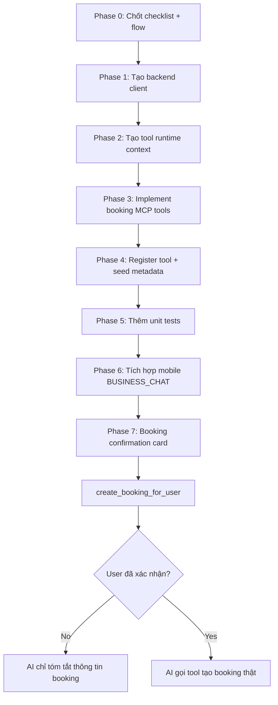

# AI Booking Tools - Requirements & Implementation Plan

**Mục đích:** Bổ sung các tools cần thiết để AI Agent có thể hỗ trợ Pet Owner đặt lịch qua chat (UC-004).

**Ngày tạo:** 2026-03-08
**Status:** In Progress

---

## Cap nhat kien truc 2026-03-18

- Booking with AI duoc refactor theo huong `Semantic ReAct + Thin Validator`.
- Agent chon tool dua tren y nghia prompt + tool description + JSON schema, khong dung keyword router de ep flow booking.
- Tool chaining duoc phep dien ra tu nhien theo hoi thoai, vi du: `get_user_pets -> search_clinics_nearby -> get_clinic_services -> check_available_slots -> create_booking_for_user`.
- Agent khong preload pets/clinics/services. Moi tool chi duoc goi khi hoi thoai thuc su can den du lieu do.
- Thin validator o tang agent chi lam 3 viec: loc param thua, chuan hoa kieu du lieu don gian, va chan thieu input bat buoc toi thieu.
- Fuzzy resolution cho clinic, service, date/time preference phai nam o tool/business API, khong nam o agent router.
- Neu user da neu phong kham cu the thi tool layer phai uu tien clinic do; khong duoc fallback sang clinic gan nhat chi vi co GPS.

---

## 📋 TOOLS CẦN BỔ SUNG

### 1. `get_user_pets` - Lấy danh sách pets của user
**File:** `petties-agent-serivce/app/core/tools/mcp_tools/booking_tools.py`

**Purpose:** AI cần biết user có pet nào để suggest trong booking flow.

**Tool Signature:**
```python
@mcp_server.tool
async def get_user_pets(user_id: str) -> Dict[str, Any]:
    """
    Lấy danh sách thú cưng của người dùng

    Args:
        user_id: UUID của pet owner

    Returns:
        {
            "user_id": str,
            "pets": List[{
                "id": str,
                "name": str,
                "species": str,  # "DOG", "CAT", etc.
                "breed": str,
                "age_years": int,
                "weight_kg": float,
                "avatar_url": str
            }],
            "total_pets": int
        }
    """
```

**Backend API Call:**
- `GET /api/pets/me` (đã có sẵn)
- Auth: JWT token từ WebSocket session

**Error Handling:**
- Nếu user chưa có pet: return empty list + message "Bạn chưa thêm thú cưng nào. Vui lòng thêm pet trước khi đặt lịch."

---

### 2. `search_clinics_nearby` - Tìm clinic gần user
**File:** `petties-agent-serivce/app/core/tools/mcp_tools/booking_tools.py`

**Purpose:** AI tìm clinics trong bán kính có dịch vụ mà user cần.

**Tool Signature:**
```python
@mcp_server.tool
async def search_clinics_nearby(
    latitude: float,
    longitude: float,
    radius_km: float = 5.0,
    service_names: Optional[List[str]] = None,
    top_k: int = 5
) -> Dict[str, Any]:
    """
    Tìm phòng khám gần vị trí người dùng

    Args:
        latitude: Vĩ độ người dùng
        longitude: Kinh độ người dùng
        radius_km: Bán kính tìm kiếm (km), mặc định 5km
        service_names: Danh sách tên dịch vụ cần (optional, ví dụ: ["Grooming", "Vaccination"])
        top_k: Số lượng kết quả trả về (mặc định 5)

    Returns:
        {
            "query_location": {"lat": float, "lng": float},
            "radius_km": float,
            "clinics": List[{
                "id": str,
                "name": str,
                "address": str,
                "distance_km": float,
                "rating": float,
                "total_reviews": int,
                "services": List[str],
                "has_sos": bool,
                "operating_hours": str
            }],
            "total_found": int
        }
    """
```

**Backend API Call:**
- `GET /api/clinics/nearby?latitude={lat}&longitude={lng}&radius={radius}`
- Filter theo services nếu user yêu cầu

**Logic:**
- Nếu tìm thấy < 3 clinics: suggest mở rộng bán kính
- Sort by distance ascending

---

### 3. `check_available_slots` - Kiểm tra slots trống
**File:** `petties-agent-serivce/app/core/tools/mcp_tools/booking_tools.py`

**Purpose:** AI check slots còn trống của clinic vào ngày user muốn.

**Tool Signature:**
```python
@mcp_server.tool
async def check_available_slots(
    clinic_id: str,
    date: str,  # Format: "YYYY-MM-DD"
    service_ids: List[str]
) -> Dict[str, Any]:
    """
    Kiểm tra khung giờ còn trống tại phòng khám

    Args:
        clinic_id: UUID của clinic
        date: Ngày khám (YYYY-MM-DD), ví dụ: "2026-03-15"
        service_ids: Danh sách ID dịch vụ cần đặt

    Returns:
        {
            "clinic_id": str,
            "date": str,
            "services": List[str],
            "available_slots": List[{
                "start_time": str,  # "HH:MM"
                "end_time": str,
                "duration_minutes": int,
                "staff_available": int
            }],
            "total_slots": int
        }
    """
```

**Backend API Call:**
- `GET /api/bookings/public/available-slots?clinicId={id}&date={date}&serviceIds={ids}`

**Error Handling:**
- Nếu không có slot: suggest alternative dates (ngày kế tiếp có slot)

---

### 4. `create_booking_for_user` - Tạo booking
**File:** `petties-agent-serivce/app/core/tools/mcp_tools/booking_tools.py`

**Purpose:** AI tạo booking sau khi user confirm.

**Tool Signature:**
```python
@mcp_server.tool
async def create_booking_for_user(
    user_id: str,
    pet_id: str,
    clinic_id: str,
    booking_date: str,  # "YYYY-MM-DD"
    start_time: str,    # "HH:MM"
    service_ids: List[str],
    notes: Optional[str] = None
) -> Dict[str, Any]:
    """
    Tạo booking mới cho người dùng

    Args:
        user_id: UUID của pet owner
        pet_id: UUID của pet
        clinic_id: UUID của clinic
        booking_date: Ngày khám (YYYY-MM-DD)
        start_time: Giờ bắt đầu (HH:MM)
        service_ids: Danh sách ID dịch vụ
        notes: Ghi chú thêm (optional)

    Returns:
        {
            "success": bool,
            "booking": {
                "id": str,
                "booking_code": str,
                "status": str,  # "PENDING"
                "pet_name": str,
                "clinic_name": str,
                "date": str,
                "time": str,
                "services": List[str],
                "estimated_total": float
            },
            "message": str
        }
    """
```

**Backend API Call:**
- `POST /api/bookings` với body:
```json
{
  "petId": "uuid",
  "clinicId": "uuid",
  "bookingDate": "2026-03-15",
  "startTime": "09:00",
  "serviceIds": ["uuid1", "uuid2"],
  "notes": "optional"
}
```

**Auth:** JWT token của user (từ WebSocket session)

**Error Handling:**
- Conflict slot: "Slot này đã được đặt, vui lòng chọn slot khác"
- Validation errors: "Thông tin không hợp lệ, vui lòng kiểm tra lại"

---

### 5. `get_clinic_services` - Lấy danh sách dịch vụ clinic
**File:** `petties-agent-serivce/app/core/tools/mcp_tools/booking_tools.py`

**Purpose:** AI cần biết clinic có dịch vụ gì để suggest cho user.

**Tool Signature:**
```python
@mcp_server.tool
async def get_clinic_services(clinic_id: str) -> Dict[str, Any]:
    """
    Lấy danh sách dịch vụ của phòng khám

    Args:
        clinic_id: UUID của clinic

    Returns:
        {
            "clinic_id": str,
            "services": List[{
                "id": str,
                "name": str,
                "description": str,
                "base_price": float,
                "duration_minutes": int,
                "category": str
            }],
            "total_services": int
        }
    """
```

**Backend API Call:**
- `GET /api/clinic-services?clinicId={id}`

---

## 🔧 IMPLEMENTATION CHECKLIST

## 🔄 IMPLEMENTATION FLOW (THỨ TỰ THỰC HIỆN)



### Delivery order
- **Bước 1:** Hoàn tất backend foundation trong AI service (`backend_client`, `tool_runtime_context`, `booking_tools`).
- **Bước 2:** Seed/register tools để agent load được ngay trong runtime.
- **Bước 3:** Thêm test cho context injection, tool execution, booking confirmation guard.
- **Bước 4:** Sau khi backend ổn mới làm mobile `BUSINESS_CHAT` cho Pet Owner.
- **Bước 5:** Cuối cùng mới nối `Booking Confirmation Card` để human-in-the-loop hoàn chỉnh.

### Phase 1: Create Tools (Python FastAPI)
- [x] Tạo file `petties-agent-serivce/app/core/tools/mcp_tools/booking_tools.py`
- [x] Implement 5 tools với @mcp_server.tool decorator:
    - [x] `get_user_pets`
    - [x] `search_clinics_nearby`
    - [x] `check_available_slots`
    - [x] `create_booking_for_user`
    - [x] `get_clinic_services`
- [x] Import trong `__init__.py` để register tools
- [x] Test tools với pytest/unittest

### Phase 2: HTTP Client for Spring Boot (Python)
- [x] Tạo `petties-agent-serivce/app/services/backend_client.py`:
    - [x] HTTP client với retry logic
    - [x] JWT auth header injection
    - [x] Error handling cho 4xx/5xx responses
- [x] Config base URL trong `.env`:
  ```
    SPRING_BACKEND_URL=http://localhost:8080/api
  ```

### Phase 3: WebSocket Session Context (Python)
- [x] Modify WebSocket handler để pass `user_id` + `jwt_token` vào tools
- [x] Store session context trong tool runtime context
- [x] Tools lấy auth từ context khi call backend APIs

### Phase 3.5: Human-in-the-loop Guard
- [x] `create_booking_for_user` chỉ chạy khi có cờ confirm rõ ràng
- [x] Prompt guardrail: AI không được tự tạo booking khi user chưa xác nhận
- [x] Nếu chưa confirm, AI chỉ trả booking summary

### Phase 4: Integration Testing
- [ ] Test full booking flow qua AI chat:
  1. User: "Tôi muốn đặt lịch khám cho chó"
  2. AI gọi `get_user_pets`
  3. User chọn pet + services
  4. AI gọi `search_clinics_nearby`
  5. User chọn clinic + date
  6. AI gọi `check_available_slots`
  7. User chọn slot
  8. AI gọi `create_booking_for_user`
  9. Success response

### Phase 5: Error Scenarios Testing
- [x] User chưa có pet → suggest add pet
- [x] Không tìm thấy clinic → suggest mở rộng radius
- [x] Không có slot → suggest alternative dates
- [x] Create booking fail → retry hoặc suggest liên hệ clinic

---

## 🚨 QUAN TRỌNG: Human-in-the-loop

**AI KHÔNG BAO GIỜ tự động execute booking mà không có confirmation từ user!**

Flow bắt buộc:
1. AI gather thông tin (pet, clinic, date, time, services)
2. AI hiển thị **Booking Confirmation Card** với full details
3. User phải click **"✅ XÁC NHẬN ĐẶT LỊCH"** button
4. Sau đó AI mới gọi `create_booking_for_user` tool

---

## 📝 NOTES

### Authentication Flow:
1. Pet Owner login → receive JWT token
2. Connect WebSocket với JWT trong header
3. AI service verify JWT với Spring Boot
4. Store user_id trong WebSocket session
5. Tools auto-inject JWT khi call backend APIs

### Rate Limiting:
- Tools gọi backend APIs → subject to Spring Boot rate limits
- Implement retry với exponential backoff
- Max 3 retries per tool call

### Logging & Audit:
- Log tất cả tool calls vào MongoDB `ai_chat_messages.metadata.tool_calls`
- Include: tool_name, params, result, timestamp, user_id
- Purpose: debugging, analytics, compliance

---

## 🎯 SUCCESS CRITERIA

✅ Pet Owner có thể hoàn thành booking flow 100% qua AI chat
✅ AI hiển thị đúng pets/clinics/slots available
✅ Booking được tạo thành công trong Spring Boot database
✅ Error handling rõ ràng, user-friendly messages
✅ ReAct flow visible cho transparency
✅ < 5s response time cho mỗi tool call
✅ 100% test coverage cho booking tools

---

## 📌 CURRENT PROGRESS SNAPSHOT

### Done
- Backend foundation cho booking AI tools đã xong trong AI service.
- Runtime context đã inject `user_id` + JWT từ business chat vào tool execution.
- Tool metadata đã được seed để agent load được ngay sau khi seed DB.
- Unit tests cho booking tools và contextual injection đã pass.

### Remaining
- Mobile `BUSINESS_CHAT` cho Pet Owner.
- Booking Confirmation Card ở mobile để human-in-the-loop hoàn chỉnh.
- End-to-end integration test với Spring Boot thật.
