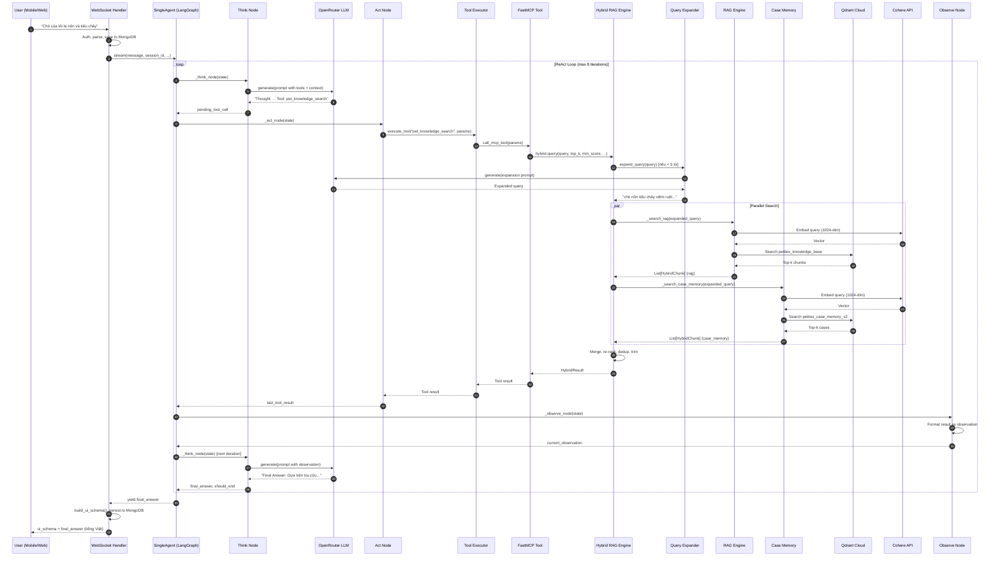

# RAG Pipeline — Petties AI Assistant

## Tổng quan

Petties AI Assistant sử dụng kiến trúc **Single Agent + ReAct pattern** (Thought → Action → Observation) qua LangGraph StateGraph, kết hợp **Hybrid RAG Engine** tìm kiếm song song từ Knowledge Base (Qdrant) và Case Memory (các ca bệnh đã xác nhận).

Pipeline đi từ tin nhắn WebSocket → phân tích → tra cứu dữ liệu → tổng hợp → phản hồi tiếng Việt, streaming real-time.

---

## Kiến trúc tổng thể

```
User Question
    │
    ▼
┌─────────────────────────────────────────────────────┐
│  WebSocket Handler (chat.py)                        │
│  • JWT Auth, Subscription Check                     │
│  • Session Isolation, History Restore               │
│  • Message Parse & Persist to MongoDB               │
└────────────────────────┬────────────────────────────┘
                         │
                         ▼
┌─────────────────────────────────────────────────────┐
│  SingleAgent (LangGraph StateGraph)                 │
│                                                     │
│  ┌──────────┐    ┌─────────┐    ┌──────────┐       │
│  │  THINK   │───▶│   ACT   │───▶│ OBSERVE  │──┐    │
│  │ (LLM)    │◀───│(Execute)│◀───│(Format) │  │    │
│  └────┬─────┘    └─────────┘    └──────────┘  │    │
│       │                                       │    │
│       ▼ (Final Answer)                        │    │
│  ┌──────────────┐                             │    │
│  │ Final Answer │◀────────────────────────────┘    │
│  │ Synthesis    │   (max 8 iterations)             │
│  └──────────────┘                                  │
└────────────────────────┬────────────────────────────┘
                         │
                         ▼
┌─────────────────────────────────────────────────────┐
│  Hybrid RAG Engine (hybrid_engine.py)               │
│                                                     │
│  ┌─────────────────┐  ┌──────────────────────┐     │
│  │ Query Expander  │  │ Parallel Search      │     │
│  │ (nếu query ngắn)│  │                      │     │
│  └────────┬────────┘  │ ┌──────────────────┐ │     │
│           │           │ │ RAG Engine       │ │     │
│           ▼           │ │ → Qdrant: KB     │ │     │
│  Expanded Query       │ │ → Cohere: embed  │ │     │
│                      │ │ └──────────────────┘ │     │
│                      │ │ ┌──────────────────┐ │     │
│                      │ │ │ Case Memory      │ │     │
│                      │ │ │ → Qdrant: Cases  │ │     │
│                      │ │ │ → Cohere: embed  │ │     │
│                      │ │ └──────────────────┘ │     │
│                      │ └──────────────────────┘     │
│                      │                              │
│                      │ Merge → Re-rank → Dedup      │
│                      └──────────────┬───────────────┘
└─────────────────────────────────────┘
                                      │
                                      ▼
                          ┌───────────────────────┐
                          │  External Services    │
                          │  • OpenRouter (LLM)   │
                          │  • Cohere (Embedding) │
                          │  • Qdrant (Vectors)   │
                          │  • Jina (Image embed) │
                          └───────────────────────┘
```

---

## Chi tiết từng bước

### Bước 1: WebSocket Entry Point

**File:** `petties-agent-serivce/app/api/websocket/chat.py`

**Endpoint:** `WS /ws/chat/{session_id}?token={jwt}`

| Bước | Mô tả |
|------|-------|
| **Auth** | Decode JWT từ query param, reject code 1008 nếu sai |
| **Subscription** | Kiểm tra user có subscription active |
| **Session** | Validate sở hữu session, tạo mới nếu cần |
| **History** | Gửi `connected` + `history` (tối đa 100 tin nhắn từ MongoDB) |
| **Receive Loop** | Vòng lặp vô hạn, gọi `handle_chat_message()` cho mỗi tin nhắn |

**Input:** JSON text qua WebSocket (`message`, `images`, `location`, `ui_action`)
**Output:** WebSocket messages: `connected`, `history`, `ack`, `react_step`, `ui_schema`, `final_answer`, `error`

---

### Bước 2: Message Handling & Agent Setup

**File:** `petties-agent-serivce/app/api/websocket/chat.py` — `handle_chat_message()`

| Bước | Mô tả |
|------|-------|
| **Parse** | Trích xuất user message, images, location, agent/model override |
| **ACK** | Gửi xác nhận về client |
| **Persist** | Lưu tin nhắn user vào MongoDB |
| **Setup Agent** | Load LLM config từ DB, tạo `SingleAgent` với tools enabled |
| **Build Context** | Load chat history (tối đa 20 tin), extract location, augment message |
| **Stream** | Gọi `agent.stream()` và thu thập response |

---

### Bước 3: LangGraph ReAct Loop

**File:** `petties-agent-serivce/app/core/agents/single_agent.py`

StateGraph có 4 node chính:

```
START → think → should_continue? → act → observe → think → ... → END
                            ↓
                          end (final answer)
```

| Node | Vai trò |
|------|---------|
| **think** | LLM suy nghĩ, quyết định có gọi tool hay trả lời luôn |
| **act** | Thực thi tool được chọn qua ToolExecutor |
| **observe** | Format kết quả tool thành văn bản cho LLM đọc |
| **should_continue** | Route: nếu có `pending_tool_call` → `act`, nếu có `final_answer` → `end` |

**Tối đa 8 iterations** để tránh loop vô hạn.

---

### Bước 4: Think Node — LLM Reasoning

**File:** `petties-agent-serivce/app/core/agents/single_agent.py` — `_think_node()`

**Quy trình:**

1. **Kiểm tra dừng:** Nếu `should_end` flag hoặc đạt max iterations → thoát sớm
2. **Fast-path (iteration 0):** `build_fast_pet_care_tool_call()` — nếu query đơn giản, route thẳng đến `pet_knowledge_search` không cần LLM
3. **Auto-fallback:** Nếu tool trước trả về kết quả rỗng → tự động chuyển sang `web_search`
4. **Auto-finalize:** Nếu kết quả tool đủ đơn giản → tổng hợp câu trả lời luôn, không cần LLM
5. **Build prompt:** `create_think_prompt()` — ghép system prompt + ReAct rules + tool schemas + dialogue history
6. **Call LLM:** Gửi prompt qua OpenRouter API (timeout 90s)
7. **Parse response:** Trích xuất Thought/Tool/Tool Input/Final Answer
8. **Loop prevention:** Phát hiện LLM lặp lại cùng tool call → force end

**External service:** OpenRouter API → `google/gemini-2.5-flash-lite` (fallback: `llama-3.3-70b-instruct`)

---

### Bước 5: Prompt Building

**File:** `petties-agent-serivce/app/core/agents/prompt_builder.py` — `create_think_prompt()`

Prompt được ghép từ các phần:

| Phần | Nội dung |
|------|----------|
| **Agent identity** | Tên + loại agent |
| **System prompt** | Vai trò, tone, tasks, business rules (hardcoded) |
| **ReAct format** | Quy tắc Thought/Tool/Tool Input/Final Answer |
| **Answer principles** | Tập trung, tiếng Việt, khuyến khích đi khám thú y |
| **Booking section** | Hướng dẫn theo role (PET_OWNER vs CLINIC_COPILOT) |
| **System context** | DateTime (Asia/Ho_Chi_Minh), location |
| **Recent dialogue** | 10 tin nhắn gần nhất |
| **Available tools** | Tên, mô tả, input schema của mỗi tool enabled |
| **User question** | Tin nhắn mới nhất của user |

---

### Bước 6: Act Node — Tool Execution

**File:** `petties-agent-serivce/app/core/agents/single_agent.py` — `_act_node()`

1. Trích xuất `pending_tool_call` (tool name + arguments)
2. Validate tool trong danh sách `enabled_tools`
3. Gọi `execute_tool(tool_name, tool_params)` từ `app/core/tools/executor.py`

---

### Bước 7: Tool Executor

**File:** `petties-agent-serivce/app/core/tools/executor.py` — `ToolExecutor.execute()`

| Bước | Mô tả |
|------|-------|
| **Load tool config** | Fetch từ PostgreSQL bảng `tools` (name, enabled, input_schema) |
| **Normalize params** | Chuẩn hóa key, áp dụng alias/coercion |
| **Schema filtering** | Lọc params theo `input_schema.properties`, loại key dư |
| **Context injection** | Inject `user_id`, `clinic_id`, `session_id` nếu tool yêu cầu |
| **Validate** | Kiểm tra required parameters |
| **Execute** | Gọi `call_mcp_tool()` → invoke hàm `@mcp_server.tool` |
| **Normalize output** | Chuẩn hóa format response |

---

### Bước 8: MCP Tool — `pet_knowledge_search`

**File:** `petties-agent-serivce/app/core/tools/mcp_tools/medical_tools.py`

**Khi nào dùng:** User hỏi về chăm sóc thú cưng, triệu chứng, bệnh, dinh dưỡng, giống loài.

**Quy trình:**

1. Lấy singleton `HybridRAGEngine`
2. Gọi `hybrid.query()` với params:
   - `query`: Câu hỏi user
   - `top_k`: Số kết quả (mặc định 5)
   - `min_score`: Ngưỡng similarity (mặc định 0.4)
   - `pet_type`: Gợi ý loài (dog, cat, bird...)
   - `enable_rag`: True
   - `enable_case_memory`: True
   - `enable_query_expansion`: True
3. Map `HybridChunk` → tool response schema, clean text qua `_clean_rag_text()`
4. Trả về dict: `{query, results, sources_used, search_source}` + timing metadata

**Output mẫu:**

```json
{
  "query": "chó bị nôn phải làm sao",
  "results": [
    {
      "content": "Khi chó bị nôn, cần ngừng cho ăn 12-24 giờ...",
      "score": 0.85,
      "source": "Cẩm nang chăm sóc chó.pdf",
      "chunk_index": 42
    },
    {
      "content": "Case #abc123: Chó Poodle 3kg, nôn liên tục 2 ngày...",
      "score": 0.78,
      "source": "Case Memory"
    }
  ],
  "sources_used": 2,
  "search_source": "knowledge_base"
}
```

---

### Bước 9: Hybrid RAG Engine

**File:** `petties-agent-serivce/app/core/rag/hybrid_engine.py` — `HybridRAGEngine.query()`

**Pipeline 4 bước:**

```
Query → Query Expansion → Parallel Search → Merge & Re-rank
```

#### 9.1 Query Expansion

**File:** `petties-agent-serivce/app/core/rag/query_expander.py`

- Nếu query < 5 từ → gọi LLM mở rộng với từ đồng nghĩa thú y, thuật ngữ y khoa
- Nhiệt độ: 0.3, max tokens: 150
- Kết quả: `"chó nôn" → "chó nôn tiêu chảy triệu chứng viêm ruột nhiễm khuẩn"`
- Nếu query ≥ 5 từ hoặc expansion thất bại → giữ nguyên

#### 9.2 Parallel Search

Hai tìm kiếm chạy **song song** qua `asyncio.gather()`:

| Nguồn | Collection | Weight | Mô tả |
|-------|-----------|--------|-------|
| **RAG** | `petties_knowledge_base` | 1.0x | Tài liệu PDF/DOCX đã index |
| **Case Memory** | `petties_case_memory_v2` | 1.2x | Ca bệnh đã xác nhận từ EMR |

#### 9.3 Merge & Re-rank

1. Gộp kết quả từ cả 2 nguồn
2. Sort theo `score` (descending) — Case Memory được nhân weight 1.2x
3. Deduplicate theo content (giữ thứ tự)
4. Trim về `top_k` kết quả

---

### Bước 10: RAG Engine — Knowledge Base Search

**File:** `petties-agent-serivce/app/core/rag/rag_engine.py` — `LlamaIndexRAGEngine.query()`

**Quy trình:**

1. **Initialize** (lazy): CohereEmbedding + QdrantClient + VectorStoreIndex
2. **Create retriever:** `index.as_retriever(similarity_top_k=top_k)`
3. **Retrieve:** LlamaIndex tự động:
   - Embed query qua Cohere `embed-multilingual-v3.0` (1024-dim, `input_type="search_query"`)
   - Cosine similarity search trong Qdrant
4. **Filter:** Loại chunk có `score < min_score`, deduplicate content
5. **Return:** `List[RetrievedChunk]` với `document_id`, `document_name`, `chunk_index`, `content`, `score`

**External services:**
- **Cohere API:** Embed query → 1024-dim vector
- **Qdrant Cloud:** Similarity search trên `petties_knowledge_base` (COSINE distance)

---

### Bước 11: Case Memory Search

**File:** `petties-agent-serivce/app/core/rag/case_memory.py` — `CaseMemoryService.search_similar()`

**Quy trình:**

1. **Text branch:**
   - Embed query qua Cohere
   - Query Qdrant `petties_case_memory_v2` với named vector `"text"`
   - Lấy tối đa `top_k * 2` results

2. **Image branch** (nếu có `image_urls`):
   - Embed ảnh qua Jina CLIP v2 (1024-dim)
   - Query Qdrant với named vector `"image"`

3. **Merge:** Gộp text + image hits, giữ max score theo `case_id`

4. **Re-rank:**
   - Text-only: `final_score = 1.0 * text_score`
   - Có ảnh: `final_score = 0.3 * text_score + 0.7 * image_score`

5. **Return:** `List[CaseResult]` với `case_id`, `content`, `score`, `final_score`, `payload`

**External services:**
- **Cohere API:** Text embedding
- **Jina API:** Image embedding (optional)
- **Qdrant Cloud:** Named vector search (`text` + `image`)

---

### Bước 12: Observe Node — Format Tool Result

**File:** `petties-agent-serivce/app/core/agents/single_agent.py` — `_observe_node()`

| Loại kết quả | Cách format |
|-------------|-------------|
| **Error** | Formatted error message với error_code, recoverable flag, suggestion |
| **Success với data dict** | Format từng key-value trong data |
| **Success với top-level keys** (pets, clinics, services, slots) | Format trực tiếp |
| **Fallback** | JSON dumps |

**Fast finalize check:** Nếu kết quả đơn giản (triệu chứng/chăm sóc cơ bản), có thể tổng hợp câu trả lời ngay mà không cần LLM iteration tiếp theo.

---

### Bước 13: LLM Synthesis — Final Answer

Sau khi tool results được format thành observation, LLM đọc lại toàn bộ context:

- Previous Thought/Action/Observation (tối đa 5 bước)
- Recent dialogue (tối đa 10 tin nhắn)
- Tool results dưới dạng Observation text
- Câu hỏi gốc của user

LLM sinh ra **Final Answer** bằng tiếng Việt, tổng hợp từ:
- Dữ liệu tool trả về (chunks từ RAG + Case Memory)
- Kiến thức sẵn có của LLM
- Nguyên tắc trả lời: tập trung, an toàn, khuyến khích đi khám thú y

---

### Bước 14: WebSocket Response Streaming

**File:** `petties-agent-serivce/app/api/websocket/chat.py` — `_stream_and_collect()`

| Event type | Mô tả | Client nhận được |
|-----------|-------|------------------|
| `react_step` | Mỗi bước ReAct (thought/action/observation) | Streaming thinking messages |
| `ui_schema` | UI cards (booking, clinic, pet info) | Render cards trên UI |
| `final_answer` | Câu trả lời cuối đã sanitize | Hiển thị text tiếng Việt |
| `booking_state_update` | Trạng thái booking (nếu có) | Cập nhật UI booking |

**Sau khi streaming xong:**
- `_finalize_and_persist()` lưu assistant response + `react_trace` + `ui_schema` vào MongoDB

---

## Sequence Diagram



---

## External Services

| Service | Vai trò | Endpoint/Collection | Dimension |
|---------|---------|---------------------|-----------|
| **OpenRouter** | LLM reasoning, query expansion, answer synthesis | `/chat/completions` | N/A |
| **Cohere** | Text embeddings (tiếng Việt) | `embed-multilingual-v3.0` | 1024 |
| **Qdrant Cloud** | Vector storage & similarity search | `petties_knowledge_base`, `petties_case_memory_v2` | 1024 (COSINE) |
| **Jina API** | Image embeddings (optional) | `jina-clip-v2` | 1024 |
| **PostgreSQL** | Tool config, system settings, agent config | `tools`, `system_settings`, `agent_configs` | N/A |
| **MongoDB** | Chat sessions, messages, booking state | `chat_sessions`, `chat_messages` | N/A |

---

## Data Flow Summary

```
User Question (tiếng Việt)
    │
    ▼
[WebSocket] → Auth → Parse → Save MongoDB
    │
    ▼
[SingleAgent.stream()] → LangGraph astream_events
    │
    ▼
[Think Node] → Build Prompt → Call OpenRouter LLM
    │
    ▼ (LLM quyết định gọi tool)
[Act Node] → Tool Executor → FastMCP → pet_knowledge_search
    │
    ▼
[Hybrid RAG Engine]
    ├── Query Expander (nếu query ngắn) → LLM mở rộng
    ├── RAG Search (song song) → Cohere embed → Qdrant petties_knowledge_base
    ├── Case Memory Search (song song) → Cohere embed → Qdrant petties_case_memory_v2
    └── Merge → Re-rank (CaseMemory 1.2x) → Dedup → Trim
    │
    ▼
[Observe Node] → Format kết quả thành observation text
    │
    ▼
[Think Node] (iteration tiếp) → Build prompt có observation → Call LLM
    │
    ▼ (LLM sinh Final Answer)
[Final Answer] → Câu trả lời tiếng Việt, tổng hợp từ tool results + LLM knowledge
    │
    ▼
[WebSocket] → Stream thinking steps → Send UI schema → Send final answer → Save MongoDB
```

---

## File Map

| Component | File Path |
|-----------|-----------|
| WebSocket Handler | `petties-agent-serivce/app/api/websocket/chat.py` |
| Single Agent (LangGraph) | `petties-agent-serivce/app/core/agents/single_agent.py` |
| Prompt Builder | `petties-agent-serivce/app/core/agents/prompt_builder.py` |
| LLM Client (OpenRouter) | `petties-agent-serivce/app/services/llm_client.py` |
| Tool Executor | `petties-agent-serivce/app/core/tools/executor.py` |
| MCP Tools (Medical) | `petties-agent-serivce/app/core/tools/mcp_tools/medical_tools.py` |
| Hybrid RAG Engine | `petties-agent-serivce/app/core/rag/hybrid_engine.py` |
| Query Expander | `petties-agent-serivce/app/core/rag/query_expander.py` |
| RAG Engine | `petties-agent-serivce/app/core/rag/rag_engine.py` |
| Case Memory | `petties-agent-serivce/app/core/rag/case_memory.py` |
| MongoDB Setup | `petties-agent-serivce/app/core/database/mongodb.py` |
| Settings | `petties-agent-serivce/app/config/settings.py` |

---

*Document created: 2026-04-06*
*Based on actual codebase analysis*
