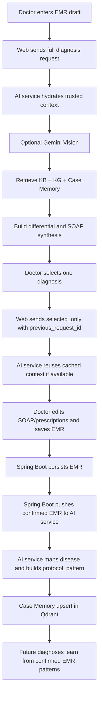
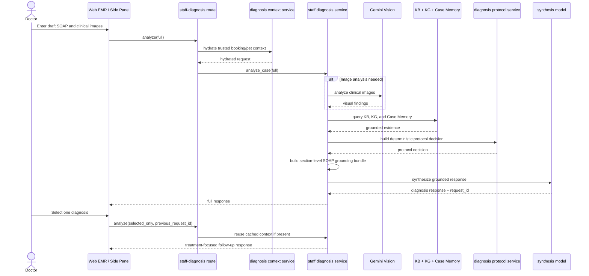
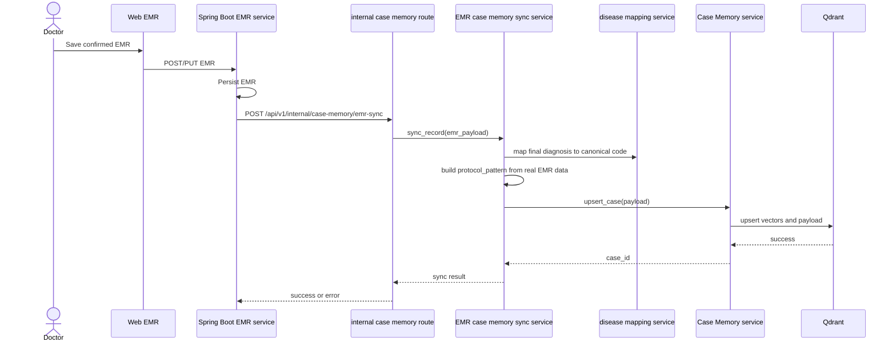

# AI Diagnosis Runtime Flow

> Last Updated: 2026-04-03
> Status: Active source of truth for deployed AI diagnosis runtime behavior
> Scope: `petties-agent-serivce`, `backend-spring/petties`, `petties-web`, `petties_mobile`, confirmed EMR to Case Memory sync, and runtime diagnosis for `STAFF` / `ADMIN`
> Companion documents: SRS `docs-references/documentation/SRS/PETTIES_SRS.md` section `3.11.11`, SDD `docs-references/documentation/SDD/REPORT_4_SDD_SYSTEM_DESIGN.md` section `4.21`
> Planned next-step design: `docs-references/ai_diagnose_service/08_AUTONOMOUS_CANONICALIZATION_PROPOSAL.md`

---

## 1. Purpose

This document defines the deployed end-to-end lifecycle of Petties AI diagnosis.

It is the canonical runtime reference for:

- clarifying the fundamental nature of the system: `ai-diagnose` is an adaptive, transparent, evidence-based diagnostic assistant that learns from confirmed EMRs. It is NOT a permanent event-sourcing system that records every single intermediate medical interaction.
- how Web builds diagnosis requests
- how the AI service runs `describe_only`, `full`, and `selected_only`
- how confirmed EMR records are persisted and pushed into Case Memory
- how `protocol_pattern` is derived from real EMR data
- which contracts are canonical versus legacy-compatible

---

## 2. Scope

### In scope:

- Staff EMR workspace diagnosis support
- Staff AI chat side panel diagnosis support when EMR context exists
- confirmed EMR to Case Memory sync
- protocol learning from confirmed EMR records
- runtime-focused Case Memory payload projection

### Out of scope:

- pet owner general chat flows
- deprecated polling-based EMR sync
- deprecated thumbs-up/down feedback loop as case memory ground truth
- any requirement for structured `test_results` in the current doctor EMR flow

---

## 3. Key Principles

1. **No web search** in the doctor diagnostic flow.
2. **Internal data first**: Knowledge Base (KB), Knowledge Graph (KG), Case Memory from confirmed EMR.
3. **Learning from real cases**: Protocol patterns are extracted from confirmed EMR records, not hardcoded.
4. **Image understanding**: Gemini Vision analyzes clinical images for objective findings.
5. **Safety guardrails**: No prescription suggestions without sufficient internal evidence.
6. **Generic safety gating**: Safety checks (weight, allergy) apply to all diagnoses; no disease-specific hardcoded rules in protocol logic.

---

## 4. Role Rules and Trust Boundaries

### 4.1 Staff/Doctor

- No `web_search` allowed in diagnosis flow.
- Internal data only: KB, KG, confirmed EMR, Case Memory, Gemini Vision.
- If internal evidence is insufficient, return safe internal-only response rather than unsupported treatment detail.
- Must respond with clear disclaimer when no matching information found.

### 4.2 Diagnosis Trust Boundary

- `booking_id` / `pet_id` must be verified against backend context.
- Context precedence: trusted backend hydration > doctor-entered data > AI suggestions.
- Clinic-safe scope: staff must remain inside permitted clinic scope.
- HTTP semantics: `403` for scope violation, `404` for missing resource, `422` for invalid payload.

---

## 5. Canonical Terms

| Term | Meaning |
|---|---|
| `describe_only` | Image-only preview flow. Produces image descriptions and visual findings without full diagnosis synthesis. |
| `full` | Full diagnosis synthesis flow. Produces differential diagnoses, evidence, SOAP draft, and runtime request cache entry. |
| `selected_only` | Follow-up synthesis after the doctor selects one differential. Reuses cached context from the preceding `full` analysis when available. |
| `confirmed EMR` | An EMR record already saved by staff with a final diagnosis in `assessment`. This is the clinical truth for learning. |
| `ai_diagnosis_context` | Persisted AI payload and trace metadata saved inside EMR for auditability and replay-safe processing. |
| `protocol_pattern` | Structured summary learned from a confirmed EMR record for future retrieval and treatment guidance. |

---

## 6. Active Components

| Component | Responsibility | Primary file/module |
|---|---|---|
| Web EMR pages | Collect draft SOAP, images, selected diagnosis, and save EMR | `petties-web/src/pages/staff/emr/CreateEmrPage.tsx`, `EditEmrPage.tsx` |
| AI diagnosis panel | Builds diagnosis requests and handles `full` / `selected_only` transitions | `petties-web/src/components/emr/AIDiagnosisPanel.tsx` |
| EMR AI context builder | Canonical persisted `aiDiagnosisContext` payload builder | `petties-web/src/utils/emrAiDiagnosisContext.ts` |
| Spring EMR service | Saves EMR and pushes confirmed records to AI service | `backend-spring/petties/src/main/java/.../EmrService.java` |
| Staff diagnosis route | Receives runtime diagnosis requests | `petties-agent-serivce/app/ai_diagnose/routes.py` |
| Staff diagnosis service | Orchestrates runtime diagnosis and selected-only reuse | `petties-agent-serivce/app/ai_diagnose/staff_diagnosis_service.py` |
| Context service | Hydrates trusted booking/pet context before diagnosis | `petties-agent-serivce/app/ai_diagnose/context_service.py` |
| Diagnosis protocol service | Safety gating chung (weight, allergy); applies learned protocol patterns from EMR | `petties-agent-serivce/app/ai_diagnose/diagnosis_protocol_service.py` |
| Internal case memory route | Receives pushed confirmed EMR records from Spring Boot | `petties-agent-serivce/app/api/routes/internal_case_memory.py` |
| EMR case memory sync service | Builds Case Memory payloads and protocol patterns from confirmed EMR records | `petties-agent-serivce/app/core/services/emr_case_memory_sync_service.py` |
| Case Memory service | Stores and retrieves confirmed EMR cases in Qdrant | `petties-agent-serivce/app/core/rag/case_memory.py` |
| Disease Mapping Service | Maps raw disease labels to canonical codes, auto-learns aliases, and can auto-create new canonical diseases using `disease_catalog` + `disease_aliases` | `petties-agent-serivce/app/core/services/disease_mapping_service.py` |
| Gemini Vision Adapter | Analyzes clinical images using Gemini via OpenRouter | `petties-agent-serivce/app/core/vision/gemini_vision_adapter.py` |
| Hybrid RAG Engine | KB + KG hybrid search with Cohere embed + Qdrant | `petties-agent-serivce/app/core/rag/hybrid_engine.py` |

---

## 7. Lifecycle Overview



---

## 8. Runtime Diagnosis Flow

### 8.1 Source data used by the doctor flow

The active doctor diagnosis flow only relies on data that truly exists in the current EMR workspace and trusted backend context:

- doctor-entered narrative and SOAP draft
- uploaded clinical images
- optional vitals such as weight when available
- trusted booking and pet context from backend hydration
- internal knowledge base
- knowledge graph
- Case Memory built from confirmed EMR records

The current flow does not depend on a structured `test_results` field in the EMR workspace.

### 8.2 `full` analysis

1. Web collects the current draft SOAP, clinical narrative, image URLs, pet context, and booking context.
2. Web sends `POST /api/v1/staff-diagnosis/analyze` with `synthesis_mode = full`.
3. The AI service resolves trusted booking/pet context before synthesis.
4. If at least one clinical image is present in `full` mode, Gemini Vision is always executed.
5. The service retrieves internal evidence from KB, KG, and Case Memory.
6. The diagnosis protocol service builds a deterministic protocol decision using generic safety checks (weight, allergy) without disease-specific hardcoded rules.
7. The service builds a section-level grounding bundle for Subjective, Objective, Assessment, and Plan from request facts, vision findings, KB chunks, and similar confirmed EMR cases.
8. LLM synthesis produces grounded differentials, SOAP suggestions, and optional prescription suggestions using the grounding bundle.
9. The service stores an in-memory analysis cache keyed by `request_id` for possible `selected_only` reuse.

### 8.3 `selected_only` analysis

1. The doctor picks one diagnosis from the returned differential list.
2. Web sends another diagnosis request with:
   - `synthesis_mode = selected_only`
   - `previous_request_id`
   - `selected_diagnosis_code`
   - `selected_diagnosis_label`
3. The AI service attempts to load cached context from the prior `full` run.
4. If the cache entry exists, the service reuses the prior evidence context and only re-synthesizes the treatment-facing result.
5. If the cache entry is missing, `selected_only` is skipped and the service falls back to standard runtime behavior safely.

Important notes:

- `selected_only` is a cache-reuse optimization (using a ~20-minute in-memory cache), not a persisted workflow state. It optimizes follow-up generation for an active session.
- A cache miss is valid behavior and must not break EMR entry.
- `full` mode keeps a comparison set of up to 3 differential diagnoses; if synthesis returns fewer items, the service backfills from grounded candidates and canonical catalog entries before returning the response.
- The treatment source priority in `selected_only` is:
  1. `common_prescriptions` learned from confirmed EMR
  2. LLM fallback if no valid learned prescriptions exist
  3. empty list if neither source yields a safe result

### 8.4 Runtime sequence



---

## 9. EMR Save and Confirmed Sync Flow

### 9.1 What becomes clinical truth

The final saved EMR is the clinical source of truth. AI runtime output is advisory only.

The saved EMR record may include:

- `subjective`, `objective`, `assessment`, `plan`, `notes`
- `prescriptions`
- `images`
- optional vitals
- `aiDiagnosisContext`

### 9.2 Canonical persisted AI context

The `aiDiagnosisContext` is intentionally designed as a lightweight trace rather than a full reasoning log or an event-sourcing payload. It captures the final clinical selections made by the doctor for auditability and replay-safe processing, NOT every intermediate prompt or inference step.

When Web saves AI context into EMR, the canonical payload must use snake_case:

```json
{
  "request_id": "req-123",
  "selected_diagnosis_code": "bacterial_dermatosis",
  "selected_diagnosis_label": "Bacterial dermatitis",
  "suggested_prescriptions": [
    {
      "medicine_name": "Cephalexin",
      "dosage": "250 mg",
      "frequency": "2 times/day",
      "duration_days": 14,
      "instructions": "Take after food",
      "source": "llm_fallback",
      "source_detail": "selected_only fallback"
    }
  ],
  "generated_at": "2026-04-01T10:00:00Z"
}
```

Rules:

- snake_case is the canonical contract
- camelCase may still be read by the AI service only for backward compatibility with older stored records
- new documentation, new payload builders, and new tests must use snake_case only

### 9.3 Spring Boot to AI service sync

After EMR persistence succeeds, Spring Boot pushes the confirmed EMR record to:

- `POST /api/v1/internal/case-memory/emr-sync`

This direct push flow is the active deployed sync design.

The deprecated manual batch endpoint in `knowledge.py` is intentionally disabled with `410 Gone`.

### 9.4 Confirmed EMR sync sequence



---

## 10. Case Memory Payload Rules

### 10.1 `protocol_pattern`

For the active doctor flow, `protocol_pattern` may only be derived from data that truly exists in the EMR workflow:

- `soap_template.assessment` from the saved SOAP assessment or final diagnosis text
- `common_prescriptions` from final saved prescriptions
- `common_recommendations` extracted from doctor-entered `plan` and `notes`
- `common_tests` extracted from doctor-entered `plan` and `notes` when diagnostic wording is present

The active doctor flow treats `common_tests` as a runtime protocol source when they can be inferred from real EMR text.

For disease identity normalization in the confirmed EMR sync flow:

- exact alias match is still preferred first
- if no alias matches, the system now attempts autonomous canonicalization using the existing `disease_catalog` and `disease_aliases`
- if confidence is still not sufficient, the case remains `provisional` safely

### 10.2 Audit metadata policy

AI-vs-final alignment information can be captured as audit metadata for analytics, but it is not part of the active Case Memory runtime schema.

Rules:

- audit metadata must not alter retrieval ranking
- audit metadata must not alter protocol support scoring
- runtime diagnosis behavior must remain deterministic based on retrieval similarity and learned protocol content

### 10.3 Typical Case Memory payload fields

```json
{
  "canonical_code": "bacterial_dermatosis",
  "mapping_status": "mapped",
  "species": "dog",
  "chief_complaint": "Da do, ngua nhieu, co mu",
  "clinical_notes": "Ton thuong da lan toa",
  "exam_at": "2026-04-02T10:00:00Z",
  "text_content": "runtime retrieval text",
  "protocol_pattern": {
    "soap_template": {"assessment": "..."},
    "common_prescriptions": [{"medicine": "..."}],
    "common_recommendations": ["..."]
  }
}
```

### 10.4 Runtime-only projection rule

Case Memory now follows a runtime-only projection principle:

- keep fields that are actually read by `ai-diagnose` retrieval, ranking, and grounded SOAP synthesis
- remove audit-only or legacy payload fields from the active Case Memory schema and admin UI
- if a field is only needed during sync-time analytics (for example raw AI context), do not expose it in runtime projection; keep runtime projection limited to diagnosis-relevant fields such as `protocol_pattern` and `text_content`

---

## 11. Doctor UX Assumptions

### 11.1 How doctors prompt the system

Doctors typically enter brief, symptom-focused descriptions:

- "Cho cho đỏ mắt, nhiều ghèn vàng, dụi mắt liên tục."
- "Bé mèo có vết lở trên da, rụng lông vùng bụng."
- "Tai phải sưng, có mủ đen, bé lắc đầu nhiều."

### 11.2 How AI should respond

1. Acknowledge symptoms and match with internal KB evidence.
2. Retrieve similar confirmed EMR cases from Case Memory.
3. Return differential diagnoses with confidence levels and supporting reasons.
4. Provide SOAP suggestions ready to insert into EMR form.
5. Include prescription suggestions only when sufficient internal evidence exists.
6. Always include disclaimer that AI output is advisory only.

### 11.3 Example output format

```
Top Differentials:
1. Viêm kết mạc hoặc nhiễm trùng mắt (confidence: 62%)
   - AI nhìn ảnh ghi nhận dấu hiệu phù hợp với hướng bệnh này.
   - Đã đối chiếu với kho tri thức nội bộ.

Supporting Evidence:
- KB: Viêm kết mạc ở chó thường biểu hiện đỏ mắt, ghèn mắt...
- Case Memory: Ca EMR #1 (dog, điểm 0.87): Viêm kết mạc...

SOAP Suggestions:
- Assessment: Viêm kết mạc hoặc nhiễm trùng mắt.
- Plan: Vệ sinh mắt NaCl 0.9%...

Prescription Suggestions:
- Tobramycin 0.3% - 1-2 giọt, 3 lần/ngày, 5 ngày

Disclaimer: Đây là gợi ý hỗ trợ tham khảo...
```

---

## 12. Architecture Defense & Technical FAQ

This section anticipates technical scrutiny and provides the architectural defense for the chosen designs.

### 12.1 Defense against Event Sourcing
**Question:** Why doesn't the system use an Event Sourcing architecture to replay the exact state of the AI at any given time?

**Defense:** Event sourcing is an anti-pattern for LLM-based clinical inference systems where the model behavior (e.g., prompt iterations, LLM endpoint updates) naturally drifts over time. Storing the *input* (the EMR state) and the *final chosen output* (`aiDiagnosisContext`) is sufficient to understand the clinical outcome and provide an audit trail. A full event log of intermediate inferences inflates the database massively with zero clinical or legal value since the final responsibility lies entirely with the human doctor confirming the EMR.

### 12.2 Defense of the ~20-minute In-Memory Cache
**Question:** Why use a 20-minute in-memory cache (or transient Redis) for `selected_only` instead of persisting the workflow state in a PostgreSQL database?

**Defense:** The `selected_only` transition is a stateless inference optimization, not a long-running business saga (like a payment or checkout). Persisting intermediate states violates the "lightweight" principle and creates stale-state invalidation headaches if the doctor modifies the EMR text concurrently. In-memory is fast, disposable, and scales horizontally. If a cache miss occurs, the system fails gracefully by requiring the user to hit the `full` analysis button again, taking mere seconds to rebuild a fresh, accurate context based on the latest EMR text.

### 12.3 Handling the Cold Start Problem
**Question:** The system learns from confirmed EMRs. How does it handle a "Cold Start" when a new clinic has zero confirmed cases in its Case Memory?

**Defense:** The system retrieves evidence from three primary sources:
1. `Knowledge Base (KB)` (Internal clinical guidelines)
2. `Knowledge Graph (KG)` (Disease-symptom relationships)
3. `Case Memory` (Confirmed EMRs)

In a Cold Start scenario, Case Memory yields 0 results. The hybrid RAG engine falls back gracefully and heavily relies on the KB and KG. The LLM synthesis will still generate valid differentials and SOAP drafts, though prescription patterns might rely on the safe `llm_fallback` mechanisms (with strict safety gates like weight/allergy checks) until enough real EMRs are ingested.

### 12.4 Defense against Data Poisoning (Bad EMRs)
**Question:** If a doctor enters a bad diagnosis or incorrect prescription, will the AI learn it and poison future recommendations?

**Defense:** The system implements a 3-layer fault-tolerant design at the code level to prevent data poisoning:
1. **Strict Ingestion Gate (Confirmed State Only):** The `EmrCaseMemorySyncService._is_valid_for_ingest()` method explicitly rejects any EMR payload where `verified` is False or missing critical text. The AI never learns from draft or unconfirmed EMRs.
2. **Multi-Source Grounding:** In `StaffDiagnosisService._retrieve_internal_context()`, the system forces a concurrent retrieval (`asyncio.gather(hybrid_task, case_task)`). The LLM is always grounded by both the `Knowledge Base` (textbook truth) and `Case Memory` (experiential truth). A single anomalous case in memory is outweighed by textbook facts and vector similarity to other correct cases.
3. **Purge Capability:** The core engine provides a `CaseMemory.delete_case()` API that permanently removes specific vectors from Qdrant. If a bad clinical pattern is identified, administrators or Chief Medical Officers can surgically remove the poisoned case from the AI's memory.

---

## 13. Deprecated or Non-Canonical Designs

The following should not be treated as active runtime truth:

- polling worker based confirmed EMR sync
- batch pull flow `GET /internal/ai/emrs/confirmed`
- thumbs-up/down feedback as the primary source for Case Memory learning
- a structured `test_results` requirement in the current doctor EMR workflow
- camelCase payload examples for new `ai_diagnosis_context` writes
- hardcoded disease-specific safety rules in DiagnosisProtocolService (removed 2026-04-01)

---

## 14. Documentation Change Rules

Any future change to AI diagnosis must update this document if it changes one of the following:

- diagnosis request contract
- `selected_only` semantics
- trusted context hydration order
- `ai_diagnosis_context` schema
- `protocol_pattern` fields
- confirmed EMR to Case Memory sync path

Recommended review checklist for AI diagnosis changes:

1. Does the Web payload still match the AI schemas?
2. Is snake_case still the canonical persisted contract?
3. Does the sync service still derive protocol data only from real EMR fields?
4. Does the SRS section `3.11.11` still match runtime behavior?
5. Does the SDD sequence still describe the deployed sync path?
