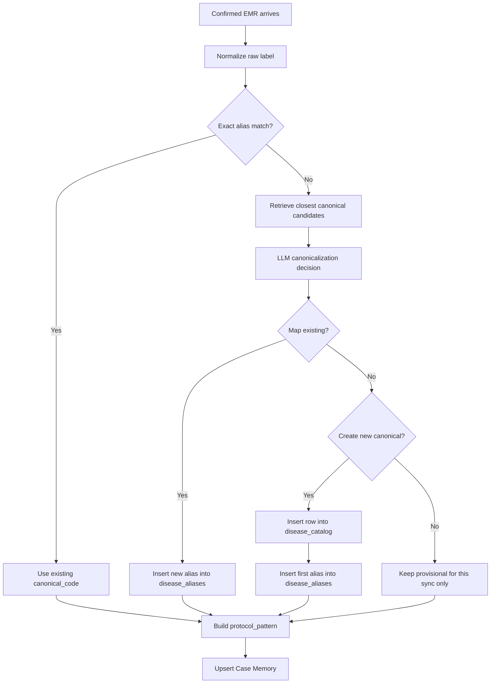

# Autonomous Canonicalization

> Last Updated: 2026-04-02
> Status: Implemented design reference for autonomous canonicalization
> Scope: `petties-agent-serivce` disease normalization in staff AI diagnosis and confirmed EMR to Case Memory sync

---

## 1. Goal

Design a fully autonomous disease normalization pipeline for `ai-diagnose` where:

- the system automatically maps raw disease labels to an existing canonical disease when confidence is high
- the system can automatically create a new canonical disease when a truly new disease label appears
- admins do not need to manually add aliases or canonical codes during normal operation
- no new PostgreSQL tables are introduced

The intended operator experience is:

- doctor saves EMR
- Spring Boot pushes the confirmed EMR to AI service
- the system resolves disease identity automatically
- Case Memory is updated automatically
- admin only monitors Case Memory results and overall system behavior

---

## 2. Constraints

### 2.1 Hard constraints

- No new PostgreSQL tables
- No manual alias maintenance in the normal workflow
- No manual canonical review queue in the normal workflow
- Must preserve internal-only diagnosis trust boundary
- Must keep doctor final authority over EMR and prescriptions

### 2.2 Tables that remain active

| Table | Planned role |
|---|---|
| `disease_catalog` | Active canonical disease registry |
| `disease_aliases` | Active learned alias registry |

## 3. Why change the current approach

The previous runtime depended on a human-oriented fallback path:

- if a label does not match an existing alias, it can remain `provisional`
- long-term normalization quality still assumes later human intervention

This was not aligned with the desired operating model where the system should keep learning automatically from confirmed EMRs without daily admin involvement.

---

## 4. Proposed end-to-end flow



---

## 5. Autonomous decision pipeline

### 5.1 Step 1 - Exact alias lookup

The service first tries normal alias resolution from `disease_aliases`.

If matched:

- reuse the canonical disease directly
- do not call the LLM

### 5.2 Step 2 - Candidate retrieval

If no exact alias exists, the system gathers candidate canonicals from current internal knowledge:

- existing `disease_catalog` entries
- alias similarity from `disease_aliases`
- similar confirmed EMR cases in Case Memory
- KB/KG disease names if available in the diagnosis context

### 5.3 Step 3 - LLM canonicalization

The system calls an internal LLM resolver with structured output.

Expected JSON response:

```json
{
  "action": "map_existing",
  "canonical_code": "bacterial_dermatosis",
  "display_name_vi": "Viêm da do vi khuẩn",
  "alias_text": "pyoderma nông",
  "confidence": 0.94
}
```

Allowed actions:

- `map_existing`
- `create_new`
- `keep_provisional`

### 5.4 Step 4 - Automatic persistence

If the LLM returns `map_existing` with sufficient confidence:

- keep the chosen `canonical_code`
- insert the new alias into `disease_aliases`

If the LLM returns `create_new` with sufficient confidence:

- create a new row in `disease_catalog`
- create the first alias row in `disease_aliases`

If confidence is insufficient:

- keep `mapping_status = provisional`
- continue the sync safely without blocking Case Memory ingestion

---

## 6. Confidence policy

Recommended thresholds:

| Decision | Recommended threshold |
|---|---|
| `map_existing` | `>= 0.90` |
| `create_new` | `>= 0.94` |
| `keep_provisional` | `< threshold` or conflict detected |

Additional safeguards before `create_new`:

- no close duplicate canonical among current catalog entries
- normalized alias is not already present in `disease_aliases`
- the generated canonical code is deterministic and slug-safe

---

## 7. Canonical code generation rule

When the system creates a new canonical disease, it should generate:

- stable snake_case English identifier
- species-agnostic when possible
- diagnosis-group oriented rather than overfitted to one wording

Examples:

| Raw label | Good canonical_code | Bad canonical_code |
|---|---|---|
| `Viêm da mủ nông` | `superficial_pyoderma` | `benh_da_moi_1` |
| `Nấm da vùng tai` | `dermatophytosis` | `nam_da_vung_tai_cho` |

---

## 8. Planned role of `DiseaseMappingService`

Planned responsibilities:

- refresh canonical catalog + alias snapshot from PostgreSQL
- resolve exact alias matches
- retrieve best canonical candidates for LLM resolution
- automatically persist new aliases into `disease_aliases`
- automatically persist new canonical rows into `disease_catalog`
- keep `provisional` as a safe fallback, not as a manual queue trigger

Planned non-responsibilities:

- no manual review queue dependency in normal runtime
- no requirement for an admin CRUD screen to maintain aliases day by day

---

## 9. Database impact

### 9.1 New tables

None.

### 9.2 Existing tables reused

- `disease_catalog`
- `disease_aliases`

This means the implementation should prefer service-layer refactor over schema expansion.

---

## 10. Runtime behavior after implementation

After this change:

- doctors still work the same way in EMR
- admins do not manually create aliases during normal operation
- Case Memory keeps receiving mapped canonical diseases more consistently
- fewer cases remain `provisional`
- protocol learning becomes stronger because similar cases are grouped under stable canonical codes faster

---

## 11. Risks and mitigations

| Risk | Explanation | Mitigation |
|---|---|---|
| Wrong automatic alias insertion | LLM may map a new label to the wrong canonical disease | High confidence threshold + candidate retrieval + deterministic fallback to `provisional` |
| Duplicate canonical creation | Similar disease names may generate two canonicals | duplicate-similarity check before create |
| Overfitted canonical names | LLM may create overly specific disease codes | strict canonical code generation rules |
| Silent taxonomy drift | catalog grows without structure | periodic analytics report from existing catalog, not manual day-to-day review |

---

## 12. Final design decisions

1. `create_new` is allowed only with a stricter confidence threshold than `map_existing`.
2. Provisional cases may still remain searchable in Case Memory when mapping confidence is not sufficient.
3. The first active autonomous path is confirmed EMR sync; other sources may adopt the same resolver later.

---

## 13. Implementation notes

Current implementation follows this sequence:

1. Exact alias match first.
2. LLM-based `map_existing` or `create_new` only when no exact alias exists.
3. Auto-persist learned aliases into `disease_aliases`.
4. Keep `create_new` behind stricter confidence rules.
5. Remove legacy manual-review persistence from both runtime logic and active schema documentation.
