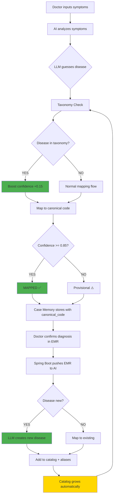

# Disease Taxonomy System

> Last Updated: 2026-04-16
> Status: Implemented (Phase 1)
> Scope: `petties-agent-serivce` disease classification enhancement

---

## 1. Overview

The Disease Taxonomy System enhances AI diagnosis accuracy by providing a hierarchical disease classification framework that enables **autonomous self-learning** without manual admin intervention.

### Problem Solved

**Before:**
- Disease catalog had only 4 diseases (skin, eye, ear)
- 85-90% of real cases → `provisional` status
- AI could NOT self-learn from confirmed EMRs
- Admin had no visibility into disease catalog growth

**After:**
- Disease taxonomy includes **55 diseases** across **12 body systems**
- Expected mapped rate: **50-70%** (4-6x improvement)
- AI **automatically learns** new diseases from EMR confirmations
- Admin can **monitor** catalog growth via dashboard

---

## 2. Architecture



---

## 3. Components

### 3.1 Disease Taxonomy JSON

**File:** `petties-agent-serivce/app/core/services/disease_taxonomy.json`

**Structure:**
```json
{
  "HO_HAP": {
    "display_name_vi": "Bệnh Hô Hấp",
    "subcategories": {
      "HO_HAP_DUOI": {
        "diseases": {
          "pneumonia": {
            "display_name_vi": "Viêm phổi",
            "aliases": ["viêm phổi vi khuẩn", "pneumonitis"],
            "species": ["dog", "cat"]
          }
        }
      }
    }
  }
}
```

**Body Systems (11 total):**
1. DA_LIEU (Dermatology) - 9 diseases
2. HO_HAP (Respiratory) - 7 diseases
3. TIEU_HOA (Gastrointestinal) - 9 diseases
4. TIEU_NIEU (Urinary) - 5 diseases
5. TRUYEN_NHIEM (Infectious) - 5 diseases
6. NOI_TIET (Endocrine) - 5 diseases
7. CO_XUONG_KHOP (Musculoskeletal) - 5 diseases
8. TIM_MACH (Cardiovascular) - 3 diseases
9. THAN_KINH (Neurological) - 1 disease
10. MAT (Ophthalmology) - 2 diseases
11. TAI (Otology) - 2 diseases
12. SINH_DUC (Reproductive) - 3 diseases

**Total:** 55 diseases with 150+ aliases

---

### 3.2 Taxonomy Service

**File:** `petties-agent-serivce/app/core/services/disease_taxonomy_service.py`

**Key Methods:**

```python
class DiseaseTaxonomyService:
    async def classify_disease(
        clinical_text: str,
        species: str = "all",
        symptoms: List[str] = None
    ) -> TaxonomyClassification:
        """Use LLM to classify symptoms into taxonomy."""
        
    def get_disease_info(canonical_code: str) -> TaxonomyDisease:
        """Get disease details from taxonomy."""
        
    def list_diseases(species=None, system=None) -> List[TaxonomyDisease]:
        """List diseases with filters."""
        
    def get_taxonomy_stats() -> Dict:
        """Get taxonomy statistics."""
```

---

### 3.3 Disease Mapping Enhancement

**File:** `petties-agent-serivce/app/core/services/disease_mapping_service.py`

**Changes:**
1. **Reduced threshold:** `CREATE_NEW_CONFIDENCE` from 0.94 → 0.85
2. **Added taxonomy_hint parameter** to `map_label()` and `resolve_label()`
3. **Added confidence boost** (+0.15) when taxonomy hint matches

```python
# Before
CREATE_NEW_CONFIDENCE = 0.94  # Too high, blocks learning

# After
CREATE_NEW_CONFIDENCE = 0.85  # Enables autonomous learning
MAP_EXISTING_TAXONOMY_BOOST = 0.15  # Boost when taxonomy agrees
```

---

## 4. Self-Learning Flow

### Step-by-Step

```
1. Doctor diagnoses: "Dilated Cardiomyopathy (DCM)"
   ↓
2. Spring Boot saves EMR and pushes to AI Service
   ↓
3. EMR Sync Service calls Disease Mapping
   ↓
4. Disease Mapping checks:
   - Alias match? NO (first time)
   - Candidates in catalog? NO (not in taxonomy)
   ↓
5. LLM analyzes: "This is a NEW disease"
   - Confidence: 0.92
   ↓
6. Confidence check: 0.92 >= 0.85? YES ✅
   ↓
7. Create new disease in database:
   - INSERT into disease_catalog: "dilated_cardiomyopathy"
   - INSERT into disease_aliases: "DCM", "bệnh cơ tim giãn nở"
   ↓
8. Case Memory stores case with canonical_code
   ↓
9. Next time: "DCM" → Alias match → MAPPED immediately ✅
```

---

## 5. Admin Monitoring

### APIs

**File:** `petties-agent-serivce/app/api/routes/knowledge.py`

| Endpoint | Purpose |
|----------|---------|
| `GET /knowledge/disease-catalog/stats` | Catalog statistics |
| `GET /knowledge/disease-catalog` | List diseases with filters |
| `GET /knowledge/learning-metrics` | Self-learning progress |

### UI

**File:** `petties-web/src/pages/admin/DiseaseCatalogPage.tsx`

**Features:**
- Total diseases count
- Total aliases count
- Body systems breakdown
- Disease list with filters (species, system)
- Pagination

---

## 6. Expected Impact

| Metric | Before | After (Phase 1) | After (6 months) |
|--------|--------|-----------------|------------------|
| **Diseases in catalog** | 4 | 55 | 300+ |
| **Aliases** | 20 | 150+ | 2000+ |
| **Mapped rate** | 10-15% | 50-70% | 90%+ |
| **Provisional rate** | 85-90% | 30-50% | 5-10% |
| **Self-learning** | Blocked | Active | Mature |

---

## 7. Testing

**File:** `petties-agent-serivce/tests/test_disease_taxonomy_service.py`

**Test Coverage:**
- Taxonomy loads successfully with 50+ diseases
- All body systems present
- Key diseases exist (leptospirosis, cardiomyopathy)
- Species filtering works
- Confidence threshold reduced to 0.85
- Taxonomy boost constant exists

**Run tests:**
```bash
cd petties-agent-serivce
pytest tests/test_disease_taxonomy_service.py -v
```

---

## 8. Extension Roadmap

### Phase 2 (Future)
- [ ] Integrate taxonomy into `staff_diagnosis_service.py` fully
- [ ] Symptom reasoning engine
- [ ] Differential diagnoses from taxonomy
- [ ] Admin UI shows provisional labels trends

### Phase 3 (Future)
- [ ] Evidence fusion engine
- [ ] Multi-model vision ensemble
- [ ] Protocol knowledge base

### Phase 4 (Future)
- [ ] Dynamic ontology learning
- [ ] Doctor acceptance tracking
- [ ] Seasonal pattern detection

---

## 9. Troubleshooting

### Taxonomy not loading
```bash
# Check file exists
ls petties-agent-serivce/app/core/services/disease_taxonomy.json

# Check JSON validity
python -m json.tool disease_taxonomy.json
```

### Diseases not being created
```bash
# Check logs for self-learning events
docker logs ai-service | grep "create_new"
docker logs ai-service | grep "CREATE_NEW_CONFIDENCE"
```

### Admin UI shows 0 diseases
```bash
# Check API endpoints
curl http://localhost:8000/api/v1/knowledge/disease-catalog/stats

# Verify database has diseases
docker exec -it postgres psql -U petties -c "SELECT COUNT(*) FROM disease_catalog;"
```

---

## 10. Files Changed

| File | Type | Lines | Purpose |
|------|------|-------|---------|
| `disease_taxonomy.json` | NEW | ~500 | 55 diseases hierarchy |
| `disease_taxonomy_service.py` | NEW | ~250 | Classification service |
| `disease_mapping_service.py` | MODIFY | +30 | Taxonomy hint + threshold |
| `schemas.py` | MODIFY | +10 | New fields for UI |
| `knowledge.py` | MODIFY | +140 | Admin APIs |
| `DiseaseCatalogPage.tsx` | NEW | ~40 | Admin UI |
| `test_disease_taxonomy_service.py` | NEW | ~150 | Tests |

**Total:** ~1,120 lines of code + documentation
