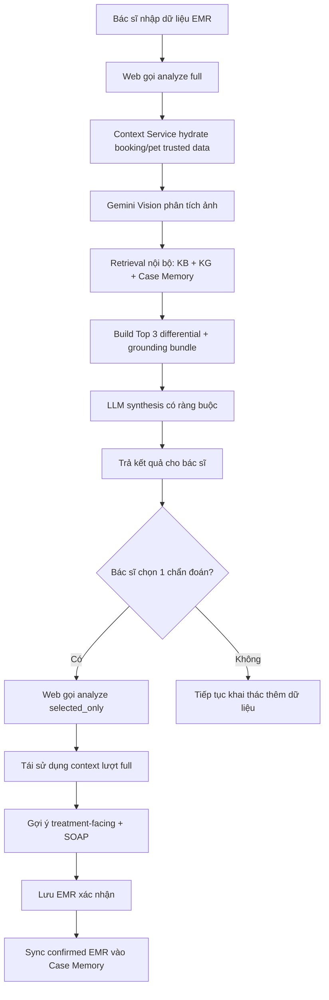

# Sách hướng dẫn sử dụng AI Diagnose (STAFF/ADMIN)

Version: 1.0.0  
Last Updated: 2026-04-03  
Scope: Hướng dẫn vận hành thực tế AI Diagnose trong luồng EMR tại Petties

---

## 1. Mục tiêu tài liệu

Tài liệu này giúp đội vận hành, bác sĩ, QA và kỹ thuật sử dụng đúng AI Diagnose trong quá trình khám chữa bệnh:

- Hiểu đúng luồng `describe_only`, `full`, `selected_only`
- Đọc đúng kết quả Top 3 chẩn đoán phân biệt
- Biết khi nào được mở gợi ý điều trị/đơn thuốc
- Xử lý các tình huống thường gặp khi AI trả kết quả chưa như kỳ vọng
- Đảm bảo an toàn lâm sàng và truy vết đầy đủ

---

## 2. Vai trò và phạm vi

| Vai trò | Nền tảng | Quyền dùng AI Diagnose |
|---|---|---|
| STAFF | Web và Mobile | Có, trong phạm vi hồ sơ bệnh án được phép |
| ADMIN | Web | Có, chủ yếu để kiểm thử/giám sát |
| PET_OWNER | Mobile | Không dùng AI Diagnose EMR |
| CLINIC_MANAGER/OWNER | Web | Không dùng luồng AI Diagnose EMR mặc định |

---

## 3. Tổng quan kiến trúc runtime

**Bản chất của AI Diagnose:** Đây là một trợ lý chẩn đoán thích ứng (adaptive), minh bạch (transparent), và dựa trên bằng chứng (evidence-based), học hỏi liên tục từ các hồ sơ bệnh án (EMR) đã được xác nhận. Hệ thống KHÔNG phải là một hệ thống event-sourcing lưu trữ vĩnh viễn mọi bước tương tác trung gian của bác sĩ. Nó chỉ lưu trữ kết quả cuối cùng (lightweight context) vào EMR để audit và phục vụ học máy.

Tham chiếu kỹ thuật chi tiết:

- `docs-references/ai_diagnose_service/01_RUNTIME_FLOW.md`
- `docs-references/ai_diagnose_service/02_API_CONTRACTS.md`

---

## 4. Các chế độ phân tích

### 4.1 `describe_only`

Mục đích:

- Chỉ đọc ảnh lâm sàng nhanh
- Trả `vision_findings`, `image_descriptions`, `image_analysis`
- Không chạy tổng hợp chẩn đoán đầy đủ

Dùng khi:

- Bác sĩ muốn kiểm tra AI mô tả ảnh trước khi phân tích bệnh

### 4.2 `full`

Mục đích:

- Phân tích đầy đủ ca bệnh
- Trả Top 3 chẩn đoán phân biệt
- Trả gợi ý câu hỏi bổ sung và draft SOAP

Lưu ý quan trọng:

- Nếu có ảnh lâm sàng, `full` luôn chạy Vision
- Kết quả phải có tập so sánh Top 3 (hoặc được backfill từ nguồn grounded)

### 4.3 `selected_only`

Mục đích:

- Chỉ chạy sau khi bác sĩ chọn 1 chẩn đoán từ Top 3
- Tái sử dụng context của lượt `full` qua `previous_request_id`
- Mở rộng gợi ý treatment-facing theo chẩn đoán đã chọn

Lưu ý:

- Nếu cache miss (hết thời gian tồn tại in-memory khoảng 20 phút), service sẽ bỏ qua `selected_only` và fallback an toàn.
- Cache `selected_only` là một công cụ tối ưu luồng thao tác tạm thời, KHÔNG phải là trạng thái workflow được lưu trữ bền vững vào database.

---

## 5. Quy trình thao tác chuẩn cho bác sĩ

### Bước 1: Chuẩn bị dữ liệu đầu vào

Nên có tối thiểu:

- Mô tả lâm sàng rõ trong `doctor_description`
- Triệu chứng có cấu trúc trong `symptoms[]`
- Ảnh rõ nét, đúng vùng tổn thương trong `image_urls[]`
- SOAP draft ban đầu (nếu đã có)

### Bước 2: Chạy phân tích `full`

Bấm nút AI chẩn đoán trên panel EMR.

Kỳ vọng kết quả:

- `top_differentials[]` để so sánh
- `vision_findings[]`, `image_descriptions[]`
- `supporting_evidence_from_kb[]`, `similar_confirmed_cases[]`
- `suggested_questions[]`, `soap_suggestions`

### Bước 3: So sánh Top 3

Đọc theo thứ tự:

1. `display_name_vi`, `rank`, `score_percent`
2. `confidence_note`
3. `supporting_reasons`

Nguyên tắc:

- Không chốt bệnh chỉ dựa vào score
- Luôn đối chiếu biểu hiện thực tế và thăm khám

### Bước 4: Chọn 1 chẩn đoán

Khi đã chọn, hệ thống gọi `selected_only` để tổng hợp sâu phần điều trị theo chẩn đoán đó.

### Bước 5: Rà soát SOAP và đơn thuốc

- Xác nhận lại Subjective/Objective/Assessment/Plan
- Kiểm tra cảnh báo thiếu dữ liệu (cân nặng, dị ứng)
- Chỉ sử dụng đơn thuốc khi bác sĩ đã đối chiếu đầy đủ

### Bước 6: Lưu EMR

Sau khi lưu confirmed EMR:

- Dữ liệu được sync sang Case Memory để làm nguồn học cho ca sau

---

## 6. Giải thích các khối kết quả trên giao diện

### 6.1 `Kết quả AI đã sẵn sàng`

- Tóm tắt số chẩn đoán phân biệt
- Trạng thái gợi ý đơn thuốc phụ thuộc việc đã chọn chẩn đoán hay chưa

### 6.2 `Chẩn đoán phân biệt`

- Hiển thị Top 3 để bác sĩ so sánh
- Có thể có nhãn tạm nếu chưa map canonical hoàn toàn

### 6.3 `Dấu hiệu từ ảnh`

- Nếu có ảnh nhưng AI chưa ghi nhận dấu hiệu nổi bật: hiển thị message hướng dẫn đối chiếu thêm
- Nếu chưa có ảnh: hiển thị message nhắc bổ sung ảnh

### 6.4 `Cần hỏi thêm`

- Danh sách câu hỏi AI đề xuất để khai thác bệnh sử

### 6.5 `SOAP gợi ý`

- Là bản nháp tham khảo
- Bác sĩ quyết định nội dung cuối cùng trước khi lưu hồ sơ

---

## 7. Contract API quan trọng

Endpoint chính:

- `POST /api/v1/staff-diagnosis/analyze`

Các field đầu vào cốt lõi:

- `synthesis_mode`
- `previous_request_id` (bắt buộc cho `selected_only`)
- `selected_diagnosis_code`, `selected_diagnosis_label` (bắt buộc cho `selected_only`)
- `image_urls` (hỗ trợ `https://` và `data:image/...;base64,...`)

Các field đầu ra cốt lõi:

- `top_differentials[]`
- `vision_findings[]`, `image_descriptions[]`, `image_analysis[]`
- `suggested_questions[]`
- `soap_suggestions`
- `prescription_suggestions`

Xem mẫu request/response đầy đủ:

- `docs-references/ai_diagnose_service/02_API_CONTRACTS.md`

---

## 8. Cơ chế bằng chứng và ưu tiên dữ liệu

AI Diagnose ưu tiên:

1. Dữ liệu trusted context từ backend
2. Vision findings từ ảnh lâm sàng
3. Bằng chứng nội bộ từ KB/KG
4. Ca xác nhận tương tự từ Case Memory

Không dùng web search trong luồng chẩn đoán bác sĩ.

---

## 9. Chính sách đơn thuốc

Thứ tự ưu tiên nguồn đơn thuốc:

1. `emr_pattern` học từ ca EMR confirmed cùng chẩn đoán
2. `llm_fallback` khi không có pattern nội bộ phù hợp
3. Danh sách rỗng nếu không đủ điều kiện an toàn

Nguyên tắc:

- Không trộn nguồn `emr_pattern` và `llm_fallback` trong cùng batch kê đơn
- Luôn kiểm tra dị ứng, cân nặng, tình trạng lâm sàng trước khi áp dụng

---

## 10. Logging và audit cần theo dõi

Log trọng yếu:

- `LLM synthesis parsed: top_differentials=...`
- `Vision analyze: ... images for request ...`
- `selected_only mode skipped: cache miss ...`

Thông tin cần lưu để audit (Lightweight Persistence):

- `request_id`, `previous_request_id`
- `selected_diagnosis_code`, `selected_diagnosis_label`
- `source`, `source_detail` của mỗi prescription
- `ai_diagnosis_context` lưu cùng EMR

*Lưu ý quan trọng:* Hệ thống chỉ lưu một `ai_diagnosis_context` siêu nhẹ vào EMR chứa các quyết định cuối cùng, KHÔNG lưu trữ toàn bộ các bước suy luận trung gian (reasoning log) hay mọi thao tác click của bác sĩ. Đây là một trợ lý chẩn đoán, không phải là một hệ thống log sự kiện y tế trung gian vĩnh viễn (event-sourcing).

---

## 11. Troubleshooting thực chiến

| Hiện tượng | Nguyên nhân thường gặp | Cách xử lý |
|---|---|---|
| Top 3 chưa sát thực tế | Mô tả lâm sàng còn thiếu hoặc nhiễu | Viết lại `doctor_description` rõ timeline, vị trí, mức độ |
| Có ảnh nhưng findings nghèo | Ảnh mờ, thiếu sáng, góc chụp kém | Chụp lại gần vùng tổn thương, đủ sáng, nhiều góc |
| selected_only không ra kết quả như mong muốn | `previous_request_id` không hợp lệ hoặc hết hạn cache | Chạy lại `full`, chọn lại chẩn đoán và thử lại |
| Không mở đơn thuốc | Chưa chọn chẩn đoán hoặc thiếu dữ liệu an toàn | Chọn 1 chẩn đoán trong Top 3, bổ sung cân nặng/dị ứng |
| Chỉ thấy nhãn tạm | Mapping canonical chưa đủ mạnh | Đối chiếu bằng chứng nội bộ và khám lâm sàng trước khi chốt |

---

## 12. Checklist QA/UAT cho AI Diagnose

### 12.1 Smoke checklist

- `describe_only` trả đúng mô tả ảnh
- `full` trả bộ Top 3 để so sánh
- Chọn chẩn đoán thì gọi được `selected_only`
- `selected_only` có thể tái sử dụng context từ `full`
- Kết quả có disclaimer đúng

### 12.2 Regression checklist

- Không tạo diagnosis ngoài tập grounded
- Không mở đơn thuốc trước khi chọn chẩn đoán
- Hành vi cache miss an toàn
- Dữ liệu trả về đúng schema contract

---

## 13. FAQ & Câu hỏi phản biện từ Hội đồng (Business/Clinical Defense)

### Q1: Vì sao phải chạy 2 lượt `full` và `selected_only`?
`full` để so sánh nhiều hướng bệnh. `selected_only` để khóa ngữ cảnh điều trị theo chẩn đoán đã chọn, giảm rủi ro kê đơn sớm.

### Q2: Vì sao có lúc score cao nhưng vẫn cần hỏi thêm?
Score chỉ là mức độ khớp bằng chứng hiện có, không thay thế khám lâm sàng và test xác nhận.

### Q3: Có thể bỏ qua ảnh không?
Có thể, nhưng chất lượng Objective và khả năng đối chiếu sẽ giảm nếu ca bệnh phụ thuộc nhiều dấu hiệu hình ảnh.

### Q4: AI Diagnose có thay bác sĩ ra quyết định cuối không?
Không. Bác sĩ là người chịu trách nhiệm chẩn đoán và chỉ định cuối cùng.

### Q5: Phản biện: Tại sao không lưu lại toàn bộ quá trình chat/suy luận trung gian để phòng ngừa kiện cáo y khoa (medical malpractice)?
**Đáp:** Về mặt pháp lý y khoa, văn bản có giá trị cao nhất là **Hồ sơ bệnh án (EMR) đã được bác sĩ ký/xác nhận**. Việc hệ thống chỉ lưu `ai_diagnosis_context` (kết quả tham khảo cuối cùng) đính kèm EMR là hoàn toàn đủ để Audit xem bác sĩ đã chọn gì từ AI. Việc lưu trữ toàn bộ các suy luận trung gian (reasoning logs) của AI vừa làm phình to cơ sở dữ liệu không cần thiết (anti-pattern), vừa không thay đổi sự thật là bác sĩ phải chịu trách nhiệm cho quyết định cuối cùng. AI chỉ đóng vai trò trợ lý (Assistant), không phải là người hành nghề y (Practitioner).

### Q6: Phản biện: Tính năng tự học từ Case Memory rất hay, nhưng nếu bác sĩ chẩn đoán/kê đơn sai (Data Poisoning) thì AI có học cái sai đó và gợi ý cho ca sau không?
**Đáp:** Hệ thống có 3 lớp bảo vệ để chống lại rủi ro này:
1. AI chỉ học từ các EMR có trạng thái `Confirmed` (đã được chốt bởi bác sĩ có thẩm quyền).
2. Khi gợi ý, AI luôn đối chiếu (grounding) song song với Knowledge Base (Cẩm nang y khoa chuẩn) chứ không chỉ dựa 100% vào Case Memory.
3. Trong tương lai (Roadmap), tính năng Admin/Chief Medical Officer có thể Review và loại bỏ các ca bệnh (Case) không đạt chuẩn khỏi Qdrant vector database để "thanh lọc" trí nhớ của AI.

### Q7: Phản biện: Cache `selected_only` giới hạn trong 20 phút có quá ngắn không? Nếu bác sĩ đang làm dở, phải đi cấp cứu ca khác rồi quay lại thì sao?
**Đáp:** Con số ~20 phút được thiết kế tối ưu cho một session (phiên làm việc) liên tục trên bộ nhớ RAM, giúp hệ thống không bị quá tải (stateless optimization). Nếu bác sĩ rời đi quá lâu (cache miss), họ không hề bị mất dữ liệu EMR đang nhập dở. Họ chỉ cần nhấn nút phân tích `full` lại 1 lần (mất vài giây) để tái tạo context mới nhất. Điều này an toàn hơn việc lưu trữ một trạng thái AI cũ kỹ có thể không còn khớp với các triệu chứng bác sĩ vừa cập nhật thêm sau khi đi cấp cứu về.

---

## 14. Tài liệu liên quan

- `docs-references/ai_diagnose_service/01_RUNTIME_FLOW.md`
- `docs-references/ai_diagnose_service/02_API_CONTRACTS.md`
- `docs-references/ai_diagnose_service/03_COMPONENTS.md`
- `docs-references/ai_diagnose_service/05_E2E_TEST_SCENARIOS.md`
- `docs-references/documentation/SRS/PETTIES_SRS.md`
- `docs-references/documentation/SDD/PETTIES_SDD.md`

---

## 15. Lịch sử cập nhật

| Date | Version | Changes |
|---|---|---|
| 2026-04-03 | 1.0.0 | Tạo mới handbook AI Diagnose tiếng Việt có dấu |
