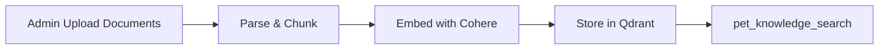
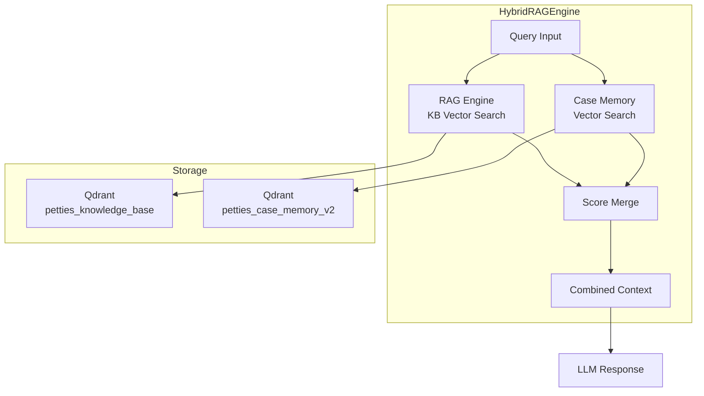
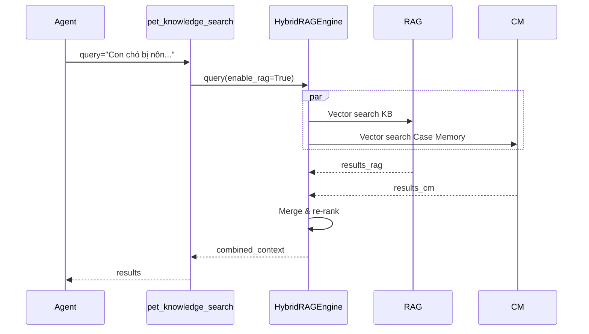
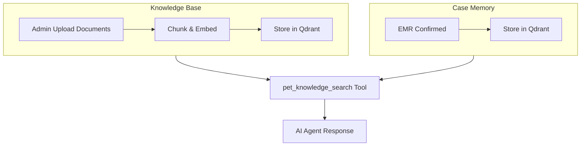

# Petties RAG Engine Technical Specification

**Phiên bản:** 1.2  
**Cập nhật:** 2026-04-02  
**Tham chiếu:** `AI_SERVICE_TECHNICAL_SPECIFICATION.md`

---

## 1. Tổng quan

RAG Engine (Retrieval-Augmented Generation) là hệ thống tìm kiếm thông tin nội bộ của Petties, cung cấp context đáng tin cậy cho AI Agent trả lời câu hỏi về thú y.

### 1.1 Mục tiêu

- Cung cấp thông tin thú y nội bộ cho AI Agent
- Tích hợp case đã xác nhận từ EMR vào luồng tư vấn
- Đảm bảo câu trả lời được grounding từ dữ liệu đáng tin cậy

### 1.2 Components

| Component | Storage | Purpose |
|----------|---------|---------|
| **Knowledge Base (KB)** | Qdrant Cloud | Document chunks với vector embeddings |
| **Case Memory** | Qdrant Cloud | EMR confirmed cases với text + image embeddings |

---

## 2. Knowledge Base (KB)

### 2.1 Mô tả

Knowledge Base là tập hợp các tài liệu thú y nội bộ, được chunk và embed thành vectors để tìm kiếm theo semantic similarity.

### 2.2 Storage

- **Database:** Qdrant Cloud
- **Collection:** `petties_knowledge_base`
- **Vector Model:** Cohere embed-multilingual-v3 (1024 dimensions)
- **Indexing:** HNSW algorithm

### 2.3 Data Flow



### 2.4 API Endpoints

| Endpoint | Method | Auth | Purpose |
|----------|--------|------|---------|
| `/knowledge/upload` | POST | Admin | Upload tài liệu lên KB |
| `/knowledge/build-kb` | POST | Admin | Index documents vào Qdrant |
| `/knowledge/kb-stats` | GET | Public | Thống kê KB |
| `/knowledge/documents` | GET | Public | List uploaded documents |

### 2.5 Use Cases

- Tra cứu thông tin bệnh, triệu chứng, điều trị
- Tìm kiếm theo ngữ nghĩa (semantic search)
- Fallback khi KB không có kết quả

---

## 4. Case Memory

### 4.1 Mô tả

Case Memory lưu trữ các ca bệnh đã được xác nhận từ EMR, sử dụng cho staff diagnosis và reference.

### 4.2 Storage

- **Database:** Qdrant Cloud
- **Collection:** `petties_case_memory_v2`
- **Vectors:** 2 named vectors
  - `text`: Cohere embed-multilingual-v3 (1024 dimensions)
  - `image`: Jina CLIP v2 (1024 dimensions, optional)

### 4.3 Payload Schema

```json
{
  "case_id": "string",
  "text_content": "string",
  "species": "dog | cat | other",
  "chief_complaint": "string",
  "clinical_notes": "string|null",
  "display_name_vi": "string|null",
  "final_diagnosis_text": "string",
  "canonical_code": "string|null",
  "mapping_status": "mapped | provisional",
  "exam_at": "datetime|null",
  "protocol_pattern": {
    "soap_template": {"assessment": "string|null"},
    "common_prescriptions": [],
    "common_tests": [],
    "common_recommendations": []
  }
}
```

The active design is a runtime-only Case Memory schema. Fields that are not consumed by retrieval, ranking, or grounded synthesis should not remain in the active payload contract.

### 4.4 Data Source

- **Primary:** EMR confirmed (final_diagnosis từ VET/STAFF)
- **Deprecated:** Thumbs up feedback (đã loại bỏ theo consolidated ai_diagnose_service/ docs)

### 4.5 Re-ranking Formula

```
case_memory_final_score = cosine_similarity

Disease support metrics are computed downstream by the staff diagnosis
service after retrieval, where confirmed cases are grouped by
`canonical_code` and `species` to build protocol support counts.
```

---

## 5. HybridRAGEngine

### 5.1 Mô tả

HybridRAGEngine là engine tổng hợp kết quả từ KB và Case Memory, merge thành context duy nhất cho LLM.

### 5.2 Architecture



### 5.3 Weight Configuration

| Source | Weight | Notes |
|--------|--------|-------|
| RAG (KB) | 1.0 | Base weight |
| Case Memory | 1.2 | Higher due to verified clinical data |

### 5.4 Merge Strategy

```python
# Pseudocode
results = []
results.extend(rag_results * RAG_WEIGHT)
results.extend(case_memory_results * CASE_MEMORY_WEIGHT)
results.sort_by_score(descending=True)
results.deduplicate_by_content()
return top_k(results)
```

---

## 6. Integration với AI Agent

### 6.1 pet_knowledge_search Tool

Tool chính để truy vấn RAG engine:

```python
@mcp_server.tool
async def pet_knowledge_search(
    query: str,
    pet_type: Optional[str] = None,  # Chó | Mèo
    top_k: int = 5,
    min_score: float = 0.4
) -> dict:
    """
    Truy vấn hybrid RAG: KB + Case Memory
    
    Returns:
        dict với keys:
        - answer: Câu trả lời từ LLM
        - sources: Danh sách sources đã sử dụng
        - context: Combined context đã dùng
    """
```

### 6.2 Query Flow



### 6.3 Role-based Behavior

| Role | RAG | Case Memory | Web Search |
|------|-----|-------------|------------|
| PET_OWNER | ✅ | ✅ (if has pets) | ✅ fallback |
| STAFF/VET | ✅ | ✅ | ❌ |
| CLINIC_MANAGER | ✅ | ❌ | ❌ |
| ADMIN | ✅ | ❌ | ✅ |

---

## 7. Implementation Files

### 7.1 Core Files

```
petties-agent-serivce/
├── app/
│   ├── core/
│   │   ├── rag/
│   │   │   ├── __init__.py
│   │   │   ├── rag_engine.py              # KB vector search
│   │   │   ├── case_memory.py             # Case memory (Qdrant)
│   │   │   └── hybrid_engine.py           # Hybrid merge logic
│   │   ├── database/
│   │   └── tools/
│   │       └── mcp_tools/
│   │           └── medical_tools.py       # pet_knowledge_search tool
│   ├── api/
│   │   └── routes/
│   │       └── knowledge.py               # KB endpoints
│   └── config/
│       └── settings.py
```

---

## 8. Data Flow



---

## 9. Roadmap

### 9.1 Phase 1: Case Memory Sync

- [ ] Auto-sync trigger on EMR confirmation
- [ ] Implement incremental sync (chỉ sync new cases)

### 9.2 Phase 2: Production Scale

- [ ] Implement caching layer
- [ ] Monitoring & alerting

---

## 10. Best Practices

### 10.1 Query Optimization

- Use top_k limits để control response size
- Deduplicate results before merging

---

## 11. Error Handling

### 11.1 Hybrid Engine Errors

| Error | Handling |
|-------|----------|
| KB unavailable | Query CM only |
| CM unavailable | Query KB only |
| All unavailable | Return error to user |

---

## 12. Monitoring

### 12.1 Metrics

- Case Memory sync count
- Hybrid merge success rate

### 12.2 Logging

```python
logger.info(f"Synced {count} cases from Case Memory")
logger.warning(f"Hybrid query failed: {e}")
```

---

## 13. Security

### 13.1 Access Control

| Endpoint | Auth | Purpose |
|----------|------|---------|
| `/knowledge/upload` | Admin | Upload tài liệu lên KB |
| `/knowledge/build-kb` | Admin | Index documents vào Qdrant |

### 13.2 Data Validation

- Sanitize user input trong query
- Rate limiting trên query endpoints

---

## 14. References

- [AI_SERVICE_TECHNICAL_SPECIFICATION.md](./AI_SERVICE_TECHNICAL_SPECIFICATION.md)
- [ai_diagnose_service/](./ai_diagnose_service/) — AI diagnosis consolidated documentation
- MongoDB Documentation: https://www.mongodb.com/docs/
- Motor (async MongoDB driver): https://motor.readthedocs.io/
