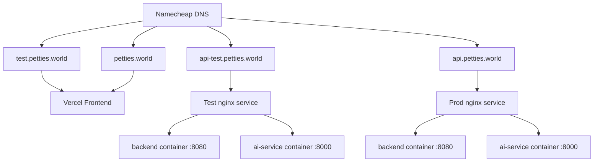

# Petties DNS & EC2 Configuration Guide

**Last Updated:** 2026-04-12  
**Author:** DevOps

---

## 1. Domain Structure Overview

### Single Domain with Path-Based Routing (Recommended)

This approach uses one domain per environment with path-based routing:

| Environment | Domain | Path | Destination |
|-------------|--------|------|-------------|
| **Test** | `test.petties.world` | `/api/*` | EC2 → Backend |
| **Test** | `test.petties.world` | `/ai/*` | EC2 → AI Service |
| **Test** | `test.petties.world` | `/ws/chat/*` | EC2 → AI WS |
| **Test** | `test.petties.world` | `/` | Vercel Frontend |
| **Prod** | `petties.world` | `/api/*` | EC2 → Backend |
| **Prod** | `petties.world` | `/ai/*` | EC2 → AI Service |
| **Prod** | `petties.world` | `/ws/chat/*` | EC2 → AI WS |
| **Prod** | `petties.world` | `/` | Vercel Frontend |

### Alternative: Subdomain Approach (Legacy)

If you need separate subdomains:

| Subdomain | Service | Destination |
|-----------|---------|-------------|
| `api.test.petties.world` | Backend API | EC2 → Backend |
| `ai.test.petties.world` | AI Service | EC2 → AI Service |
| `api.petties.world` | Backend API | EC2 → Backend |
| `ai.petties.world` | AI Service | EC2 → AI Service |

---

## 2. Namecheap DNS Configuration

### Test Environment (Single Domain)

| Type | Host | Value | TTL |
|------|------|-------|-----|
| A Record | `test` | `<TEST_EC2_IP>` | Automatic |
| CNAME | `www.test` | `<TEST_EC2_IP>` | Automatic |

### Production Environment (Single Domain)

| Type | Host | Value | TTL |
|------|------|-------|-----|
| CNAME | `@` | `<VERCEL_CNAME>` | Automatic |
| CNAME | `www` | `<VERCEL_CNAME>` | Automatic |
| A Record | `api` | `<PROD_EC2_IP>` | Automatic |
| A Record | `ai` | `<PROD_EC2_IP>` | Automatic |

---

## 3. EC2 Server Setup

### 3.1 Security Group Configuration

| Type | Port | Source | Purpose |
|------|------|--------|---------|
| HTTP | 80 | 0.0.0.0/0 | Nginx HTTP |
| HTTPS | 443 | 0.0.0.0/0 | Cloudflare/ALB |
| SSH | 22 | Your IP | Admin access |

### 3.2 Install Docker on EC2

```bash
# Update and install dependencies
sudo yum update -y
sudo yum install -y docker

# Start Docker
sudo systemctl start docker
sudo systemctl enable docker

# Install Docker Compose plugin (v2)
sudo apt-get install docker-compose-plugin -y

# Add current user to docker group (optional)
sudo usermod -aG docker $USER

# Restart Docker
sudo systemctl restart docker
```

### 3.3 Deploy Test Environment

```bash
# SSH to Test EC2
ssh -i your-key.pem ubuntu@<TEST_EC2_IP>

# Create project directory
mkdir -p ~/petties && cd ~/petties

# Copy files from local
git clone <your-repo-url> .

# Create .env.test file
cp .env.test.example .env.test
# Edit .env.test with test environment values

# Start services
docker compose -p petties-test -f docker-compose.prod.yml --env-file .env.test up -d

# Check status
docker compose -p petties-test -f docker-compose.prod.yml --env-file .env.test ps

# View logs
docker compose -p petties-test -f docker-compose.prod.yml --env-file .env.test logs -f
```

### 3.4 Deploy Production Environment

```bash
# SSH to Prod EC2
ssh -i your-key.pem ubuntu@<PROD_EC2_IP>

# Create project directory
mkdir -p ~/petties && cd ~/petties

# Copy files
git clone <your-repo-url> .

# Create .env.prod file
cp .env.prod.example .env.prod
# Edit .env.prod with production values

# Start services
docker compose -p petties-prod -f docker-compose.prod.yml --env-file .env.prod up -d

# Check status
docker compose -p petties-prod -f docker-compose.prod.yml --env-file .env.prod ps

# View logs
docker compose -p petties-prod -f docker-compose.prod.yml --env-file .env.prod logs -f
```

---

## 4. Vercel Frontend Configuration

### Test Environment

1. Go to [Vercel Dashboard](https://vercel.com)
2. Import your `petties-web` repo
3. Settings → Environment Variables:
   ```
   VITE_API_BASE_URL=https://test.petties.world/api
   VITE_WS_URL=wss://test.petties.world/ws/chat
   ```
4. Deploy → Domain: `test.petties.world`

### Production Environment

1. Import your `petties-web` repo
2. Settings → Environment Variables:
   ```
   VITE_API_BASE_URL=https://petties.world/api
   VITE_WS_URL=wss://petties.world/ws/chat
   ```
3. Deploy → Domain: `petties.world`

---

## 5. Mobile App Configuration

### Test Environment

Update `peties_mobile/.env`:
```bash
API_BASE_URL=https://test.petties.world/api
AI_WS_URL=wss://test.petties.world/ws/chat
```

### Production Environment

```bash
API_BASE_URL=https://petties.world/api
AI_WS_URL=wss://petties.world/ws/chat
```

---

## 6. Health Checks

After deployment, verify:

| Environment | URL | Expected |
|-------------|-----|----------|
| Test Backend | `https://test.petties.world/api/actuator/health` | `{"status":"UP"}` |
| Test AI | `https://test.petties.world/ai/health` | `{"status":"healthy"}` |
| Test Frontend | `https://test.petties.world` | 200 OK |
| Prod Backend | `https://petties.world/api/actuator/health` | `{"status":"UP"}` |
| Prod AI | `https://petties.world/ai/health` | `{"status":"healthy"}` |
| Prod Frontend | `https://petties.world` | 200 OK |

---

## 7. Troubleshooting

### Nginx not accessible

```bash
# Check nginx status
docker compose -p petties-test -f docker-compose.prod.yml --env-file .env.test ps
docker compose -p petties-test -f docker-compose.prod.yml --env-file .env.test logs nginx

# Test nginx config
docker compose -p petties-test -f docker-compose.prod.yml --env-file .env.test exec nginx nginx -t

# Check port binding
sudo netstat -tlnp | grep :80
```

### Services not accessible from nginx

```bash
# Check Docker network
docker network inspect petties-test_petties-network

# Check service logs
docker compose -p petties-test -f docker-compose.prod.yml --env-file .env.test logs backend
docker compose -p petties-test -f docker-compose.prod.yml --env-file .env.test logs ai-service

# Verify container DNS
docker compose -p petties-test -f docker-compose.prod.yml --env-file .env.test exec nginx ping backend
docker compose -p petties-test -f docker-compose.prod.yml --env-file .env.test exec nginx ping ai-service
```

### DNS not resolving

1. Check Namecheap DNS records
2. Wait for propagation (up to 48 hours, usually 5-30 minutes)
3. Use `dig` or `nslookup` to verify:
   ```bash
   dig test.petties.world
   nslookup petties.world
   ```

---

## 8. Quick Reference Commands

```bash
# === TEST ENVIRONMENT ===

# Deploy/Update Test
docker compose -p petties-test -f docker-compose.prod.yml --env-file .env.test up -d --build

# View Test logs
docker compose -p petties-test -f docker-compose.prod.yml --env-file .env.test logs -f

# Restart Test services
docker compose -p petties-test -f docker-compose.prod.yml --env-file .env.test restart

# Stop Test
docker compose -p petties-test -f docker-compose.prod.yml --env-file .env.test down

# === PRODUCTION ENVIRONMENT ===

# Deploy/Update Prod
docker compose -p petties-prod -f docker-compose.prod.yml --env-file .env.prod up -d --build

# View Prod logs
docker compose -p petties-prod -f docker-compose.prod.yml --env-file .env.prod logs -f

# Restart Prod services
docker compose -p petties-prod -f docker-compose.prod.yml --env-file .env.prod restart

# Stop Prod
docker compose -p petties-prod -f docker-compose.prod.yml --env-file .env.prod down
```

---

## 9. Architecture Diagram

### Current Architecture (Single Domain)



### URL Mapping

| Environment | Service | URL |
|-------------|---------|-----|
| Test | Frontend | `https://test.petties.world` |
| Test | Backend API | `https://test.petties.world/api/*` |
| Test | AI REST | `https://test.petties.world/ai/*` |
| Test | AI WebSocket | `wss://test.petties.world/ws/chat/*` |
| Prod | Frontend | `https://petties.world` |
| Prod | Backend API | `https://petties.world/api/*` |
| Prod | AI REST | `https://petties.world/ai/*` |
| Prod | AI WebSocket | `wss://petties.world/ws/chat/*` |

---

## 10. Important Notes

1. **CORS Configuration**: Update CORS_ORIGINS in `.env.test` and `.env.prod` to match your domains
2. **JWT Secret**: Use different secrets for test and prod
3. **Database**: Test uses separate Neon branch, Prod uses main database
4. **SSL/TLS**: Recommend using Cloudflare or AWS ALB for SSL termination
5. **Backup**: Always backup `.env` files before updates
6. **Path Order**: Nginx processes routes in order - `/api/*` must come before `/` catch-all