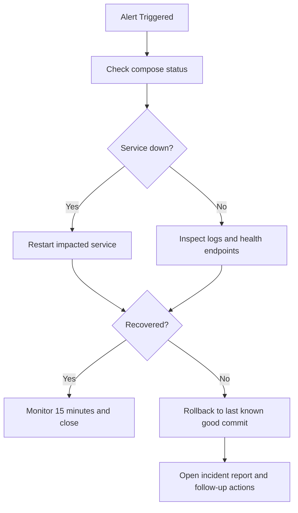

# EC2 Operations Guide (Test and Production)

Last updated: 2026-04-15
Owner: DevOps / Backend Team
Scope: Runtime operations for `docker-compose.prod.yml` on EC2

## 0. Quick Start with Deploy Script

Use `scripts/deploy-prod.sh` for standardized production operations.

First-time setup on EC2:

```bash
cd ~/petties-backend/Petties-Veterinary-Appointment-Booking-Platform
chmod +x scripts/deploy-prod.sh
```

Common commands:

```bash
# Validate compose and env
scripts/deploy-prod.sh validate

# Deploy latest main
scripts/deploy-prod.sh deploy

# Deploy a specific tag/commit
scripts/deploy-prod.sh deploy --ref <tag-or-commit>

# Check runtime status
scripts/deploy-prod.sh status

# Health checks
scripts/deploy-prod.sh health

# Logs (all services)
scripts/deploy-prod.sh logs

# Logs (single service)
scripts/deploy-prod.sh logs --service backend --follow

# Restart one service
scripts/deploy-prod.sh restart --service ai-service

# Rollback to a specific commit
scripts/deploy-prod.sh rollback --ref <commit>

# Rollback to last successful commit recorded by script
scripts/deploy-prod.sh rollback
```

Notes:
- Default env file: `.env.prod`
- Default compose file: `docker-compose.prod.yml`
- Default branch for deploy: `main`
- Script records successful commits at `.deploy/last_successful_commit.txt`

## 1. Purpose

This runbook defines standard operating procedures for Petties EC2 environments:
- `test` environment: `test.petties.world` and `api-test.petties.world` (`develop` branch)
- `prod` environment: `www.petties.world` and `api.petties.world` (`main` branch)

It covers start/stop, deploy, verification, rollback, incident response, and maintenance.

## 2. Environment Matrix

| Environment | Compose Project | Env File | Backend Port | AI Port | Nginx Port |
|---|---|---|---:|---:|---:|
| test | `petties-test` | `.env.test` | 8081 | 8001 | 81 |
| prod | `petties-prod` | `.env.prod` | 8080 | 8000 | 80 |

Core command format:

```bash
docker compose -p <project> -f docker-compose.prod.yml --env-file <env-file> <command>
```

## 3. Pre-Operation Checklist

Before any deployment or restart:
- Confirm branch/environment mapping (`develop -> test`, `main -> prod`).
- Confirm `.env.<env>` has all required variables (no placeholder values in real env).
- Run dry config validation:

```bash
docker compose -p petties-prod -f docker-compose.prod.yml --env-file .env.prod config >/tmp/petties-prod-config.out
docker compose -p petties-test -f docker-compose.prod.yml --env-file .env.test config >/tmp/petties-test-config.out
```

- Ensure DNS still resolves target domains correctly.

## 4. Standard Operations

### 4.1 Start or Update Services

Test:

```bash
docker compose -p petties-test -f docker-compose.prod.yml --env-file .env.test up -d --build
```

Production:

```bash
docker compose -p petties-prod -f docker-compose.prod.yml --env-file .env.prod up -d --build
```

### 4.2 Check Runtime Status

```bash
docker compose -p petties-prod -f docker-compose.prod.yml --env-file .env.prod ps
docker compose -p petties-prod -f docker-compose.prod.yml --env-file .env.prod logs --tail=100 backend
docker compose -p petties-prod -f docker-compose.prod.yml --env-file .env.prod logs --tail=100 ai-service
docker compose -p petties-prod -f docker-compose.prod.yml --env-file .env.prod logs --tail=100 nginx
```

### 4.3 Restart Specific Services

```bash
docker compose -p petties-prod -f docker-compose.prod.yml --env-file .env.prod restart backend
docker compose -p petties-prod -f docker-compose.prod.yml --env-file .env.prod restart ai-service
docker compose -p petties-prod -f docker-compose.prod.yml --env-file .env.prod restart nginx
```

### 4.4 Stop Services

```bash
docker compose -p petties-prod -f docker-compose.prod.yml --env-file .env.prod down
```

## 5. Health Verification

Host-level checks:

```bash
curl -fsS http://127.0.0.1:8080/api/actuator/health
curl -fsS http://127.0.0.1:8000/health
curl -I https://api.petties.world/api/actuator/health
```

Container-level checks:

```bash
docker compose -p petties-prod -f docker-compose.prod.yml --env-file .env.prod exec nginx nginx -t
docker compose -p petties-prod -f docker-compose.prod.yml --env-file .env.prod exec nginx sh -lc 'echo $NGINX_SERVER_NAME $NGINX_FRONTEND_HOST'
```

Expected result:
- All services are `Up` in `docker compose ps`.
- Backend health endpoint returns `UP`.
- AI health endpoint returns 200.
- Nginx config test returns `syntax is ok`.

## 6. Deployment Procedure

Recommended production deploy sequence:

1. Pull latest code and checkout target branch.
2. Backup `.env.prod` and current image tags/log snapshot.
3. Validate compose config with `.env.prod`.
4. Run `up -d --build`.
5. Verify health endpoints and critical APIs.
6. Monitor logs for 10-15 minutes.

Minimal commands:

```bash
git fetch --all --prune
git checkout main
git pull origin main
docker compose -p petties-prod -f docker-compose.prod.yml --env-file .env.prod up -d --build
docker compose -p petties-prod -f docker-compose.prod.yml --env-file .env.prod ps
```

## 7. Rollback Strategy

Rollback triggers:
- Health checks fail after deploy.
- Elevated 5xx rate or login/payment failures.
- Critical dependency connection errors (DB, Redis, Qdrant, OpenRouter).

Fast rollback procedure:

```bash
git checkout <last-known-good-commit>
docker compose -p petties-prod -f docker-compose.prod.yml --env-file .env.prod up -d --build
docker compose -p petties-prod -f docker-compose.prod.yml --env-file .env.prod ps
```

After rollback:
- Confirm health endpoints and key business flows.
- Capture incident notes (time, trigger, root cause hypothesis, next actions).

## 8. Incident Response



Priority order during incident:
1. Restore service availability.
2. Protect user-facing booking/payment flows.
3. Preserve logs and context for RCA.

## 9. Secret and Config Management

- Never commit `.env.prod` or `.env.test` with real secrets.
- Keep `.env.prod.example` and `.env.test.example` aligned with `docker-compose.prod.yml`.
- Rotate secrets on schedule or immediately after any leak suspicion.
- Restrict file permissions on EC2:

```bash
chmod 600 .env.prod .env.test
```

## 10. Routine Maintenance

Daily:
- Check `docker compose ps`.
- Review backend/ai-service error logs.

Weekly:
- Validate health endpoints.
- Review disk usage and docker image growth.

Sprint-end:
- Verify deploy checklist and rollback test.
- Ensure env example files still match compose variables.

## 11. References

- `docker-compose.prod.yml`
- `.env.prod.example`
- `.env.test.example`
- `docs-references/deployment/EC2_PRODUCTION_DEPLOYMENT.md`
- `docs-references/deployment/TEST_ENVIRONMENT_SETUP.md`
