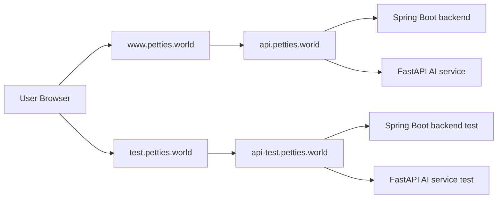

# Petties - Namecheap DNS and Vercel ENV Guide

Last Updated: 2026-04-12

## 1. Scope

Guide nay dung cho mo hinh moi:
- Frontend: https://www.petties.world va https://test.petties.world (Vercel)
- API Gateway: https://api.petties.world va https://api-test.petties.world (EC2)
- Khong dung domain rieng cho AI (`ai`, `ai-test`)

## 2. Architecture Overview



## 3. Namecheap DNS - Target State

Ap dung trong Namecheap -> Advanced DNS.

| Type | Host | Value | TTL | Ghi chu |
|---|---|---|---|---|
| A | @ | 76.76.21.21 | Automatic | Frontend root domain qua Vercel |
| CNAME | www | cname.vercel-dns.com | Automatic | Frontend production |
| CNAME | test | cname.vercel-dns.com | Automatic | Frontend test |
| A | api | 54.169.12.224 | Automatic | API production tren EC2 |
| A | api-test | 54.169.12.224 | Automatic | API test tren EC2 |

### 3.1 Records can remove

Xoa cac record sau neu con ton tai:
- `ai`
- `ai-test`
- `@` tro den IP cu (vi du 216.198.79.1)

## 4. EC2 ENV Mapping (Unified Compose)

Su dung 1 compose file: `docker-compose.prod.yml`

### 4.1 .env.prod

```env
COMPOSE_PROJECT_NAME=petties-prod
NGINX_SERVER_NAME=api.petties.world
NGINX_FRONTEND_UPSTREAM=https://www.petties.world
NGINX_FRONTEND_HOST=www.petties.world
NGINX_HOST_PORT=80
CORS_ORIGINS=https://www.petties.world,https://petties.world
```

### 4.2 .env.test

```env
COMPOSE_PROJECT_NAME=petties-test
NGINX_SERVER_NAME=api-test.petties.world
NGINX_FRONTEND_UPSTREAM=https://test.petties.world
NGINX_FRONTEND_HOST=test.petties.world
NGINX_HOST_PORT=81
CORS_ORIGINS=https://test.petties.world,https://api-test.petties.world
```

## 5. Vercel ENV - Required Variables

Vao Vercel Project -> Settings -> Environment Variables.

### 5.1 Production ENV (for www.petties.world)

```env
VITE_APP_ENV=production
VITE_API_BASE_URL=https://api.petties.world/api
VITE_WS_URL=wss://api.petties.world/ws
VITE_AGENT_SERVICE_URL=https://api.petties.world
VITE_AGENT_API_BASE_URL=https://api.petties.world/ai
VITE_AGENT_WS_BASE_URL=wss://api.petties.world
```

### 5.2 Preview ENV (recommended for develop/test branch)

```env
VITE_APP_ENV=production
VITE_API_BASE_URL=https://api-test.petties.world/api
VITE_WS_URL=wss://api-test.petties.world/ws
VITE_AGENT_SERVICE_URL=https://api-test.petties.world
VITE_AGENT_API_BASE_URL=https://api-test.petties.world/ai
VITE_AGENT_WS_BASE_URL=wss://api-test.petties.world
```

### 5.3 Optional common vars

```env
VITE_APP_NAME=Petties
VITE_DEBUG=false
VITE_FORCE_VIP=false
VITE_GOOGLE_CLIENT_ID=<your-google-web-client-id>
VITE_GOONG_API_KEY=<your-goong-key>
VITE_GOONG_MAP_TILES_KEY=<your-goong-map-key>
```

## 6. Vercel Domain Binding

Trong Vercel -> Project -> Settings -> Domains:
- `www.petties.world` -> Production
- `test.petties.world` -> Preview branch (khuyen nghi: `develop`)

Neu `test.petties.world` duoc gan vao mot project rieng, hay dat bo ENV nhu muc 5.2 trong Production ENV cua project do.

## 7. Deploy Commands

### 7.1 Test

```bash
docker compose -p petties-test -f docker-compose.prod.yml --env-file .env.test up -d --build
```

### 7.2 Production

```bash
docker compose -p petties-prod -f docker-compose.prod.yml --env-file .env.prod up -d --build
```

## 8. Verification Checklist

### 8.1 DNS

```bash
nslookup test.petties.world
nslookup www.petties.world
nslookup api-test.petties.world
nslookup api.petties.world
```

### 8.2 Runtime

- https://test.petties.world mo duoc frontend
- https://www.petties.world mo duoc frontend
- https://api-test.petties.world/api/actuator/health tra ve UP
- https://api.petties.world/api/actuator/health tra ve UP

## 9. Common Misconfigurations

1. Frontend test domain dang goi ve production API
- Kiem tra Vercel Preview ENV o muc 5.2.

2. CORS block tren test
- Kiem tra `CORS_ORIGINS` trong `.env.test` co `https://test.petties.world`.

3. Da xoa `ai` domain nhung web van goi `ai.petties.world`
- Kiem tra Vercel ENV `VITE_AGENT_*` va redeploy lai frontend.
