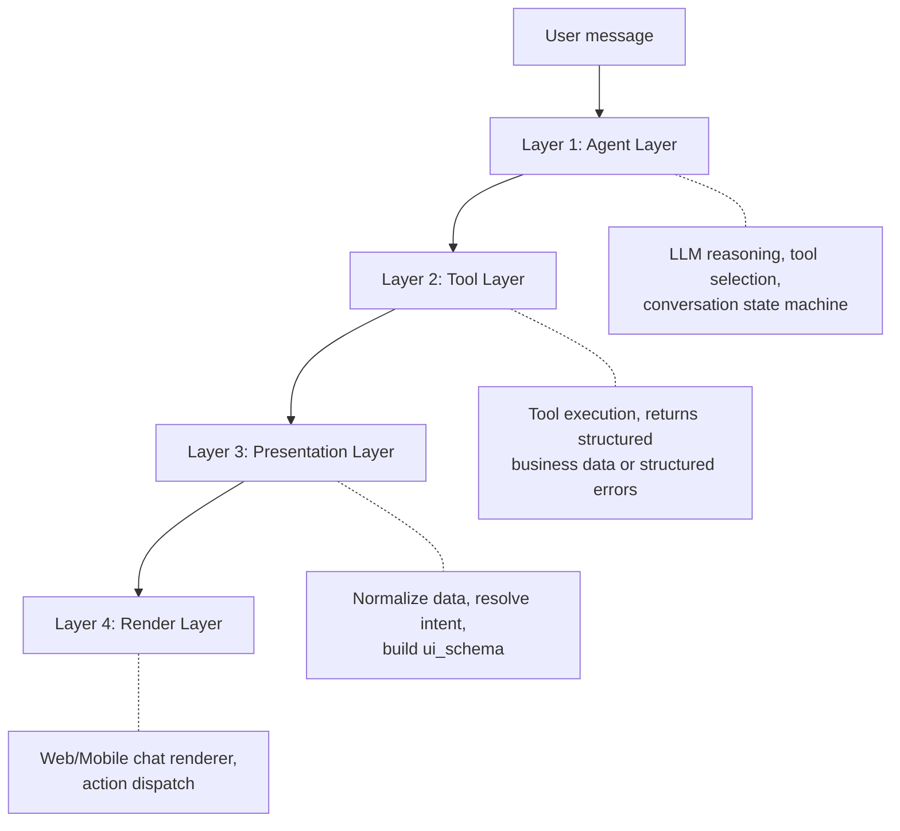
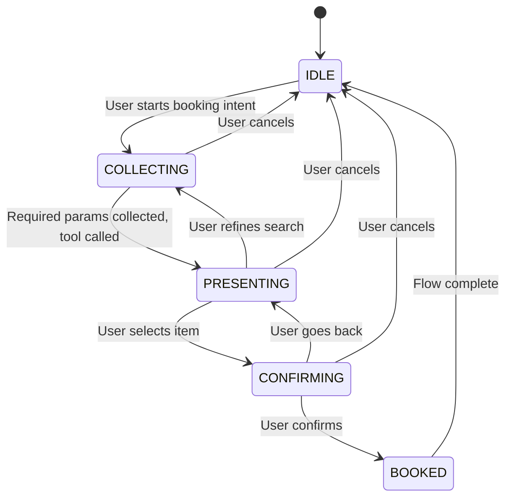

# AI Chat Dynamic Components Plan

Last updated: 2026-03-26

## Overview

This document defines the architecture for dynamic UI components used only in AI chat surfaces.

The goal is to replace hardcoded chat `ui_card` payloads with a stable, versioned `ui_schema`
that can be rendered by both Web and Mobile chat clients, while letting AI chat hand off
final booking confirmation to the normal native booking confirmation screen.

This plan is intentionally limited to AI chat. It is not a project-wide dynamic UI framework.

## 4-Layer Architecture

The dynamic component system follows a strict 4-layer separation:



**Why separate Layer 3 (Presentation)?**
LLM decides *what content to show*. Presentation Layer decides *how to show it*.
LLM output is non-deterministic — if it generates UI schema directly, the format will break regularly.
Backend deterministic code must own schema construction.

## Scope

### In Scope

- AI chat tool responses sent through WebSocket
- Backend response contract for chat UI rendering
- Conversation state machine for multi-turn booking flows
- Structured error handling from tools to UI
- Web chat renderer for AI chat messages
- Mobile chat renderer for AI chat messages
- Streaming-aware partial rendering
- Native booking handoff from AI chat to the regular booking confirmation flow

### Out of Scope

- Booking pages outside AI chat
- General-purpose form builders for the whole product
- Calendar/map/form plugin systems
- Dynamic UI for non-chat modules
- Replacing all existing UI components across the project

## Problem Statement

The current AI chat UI contract is fragile:

- Tool responses define hardcoded `ui_card.type` values (11+ occurrences in `booking_tools.py`)
- `chat.py` uses `extract_ui_card()` to dispatch — tightly coupled to tool output shapes
- Web and Mobile clients both depend on tool-specific payload shapes
- Adding a new chat presentation often requires backend and client changes
- No structured error handling — tools throw exceptions that crash the agent loop
- No conversation state tracking — LLM "forgets" context mid-flow
- No empty/error states in UI responses
- No streaming-aware rendering strategy

## Design Goals

- Define one backend-owned contract for AI chat UI rendering
- Keep raw tool data separate from presentation schema
- Support both Web and Mobile with the same schema semantics
- Preserve backward compatibility during migration
- Track conversation stage with a state machine
- Handle tool errors gracefully with structured responses
- Support streaming/partial rendering
- Keep v1 small and practical

## Non-Goals

- A no-code UI builder
- A universal renderer for every product page
- A promise that "new tools never require new UI code"
- LLM generating `ui_schema` directly (non-deterministic output)

If a new tool uses existing component types, clients should not need new renderer logic.
If a new tool requires a new component type, both clients will still need that component.

---

## Layer 1 — Agent Layer

### Conversation State Machine

Chatbot booking is **not** stateless Q&A. The agent must track conversation stage explicitly:



| Stage | Description |
|-------|-------------|
| `IDLE` | User has not started a booking/search flow |
| `COLLECTING` | Gathering required parameters (date, service, location) |
| `PRESENTING` | Showing results, waiting for user selection |
| `CONFIRMING` | User reviewing final booking details before commit |
| `BOOKED` | Booking confirmed, flow complete |

### System Prompt Requirements

The system prompt must declare:
- Which tools to use and when
- Current conversation stage
- What parameters have been collected vs missing
- Boundaries: what the agent should refuse or redirect

### Agent Loop Limits

Always set `max_iterations` (recommended: 5–7) on the ReAct agent loop.
Without limits, LLM can loop infinitely when a tool returns errors repeatedly.

### LLM Does Not Emit Intent — Presentation Layer Derives It

In the previous iteration of this plan, LLM was asked to emit intent signals.
This creates a reliability problem: LLM output is non-deterministic. If it emits
`"show_clinics"` instead of `"show_clinic_list"`, the Presentation Layer breaks.

**Decision: Intent is derived deterministically from tool_name + result shape.**

The Presentation Layer uses a closed lookup table:

```python
# presentation.py — deterministic, no LLM involvement
INTENT_MAP: dict[str, str] = {
    "get_user_pets":             "show_pet_list",
    "search_clinics_nearby":     "show_clinic_list",
    "get_clinic_services":       "show_services",
    "check_available_slots":     "show_available_slots",
    "create_booking_for_user":   "show_booking_summary",
    "get_patient_summary":       "show_emr_summary",
    "check_vaccination_status":  "show_vaccination_status",
}

def resolve_intent(tool_name: str, result: dict) -> str:
    if not result.get("success", True):  # structured error
        return "show_error"
    intent = INTENT_MAP.get(tool_name)
    if intent is None:
        return "show_text"  # unknown tool → plain text fallback
    # Check empty data
    data = result.get("data", {})
    if _is_empty_result(data):
        return "show_empty"
    return intent
```

**Intent Enum (closed whitelist):**

```ts
type IntentType =
  | "show_pet_list"
  | "show_clinic_list"
  | "show_services"
  | "show_available_slots"
  | "show_booking_summary"
  | "show_emr_summary"
  | "show_vaccination_status"
  | "show_error"
  | "show_empty"
  | "show_text";  // catch-all fallback
```

LLM is **never** involved in intent resolution. This guarantees deterministic schema output.

### Conversation State Persistence

The state machine stage is persisted using **LangGraph's built-in checkpointer** (already configured with `MemorySaver` / Postgres checkpointer in `single_agent.py`).

| Concern | Decision |
|---------|----------|
| **Storage** | `stage` field added to `ReActState`, persisted by LangGraph checkpointer (Postgres in production, MemorySaver in dev) |
| **Key** | Keyed by `session_id` (already used as LangGraph `thread_id`) |
| **Connection drop** | On WebSocket reconnect, client sends `session_id` → agent loads last checkpoint → resumes from persisted stage |
| **TTL** | Stages auto-expire to `IDLE` after 30 minutes of inactivity (configurable) |
| **Cross-request** | Stage survives across multiple WebSocket messages within the same session |

This means **no new infrastructure** (no separate Redis, no new DB table) — just a new field in the existing state.

---

## Layer 2 — Tool Layer

### Structured Error Responses (Mandatory)

Tools must **never** throw raw exceptions into the agent loop. Every tool must return a structured response:

```json
// Success
{
  "success": true,
  "data": { ... },
  "metadata": { "total": 5, "page": 1 }
}

// Error
{
  "success": false,
  "error_code": "NO_SLOTS_AVAILABLE",
  "message": "Không có slot trống cho ngày 25/03/2026",
  "recoverable": true,
  "suggestion": "Thử chọn ngày khác hoặc phòng khám khác"
}
```

**Error code enum (v1):**

| Code | Meaning |
|------|---------|
| `NO_SLOTS_AVAILABLE` | No available booking slots |
| `CLINIC_NOT_FOUND` | Clinic ID invalid or inactive |
| `SERVICE_NOT_FOUND` | Service not offered by clinic |
| `INVALID_DATE` | Date in the past or invalid format |
| `BOOKING_CONFLICT` | Time slot already taken |
| `PET_NOT_FOUND` | Pet ID not found for user |
| `UNAUTHORIZED` | User lacks permission |
| `RATE_LIMITED` | Too many requests |
| `INTERNAL_ERROR` | Unexpected system error |

### `recoverable` Field — Client Behavior Spec

The `recoverable` field determines how the Render Layer presents the error:

| `recoverable` | Client behavior |
|---------------|------------------|
| `true` | Show `error_card` with `retry_with_change` action button. User can modify params and retry. Agent stays in current stage. |
| `false` | Show `error_card` with `dismiss` action only. No retry option. Agent resets to `IDLE`. Example: `UNAUTHORIZED`, `INTERNAL_ERROR`. |
| _missing_ | Treat as `true` (optimistic default). |

Presentation Layer uses `recoverable` to choose which actions to attach:

```python
def build_error_actions(error: dict) -> list:
    if error.get("recoverable", True):
        return [
            {"type": "retry_with_change", "label": error.get("suggestion", "Thử lại")},
            {"type": "cancel_flow", "label": "Hủy"},
        ]
    return [
        {"type": "dismiss", "label": "Đóng"},
    ]
```

### Tool Descriptions for LLM

Tool descriptions must specify **when to use** and **when NOT to use**:

> **Good:** "Use `check_available_slots` AFTER you have both `clinic_id` and `service_id`. Do NOT call this tool if user has not selected a clinic."
>
> **Bad:** "Check available slots for a clinic service."

---

## Layer 3 — Presentation Layer

### Intent-Based Schema Building

The Presentation Layer maps **intents** (derived from `tool_name`, never from LLM) to layouts:

| Intent | Layout | Main component | Fallback |
|--------|--------|----------------|----------|
| `show_pet_list` | `list` | `pet_card` | Text list of pet names |
| `show_clinic_list` | `grid` | `clinic_card` | Text list of clinic names |
| `show_services` | `list` | `service_chip` | Bullet list of services |
| `show_available_slots` | `slot_grid` | `slot_button` | Text list of time slots |
| `show_booking_summary` | `card` | `booking_summary` | Text summary |
| `show_emr_summary` | `card` | `emr_summary` | Text summary |
| `show_vaccination_status` | `card` | `vaccination_card` | Text summary |
| `show_error` | `card` | `error_card` | Text error message |
| `show_empty` | `card` | `empty_state` | Text "no results" message |
| `show_text` | `card` | `text` | Plain text (catch-all) |

**Context-aware mapping:** The same intent can produce different layouts based on context.
Example: `show_clinic_list` with 1 result → `card` layout; with 5+ results → `grid` layout.

### Multi-Tool Responses

When a single agent turn calls 2+ tools (e.g. `get_user_pets` + `check_vaccination_status`),
the Presentation Layer produces a **composite layout**:

**Rule:** One message = one `ui_schema`. Never send 2 separate messages for one agent turn.

The composite uses `list` layout and concatenates component arrays from each tool:

```json
{
  "ui_schema": {
    "version": "1.0",
    "layout": "list",
    "components": [
      { "type": "text", "id": "section_pets", "data": {"content": "Thú cưng của bạn"} },
      { "type": "pet_card", "id": "pet_1", "data": {...} },
      { "type": "text", "id": "section_vacc", "data": {"content": "Lịch tiêm chủng"} },
      { "type": "vaccination_card", "id": "vacc_1", "data": {...} }
    ]
  }
}
```

**Implementation:** Presentation Layer collects all tool results from the agent turn, builds schemas for each,
then merges into one `list` layout with `text` section headers between groups. If only one tool was called,
the schema uses the tool's native layout (grid, card, etc.).

### Mandatory Empty and Error States

Every schema response must handle three states:

```json
// Normal state — data available
{
  "ui_schema": {
    "version": "1.0",
    "layout": "grid",
    "components": [...]
  }
}

// Empty state — no results
{
  "ui_schema": {
    "version": "1.0",
    "layout": "card",
    "components": [{
      "type": "empty_state",
      "id": "empty_clinics",
      "data": {
        "icon": "search_off",
        "title": "Không tìm thấy phòng khám",
        "message": "Không có phòng khám nào gần vị trí của bạn. Thử mở rộng phạm vi tìm kiếm.",
        "suggestion_action": "expand_search"
      }
    }]
  }
}

// Error state — tool failed
{
  "ui_schema": {
    "version": "1.0",
    "layout": "card",
    "components": [{
      "type": "error_card",
      "id": "error_slots",
      "data": {
        "error_code": "NO_SLOTS_AVAILABLE",
        "title": "Không có lịch trống",
        "message": "Phòng khám này chưa có slot trống cho ngày bạn chọn.",
        "recoverable": true
      },
      "actions": [{
        "type": "retry_with_change",
        "label": "Chọn ngày khác"
      }]
    }]
  }
}
```

### Schema Source of Truth

- **Backend** owns `ui_schema` construction (deterministic code, not LLM)
- **Web and Mobile** own renderer implementations
- **Tools** return raw structured data + success/error status
- **LLM** emits intent signals, never builds UI schema

This `ui_schema` is **only** for chat rendering. It is separate from:
- tool `input_schema` (tool parameter definitions)
- tool `output_schema` (tool result shapes)
- admin tool registry metadata

---

## Layer 4 — Render Layer

### Proposed Response Contract

```json
{
  "data": {},
  "ui_schema": {
    "version": "1.0",
    "layout": "list",
    "components": []
  },
  "ui_card": {},
  "message": "optional fallback text"
}
```

### UI Schema v1

#### Top-Level Shape

```ts
interface UISchemaV1 {
  version: "1.0";
  layout: "list" | "grid" | "card" | "slot_grid";
  components: UIComponent[];
  metadata?: {
    title?: string;
    description?: string;
    empty_state?: string;
    pagination?: {
      total: number;
      shown: number;
      has_more: boolean;
    };
  };
}
```

#### Component Shape

```ts
interface UIComponent {
  type: ComponentType;
  id: string;    // REQUIRED when actions present, recommended always
  data: Record<string, unknown>;
  actions?: UIAction[];
}

type ComponentType =
  | "pet_card"
  | "clinic_card"
  | "service_chip"
  | "slot_button"
  | "booking_summary"
  | "emr_summary"
  | "vaccination_card"
  | "text"
  | "badge"
  | "button"
  | "empty_state"
  | "error_card";
```

#### Action Whitelist (Enum, Not Free String)

Actions are a closed enum. Both Web and Mobile must implement all of them identically:

```ts
interface UIAction {
  type: ActionType;
  label: string;
  payload?: Record<string, unknown>;
}

type ActionType =
  | "select_item"       // User picks an item, sends selection back to agent
  | "confirm_booking"   // Confirm a booking
  | "cancel_flow"       // Cancel current flow, return to IDLE
  | "load_more"         // Pagination — load next page of results
  | "open_detail"       // Navigate to detail page outside chat
  | "retry_with_change" // Retry current step with modified params
  | "dismiss";          // Close/dismiss the component
```

**Rule:** Any component with `actions` MUST have a non-empty `id`.

**2026-03-26 booking flow update**

- `select_services` is now required for grouped multi-select service selection in AI chat.
- `open_native_confirm` is required when AI has gathered enough booking data and must hand off to the normal native booking confirmation screen.
- `confirm_booking` is considered legacy for the mobile AI booking flow and should not be emitted for new mobile booking summaries.

#### Action Payload Specs

Each action type has a defined payload contract:

| Action | Required payload fields | Description |
|--------|------------------------|-------------|
| `select_item` | `{item_id: string, item_type: string}` | `item_type` matches component type (e.g. `"clinic"`, `"service"`, `"slot"`) |
| `confirm_booking` | `{booking_params: object}` | Contains all fields needed to call `create_booking_for_user` |
| `cancel_flow` | _none_ | No payload needed. Resets agent stage to IDLE |
| `load_more` | `{cursor: string, page_size?: number}` | **Cursor-based** (not offset). `cursor` is opaque string from `metadata.pagination.next_cursor` |
| `open_detail` | `{route: string, id: string}` | `route` = client route name (e.g. `"clinic_detail"`), `id` = entity ID |
| `retry_with_change` | `{original_tool?: string}` | Optional hint to agent about which step to retry |
| `dismiss` | _none_ | No payload. Client removes the component from view |

Additional booking action payloads used by the current mobile cutover:

| Action | Required payload fields | Description |
|--------|------------------------|-------------|
| `select_services` | `{group_id: string, clinic_id: string, pet_id?: string, service_ids: string[], service_names?: string[]}` | Sends the selected service group back to the agent in one action |
| `open_native_confirm` | `{clinic_id: string, pet_id: string, booking_type: string, booking_date: string, start_time: string, service_ids: string[], notes?: string, home_address?: string, home_lat?: number, home_long?: number}` | Opens the native booking confirmation flow with prefilled data |
| `retry_with_change` | `{original_tool?: string, change_target?: string}` | `change_target` lets the backend route the edit request to the right booking field group |

**`load_more` pagination contract:**

Backend sends cursor in `metadata.pagination`:

```json
{
  "ui_schema": {
    "metadata": {
      "pagination": {
        "total": 12,
        "shown": 5,
        "has_more": true,
        "next_cursor": "eyJvZmZzZXQiOjV9"
      }
    },
    "components": [...]
  }
}
```

Client sends `load_more` action back to agent with cursor:

```json
{
  "message": "",
  "ui_action": {
    "type": "load_more",
    "payload": { "cursor": "eyJvZmZzZXQiOjV9", "page_size": 5 }
  }
}
```

Cursor is opaque to clients — backend decides whether it's offset, keyset, or token-based internally.

### Supported v1 Layouts

- `list`: vertical stacked components
- `grid`: card grid for clinic-style results
- `card`: single summary block
- `slot_grid`: booking slot selection layout

### Supported v1 Component Types

- `pet_card`
- `clinic_card`
- `service_chip`
- `slot_button`
- `booking_summary`
- `emr_summary`
- `vaccination_card`
- `text`
- `badge`
- `button`
- `empty_state`
- `error_card`

### Streaming-Aware Rendering

Since the system uses WebSocket and LLM streams responses, the Render Layer must support **partial states**:

| Phase | What to render |
|-------|----------------|
| Tool calling started | Skeleton card / loading indicator with tool name hint |
| Tool result received, schema building | Transition skeleton → populated component |
| Schema complete | Full rendered component |
| Schema failed | Fallback to `ui_card` → plain text cascade |

Clients should render optimistically: show a skeleton placeholder when a tool call is detected,
then swap with actual content when `ui_schema` arrives.

For the current mobile cutover, `ui_schema` is the only structured renderer contract.
If reconnect/history returns only plain text messages, the mobile client must rehydrate
interactive booking state from local persisted session state instead of falling back to legacy `ui_card`.

### Client Resolution Order

During migration, backend responses support both formats:

```json
{
  "data": {},
  "ui_schema": {},
  "ui_card": {},
  "message": "plain text fallback"
}
```

Resolution order:

1. Render `ui_schema` if present and valid
2. Rehydrate persisted local interactive state for the same `session_id` when reconnect/history does not include structured UI
3. Fallback to `message` as plain text
4. Last resort: render raw `data` as formatted text

---

## Implementation Principles

- Keep schema small in v1
- Version the schema from day one
- Reuse existing chat components where possible
- Do not introduce project-wide dynamic UI abstractions yet
- Avoid tool-specific branching in chat transport when schema can carry intent
- Never let LLM generate `ui_schema` directly
- Always have a plain text fallback — user must always see *something*
- Log all tool calls + results for production debugging
- Test agent with adversarial input (out-of-flow questions, invalid dates, edge cases)

## Success Criteria

- AI chat responses can render supported tool results from `ui_schema`
- Mobile AI chat uses `ui_schema` as the only structured renderer
- Web and Mobile follow the same schema semantics and action whitelist
- New tool outputs that reuse existing component types do not require transport changes
- Conversation state machine tracks booking flow correctly across multi-turn
- Tool errors are surfaced to users as friendly UI, not crashes
- Empty results show meaningful empty states, not blank chat bubbles
- Streaming renders skeleton → content transitions smoothly

- AI booking summaries hand off to the normal booking confirmation screen instead of confirming directly inside chat

## Migration Path

### Phase 1: Foundation (Current)
- [ ] Define `UISchemaV1` types in shared contract
- [ ] Implement conversation state machine in agent
- [ ] Refactor tool error handling to structured responses
- [ ] Build Presentation Layer as separate module

### Phase 2: Schema Builders
- [ ] Implement intent → schema mapping for each supported tool
- [ ] Add empty state and error state builders
- [ ] Add `select_services` action for grouped service multi-select
- [ ] Add `open_native_confirm` action for booking summary handoff

### Phase 3: Client Renderers
- [ ] Web: implement `UISchemaRenderer` component with action dispatch
- [ ] Mobile: implement `UISchemaRenderer` widget with action dispatch
- [ ] Mobile: persist AI chat transient booking state by `session_id`
- [ ] Both: skeleton/loading states for streaming
- [ ] Mobile: rehydrate local AI chat session state when reconnect/history lacks structured UI
- [ ] Both: fallback cascade (schema → ui_card → text)

### Phase 4: Cutover
- [ ] Verify all tools produce `ui_schema`
- [ ] Remove mobile legacy booking renderers and payload models
- [ ] Stop advertising legacy `ui_card` transport for AI chat mobile
- [ ] Route booking confirmation to the standard native booking confirmation screen

## Related Documents

- [AI Service Improvements](D:/SEP490/petties/docs-references/documentation/AI_SERVICE_IMPROVEMENTS_V2.md)
