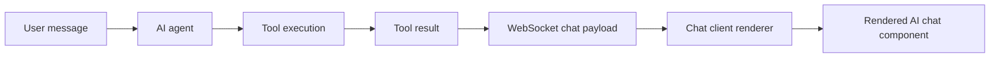
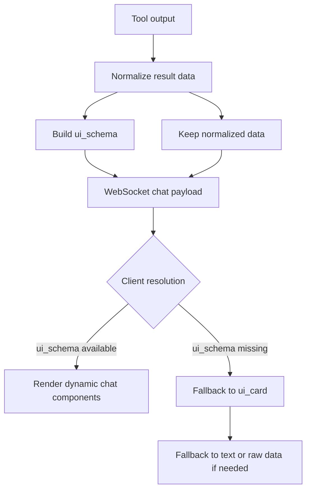

# AI Chat Dynamic Components Plan

Last updated: 2026-03-25

## Overview

This document defines the architecture for dynamic UI components used only in AI chat surfaces.

The goal is to replace hardcoded chat `ui_card` payloads with a stable, versioned `ui_schema`
that can be rendered by both Web and Mobile chat clients.

This plan is intentionally limited to AI chat. It is not a project-wide dynamic UI framework.

## Scope

### In Scope

- AI chat tool responses sent through WebSocket
- Backend response contract for chat UI rendering
- Web chat renderer for AI chat messages
- Mobile chat renderer for AI chat messages
- Backward compatibility with existing `ui_card`

### Out of Scope

- Booking pages outside AI chat
- General-purpose form builders for the whole product
- Calendar/map/form plugin systems
- Dynamic UI for non-chat modules
- Replacing all existing UI components across the project

## Problem Statement

The current AI chat UI contract is fragile:

- Tool responses define hardcoded `ui_card.type` values
- Web and Mobile clients both depend on tool-specific payload shapes
- Adding a new chat presentation often requires backend and client changes
- Output contracts are spread across tools, chat transport, and client models

## Design Goals

- Define one backend-owned contract for AI chat UI rendering
- Keep raw tool data separate from presentation schema
- Support both Web and Mobile with the same schema semantics
- Preserve backward compatibility during migration
- Keep v1 small and practical

## Non-Goals

- A no-code UI builder
- A universal renderer for every product page
- A promise that "new tools never require new UI code"

If a new tool uses existing component types, clients should not need new renderer logic.
If a new tool requires a new component type, both clients will still need that component.

## AI Chat Runtime Boundaries

The dynamic component system lives only in the AI chat response path:



## How AI Chat UI Is Produced

The AI chat UI should be driven by tool output, but not by raw tool output directly.

The intended flow is:

1. A tool returns business data
2. The backend normalizes that result into a stable chat-friendly shape
3. The backend builds `ui_schema` from the normalized result
4. The WebSocket payload sends both `data` and `ui_schema`
5. The client renders from `ui_schema`
6. Legacy `ui_card` is only a fallback during migration



### Practical Rule

- `data` is the source data for the chat response
- `ui_schema` is the rendering contract for the chat UI
- Clients should prefer `ui_schema` over trying to infer UI from raw tool output

### Example

For `search_clinics_nearby`:

- the tool returns clinic search data
- the backend normalizes the clinic list
- the backend builds a `grid` schema with `clinic_card` components
- the AI chat client renders those cards inside the chat message

## Source of Truth

### Contract Ownership

- Backend owns `ui_schema`
- Web and Mobile own renderer implementations
- Tools may still return raw `data`
- Legacy `ui_card` remains a temporary fallback

### Important Separation

This `ui_schema` is only for chat rendering.

It is not the same as:

- tool `input_schema`
- tool `output_schema`
- admin tool registry metadata

Those schemas describe tool contracts. `ui_schema` describes chat presentation.

## Proposed Response Contract

```json
{
  "data": {},
  "ui_schema": {
    "version": "1.0",
    "layout": "list",
    "components": []
  },
  "ui_card": {},
  "message": "optional fallback text"
}
```

## UI Schema v1

### Top-Level Shape

```ts
interface UISchemaV1 {
  version: "1.0";
  layout: "list" | "grid" | "card" | "slot_grid";
  components: UIComponent[];
  metadata?: {
    title?: string;
    description?: string;
    empty_state?: string;
  };
}
```

### Component Shape

```ts
interface UIComponent {
  type:
    | "pet_card"
    | "clinic_card"
    | "service_chip"
    | "slot_button"
    | "booking_summary"
    | "emr_summary"
    | "vaccination_card"
    | "text"
    | "badge"
    | "button";
  id?: string;
  data: Record<string, unknown>;
  actions?: Array<{
    type: string;
    label: string;
    payload?: Record<string, unknown>;
  }>;
}
```

## Supported v1 Layouts

- `list`: vertical stacked components
- `grid`: card grid for clinic-style results
- `card`: single summary block
- `slot_grid`: booking slot selection layout

## Supported v1 Component Types

- `pet_card`
- `clinic_card`
- `service_chip`
- `slot_button`
- `booking_summary`
- `emr_summary`
- `vaccination_card`
- `text`
- `badge`
- `button`

## Tool Mapping for v1

| Tool | Layout | Main component |
|------|--------|----------------|
| `get_user_pets` | `list` | `pet_card` |
| `search_clinics_nearby` | `grid` | `clinic_card` |
| `get_clinic_services` | `list` | `service_chip` |
| `check_available_slots` | `slot_grid` | `slot_button` |
| `create_booking_for_user` | `card` | `booking_summary` |
| `get_patient_summary` | `card` | `emr_summary` |
| `check_vaccination_status` | `card` | `vaccination_card` |

## Backward Compatibility

During migration, backend responses should support both formats:

```json
{
  "data": {},
  "ui_schema": {},
  "ui_card": {}
}
```

Client resolution order:

1. Render `ui_schema` if present
2. Fallback to legacy `ui_card`
3. Fallback to plain text or raw-data classification if needed

## Implementation Principles

- Keep schema small in v1
- Version the schema from day one
- Reuse existing chat components where possible
- Do not introduce project-wide dynamic UI abstractions yet
- Avoid tool-specific branching in chat transport when schema can carry intent

## Success Criteria

- AI chat responses can render supported tool results from `ui_schema`
- Existing `ui_card` flows keep working during migration
- Web and Mobile follow the same schema semantics
- New tool outputs that reuse existing component types do not require transport changes

## Open Decisions

- Whether `actions` should be fully generic in v1 or limited to a small whitelist
- Whether schema builders should live next to tools or in a dedicated chat UI module
- Whether the backend should emit both `ui_schema` and normalized `data` for all chat tools

## Related Documents

- [Implementation Plan](D:/SEP490/petties/docs-references/development/dynamic-ui-rendering/PLAN.md)
- [AI Service Improvements](D:/SEP490/petties/docs-references/documentation/AI_SERVICE_IMPROVEMENTS_V2.md)
