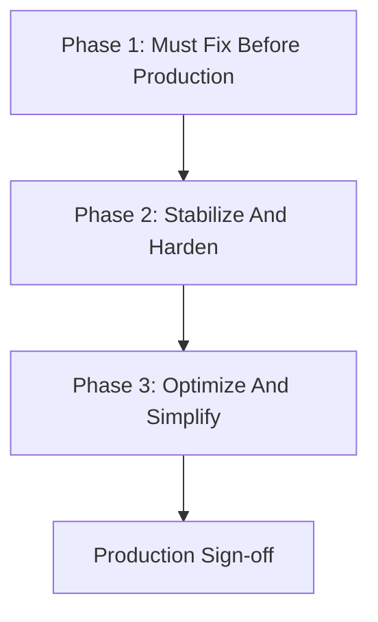

# AI Chatbot Production Readiness Plan

Last Updated: 2026-03-31

## Objective

Bring the Petties AI chatbot to production-ready quality as a domain-specific agentic chatbot that can:

- understand user intent reliably
- call tools correctly
- manage multi-turn conversation and booking state
- return structured response and `ui_schema`
- fail safely with predictable recovery behavior
- support search, consultation, booking, confirmation, cancel, and retry flows

This plan is based on current code behavior, not architecture documents only.

## Scope

### In scope

- `petties-agent-serivce/app/core/agents/`
- `petties-agent-serivce/app/core/tools/`
- `petties-agent-serivce/app/api/websocket/chat.py`
- `petties-agent-serivce/app/api/routes/chat.py`
- `petties-agent-serivce/app/core/presentation/`
- `petties-web/src/components/spotlight/SpotlightProvider.tsx`
- `petties-web/src/pages/staff/StaffAIChatPage.tsx`
- `petties_mobile/lib/data/models/ai_chat.dart`
- `petties_mobile/lib/ui/chat/ai_chat/ai_chat_screen.dart`

### Out of scope

- diagnosis service redesign
- EMR UI refactor unrelated to chatbot contract
- database schema expansion for new persistent graph artifacts

## Current Assessment Summary

- Chatbot is usable for dev/test/UAT and core business flows.
- Backend regression for core chatbot flow is currently strong (`79 passed`).
- Main gaps before production are:
- action safety gate has started to move into backend-deterministic guard logic, but broader mutation/refusal coverage is still incomplete
  - business error taxonomy is incomplete
  - observability/redaction is below production standard
  - state recovery is only partially durable (`MemorySaver` + Mongo `booking_state`)
  - frontend/backend contract conformance is improved but not fully locked down

## Delivery Strategy

## Phase 1 - Must Fix Before Production

Goal: eliminate blockers that can cause unsafe actions, broken recovery, poor supportability, or production debugging failure.

### 1. Action Safety Gate

Problem:

- Booking creation still relies too much on prompt compliance.
- Confirmation can still be interpreted too loosely in ambiguous turns.

Tasks:

- Add deterministic backend gate before `create_booking_for_user`.
- Require explicit validated confirmation state before mutation tools run.
- Reject or clarify on ambiguous confirmation such as `ừ`, `ok`, `đúng rồi` when summary state is incomplete.
- Re-check ownership and required fields before final mutation.

Target files:

- `petties-agent-serivce/app/core/agents/single_agent.py`
- `petties-agent-serivce/app/core/agents/prompt_builder.py`
- `petties-agent-serivce/app/core/tools/mcp_tools/booking_tools.py`
- `petties-agent-serivce/app/core/tools/mcp_tools/booking_session_tools.py`

Acceptance criteria:

- Booking is never created unless backend-deterministic conditions are satisfied.
- Ambiguous confirmation triggers clarification, not mutation.
- Duplicate confirm click or repeated confirm message is idempotent or safely rejected.

### 2. Business Error Taxonomy

Problem:

- Error contract is better, but business coverage is still incomplete.
- UI cannot render consistent recovery behavior without stable business codes.

Tasks:

- Define shared business error code set.
- Map all major booking and medical failures to explicit codes.
- Separate recoverable vs non-recoverable behavior.
- Ensure `tool -> websocket -> frontend` preserves the same code.

Minimum required codes:

- `NO_SLOTS_AVAILABLE`
- `BOOKING_CONFLICT`
- `PET_NOT_FOUND`
- `CLINIC_NOT_FOUND`
- `SERVICE_NOT_FOUND`
- `INVALID_DATE`
- `UNAUTHORIZED`
- `FORBIDDEN`
- `RATE_LIMITED`
- `INTERNAL_ERROR`

Target files:

- `petties-agent-serivce/app/core/tools/contracts.py`
- `petties-agent-serivce/app/core/tools/mcp_tools/*.py`
- `petties-agent-serivce/app/core/presentation/builder.py`
- `petties-agent-serivce/app/api/websocket/chat.py`
- web/mobile chatbot FE models and renderers

Acceptance criteria:

- Each required failure scenario emits a deterministic `error_code`.
- FE renders recoverable/non-recoverable errors differently and correctly.

### 3. Logging, Redaction, Observability

Problem:

- Current logs are useful for debugging but too close to user/tool payloads.
- There is no production-grade metrics layer for tool latency and error funnels.

Tasks:

- Redact PII/PHI from logs (`pet_id`, `user_id`, address, medical details where needed).
- Add correlation id per session/turn.
- Add structured metrics/logs for:
  - tool latency
  - tool error counts by `error_code`
  - timeout counts
  - reconnect counts
  - booking funnel (`started`, `reviewed`, `confirmed`, `created`, `cancelled`)
- Distinguish debug logging from production logging.

Target files:

- `petties-agent-serivce/app/core/tools/executor.py`
- `petties-agent-serivce/app/api/websocket/chat.py`
- `petties-agent-serivce/app/core/agents/single_agent.py`
- relevant logging helpers/config

Acceptance criteria:

- No sensitive raw payload is logged at info/warning/error level.
- A failed turn can be traced end-to-end by correlation id.
- Production support can answer: which tool failed, how often, how long, and in which session bucket.

### 4. State and Recovery Policy

Problem:

- `booking_state` survives reconnect, but full graph state does not.
- Behavior across restart, multi-tab, or multi-device is not explicitly locked down.

Tasks:

- Document and implement session recovery policy.
- Decide behavior for:
  - service restart
  - multi-tab same session
  - multi-device same session
  - reconnect while stream/tool is mid-flight
- Add explicit conflict handling or last-connection-wins policy.

Target files:

- `petties-agent-serivce/app/api/websocket/chat.py`
- `petties-agent-serivce/app/core/database/mongodb.py`
- `petties-agent-serivce/app/core/agents/single_agent.py`

Acceptance criteria:

- Session behavior is deterministic for reconnect and concurrent connections.
- No silent state corruption when two sockets share one session.

### 5. Contract Conformance Between Backend And Frontend

Problem:

- FE has caught up to the current contract, but there is no strong conformance barrier.
- New tool/schema changes can still silently break rendering.

Tasks:

- Add contract tests for WS events and `ui_schema` payloads.
- Verify FE handling for:
  - `thinking_stream`
  - `tool_call`
  - `tool_result`
  - `ui_schema`
  - `booking_state_update`
  - structured `error`
- Add safe fallback for unknown component/action where missing.

Target files:

- `petties-agent-serivce/app/api/schemas/websocket_schemas.py`
- `petties-agent-serivce/tests/test_websocket_chat.py`
- `petties-web/src/components/spotlight/SpotlightProvider.tsx`
- `petties-web/src/pages/staff/StaffAIChatPage.tsx`
- `petties_mobile/lib/data/models/ai_chat.dart`
- `petties_mobile/lib/ui/chat/ai_chat/ai_chat_screen.dart`

Acceptance criteria:

- All emitted core events are parseable by web and mobile clients.
- Unknown/unsupported schema pieces degrade safely, not catastrophically.

## Phase 2 - Stabilize And Harden

Goal: reduce production ambiguity, improve trustworthiness, and increase audit completeness.

### 6. Deterministic Safety And Refusal Behavior

Tasks:

- Add explicit refusal and clarification policy for high-risk questions.
- Prevent staff clinical flows from using external web sources when not allowed.
- Add hard guard for unsupported actions or unsafe scope expansion.
- Distinguish informational answer vs transactional answer vs medical caution answer.

Target files:

- `petties-agent-serivce/app/core/context_policy.py`
- `petties-agent-serivce/app/core/agents/prompt_builder.py`
- `petties-agent-serivce/app/core/agents/tool_routing.py`
- `petties-agent-serivce/app/core/agents/single_agent.py`

Acceptance criteria:

- High-risk prompts result in refusal/clarification when required.
- Staff clinical answers do not silently drift to public web fallback.

### 7. Expanded Regression And Scenario Coverage

Tasks:

- Add end-to-end tests for:
  - long multi-turn booking
  - repeated confirmation
  - off-topic interruption and resume
  - reconnect during booking
  - rate limited tool response
  - no-slot and conflict scenarios
  - unauthorized/ownership mismatch

Target files:

- `petties-agent-serivce/tests/`
- web/mobile chatbot tests where applicable

Acceptance criteria:

- Core user journeys and major failure journeys are covered by automated tests.

### 8. Presentation And UI Contract Refinement

Tasks:

- Audit `INTENT_MAP` and empty/error fallback per tool.
- Add error-card behavior by error class, not only generic error card.
- Validate action payloads against FE-supported render contract.
- Reduce legacy event branches when safe.

Target files:

- `petties-agent-serivce/app/core/presentation/builder.py`
- web/mobile chatbot renderers and model parsers

Acceptance criteria:

- UI responses are predictable, actionable, and do not depend on hidden FE assumptions.

## Phase 3 - Optimize And Simplify

Goal: reduce cost/latency, simplify extension, and prepare sustainable maintenance.

### 9. Latency And Throughput Optimization

Tasks:

- Cache tool schemas / enabled tool lookups where safe.
- Reduce prompt bloat from long history and repeated state injection.
- Benchmark latency by intent type.
- Measure timeout hotspots and cut avoidable DB or normalization overhead.

Target files:

- `petties-agent-serivce/app/core/tools/executor.py`
- `petties-agent-serivce/app/core/agents/prompt_builder.py`
- `petties-agent-serivce/app/api/websocket/chat.py`

Acceptance criteria:

- Latency budget is known and measured for knowledge, booking, and staff flows.

### 10. Extensibility And Change Safety

Tasks:

- Create checklist/template for adding a new tool:
  - tool contract
  - policy/whitelist
  - presentation mapping
  - websocket schema impact
  - FE parser/render support
  - tests
- Add golden/schema-based tests for representative `ui_schema` payloads.
- Reduce unnecessary compat layers after contract becomes stable.

Acceptance criteria:

- Adding a new tool no longer relies on tribal knowledge.

## Priority Order

Implementation order must be:

1. Action safety gate
2. Business error taxonomy
3. Logging, redaction, observability
4. State and recovery policy
5. Backend/Frontend contract conformance
6. Deterministic refusal and safety hardening
7. Expanded regression coverage
8. Presentation refinement
9. Latency optimization
10. Extensibility hardening

## Verification Commands

Backend:

- `python -m pytest tests/test_booking_tools.py tests/test_booking_session.py tests/test_tool_contracts.py tests/test_medical_tools.py tests/test_websocket_chat.py`
- `python -m py_compile app/api/websocket/chat.py app/core/agents/prompt_builder.py app/core/agents/single_agent.py app/core/tools/executor.py`

Web:

- `npm run build`
- `npx eslint src/components/spotlight/SpotlightProvider.tsx src/pages/staff/StaffAIChatPage.tsx`

Mobile:

- `flutter analyze lib/data/models/ai_chat.dart lib/ui/chat/ai_chat/ai_chat_screen.dart`
- `flutter test`

## Production Exit Criteria

The chatbot can be considered production-ready only when all of the following are true:

- booking mutation is gated deterministically
- required business error codes are fully mapped end-to-end
- logging is redacted and correlation-aware
- reconnect and concurrent session behavior is deterministic
- WS and UI schema contracts are covered by automated conformance tests
- high-risk safety/refusal behavior is explicitly enforced
- core regression suite is green and representative

## Deliverables

- updated backend safety gates
- finalized business error taxonomy
- observability and redaction baseline
- contract conformance tests
- expanded scenario tests
- updated audit/checklist documents

## Tracking Checklist

- [x] Phase 1.1 Action safety gate
- [x] Phase 1.2 Business error taxonomy
- [ ] Phase 1.3 Logging, redaction, observability
- [ ] Phase 1.4 State and recovery policy
- [ ] Phase 1.5 Contract conformance
- [ ] Phase 2.6 Safety and refusal hardening
- [ ] Phase 2.7 Expanded regression coverage
- [ ] Phase 2.8 Presentation refinement
- [ ] Phase 3.9 Latency optimization
- [ ] Phase 3.10 Extensibility hardening
- [ ] Final production sign-off
