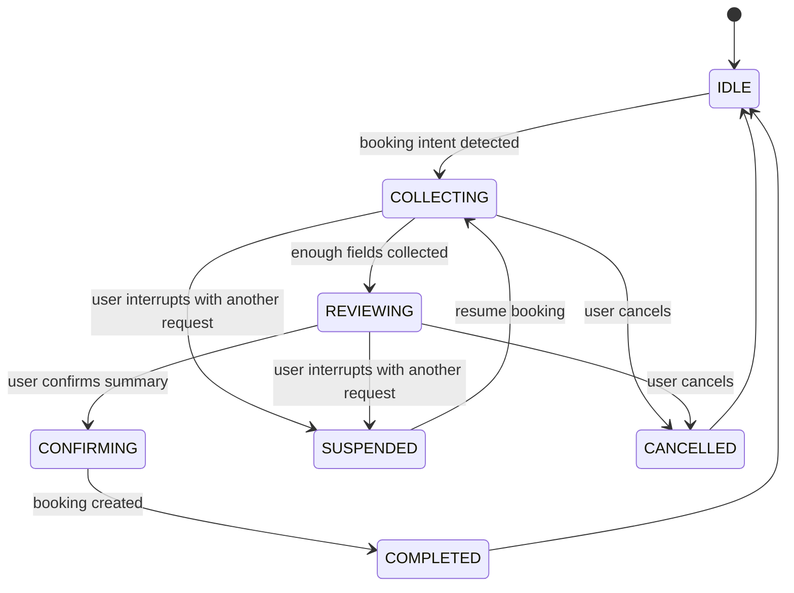

# Booking Stateful Flow Plan

Last Updated: 2026-03-27

## Problem Statement

The current AI booking flow can detect booking intent and call booking-related tools, but it does not maintain a durable booking state across turns.

As a result:

- The assistant may ask again for information the user already provided in the same prompt or earlier turns.
- Booking data is spread across prompt context, ReAct trace, temporary tool cache, UI schema, and mobile-side tracker.
- If the user changes clinic, date, time, or service mid-flow, the system has no authoritative reducer to update dependent fields safely.
- If the user interrupts the flow with a different request, the assistant may lose booking progress or restart the flow incorrectly.

## Expected Behavior

Once the assistant has strong evidence that the user wants to make a booking, it should enter a booking state and remain in that state until one of the following happens:

- booking is completed successfully
- user explicitly cancels booking
- booking is suspended because the user temporarily switches to another request

While in booking state, the assistant should:

- keep a booking draft across turns
- know which fields are already collected
- know which fields are still missing
- update the draft when the user changes requirements
- avoid asking again for fields already resolved
- resume the booking flow after interruptions when appropriate

## Relevant Code Areas

- `petties-agent-serivce/app/core/agents/single_agent.py`
- `petties-agent-serivce/app/core/agents/state.py`
- `petties-agent-serivce/app/core/agents/tool_routing.py`
- `petties-agent-serivce/app/core/agents/booking_flow.py`
- `petties-agent-serivce/app/core/agents/booking_context.py`
- `petties-agent-serivce/app/core/tool_runtime_context.py`
- `petties-agent-serivce/app/api/websocket/chat.py`
- `petties-agent-serivce/app/core/database/mongodb.py`
- `petties_mobile/lib/ui/chat/ai_chat/ai_chat_screen.dart`
- `petties_mobile/lib/ui/chat/ai_chat/utils/ai_booking_tracker.dart`

## Current Gaps

### 1. No authoritative booking session state

The codebase has partial state mechanisms, but not a true booking session:

- `ReActState.stage` exists, but it is not the business source of truth.
- WebSocket currently infers `stage` from `ui_schema`, which is presentation-derived, not workflow-derived.
- `BookingContextCache` only stores clinic resolution and conditional intent.
- Mobile `AiBookingTrackerSnapshot` is client-side only and is not authoritative.

### 2. No reducer for booking draft updates

There is no central rule set to handle changes such as:

- changing clinic should invalidate selected services and slot
- changing date should invalidate slot
- changing pet may invalidate services depending on species
- switching booking type may invalidate address or clinic requirements

### 3. No interruption model

The current system does not clearly separate:

- booking continuation
- booking update
- temporary interruption
- cancellation
- complete intent takeover by another task

### 4. No persisted booking draft in session storage

MongoDB chat session data stores chat history and metadata, but not a structured booking draft that can be restored as the source of truth on the next turn.

## Target Architecture

Introduce a server-side `BookingSessionState` persisted per chat session.

Suggested state shape:

```json
{
  "active": true,
  "status": "COLLECTING",
  "intent": "create_booking",
  "draft": {
    "pet_id": null,
    "pet_name": null,
    "clinic_id": null,
    "clinic_hint": null,
    "clinic_name": null,
    "service_ids": [],
    "service_names": [],
    "booking_date": null,
    "start_time": null,
    "time_preference": null,
    "booking_type": null,
    "home_address": null,
    "home_lat": null,
    "home_long": null
  },
  "missing_fields": [],
  "last_confirmed_snapshot": null,
  "interruption_state": null,
  "updated_at": "2026-03-27T00:00:00Z"
}
```

## Desired State Machine



## Implementation Plan

### Phase 1. Define booking session model

Create a dedicated module for booking workflow state, for example:

- `petties-agent-serivce/app/core/agents/booking_session.py`

Responsibilities:

- define `BookingSessionState`
- define draft merge rules
- define invalidation rules
- define transition rules
- expose helpers such as:
  - `start_booking_session()`
  - `merge_user_booking_input()`
  - `apply_tool_result_to_booking_state()`
  - `suspend_booking_session()`
  - `cancel_booking_session()`
  - `complete_booking_session()`

### Phase 2. Persist booking state per chat session

Store booking state in MongoDB session metadata so it survives across turns and reconnects.

Required areas:

- `petties-agent-serivce/app/core/database/mongodb.py`
- `petties-agent-serivce/app/api/routes/chat.py`
- `petties-agent-serivce/app/api/websocket/chat.py`

Required behavior:

- load booking state at the beginning of each message handling cycle
- update it after every meaningful user action or tool result
- clear or archive it when booking is completed or cancelled

### Phase 3. Drive the agent with booking state

Inject booking state into the think step before tool selection.

Required changes:

- `single_agent.py` should receive active booking draft and missing fields
- prompt construction should explicitly tell the model:
  - continue existing booking if active
  - do not ask again for resolved fields
  - treat contradictory user input as draft updates
  - treat off-topic user requests as interruption or takeover depending on intent strength

### Phase 4. Add booking reducer logic

Build deterministic merge and invalidation rules.

Examples:

- update clinic:
  - keep pet
  - clear services
  - clear slot
- update date:
  - keep clinic and services
  - clear slot
- update booking type to `HOME_VISIT`:
  - require address and coordinates
- update pet:
  - re-check service compatibility

### Phase 5. Add interruption and resume handling

Introduce explicit interruption handling rules:

- If the user asks a short side question while booking is active, answer it and keep booking state as `SUSPENDED`.
- If the user clearly updates booking details, keep the same booking session and patch the draft.
- If the user clearly cancels, move to `CANCELLED`.
- If the user starts a stronger unrelated intent, close or suspend booking based on policy.

### Phase 6. Make WebSocket and mobile consume booking state

The server should send structured booking state events instead of relying only on inferred `stage`.

Suggested additions:

- WebSocket event with `booking_state`
- optional `draft_summary`
- optional `missing_fields`

Mobile responsibilities:

- render booking progress from server state
- use local tracker only as temporary UI cache
- stop treating client-side tracker as the source of truth

### Phase 7. Add test coverage

Required tests:

- booking starts when intent is detected
- complete one-prompt booking does not ask again for the same field
- clinic change invalidates service and slot
- date change invalidates slot only
- interruption preserves draft
- resume continues previous draft
- cancel clears active booking state
- completed booking exits booking mode

## Before vs After

### Before

- booking flow depends heavily on prompt interpretation and recent trace
- state is fragmented across multiple layers
- asking again for already provided information is common
- mid-flow requirement changes are not handled systematically
- interruptions can break the flow

### After

- booking flow is driven by a persisted server-side state
- every turn reads and updates the same booking draft
- the assistant knows what is collected and what is missing
- user changes are treated as draft updates
- interruptions are handled without losing progress

## Acceptance Criteria

- The assistant does not ask again for clinic, pet, date, time, or services if they are already resolved in the active booking session.
- A single prompt containing enough booking information can move directly to review or confirmation without unnecessary clarification.
- A user can change clinic, date, time, or service in later turns and the draft updates predictably.
- A user can interrupt booking with another question and later resume without re-entering already known details.
- Booking state is persisted per session and restored after reconnect or history reload.

## Recommended First Deliverable

The first implementation slice should focus on backend and AI service only:

1. Add `BookingSessionState`
2. Persist it in MongoDB session metadata
3. Inject it into `single_agent.py`
4. Add reducer rules for clinic/date/service updates
5. Add multi-turn regression tests

Only after that should mobile be updated to consume server-driven booking state.
