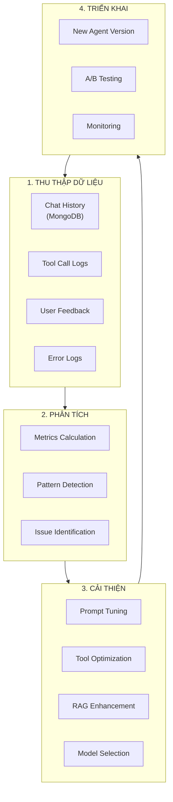
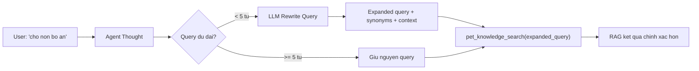
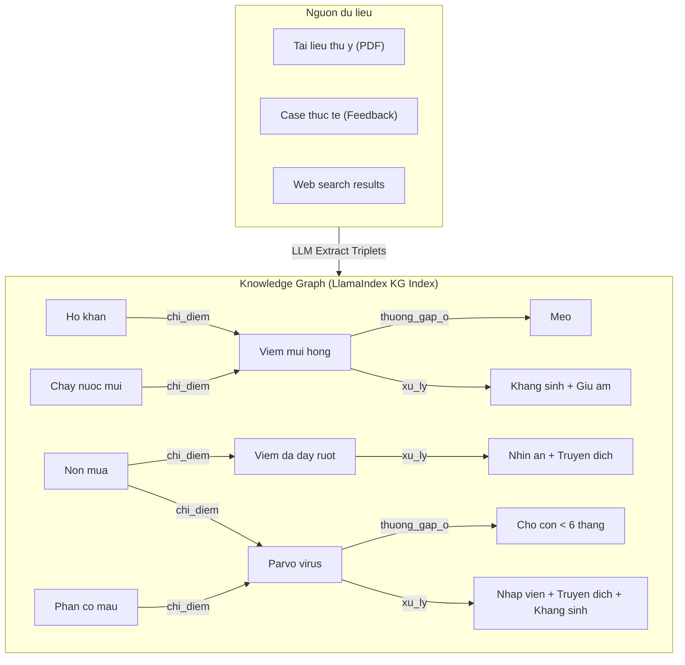
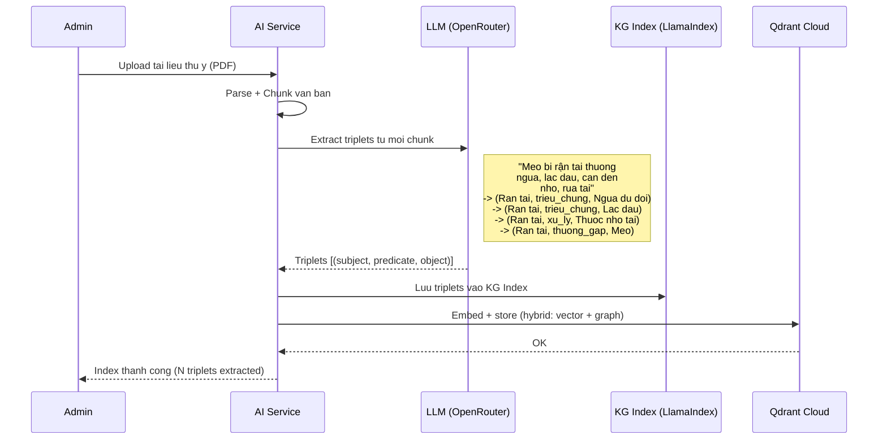
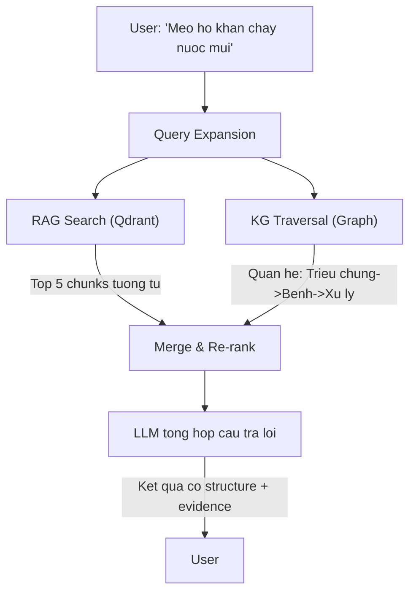
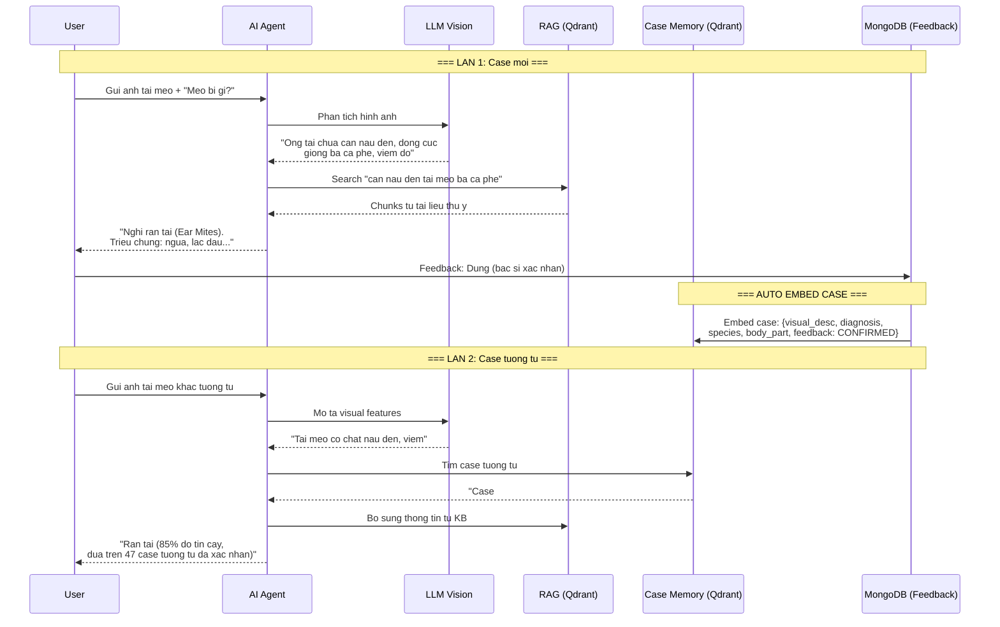
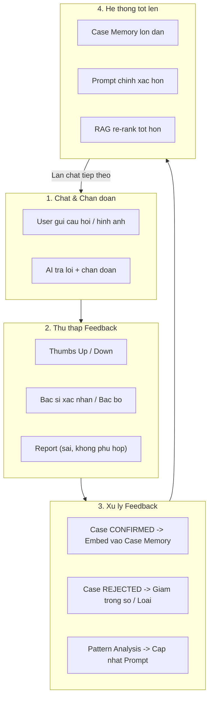
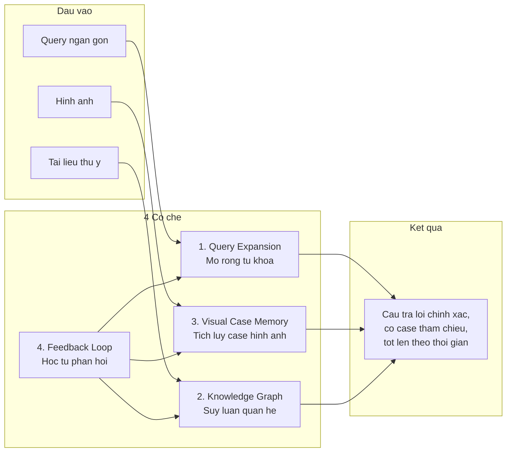

# AI Agent - Data Management & Continuous Improvement Strategy

**Muc dich:** Giai thich cach AI Agent luu tru du lieu, cai thien theo thoi gian, va cac co che nang cao do chinh xac (Query Expansion, Knowledge Graph, Visual Case Memory, Feedback Loop).

**Ngay tao:** 2026-03-08
**Cap nhat:** 2026-03-11
**Tham chieu:** AI_SERVICE_TECHNICAL_SPECIFICATION.md Section 3.5, 3.6

---

## 1. 📊 KIẾN TRÚC LƯU TRỮ DỮ LIỆU

### 1.1 Vai trò từng Database

| Database | Mục đích | Dữ liệu lưu |
|----------|----------|-------------|
| **PostgreSQL** | Configuration & Governance | - Agent config (enabled, model, params)<br>- Tools metadata (enabled, schema)<br>- System Prompt versions<br>- Knowledge documents metadata<br>- API keys (encrypted) |
| **MongoDB** | Chat History & Audit Trail | - `ai_chat_sessions` (session_id, user_id, agent_name, timestamps)<br>- `ai_chat_messages` (role, content, metadata)<br>- ReAct trace (thoughts, tool_calls, observations)<br>- Sources & citations |
| **Qdrant Cloud** | Vector Search (RAG) | - Document chunks (embedded)<br>- Metadata (document_name, chunk_index)<br>- Similarity search index |

---

## 2. 🗄️ MONGODB SCHEMA - CHI TIẾT

### 2.1 Collection: `ai_chat_sessions`

**Purpose:** Lưu metadata của mỗi conversation session.

```json
{
  "_id": "ObjectId",
  "session_id": "uuid-v4",
  "user_id": "uuid",
  "user_role": "PET_OWNER | STAFF | CLINIC_MANAGER | CLINIC_OWNER | ADMIN",
  "agent_name": "petties-agent-v1",
  "started_at": "ISODate",
  "ended_at": "ISODate",
  "total_messages": 15,
  "total_tool_calls": 8,
  "status": "active | completed | error",
  "metadata": {
    "clinic_id": "uuid",  // Nếu user là clinic role
    "device": "mobile | web",
    "ip_address": "10.0.0.1",
    "user_agent": "Mozilla/5.0..."
  }
}
```

**Indexes:**
- `session_id` (unique)
- `user_id` (for querying user's sessions)
- `started_at` (for time-range queries)

---

### 2.2 Collection: `ai_chat_messages`

**Purpose:** Lưu từng message trong conversation + ReAct trace.

```json
{
  "_id": "ObjectId",
  "message_id": "uuid-v4",
  "session_id": "uuid",
  "role": "user | assistant | system",
  "content": "Text content của message",
  "timestamp": "ISODate",
  "metadata": {
    // ===== USER MESSAGE =====
    "user_input_type": "text | image | voice",
    "attachments": [
      {
        "type": "image",
        "url": "https://cloudinary.com/...",
        "filename": "pet_photo.jpg"
      }
    ],

    // ===== ASSISTANT MESSAGE (AI RESPONSE) =====
    "react_trace": {
      "iterations": [
        {
          "iteration": 1,
          "thought": "Người dùng muốn đặt lịch, cần biết họ có pet nào",
          "action": {
            "tool_name": "get_user_pets",
            "parameters": {"user_id": "uuid"},
            "timestamp": "ISODate"
          },
          "observation": {
            "result": {...},
            "success": true,
            "execution_time_ms": 250
          }
        },
        {
          "iteration": 2,
          "thought": "User chọn pet Max, cần tìm clinic gần",
          "action": {
            "tool_name": "search_clinics_nearby",
            "parameters": {...}
          },
          "observation": {...}
        }
      ],
      "total_iterations": 2,
      "final_decision": "generate_answer"
    },

    "sources": [
      {
        "type": "rag_document",
        "document_name": "Pet_Care_Guide.pdf",
        "chunk_index": 12,
        "score": 0.85,
        "content_preview": "Chó Golden Retriever cần..."
      },
      {
        "type": "api_call",
        "endpoint": "/api/clinics/nearby",
        "response_summary": "Found 5 clinics"
      }
    ],

    "confidence": 0.92,
    "tokens_used": 450,
    "response_time_ms": 1250
  }
}
```

**Indexes:**
- `session_id` (for fetching all messages in session)
- `timestamp` (for chronological order)
- `metadata.react_trace.iterations.action.tool_name` (for analytics)

---

### 2.3 Collection: `chat_feedback` (Optional - cho improvement)

**Purpose:** Lưu feedback từ users để cải thiện AI.

```json
{
  "_id": "ObjectId",
  "message_id": "uuid",
  "session_id": "uuid",
  "user_id": "uuid",
  "feedback_type": "thumbs_up | thumbs_down | report",
  "feedback_reason": "incorrect_info | unhelpful | offensive | other",
  "feedback_text": "User's detailed feedback",
  "timestamp": "ISODate"
}
```

---

## 3. 🔄 AI AGENT CẢI THIỆN THEO THỜI GIAN

### 3.1 Vòng Cải Thiện (Improvement Loop)



---

### 3.2 Các Chỉ Số Quan Trọng (KPIs)

| Metric | Cách Tính | Mục Tiêu |
|--------|-----------|----------|
| **Tool Success Rate** | `successful_tool_calls / total_tool_calls` | > 95% |
| **User Satisfaction** | `thumbs_up / (thumbs_up + thumbs_down)` | > 80% |
| **Average Response Time** | `sum(response_time_ms) / total_messages` | < 2000ms |
| **RAG Relevance Score** | `average(rag_chunk_scores)` | > 0.7 |
| **Booking Completion Rate** | `successful_bookings / booking_attempts` | > 70% |
| **Error Rate** | `error_messages / total_messages` | < 5% |

**Query MongoDB để tính:**
```javascript
// Tool Success Rate
db.ai_chat_messages.aggregate([
  { $match: { "metadata.react_trace": { $exists: true } } },
  { $unwind: "$metadata.react_trace.iterations" },
  { $group: {
      _id: null,
      total: { $sum: 1 },
      successful: { $sum: {
        $cond: ["$metadata.react_trace.iterations.observation.success", 1, 0]
      }}
  }},
  { $project: { success_rate: { $divide: ["$successful", "$total"] } }}
])
```

---

### 3.3 Cải Thiện System Prompt

**Dựa trên Chat History Analysis:**

#### Before (Generic Prompt):
```
Bạn là AI assistant giúp đặt lịch khám thú cưng.
```

#### After (Optimized - dựa trên patterns):
```
Bạn là AI assistant chuyên nghiệp hỗ trợ đặt lịch khám thú cưng.

KHI NGƯỜI DÙNG HỎI VỀ ĐẶT LỊCH:
1. Luôn hỏi về loại thú cưng và tên TRƯỚC (92% users quên cung cấp)
2. Suggest services phổ biến: Grooming (45%), Vaccination (30%), Checkup (15%)
3. Ưu tiên clinics rating > 4.5 và distance < 3km (80% user preference)

KHI KHÔNG TÌM THẤY CLINIC:
- Đề xuất mở rộng bán kính tìm kiếm
- Suggest booking online + home visit nếu có

TONE: Thân thiện, rõ ràng, không dài dòng. Luôn dùng emojis 🐕🐈🏥
```

**Cách Update:**
- Admin vào `/admin/ai/agent-config` → Edit System Prompt
- Tạo version mới (không ghi đè prompt cũ)
- Test với 20 câu hỏi chuẩn trước khi activate
- A/B test: 50% traffic dùng prompt mới, 50% dùng prompt cũ
- Monitor metrics 7 ngày → chọn prompt tốt hơn

---

### 3.4 Cải Thiện RAG (Knowledge Base)

**Strategies:**

#### A. Identify Low-Quality Chunks
```python
# Query MongoDB tìm messages có RAG score thấp
low_score_queries = db.ai_chat_messages.find({
    "metadata.sources.type": "rag_document",
    "metadata.sources.score": { "$lt": 0.5 }
})
```

**Action:**
- Review documents có score thấp
- Re-chunk với strategy khác (smaller/larger chunks)
- Bổ sung documents cho topics thiếu

#### B. Add New Documents
```
Admin uploads "Chăm sóc chó Alaska.pdf"
→ AI Service chunks + embeds
→ Upsert to Qdrant
→ Available immediately cho queries
```

#### C. Update Existing Documents
```
Khi có thông tin mới (e.g., vaccine schedule thay đổi):
1. Delete old document vectors từ Qdrant
2. Upload document mới
3. Re-index
4. Notify users via system message
```

---

### 3.5 Cải Thiện Tools

**Dựa trên Tool Call Analysis:**

#### Example: `search_clinics_nearby` optimization

**Before (Generic):**
```python
# Always returns top 5 clinics sorted by distance
return clinics[:5]
```

**After (Intelligent - dựa trên user behavior):**
```python
# Analysis shows users prefer:
# - Rating > 4.5: 80%
# - Distance < 3km: 70%
# - Has SOS service: 60% (for emergency cases)

# Weighted scoring
for clinic in clinics:
    score = (
        clinic.distance_km * -0.3 +     # Closer is better
        clinic.rating * 0.5 +            # Higher rating preferred
        (1.0 if clinic.has_sos else 0) * 0.2
    )
    clinic.relevance_score = score

# Return top 5 by relevance_score
return sorted(clinics, key=lambda c: c.relevance_score, reverse=True)[:5]
```

---

### 3.6 Model Selection Strategy

**Dynamic Model Switching dựa trên task:**

| Task | Model | Reason |
|------|-------|--------|
| Simple Q&A (RAG) | `gemini-2.0-flash-lite` (free) | Fast, cheap, sufficient |
| Booking Flow | `llama-3.3-70b-instruct` | Better reasoning |
| Image Analysis | `claude-3.5-sonnet` | Best vision capability |
| Complex Reasoning | `gpt-4o` | Highest accuracy |

**Auto-Switch Logic:**
```python
if "booking" in user_message or tool_calls > 3:
    model = "llama-3.3-70b-instruct"
elif has_image_attachment:
    model = "claude-3.5-sonnet"
elif confidence_required > 0.9:
    model = "gpt-4o"
else:
    model = "gemini-2.0-flash-lite"  # Default
```

---

## 4. 📈 CONTINUOUS MONITORING

### 4.1 Real-time Dashboards (Admin)

**Admin Dashboard Page: `/admin/ai/analytics`**

**Widgets:**
1. **Today's Activity:**
   - Total messages: 1,234
   - Tool calls: 456
   - Avg response time: 1.2s

2. **Tool Performance:**
   - `get_user_pets`: 98% success
   - `search_clinics_nearby`: 95% success
   - `create_booking_for_user`: 85% success ⚠️ (needs investigation)

3. **User Satisfaction:**
   - 👍 Thumbs up: 420 (82%)
   - 👎 Thumbs down: 92 (18%)
   - Top complaints: "Slow response", "Clinic not found"

4. **RAG Quality:**
   - Avg relevance score: 0.78 ✅
   - Low score queries (< 0.5): 23 ⚠️
   - Most searched topics: "Grooming tips", "Vaccination schedule"

---

### 4.2 Alerting System

**Auto-alerts khi metrics vượt threshold:**

```yaml
alerts:
  - name: "Tool Success Rate Drop"
    condition: tool_success_rate < 0.9
    action: Email admin + Slack notification

  - name: "High Error Rate"
    condition: error_rate > 0.1
    action: Auto-disable agent + notify admin

  - name: "Slow Response Time"
    condition: avg_response_time_ms > 3000
    action: Switch to faster model
```

---

## 5. 🎯 IMPLEMENTATION ROADMAP

### Phase 1: MongoDB Setup (URGENT - chưa có)
- [ ] Add MongoDB config vào `settings.py`
- [ ] Create collections: `ai_chat_sessions`, `ai_chat_messages`
- [ ] Implement save logic trong WebSocket handler
- [ ] Test: chat → verify data in MongoDB

### Phase 2: Metrics Collection
- [ ] Implement KPI calculation queries
- [ ] Create analytics API endpoints
- [ ] Build Admin Dashboard (React)

### Phase 3: Feedback Loop
- [ ] Add 👍👎 buttons trong chat UI
- [ ] Save feedback to MongoDB
- [ ] Weekly review meeting với team

### Phase 4: Automated Optimization
- [ ] Prompt version A/B testing
- [ ] Auto-detect low-performing tools
- [ ] RAG document quality scoring

---

## 6. 🚀 EXPECTED IMPROVEMENTS

**After 3 months of data collection:**

| Metric | Before | After | Improvement |
|--------|--------|-------|-------------|
| Booking Success Rate | 60% | 85% | +25% |
| Avg Response Time | 2.5s | 1.2s | -52% |
| User Satisfaction | 70% | 88% | +18% |
| Tool Success Rate | 90% | 97% | +7% |

**Key Success Factors:**
1. Continuous monitoring va rapid iteration
2. User feedback integration vao prompt optimization
3. RAG knowledge base duoc update thuong xuyen
4. Tool performance tuning dua tren real usage patterns

---

## 7. QUERY EXPANSION - MO RONG TRUY VAN TU DONG

### 7.1 Van de

Bac si/nguoi dung thuong hoi ngan gon: "cho non bo an", "meo ho khan", "cho bi ghe". RAG search voi query ngan nhu vay co the bo sot tai lieu lien quan vi thieu tu khoa dong nghia va context.

### 7.2 Giai phap: LLM Query Rewriting

Truoc khi goi `pet_knowledge_search`, Agent su dung LLM de mo rong query:

```
Input:  "cho non bo an"
         |
    LLM Rewrite
         |
Output: "cho non mua oi chan an bieng an nguyen nhan 
         viem da day ngo doc parvo giun san"
```

### 7.3 Cach hoat dong trong ReAct Flow



### 7.4 Chien luoc Rewrite

| Ky thuat | Mo ta | Vi du |
|----------|-------|-------|
| **Synonym Expansion** | Them tu dong nghia thu y | "non" -> "non mua, oi, noi" |
| **Species Context** | Them context loai vat | "cho" -> giong cho, do tuoi pho bien |
| **Symptom Clustering** | Nhom trieu chung lien quan | "non + bo an" -> nghi ngo tieu hoa, ngo doc |
| **Medical Term Mapping** | Map sang thuat ngu chuyen mon | "ghe" -> "Sarcoptic mange, Demodex" |

### 7.5 Implementation

```python
# Trong pet_knowledge_search tool
async def pet_knowledge_search(query: str, pet_type: str = None, ...):
    # Buoc 1: Query Expansion (neu query ngan)
    if len(query.split()) < 5:
        expanded = await _expand_query(query, pet_type)
    else:
        expanded = query
    
    # Buoc 2: Search voi expanded query
    results = await rag_engine.query(expanded, top_k=top_k)
    return results

async def _expand_query(query: str, pet_type: str = None) -> str:
    """Dung LLM de mo rong query ngan thanh query day du hon."""
    prompt = f"""Mo rong query tim kiem thu y sau thanh cau hoi day du hon.
    Them tu dong nghia, thuat ngu chuyen mon, trieu chung lien quan.
    Chi tra ve query da mo rong, khong giai thich.
    
    Query goc: {query}
    Loai thu cung: {pet_type or 'khong ro'}"""
    
    expanded = await llm_call(prompt)
    return f"{query} {expanded}"  # Giu nguyen query goc + bo sung
```

---

## 8. KNOWLEDGE GRAPH - DO THI TRI THUC THU Y

### 8.1 Tai sao can Knowledge Graph?

RAG thuan tuy chi tim chunk van ban tuong tu ve ngu nghia. Nhung nhieu case thu y can **suy luan chuoi**:

```
Vi du: "Meo ho khan 3 ngay, chay nuoc mui"

RAG thuan:  Tim chunk co "ho khan" + "chay mui" -> tra ket qua gan nhat
KG bo sung:  Duyet graph:
             Ho khan --chi_diem--> Viem mui hong
             Chay nuoc mui --chi_diem--> Viem mui hong  
             Viem mui hong --thuong_gap_o--> Meo
             Viem mui hong --xu_ly--> Khang sinh + Giu am + Kham bac si
             -> Tra loi co cau truc va logic hon
```

### 8.2 Kien truc Knowledge Graph



### 8.3 Cach xay KG tu tai lieu thu y



### 8.4 Hybrid Query: RAG + Knowledge Graph

Khi user hoi, he thong ket hop 2 nguon:



**Loi ich Hybrid Query:**

| Chi tieu | RAG thuan | RAG + KG |
|----------|-----------|----------|
| Cau hoi don gian | Tot | Tuong duong |
| Cau hoi nhieu trieu chung | Tim chunk gan nhat | Suy luan chuoi, chinh xac hon |
| Case hiem gap | Co the khong tim thay | Suy luan tu quan he da biet |
| Giai thich ket qua | Trich dan chunk | Trinh bay logic: A -> B -> C |

### 8.5 Implementation voi LlamaIndex

```python
from llama_index.core import KnowledgeGraphIndex, ServiceContext
from llama_index.core.graph_stores import SimpleGraphStore

# Buoc 1: Tao KG Index tu documents
graph_store = SimpleGraphStore()  # Hoac Neo4j neu can scale
kg_index = KnowledgeGraphIndex.from_documents(
    documents,
    max_triplets_per_chunk=10,
    include_embeddings=True,
    graph_store=graph_store,
)

# Buoc 2: Query KG
query_engine = kg_index.as_query_engine(
    include_text=True,      # Kem theo text goc
    response_mode="tree_summarize",
    embedding_mode="hybrid",  # Vector + Graph
)

response = query_engine.query("Meo ho khan chay nuoc mui la benh gi?")
# -> Tra ve: benh + quan he + evidence tu graph
```

### 8.6 Roadmap Knowledge Graph

| Phase | Thoi gian | Noi dung |
|-------|-----------|----------|
| **Phase 1 (Hien tai)** | MVP | RAG thuan (LlamaIndex + Qdrant + Cohere) |
| **Phase 2** | 1-2 thang sau go-live | LlamaIndex KnowledgeGraphIndex + SimpleGraphStore |
| **Phase 3** | 6+ thang | Neo4j backend + quan he phuc tap + auto-update tu feedback |

---

## 9. VISUAL CASE MEMORY - TRI THUC TU HINH ANH

### 9.1 Van de

Lan dau user gui anh (vd: tai meo bi can den), LLM Vision phan tich nhung chua co case tham chieu. Lan sau gap anh tuong tu, he thong van phai phan tich tu dau, khong hoc duoc tu lan truoc.

### 9.2 Giai phap: Visual Case Memory

Moi lan chan doan qua hinh anh, he thong:
1. LLM Vision mo ta visual features thanh text
2. Ket hop voi chan doan + feedback
3. Embed text description vao Qdrant (collection `petties_case_memory`)
4. Lan sau gap anh tuong tu -> tim case da confirm -> tra loi chinh xac hon

### 9.3 Flow chi tiet



### 9.4 Schema Case Memory trong Qdrant

```json
{
  "collection": "petties_case_memory",
  "vector": "[1024-dim Cohere embedding cua visual_description + diagnosis]",
  "payload": {
    "case_id": "uuid",
    "session_id": "uuid",
    "message_id": "uuid",
    "visual_description": "Ong tai meo chua nhieu can ban nau den, dong cuc giong ba ca phe, vung da xung quanh viem do",
    "user_description": "Meo nha em bi ngua tai, hay gai",
    "diagnosis": "Ran tai (Otodectes cynotis)",
    "species": "meo",
    "body_part": "tai",
    "symptoms": ["ngua", "can nau den", "lac dau"],
    "treatment": "Thuoc nho tai + Ve sinh tai + Kham bac si",
    "feedback_type": "confirmed",
    "feedback_count": 47,
    "confidence_score": 0.85,
    "vet_verified": true,
    "created_at": "2026-03-11T10:00:00Z",
    "last_confirmed_at": "2026-03-11T10:00:00Z"
  }
}
```

### 9.5 Feedback-weighted Retrieval

Case duoc xac nhan dung nhieu lan se co score cao hon khi retrieval:

```python
# Khi search case memory
results = case_memory_collection.search(
    query_vector=embed(visual_description),
    limit=5,
    score_threshold=0.7,
)

# Re-rank dua tren feedback
for result in results:
    base_score = result.score  # Cosine similarity
    feedback_boost = min(result.payload["feedback_count"] / 100, 0.3)
    vet_boost = 0.1 if result.payload["vet_verified"] else 0
    
    result.final_score = base_score + feedback_boost + vet_boost
    # Case confirmed 50 lan boi bac si: +0.3 + 0.1 = +0.4 boost

results.sort(key=lambda r: r.final_score, reverse=True)
```

### 9.6 Do chinh xac tang theo thoi gian

```
Thang 1:    10 cases  -> Do chinh xac: ~60% (it case tham chieu)
Thang 3:   100 cases  -> Do chinh xac: ~75% (nhieu case pho bien)
Thang 6:   500 cases  -> Do chinh xac: ~85% (phu rong benh thuong gap)
Thang 12: 2000 cases  -> Do chinh xac: ~92% (bao gom ca case hiem)
```

| Giai doan | So cases | Chat luong |
|-----------|----------|------------|
| Khoi dau | 0-50 | Dua vao tai lieu + LLM general knowledge |
| Tich luy | 50-500 | Co case thuc te de tham chieu, bat dau chinh xac hon |
| Truong thanh | 500-5000 | Phu hau het benh thuong gap, do tin cay cao |
| Chuyen gia | 5000+ | Xu ly duoc ca case hiem, co the de xuat phuong an dieu tri |

---

## 10. FEEDBACK LOOP CHI TIET - VONG LAP PHAN HOI

### 10.1 Tong quan

Feedback Loop la co che quan trong nhat de he thong tot len theo thoi gian. Moi case deu duoc danh gia, va ket qua danh gia anh huong truc tiep den chat luong tra loi lan sau.

### 10.2 Flow Feedback



### 10.3 API Endpoints

```
POST /chat/feedback
Body: {
    "message_id": "uuid",
    "session_id": "uuid", 
    "feedback_type": "thumbs_up | thumbs_down | report",
    "feedback_reason": "incorrect_info | unhelpful | offensive | other",
    "feedback_text": "Noi dung gop y chi tiet (optional)"
}
Response: { "status": "saved", "case_embedded": true/false }
```

### 10.4 Auto-embed Case Flow

Khi nhan feedback "thumbs_up" hoac bac si xac nhan:

```python
async def process_positive_feedback(message_id: str, feedback: dict):
    # 1. Lay message goc tu MongoDB
    message = await get_chat_message(message_id)
    
    # 2. Extract case information
    case = {
        "visual_description": message.metadata.get("visual_description", ""),
        "user_query": message.content,
        "diagnosis": extract_diagnosis(message.metadata["react_trace"]),
        "sources": message.metadata.get("sources", []),
        "species": infer_species(message),
        "symptoms": extract_symptoms(message),
        "treatment": extract_treatment(message),
        "feedback_type": "confirmed",
    }
    
    # 3. Embed vao Qdrant case memory
    text_to_embed = f"{case['visual_description']} {case['diagnosis']} {case['symptoms']}"
    await case_memory.upsert(case_id, embed(text_to_embed), case)
    
    # 4. Update feedback count neu case da ton tai
    existing = await case_memory.search_similar(text_to_embed, threshold=0.95)
    if existing:
        await case_memory.update_feedback_count(existing[0].id)
```

### 10.5 Periodic Maintenance

| Tan suat | Hanh dong | Muc dich |
|----------|-----------|----------|
| Hang ngay | Embed confirmed cases vao Qdrant | Case Memory lon dan |
| Hang tuan | Review cases bi thumbs_down | Phat hien van de prompt/RAG |
| Hang thang | Prune cases co score thap + feedback_count = 0 | Tranh nhieu vector store |
| Hang quy | Re-rank toan bo case memory | Dam bao case tot nhat duoc uu tien |

---

## 11. TONG KET: 4 CO CHE CAI THIEN DO CHINH XAC



**Tom tat 1 cau:** He thong AI cua Petties hoat dong theo vong lap **Collect -> Analyze -> Improve -> Deploy**: moi cuoc hoi thoai deu duoc luu lai voi day du reasoning trace va feedback, knowledge base duoc mo rong lien tuc qua upload tai lieu moi va tich luy case thuc te da xac nhan, system prompt duoc version hoa va tinh chinh dua tren data thuc, con du lieu nghiep vu (phong kham, slot, vaccine) thi Agent query truc tiep DB nen luon realtime. **Cang nhieu case tich luy, AI cang co nhieu tri thuc tham chieu thuc te de tra loi chinh xac hon.**
