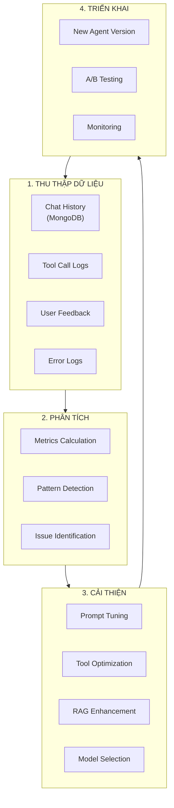

# AI Agent - Data Management & Continuous Improvement Strategy

**Mục đích:** Giải thích cách AI Agent lưu trữ dữ liệu và cải thiện theo thời gian.

**Ngày tạo:** 2026-03-08
**Tham chiếu:** AI_SERVICE_TECHNICAL_SPECIFICATION.md Section 3.5, 3.6

---

## 1. 📊 KIẾN TRÚC LƯU TRỮ DỮ LIỆU

### 1.1 Vai trò từng Database

| Database | Mục đích | Dữ liệu lưu |
|----------|----------|-------------|
| **PostgreSQL** | Configuration & Governance | - Agent config (enabled, model, params)<br>- Tools metadata (enabled, schema)<br>- System Prompt versions<br>- Knowledge documents metadata<br>- API keys (encrypted) |
| **MongoDB** | Chat History & Audit Trail | - `ai_chat_sessions` (session_id, user_id, agent_name, timestamps)<br>- `ai_chat_messages` (role, content, metadata)<br>- ReAct trace (thoughts, tool_calls, observations)<br>- Sources & citations |
| **Qdrant Cloud** | Vector Search (RAG) | - Document chunks (embedded)<br>- Metadata (document_name, chunk_index)<br>- Similarity search index |

---

## 2. 🗄️ MONGODB SCHEMA - CHI TIẾT

### 2.1 Collection: `ai_chat_sessions`

**Purpose:** Lưu metadata của mỗi conversation session.

```json
{
  "_id": "ObjectId",
  "session_id": "uuid-v4",
  "user_id": "uuid",
  "user_role": "PET_OWNER | STAFF | CLINIC_MANAGER | CLINIC_OWNER | ADMIN",
  "agent_name": "petties-agent-v1",
  "started_at": "ISODate",
  "ended_at": "ISODate",
  "total_messages": 15,
  "total_tool_calls": 8,
  "status": "active | completed | error",
  "metadata": {
    "clinic_id": "uuid",  // Nếu user là clinic role
    "device": "mobile | web",
    "ip_address": "10.0.0.1",
    "user_agent": "Mozilla/5.0..."
  }
}
```

**Indexes:**
- `session_id` (unique)
- `user_id` (for querying user's sessions)
- `started_at` (for time-range queries)

---

### 2.2 Collection: `ai_chat_messages`

**Purpose:** Lưu từng message trong conversation + ReAct trace.

```json
{
  "_id": "ObjectId",
  "message_id": "uuid-v4",
  "session_id": "uuid",
  "role": "user | assistant | system",
  "content": "Text content của message",
  "timestamp": "ISODate",
  "metadata": {
    // ===== USER MESSAGE =====
    "user_input_type": "text | image | voice",
    "attachments": [
      {
        "type": "image",
        "url": "https://cloudinary.com/...",
        "filename": "pet_photo.jpg"
      }
    ],

    // ===== ASSISTANT MESSAGE (AI RESPONSE) =====
    "react_trace": {
      "iterations": [
        {
          "iteration": 1,
          "thought": "Người dùng muốn đặt lịch, cần biết họ có pet nào",
          "action": {
            "tool_name": "get_user_pets",
            "parameters": {"user_id": "uuid"},
            "timestamp": "ISODate"
          },
          "observation": {
            "result": {...},
            "success": true,
            "execution_time_ms": 250
          }
        },
        {
          "iteration": 2,
          "thought": "User chọn pet Max, cần tìm clinic gần",
          "action": {
            "tool_name": "search_clinics_nearby",
            "parameters": {...}
          },
          "observation": {...}
        }
      ],
      "total_iterations": 2,
      "final_decision": "generate_answer"
    },

    "sources": [
      {
        "type": "rag_document",
        "document_name": "Pet_Care_Guide.pdf",
        "chunk_index": 12,
        "score": 0.85,
        "content_preview": "Chó Golden Retriever cần..."
      },
      {
        "type": "api_call",
        "endpoint": "/api/clinics/nearby",
        "response_summary": "Found 5 clinics"
      }
    ],

    "confidence": 0.92,
    "tokens_used": 450,
    "response_time_ms": 1250
  }
}
```

**Indexes:**
- `session_id` (for fetching all messages in session)
- `timestamp` (for chronological order)
- `metadata.react_trace.iterations.action.tool_name` (for analytics)

---

### 2.3 Collection: `chat_feedback` (Optional - cho improvement)

**Purpose:** Lưu feedback từ users để cải thiện AI.

```json
{
  "_id": "ObjectId",
  "message_id": "uuid",
  "session_id": "uuid",
  "user_id": "uuid",
  "feedback_type": "thumbs_up | thumbs_down | report",
  "feedback_reason": "incorrect_info | unhelpful | offensive | other",
  "feedback_text": "User's detailed feedback",
  "timestamp": "ISODate"
}
```

---

## 3. 🔄 AI AGENT CẢI THIỆN THEO THỜI GIAN

### 3.1 Vòng Cải Thiện (Improvement Loop)



---

### 3.2 Các Chỉ Số Quan Trọng (KPIs)

| Metric | Cách Tính | Mục Tiêu |
|--------|-----------|----------|
| **Tool Success Rate** | `successful_tool_calls / total_tool_calls` | > 95% |
| **User Satisfaction** | `thumbs_up / (thumbs_up + thumbs_down)` | > 80% |
| **Average Response Time** | `sum(response_time_ms) / total_messages` | < 2000ms |
| **RAG Relevance Score** | `average(rag_chunk_scores)` | > 0.7 |
| **Booking Completion Rate** | `successful_bookings / booking_attempts` | > 70% |
| **Error Rate** | `error_messages / total_messages` | < 5% |

**Query MongoDB để tính:**
```javascript
// Tool Success Rate
db.ai_chat_messages.aggregate([
  { $match: { "metadata.react_trace": { $exists: true } } },
  { $unwind: "$metadata.react_trace.iterations" },
  { $group: {
      _id: null,
      total: { $sum: 1 },
      successful: { $sum: {
        $cond: ["$metadata.react_trace.iterations.observation.success", 1, 0]
      }}
  }},
  { $project: { success_rate: { $divide: ["$successful", "$total"] } }}
])
```

---

### 3.3 Cải Thiện System Prompt

**Dựa trên Chat History Analysis:**

#### Before (Generic Prompt):
```
Bạn là AI assistant giúp đặt lịch khám thú cưng.
```

#### After (Optimized - dựa trên patterns):
```
Bạn là AI assistant chuyên nghiệp hỗ trợ đặt lịch khám thú cưng.

KHI NGƯỜI DÙNG HỎI VỀ ĐẶT LỊCH:
1. Luôn hỏi về loại thú cưng và tên TRƯỚC (92% users quên cung cấp)
2. Suggest services phổ biến: Grooming (45%), Vaccination (30%), Checkup (15%)
3. Ưu tiên clinics rating > 4.5 và distance < 3km (80% user preference)

KHI KHÔNG TÌM THẤY CLINIC:
- Đề xuất mở rộng bán kính tìm kiếm
- Suggest booking online + home visit nếu có

TONE: Thân thiện, rõ ràng, không dài dòng. Luôn dùng emojis 🐕🐈🏥
```

**Cách Update:**
- Admin vào `/admin/ai/agent-config` → Edit System Prompt
- Tạo version mới (không ghi đè prompt cũ)
- Test với 20 câu hỏi chuẩn trước khi activate
- A/B test: 50% traffic dùng prompt mới, 50% dùng prompt cũ
- Monitor metrics 7 ngày → chọn prompt tốt hơn

---

### 3.4 Cải Thiện RAG (Knowledge Base)

**Strategies:**

#### A. Identify Low-Quality Chunks
```python
# Query MongoDB tìm messages có RAG score thấp
low_score_queries = db.ai_chat_messages.find({
    "metadata.sources.type": "rag_document",
    "metadata.sources.score": { "$lt": 0.5 }
})
```

**Action:**
- Review documents có score thấp
- Re-chunk với strategy khác (smaller/larger chunks)
- Bổ sung documents cho topics thiếu

#### B. Add New Documents
```
Admin uploads "Chăm sóc chó Alaska.pdf"
→ AI Service chunks + embeds
→ Upsert to Qdrant
→ Available immediately cho queries
```

#### C. Update Existing Documents
```
Khi có thông tin mới (e.g., vaccine schedule thay đổi):
1. Delete old document vectors từ Qdrant
2. Upload document mới
3. Re-index
4. Notify users via system message
```

---

### 3.5 Cải Thiện Tools

**Dựa trên Tool Call Analysis:**

#### Example: `search_clinics_nearby` optimization

**Before (Generic):**
```python
# Always returns top 5 clinics sorted by distance
return clinics[:5]
```

**After (Intelligent - dựa trên user behavior):**
```python
# Analysis shows users prefer:
# - Rating > 4.5: 80%
# - Distance < 3km: 70%
# - Has SOS service: 60% (for emergency cases)

# Weighted scoring
for clinic in clinics:
    score = (
        clinic.distance_km * -0.3 +     # Closer is better
        clinic.rating * 0.5 +            # Higher rating preferred
        (1.0 if clinic.has_sos else 0) * 0.2
    )
    clinic.relevance_score = score

# Return top 5 by relevance_score
return sorted(clinics, key=lambda c: c.relevance_score, reverse=True)[:5]
```

---

### 3.6 Model Selection Strategy

**Dynamic Model Switching dựa trên task:**

| Task | Model | Reason |
|------|-------|--------|
| Simple Q&A (RAG) | `gemini-2.0-flash-lite` (free) | Fast, cheap, sufficient |
| Booking Flow | `llama-3.3-70b-instruct` | Better reasoning |
| Image Analysis | `claude-3.5-sonnet` | Best vision capability |
| Complex Reasoning | `gpt-4o` | Highest accuracy |

**Auto-Switch Logic:**
```python
if "booking" in user_message or tool_calls > 3:
    model = "llama-3.3-70b-instruct"
elif has_image_attachment:
    model = "claude-3.5-sonnet"
elif confidence_required > 0.9:
    model = "gpt-4o"
else:
    model = "gemini-2.0-flash-lite"  # Default
```

---

## 4. 📈 CONTINUOUS MONITORING

### 4.1 Real-time Dashboards (Admin)

**Admin Dashboard Page: `/admin/ai/analytics`**

**Widgets:**
1. **Today's Activity:**
   - Total messages: 1,234
   - Tool calls: 456
   - Avg response time: 1.2s

2. **Tool Performance:**
   - `get_user_pets`: 98% success
   - `search_clinics`: 95% success
   - `create_booking`: 85% success ⚠️ (needs investigation)

3. **User Satisfaction:**
   - 👍 Thumbs up: 420 (82%)
   - 👎 Thumbs down: 92 (18%)
   - Top complaints: "Slow response", "Clinic not found"

4. **RAG Quality:**
   - Avg relevance score: 0.78 ✅
   - Low score queries (< 0.5): 23 ⚠️
   - Most searched topics: "Grooming tips", "Vaccination schedule"

---

### 4.2 Alerting System

**Auto-alerts khi metrics vượt threshold:**

```yaml
alerts:
  - name: "Tool Success Rate Drop"
    condition: tool_success_rate < 0.9
    action: Email admin + Slack notification

  - name: "High Error Rate"
    condition: error_rate > 0.1
    action: Auto-disable agent + notify admin

  - name: "Slow Response Time"
    condition: avg_response_time_ms > 3000
    action: Switch to faster model
```

---

## 5. 🎯 IMPLEMENTATION ROADMAP

### Phase 1: MongoDB Setup (URGENT - chưa có)
- [ ] Add MongoDB config vào `settings.py`
- [ ] Create collections: `ai_chat_sessions`, `ai_chat_messages`
- [ ] Implement save logic trong WebSocket handler
- [ ] Test: chat → verify data in MongoDB

### Phase 2: Metrics Collection
- [ ] Implement KPI calculation queries
- [ ] Create analytics API endpoints
- [ ] Build Admin Dashboard (React)

### Phase 3: Feedback Loop
- [ ] Add 👍👎 buttons trong chat UI
- [ ] Save feedback to MongoDB
- [ ] Weekly review meeting với team

### Phase 4: Automated Optimization
- [ ] Prompt version A/B testing
- [ ] Auto-detect low-performing tools
- [ ] RAG document quality scoring

---

## 6. 🚀 EXPECTED IMPROVEMENTS

**After 3 months of data collection:**

| Metric | Before | After | Improvement |
|--------|--------|-------|-------------|
| Booking Success Rate | 60% | 85% | +25% |
| Avg Response Time | 2.5s | 1.2s | -52% |
| User Satisfaction | 70% | 88% | +18% |
| Tool Success Rate | 90% | 97% | +7% |

**Key Success Factors:**
1. ✅ Continuous monitoring và rapid iteration
2. ✅ User feedback integration vào prompt optimization
3. ✅ RAG knowledge base được update thường xuyên
4. ✅ Tool performance tuning dựa trên real usage patterns
