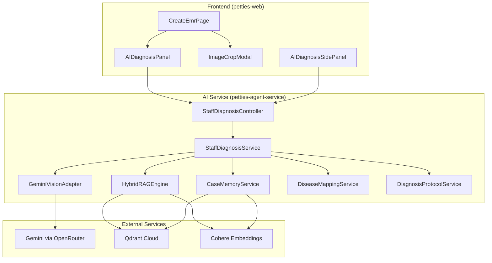
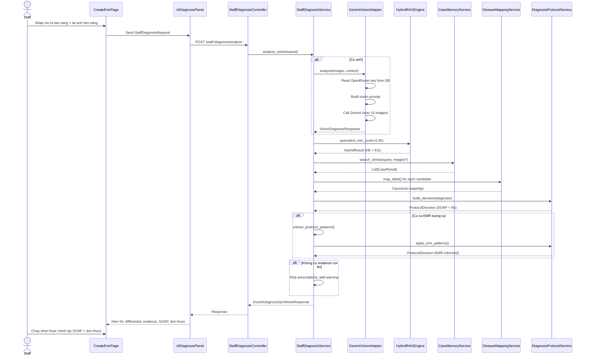
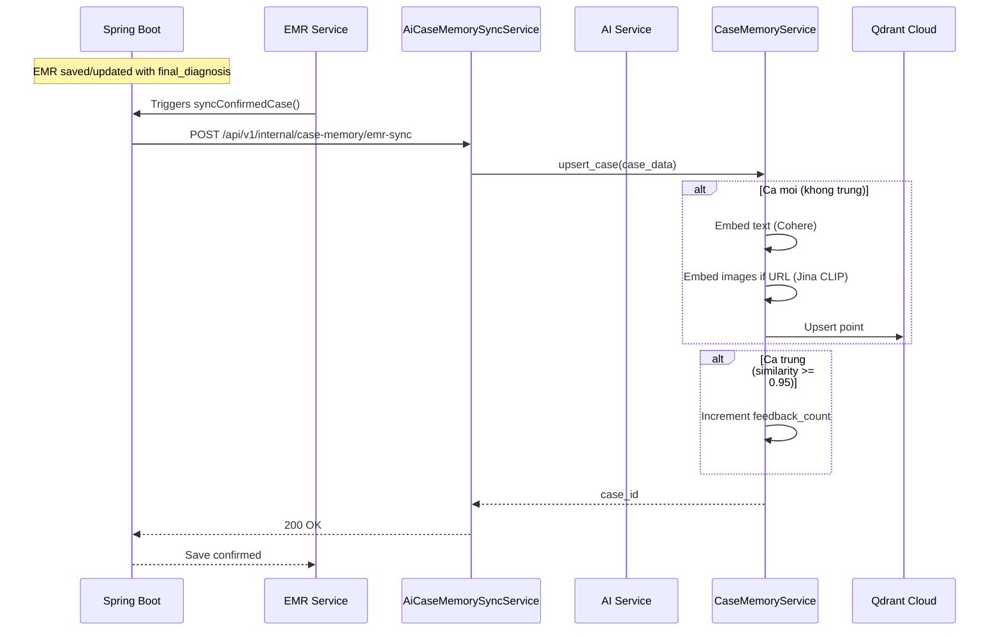

# AI Diagnosis Module - Complete Technical Documentation

> Last Updated: 2026-03-20
> Status: Complete - In Production
> Version: 1.0.0

---

## 1. Overview

### 1.1 Purpose

The AI Diagnosis module provides real-time clinical decision support for veterinary staff (`STAFF`, `ADMIN`) directly within the EMR workspace. It synthesizes patient data, clinical images, internal knowledge, and confirmed EMR cases to generate differential diagnoses, SOAP suggestions, and prescription drafts.

### 1.2 Key Principles

1. **No web search** in the doctor diagnostic flow.
2. **Internal data first**: Knowledge Base (KB), Knowledge Graph (KG), Case Memory from confirmed EMR.
3. **Learning from real cases**: Protocol patterns are extracted from confirmed EMR records, not hardcoded.
4. **Image understanding**: Gemini Vision analyzes clinical images for objective findings.
5. **Safety guardrails**: No prescription suggestions without sufficient internal evidence.

### 1.3 Architecture Overview



---

## 2. Components

### 2.1 Backend (AI Service)

#### 2.1.1 StaffDiagnosisController

**File:** `petties-agent-serivce/app/api/routes/staff_diagnosis.py`

Single endpoint for staff diagnosis:

```
POST /api/v1/staff-diagnosis/analyze
```

- **Auth:** Requires `STAFF` or `ADMIN` role (JWT Bearer token).
- **Input:** `StaffDiagnosisRequest` (see Section 3)
- **Output:** `DoctorDiagnosisSynthesisResponse` (see Section 3)

#### 2.1.2 StaffDiagnosisService

**File:** `petties-agent-serivce/app/core/services/staff_diagnosis_service.py`

Orchestrates the full diagnosis pipeline:

```
analyze_case(request)
  1. Analyze images via Gemini Vision (if image_urls provided)
  2. Build retrieval query from request + vision findings
  3. Query Hybrid RAG (KB + KG)
  4. Query Case Memory (confirmed EMR cases)
  5. Build top differentials (merge from vision, RAG, case memory)
  6. Extract protocol patterns from similar cases (Dynamic Protocol v3)
  7. Build SOAP suggestions + prescription protocol
  8. Generate follow-up questions
  9. Return synthesis response
```

Key methods:

| Method | Purpose |
|--------|---------|
| `analyze_case()` | Main orchestrator |
| `_analyze_vision()` | Call Gemini Vision for image analysis |
| `_query_hybrid_rag()` | Query KB + KG for clinical evidence |
| `_query_case_memory()` | Search similar confirmed EMR cases |
| `_build_top_differentials()` | Merge candidates from all sources |
| `_extract_protocol_patterns_from_cases()` | Dynamic Protocol v3: learn SOAP/prescriptions from EMR |
| `_build_soap_suggestions()` | Generate ready-to-apply SOAP drafts |
| `_generate_follow_up_questions()` | LLM-powered follow-up question generation |

#### 2.1.3 GeminiVisionAdapter

**File:** `petties-agent-serivce/app/core/vision/gemini_vision_adapter.py`

Analyzes clinical images using Gemini via OpenRouter:

```
analyze(request: GeminiVisionDiagnosisRequest)
  1. Read OpenRouter API key from DB system_settings
  2. Build vision prompt with clinical context
  3. Call Gemini with image URLs (up to 10, https or base64 data URLs)
  4. Parse response for visual findings, top conditions, image descriptions
  5. Map conditions through DiseaseMappingService
  6. Return GeminiVisionDiagnosisResponse
```

- **API key source:** `get_llm_client_from_db(db)` reads from `system_settings` table, not env vars.
- **Image format:** Accepts `https://` URLs or base64 `data:image/...;base64,` URLs. Skips `blob:` URLs.
- **CMYK images:** May fail to process (Gemini CLIP limitation). Not critical since KB images are not used in diagnosis flow.

#### 2.1.4 HybridRAGEngine

**File:** `petties-agent-serivce/app/core/rag/hybrid_engine.py`

Hybrid search combining:

- **Text RAG**: Cohere embed + Qdrant vector search from KB documents
- **Knowledge Graph**: Structured triplet retrieval from `SimpleGraphStore`
- **Deduplication**: RAG query deduplication at the retrieval level

```python
await hybrid_engine.query(
    query="...",
    top_k=5,
    min_score=0.45,
    pet_type="dog",
    enable_rag=True,
    enable_kg=True,
    enable_case_memory=False  # case memory is queried separately
)
```

#### 2.1.5 CaseMemoryService

**File:** `petties-agent-serivce/app/core/rag/case_memory.py`

Manages Qdrant collection `petties_case_memory_v2`:

| Method | Purpose |
|--------|---------|
| `initialize()` | Init Qdrant client + Cohere embed model from DB settings |
| `upsert_case()` | Embed and store EMR confirmed case with deduplication |
| `search_similar()` | Hybrid search (text + image), re-rank by feedback score |
| `update_feedback_count()` | Increment feedback on confirmed match |
| `delete_case()` | Remove case from Qdrant |
| `prune_low_score_cases()` | Cleanup old cases with no feedback |
| `list_cases()` | List cases with pagination and filters |
| `get_case()` | Get case detail by case_id |
| `update_case()` | Update case metadata |
| `get_stats()` | Collection statistics |

**Scoring formula:**
```
final_score = base_similarity
            + min(feedback_count / 100, 0.3)
            + (0.1 if vet_verified)
```

#### 2.1.6 DiseaseMappingService

**File:** `petties-agent-serivce/app/core/services/disease_mapping_service.py`

Maps raw disease labels to canonical codes from `disease_catalog` (PostgreSQL):

- Loads catalog + aliases from DB on startup
- TTL-based cache refresh (5 minutes)
- Keeps only cached DB snapshot in memory, without hardcoded fallback aliases
- Writes unmapped labels to `disease_mapping_review_items` queue
- Supports body system inference (eye, ear, skin)

#### 2.1.7 DiagnosisProtocolService

**File:** `petties-agent-serivce/app/core/services/diagnosis_protocol_service.py`

Builds treatment protocols aligned with the primary diagnosis:

- Safety gates: no prescriptions without internal evidence
- Weight-based dosage adjustment: `mg/kg` drugs require weight
- Body-system guards: fluorescein for eye, ear scope, skin cytology
- **Dynamic Protocol v3**: `apply_emr_patterns()` overrides hardcoded rules with patterns learned from similar EMR cases

### 2.2 Frontend (petties-web)

#### 2.2.1 AIDiagnosisPanel

**File:** `petties-web/src/components/emr/AIDiagnosisPanel.tsx`

Located in `CreateEmrPage`, adjacent to SOAP form:

**Input fields:**
- Clinical description (`doctor_description`)
- Body part selection (`body_part`)
- Image upload with crop capability
- Allergy indicators

**Actions:**
- `Phan tich` button → calls `POST /api/v1/staff-diagnosis/analyze`
- Apply individual SOAP suggestions to form fields
- Add individual prescriptions to the EMR prescription list
- Image crop via `ImageCropModal`

**Display:**
- Differential diagnoses with evidence sources
- Similar confirmed cases from Case Memory
- Vision image analysis (per-image descriptions)
- SOAP suggestions ready-to-apply
- Prescription suggestions with dosage, frequency, duration
- Follow-up questions
- Disclaimer

**Image flow:**
1. Staff uploads images → `pendingImagePreviews` (blob URLs)
2. Optional: crop images via `ImageCropModal` → base64 data URLs added to list
3. All URLs (blob + base64) sent to backend
4. Backend skips `blob:` URLs; expects `https://` or `data:image/...;base64,`
5. Response includes `image_analysis` array mapping URL → description

#### 2.2.2 ImageCropModal

**File:** `petties-web/src/components/emr/ImageCropModal.tsx`

Uses `react-image-crop` library:

- Staff selects crop region on image
- Canvas extracts cropped region as base64 PNG
- Cropped image added to `croppedImageUrls` array
- Merged with original `pendingImageUrls` before sending to AI

#### 2.2.3 AIInsightsPage

**File:** `petties-web/src/pages/admin/insights/AIInsightsPage.tsx`

Admin dashboard section for AI system management.

**Case Memory Management section** (added 2026-03-20):

```typescript
// Toggle button: "Quan ly Cases"
// Filters: search, species, diagnosis, vet_verified
// Table: case_id, loai, chuan doan, lan xac nhan, BS xac nhan, hanh dong
// Detail panel: view/edit diagnosis, symptoms, vet_verified
// Actions: update, delete (with confirm), export JSON
// Note: score/final_score removed - not relevant for management view
```

**API methods used:**
```typescript
caseMemoryApi.listCases(params)     // GET /case-memory
caseMemoryApi.getCase(caseId)       // GET /case-memory/{case_id}
caseMemoryApi.updateCase(caseId, data) // PATCH /case-memory/{case_id}
caseMemoryApi.deleteCase(caseId)     // DELETE /case-memory/{case_id}
caseMemoryApi.exportCases(params)   // POST /case-memory/export
```

---

## 3. API Contracts

### 3.1 Staff Diagnosis

#### POST /api/v1/staff-diagnosis/analyze

**Request:**

```json
{
  "request_id": "uuid (optional)",
  "pet_id": "uuid (optional)",
  "booking_id": "uuid (optional)",
  "species": "dog | cat | other",
  "breed": "string (optional)",
  "age_months": 24,
  "weight_kg": 12.5,
  "sex": "male | female | unknown",
  "allergies": ["penicillin"],
  "doctor_description": "Mô tả lâm sàng...",
  "body_part": "Mắt | Tai | Da (optional)",
  "symptoms": ["ghèn vàng", "chảy nước mắt"],
  "image_urls": [
    "https://example.com/lesion.jpg",
    "data:image/png;base64,iVBORw..."
  ],
  "soap_draft": {
    "subjective": "",
    "objective": "",
    "assessment": "",
    "plan": ""
  }
}
```

**Response:**

```json
{
  "request_id": "uuid",
  "top_differentials": [
    {
      "canonical_code": "ocular_infection",
      "display_name_vi": "Viêm kết mạc hoặc nhiễm trùng mắt",
      "confidence_note": "Mức gợi ý: cao",
      "supporting_reasons": [
        "AI nhìn ảnh ghi nhận dấu hiệu phù hợp với hướng bệnh này.",
        "Đã đối chiếu với kho tri thức nội bộ."
      ]
    }
  ],
  "supporting_evidence_from_kb": [
    "Kho tri thức nội bộ (độ liên quan 0.85): Triệu chứng viêm kết mạc ở chó thường biểu hiện..."
  ],
  "similar_confirmed_cases": [
    "Ca EMR tương tự #1 (dog, điểm 0.87): Viêm kết mạc. Biểu hiện chính: ghèn vàng hai mắt..."
  ],
  "vision_findings": [
    "Ghèn vàng quanh mắt trái",
    "Kết mạc hồng nhạt"
  ],
  "image_descriptions": [
    "Mắt trái có ghèn vàng dày, kết mạc hồng nhẹ."
  ],
  "image_analysis": [
    {
      "url": "https://example.com/lesion.jpg",
      "description": "Mắt trái có ghèn vàng dày...",
      "order": 1
    }
  ],
  "suggested_questions": [
    "Triệu chứng xuất hiện từ khi nào?",
    "Bé có sốt không?"
  ],
  "soap_suggestions": {
    "subjective_draft": "ghèn vàng, chảy nước mắt",
    "objective_draft": "Ghèn vàng quanh mắt trái. Kết mạc hồng nhạt.",
    "assessment_draft": "Viêm kết mạc hoặc nhiễm trùng mắt.",
    "plan_draft": "1. Vệ sinh mắt NaCl 0.9% - Liều: theo chỉ định - Tần suất: 2 lần/ngày - Thời gian: 5 ngày\n2. Tobramycin 0.3% nhỏ mắt..."
  },
  "prescription_suggestions": [
    {
      "medicine_name": "Tobramycin 0.3%",
      "dosage": "1-2 giọt",
      "frequency": "3 lần/ngày",
      "duration_days": 5,
      "instructions": "Nhỏ vào mắt sau khi vệ sinh",
      "caution": "Kiểm tra phản ứng dị ứng trong 30 phút đầu",
      "route": "Nhỏ mắt",
      "source": "Protocol v3 (learned from EMR)"
    }
  ],
  "disclaimer": "Đây là gợi ý hỗ trợ tham khảo từ dữ liệu nội bộ. Cần kết hợp thăm khám lâm sàng trước khi chốt chẩn đoán và đơn thuốc cho thú cưng."
}
```

### 3.2 Case Memory Management

#### GET /api/v1/knowledge/case-memory

List cases with pagination and filters.

| Query Param | Type | Description |
|-------------|------|-------------|
| `query` | string | Search in case content |
| `species` | string | Filter by species (dog, cat) |
| `diagnosis` | string | Filter by diagnosis keyword |
| `vet_verified` | boolean | Filter by verification status |
| `page` | int | Page number (default: 1) |
| `page_size` | int | Items per page (default: 20, max: 100) |

#### GET /api/v1/knowledge/case-memory/{case_id}

Get single case detail.

#### PATCH /api/v1/knowledge/case-memory/{case_id}

Update case metadata.

```json
{
  "content": "string (optional)",
  "diagnosis": "string (optional)",
  "symptoms": ["string"] (optional),
  "feedback_count": 0 (optional),
  "vet_verified": true (optional)
}
```

#### DELETE /api/v1/knowledge/case-memory/{case_id}

Delete a case from Case Memory.

#### POST /api/v1/knowledge/case-memory/export

Export filtered cases as JSON (max 1000).

---

## 4. Data Models

### 4.1 Case Memory (Qdrant)

Collection: `petties_case_memory_v2`

Named vectors:
- `text`: 1024 dimensions (Cohere embed-multilingual-v3.0)
- `image`: 1024 dimensions (Jina CLIP v2, optional)

Point payload schema:

```json
{
  "case_id": "uuid",
  "text_content": "Concatenated: chief_complaint + symptoms + diagnosis + clinical_notes",
  "feedback_count": 1,
  "vet_verified": false,
  "feedback_type": "confirmed",
  "feedback_category": "general",
  "created_at": "2026-03-20T10:00:00Z",
  "last_confirmed_at": "2026-03-20T10:00:00Z",
  "image_urls": ["https://..."],
  "image_embedding_provider": "jina-clip-v2",
  "species": "dog",
  "breed": "Poodle",
  "chief_complaint": "Ghèn vàng mắt trái 3 ngày",
  "symptoms": ["ghèn vàng", "chảy nước mắt"],
  "final_diagnosis_text": "Viêm kết mạc",
  "canonical_code": "ocular_infection",
  "mapping_status": "mapped",
  "emr_id": "uuid",
  "clinic_id": "uuid",
  "protocol_pattern": {
    "confirmed_at": "2026-03-20T10:00:00Z",
    "soap_template": {"assessment": "Viêm kết mạc"},
    "common_prescriptions": [...],
    "common_tests": [],
    "common_recommendations": ["Tái khám 3-5 ngày"]
  }
}
```

### 4.2 Disease Catalog (PostgreSQL)

Tables:
- `disease_catalog`: canonical disease codes, display names, body systems
- `disease_aliases`: raw label → canonical code mappings
- `disease_mapping_review_items`: queue for unmapped labels

---

## 5. User Flows

### 5.1 Staff Diagnosis in EMR



### 5.2 EMR to Case Memory Sync (Spring Boot → AI Service)



### 5.3 Case Memory Management (Admin UI)

```mermaid
flowchart LR
    A[Admin opens AIInsightsPage] --> B[Click "Quan ly Cases"]
    B --> C[Load case list with pagination]
    C --> D[Filter by: search, species, diagnosis, verified]
    D --> E[Click row to view detail]
    E --> F[View/Edit: diagnosis, symptoms, vet_verified]
    F --> G[Delete with confirm modal]
    G --> H[Export filtered cases as JSON]
```

---

## 6. Dynamic Protocol v3

Protocol is fully dynamic — learned from confirmed EMR cases, not hardcoded.

### 6.1 How It Works

1. When EMR is confirmed, `protocol_pattern` is extracted and stored with the case:
   - `soap_template`: confirmed diagnosis text
   - `common_prescriptions`: most-used medications
   - `common_tests`: frequently ordered tests
   - `common_recommendations`: standard follow-up advice

2. During diagnosis:
   - Similar cases are retrieved from Case Memory
   - `_extract_protocol_patterns_from_cases()` gathers patterns from similar cases
   - `apply_emr_patterns()` merges EMR-learned patterns into the protocol decision
   - Weight-based dosage adjustment: `_adjust_dosage_for_weight()` scales `mg/kg` drugs

3. Safety gates remain active:
   - No prescription without internal evidence
   - Missing weight → no systemic `mg/kg` drugs
   - Missing diagnostic tests → guards for fluorescein, ear scope, skin cytology

### 6.2 Files Involved

| File | Role |
|------|------|
| `emr_case_memory_sync_service.py` | Extract `protocol_pattern` from EMR on sync |
| `staff_diagnosis_service.py` | `_extract_protocol_patterns_from_cases()` |
| `diagnosis_protocol_service.py` | `apply_emr_patterns()`, `_adjust_dosage_for_weight()` |

---

## 7. Configuration

### 7.1 Environment Variables (AI Service)

| Variable | Description |
|----------|-------------|
| `QDRANT_URL` | Qdrant Cloud URL |
| `QDRANT_API_KEY` | Qdrant Cloud API key |
| `COHERE_API_KEY` | Cohere API key (can also be in DB) |
| `COHERE_EMBEDDING_MODEL` | Embedding model (default: embed-multilingual-v3.0) |
| `AI_INTERNAL_SYNC_KEY` | Legacy variable, khong con bat buoc cho luong push sync hien tai |
| `OPENROUTER_API_KEY` | Fallback OpenRouter key (DB preferred) |
| `JINA_API_KEY` | For KB image embeddings (stored in DB) |

### 7.2 Database Settings (system_settings table)

| Key | Description |
|-----|-------------|
| `COHERE_API_KEY` | Overrides env var |
| `OPENROUTER_API_KEY` | Gemini/OpenRouter key for vision |
| `COHERE_EMBEDDING_MODEL` | Embedding model name |
| `QDRANT_URL` | Qdrant collection URL |
| `QDRANT_API_KEY` | Qdrant API key |
| `JINA_API_KEY` | Image embedding API key |
| `JINA_IMAGE_EMBED_MODEL` | Image embed model (default: jina-clip-v2) |

---

## 8. Testing

### 8.1 Backend Tests

```bash
cd petties-agent-serivce
pytest tests/test_staff_diagnosis_service.py -v
```

**5 tests pass:**
- `test_analyze_case_returns_valid_response`
- `test_analyze_case_without_images_returns_empty_image_analysis`
- `test_analyze_case_with_images_returns_image_analysis`
- `test_soap_suggestions_are_ready_to_apply`
- `test_assessment_does_not_show_disease_code`

### 8.2 E2E Testing

See: `docs-references/documentation/AI_DIAGNOSIS_E2E_GUIDE.md`

---

## 9. Troubleshooting

### 9.1 "Chưa có mô tả từ AI" for images

**Cause:** `gemini_vision_adapter.py` was reading OpenRouter key from env var instead of DB.

**Fix:** Use `get_llm_client_from_db(db)` which reads from `system_settings` table.

### 9.2 CMYK image embeddings fail

**Cause:** Jina CLIP v2 does not support CMYK JPEG format from PDF extraction.

**Impact:** Low — KB images are stored but NOT used in diagnosis flow (decision 2026-03-20).

### 9.3 Case Memory shows 0 cases

**Check:**
1. Spring Boot auto-sync is running: `EMR_CASE_MEMORY_AUTO_SYNC_ENABLED=true`
2. Database migrations have run: `alembic upgrade head`
3. `AiCaseMemorySyncService` is called when EMR is saved with diagnosis

### 9.4 Duplicate cases in Case Memory

**Cause:** Deduplication threshold too high or not working.

**Fix:** `upsert_case()` checks for similarity >= 0.95 before creating new case. If still duplicating, check that text embedding is consistent.

### 9.5 Prescription suggestions missing

**Cause:** No internal evidence (KB + Case Memory returned empty).

**Expected behavior:** Protocol service strips prescriptions and adds warning message.

---

## 10. File Index

### Backend (AI Service)

```
petties-agent-serivce/app/
├── api/
│   ├── routes/
│   │   ├── staff_diagnosis.py           # POST /staff-diagnosis/analyze
│   │   ├── knowledge.py                  # Case Memory management endpoints
│   │   └── internal_case_memory.py       # Spring → AI sync endpoint
│   └── schemas/
│       ├── diagnosis_contracts.py        # Request/Response schemas
│       └── internal_case_memory_schemas.py # Case Memory CRUD schemas
├── core/
│   ├── services/
│   │   ├── staff_diagnosis_service.py   # Main orchestration
│   │   ├── diagnosis_protocol_service.py # Protocol v3 with EMR learning
│   │   ├── disease_mapping_service.py    # Label → canonical code
│   │   └── emr_case_memory_sync_service.py # Extract protocol from EMR
│   ├── vision/
│   │   └── gemini_vision_adapter.py      # Gemini Vision image analysis
│   └── rag/
│       ├── hybrid_engine.py              # KB + KG hybrid search
│       ├── case_memory.py                 # Qdrant Case Memory management
│       ├── knowledge_graph.py            # KG with deduplication
│       └── rag_engine.py                 # PDF processing + KB image extraction
└── services/
    └── llm_client.py                     # OpenRouter client + DB-based config
```

### Frontend (petties-web)

```
petties-web/src/
├── pages/admin/insights/
│   └── AIInsightsPage.tsx               # Case Memory Management UI
├── components/emr/
│   ├── AIDiagnosisPanel.tsx             # Main diagnosis panel in EMR
│   └── ImageCropModal.tsx               # Image crop modal
└── services/
    └── agentService.ts                  # API client (caseMemoryApi, diagnosisApi)
```

### Backend (Spring Boot)

```
backend-spring/petties/src/main/java/com/petties/petties/
└── service/
    ├── AiCaseMemorySyncService.java     # Push EMR confirmed → AI service
    └── EmrService.java                  # Triggers sync on EMR save
```

---

## 11. Known Limitations

1. **Disease catalog coverage**: Only eye, ear, skin diseases are seeded. More body systems needed.
2. **Image limit**: Maximum 10 images per request (enforced by schema).
3. **Case Memory export limit**: Maximum 1000 cases per export (Qdrant scroll limitation).
4. **No mobile AI panel**: Mobile app does not have AI diagnosis capability yet.
5. **Protocol learning cold start**: Requires confirmed EMR cases to learn patterns. If DB mapping is missing or incomplete, cases stay `provisional` until catalog/aliases are updated.

---

## 12. Change Log

| Date | Change |
|------|--------|
| 2026-03-17 | Architecture redesign: internal KB first, no web search for doctors |
| 2026-03-18 | Auto-sync confirmed EMR → Case Memory (Spring push) |
| 2026-03-19 | Dynamic Protocol v3: learning from EMR instead of hardcode |
| 2026-03-19 | Push sync: Spring directly pushes to AI service |
| 2026-03-20 | SOAP suggestions ready-to-apply (no meta text) |
| 2026-03-20 | Vision adapter reads OpenRouter key from DB |
| 2026-03-20 | Image crop feature (react-image-crop + base64) |
| 2026-03-20 | KB image search removed from diagnosis flow |
| 2026-03-20 | Case Memory UI Management (full CRUD + export) |
| 2026-03-22 | Feedback flow locked to analytics/monitoring only; delete feedback disabled for all roles |
| 2026-03-20 | Case Memory UI cleanup: remove score columns, rename feedback_count → "Lan xac nhan" |
