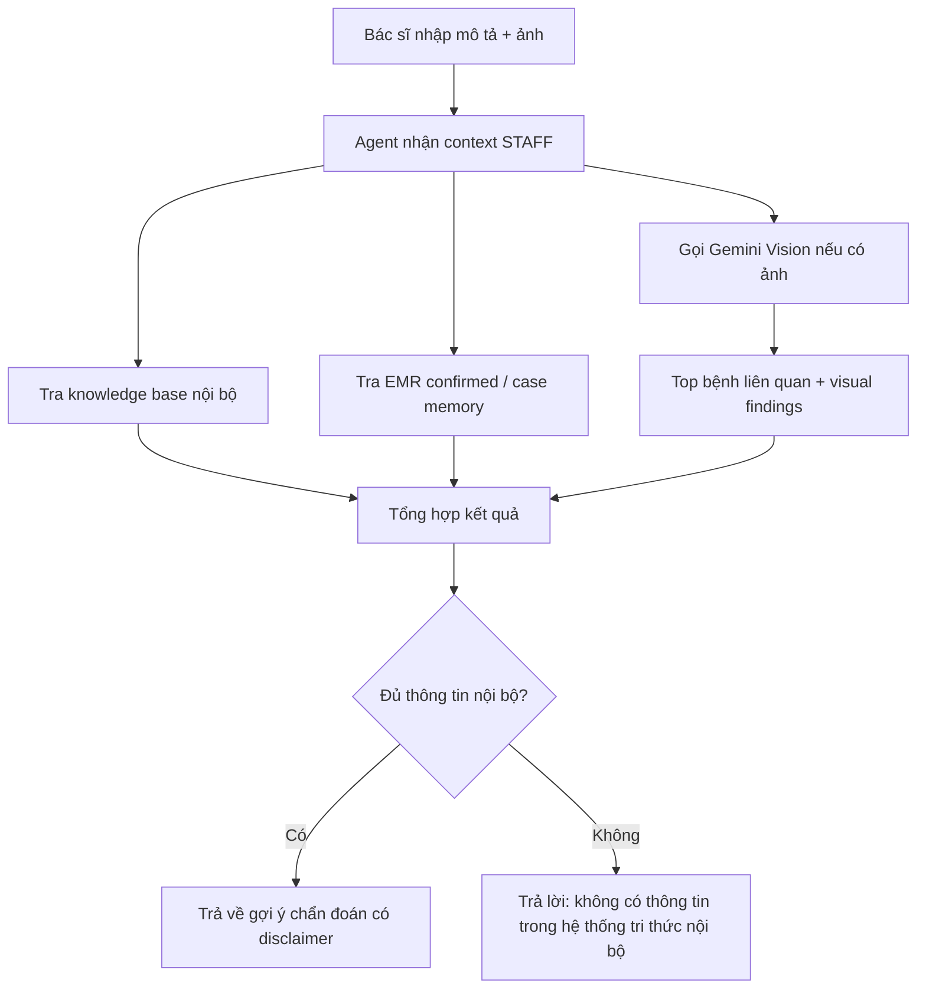
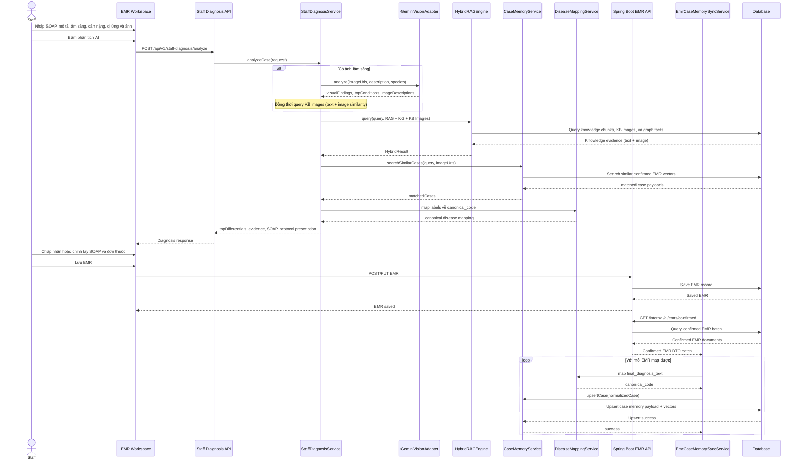
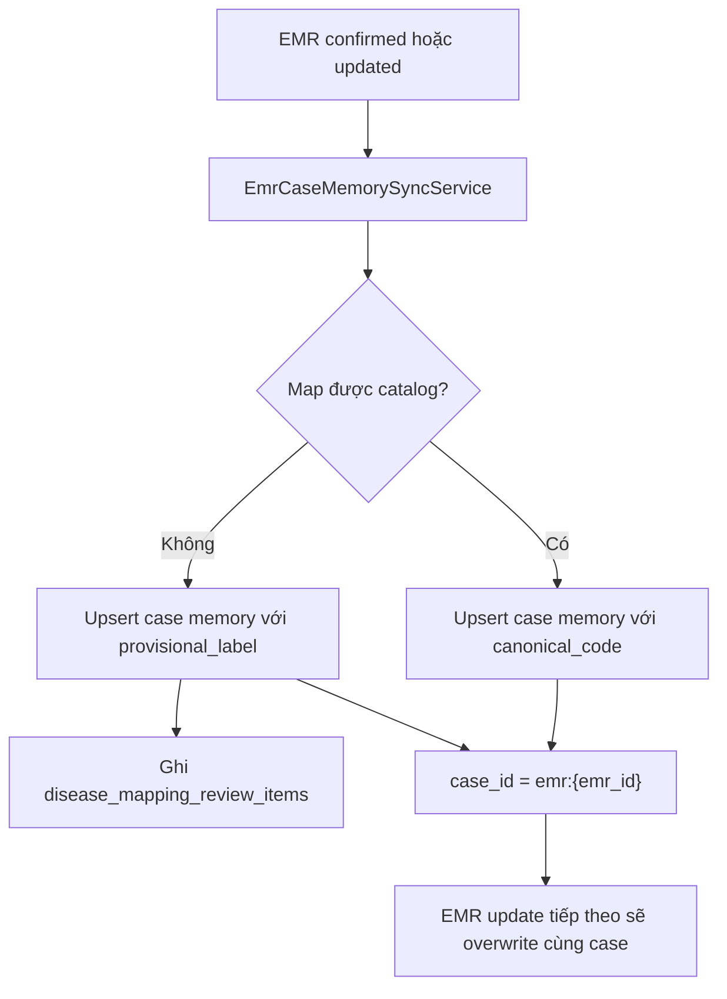
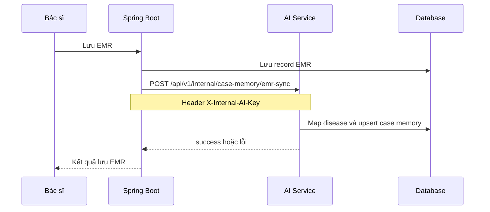

# Kế hoạch Chuyển hướng Kiến trúc AI Diagnosis

> Last Updated: 2026-03-18
> Status: Approved redesign direction, đang triển khai theo DB-backed mapping + protocol v2
> Chi tiết triển khai: `AI_DIAGNOSIS_IMPLEMENTATION_BACKLOG.md`

## 1. Mục tiêu mới

Tính năng AI diagnosis cho Petties được chuyển hướng theo 4 nguyên tắc:

1. Luồng chẩn đoán dành cho bác sĩ/staff không được dùng `web_search`.
2. Nguồn tri thức ưu tiên là knowledge base nội bộ và dữ liệu EMR đã được bác sĩ xác nhận.
3. Case memory và training data sẽ tái sử dụng từ EMR thay vì feedback thumbs up/down.
4. Chẩn đoán qua ảnh sẽ dùng mô hình vision như Gemini để phân tích ảnh kết hợp mô tả của bác sĩ, sau đó agent tổng hợp các bệnh liên quan nhất.

## 2. Quyết định kiến trúc

### 2.1 Doctor diagnostic flow

- Actor chính: `STAFF` trong codebase hiện tại.
- Không dùng `web_search`.
- Chỉ được dựa trên:
  - `pet_knowledge_search` và knowledge base nội bộ.
  - EMR đã hoàn tất và đã được bác sĩ xác nhận.
  - Case memory được tạo từ EMR xác nhận.
  - Mô hình vision cho ảnh nếu có ảnh.
- Disease identity phải đi qua `disease_catalog` và `disease_aliases` trong PostgreSQL.
- Nhãn chưa map được phải đi vào `disease_mapping_review_items` để chờ duyệt.
- Nếu không có thông tin phù hợp trong nguồn nội bộ, hệ thống phải trả lời rõ:
  - `Hiện chưa có thông tin về bệnh này trong hệ thống tri thức nội bộ.`

### 2.2 Pet owner flow

- `PET_OWNER` vẫn có thể dùng `web_search` để bổ trợ khi knowledge base nội bộ chưa đủ.
- Luồng này chỉ phục vụ tư vấn phổ thông, không đóng vai trò chẩn đoán lâm sàng.

### 2.3 Data enrichment và học từ dữ liệu thật

- Nguồn truth chính không còn là thumbs up/down.
- Nguồn truth mới:
  - EMR record do bác sĩ nhập sau thăm khám.
  - Final diagnosis trong EMR.
  - Triệu chứng, clinical notes, cận lâm sàng, toa thuốc, kết quả điều trị nếu có.
  - Ảnh đính kèm với ca khám nếu có.
- Định hướng gần đúng là:
  - continual supervised learning from confirmed EMR
  - case-memory enrichment from confirmed EMR
- Chưa gọi đây là reinforcement learning nếu chưa có reward, policy và episode rõ ràng.

### 2.4 Chẩn đoán qua ảnh

- Trục `vision_model` custom cũ không còn là hướng ưu tiên.
- Luồng mới:
  1. Bác sĩ gửi ảnh và mô tả lâm sàng.
  2. Gemini Vision phân tích dấu hiệu trên ảnh.
  3. Vision trả về top bệnh liên quan nhất cùng visual findings.
  4. Agent đối chiếu với KB nội bộ và EMR/case memory.
  5. Agent tổng hợp câu trả lời cuối cùng cho bác sĩ.

## 3. Luồng nghiệp vụ mục tiêu



## 4. Schema chuẩn từ EMR sang Case Memory

### 4.1 Nguyên tắc chọn bản ghi

Chỉ extract các EMR thỏa các điều kiện:

- Có final diagnosis hoặc kết luận khám rõ ràng.
- Trạng thái hoàn tất hoặc đã được xác nhận bởi bác sĩ.
- Không bị đánh dấu hủy, nhập sai, hoặc thiếu dữ liệu tối thiểu.
- Nếu có ảnh thì ảnh phải còn truy cập được và liên quan trực tiếp đến ca khám.

### 4.2 Raw EMR extract schema

```json
{
  "emr_id": "string",
  "clinic_id": "string",
  "booking_id": "string|null",
  "pet_id": "string",
  "doctor_id": "string",
  "exam_at": "ISO-8601 datetime",
  "species": "dog|cat|other",
  "breed": "string|null",
  "age_months": 24,
  "sex": "male|female|unknown",
  "weight_kg": 4.2,
  "chief_complaint": "string",
  "symptoms": ["string"],
  "physical_exam": ["string"],
  "clinical_notes": "string",
  "lab_results": [
    {
      "test_name": "string",
      "result_text": "string",
      "abnormal_flag": true
    }
  ],
  "differential_diagnoses": ["string"],
  "final_diagnosis_text": "string",
  "final_diagnosis_code": "string|null",
  "treatment_plan": "string|null",
  "prescriptions": [
    {
      "drug_name": "string",
      "dose": "string|null",
      "duration": "string|null"
    }
  ],
  "attachments": {
    "image_urls": ["https://..."],
    "document_urls": ["https://..."]
  },
  "source": "emr_confirmed",
  "verified": true
}
```

### 4.3 Case memory document schema

```json
{
  "case_id": "emr:{emr_id}",
  "source_type": "confirmed_emr",
  "clinic_id": "string",
  "pet": {
    "pet_id": "string",
    "species": "dog|cat|other",
    "breed": "string|null",
    "age_months": 24,
    "sex": "male|female|unknown"
  },
  "clinical_context": {
    "chief_complaint": "string",
    "symptoms": ["string"],
    "physical_exam": ["string"],
    "clinical_notes": "string",
    "lab_summary": ["string"]
  },
  "diagnosis": {
    "canonical_code": "string",
    "display_name_vi": "string",
    "raw_emr_label": "string"
  },
  "evidence": {
    "image_urls": ["https://..."],
    "treatment_plan": "string|null",
    "prescriptions": ["string"]
  },
  "search_text": "string",
  "tags": ["species:dog", "source:emr", "confirmed:true"],
  "created_at": "ISO-8601 datetime",
  "verified": true
}
```

### 4.4 Search text để embed

Field `search_text` được tạo từ:

- species + breed
- chief complaint
- symptoms
- physical exam
- clinical notes tóm tắt
- final diagnosis đã được map về canonical label

Mục tiêu là để case memory phục vụ:

- retrieve ca tương tự
- grounding cho agent
- tạo training set cho các bài toán xếp hạng/gợi ý bệnh

## 5. Gemini Vision contract

### 5.1 Request contract

```json
{
  "request_id": "string",
  "species": "dog|cat|other",
  "image_urls": ["https://..."],
  "doctor_description": "string",
  "body_part": "string|null",
  "clinical_context": {
    "symptoms": ["string"],
    "duration": "string|null",
    "age_months": 24,
    "sex": "male|female|unknown"
  }
}
```

### 5.2 Response contract

```json
{
  "request_id": "string",
  "visual_findings": [
    "Vùng da đỏ, có đóng vảy, mất lông cục bộ"
  ],
  "top_conditions": [
    {
      "raw_label": "bacterial dermatitis",
      "canonical_code": "bacterial_dermatosis",
      "display_name_vi": "Viêm da do vi khuẩn",
      "confidence_score": 0.78,
      "reason": "Tổn thương phù hợp với tổn thương da viêm, có ban đỏ và vết tiết dịch nhẹ"
    }
  ],
  "needs_more_data": true,
  "missing_information": [
    "Cần biết thời gian mắc bệnh",
    "Cần biết có ngứa hay không"
  ],
  "safety_notes": [
    "Không thay thế chẩn đoán lâm sàng trực tiếp"
  ]
}
```

### 5.3 Quy tắc sử dụng contract

- Vision chỉ đề xuất top bệnh liên quan, không tự kết luận bệnh cuối cùng.
- Agent phải đối chiếu `canonical_code` với KB và case memory trước khi trả lời.
- Nếu vision không map được về canonical code, agent phải đánh dấu `unmapped_label` và không đưa ra kết luận mạnh.
- Output cuối cùng cho bác sĩ phải kèm disclaimer rằng đây là gợi ý hỗ trợ.

## 6. Mapping disease labels giữa KB, EMR, output vision

### 6.1 Nguyên tắc

- Chọn 1 `canonical_code` duy nhất làm định danh bệnh trong hệ thống.
- KB, EMR, Gemini Vision chỉ là các nguồn label đầu vào cần được map về `canonical_code`.
- Không train và không tạo case memory theo raw label nếu label đó chưa được map.

### 6.2 Mapping table đề xuất

```json
{
  "canonical_code": "bacterial_dermatosis",
  "display_name_vi": "Viêm da do vi khuẩn",
  "species_scope": ["dog", "cat"],
  "kb_entry_id": "kb:123",
  "kb_title": "Viêm da do vi khuẩn",
  "emr_aliases": [
    "Viêm da nhiễm khuẩn",
    "Bacterial dermatitis"
  ],
  "vision_aliases": [
    "bacterial dermatitis",
    "skin bacterial infection"
  ],
  "is_active": true
}
```

### 6.3 Quy trình map

1. Lấy `final_diagnosis_text` từ EMR.
2. Match exact alias trước.
3. Nếu không khớp, đưa qua bảng synonym/manual review.
4. Sau khi map xong mới đưa vào case memory và training pool.
5. Vision output cũng phải map qua bảng này trước khi xếp hạng và tổng hợp.

## 7. Thay đổi code/doc ưu tiên

### 7.1 AI service

- `petties-agent-serivce/app/core/context_policy.py`
  - Chặn `web_search` cho `STAFF`.
  - Bổ sung guardrail cho doctor diagnostic flow.
- `petties-agent-serivce/app/core/tools/mcp_tools/medical_tools.py`
  - Sau này sẽ thêm luồng Gemini Vision mới thay cho hướng custom vision cũ.
- `petties-agent-serivce/app/core/services/feedback_service.py`
  - Hạ ưu tiên thumbs feedback.
  - Bổ sung hướng ingest từ EMR confirmed.

### 7.2 Documentation

- `docs-references/documentation/AI_DIAGNOSIS_FEATURE_PLAN.md`
- `docs-references/documentation/AI_DIAGNOSIS_PROGRESS.md`

### 7.3 Các thành phần cũ cần đánh dấu paused

- `petties-agent-serivce/app/core/vision_model/*`
- `petties-agent-serivce/app/api/routes/vision.py`
- `petties-agent-serivce/app/api/routes/vision_diseases.py`
- Web admin AI Diagnose cũ
- Label Studio và pipeline annotation của hướng AI Diagnose cũ

## 8. Lộ trình thực hiện mới

### Phase 1 - Policy và grounding

- Chặn `web_search` cho doctor flow.
- Chốt response an toàn khi KB nội bộ không có dữ liệu.
- Định nghĩa schema EMR extract và mapping labels.

### Phase 2 - EMR-driven case memory

- Xây pipeline trích xuất EMR confirmed.
- Tạo document case memory từ schema chuẩn.
- Đồng bộ canonical disease mapping.
- Lưu disease catalog và alias vào PostgreSQL để quản lý được ngoài code.
- Ghi nhãn EMR chưa map được vào hàng đợi review thay vì bỏ qua.

### Phase 3 - Gemini Vision integration

- Định nghĩa request/response contract.
- Tạo adapter gọi Gemini Vision.
- Tổng hợp vision + KB + EMR trong doctor flow.
- Đồng bộ SOAP và đơn thuốc qua `protocol engine`.
- Chặn gợi ý thuốc khi thiếu dữ liệu lâm sàng quan trọng như cân nặng, soi tai, fluorescein, cytology.

### Phase 4 - Evaluation

- Đánh giá top-k disease suggestion so với final diagnosis trong EMR.
- Đo chất lượng retrieval case memory.
- Đánh giá tỷ lệ label map thành công.

## 9. Phạm vi tạm dừng

Những nội dung sau không còn là phạm vi ưu tiên hiện tại:

- Feedback loop dựa trên thumbs up/down làm nguồn học chính.
- Custom vision pipeline dựa trên ONNX + GradCAM + MC Dropout.
- MLOps retrain flow cho `vision_model` cũ.
- Dashboard/monitoring phục vụ hướng custom vision cũ.
- Luồng Label Studio phục vụ riêng cho AI Diagnose cũ.

## 10. Ghi chú thuật ngữ

- Nếu team muốn làm reinforcement learning thật, cần bổ sung state, action, reward, episode và safety layer rõ ràng.
- Trong giai đoạn hiện tại, cách gọi đúng hơn là `continual supervised learning from confirmed EMR`.

## 11. Giả định vận hành thực tế tế khi bác sĩ dùng AI Diagnose

### 11.1 Giả định về cách bác sĩ prompt
Trong thực tế bác sĩ hiếm khi viết prompt dài như prompt engineering. Cách dùng hợp lý hơn là:

- prompt ngắn, có tính lâm sàng, tập trung vào triệu chứng và dấu hiệu chính
- mô tả triệu chứng chính
- nếu có ảnh thì ghi rõ vùng tổn thương
- nếu cần thì thêm thời gian mắc bệnh, tình trạng ngứa, tiết dịch, mùi hôi, sốt, đau khi sờ vào tai, tiền sử dùng thuốc nhỏ tai, v.v.

Ví dụ prompt thực tế:

1. `Cho tôi gợi ý chẩn đoán phân biệt chó mèo bị đỏ mắt, chảy nước mắt 3 ngày, ảnh đã gửi kèm`
2. `Chó nghi bị gì? Chó cái nặng 4 kg, 4 tháng tuối, tiểu máu, đã có lịch sử viêm bàng quang`
3. `Ảnh tai trái của chó đã gửi, có mùi hôi, đầy dịch nâu, hay lắc đầu`

### 11.2 Giả định về cách AI thực hiện

Khi nhận prompt từ `STAFF`, AI nên thực hiện theo thứ tự sau:

1. xac dinh day la doctor diagnostic flow
2. khong dung `web_search`
3. rut trich thong tin lam sang tu prompt cua bac si
4. neu co anh thi goi Gemini Vision de lay `visual_findings` va `top_conditions`
5. truy van knowledge base noi bo
6. truy van EMR confirmed/case memory cho cac ca tuong tu
7. map nhan benh ve `canonical_code`
8. tong hop top chan doan phan biet, bang chung va disclaimer

### 11.3 Gia dinh ve output thuc te cho bac si

AI khong nen tra loi nhu mot bai viet dai. Output thuc te nen gon va huu dung cho tham kham:

- `Top chan doan phan biet`
- `Dau hieu ho tro`
- `Ca EMR tuong tu`
- `Thong tin con thieu can hoi them`
- `Disclaimer`

Vi du output:

```text
Top chan doan phan biet:
1. Viem tai ngoai do vi khuan
2. Viem tai do nam/men
3. Demodex tai kem boi nhiem

Dau hieu ho tro:
- Tai co dich nau va mui hoi
- Lac dau, giai du
- Vision thay ong tai co tiet dich dam dac

Thong tin can hoi them:
- Co sot khong?
- Ben co bi dau khi so vao tai khong?
- Da dung thuoc nho tai truoc do chua?

Luu y:
Day la goi y ho tro dua tren KB noi bo, EMR confirmed va phan tich anh. Khong thay the tham kham lam sang truc tiep.
```

## 12. Full flow từ chẩn đoán đến lưu case memory



### 12.1 Swimlane workflow

```mermaid
flowchart LR
    subgraph Lane1["STAFF"]
        S1["Nhập SOAP, mô tả lâm sàng, cân nặng, dị ứng, ảnh"]
        S2["Xem gợi ý AI"]
        S3["Chấp nhận hoặc chỉnh tay SOAP và đơn thuốc"]
        S4["Lưu EMR"]
    end

    subgraph Lane2["Web EMR/UI"]
        U1["Gửi StaffDiagnosisRequest"]
        U2["Hiển thị differential, evidence, SOAP, đơn thuốc"]
        U3["Gửi yêu cầu lưu EMR"]
    end

    subgraph Lane3["AI Service"]
        A1["StaffDiagnosisService nhận request"]
        A2["Gọi Gemini Vision nếu có ảnh"]
        A3["Query HybridRAGEngine (RAG + KG + KB Images)"]
        A4["Query CaseMemoryService (text + image)"]
        A5["Map canonical disease + áp protocol"]
        A6["Trả diagnosis response"]
        A7["EmrCaseMemorySyncService nhận batch EMR confirmed"]
        A8["Map final diagnosis + upsert case memory"]
    end

    subgraph Lane4["Spring Boot"]
        B1["Lưu EMR đã được bác sĩ xác nhận"]
        B2["Expose internal batch EMR confirmed"]
    end

    subgraph Lane5["Database"]
        D1["KB (text + image vectors) / KG / Case Memory"]
        D2["Lưu EMR record"]
        D3["Lưu vector case memory mới"]
    end

    S1 --> U1
    U1 --> A1
    A1 --> A2
    A2 --> A3
    A3 --> D1
    D1 --> A3
    A3 --> A4
    A4 --> D1
    D1 --> A4
    A4 --> A5
    A5 --> A6
    A6 --> U2
    U2 --> S2
    S2 --> S3
    S3 --> S4
    S4 --> U3
    U3 --> B1
    B1 --> D2
    D2 --> B1
    B1 --> B2
    B2 --> A7
    A7 --> A8
    A8 --> D3
```



## 13. Auto-sync confirmed EMR và provisional ingest

- Khi EMR đã được bác sĩ xác nhận, dữ liệu sync sang Case Memory theo `case_id = emr:{emr_id}`.
- AI service có background worker tự polling EMR confirmed thay đổi theo chu kỳ.
- Trong nhánh implementation hiện tại, feed nội bộ dùng endpoint `GET /api/internal/ai/emrs/confirmed`.
- Auth service-to-service ưu tiên header `X-Internal-AI-Key`; JWT/service account chỉ là fallback.
- Nếu EMR đã sync trước đó và được cập nhật:
  - upsert sẽ overwrite theo cùng `case_id`
  - không tạo case memory mới trùng lặp
- Nếu `final_diagnosis_text` map được vào `disease_catalog`:
  - lưu `canonical_code`
  - `mapping_status = mapped`
- Nếu chưa map được:
  - vẫn ingest vào Case Memory
  - `mapping_status = provisional`
  - `provisional_label = final_diagnosis_text`
  - đồng thời ghi vào `disease_mapping_review_items`



## 14. Kiến trúc rút gọn sau khi chốt lại

- Bỏ polling worker và bỏ feed nội bộ `GET /api/internal/ai/emrs/confirmed`.
- Luồng chính thức:
  - Spring Boot lưu hoặc cập nhật EMR có chẩn đoán cuối.
  - Spring Boot gọi trực tiếp `POST /api/v1/internal/case-memory/emr-sync`.
  - AI service xác thực `X-Internal-AI-Key`.
  - AI service upsert vào Case Memory theo `case_id = emr:{emr_id}`.


