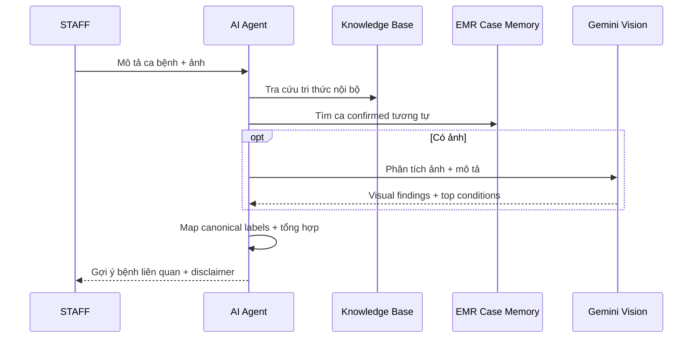

# Kế hoạch Triển khai AI Diagnosis Mới

> Last Updated: 2026-03-17
> Status: Approved implementation backlog
> Liên quan: `AI_DIAGNOSIS_FEATURE_PLAN.md`, `AI_DIAGNOSIS_PROGRESS.md`

## 1. Mục tiêu

Tài liệu này chuyển phần redesign đã chốt thành backlog triển khai cụ thể cho team. Trọng tâm là:

1. Tái sử dụng EMR đã xác nhận làm nguồn dữ liệu chính.
2. Chẩn đoán cho `STAFF` không dùng `web_search`.
3. Dùng Gemini Vision để hiểu ảnh, sau đó grounding bằng KB và case memory nội bộ.
4. Giữ feedback người dùng cho audit/UX, không dùng làm ground truth chẩn đoán.

## 2. Thứ tự ưu tiên

1. Chuẩn hóa API/DTO export EMR confirmed từ backend Spring Boot.
2. Implement pipeline ingest EMR confirmed trong AI service.
3. Tạo canonical disease mapping service/table.
4. Tạo Gemini Vision adapter và normalize response.
5. Ghép luồng diagnosis mới: KB + EMR/case memory + Gemini Vision.
6. Thiết kế lại feedback service theo vai trò audit/UX.

## 3. Pipeline ingest EMR confirmed

### 3.1 Rollout khuyến nghị

- Giai đoạn 1: AI service chạy job pull định kỳ từ backend Spring Boot.
- Giai đoạn 2: backend Spring Boot phát event hoặc webhook khi EMR được xác nhận/hoàn tất.

Lý do:

- Pull job đơn giản hơn, ít phụ thuộc hơn, dễ debug hơn cho giai đoạn đầu.
- Event/webhook phù hợp hơn sau khi luồng đã ổn định.

### 3.2 API nội bộ tối thiểu từ backend Spring

Đề xuất endpoint:

- `GET /internal/ai/emrs/confirmed`

Query params:

- `updated_from`
- `updated_to`
- `limit`
- `cursor`

Response:

```json
{
  "items": [],
  "next_cursor": "string|null",
  "total": 100
}
```

### 3.3 Logic ingest trong AI service

1. Pull danh sách EMR confirmed mới hoặc được cập nhật.
2. Validate EMR đủ điều kiện ingest.
3. Normalize field clinical data.
4. Map final diagnosis về `canonical_code`.
5. Tạo `search_text`.
6. Embed `search_text`.
7. Upsert vào case memory.
8. Ghi sync audit log để trace hoặc reprocess.

### 3.4 Sync audit log khuyến nghị

```json
{
  "sync_id": "uuid",
  "source_type": "confirmed_emr",
  "source_id": "emr_id",
  "status": "success|skipped|failed",
  "reason": "string|null",
  "canonical_code": "string|null",
  "synced_at": "ISO-8601 datetime"
}
```

## 4. Service canonical disease mapping

### 4.1 Trách nhiệm

Service này phải:

- map `final_diagnosis_text` từ EMR sang `canonical_code`
- map `raw_label` từ Gemini Vision sang `canonical_code`
- trả về metadata cùng `display_name_vi`
- đánh dấu `unmapped` nếu không map được

### 4.2 Cấu trúc dữ liệu khuyến nghị

1. `disease_catalog`
   - `canonical_code`
   - `display_name_vi`
   - `species_scope`
   - `kb_entry_id`
   - `is_active`
2. `disease_aliases`
   - `alias_text`
   - `source_type` = `emr|vision|kb`
   - `canonical_code`
   - `review_status`
   - `confidence_rule`

### 4.3 Quy tắc map

- Exact match -> map thẳng.
- Alias normalized -> map thẳng.
- Fuzzy match -> chỉ đưa vào hàng chờ review, không auto-ingest.

## 5. Gemini Vision adapter

### 5.1 Trách nhiệm

- nhận request contract chuẩn hóa từ AI service
- gọi Gemini Vision qua OpenRouter
- parse response vào contract đã chốt
- normalize `top_conditions`
- đánh dấu `unmapped_label` nếu chưa map được

### 5.2 Guardrails

- không trả về final diagnosis tuyệt đối
- không trả treatment nguy cơ cao như kết luận chắc chắn
- luôn có `safety_notes`
- nếu ảnh kém chất lượng hoặc thiếu mô tả thì `needs_more_data = true`

## 6. Luồng doctor diagnosis mới



Output cuối cùng nên chứa:

1. `top_differentials`
2. `supporting_evidence_from_kb`
3. `similar_confirmed_cases`
4. `vision_findings`
5. `disclaimer`

## 7. Policy feedback mới

### 7.1 Giữ lại

- feedback chat từ user
- rating mức hữu ích
- report hallucination / sai nguồn / sai hướng dùng tool

### 7.2 Không dùng làm ground truth diagnosis

- thumbs up/down
- rating cao/thấp
- text feedback cảm tính

### 7.3 Dùng cho mục đích

- dashboard UX
- audit chất lượng response
- phát hiện tool routing sai
- phát hiện prompt có vấn đề

## 8. Task breakdown theo file

### 8.1 AI service

Các file hiện có khả năng cần sửa:

- `petties-agent-serivce/app/core/context_policy.py`
  - giữ rule `STAFF` không dùng `web_search`
  - bổ sung prompt shape cho doctor diagnosis mới
- `petties-agent-serivce/app/core/tools/mcp_tools/medical_tools.py`
  - tạo diagnosis flow mới cho bác sĩ
  - ghép KB + EMR + Gemini Vision
- `petties-agent-serivce/app/core/services/feedback_service.py`
  - chuyển feedback cũ sang audit/UX only
- `petties-agent-serivce/app/core/rag/case_memory.py`
  - support upsert/search cho case memory từ EMR confirmed

Các file mới nên tạo:

- `petties-agent-serivce/app/core/services/emr_case_memory_sync_service.py`
- `petties-agent-serivce/app/core/services/disease_mapping_service.py`
- `petties-agent-serivce/app/core/vision/gemini_vision_adapter.py`
- `petties-agent-serivce/app/api/schemas/diagnosis_contracts.py`

### 8.2 Backend Spring Boot

Các module nhiều khả năng cần có:

- `backend-spring/petties/src/main/java/com/petties/.../emr/...`
  - API nội bộ cho EMR confirmed export
  - filter theo `updated_from` / cursor
- `backend-spring/petties/src/main/java/com/petties/.../ai/...`
  - nếu sau này chọn event/webhook cho AI service

### 8.3 Database / config

- bảng canonical disease mapping nếu lưu trong PostgreSQL
- system settings cho Gemini/OpenRouter model override
- audit table cho EMR sync nếu cần trace bền vững

## 9. Milestone khuyến nghị

### Milestone 1: Dữ liệu chuẩn

- xong API export EMR confirmed
- xong schema normalize
- xong canonical mapping bản đầu

### Milestone 2: Case memory mới

- xong pipeline ingest
- upsert/search được case memory từ EMR
- có audit log sync

### Milestone 3: Vision grounding

- xong Gemini Vision adapter
- map được output vision về canonical labels
- có synthesis flow cho bác sĩ

### Milestone 4: Pilot nội bộ

- test với nhóm `STAFF`
- review chất lượng gợi ý
- dashboard audit/feedback

## 10. Deliverable đầu tiên nên làm ngay

Nếu chỉ chọn một việc bắt đầu ngay, ưu tiên là:

1. định nghĩa DTO export `EMR confirmed`
2. tạo `emr_case_memory_sync_service`
3. tạo `disease_mapping_service` với mapping tối thiểu cho các bệnh phổ biến nhất

Lý do: không có 3 phần này thì Gemini Vision và diagnosis flow mới chưa có dữ liệu nền để grounding.

## 11. Chat luong du lieu co the tot hon trong tuong lai

### 11.1 Du lieu EMR co gia tri nhat neu duoc chuan hoa hon

Nhung diem du lieu nen tot hon theo thoi gian:

- final diagnosis co `canonical_code` thay vi chi la text tu do
- symptoms duoc tach thanh danh sach co cau truc thay vi viet tu do trong notes
- body part duoc chuan hoa (`eye_left`, `ear_right`, `skin_abdomen`...)
- attachment image co metadata lien ket ro voi lan kham va body part
- clinical outcome co field ro rang (`improved`, `not_improved`, `hospitalized`, `deceased`)

### 11.2 Du lieu cho Vision se manh hon neu co ngu canh lam sang

Gemini Vision se huu ich hon neu sau nay co them:

- species, breed, age, sex
- thoi gian mac benh
- tinh trang ngu/a, dau, sot, tiet dich
- body part chuan hoa
- nhieu anh cung mot case o cac goc khac nhau

### 11.3 Du lieu cho case memory se tot hon neu co ket qua sau dieu tri

Sau nay nen bo sung:

- response to treatment
- ket qua tai kham
- xet nghiem xac nhan
- ly do loai tru chan doan phan biet

Neu co cac field nay, case memory khong chi goi y benh nghi ngo ma con giup uu tien cac ca da duoc xac nhan chat luong cao hon.

### 11.4 Du lieu feedback van co gia tri, nhung o vai tro khac

Feedback nguoi dung/staff sau nay van nen giu de:

- phat hien cau tra loi kho hieu
- phat hien hallucination
- phat hien tool routing sai
- phat hien case AI can dua vao hang doi review

Nhung khong nen dung feedback do lam nhan chan doan chinh thay cho EMR confirmed.

## 12. Mapping giữa EMR hiện tại và schema AI mới

### 12.1 Kết luận nhanh

- EMR hiện tại trong Spring Boot khớp về nghiệp vụ, nhưng chưa khớp 1:1 với schema ingest cho AI service.
- Không nên dùng trực tiếp `EmrResponse` làm payload cho case memory mới.
- Cần thêm một lớp `internal AI export DTO` hoặc adapter để chuẩn hóa dữ liệu trước khi AI service ingest.

### 12.2 Đối chiếu field EMR hiện tại -> AI schema mục tiêu

| Nguồn EMR hiện tại | Vị trí hiện tại | Field AI mục tiêu | Mức độ khớp | Ghi chú mapping |
| --- | --- | --- | --- | --- |
| `petId` | `CreateEmrRequest`, `EmrResponse` | `pet_id` | Khớp | Dùng trực tiếp |
| `bookingId` | `CreateEmrRequest`, `EmrResponse` | `booking_id` | Khớp | Dùng trực tiếp nếu có |
| `clinicId` | `EmrResponse` | `clinic_id` | Khớp | Dùng trực tiếp |
| `staffId` | `EmrResponse` | `doctor_id` | Khớp một phần | Hiện tại dùng `staffId`; AI side có thể map thành `doctor_id` |
| `petSpecies` | `EmrResponse` | `species` | Khớp | Nên normalize thành taxonomy ổn định (`dog`, `cat`) |
| `petBreed` | `EmrResponse` | `breed` | Khớp | Dùng trực tiếp, nên normalize sau |
| `subjective` | `CreateEmrRequest`, `EmrResponse` | `chief_complaint`, `symptoms` | Khớp một phần | Cần parser hoặc rule để tách text tự do thành danh sách triệu chứng |
| `objective` | `CreateEmrRequest`, `EmrResponse` | `physical_exam`, `clinical_notes` | Khớp một phần | Hiện đang là text SOAP, chưa tách cấu trúc |
| `assessment` | `CreateEmrRequest`, `EmrResponse` | `final_diagnosis_text` | Khớp | Đây là field trung tâm để map sang `canonical_code` |
| `plan` | `CreateEmrRequest`, `EmrResponse` | `treatment_plan` | Khớp | Dùng cho grounding, không phải field bắt buộc của search text |
| `notes` | `CreateEmrRequest`, `EmrResponse` | `clinical_notes` | Khớp một phần | Cần gộp với `objective` theo rule rõ ràng |
| `weightKg`, `temperatureC`, `heartRate`, `bcs` | `CreateEmrRequest`, `EmrResponse` | `vitals` / `clinical_context` | Khớp một phần | Nên đưa vào payload AI export, skeleton hiện tại chưa khai báo hết |
| `prescriptions` | `CreateEmrRequest`, `EmrResponse` | `prescriptions` | Khớp | Có thể giữ để tham khảo điều trị và outcome |
| `images` | `CreateEmrRequest`, `EmrResponse` | `attachments.image_urls` | Khớp một phần | Cần adapter để chỉ lấy URL hợp lệ và metadata liên quan |
| `examinationDate` | `CreateEmrRequest`, `EmrResponse` | `examined_at` | Khớp | Dùng trực tiếp |
| `reExaminationDate` | `CreateEmrRequest`, `EmrResponse` | `recheck_at` | Khớp một phần | Hữu ích cho outcome sau điều trị |
| `createdAt` | `EmrResponse` | `created_at` | Khớp | Dùng cho sync/audit |
| `isLocked` | `EmrResponse` | `verified` | Chưa khớp | `isLocked` không đồng nghĩa với EMR đã được xác nhận làm ground truth |

### 12.3 Field AI đang cần nhưng EMR hiện tại chưa có rõ ràng

| Field AI cần có | Trạng thái hiện tại | Hướng xử lý đề xuất |
| --- | --- | --- |
| `emr_id` | Có | Dùng `EmrResponse.id` |
| `verified` | Chưa có đúng nghĩa | Nên thêm cờ `isConfirmedForAi` hoặc quy tắc export chỉ lấy EMR đã đủ điều kiện |
| `canonical_code` | Chưa có | Sinh tại AI service qua `disease_mapping_service` |
| `symptoms[]` đã chuẩn hóa | Chưa có | Tách từ `subjective` và cho phép nâng cấp về taxonomy sau |
| `body_part` | Chưa có | Nên bổ sung trong EMR hoặc prompt bác sĩ, rất quan trọng cho Vision |
| `duration_days` | Chưa có cấu trúc | Có thể parse từ `subjective`, nhưng về lâu dài nên có field riêng |
| `sex`, `age_months` | Chưa thấy trong EMR response hiện tại | Có thể lấy từ hồ sơ pet khi export |
| `image metadata` | Chưa đầy đủ | Nên có `body_part`, `captured_at`, `description`, `source` |
| `lab confirmation` | Chưa thấy | Nên bổ sung sau cho những ca có xét nghiệm xác nhận |

### 12.4 Payload ảnh và prompt bác sĩ có khớp với luồng hiện tại không

| Nguồn hiện tại | Trạng thái | Đánh giá |
| --- | --- | --- |
| Client gửi `images` vào chat payload | Đã có | Khớp với hướng Gemini Vision mới |
| WebSocket lưu `images` vào metadata | Đã có | Có thể tái sử dụng, không cần đổi luồng cơ bản |
| Agent truyền `images` vào LLM client | Đã có | Phù hợp cho multimodal input |
| Contract mới cần `doctor_description`, `species`, `body_part` | Mới có một phần | `doctor_description` có thể lấy từ prompt, `species` cần lấy từ pet/EMR, `body_part` chưa ổn định |

### 12.5 DTO export nội bộ đề xuất cho backend Spring Boot

Backend Spring Boot không nên trả thẳng `EmrResponse` cho AI service. Nên tạo một DTO riêng cho internal AI export, ví dụ:

```json
{
  "emr_id": "string",
  "pet_id": "uuid",
  "booking_id": "uuid",
  "clinic_id": "uuid",
  "doctor_id": "uuid",
  "species": "dog",
  "breed": "Poodle",
  "sex": "male",
  "age_months": 36,
  "chief_complaint": "Ngua, rung long 2 tuan",
  "symptoms": ["ngua", "rung long", "do da"],
  "physical_exam": "Vung da bung co vet do, co vay",
  "clinical_notes": "Da loai tru vet thuong do chan thuong",
  "final_diagnosis_text": "Viem da do vi khuan",
  "treatment_plan": "Tam sat trung, boi thuoc, tai kham 7 ngay",
  "prescriptions": [],
  "attachments": {
    "image_urls": ["https://..."]
  },
  "examined_at": "2026-03-17T10:30:00Z",
  "recheck_at": "2026-03-24T10:30:00Z",
  "verified": true,
  "updated_at": "2026-03-17T10:45:00Z"
}
```

### 12.6 Kết luận implementation

1. EMR hiện tại đủ dữ liệu để bắt đầu, nhưng chưa nên ingest trực tiếp.
2. Cần adapter/export DTO ở Spring Boot trước khi nối thật với `emr_case_memory_sync_service`.
3. Cần ưu tiên bổ sung `verified`, `body_part`, `sex`, `age_months`, và image metadata nếu muốn chất lượng diagnosis tốt hơn.
