# Petties AI Agent Features - Non-Pet Owner Roles

> **Created:** 2026-02-04
> **Updated:** 2026-02-04 (Added Clinic Setup Agent - No RAG)
> **Author:** AI Assistant
> **Purpose:** recommendations for Petties AI AGENT (LangGraph ReAct) supporting Clinic Owner (CO), Clinic Manager (CM), and Staff roles
> **Architecture:** Single Agent with ReAct Pattern (LangGraph StateGraph) - **TRUE AUTONOMOUS AGENT**
> **Focus:** AI-assisted clinical decision support, autonomous workflow execution, and operational intelligence

> **⚠️ IMPORTANT: RAG Usage Rule**
> - **RAG (Knowledge Base)**: Chỉ dùng cho Pet Owner Q&A về chăm sóc thú cưng, triệu chứng bệnh
> - **Clinic Setup/Operations/Business Agents**: KHÔNG dùng RAG - chỉ query PostgreSQL và gọi Spring Boot API

---

## 📊 TABLE OF CONTENTS

1. [Agent Architecture Overview](#1-agent-architecture-overview)
2. [Image-Based Diagnosis System](#2-image-based-diagnosis-system)
3. [Clinical Decision Support Agent](#3-clinical-decision-support-agent)
4. [Operations Optimization Agent](#4-operations-optimization-agent)
5. [Business Intelligence Agent](#5-business-intelligence-agent)
6. [Emergency Escalation Flow](#6-emergency-escalation-flow)
7. [EMR Creation with AI](#7-emr-creation-with-ai)
8. [Clinic Setup AI Agent](#8-clinic-setup-ai-agent)
9. [Implementation Priority](#9-implementation-priority)
9. [Implementation Priority](#9-implementation-priority)

---

## 1. Agent Architecture Overview

### 1.1 What Makes Petties AI an AGENT (Not Just Chatbot)

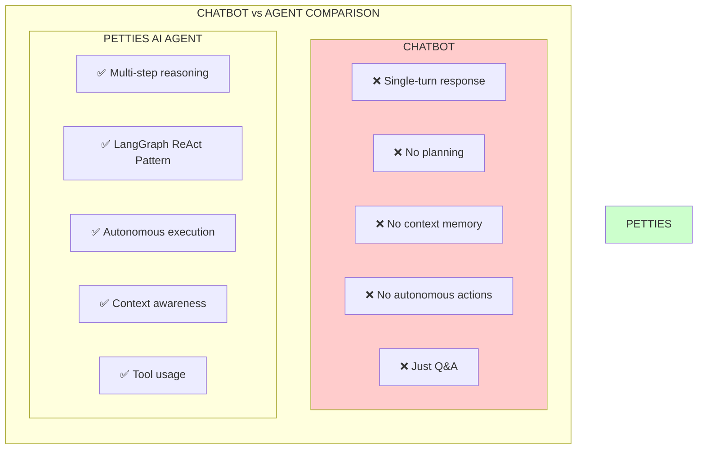

### 1.2 Petties AI Agent Ecosystem

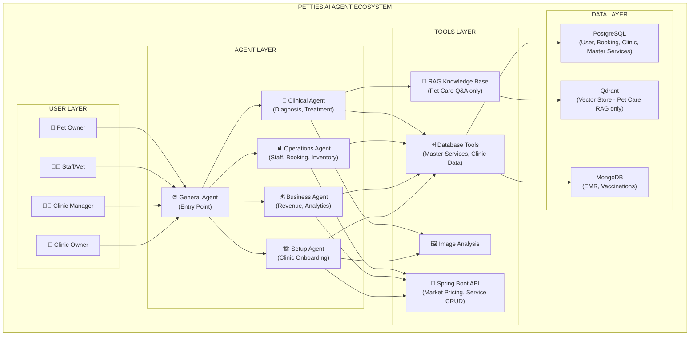

> **⚠️ IMPORTANT: RAG Usage Scope**
> - **RAG (Knowledge Base)**: Chỉ dùng cho Pet Owner Q&A về chăm sóc thú cưng, triệu chứng bệnh
> - **Clinic Setup Agent**: KHÔNG dùng RAG - chỉ query PostgreSQL (Master Services) và gọi Spring Boot API (Market Pricing)

### 1.3 ReAct Pattern - Agent Reasoning Loop

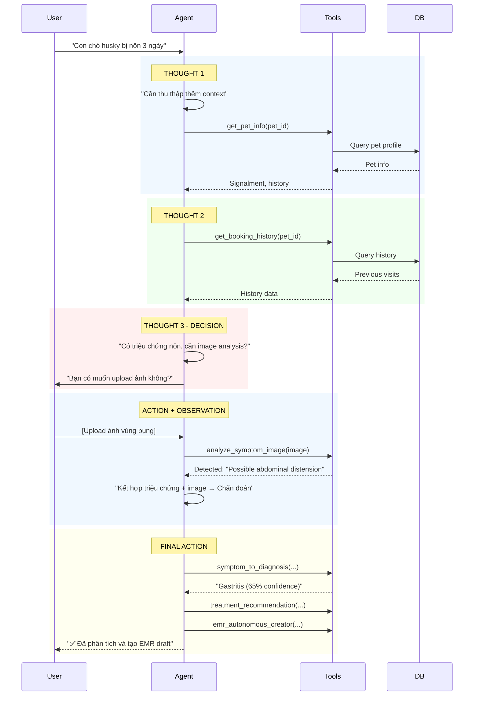

---

## 2. Image-Based Diagnosis System

### 2.1 Image Analysis Flow for Both Staff and Pet Owners

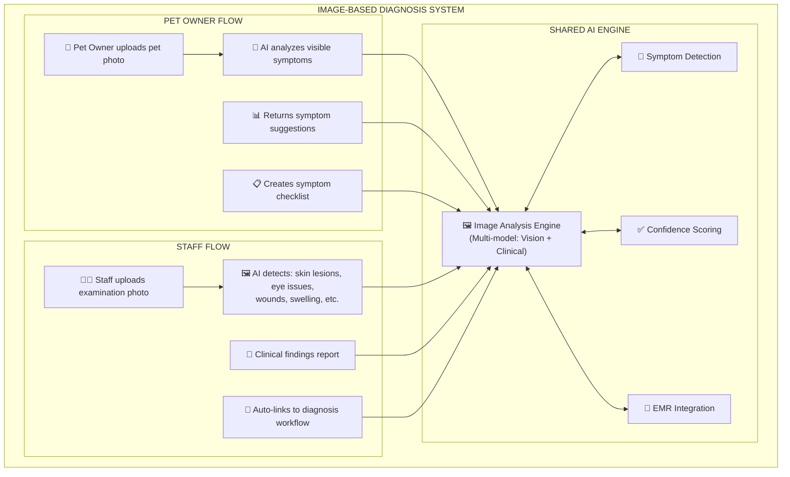

### 2.2 Pet Owner Image Diagnosis Flow

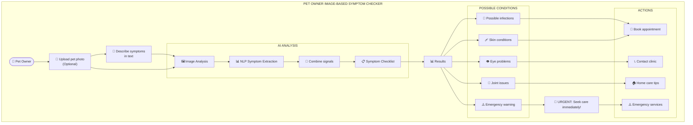

### 2.3 Staff Clinical Image Diagnosis Flow

```mermaid
flowchart TB
    subgraph "STAFF CLINICAL IMAGE ANALYSIS"
        direction LR
        
        Start(["👨‍⚕️ Staff/Vet"])
        
        Start --> Upload["📸 Upload examination image\n(Skin, Eye, Wound, Oral, etc.)"]
        
        Upload --> ImageType{"📁 Image Type?"}
        
        ImageType --> Skin["🦠 Skin/Dermatology"]
        ImageType --> Eye["👁️ Eye/Ophthalmology"]
        ImageType --> Wound["🩹 Wound/Trauma"]
        ImageType --> Oral["🦷 Oral/Dental"]
        ImageType --> General["📷 General Exam"]
        
        subgraph "SKIN ANALYSIS"
            S1["🖼️ AI: Lesion detection"]
            S2["🔍 Identify: papules, pustules, alopecia"]
            S3["🎨 Color analysis (redness, hyperpigmentation)"]
            S4["📐 Measure lesion size"]
            S5["🏷️ Suggest: allergy, infection, parasite"]
        end
        
        subgraph "EYE ANALYSIS"
            E1["🖼️ AI: Ocular examination"]
            E2["🔍 Detect: conjunctivitis, corneal ulcer"]
            E3["👁️ Check: discharge, redness, cloudiness"]
            E4["⚠️ Flag: emergency (corneal perforation)"]
        end
        
        subgraph "WOUND ANALYSIS"
            W1["🖼️ AI: Wound assessment"]
            W2["📏 Measure wound dimensions"]
            W3["🔍 Classify: abrasion, laceration, puncture"]
            W4["🩸 Estimate: bleeding, infection risk"]
        end
        
        subgraph "ORAL ANALYSIS"
            O1["🖼️ AI: Dental examination"]
            O2["🦷 Detect: tartar, gingivitis, broken tooth"]
            O3["😬 Assess: pain indicators"]
            O4["📋 Recommend: cleaning, extraction"]
        end
        
        Skin --> S1
        S1 --> S2
        S2 --> S3
        S3 --> S4
        S4 --> S5
        
        Eye --> E1
        E1 --> E2
        E2 --> E3
        E3 --> E4
        
        Wound --> W1
        W1 --> W2
        W2 --> W3
        W3 --> W4
        
        Oral --> O1
        O1 --> O2
        O2 --> O3
        O3 --> O4
        
        S5 --> ClinicalReport["📋 Clinical Report"]
        E4 --> ClinicalReport
        W4 --> ClinicalReport
        O4 --> ClinicalReport
        
        ClinicalReport --> LinkEMR["🔗 Auto-link to EMR"]
        LinkEMR --> SuggestTests["🧪 Suggest diagnostic tests"]
        SuggestTests --> SuggestTreatment["💊 Suggest treatment plan"]
    end
```

### 2.4 Image Analysis Tool Definition

```python
@mcp_server.tool
async def analyze_symptom_image(
    image_data: bytes,  # Base64 encoded image
    image_type: str,  # "skin", "eye", "wound", "oral", "general", "fecal", "vomit"
    pet_species: str,
    user_role: str,  # "PET_OWNER" or "STAFF"
    additional_context: Optional[str] = None
) -> Dict[str, Any]:
    """
    AI-powered image analysis for symptom detection
    
    For PET_OWNER:
    - Analyzes uploaded photos
    - Generates symptom checklist
    - Provides general guidance
    - Flags potential emergencies
    
    For STAFF:
    - Clinical-grade analysis
    - Detailed findings report
    - Auto-links to diagnosis workflow
    - Integrates with EMR
    
    Args:
        image_data: Base64 encoded image
        image_type: Type of examination
        pet_species: Dog, Cat, etc.
        user_role: Who is uploading
        additional_context: Additional observations
    
    Returns:
        - detected_symptoms: List of detected symptoms with confidence
        - severity: LOW, MODERATE, HIGH, EMERGENCY
        - possible_conditions: Differential diagnosis
        - recommendations: Suggested next actions
        - clinical_notes: Detailed findings (for staff)
        - emr_findings: Ready-to-use EMR content (for staff)
    """
```

---

## 3. Clinical Decision Support Agent

### 3.1 Complete Clinical Agent Flow

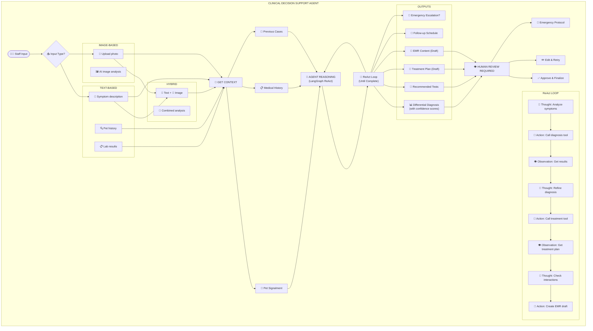

### 3.2 Diagnosis Reasoning Chain

```mermaid
sequenceDiagram
    participant Staff
    participant Agent
    participant Tools
    participant Database
    
    Staff->>Agent: "Dog, 3 tuổi, Husky, nôn 3 ngày"
    
    Note over Agent: THOUGHT 1
    Agent->>Tools: get_pet_info(pet_id="xxx")
    Tools->>Database: SELECT * FROM pets WHERE id="xxx"
    Database-->>Tools: Pet: Male, 25kg, Husky, No allergies
    Tools-->>Agent: Signalment retrieved
    
    Note over Agent: THOUGHT 2
    Agent->>Tools: get_booking_history(pet_id="xxx")
    Tools->>Database: SELECT * FROM bookings WHERE pet_id="xxx"
    Database-->>Tools: History: 2 visits, Gastritis 6 tháng trước
    Tools-->>Agent: Medical history retrieved
    
    Note over Agent: THOUGHT 3 - IMAGE ANALYSIS
    Staff->>Agent: [Upload ảnh bụng]
    Agent->>Tools: analyze_symptom_image(image, type="general")
    Tools-->>Agent: "Abdominal distension detected (75% confidence)"
    
    Note over Agent: THOUGHT 4 - DIAGNOSIS
    Agent->>Tools: symptom_to_diagnosis(
        symptoms=["vomiting", "lethargy", "anorexia"],
        pet_signalment={species: "dog", age: 3, weight: 25},
        physical_findings=["abdominal distension"],
        medical_history=["gastritis history"]
    )
    Tools-->>Agent: 
        - Gastritis (65% confidence)
        - Pancreatitis (25% confidence)
        - GI Obstruction (10% confidence)
    
    Note over Agent: THOUGHT 5 - RECOMMENDATIONS
    Agent->>Tools: treatment_recommendation(
        diagnosis="Gastritis",
        severity="MODERATE",
        confidence=0.65
    )
    Tools-->>Agent: Treatment plan draft
    
    Note over Agent: THOUGHT 6 - EMR CREATION
    Agent->>Tools: emr_autonomous_creator(
        symptoms=["vomiting", "lethargy", "anorexia"],
        diagnosis=["Gastritis (65%)", "Pancreatitis (25%)"],
        treatment_plan="Draft plan",
        auto_save=True
    )
    Tools-->>Agent: EMR-2026-02-04-001 (DRAFT)
    
    Agent-->>Staff: 
        ✅ Differential Diagnosis:
        1. Gastritis (65%)
        2. Pancreatitis (25%)
        
        🧪 Recommended: CBC, Chemistry, Ultrasound
        
        💊 Treatment Plan (Draft)
        
        📝 EMR Created: EMR-001 (Awaiting Approval)
```

### 3.3 Drug Interaction Checker Flow

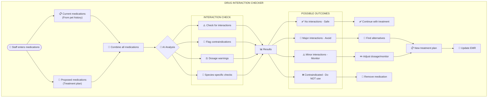

---

## 4. Operations Optimization Agent

### 4.1 Operations Agent Workflow

```mermaid
flowchart TB
    subgraph "OPERATIONS OPTIMIZATION AGENT"
        direction LR
        
        Start(["👨‍💼 Manager Query"])
        
        Start --> QueryType{"📊 Query Type?"}
        
        subgraph "DEMAND FORECASTING"
            D1["📈 Historical analysis"]
            D2["📅 Seasonal patterns"]
            D3["🔮 Demand prediction"]
            D4["👥 Staff requirements"]
        end
        
        subgraph "STAFF ALLOCATION"
            S1["📋 Available staff"]
            S2["🎯 Skill matching"]
            S3["⚖️ Workload balancing"]
            S4["⏰ Schedule optimization"]
        end
        
        subgraph "NO-SHOW PREVENTION"
            N1["🎯 Risk prediction"]
            N2["📱 Auto-reminders"]
            N3["📊 Overbooking logic"]
            N4["📈 Success tracking"]
        end
        
        subgraph "INVENTORY MANAGEMENT"
            I1["📦 Stock levels"]
            I2["📅 Usage patterns"]
            I3["🔮 Demand prediction"]
            I4["🛒 Auto-reorder alerts"]
        end
        
        QueryType --> D1
        QueryType --> S1
        QueryType --> N1
        QueryType --> I1
        
        D1 --> D2 --> D3 --> D4
        S1 --> S2 --> S3 --> S4
        N1 --> N2 --> N3 --> N4
        I1 --> I2 --> I3 --> I4
        
        D4 --> AgentReasoning["🤖 Agent Reasoning\n(LangGraph ReAct)"]
        S4 --> AgentReasoning
        N4 --> AgentReasoning
        I4 --> AgentReasoning
        
        subgraph "ReAct FOR OPERATIONS"
            R1["💭 Analyze data"]
            R2["🔧 Take actions"]
            R3["👁️ Observe results"]
            R4["💭 Optimize recommendations"]
        end
        
        AgentReasoning --> R1 --> R2 --> R3 --> R4 --> AgentReasoning
        
        subgraph "AUTONOMOUS ACTIONS"
            Auto1["📱 Send reminders"]
            Auto2["📊 Generate reports"]
            Auto3["🔔 Alert notifications"]
            Auto4["📅 Schedule suggestions"]
        end
        
        AgentReasoning --> Auto1
        AgentReasoning --> Auto2
        AgentReasoning --> Auto3
        AgentReasoning --> Auto4
        
        subgraph "OUTPUTS"
            Out1["📊 Insights dashboard"]
            Out2["📋 Recommendations"]
            Out3["📅 Action plans"]
            Out4["📈 Performance metrics"]
        end
        
        Auto1 --> Out1
        Auto2 --> Out1
        Auto3 --> Out2
        Auto4 --> Out2
        Auto4 --> Out3
        Out1 --> Out4
    end
```

### 4.2 Staff Allocation Agent Flow

```mermaid
sequenceDiagram
    participant Manager
    participant Agent
    participant Database
    participant Staff
    
    Manager->>Agent: "Dự đoán và phân bổ staff cho tuần tới"
    
    Note over Agent: THOUGHT 1
    Agent->>Database: get_booking_demand(days_ahead=7)
    Database-->>Agent: Predicted: 45 bookings (+25% vs average)
    
    Note over Agent: THOUGHT 2
    Agent->>Database: get_staff_schedules(days_ahead=7)
    Database-->>Agent: Available: 3 vets, 2 nurses
    
    Note over Agent: THOUGHT 3
    Agent->>Database: get_special_cases(days_ahead=7)
    Database-->>Agent: Complex: 3 surgeries requiring specialist
    
    Note over Agent: REASONING
    Agent->>Agent: "45 bookings cần ~4 vets/ngày peak"
    Agent->>Agent: "Hiện có 3 vets → CẦN THÊM 1 VET"
    
    Note over Agent: ACTION
    Agent->>Database: get_vet_skills()
    Database-->>Agent: Dr. Smith: Surgery specialist
    
    Agent->>Agent: "Dr. Smith có thể handle surgeries"
    
    Note over Agent: OUTPUT
    Agent-->>Manager: 
        📊 Demand: 45 bookings/tuần
        👥 Staff needed: 4 vets/ngày peak
        ⚠️ Current: 3 vets → SHORTAGE
        
        🎯 Recommendations:
        1. Schedule overtime for Dr. Smith/Wednesday
        2. Consider hiring temp vet
        3. Send reminders to reduce no-shows
        
        🤖 Auto-actions taken:
        ✅ Alert sent to manager
        ✅ Suggested schedule updated
    
    Manager->>Agent: "Approve Dr. Smith overtime"
    Agent->>Staff: "📱 Notification: Overtime scheduled"
```

---

## 5. Business Intelligence Agent

### 5.1 Business Agent Flow

```mermaid
flowchart TB
    subgraph "BUSINESS INTELLIGENCE AGENT"
        direction LR
        
        Start(["🏥 Owner Query"])
        
        Start --> QueryType{"📊 Query Type?"}
        
        subgraph "REVENUE ANALYSIS"
            R1["💰 Revenue streams"]
            R2["📈 Growth trends"]
            R3["🏆 Top services"]
            R4["📉 Underperforming"]
        end
        
        subgraph "CUSTOMER ANALYSIS"
            C1["👥 Retention rates"]
            C2["🎯 Churn prediction"]
            C3["⭐ Satisfaction"]
            C4["📢 Referrals"]
        end
        
        subgraph "COMPETITIVE ANALYSIS"
            Comp1["🏥 Nearby clinics"]
            Comp2["💵 Pricing comparison"]
            Comp3["⭐ Rating comparison"]
            Comp4["📊 Market share"]
        end
        
        subgraph "HEALTH SCORE"
            H1["📊 Overall score"]
            H2["📈 Category breakdown"]
            H3["🎯 Improvement areas"]
            H4["📉 Benchmarks"]
        end
        
        QueryType --> R1
        QueryType --> C1
        QueryType --> Comp1
        QueryType --> H1
        
        R1 --> R2 --> R3 --> R4
        C1 --> C2 --> C3 --> C4
        Comp1 --> Comp2 --> Comp3 --> Comp4
        H1 --> H2 --> H3 --> H4
        
        R4 --> AgentReasoning["🤖 Agent Reasoning"]
        C4 --> AgentReasoning
        Comp4 --> AgentReasoning
        H4 --> AgentReasoning
        
        subgraph "ReAct FOR BUSINESS"
            R1["💭 Aggregate metrics"]
            R2["🔧 Generate insights"]
            R3["👁️ Compare to benchmarks"]
            R4["💭 Form recommendations"]
        end
        
        AgentReasoning --> R1 --> R2 --> R3 --> R4 --> AgentReasoning
        
        subgraph "AUTONOMOUS OUTPUTS"
            Auto1["📊 Auto-generated reports"]
            Auto2["📈 Trend alerts"]
            Auto3["🎯 Action recommendations"]
            Auto4["📅 Opportunity highlights"]
        end
        
        AgentReasoning --> Auto1
        AgentReasoning --> Auto2
        AgentReasoning --> Auto3
        AgentReasoning --> Auto4
        
        subgraph "FINAL OUTPUTS"
            Out1["📋 Executive summary"]
            Out2["📊 Dashboard view"]
            Out3["🎯 Action plan"]
            Out4["📈 Progress tracking"]
        end
        
        Auto1 --> Out1
        Auto2 --> Out1
        Auto3 --> Out3
        Auto4 --> Out3
        Out1 --> Out2
        Out3 --> Out4
    end
```

### 5.2 Clinic Health Score Flow

```mermaid
flowchart TB
    subgraph "CLINIC HEALTH SCORE AGENT"
        direction LR
        
        Start(["📊 Calculate Health Score"])
        
        Start --> Collect["📥 Collect all metrics"]
        
        subgraph "METRICS COLLECTION"
            M1["💰 Revenue metrics\n(Total, Growth, Per service)"]
            M2["👥 Customer metrics\n(Retention, Satisfaction, Churn)"]
            M3["⚙️ Operations metrics\n(Booking rate, No-show, Staff util)"]
            M4["👨‍⚕️ Staff metrics\n(Performance, Availability)"]
        end
        
        Collect --> M1
        Collect --> M2
        Collect --> M3
        Collect --> M4
        
        M1 --> Weight["⚖️ Apply weights"]
        M2 --> Weight
        M3 --> Weight
        M4 --> Weight
        
        Weight --> Score["📊 Calculate score (0-100)"]
        
        subgraph "SCORE INTERPRETATION"
            S1["🏆 A (90-100): Excellent"]
            S2["✅ B (75-89): Good"]
            S3["⚠️ C (60-74): Needs improvement"]
            S4["❌ D (<60): Critical attention"]
        end
        
        Score --> S1
        Score --> S2
        Score --> S3
        Score --> S4
        
        subgraph "CATEGORY BREAKDOWN"
            CB1["📈 Revenue: 85/100"]
            CB2["👥 Customer: 72/100"]
            CB3["⚙️ Operations: 78/100"]
            CB4["👨‍⚕️ Staff: 90/100"]
        end
        
        S1 --> CB1
        S2 --> CB1
        S3 --> CB1
        S4 --> CB1
        CB1 --> CB2 --> CB3 --> CB4
        
        subgraph "IMPROVEMENTS"
            Imp1["🎯 Priority 1: Customer retention"]
            Imp2["🎯 Priority 2: Marketing"]
            Imp3["🎯 Priority 3: Staff training"]
        end
        
        CB2 --> Imp1
        CB3 --> Imp2
        CB4 --> Imp3
        
        subgraph "BENCHMARKS"
            B1["📊 vs Similar clinics: +5%"]
            B2["📈 Trend: Improving (+3% vs last month)"]
            B3["🎯 Industry avg: 72/100"]
        end
        
        Imp1 --> B1
        Imp2 --> B2
        Imp3 --> B3
        
        subgraph "RECOMMENDATIONS"
            Rec1["🚀 Quick win: Loyalty program"]
            Rec2["📅 Medium term: Marketing campaign"]
            Rec3["🔮 Long term: Staff expansion"]
        end
        
        B1 --> Rec1
        B2 --> Rec2
        B3 --> Rec3
        
        subgraph "FINAL REPORT"
            FR1["📋 Score: 78/100 (Good)"]
            FR2["📊 Breakdown: Revenue A, Customer B, Ops B, Staff A"]
            FR3["🎯 Top recommendation: Focus on retention"]
            FR4["📈 Trend: Improving"]
        end
        
        Rec1 --> FR1
        Rec2 --> FR2
        Rec3 --> FR3
    end
```

---

## 6. Emergency Escalation Flow

### 6.1 Emergency Protocol

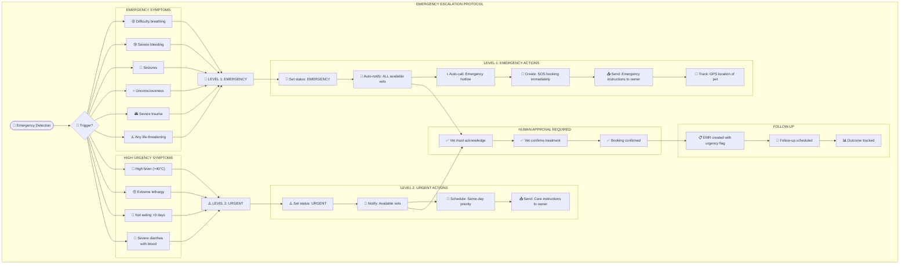

### 6.2 AI Emergency Detection Flow

```mermaid
sequenceDiagram
    participant Owner
    participant Agent
    participant Vets
    participant System
    
    Owner->>Agent: "Con chó bị khó thở, lưỡi tím!"
    
    Note over Agent: URGENCY ANALYSIS
    Agent->>Agent: "Checking symptoms: respiratory_distress, cyanosis"
    Agent->>Agent: "These are LIFE-THREATENING indicators!"
    
    Agent->>System: Set triage_level = EMERGENCY (Level 1)
    
    Note over Agent: AUTO-ESCALATION
    Agent->>Vets: 🚨 FCM NOTIFICATION
        "EMERGENCY: Respiratory distress + cyanosis
         Pet: Dog, Large breed
         Location: [GPS coordinates]
         Actions required: Immediate response"
    
    Agent->>System: Create SOS booking (PENDING_CONFIRMATION)
    
    Agent->>Owner: 
        🚨 **EMERGENCY DETECTED**
        
        Chúng tôi đã thông báo cho tất cả bác sĩ trực tuyến.
        
        📞 Trong khi chờ đợi:
        1. Giữ bình tĩnh
        2. Đảm bảo thú cưng có không khí sạch
        3. KHÔNG cho ăn/uống
        4. Sẵn sàng đưa đến clinic gần nhất
        
        📍 Vị trí của bạn: [GPS shared]
        🏥 Clinic gần nhất: [3.2 km - 8 phút]
        
        Bác sĩ sẽ liên lạc trong 2 phút.
    
    Note over Vets: VET RESPONSE
    Vets->>System: Acknowledge emergency
    Vets->>System: Confirm SOS booking
    
    System->>Agent: Booking CONFIRMED
    Agent->>Owner: 
        ✅ **Bác sĩ đã xác nhận**
        📞 Sẽ liên lạc trong giây lát
        📍 Bác sĩ [Name] đang trên đường
```

---

## 7. EMR Creation with AI

### 7.1 AI-Assisted EMR Workflow

```mermaid
flowchart TB
    subgraph "AI-ASSISTED EMR CREATION"
        direction LR
        
        Start(["👨‍⚕️ Staff starts EMR"])
        
        Start --> Input{"📥 Input Source?"}
        
        subgraph "MANUAL INPUT"
            M1["📝 Type findings"]
            M2["📋 Checklists"]
            M3["🎤 Voice dictation"]
        end
        
        subgraph "AI GENERATED"
            A1["🤖 From conversation"]
            A2["📸 From image analysis"]
            A3["🔗 From diagnosis tools"]
        end
        
        Input --> M1
        Input --> M2
        Input --> M3
        Input --> A1
        Input --> A2
        Input --> A3
        
        M1 --> Combine["🔄 Combine all sources"]
        M2 --> Combine
        M3 --> Combine
        A1 --> Combine
        A2 --> Combine
        A3 --> Combine
        
        Combine --> SoapFormat{"📋 Format as SOAP"}
        
        subgraph "SOAP STRUCTURE"
            S["📝 Subjective"]
            O["👁️ Objective"]
            A["🧠 Assessment"]
            P["📋 Plan"]
        end
        
        SoapFormat --> S
        SoapFormat --> O
        SoapFormat --> A
        SoapFormat --> P
        
        subgraph "AI ENHANCEMENTS"
            AI1["🔍 Suggest missing sections"]
            AI2["📊 Add confidence scores"]
            AI3["💊 Suggest treatment plan"]
            AI4["📅 Recommend follow-up"]
            AI5["⚠️ Flag inconsistencies"]
        end
        
        S --> AI1
        O --> AI1
        A --> AI1
        P --> AI1
        AI1 --> AI2 --> AI3 --> AI4 --> AI5
        
        subgraph "DRAFT CREATION"
            D1["📝 Create DRAFT EMR"]
            D2["🔗 Link to booking/pet/staff"]
            D3["✅ Set status: DRAFT (Needs Review)"]
        end
        
        AI5 --> D1 --> D2 --> D3
        
        subgraph "HUMAN REVIEW"
            R1["👁️ Vet reviews"]
            R2["✏️ Edit if needed"]
            R3["✅ Approve"]
            R4["📝 Finalize"]
        end
        
        D3 --> R1 --> R2 --> R3 --> R4
        
        R4 --> Final{"✅ EMR FINALIZED"}
        
        subgraph "POST-FINALIZATION"
            PF1["📊 Add to pet history"]
            PF2["📈 Update analytics"]
            PF3["🤖 Improve AI suggestions"]
        end
        
        Final --> PF1 --> PF2 --> PF3
    end
```

### 7.2 EMR Auto-Generation from Consultation

```mermaid
sequenceDiagram
    participant Vet
    participant Agent
    participant Database
    
    Vet->>Agent: "Chó 3 tuổi, Husky, nôn 3 ngày, giảm ăn. Khám thấy bụng hơi căng."
    
    Note over Agent: PARSE CONSULTATION
    Agent->>Agent: Extract:
        - Signalment: Dog, 3 years, Husky
        - Chief complaint: Vomiting 3 days, anorexia
        - Physical exam: Mild abdominal distension
    
    Note over Agent: GENERATE SECTIONS
    Agent->>Agent: Generate SOAP:
        - Subjective: Owner reported vomiting x3 days
        - Objective: Abdominal distension noted
        - Assessment: [To be confirmed with tests]
        - Plan: [To be determined]
    
    Note over Agent: ENHANCE WITH TOOLS
    Agent->>Agent: Call diagnosis for differential
    Agent->>Agent: Call lab_result_interpreter if available
    Agent->>Agent: Generate treatment recommendations
    
    Note over Agent: CREATE DRAFT
    Agent->>Database: emr_autonomous_creator(
        booking_id="xxx",
        pet_id="xxx",
        subjective="Owner reported...",
        objective="Abdominal distension...",
        assessment="Gastritis (65%)...",
        treatment_plan="IV fluids, antibiotics...",
        auto_save=True
    )
    Database-->>Agent: EMR-001 created (DRAFT)
    
    Agent-->>Vet: 
        📝 **EMR Draft Created**
        
        ┌─────────────────────────────────────┐
        │ SUBJECTIVE:                        │
        │ "Owner reported vomiting x3 days,   │
        │  anorexia. No known allergies."    │
        ├─────────────────────────────────────┤
        │ OBJECTIVE:                         │
        │ "Mild abdominal distension noted.   │
        │  Vital signs: TPR normal."          │
        ├─────────────────────────────────────┤
        │ ASSESSMENT:                        │
        │ "1. Gastritis (65% confidence) ⚠️   │
        │  2. Pancreatitis (25%)              │
        │  3. GI Obstruction (10%)"           │
        ├─────────────────────────────────────┤
        │ PLAN:                               │
        │ "1. CBC + Chemistry panel          │
        │  2. Abdominal ultrasound            │
        │  3. IV fluids: LR 500ml             │
        │  4. Ampicillin 500mg q12h x 5 days  │
        │  5. Follow-up in 7 days"            │
        └─────────────────────────────────────┘
        
        ⚠️ **Awaiting Your Review**
        [✅ Approve] [✏️ Edit] [❌ Reject]
    
    Vet->>Agent: "Approved with minor edits: tăng IV fluids lên 1000ml"
    Agent->>Database: Update EMR-001 (FINAL)
    Database-->>Agent: EMR Finalized
    Agent->>Agent: Update pet history
```

---

## 8. Clinic Setup AI Agent

### 8.1 Overview

Clinic Setup AI Agent là một AI-powered wizard giúp Clinic Owner thiết lập nhanh chóng và chuyên nghiệp thông tin phòng khám trên nền tảng Petties. Agent sử dụng ReAct pattern để:
- Generate danh sách services phù hợp với loại hình phòng khám.
- Tạo mô tả chi tiết, chuyên nghiệp cho từng service.
- Đề xuất giá cả dựa trên phân tích thị trường.
- Cấu hình weight-based pricing tiers.
- Hỗ trợ đa ngôn ngữ (Vietnamese/English).

### 8.2 Clinic Setup Agent Flow

```mermaid
flowchart TB
    subgraph "CLINIC SETUP AI AGENT"
        direction LR
        
        Start(["🏥 Clinic Owner"])
        
        Start --> Init["🚀 Start AI Setup"]
        
        Init --> Step1{"📋 Step 1: Clinic Profile"}
        
        subgraph "CLINIC PROFILE"
            C1["Select clinic type"]
            C2["Add location"]
            C3["Pet types served"]
            C4["Operating hours"]
        end
        
        Step1 --> C1 --> C2 --> C3 --> C4
        
        C4 --> Step2{"🎯 Step 2: Generate Services"}
        
        subgraph "AI SERVICE GENERATION"
            S1["Query knowledge base"]
            S2["Generate service list"]
            S3["Create descriptions"]
            S4["Suggest pricing"]
            S5["Category organization"]
        end
        
        Step2 --> S1 --> S2 --> S3 --> S4 --> S5
        
        S5 --> Step3{"✏️ Step 3: Review & Edit"}
        
        subgraph "REVIEW WORKFLOW"
            R1["Service cards display"]
            R2["Inline editing"]
            R3["Regenerate descriptions"]
            R4["Delete unwanted services"]
            R5["Add custom services"]
        end
        
        Step3 --> R1 --> R2 --> R3 --> R4 --> R5
        
        R5 --> Step4{"💰 Step 4: Pricing Tiers"}
        
        subgraph "PRICING CONFIG"
            P1["Weight-based tiers"]
            P2["Market analysis"]
            P3["Competitive pricing"]
            P4["Owner approval"]
        end
        
        Step4 --> P1 --> P2 --> P3 --> P4
        
        P4 --> Step5{"✅ Step 5: Publish"}
        
        subgraph "PUBLISH"
            Pub1["Save all services"]
            Pub2["Audit log"]
            Pub3["Activate clinic"]
            Pub4["Go live!"]
        end
        
        Step5 --> Pub1 --> Pub2 --> Pub3 --> Pub4
    end
```

### 8.3 ReAct Reasoning Example (Database + API Only)

```mermaid
sequenceDiagram
    participant CO as Clinic Owner
    participant Agent as AI Agent
    participant DB as PostgreSQL
    participant API as Spring Boot API
    participant LLM as OpenRouter (LLM)
    
    CO->>Agent: "Tôi muốn thiết lập phòng khám thú y tổng quát ở Quận 7, TPHCM"
    
    Note over Agent: THOUGHT 1
    Agent->>Agent: "Cần thu thập thông tin clinic type và location"
    Agent->>CO: "Bạn muốn loại hình phòng khám gì? (General Practice/Specialty/Emergency)"
    
    CO->>Agent: "General Practice, phục vụ chó và mèo"
    
    Note over Agent: THOUGHT 2
    Agent->>DB: query_master_services(clinic_type="general_practice", pet_types=["dog", "cat"])
    DB-->>Agent: Master Service Templates: Examination, Vaccination, Deworming, Grooming, Surgery
    
    Note over Agent: THOUGHT 3
    Agent->>LLM: generate_service_description(service="Vaccination", tone="professional")
    LLM-->>Agent: "Tiêm phòng 6 bệnh phổ biến cho chó bao gồm..."
    
    Note over Agent: THOUGHT 4
    Agent->>API: get_market_pricing(region="district_7_hcmc", service="vaccination")
    API-->>Agent: Market avg: 150-200K VND (from 45 clinics)
    
    Note over Agent: THOUGHT 5
    Agent->>Agent: "Suggest pricing với competitive but profitable margin"
    
    Agent-->>CO: 
        📋 **Generated Services (15)**
        
        [Service cards với descriptions và pricing]
        
        [✏️ Edit] [🔄 Regenerate] [🗑️ Remove]
    
    CO->>Agent: "Chỉnh giá tiêm phòng xuống 150K"
    Agent->>API: update_service_price(service_id, 150000)
    Agent-->>CO: ✅ Đã cập nhật
    
    CO->>Agent: "OK, Save All"
    Agent->>API: save_all_services(services[], metadata={ai_generated=true, approved_by=owner})
    API-->>Agent: ✅ Saved successfully
    
    Agent-->>CO: 🎉 Clinic đã sẵn sàng! 18 services đã được kích hoạt.
```

```mermaid
sequenceDiagram
    participant CO as Clinic Owner
    participant Agent as AI Agent
    participant KB as Knowledge Base
    participant DB as Database
    participant MR as MasterServiceRepository
    
    CO->>Agent: "Tôi muốn thiết lập phòng khám thú y tổng quát ở Quận 7, TPHCM"
    
    Note over Agent: THOUGHT 1
    Agent->>Agent: "Cần thu thập thông tin clinic type và location"
    Agent->>CO: "Bạn muốn loại hình phòng khám gì? (General Practice/Specialty/Emergency)"
    
    CO->>Agent: "General Practice, phục vụ chó và mèo"
    
    Note over Agent: THOUGHT 2
    Agent->>DB: query_master_services(clinic_type="general_practice", pet_types=["dog", "cat"])
    DB-->>Agent: Master Service Templates: Examination, Vaccination, Deworming, Grooming, Surgery
    
    Note over Agent: THOUGHT 3
    Agent->>Agent: "Generate descriptions using LLM với context về Vietnamese market"
    Agent->>Agent: call generate_service_description(service="Vaccination", tone="professional")
    
    Note over Agent: THOUGHT 4
    Agent->>API: get_market_pricing(region="district_7_hcmc", service="vaccination")
    API-->>Agent: Market avg: 150-200K VND (from similar clinics)
    
    Note over Agent: THOUGHT 5
    Agent->>Agent: "Suggest pricing với competitive but profitable margin"
    Agent->>Agent: calculate_suggested_price(market_avg=175000, margin=0.1)
    
    Agent-->>CO: 
        📋 **Generated Services (15)**
        
        ┌─────────────────────────────────────────┐
        │ 💉 Tiêm phòng DHPPi cho Chó           │
        │ Mô tả: Tiêm phòng 6 bệnh phổ biến... │
        │ Giá: 180,000 VNĐ (Thị trường: 175K)  │
        │ ⏱️ 15 phút  📂 Vaccination            │
        └─────────────────────────────────────────┘
        
        [✏️ Edit] [🔄 Regenerate] [🗑️ Remove]
    
    CO->>Agent: "Chỉnh giá tiêm phòng xuống 150K"
    Agent->>API: update_service_price(service_id, 150000)
    Agent-->>CO: ✅ Đã cập nhật
    
    CO->>Agent: "Thêm dịch vụ nha khoa"
    Agent->>DB: query_specialty_services(specialty="dental")
    DB-->>Agent: Dental cleaning, Tooth extraction, Oral surgery
    
    Agent-->>CO: 
        🦷 **Dental Services Added (3)**
        
        ┌─────────────────────────────────────────┐
        │ 🦷 Vệ sinh răng miệng                 │
        │ Mô tả: Làm sạch cao răng, đánh bóng...│
        │ Giá: 350,000 VNĐ                       │
        └─────────────────────────────────────────┘
    
    CO->>Agent: "OK, Save All"
    Agent->>API: save_all_services(services[], metadata={ai_generated=true, approved_by=owner})
    API-->>Agent: ✅ Saved successfully
    
    Agent-->>CO: 🎉 Clinic đã sẵn sàng! 18 services đã được kích hoạt.
```

### 8.4 AI Tools for Clinic Setup (Database/API - NO RAG)

| Tool Name | Purpose | Source | Returns |
|-----------|---------|--------|---------|
| `query_master_services` | Query Master Services templates từ DB | PostgreSQL | `[{name, category, description_template, base_price, duration}]` |
| `generate_service_description` | Tạo mô tả chi tiết cho service | LLM | `{title, description, highlights[], faqs[]}` |
| `get_market_pricing` | Lấy giá thị trường từ các clinic | Spring Boot API | `{market_avg, price_range, data_points}` |
| `suggest_weight_tiers` | Đề xuất weight-based pricing | LLM + Rules | `[{weight_range, multiplier, final_price}]` |
| `translate_service_descriptions` | Dịch descriptions | LLM | `[{service_id, translated_title, translated_description}]` |
| `import_master_services` | Import từ Master Services template | PostgreSQL | `{imported_count, services[]}` |
| `save_clinic_services` | Lưu services vào DB | PostgreSQL | `{saved_count, service_ids[]}` |
| `get_clinic_profile` | Lấy thông tin clinic | PostgreSQL | `{clinic_id, name, type, location}` |

### 8.5 Clinic Setup Agent Tools Implementation (Database/API)

```python
@mcp_server.tool
async def query_master_services(
    clinic_type: str,
    pet_types: List[str]
) -> Dict[str, Any]:
    """
    Query Master Service templates from PostgreSQL database
    
    NOTE: Không dùng RAG/Knowledge Base vì đây là structured data
    từ bảng master_services trong database.
    
    Args:
        clinic_type: Type of clinic (GENERAL_PRACTICE, SPECIALTY, EMERGENCY)
        pet_types: List of pets served (DOG, CAT, EXOTIC)
    
    Returns:
        List of master service templates from database
    """
    # Query PostgreSQL: SELECT * FROM master_services WHERE category IN (...)
    # Return structured service templates


@mcp_server.tool
async def get_market_pricing(
    region: str,
    service_category: str
) -> Dict[str, Any]:
    """
    Lấy dữ liệu giá thị trường từ các clinic đang hoạt động
    
    NOTE: Gọi Spring Boot API để lấy aggregated pricing data
    từ bảng clinic_services của các clinic trong cùng khu vực.
    
    Args:
        region: Geographic region (e.g., "district_7_hcmc")
        service_category: Service category filter
    
    Returns:
        Market pricing statistics from active clinics
    """
    # Call Spring Boot API: GET /api/analytics/market-pricing
    # Returns: {market_avg, price_range, sample_size, percentile}


@mcp_server.tool
async def save_clinic_services(
    clinic_id: UUID,
    services: List[Dict],
    metadata: Dict
) -> Dict[str, Any]:
    """
    Lưu generated services vào PostgreSQL database
    
    Args:
        clinic_id: Target clinic ID
        services: List of services to save
        metadata: Audit info (ai_generated, approved_by, etc.)
    
    Returns:
        Save result with service IDs
    """
    # Call Spring Boot API: POST /api/clinic-services/bulk
    # Insert into clinic_services table with metadata
```

### 8.6 Clinic Setup Data Sources (No RAG!)

```
┌─────────────────────────────────────────────────────────────────────────┐
│                    CLINIC SETUP DATA SOURCES                            │
├─────────────────────────────────────────────────────────────────────────┤
│                                                                         │
│  📊 DATABASE (PostgreSQL) - Structured Data                            │
│  ├── master_services: Master Service Templates (system-defined)          │
│  ├── clinic_services: Individual clinic services (user-defined)          │
│  ├── service_categories: Service category definitions                    │
│  ├── service_pricing_tiers: Weight-based pricing configurations          │
│  └── clinics: Clinic profiles and locations                             │
│                                                                         │
│  🔗 SPRING BOOT API - Business Logic                                   │
│  ├── GET /api/analytics/market-pricing: Market pricing aggregation      │
│  ├── POST /api/clinic-services/bulk: Bulk service creation              │
│  ├── PUT /api/clinic-services/{id}: Update service                     │
│  └── GET /api/clinic/{id}/services: Get clinic services                │
│                                                                         │
│  🧠 LLM (OpenRouter) - Text Generation                                 │
│  ├── Generate service descriptions (Vietnamese/English)                  │
│  ├── Translate descriptions to other languages                          │
│  └── Suggest pricing with context                                       │
│                                                                         │
│  🚫 KNOWLEDGE BASE (Qdrant RAG) - KHÔNG DÙNG CHO CLINIC SETUP!         │
│  └── RAG chỉ dùng cho: Pet care Q&A, Disease info, Medical guidelines  │
│                                                                         │
└─────────────────────────────────────────────────────────────────────────┘
```

### 8.6 Business Rules for AI Clinic Setup

| Rule | Description |
|------|-------------|
| BR-50 | All AI-generated content must be reviewable and editable |
| BR-51 | Owner must explicitly approve AI suggestions before publishing |
| BR-52 | Final pricing always requires owner confirmation |
| BR-53 | AI cannot modify existing manually-created services without permission |
| BR-54 | AI-generated content must be marked with `AI-GENERATED` label |
| BR-55 | All AI actions must be audit-logged with metadata |

### 8.7 Target User Scenarios

| Scenario | User | AI Agent Role | Outcome |
|----------|------|---------------|---------|
| **Initial Setup** | New Clinic Owner | Generate full service list | Complete clinic setup in minutes |
| **Add Specialty** | Existing Clinic Owner | Add specialty services | Expand service offerings |
| **Pricing Review** | Clinic Manager | Analyze market pricing | Competitive pricing strategy |
| **Multi-language** | Multi-location Chain | Translate descriptions | English version for foreigners |
| **Competitor Analysis** | Clinic Owner | Compare pricing | Market positioning |

---

## 9. Implementation Priority

### 9.1 Tool Implementation Priority

| Priority | Tool | Complexity | Autonomy | Impact |
|----------|------|------------|----------|--------|
| **1** | `analyze_symptom_image` | High | 🔥 Critical | ⭐⭐⭐ |
| **2** | `symptom_to_diagnosis` | High | Recommends | ⭐⭐⭐ |
| **3** | `triage_agent` | Medium | Auto-escalate | ⭐⭐⭐ |
| **4** | `emr_autonomous_creator` | Medium | Auto-draft | ⭐⭐⭐ |
| **5** | `treatment_recommendation` | High | Recommends | ⭐⭐⭐ |
| **6** | `drug_interaction_checker` | Medium | Auto-warn | ⭐⭐⭐ |
| **7** | `booking_demand_forecast` | Medium | Insights | ⭐⭐ |
| **8** | `revenue_insights_agent` | Medium | Auto-report | ⭐⭐ |
| **9** | `clinic_health_score_agent` | Low | Auto-dashboard | ⭐⭐ |
| **10** | `staff_allocation_agent` | Medium | Recommends | ⭐⭐ |
| **11** | `generate_clinic_services` | Medium | Auto-generate | ⭐⭐⭐ |
| **12** | `generate_service_description` | Low | Auto-generate | ⭐⭐ |
| **13** | `analyze_market_pricing` | Medium | Insights | ⭐⭐ |
| **14** | `suggest_weight_tiers` | Low | Auto-suggest | ⭐⭐ |
| **15** | `translate_service_descriptions` | Low | Auto-translate | ⭐ |

### 9.2 Image Analysis Types

| Image Type | Use Case | Accuracy Target | Clinical Value |
|------------|----------|----------------|----------------|
| 🦠 Skin | Rashes, lesions, alopecia | 85% | High |
| 👁️ Eye | Conjunctivitis, ulcers | 90% | Critical |
| 🩹 Wounds | Lacerations, infections | 85% | High |
| 🦷 Oral | Dental disease | 80% | Medium |
| 💩 Fecal | Parasites, consistency | 75% | Medium |
| 🤮 Vomit | Content analysis | 70% | Medium |
| 📷 General | Overall condition | 75% | Medium |

### 9.3 Technology Requirements

```
┌─────────────────────────────────────────────────────────────────────────┐
│                    TECHNOLOGY STACK REQUIREMENTS                         │
├─────────────────────────────────────────────────────────────────────────┤
│                                                                         │
│  📊 IMAGE PROCESSING:                                                  │
│  ├── Vision Model: GPT-4 Vision / Claude Vision / Gemini Pro          │
│  ├── Veterinary-specific training data                                  │
│  └── Image preprocessing pipeline                                       │
│                                                                         │
│  🧠 REASONING ENGINE:                                                  │
│  ├── LangGraph for ReAct orchestration                                 │
│  ├── Claude 3.5 Sonnet for complex diagnosis                           │
│  └── Gemini 2.0 Flash for fast responses                               │
│                                                                         │
│  📁 KNOWLEDGE BASE:                                                    │
│  ├── Veterinary diagnosis guidelines                                    │
│  ├── Drug interaction database                                          │
│  ├── Treatment protocols by species                                     │
│  └── Reference ranges for lab results                                   │
│                                                                         │
│  🔗 INTEGRATION:                                                       │
│  ├── REST API to Spring Boot backend                                   │
│  ├── Database connectors (PostgreSQL, MongoDB)                          │
│  └── FCM for push notifications                                        │
│                                                                         │
└─────────────────────────────────────────────────────────────────────────┘
```

---

## Summary

### Key Capabilities Added:

1. **🖼️ Image-Based Diagnosis** - AI analyzes photos from both Pet Owners and Staff
2. **🤖 True Agent Architecture** - LangGraph ReAct pattern with autonomous execution
3. **🚨 Emergency Escalation** - Automatic detection and escalation of critical cases
4. **📝 EMR Auto-Creation** - AI generates SOAP-formatted EMR drafts
5. **📊 Multi-Role Support** - Clinical, Operations, and Business agents

### Agent Autonomy Levels:

| Level | Capability | Clinical | Operations |
|-------|------------|----------|------------|
| 0 | Query only | ✅ | ✅ |
| 1 | Recommend | ✅ | ✅ |
| 2 | Auto-draft (needs approval) | ✅ | ✅ |
| 3 | Auto-execute safe actions | ❌ | ✅ |

---

*Document generated for Petties AI Agent Enhancement Planning*
*Version: 3.0 - With Mermaid Flowcharts and Image Diagnosis*
*Architecture Reference: LangGraph ReAct Pattern*

Petties AI is currently a **Single Agent with ReAct Pattern** using LangGraph StateGraph. Currently focused on **Pet Owner** users with RAG-based Q&A and symptom checking. This document proposes expanding AI **AGENT** capabilities to support **Clinic Staff, Managers, and Owners** with:

1. **Clinical Decision Support Agent** - Autonomous differential diagnosis, treatment planning
2. **Operations Optimization Agent** - Staff allocation, demand forecasting
3. **Business Intelligence Agent** - Revenue insights, competitive analysis

**Key Difference:** This is not "AI answering questions" - this is **AI that acts autonomously** to accomplish goals.

**Agent Execution Example:**
```
User (Staff): "Con chó husky 3 tuổi bị nôn 3 ngày, làm sao?"

Agent Reasoning:
1. Thought: "Cần thu thập thêm thông tin về triệu chứng, tiền sử"
2. Action: Call get_pet_info → get_booking_history → get_vaccination
3. Observation: Pet có tiền sử viêm dạ dày, chưa tiêm phòng
4. Thought: "Có thể là tái phát viêm dạ dày hoặc nhiễm virus"
5. Action: Call symptom_to_diagnosis → lab_result_interpreter
6. Action: Call treatment_recommendation → prescription_writer
7. Final: Trình bày kế hoạch điều trị + tạo EMR draft + lên lịch tái khám

→ Agent không chỉ trả lời, mà THỰC HIỆN CÁC HÀNH ĐỘNG
```

**Target Roles:**
- **STAFF/VET:** Clinical diagnosis assistance, treatment recommendations, EMR automation
- **CLINIC MANAGER:** Operations optimization, booking forecasting, staff allocation insights
- **CLINIC OWNER:** Business intelligence, competitive analysis, revenue optimization

---

*Document generated for Petties AI Agent Enhancement Planning*
*Version: 4.0 - Added Clinic Setup AI Agent (Database/API only, No RAG)*
*Architecture Reference: LangGraph ReAct Pattern*
│                                                                         │
│  ═══════════════════════════════════════════════════════════════════   │
│  STEP 5: AGENT TAKES AUTONOMOUS ACTIONS                                │
│  ═══════════════════════════════════════════════════════════════════   │
│  Action: create_emr_draft(...) ← Tự động tạo EMR SOAP                  │
│  Action: schedule_follow_up(...) ← Tự động lên lịch tái khám           │
│  Action: send_notification(pet_owner, ...) ← Báo owner                  │
│                                                                         │
│  ═══════════════════════════════════════════════════════════════════   │
│  FINAL OUTPUT TO STAFF:                                                 │
│  ┌─────────────────────────────────────────────────────────────────┐  │
│  │ ✅ AI AGENT ANALYSIS COMPLETE                                    │  │
│  │                                                                  │  │
│  │ 🔍 Differential Diagnosis:                                        │  │
│  │    1. Acute Gastritis (60% confidence) ← MOST LIKELY             │  │
│  │    2. Bacterial Enteritis (30%)                                  │  │
│  │    3. GI Obstruction (10%) - LOW likelihood                     │  │
│  │                                                                  │  │
│  │ 🧪 Recommended Tests:                                            │  │
│  │    • CBC + Chemistry Panel                                      │  │
│  │    • Abdominal Ultrasound                                        │  │
│  │                                                                  │  │
│  │ 💊 Treatment Plan (Auto-generated draft):                        │  │
│  │    • IV Fluids: Lactated Ringer's 500ml                        │  │
│  │    • Antibiotics: Ampicillin 500mg q12h x 5 days                │  │
│  │    • Antacid: Omeprazole 20mg q24h x 7 days                    │  │
│  │                                                                  │  │
│  │ 📋 Actions Taken (AUTONOMOUS):                                   │  │
│  │    ✅ EMR Draft Created (Ready for Review)                       │  │
│  │    ✅ Follow-up Scheduled: 2026-02-11                           │  │
│  │    ✅ Owner Notified: Appointment confirmed                      │  │
│  └─────────────────────────────────────────────────────────────────┘  │
└─────────────────────────────────────────────────────────────────────────┘
```

### 2.1 Autonomous Clinical Diagnosis System

**Agent Behavior:** When Staff describes symptoms, the agent:
1. Intelligently gathers relevant context (pet history, previous cases)
2. Performs multi-step diagnosis reasoning
3. Recommends actions, not just diagnoses
4. Can CREATE EMR draft, schedule follow-ups automatically

#### Tool: `symptom_to_diagnosis`

```python
@mcp_server.tool
async def symptom_to_diagnosis(
    symptoms: List[str],
    pet_signalment: Dict[str, Any],  # species, age, gender, weight
    physical_exam_findings: List[str],
    lab_results: Optional[Dict[str, Any]],
    medical_history: Optional[List[str]]
) -> Dict[str, Any]:
    """
    AGENT ACTION: Autonomous differential diagnosis with clinical reasoning
    
    This is NOT just Q&A - agent uses this to:
    - Build diagnostic hypothesis chains
    - Recommend diagnostic tests
    - Suggest treatment paths
    - Create follow-up schedules
    
    Args:
        symptoms: List of observed symptoms (e.g., ["lethargy", "vomiting", "diarrhea"])
        pet_signalment: Pet demographics (species, age, gender, breed, weight)
        physical_exam_findings: Findings from physical examination
        lab_results: Optional lab test results (CBC, chemistry, etc.)
        medical_history: Previous conditions, allergies, medications
    
    Returns:
        Differential diagnosis with:
        - possible_conditions: List[Dict] with name, confidence_score, severity
        - recommended_tests: Additional tests to confirm diagnosis
        - treatment_options: Suggested treatment plans
        - urgency_level: EMERGENCY, URGENT, ROUTINE
        - similar_cases: Historical cases with similar presentations
        - next_actions: What staff should do next (AGENT GUIDANCE)
    """
```

#### Tool: `treatment_recommendation`

```python
@mcp_server.tool
async def treatment_recommendation(
    diagnosis: str,
    pet_info: Dict[str, Any],
    severity: str,
    clinic_services: List[str],  # Services available at clinic
    drug_interactions_check: Optional[List[str]]  # Current medications
) -> Dict[str, Any]:
    """
    AGENT ACTION: Generate autonomous treatment plan with dosing
    
    Agent uses this to:
    - Build complete treatment protocols
    - Calculate drug dosages by weight
    - Check for drug interactions
    - Create pet owner instructions
    - Schedule follow-ups
    
    Returns:
        - treatment_plan: Detailed treatment protocol
        - medication_options: Drugs with dosages by weight
        - nursing_care: Post-treatment care instructions
        - follow_up_schedule: Recommended follow-up timeline
        - client_communication: Explanation for pet owner (ready to send)
    """
```

#### Tool: `drug_interaction_checker`

```python
@mcp_server.tool
async def drug_interaction_checker(
    current_medications: List[str],
    proposed_medications: List[str],
    species: str,
    comorbidities: Optional[List[str]]
) -> Dict[str, Any]:
    """
    AGENT ACTION: Autonomous drug safety verification
    
    Agent uses this to:
    - Automatically check interactions when treatment is proposed
    - Flag contraindications BEFORE treatment
    - Suggest alternatives if conflicts found
    
    Returns:
        - interactions: List of potential interactions with severity
        - contraindications: Conditions where drugs should be avoided
        - dosage_warnings: Species-specific dosage concerns
        - alternatives: Safer medication alternatives if needed
        - action_required: Boolean - does this require immediate attention?
    """
```

#### Tool: `lab_result_interpreter`

```python
@mcp_server.tool
async def lab_result_interpreter(
    lab_type: str,  # CBC, Chemistry, Urinalysis, etc.
    results: Dict[str, Any],
    species: str,
    reference_ranges: Optional[Dict[str, Any]]
) -> Dict[str, Any]:
    """
    AGENT ACTION: Autonomous lab result analysis
    
    Agent uses this to:
    - Interpret abnormal values in clinical context
    - Correlate multiple abnormalities
    - Suggest differential diagnoses based on patterns
    - Recommend follow-up tests
    
    Returns:
        - abnormal_values: Flagged values with clinical significance
        - pattern_analysis: Interpretation of combined abnormalities
        - differential_suggestions: Conditions that match the pattern
        - recommended_actions: Further testing or immediate treatment
        - urgency_flag: Emergency/Urgent/Routine
    """
```

#### Tool: `emr_autonomous_creator`

```python
@mcp_server.tool
async def emr_autonomous_creator(
    booking_id: UUID,
    symptoms: List[str],
    diagnosis: str,
    treatment_plan: str,
    confidence_score: float = 0.0,
    auto_save: bool = True  # Agent can auto-save draft
) -> Dict[str, Any]:
    """
    AGENT ACTION: Fully autonomous EMR creation
    
    This is where the agent truly shines - it can:
    - Create complete SOAP-formatted EMR from conversation
    - Auto-link to booking, pet, staff
    - Generate pet owner summary
    - Schedule follow-up if needed
    
    Args:
        booking_id: Link to booking for context
        symptoms: From conversation or agent reasoning
        diagnosis: From agent diagnosis tool
        treatment_plan: From agent treatment tool
        confidence_score: How confident is agent in diagnosis
        auto_save: Save as DRAFT (never publish without human approval)
    
    Returns:
        - emr_id: Created EMR UUID (if saved)
        - subjective: Owner complaint + history (draft)
        - objective: Physical exam + test results (formatted)
        - assessment: Differential diagnosis with confidence
        - plan: Treatment plan (draft)
        - status: DRAFT (requires human approval)
        - follow_up_recommended: Boolean
    """
```

#### Tool: `autonomous_follow_up_scheduler`

```python
@mcp_server.tool
async def autonomous_follow_up_scheduler(
    pet_id: UUID,
    clinic_id: UUID,
    reason: str,
    urgency: str,  # ROUTINE, PROMPT, URGENT, EMERGENCY
    preferred_vet: Optional[UUID] = None,
    auto_notify_owner: bool = True
) -> Dict[str, Any]:
    """
    AGENT ACTION: Autonomous follow-up scheduling
    
    Agent uses this to:
    - Schedule follow-ups based on treatment plan
    - Find available slots matching urgency
    - Notify pet owner automatically
    - Link to original booking
    
    Returns:
        - booking_id: Created follow-up booking UUID
        - scheduled_date: Confirmed date
        - slot_confirmed: Time slot
        - notification_sent: Owner notified
        - confirmation_code: For owner reference
    """
```

#### Tool: `triage_agent`

```python
@mcp_server.tool
async def triage_agent(
    pet_signalment: Dict[str, Any],
    chief_complaint: str,
    symptoms: List[str],
    duration: str,
    severity: str,
    owner_concern_level: str
) -> Dict[str, Any]:
    """
    AGENT ACTION: Autonomous triage with reasoning
    
    This is CRITICAL for SOS functionality. Agent:
    - Assesses urgency level (1-4)
    - Can auto-create SOS booking if emergency
    - Provides home care instructions
    - Escalates to staff if needed
    
    Triage Levels:
    - Level 1 (EMERGENCY): Immediate attention, auto-alert staff
    - Level 2 (URGENT): Same-day appointment, priority queue
    - Level 3 (PROMPT): Appointment within 24-48 hours
    - Level 4 (ROUTINE): Standard scheduling
    
    Returns:
        - triage_level: 1-4 with detailed reasoning
        - recommended_actions: What should happen (auto-executable)
        - auto_actions: Actions agent can take automatically
        - home_care_instructions: Temporary care while waiting
        - warning_signs: When to escalate to emergency
        - escalation_needed: Boolean
    """
 ```

---

*Document generated for Petties AI Agent Enhancement Planning*
*Version: 4.0 - Added Clinic Setup AI Agent (Database/API only, No RAG)*
*Architecture Reference: LangGraph ReAct Pattern*

```
┌─────────────────────────────────────────────────────────────────────────┐
│              OPERATIONS OPTIMIZATION AGENT FLOW                        │
├─────────────────────────────────────────────────────────────────────────┤
│                                                                         │
│  Manager Input: "Tuần tới clinic có đông không? Cần thêm staff không?"  │
│                                                                         │
│  ═══════════════════════════════════════════════════════════════════   │
│  AGENT REASONING CHAIN:                                                │
│  ═══════════════════════════════════════════════════════════════════   │
│                                                                         │
│  Thought: "Cần phân tích historical data + upcoming bookings"          │
│  Action: get_booking_demand_forecast(clinic_id, days_ahead=7)          │
│  Action: get_staff_schedules(clinic_id, days_ahead=7)                 │
│  Action: get_staff_available(clinic_id)                               │
│                                                                         │
│  Observation: "Dự báo 45 bookings/tuần (+25% vs tuần trước)"          │
│               "Peak: Thứ 3-5, 9AM-11AM"                               │
│               "Staff available: 3 vets, 2 nurses"                     │
│                                                                         │
│  Thought: "Với 45 bookings, cần ít nhất 4 vets/ngày peak"             │
│               "Hiện tại chỉ có 3 vets → CÓ OVERLOAD RISK"            │
│                                                                         │
│  ═══════════════════════════════════════════════════════════════════   │
│  AUTONOMOUS ACTIONS:                                                   │
│  ═══════════════════════════════════════════════════════════════════   │
│  Action: generate_staff_recommendation(...)                            │
│  Action: send_alert_to_manager(overload_risk)                         │
│  Action: suggest_overbook_prevention(no_show_prediction)               │
│                                                                         │
│  ═══════════════════════════════════════════════════════════════════   │
│  FINAL OUTPUT TO MANAGER:                                              │
│  ┌─────────────────────────────────────────────────────────────────┐  │
│  │ ✅ OPERATIONS ANALYSIS COMPLETE                                  │  │
│  │                                                                  │  │
│  │ 📊 Demand Forecast (Next 7 Days):                                │  │
│  │    Total: 45 bookings (+25% vs average)                          │  │
│  │    Peak: Tuesday-Thursday, 9AM-11AM                             │  │
│  │                                                                  │  │
│  │ 👥 Staff Analysis:                                              │  │
│  │    Current: 3 vets, 2 nurses                                    │  │
│  │    Required: 4 vets, 2 nurses (peak days)                       │  │
│  │    Status: ⚠️ 1 VET SHORTAGE on peak days                      │  │
│  │                                                                  │  │
│  │ 🎯 Recommendations (AUTONOMOUS ACTIONS):                         │  │
│  │    1. 🔔 ALERT: Notify manager of overload risk                 │  │
│  │    2. 📅 Schedule overtime for Dr. Smith/Wednesday             │  │
│  │    3. 📲 Send confirmation reminders (reduce no-shows)          │  │
│  │    4. 📦 Ensure supplies for 45 bookings                         │  │
│  └─────────────────────────────────────────────────────────────────┘  │
└─────────────────────────────────────────────────────────────────────────┘
```

### 3.1 Autonomous Booking Demand Forecasting

#### Tool: `booking_demand_forecast`

```python
@mcp_server.tool
async def booking_demand_forecast(
    clinic_id: UUID,
    days_ahead: int = 30,
    historical_months: int = 6
) -> Dict[str, Any]:
    """
    AGENT ACTION: Autonomous demand prediction with action recommendations
    
    Agent uses this to:
    - Predict booking demand for planning
    - Identify peak periods
    - Recommend staffing levels
    - Anticipate resource needs
    
    Returns:
        - daily_forecasts: Predicted bookings per day
        - peak_periods: Days/times with highest demand
        - staff_recommendations: Suggested staffing levels
        - resource_needs: Expected supplies/medications
        - comparison_to_last_year: Growth/trend analysis
        - action_required: Boolean - does this need immediate attention?
    """
```

### 3.2 Autonomous Staff Allocation

#### Tool: `staff_allocation_agent`

```python
@mcp_server.tool
async def staff_allocation_agent(
    clinic_id: UUID,
    date: date,
    predicted_bookings: int,
    staff_available: List[Dict[str, Any]],  # skills, certifications
    special_cases: Optional[List[Dict[str, Any]]]  # Complex cases
) -> Dict[str, Any]:
    """
    AGENT ACTION: Autonomous staff allocation optimization
    
    This agent can:
    - Match staff skills to booking types
    - Identify skill gaps
    - Suggest overtime if needed
    - Auto-notify staff of schedule changes
    
    Returns:
        - recommended_staff: List of staff to schedule with assignments
        - role_assignments: Who handles what
        - capacity_analysis: Can clinic handle predicted load?
        - overtime_warning: If staff may need overtime
        - skill_matching: Ensure specialists for complex cases
        - auto_actions: Notifications to send, schedules to update
    """
```

### 3.3 Autonomous No-Show Prevention

#### Tool: `no_show_prediction_agent`

```python
@mcp_server.tool
async def no_show_prediction_agent(
    booking_id: UUID,
    auto_prevent: bool = False  # Agent can auto-take actions
) -> Dict[str, Any]:
    """
    AGENT ACTION: Predict and prevent no-shows autonomously
    
    Agent uses this to:
    - Identify high-risk bookings
    - Auto-send reminders if risk > threshold
    - Suggest overbooking for high-risk slots
    
    Returns:
        - no_show_probability: Percentage likelihood
        - risk_factors: Why this booking is high/low risk
        - auto_actions: Reminders to send, bookings to confirm
        - prevention_taken: What agent already did
    """
```

### 3.4 Autonomous Inventory Management

#### Tool: `inventory_agent`

```python
@mcp_server.tool
async def inventory_agent(
    clinic_id: UUID,
    days_ahead: int = 30,
    auto_reorder: bool = False
) -> Dict[str, Any]:
    """
    AGENT ACTION: Autonomous inventory prediction and reordering
    
    Agent uses this to:
    - Predict inventory consumption
    - Identify low-stock items
    - Auto-create purchase orders (if configured)
    - Alert manager of critical shortages
    
    Returns:
        - recommended_stock: Quantity to have on hand
        - usage_patterns: Historical consumption trends
        - reorder_alerts: Items running low with urgency
        - auto_reorder_actions: Orders to place (if enabled)
        - seasonal_adjustments: Based on predicted bookings
     """
 ```

---

*Document generated for Petties AI Agent Enhancement Planning*
*Version: 4.0 - Added Clinic Setup AI Agent (Database/API only, No RAG)*
*Architecture Reference: LangGraph ReAct Pattern*
│  ═══════════════════════════════════════════════════════════════════   │
│                                                                         │
│  Thought: "Cần thu thập revenue, customer, operational data"          │
│  Action: get_revenue_insights(clinic_id, "last_30_days")              │
│  Action: get_customer_retention(clinic_id)                            │
│  Action: get_competitive_analysis(clinic_id)                           │
│  Action: get_staff_performance(clinic_id)                             │
│                                                                         │
│  Observation: "Revenue +12%, nhưng retention rate giảm 5%"             │
│               "Top complaint: wait time quá lâu peak hours"            │
│               "Competitor A: giá thấp hơn 10%, đông hơn 20%"          │
│                                                                         │
│  Thought: "Vấn đề chính: wait time → ảnh hưởng retention"              │
│               "Giải pháp: tối ưu booking slots peak hours"            │
│                                                                         │
│  ═══════════════════════════════════════════════════════════════════   │
│  AUTONOMOUS INSIGHTS + RECOMMENDATIONS:                                │
│  ═══════════════════════════════════════════════════════════════════   │
│                                                                         │
│  FINAL OUTPUT TO OWNER:                                                │
│  ┌─────────────────────────────────────────────────────────────────┐  │
│  │ ✅ BUSINESS INTELLIGENCE REPORT (AUTO-GENERATED)                │  │
│  │                                                                  │  │
│  │ 📊 Health Score: 78/100 (Good, improving)                        │  │
│  │                                                                  │  │
│  │ 📈 Revenue: +12% vs last month                                  │  │
│  │    🏆 Top: Dental (35%), Surgery (25%)                         │  │
│  │                                                                  │  │
│  │ ⚠️ Alert: Retention down 5% (Churn risk)                       │  │
│  │    Root cause: Long wait times (peak hours)                     │  │
│  │                                                                  │  │
│  │ 🎯 Actionable Recommendations:                                   │  │
│  │    1. 📅 Optimize peak hour scheduling (+2 slots AM)            │  │
│  │    2. 📢 Launch loyalty program for returning customers        │  │
│  │    3. 💰 Consider slight price adjustment (competitor lower)   │  │
│  │                                                                  │  │
│  │ 💡 Quick Win: Extend Saturday hours (data shows demand)         │  │
│  └─────────────────────────────────────────────────────────────────┘  │
└─────────────────────────────────────────────────────────────────────────┘
```

### 4.1 Autonomous Revenue Intelligence

#### Tool: `revenue_insights_agent`

```python
@mcp_server.tool
async def revenue_insights_agent(
    clinic_id: UUID,
    period: str,  # "last_30_days", "last_quarter", "year_to_date"
    auto_generate_report: bool = True
) -> Dict[str, Any]:
    """
    AGENT ACTION: Autonomous revenue analysis with actionable insights
    
    Agent uses this to:
    - Analyze revenue streams
    - Identify growth opportunities
    - Detect problems early
    - Generate executive summaries
    
    Returns:
        - total_revenue: Period revenue
        - revenue_by_service: Breakdown per service type
        - revenue_by_pet_species: Dog vs Cat vs Other
        - growth_trend: Revenue trajectory
        - peak_hours: When most revenue generated
        - recommendations: Top 3 actions to increase revenue
        - executive_summary: One-paragraph summary for owner
        - auto_report: Full report (if auto_generate=True)
    """
```

### 4.2 Autonomous Customer Retention

#### Tool: `customer_retention_agent`

```python
@mcp_server.tool
async def customer_retention_agent(
    clinic_id: UUID,
    period: str = "last_6_months",
    auto_identify_risks: bool = True
) -> Dict[str, Any]:
    """
    AGENT ACTION: Autonomous customer churn prediction and prevention
    
    Agent uses this to:
    - Identify customers at risk of leaving
    - Suggest retention strategies
    - Detect satisfaction issues early
    
    Returns:
        - return_rate: Percentage of owners who return
        - churn_risk: Owners likely to leave with reasons
        - satisfaction_indicators: Based on booking patterns
        - at_risk_customers: List with retention recommendations
        - referral_analysis: How new customers found the clinic
        - auto_actions: Retention campaigns to launch
    """
```

### 4.3 Autonomous Competitive Analysis

#### Tool: `competitive_analysis_agent`

```python
@mcp_server.tool
async def competitive_analysis_agent(
    clinic_id: UUID,
    radius_km: float = 10.0
) -> Dict[str, Any]:
    """
    AGENT ACTION: Autonomous competitive positioning analysis
    
    Agent uses this to:
    - Identify competitors in area
    - Compare pricing strategies
    - Find market opportunities
    - Suggest differentiation strategies
    
    Returns:
        - competitor_list: Nearby clinics with details
        - pricing_comparison: Your prices vs competitors
        - service_gaps: Services you don't offer
        - market_share_estimate: Your portion of local market
        - opportunities: Untapped service areas
        - strategic_recommendations: How to differentiate
    """
```

### 4.4 Autonomous Health Score Dashboard

#### Tool: `clinic_health_score_agent`

```python
@mcp_server.tool
async def clinic_health_score_agent(
    clinic_id: UUID
) -> Dict[str, Any]:
    """
    AGENT ACTION: Generate overall clinic health score (0-100)
    
    This is the OWNER's dashboard agent that:
    - Aggregates all metrics into single score
    - Identifies top improvement opportunities
    - Tracks progress over time
    - Benchmarks against industry standards
    
    Returns:
        - overall_score: 0-100 with grade (A/B/C/D/F)
        - category_scores: Revenue, Operations, Satisfaction, Staff
        - improvement_suggestions: Top 3 areas to focus
        - benchmarks: How you compare to similar clinics
        - trend_analysis: Improving or declining?
        - action_plan: Prioritized to-do list for owner
    """
```

### 4.2 Customer Retention Analysis

#### Feature: `customer_retention_analysis`

```python
@mcp_server.tool
async def customer_retention_analysis(
    clinic_id: UUID,
    period: str = "last_6_months"
) -> Dict[str, Any]:
    """
    Analyze pet owner return rates and satisfaction indicators
    
    Returns:
        - return_rate: Percentage of owners who return
        - churn_risk: Owners likely to leave
        - satisfaction_indicators: Based on booking patterns
        - at_risk_customers: List with retention recommendations
        - referral_analysis: How new customers found the clinic
    """
```

### 4.3 Competitive Positioning

#### Feature: `competitive_analysis`

```python
@mcp_server.tool
async def competitive_analysis(
    clinic_id: UUID,
    radius_km: float = 10.0
) -> Dict[str, Any]:
    """
    Analyze clinic's position vs competitors in area
    
    Returns:
        - competitor_list: Nearby clinics with details
        - pricing_comparison: Your prices vs competitors
        - service_gaps: Services you don't offer
        - market_share_estimate: Your portion of local market
        - opportunities: Untapped service areas
    """
```

### 4.4 Performance Dashboard Summary

#### Feature: `clinic_health_score`

```python
@mcp_server.tool
async def clinic_health_score(
    clinic_id: UUID
) -> Dict[str, Any]:
    """
    Generate overall clinic health score (0-100)
    
    Factors:
    - Revenue growth
    - Customer satisfaction (estimated from return rates)
    - Staff utilization
    - Booking conversion rate
    - Cancellation/no-show rates
    
    Returns:
        - overall_score: 0-100
        - category_scores: Revenue, Operations, Satisfaction, Staff
        - improvement_suggestions: Top 3 areas to focus
        - benchmarks: How you compare to similar clinics
     """
 ```

---

*Document generated for Petties AI Agent Enhancement Planning*
*Version: 4.0 - Added Clinic Setup AI Agent (Database/API only, No RAG)*
*Architecture Reference: LangGraph ReAct Pattern*

### Phase 2: Operations Optimization Agent (MEDIUM PRIORITY)

| Tool | Complexity | Agent Autonomy | Impact | Priority |
|------|------------|----------------|--------|----------|
| `booking_demand_forecast` | Medium | Planning insights | ⭐⭐ | 1 |
| `staff_allocation_agent` | Medium | **RECOMMENDATIONS** | ⭐⭐ | 2 |
| `no_show_prediction_agent` | Low | **AUTO-PREVENT** | ⭐⭐ | 3 |
| `inventory_agent` | Low | **AUTO-REORDER** | ⭐ | 4 |

### Phase 3: Business Intelligence Agent (LOWER PRIORITY)

| Tool | Complexity | Agent Autonomy | Impact | Priority |
|------|------------|----------------|--------|----------|
| `revenue_insights_agent` | Medium | Auto-reports | ⭐⭐ | 1 |
| `customer_retention_agent` | Medium | **AUTO-IDENTIFY RISKS** | ⭐⭐ | 2 |
| `clinic_health_score_agent` | Low | Auto-dashboard | ⭐⭐ | 3 |
| `competitive_analysis_agent` | Low | Strategic insights | ⭐ | 4 |

---

*Document generated for Petties AI Agent Enhancement Planning*
*Version: 4.0 - Added Clinic Setup AI Agent (Database/API only, No RAG)*
*Architecture Reference: LangGraph ReAct Pattern*
    
    # Clinical context
    pet_context: Optional[Dict[str, Any]]
    symptoms: Optional[List[str]]
    diagnosis: Optional[List[Dict[str, Any]]]
    treatment_plan: Optional[str]
    
    # Operations context
    clinic_context: Optional[Dict[str, Any]]
    forecast_data: Optional[Dict[str, Any]]
    staff_data: Optional[List[Dict[str, Any]]]
    
    # Business context
    revenue_data: Optional[Dict[str, Any]]
    retention_data: Optional[Dict[str, Any]]
    
    # Agent reasoning
    current_thought: str
    actions_taken: List[str]
    pending_actions: List[Dict[str, Any]]
    confidence_score: float
    
    # Execution
    human_approval_required: bool
    auto_actions_completed: List[str]
```

### 6.2 ReAct Agent Workflow

```python
from langgraph.graph import StateGraph, END
from langchain_core.messages import HumanMessage, AIMessage

def create_clinical_agent():
    """Create Clinical Decision Support Agent with ReAct pattern"""
    
    graph = StateGraph(AgentState)
    
    # Node: Initial reasoning
    def reason_initial(state: AgentState) -> AgentState:
        """Agent thinks about what to do based on user input"""
        user_input = state["messages"][-1]["content"]
        
        # Determine if this is diagnosis, treatment, triage, etc.
        if "triage" in user_input.lower() or "khẩn" in user_input.lower():
            state["current_role"] = AgentRole.CLINICAL
            state["current_thought"] = "User needs triage assessment"
            state["pending_actions"].append({"action": "triage_agent", "priority": 1})
        
        elif any(word in user_input for word in ["chẩn đoán", "bệnh", "triệu chứng"]):
            state["current_role"] = AgentRole.CLINICAL
            state["current_thought"] = "Need to gather symptoms and diagnose"
            state["pending_actions"].extend([
                {"action": "get_pet_context", "priority": 1},
                {"action": "symptom_to_diagnosis", "priority": 2},
                {"action": "lab_result_interpreter", "priority": 3},
            ])
        
        elif any(word in user_input for word in ["điều trị", "thuốc", "uống"]):
            state["current_role"] = AgentRole.CLINICAL
            state["pending_actions"].extend([
                {"action": "treatment_recommendation", "priority": 1},
                {"action": "drug_interaction_checker", "priority": 2},
                {"action": "emr_autonomous_creator", "priority": 3},
            ])
        
        return state
    
    # Node: Execute actions (call tools)
    def execute_action(state: AgentState) -> AgentState:
        """Execute the highest priority pending action"""
        if not state["pending_actions"]:
            return state
        
        action = state["pending_actions"].pop(0)
        action_name = action["action"]
        
        # Call the appropriate MCP tool
        if action_name == "symptom_to_diagnosis":
            result = symptom_to_diagnosis(
                symptoms=state["symptoms"],
                pet_signalment=state["pet_context"],
                # ... other params
            )
            state["diagnosis"] = result["possible_conditions"]
            state["actions_taken"].append(f"Diagnosed: {result['possible_conditions']}")
        
        elif action_name == "emr_autonomous_creator":
            result = emr_autonomous_creator(
                symptoms=state["symptoms"],
                diagnosis=state["diagnosis"],
                treatment_plan=state["treatment_plan"],
                auto_save=True  # Creates draft
            )
            state["actions_taken"].append(f"Created EMR draft: {result['emr_id']}")
            # Mark as requiring human approval
            state["human_approval_required"] = True
        
        # ... other actions
        
        return state
    
    # Node: Generate response
    def generate_response(state: AgentState) -> AgentState:
        """Generate final response to user"""
        if state["human_approval_required"]:
            response = f"""
            ✅ **AGENT ANALYSIS COMPLETE**
            
            {chr(10).join(state['actions_taken'])}
            
            📋 **NEXT STEPS:**
            - EMR draft created (awaiting your review)
            - Treatment plan ready (please verify)
            
            ⚠️ **ACTIONS REQUIRING APPROVAL:**
            Please review the draft EMR and treatment plan before finalizing.
            """
        else:
            response = f"""
            ✅ **AGENT ANALYSIS COMPLETE**
            
            {chr(10).join(state['actions_taken'])}
            """
        
        state["messages"].append(AIMessage(content=response))
        return state
    
    # Build the graph
    graph.add_node("reason", reason_initial)
    graph.add_node("execute", execute_action)
    graph.add_node("respond", generate_response)
    
    graph.set_entry_point("reason")
    graph.add_edge("reason", "execute")
    graph.add_conditional_edges(
        "execute",
        lambda state: "respond" if not state["pending_actions"] else "execute"
    )
    graph.add_edge("respond", END)
    
    return graph.compile()
```

### 6.3 Agent Autonomy Levels

| Level | Description | Example |
|-------|-------------|---------|
| **Level 0** | Query-only, no actions | "Chó tôi bị gì?" → Chatbot answers |
| **Level 1** | Recommends actions | "Nên làm xét nghiệm máu" |
| **Level 2** | Prepares actions for approval | "Tạo EMR draft, chờ duyệt" |
| **Level 3** | Auto-executes safe actions | "Đã gửi reminder cho owner" |
| **Level 4** | Full autonomous execution | "Đã tạo booking, gửi notification, lên lịch tái khám" |

**Petties Target: Level 3 for most cases, Level 2 for clinical decisions**

---

*Document generated for Petties AI Agent Enhancement Planning*
*Version: 4.0 - Added Clinic Setup AI Agent (Database/API only, No RAG)*
*Architecture Reference: LangGraph ReAct Pattern*

**For Clinical AI:**
- EMR records (MongoDB) - Historical cases, treatments, outcomes
- Vaccination records (MongoDB) - Disease patterns
- Booking data - Symptom seasonality
- Drug database - Drug interactions, contraindications

**For Operations AI:**
- Booking history - Demand patterns
- Staff schedules - Utilization data
- Payment history - Revenue analytics

### 6.2 Knowledge Base Extensions

**Medical Knowledge Base:**
- Veterinary diagnosis guidelines
- Drug formularies with species-specific info
- Treatment protocols
- Reference ranges for lab results

**Business Knowledge Base:**
- Clinic performance benchmarks
- Industry standards
- Regional demographics

### 6.3 LLM Requirements

| Feature | Recommended Model | Reasoning |
|---------|------------------|-----------|
| Clinical Diagnosis | Claude 3.5 Sonnet / Gemini 2.0 Flash | Complex medical reasoning |
| Treatment Recommendations | Claude 3.5 Sonnet | Detailed treatment planning |
| Triage Assessment | Gemini 2.0 Flash | Fast decision-making |
| EMR Drafting | Gemini 2.0 Flash / Llama 3.3 | Structured output |
| Business Analytics | Gemini 2.0 Flash | Fast, cost-effective |

---

*Document generated for Petties AI Agent Enhancement Planning*
*Version: 4.0 - Added Clinic Setup AI Agent (Database/API only, No RAG)*
*Architecture Reference: LangGraph ReAct Pattern*
│  │  ❌ AI never administers treatments                                │ │
│  │  ❌ AI never prescribes without approval                           │ │
│  │                                                                   │ │
│  │  ✅ AI CAN:                                                        │ │
│  │     • Suggest differential diagnoses with confidence scores       │ │
│  │     • Recommend diagnostic tests                                   │ │
│  │     • Draft EMR for human review                                   │ │
│  │     • Draft treatment plans for approval                           │ │
│  │     • Flag emergency cases for immediate attention                 │ │
│  ╚═══════════════════════════════════════════════════════════════════╝ │
│                                                                         │
│  ╔═══════════════════════════════════════════════════════════════════╗ │
│  ║  OPERATIONAL DECISIONS: SEMI-AUTONOMOUS                            ║ │
│  ╠═══════════════════════════════════════════════════════════════════╣ │
│  │  ✅ AI CAN AUTO-EXECUTE:                                           │ │
│  │     • Send booking reminders (reduce no-shows)                     │ │
│  │     • Generate reports and dashboards                             │ │
│  │     • Identify staffing needs                                      │ │
│  │     • Alert for inventory reordering                              │ │
│  │                                                                   │ │
│  │  ⚠️  REQUIRES APPROVAL:                                           │ │
│  │     • Staff schedule changes                                       │ │
│  │     • Purchase orders                                              │ │
│  │     • Pricing changes                                              │ │
│  ╚═══════════════════════════════════════════════════════════════════╝ │
│                                                                         │
└─────────────────────────────────────────────────────────────────────────┘
```

### 8.2 Clinical Safety Rules

```
1. AI is ASSISTIVE only - final diagnosis always with licensed veterinarian
2. All AI suggestions must be clearly marked as "AI recommendation"
3. Confidence scores displayed prominently (e.g., "85% confidence")
4. Urgent cases always flagged for immediate human review
5. Drug dosages require human verification before administration
6. EMR drafts saved as DRAFT status, require staff approval before FINAL
7. Treatment plans marked as "For review" until approved by vet
8. AI never performs actions on humans or animals - only recommends
```

### 8.3 Emergency Escalation Protocol

```
╔═══════════════════════════════════════════════════════════════════════╗
║                    EMERGENCY ESCALATION FLOW                        ║
╠═══════════════════════════════════════════════════════════════════════╣
║                                                                       ║
║  AI detects: "Confusion, seizures, difficulty breathing"           ║
║                                                                       ║
║  ─────────────────────────────────────────────────────────────────   ║
║  AI Action:                                                          ║
║  1. Set triage_level = EMERGENCY (Level 1)                          ║
║  2. Auto-notify: All available vets via FCM                         ║
║  3. Auto-create: SOS booking if requested                            ║
║  4. Send to owner: Emergency instructions + clinic contact           ║
║                                                                       ║
║  ─────────────────────────────────────────────────────────────────   ║
║  Human Action REQUIRED:                                              ║
║  • Vet must acknowledge emergency                                    ║
║  • Vet confirms treatment plan                                       ║
║                                                                       ║
╚═══════════════════════════════════════════════════════════════════════╝
```

### 8.4 Disclaimer Requirements

```
All AI-generated recommendations are for reference only and should be
verified by a licensed veterinarian before administration.

AI does not replace professional veterinary diagnosis or treatment.

Petties AI Agent operates as a clinical decision support system,
providing recommendations that require human verification.

Emergency cases: Always seek immediate veterinary care.
```

### 9.1 Staff EMR Screen - Agent Integration

```
┌─────────────────────────────────────────────────────────────────────────┐
│ EMR Creation - Husky (3 tuổi)           🤖 AI AGENT ACTIVE │ Save │
├─────────────────────────────────────────────────────────────────────────┤
│                                                                         │
│ Chief Complaint: "Nôn 3 ngày, giảm ăn"                                │
│ Symptoms: [Nôn] [Giảm ăn] [Mệt mỏi] [+ tag]                           │
│                                                                         │
│ ╔═══════════════════════════════════════════════════════════════════╗  │
│ ║ 🤖 AGENT PANEL - Autonomous Actions                          ║  │
│ ╠═══════════════════════════════════════════════════════════════════╣  │
│ ║                                                                   ║  │
│ ║ [Button: 🔍 Run AI Diagnosis]                                    ║  │
│ ║                                                                   ║  │
│ ║ ──────────────────────────────────────────────────────────────── ║  │
│ ║ 🤖 AGENT ACTIONS (ReAct Pattern):                               ║  │
│ ║ 1. Thought: "Gathering pet context..."                         ║  │
│ ║ 2. Action: get_pet_info → ✅ Retrieved                        ║  │
│ ║ 3. Action: get_booking_history → ✅ Retrieved                 ║  │
│ ║ 4. Action: symptom_to_diagnosis → Processing...               ║  │
│ ║ 5. Thought: "High confidence: Gastritis (60%)"                ║  │
│ ║ 6. Action: treatment_recommendation → ✅ Ready                ║  │
│ ║ 7. Action: emr_autonomous_creator → ✅ Draft Created          ║  │
│ ║                                                                   ║  │
│ ║ ──────────────────────────────────────────────────────────────── ║  │
│ ║ 📊 AI DIAGNOSIS RESULTS:                                        ║  │
│ ║ 1. Acute Gastritis (60% confidence) ⚠️ RECOMMENDED            ║  │
│ ║ 2. Bacterial Enteritis (30%)                                    ║  │
│ ║ 3. GI Obstruction (10%)                                         ║  │
│ ║                                                                   ║  │
│ ║ 🧪 RECOMMENDED TESTS:                                           ║  │
│ ║ [CBC + Chemistry] [Abdominal Ultrasound]                          ║  │
│ ║                                                                   ║  │
│ ║ 💊 TREATMENT PLAN (Draft):                                      ║  │
│ ║ • IV Fluids: Lactated Ringer's 500ml                          ║  │
│ ║ • Antibiotics: Ampicillin 500mg q12h × 5 days                  ║  │
│ ║ • Antacid: Omeprazole 20mg q24h × 7 days                      ║  │
│ ║                                                                   ║  │
│ ║ 📋 AUTONOMOUS ACTIONS:                                           ║  │
│ ║ ✅ EMR Draft Created (ID: EMR-2026-02-04-001)                  ║  │
│ ║ ✅ Follow-up Scheduled: 2026-02-11 (Awaiting Approval)         ║  │
│ ║ ✅ Owner Notified: Confirmation sent                            ║  │
│ ║                                                                   ║  │
│ ║ ⚠️ REQUIRES APPROVAL:                                           ║  │
│ ║ [Button: ✅ Approve EMR] [Button: ✏️ Edit] [Button: ❌ Reject] ║  │
│ ╚═══════════════════════════════════════════════════════════════════╝  │
│                                                                         │
│ Physical Exam: [Organized by body system]                               │
│ Assessment: [Editable - AI suggestion: Gastritis]                        │
│ Plan: [Editable - AI generated draft]                                    │
└─────────────────────────────────────────────────────────────────────────┘
```

### 9.2 Manager Dashboard - Agent Insights

```
┌─────────────────────────────────────────────────────────────────────────┐
│ Clinic Dashboard                          🤖 AI AGENT ACTIVE            │
├─────────────────────────────────────────────────────────────────────────┤
│                                                                         │
│ ┌─ 📊 AGENT DEMAND FORECAST ──────────────────────────────────────────┐ │
│ │ 🤖 AGENT ACTIONS:                                                   │ │
│ │ 1. Thought: "Analyzing historical data..."                           │ │
│ │ 2. Action: get_booking_demand_forecast → ✅ Ready                   │ │
│ │ 3. Action: get_staff_schedules → ✅ Ready                          │ │
│ │ 4. Thought: "Overload risk identified"                             │ │
│ │ 5. Action: staff_allocation_agent → Recommendations ready          │ │
│ │                                                                    │ │
│ │ 📈 Predicted bookings next week: 45 (+25% vs average)              │ │
│ │ ⚠️ Peak: Tuesday-Thursday, 9AM-11AM                              │ │
│ │ 👥 Recommendation: Add 1 staff for peak hours                     │ │
│ └─────────────────────────────────────────────────────────────────────┘ │
│                                                                         │
│ ┌─ 🔔 AUTONOMOUS ALERTS ─────────────────────────────────────────────┐ │
│ │ 🤖 AGENT ACTIONS:                                                   │ │
│ │ • Alert: Thursday 95% capacity → Auto-suggest waitlist             │ │
│ │ • Tip: Send reminders to reduce no-shows (15% risk)               │ │
│ │ • Suggest: Overbook 2 slots for Thursday AM                       │ │
│ └─────────────────────────────────────────────────────────────────────┘ │
│                                                                         │
│ ┌─ 📈 REVENUE INSIGHTS ──────────────────────────────────────────────┐ │
│ │ 💰 Revenue up 12% this month vs average                           │ │
│ │ 🏆 Top service: Dental cleaning (35% of revenue)                  │ │
│ │ 📉 Slow service: Grooming (consider promotion)                     │ │
│ └─────────────────────────────────────────────────────────────────────┘ │
│                                                                         │
│ 🤖 [Button: Generate Full Operations Report]                          │
│ 🤖 [Button: Auto-Schedule Staff Adjustments]                          │
└─────────────────────────────────────────────────────────────────────────┘
```

### 9.3 Owner Dashboard - Business Intel Agent

```
┌─────────────────────────────────────────────────────────────────────────┐
│ Business Intelligence                    🤖 AI AGENT ACTIVE              │
├─────────────────────────────────────────────────────────────────────────┤
│                                                                         │
│ ┌─ 📊 HEALTH SCORE ────────────────────────────────────────────────────┐ │
│ │ 🤖 AGENT ANALYSIS:                                                  │ │
│ │ 1. Thought: "Aggregating all metrics..."                           │ │
│ │ 2. Action: get_revenue_insights → ✅                               │ │
│ │ 3. Action: get_customer_retention → ✅                             │ │
│ │ 4. Action: get_staff_performance → ✅                              │ │
│ │ 5. Thought: "Calculating overall health score..."                  │ │
│ │                                                                    │ │
│ │ Clinic Score: 78/100 (Good)                                       │ │
│ │ ↑ Revenue: +12% │ ↑ Satisfaction: +5% │ ↓ No-shows: -3%          │ │
│ └─────────────────────────────────────────────────────────────────────┘ │
│                                                                         │
│ ┌─ 🎯 AUTONOMOUS RECOMMENDATIONS ────────────────────────────────────┐ │
│ │ 🤖 AGIGHTS:                                                 ENT INS │ │
│ │                                                                    │ │
│ │ 💡 OPPORTUNITY 1: Retention Risk (23% one-time customers)         │ │
│ │    Action: Loyalty program could increase retention by 15%          │ │
│ │    🤖 [Button: Design Loyalty Program]                             │ │
│ │                                                                    │ │
│ │ 💡 OPPORTUNITY 2: Weekend Expansion (40% higher revenue)          │ │
│ │    Action: Consider expanding Saturday hours                        │ │
│ │    🤖 [Button: Analyze Weekend Demand]                             │ │
│ │                                                                    │ │
│ │ ⚠️ ALERT: Competitor A prices 10% lower, 20% more customers      │ │
│ │    Action: Review pricing strategy                                 │ │
│ │    🤖 [Button: Competitive Analysis]                              │ │
│ └─────────────────────────────────────────────────────────────────────┘ │
└─────────────────────────────────────────────────────────────────────────┘
```

---

*Document generated for Petties AI Agent Enhancement Planning*
*Version: 4.0 - Added Clinic Setup AI Agent (Database/API only, No RAG)*
*Architecture Reference: LangGraph ReAct Pattern*
    thought_process TEXT,  -- Agent's reasoning at each step
    actions_called JSONB,  -- All tool calls made
    
    -- Context
    pet_id UUID REFERENCES pets(id),
    booking_id UUID REFERENCES bookings(booking_id),
    clinic_id UUID REFERENCES clinics(clinic_id),
    
    -- Results
    diagnosis JSONB,
    treatment_plan JSONB,
    confidence_score DECIMAL(3,2),
    
    -- Autonomy
    autonomy_level INT DEFAULT 0,  -- 0: query, 1: recommend, 2: draft, 3: auto
    human_approval_required BOOLEAN DEFAULT FALSE,
    human_approved_by UUID REFERENCES users(user_id),
    human_approved_at TIMESTAMP,
    
    -- Feedback
    was_helpful BOOLEAN,  -- User feedback
    user_rating INT,  -- 1-5 rating
    
    created_at TIMESTAMP DEFAULT now()
);

-- Index for fast retrieval
CREATE INDEX idx_ai_agent_logs_pet ON ai_agent_logs(pet_id);
CREATE INDEX idx_ai_agent_logs_clinic ON ai_agent_logs(clinic_id);
CREATE INDEX idx_ai_agent_logs_created ON ai_agent_logs(created_at DESC);
```

### 10.2 Agent Configuration (Per Clinic/User)

```sql
CREATE TABLE ai_agent_config (
    config_id UUID PRIMARY KEY DEFAULT gen_random_uuid(),
    clinic_id UUID REFERENCES clinics(clinic_id),
    user_id UUID REFERENCES users(user_id),
    
    -- Autonomy settings
    autonomy_level VARCHAR(20) DEFAULT 'recommend',  -- 'query', 'recommend', 'draft', 'auto'
    auto_create_emr BOOLEAN DEFAULT FALSE,
    auto_schedule_followup BOOLEAN DEFAULT FALSE,
    auto_send_reminders BOOLEAN DEFAULT TRUE,
    auto_reorder_inventory BOOLEAN DEFAULT FALSE,
    
    -- Clinical safety
    require_approval_for_treatment BOOLEAN DEFAULT TRUE,
    require_approval_for_emr BOOLEAN DEFAULT TRUE,
    confidence_threshold DECIMAL(3,2) DEFAULT 0.7,
    
    -- Notifications
    notify_on_high_risk BOOLEAN DEFAULT TRUE,
    notify_on_emergency BOOLEAN DEFAULT TRUE,
    
    created_at TIMESTAMP DEFAULT now(),
    updated_at TIMESTAMP DEFAULT now()
);
```

### 10.3 EMR Enhancement for Agent Context

```java
@Entity
public class EmrRecord {
    // Existing fields...
    
    @Column(columnDefinition = "JSONB")
    private String aiDiagnosisSuggestions;  // AI differential diagnosis
    
    @Column(columnDefinition = "JSONB")
    private String aiTreatmentRecommendations;  // AI treatment suggestions
    
    @Column(columnDefinition = "JSONB")
    private String agentReasoningChain;  // ReAct thought process
    
    private boolean aiAssisted;  // Whether AI agent was used
    private UUID agentSessionId;  // Reference to AI agent log
    
    private float aiConfidenceScore;  // Confidence level
    
    private boolean doctorReviewedAI;  // Doctor verified AI suggestions
    private UUID approvedBy;  // Who approved
    private LocalDateTime approvedAt;  // When approved
    
    @Column(columnDefinition = "JSONB")
    private String agentAutonomousActions;  // What agent auto-executed
 }
```

---

*Document generated for Petties AI Agent Enhancement Planning*
*Version: 4.0 - Added Clinic Setup AI Agent (Database/API only, No RAG)*
*Architecture Reference: LangGraph ReAct Pattern*
│  User: "Chó tôi bị nôn"           User: "Chó tôi bị nôn"            │
│  Bot: "Có thể là..."              Agent: 1. Get pet context           │
│  User: "Làm sao chữa?"            → 2. Get booking history           │
│  Bot: "Cho uống thuốc..."         → 3. Get vaccination               │
│  User: "Tạo EMR?"                 → 4. Analyze symptoms              │
│  Bot: "Tôi không thể..."          → 5. Generate diagnosis             │
│                                    → 6. Suggest treatment              │
│                                    → 7. Create EMR draft              │
│                                    → 8. Schedule follow-up             │
│                                    → 9. Notify owner                   │
│                                                                         │
│  Result: Answer                    Result: Complete workflow           │
│                                   with human approval                  │
└─────────────────────────────────────────────────────────────────────────┘
```

### Key Success Factors:

1. **Clear Agent Boundaries** - Agent knows when to act vs recommend
2. **Human-in-the-Loop** - Critical decisions always require verification
3. **Transparent Reasoning** - Shows thought process to users
4. **Configurable Autonomy** - Different levels for different use cases
5. **Continuous Learning** - Improves from outcomes and feedback
6. **Safety First** - Emergency escalation, drug safety, clinical compliance

---

*Document generated for Petties AI Agent Enhancement Planning*
*Version: 4.0 - Added Clinic Setup AI Agent (Database/API only, No RAG)*
*Architecture Reference: LangGraph ReAct Pattern*
