# Tài liệu Kỹ thuật – AI Agent Service (Petties)

**Phiên bản:** 1.3  
**Cập nhật:** 2026-03-04  
**Tham chiếu:** AI_AGENT_SERVICE_SRS.md, AI_AGENT_SERVICE_SDD.md, REPORT_4_SDD_SYSTEM_DESIGN.md

---

## Mục lục

1. [Tổng quan và phạm vi AI trong project](#1-tổng-quan-và-phạm-vị-ai-trong-project)
2. [Use cases AI](#2-use-cases-ai)
3. [AI giúp tính năng nào “xịn” hơn](#3-ai-giúp-tính-năng-nào-xịn-hơn)
4. [System Architecture – AI là thành phần tách biệt](#4-system-architecture--ai-là-thành-phần-tách-biệt)
5. [Package diagram – AI Service](#5-package-diagram--ai-service)
6. [Sequence diagrams – Gửi/nhận dữ liệu với AI](#6-sequence-diagrams--gửinhận-dữ-liệu-với-ai)
7. [Gọi AI, chờ phản hồi và xử lý khi AI lỗi](#7-gọi-ai-chờ-phản-hồi-và-xử-lý-khi-ai-lỗi)
8. [Thiết kế database – Lưu dữ liệu gửi/nhận và kết quả AI](#8-thiết-kế-database--lưu-dữ-liệu-gửinhận-và-kết-quả-ai)
9. [Class diagram – Gói gọn gọi và xử lý AI](#9-class-diagram--gói-gọn-gọi-và-xử-lý-ai)

---

## 1. Tổng quan và phạm vi AI trong project

### 1.1 Vai trò AI trong Petties

AI Agent Service là **thành phần tách biệt** (microservice Python FastAPI), không nhúng trực tiếp vào luồng xử lý chính của Spring Boot. Nó cung cấp:

- **Chat trợ lý AI** cho Pet Owner (Mobile) qua WebSocket streaming.
- **RAG (Retrieval-Augmented Generation)** dựa trên Knowledge Base (LlamaIndex + Qdrant + Cohere).
- **Tools (FastMCP)** gọi ngược lại Spring Boot (booking, clinic, slot, pet) và RAG để thực hiện hành động thay user.
- **Cấu hình động** (agent, tools, prompt, API keys) lưu trên PostgreSQL, Admin quản lý qua Web.

### 1.2 Các việc AI có thể làm trong project

| Nhóm | Chức năng | Mô tả ngắn |
|------|-----------|------------|
| **Chat & tư vấn** | Hỏi đáp chăm sóc thú cưng | RAG + tool `pet_knowledge_search` tra Knowledge Base, trả lời có trích dẫn nguồn. |
| | Chẩn đoán sơ bộ theo triệu chứng | Tool `pet_knowledge_search`: tra cứu thông tin triệu chứng/bệnh trong Knowledge Base, khuyên đặt lịch nếu cần. |
| | Đặt lịch qua chat | Tools `get_user_pets`, `search_clinics_nearby`, `get_clinic_services`, `check_available_slots`, `create_booking_for_user` gọi Spring Boot API. |
| **Vision** | Phân tích hình ảnh sức khỏe thú cưng | Planned / future scope, chưa được implement trong AI service hiện tại. |
| **Clinic / Staff** | Hỗ trợ xử lý booking, FAQ, gợi ý reassign, thêm lịch làm việc | Dùng cùng Single Agent, có thể bật tools tương ứng cho role (Web) và chỉ thực thi khi người dùng xác nhận. |
| **Admin** | Cấu hình Agent, Tools, Knowledge Base | REST API + Web: prompt, model, hyperparameters, enable/disable tools, upload/test RAG. |
| **Fallback** | Trả lời khi confidence thấp | Tool `web_search` (ví dụ DuckDuckGo): bổ sung thông tin từ web khi RAG/vision trả về confidence thấp; vẫn trích dẫn nguồn và khuyên đi khám khi liên quan sức khỏe. |

---

## 2. Use cases AI

Use cases được nhóm theo actor và boundary (theo SRS AI Agent Service).

### 2.1 Pet Owner (Mobile)

| UC-ID | Tên | Mô tả ngắn |
|-------|-----|-------------|
| UC-001 | Chat with AI Agent | Gửi tin nhắn qua WebSocket, nhận stream response + ReAct trace (thought/tool/observation). |
| UC-002 | Ask pet care questions (RAG) | Agent gọi `pet_knowledge_search` → RAG query → trả lời kèm citation. |
| UC-003 | Search diseases by symptoms | Agent gọi `pet_knowledge_search` → trả thông tin tham khảo về triệu chứng/bệnh và khuyên đến phòng khám nếu cần. |
| UC-004 | Book appointment via chat | Agent gọi `get_user_pets` → `search_clinics_nearby` → `get_clinic_services` → `check_available_slots` → `create_booking_for_user` (gọi Spring Boot). |
| UC-019 | Analyze pet health images (Vision) | Planned / future scope, chưa có tool runtime trong AI service hiện tại. |
| UC-029 | Retrieve vet tips from web (fallback) | Khi RAG nội bộ không đủ hoặc user hỏi thông tin cập nhật, agent gọi `web_search` để lấy nguồn tham khảo và tóm tắt hướng dẫn/mẹo chăm sóc (kèm trích dẫn nguồn). |
| UC-AI-030 | Summarize medical history (Pet Owner) | Tool gọi API backend lấy pet health records, vaccinations, past bookings/EMR → AI tóm tắt thành medical summary report với timeline, medications, upcoming appointments. Pet owner có thể export PDF. |

### 2.2 Clinic Staff / Manager / Owner (Web + Mobile)

**AI Assistant hoạt động như trợ lý ảo (virtual assistant) cho từng role:**
- **Context-aware:** AI biết user role, clinic context, và task đang làm
- **Proactive notifications:** AI chủ động gửi alerts/suggestions qua slide-in chat panel hoặc toast notifications
- **Conversational:** Staff/Manager/Owner chat với AI để nhận gợi ý, phân tích, và thực hiện tasks

| UC-ID | Tên | Role | Mô tả ngắn |
|-------|-----|------|-------------|
| UC-020 | AI Staff Assistant (Proactive) | Staff | AI chủ động thông báo: "Bạn có 3 booking pending", "Phát hiện conflict lịch 14:00", "Pet Max sắp hết hạn vaccination". Staff chat để hỏi về booking, EMR, scheduling. |
| UC-021 | AI Manager Assistant (Proactive) | Manager | AI chủ động alert: "CẢNH BÁO SOS mới - Countdown 50s", "Báo cáo ngày: 25 bookings, 15M doanh thu", "Gợi ý reassign 4 bookings để cân bằng workload", "Tuần tới thiếu 3 ca chiều". Manager chat để xử lý operations. |
| UC-022 | AI Owner Assistant (Proactive) | Owner | AI chủ động insight: "Doanh thu tháng tăng 18%", "Top 3 dịch vụ revenue", "Booking giảm 12% tuần này do mưa", "Gợi ý mở rộng: Dental Cleaning có nhu cầu cao", "Dr. Hùng workload cao nhất, nên tuyển thêm?". Owner chat để business intelligence. |
| UC-023 | Summarize patient info & EMR | Staff | Tool gọi API backend lấy pet/booking/EMR, tóm tắt thành patient summary cho Staff trước khi khám. |
| UC-024 | Assist creating staff work schedules | Manager | AI đề xuất ca làm (ngày/giờ/nhân sự) dựa trên workload analysis, có thể gọi tool tạo shifts khi Manager xác nhận. Human-in-the-loop required. |
| UC-025 | Suggest optimizing work schedules | Manager | AI phân tích shift patterns, suggest optimizations để cân bằng workload và reduce conflicts. |
| UC-026 | Assist setting up clinic | Owner | AI-guided setup wizard: hướng dẫn checklist thiết lập phòng khám (địa chỉ, giờ làm, dịch vụ, phí SOS), gợi ý cấu hình phù hợp. |
| UC-027 | Generate & add clinic services | Owner | **AI tự động generate services:** Owner nhập clinic type + pet types + region → AI analyze master_services + market pricing → generate service list với Vietnamese descriptions + suggested prices → batch create services vào clinic sau confirmation. Human review before execution. |
| UC-028 | Compose clinic description | Owner | AI viết/biên tập mô tả phòng khám dựa trên strengths, target customers, specialties. Generate professional Vietnamese text phù hợp hiển thị trên app. |
| UC-030 | Auto-suggest staff assignments | Manager | AI reviews unassigned bookings, analyzes staff availability + specialties, suggests best-fit staff assignments. Manager review & approve before execution. |
| UC-AI-031 | Proactive notification system | All Clinic Roles | AI chủ động gửi notifications (toast/panel) khi phát hiện issues, insights, hoặc opportunities. User click "XEM" → mở AI chat panel với context focused. Notification types: 🔴 Urgent / 🟡 Warning / 🟢 Info. |

### 2.3 Admin (Web)

| UC-ID | Tên | Mô tả ngắn |
|-------|-----|-------------|
| UC-005 | Configure Agent | Bật/tắt agent, chọn model, hyperparameters. |
| UC-006 | Edit System Prompt | Sửa prompt, version (lưu PostgreSQL). |
| UC-007 | Adjust Hyperparameters | Temperature, Max Tokens, Top-P. |
| UC-008 | Select LLM Model | OpenRouter: gemini-2.0-flash, llama-3.3-70b, claude-3.5-sonnet. |
| UC-009 | View Tools list | Danh sách @mcp.tool, enable/disable. |
| UC-010 | Enable/Disable Tool | Bật/tắt từng tool cho agent. |
| UC-011 | View Tool Schema | Input/output schema của từng tool. |
| UC-012 | Upload documents | Upload PDF/DOCX → RAG index (LlamaIndex + Qdrant). |
| UC-013 | Delete documents | Xóa document và vectors tương ứng. |
| UC-014 | Test RAG Retrieval | Gửi query test, xem chunks trả về. |
| UC-015 | Configure API Keys | OpenRouter, Cohere, Qdrant (lưu system_settings). |
| UC-016 | Test Connections | Kiểm tra kết nối LLM/Cohere/Qdrant. |

### 2.4 System (Background)

| UC-ID | Tên | Mô tả ngắn |
|-------|-----|-------------|
| UC-017 | Auto-index documents | Index tài liệu mới (nếu có pipeline). |
| UC-018 | Clean up chat history | Dọn session/message cũ (ví dụ TTL 90 ngày). |

---

## 3. AI giúp tính năng nào “xịn” hơn

### 3.1 Luồng giá trị AI theo tính năng

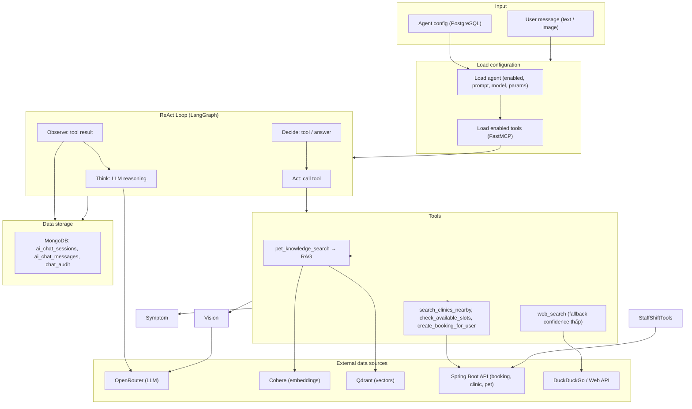

### 3.2 Dữ liệu nội bộ AI sử dụng

> Trọng tâm trình bày: dữ liệu này giúp AI cải thiện chất lượng trả lời (RAG), độ chính xác nghiệp vụ (tools gọi Spring Boot) và khả năng audit (chat metadata).

| Source | Data | Purpose |
|--------|------|---------|
| **PostgreSQL (AI DB)** | `agents`, `tools`, `system_settings`, `knowledge_documents` | Cấu hình agent, danh sách tools, API keys, meta document RAG. |
| **PostgreSQL (shared)** | (Tools gọi Spring Boot) | Booking, clinic, slot, pet – qua HTTP từ AI service tới backend. |
| **Qdrant Cloud** | Vectors + payload (chunk text, document_id) | RAG: embedding query, tìm chunk tương tự, đưa context cho LLM. |
| **MongoDB** | `ai_chat_sessions`, `ai_chat_messages` (session_id, user_id, messages với metadata) | Lưu lịch sử hội thoại, thoughts, tool_calls, sources để phân tích/audit. |
| **OpenRouter** | LLM API | Generate thought, answer; Vision: multimodal (text + image). |
| **Cohere** | Embeddings API | Embed query và chunk cho RAG. |

### 3.3 Giải quyết vấn đề (ReAct)

1. **Thought:** LLM phân tích câu hỏi, quyết định cần tool nào hay trả lời luôn.
2. **Action:** Gọi đúng tool (`pet_knowledge_search`, `web_search`, `search_clinics_nearby`, ...); tool xử lý logic nội bộ, có thể gọi RAG engine hoặc Spring Boot REST API khi cần dữ liệu domain.
3. **Observation:** Kết quả tool được đưa lại vào state.
4. **Loop:** Lặp Think → Act → Observe tối đa N lần (ví dụ 5), sau đó Generate final answer.
5. **Answer:** Stream text về client; đồng thời lưu session + messages (và metadata) vào MongoDB.

### 3.4 Fallback khi confidence thấp – Web search

Khi kết quả từ RAG có **confidence thấp** (ít chunk liên quan, score thấp, hoặc không tìm thấy thông tin phù hợp), hoặc user hỏi **cẩm nang thú y / mẹo chăm sóc / thông tin cập nhật**, agent có thể gọi tool **web search** (ví dụ DuckDuckGo hoặc API tìm kiếm) để bổ sung thông tin cho người dùng:

- **Điều kiện:** Confidence của tool trước đó dưới ngưỡng (cấu hình được), user hỏi ngoài phạm vi knowledge base, hoặc chủ đề yêu cầu thông tin cập nhật theo thời gian.
- **Luồng:** Agent tạo query tìm kiếm từ câu hỏi user / mô tả triệu chứng → gọi `web_search(query)` → nhận danh sách snippet/title/URL → đưa vào context cho LLM tổng hợp câu trả lời.
- **Trả lời:** LLM vẫn phải trích dẫn nguồn (URL hoặc "theo kết quả tìm kiếm"), và với câu hỏi sức khỏe phải **khuyên đi khám / không thay thế chẩn đoán bác sĩ**.
- **Cấu hình:** `DUCKDUCKGO_MAX_RESULTS` (số kết quả tối đa lấy về, ví dụ 5).

Tool web search **không thay thế** RAG; nó dùng để **phòng trường hợp confidence thấp** và vẫn cần hiển thị disclaimer phù hợp (thông tin từ web, cần tham khảo bác sĩ thú y).

### 3.5 AI duoc phat trien/van hanh va cap nhat du lieu theo thoi gian

De tra loi dung moi quan tam cua reviewer/mentor, AI duoc van hanh theo 3 vong chinh va 4 co che cai thien do chinh xac:

#### A. 3 Vong Van Hanh

1. **Vong phat trien (Development):**
    - Them/cap nhat tool bang code (`@mcp.tool`).
    - Version hoa prompt, model, hyperparameters trong PostgreSQL.
    - Kiem thu API/tool va regression theo use case.

2. **Vong van hanh (Operations):**
    - Runtime lay config dong tu DB (khong hard-code).
    - Ghi log + trace (thought/tool/observation) vao chat metadata de audit.
    - Theo doi loi LLM/tool, ap dung retry va fallback an toan.

3. **Vong cap nhat tri thuc (Knowledge Refresh):**
    - Admin upload tai lieu moi -> chunking -> embedding -> upsert Qdrant.
    - Re-index dinh ky hoac khi tai lieu thay doi.
    - Don du lieu chat cu theo chinh sach retention.

#### B. 4 Co che Cai thien Do Chinh xac

| # | Co che | Mo ta | Trang thai |
|---|--------|-------|------------|
| 1 | **Query Expansion** | LLM tu dong mo rong query ngan gon (vd: "cho non bo an" -> them dong nghia, thuat ngu chuyen mon, trieu chung lien quan) truoc khi RAG search. Tang recall dang ke. | Implemented |
| 2 | **Knowledge Graph** | LlamaIndex KnowledgeGraphIndex extract triplets (trieu chung -> benh -> loai -> phac do) tu tai lieu thu y. Hybrid query RAG + KG cho phep suy luan chuoi ma RAG thuan khong lam duoc. | Planned (Phase 2) |
| 3 | **Visual Case Memory** | Moi lan chan doan qua hinh anh: LLM Vision mo ta visual features -> embed text + metadata (loai, benh, feedback) -> luu vao Qdrant collection `petties_case_memory`. Lan sau gap anh tuong tu -> tim case da confirmed -> chinh xac hon. | Implemented |
| 4 | **Feedback Loop** | User/bac si danh gia dung/sai (thumbs up/down). Case confirmed -> tu dong embed vao Case Memory. Case rejected -> giam trong so. Prompt duoc tinh chinh dua tren pattern tu feedback. | Implemented |

#### C. Flow Tong the: He thong Tot len Theo Thoi gian

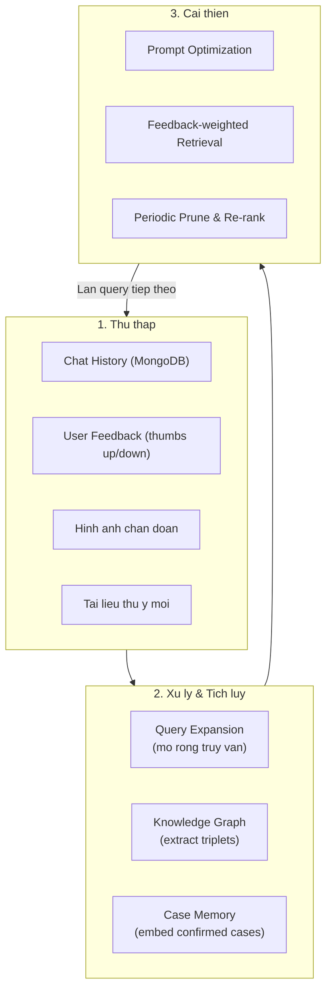

**Ket qua:** Cang nhieu case tich luy, AI cang co nhieu tri thuc tham chieu thuc te. He thong khong bao gio dung mai 1 bo du lieu cu — no tu lon len sau moi lan su dung.

**Chi tiet day du:** Xem `AI_AGENT_DATA_IMPROVEMENT_STRATEGY.md` Section 7-11.

### 3.6 Prompt Version có cần thiết không?

**Câu trả lời ngắn:** Có, nhưng mức độ phụ thuộc giai đoạn sản phẩm.

- **Không bắt buộc tuyệt đối cho MVP** nếu chỉ có 1 prompt ổn định và team nhỏ.
- **Rất cần cho production** khi có nhiều lần tinh chỉnh prompt, nhiều admin, và yêu cầu audit/revert.

**Vì sao nên dùng Prompt Version trong Petties:**
1. Dễ rollback khi prompt mới làm giảm chất lượng trả lời.
2. So sánh hiệu quả giữa các phiên bản prompt theo KPI (tool success, helpful rate).
3. Truy vết ai sửa gì, khi nào (phục vụ vận hành và review).

**Nguyên tắc vận hành khuyến nghị:**
- Mỗi thay đổi prompt tạo một version mới, không ghi đè trực tiếp.
- Chỉ 1 version active tại một thời điểm cho mỗi agent.
- Gắn notes cho từng version (mục tiêu thay đổi, rủi ro, kỳ vọng).
- Đánh giá qua một tập câu hỏi chuẩn trước khi activate toàn hệ thống.

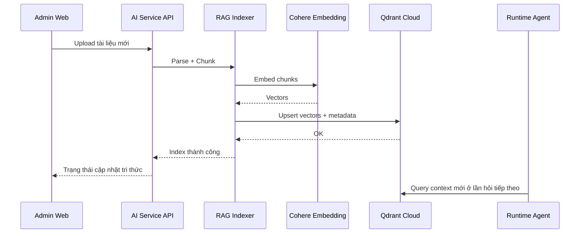

---

## 4. System Architecture – AI là thành phần tách biệt

AI được mô tả trong Report 4 là **thành phần tách biệt** (Python FastAPI) trong backend, ngang hàng với Spring Boot, phía sau API Gateway.

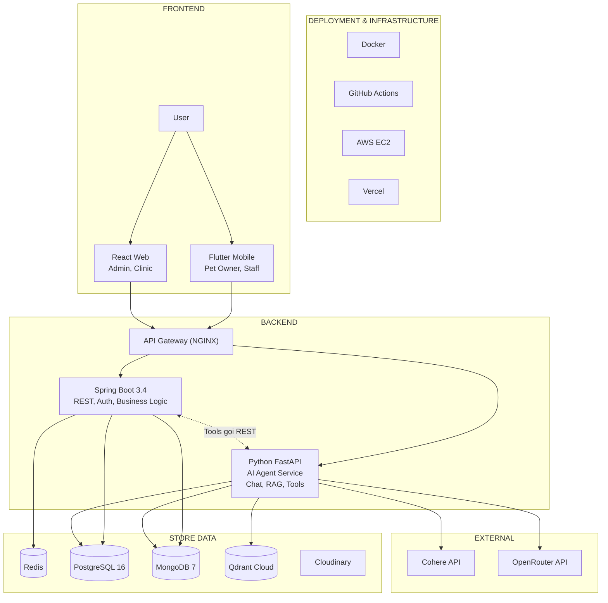

**Kết luận:** AI không nhúng trong “main processing logic” của Spring Boot; nó là service riêng. Luồng nghiệp vụ chính (booking, EMR, thanh toán) chạy trên Spring Boot; khi cần trợ lý AI thì client (Mobile/Web) kết nối tới AI service (WebSocket/REST), và AI gọi ngược Spring Boot qua tools.

---

## 5. Package diagram – AI Service

Package diagram của AI service (theo Report 4, mục 1.2.1 Python AI Agent Service):

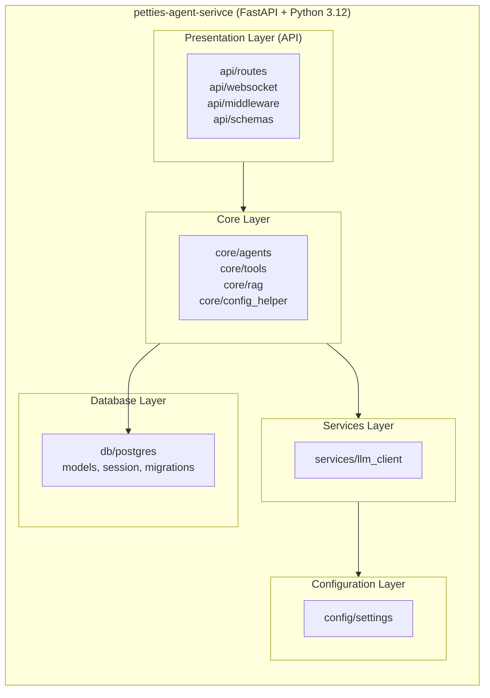

| Package | Trách nhiệm |
|---------|--------------|
| **api/routes** | REST: chat sessions, agents, tools, knowledge, settings. |
| **api/websocket** | WebSocket chat, streaming, ReAct events. |
| **api/middleware** | Auth (JWT từ Spring Boot), logging. |
| **core/agents** | Single Agent, ReAct (LangGraph), state, factory. |
| **core/tools** | FastMCP server, executor, scanner, mcp_tools (`pet_knowledge_search`, `web_search`, booking tools, ...). |
| **core/rag** | LlamaIndex RAG engine, Cohere, Qdrant. |
| **services** | LLM client (OpenRouter), streaming. |
| **db/postgres** | Agent, Tool, PromptVersion, KnowledgeDocument, SystemSetting (không lưu message chat). |

---

## 6. Sequence diagrams – Gửi/nhận dữ liệu với AI

### 6.1 Tổng quát - AI flow cho mọi user role

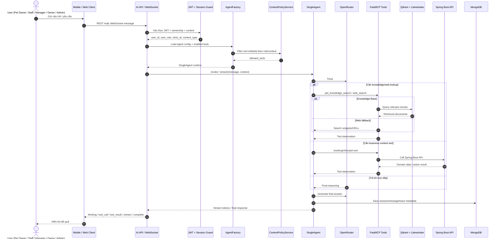

### 6.2 Mobile gửi tin nhắn, nhận stream (WebSocket)

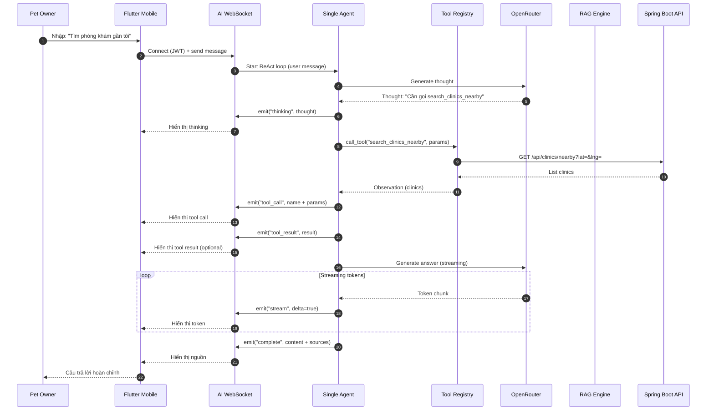

### 6.3 REST: Gửi message, chờ response (đồng bộ)

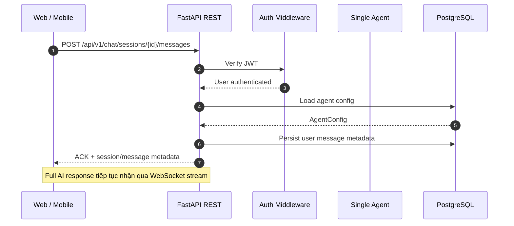

### 6.4 Web Clinic Staff chat với AI (WebSocket)

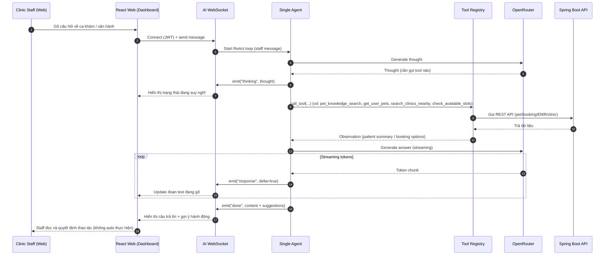

---

## 7. Gọi AI, chờ phản hồi và xử lý khi AI lỗi

### 7.1 Nơi hệ thống gọi AI

| Caller | Cách gọi | Endpoint / Cơ chế |
|--------|----------|--------------------|
| **Mobile (Pet Owner)** | WebSocket | Kết nối `wss://<host>/ws/chat`, gửi message dạng JSON (text hoặc image). |
| **Web (Admin)** | REST | GET/PUT `/api/v1/agents`, `/api/v1/tools`, `/api/v1/knowledge/...`, POST test RAG/playground. |
| **Web (Clinic Staff/Manager)** | (Có thể WebSocket hoặc REST tùy triển khai) | Cùng WebSocket chat hoặc REST session. |

Luồng chính cho chat: **Mobile/Web → API Gateway → AI Service (FastAPI) → WebSocket hoặc REST**. Spring Boot **không** gọi AI service để xử lý nghiệp vụ booking/EMR; AI chỉ được gọi từ client (hoặc từ Admin dashboard).

### 7.2 Cách chờ phản hồi

- **WebSocket:** Client giữ kết nối, gửi một message và nhận nhiều event (`thinking`, `tool_call`, `tool_result`, `stream`, `complete`, `error`). Client đọc từng event đến khi `type: "complete"` hoặc `type: "error"`.
- **REST:** `POST /api/v1/chat/sessions/{id}/messages` hiện tại dùng để persist user message/metadata và trả ACK; luồng phản hồi AI đầy đủ được nhận qua WebSocket.

### 7.3 Xử lý khi AI lỗi

Theo SRS (UC-001 Alternative Flow) và SDD (WebSocket message type `error`):

| Tình huống | Cách xử lý |
|------------|------------|
| **Agent disabled** | API/WS trả message "Trợ lý AI đang bảo trì, vui lòng thử lại sau". |
| **LLM API error** | Retry tối đa 3 lần; sau đó trả lỗi "Đã có lỗi xảy ra, vui lòng thử lại". |
| **Timeout (>30s)** | Trả "Request timeout, vui lòng thử lại". |
| **WebSocket error event** | Client nhận `{ "type": "error", "error": "...", "code": "LLM_ERROR" }` và hiển thị thông báo lỗi, không coi là câu trả lời thành công. |

Sequence diagram: Client nhận lỗi từ AI service:

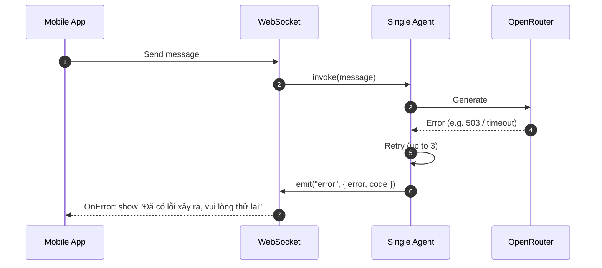

---

## 8. Thiết kế database – Lưu dữ liệu gửi/nhận và kết quả AI

Thiết kế hiện tại **có hỗ trợ** lưu dữ liệu gửi tới AI và kết quả AI trả về để phân tích/kiểm chứng sau này.

### 8.1 PostgreSQL (AI service)

| Bảng | Nội dung liên quan gửi/nhận AI |
|------|--------------------------------|
| **agents / tools / prompt_versions** | Cấu hình agent, cấu hình tools, version prompt để vận hành và rollback. |
| **knowledge_documents** | Metadata tài liệu RAG (file, trạng thái xử lý, vector_count). |
| **system_settings** | API keys, model config, embedding/vector settings. |

→ PostgreSQL dùng cho **configuration + governance**, không phải nơi lưu message chat AI-user.

### 8.2 MongoDB (AI chat history)

Collections `ai_chat_sessions`, `ai_chat_messages`, `ai_proactive_notifications` và `chat_feedback` hỗ trợ runtime chat AI-user:

- **ai_chat_sessions:** session_id, user_id, user_role, clinic_id, context_type, agent_id, created_at, updated_at
- **ai_chat_messages:** message_id, session_id, user_id, role, content, context_type, react_trace, tool_calls, sources, timestamp
- **ai_proactive_notifications:** log thông báo chủ động/phân tích AI theo user
- **chat_feedback:** thumbs up/down và feedback text theo message

→ Đủ để:
- Phân tích sau: câu hỏi nào, tool nào được gọi, kết quả tool, nguồn RAG.
- Kiểm chứng: so sánh input/output, audit ReAct trace.

### 8.3 Kết luận

- **Dữ liệu gửi tới AI:** Lưu trong MongoDB (`ai_chat_messages`, role=`user`).
- **Kết quả AI trả về:** Lưu trong MongoDB (`ai_chat_messages`, role=`assistant`) kèm `react_trace`, `tool_calls`, `sources`.
- **RAG/vector:** Chunk và embedding lưu ở Qdrant; metadata document ở PostgreSQL (knowledge_documents). Có thể trace từ tool_calls/sources về document và chunk.

---

## 9. Class diagram – Gói gọn gọi và xử lý AI

Gọi AI và xử lý kết quả được gói trong các lớp/mô-đun riêng (AI Client / Agent / Prediction không nhúng trực tiếp vào controller Spring Boot).

### 9.1 Class diagram tổng quát

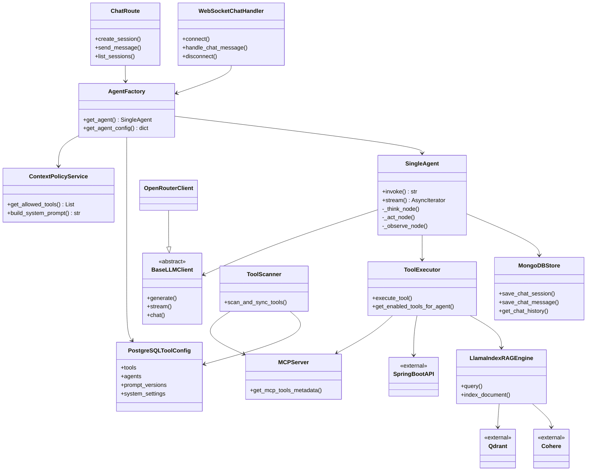

### 9.2 Lớp chính phía AI Service (FastAPI)

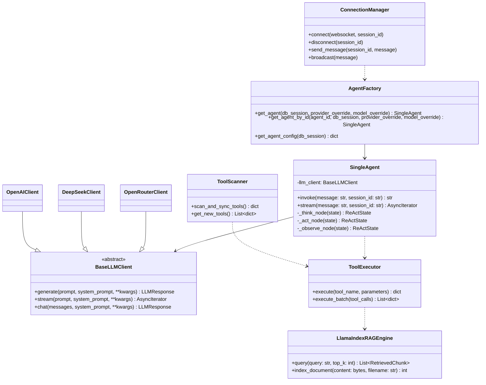

### 9.3 Tách biệt module

| Module / Class | Vai trò |
|----------------|--------|
| **BaseLLMClient + OpenRouterClient/DeepSeekClient/OpenAIClient (services/llm_client)** | Đóng gói gọi provider LLM theo interface thống nhất `generate/stream/chat`. |
| **SingleAgent (core/agents/single_agent)** | Điều phối ReAct: think → act → observe; gọi LLM client và thực thi tools; không chứa logic nghiệp vụ Spring Boot. |
| **AgentFactory (core/agents/factory)** | Load cấu hình agent + tools từ PostgreSQL, tạo `SingleAgent` runtime theo cấu hình động. |
| **ToolExecutor + ToolScanner + mcp_server (core/tools)** | Scan/sync tool metadata, validate input, thực thi tool qua FastMCP, quản trị enable/disable từ DB. |
| **LlamaIndexRAGEngine (core/rag)** | Gói RAG: embed, query Qdrant, trả chunk; tách biệt với agent và tools. |
| **ConnectionManager + WebSocket handlers (api/websocket/chat.py)** | Quản lý kết nối realtime, gửi event `thinking/tool_call/tool_result/stream/complete/error` cho client. |

→ **Kết luận:** Gọi AI và xử lý (ReAct, tools, RAG) được đóng gói trong các lớp/mô-đun riêng bám sát code hiện tại (`AgentFactory`, `SingleAgent`, `BaseLLMClient` family, `ToolExecutor`, `LlamaIndexRAGEngine`, `ConnectionManager`); không nằm trong Spring Boot. Spring Boot chỉ đóng vai trò API backend được tools gọi khi cần (booking, clinic, pet).

---

## Tài liệu tham chiếu
- [REPORT_4_SDD_SYSTEM_DESIGN.md](SDD/REPORT_4_SDD_SYSTEM_DESIGN.md) – Mục 1.1 System Architecture, 1.2 Package Diagram, 4.10 AI Assistance Flow.
- [TECHNICAL SCOPE PETTIES - AGENT MANAGEMENT.md](TECHNICAL%20SCOPE%20PETTIES%20-%20AGENT%20MANAGEMENT.md) – Single Agent, ReAct, tools, admin config.
