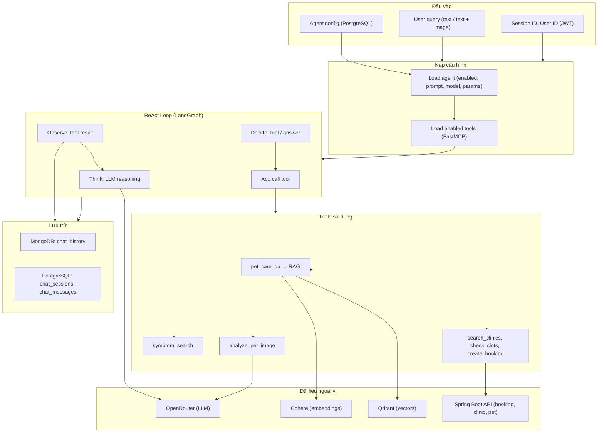
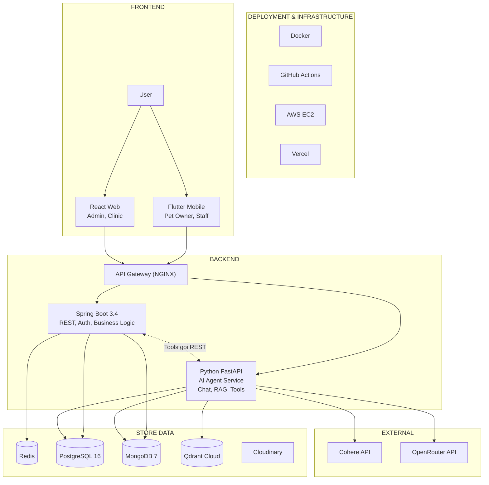
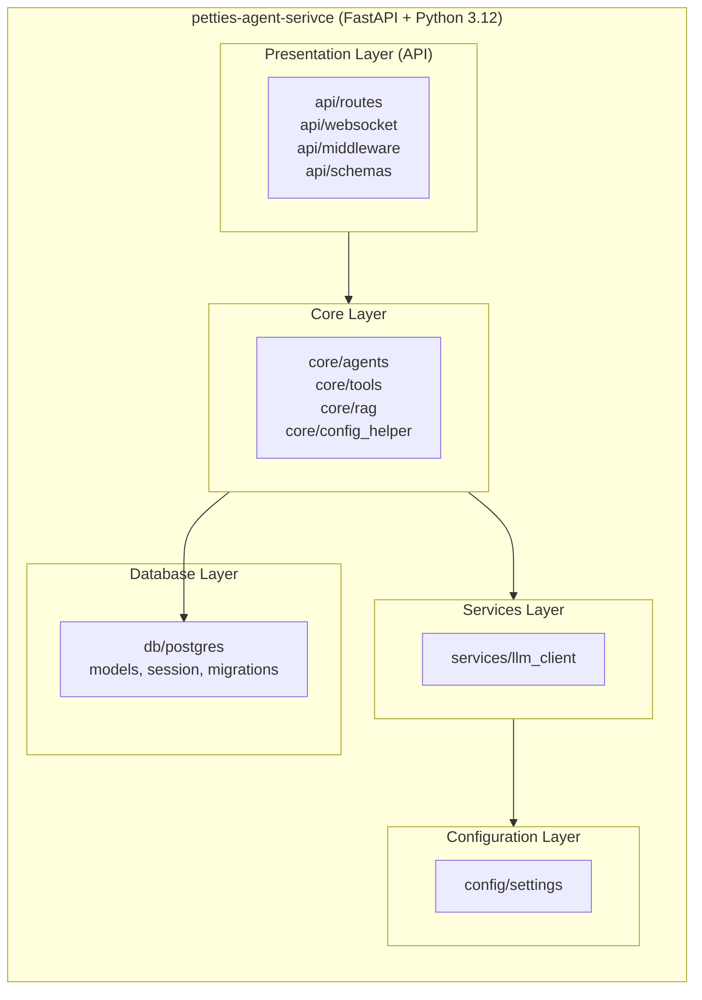
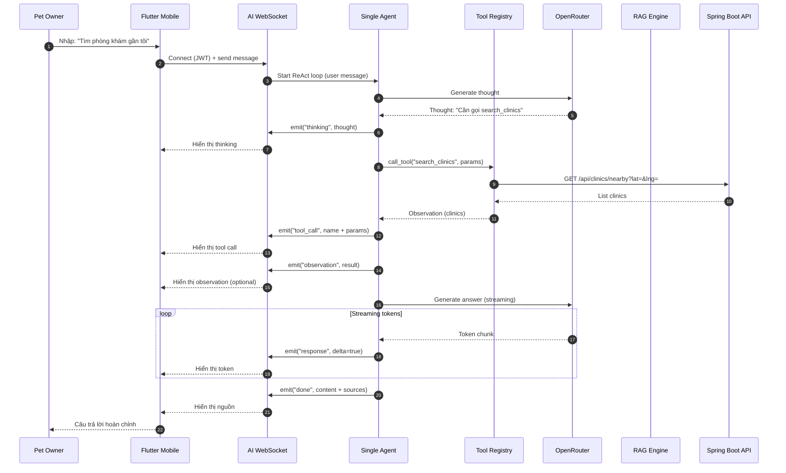
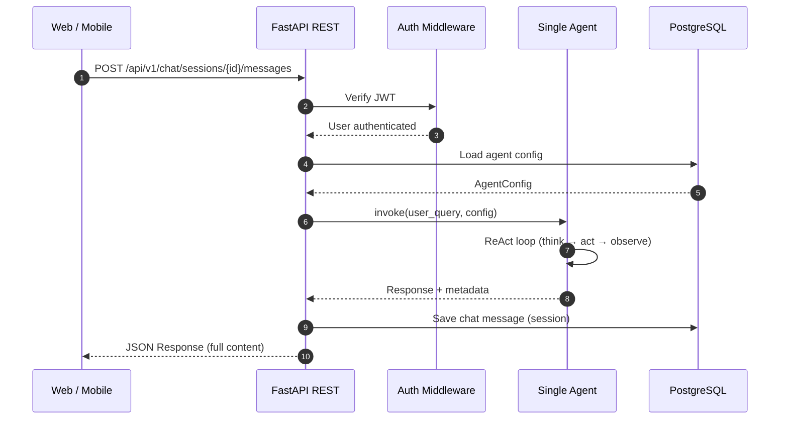
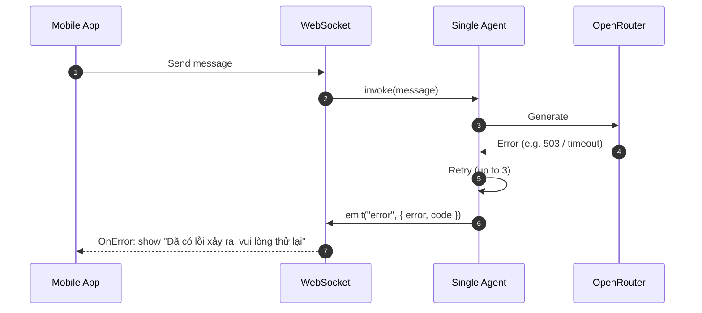
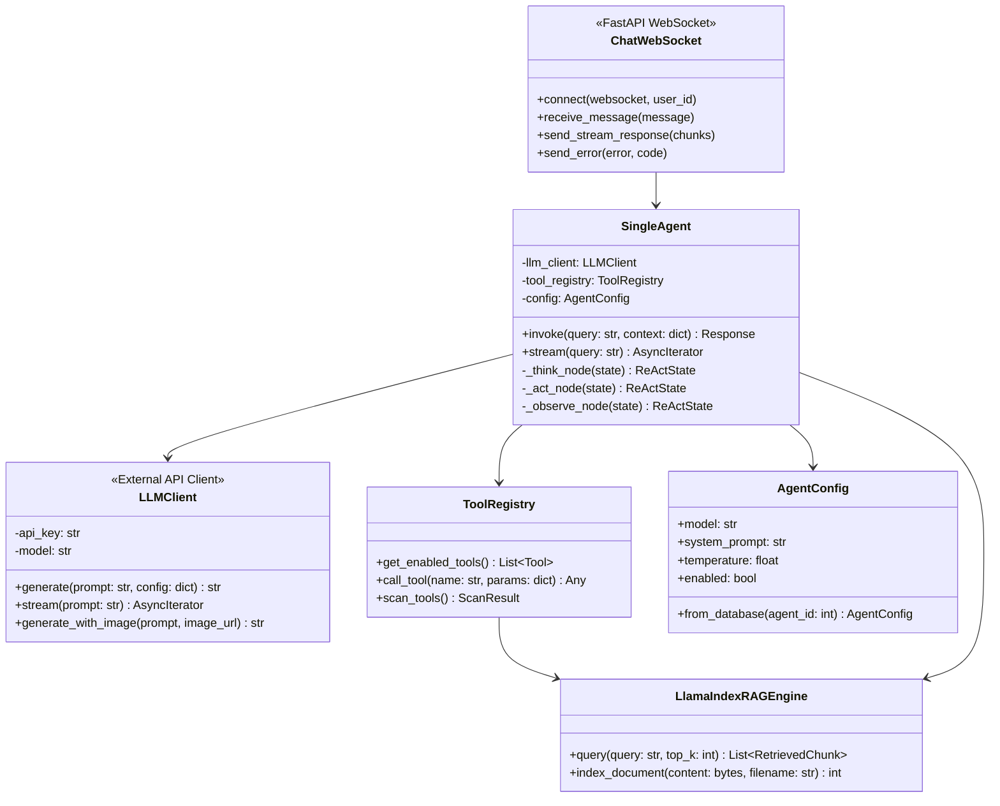

# Tài liệu Kỹ thuật – AI Agent Service (Petties)

**Phiên bản:** 1.0  
**Cập nhật:** 2026-03-02  
**Tham chiếu:** AI_AGENT_SERVICE_SRS.md, AI_AGENT_SERVICE_SDD.md, REPORT_4_SDD_SYSTEM_DESIGN.md

---

## Mục lục

1. [Tổng quan và phạm vi AI trong project](#1-tổng-quan-và-phạm-vị-ai-trong-project)
2. [Use cases AI](#2-use-cases-ai)
3. [Vòng đời hoạt động của AI và dữ liệu nội bộ](#3-vòng-đời-hoạt-động-của-ai-và-dữ-liệu-nội-bộ)
4. [System Architecture – AI là thành phần tách biệt](#4-system-architecture--ai-là-thành-phần-tách-biệt)
5. [Package diagram – AI Service](#5-package-diagram--ai-service)
6. [Sequence diagrams – Gửi/nhận dữ liệu với AI](#6-sequence-diagrams--gửinhận-dữ-liệu-với-ai)
7. [Gọi AI, chờ phản hồi và xử lý khi AI lỗi](#7-gọi-ai-chờ-phản-hồi-và-xử-lý-khi-ai-lỗi)
8. [Thiết kế database – Lưu dữ liệu gửi/nhận và kết quả AI](#8-thiết-kế-database--lưu-dữ-liệu-gửinhận-và-kết-quả-ai)
9. [Class diagram – Gói gọn gọi và xử lý AI](#9-class-diagram--gói-gọn-gọi-và-xử-lý-ai)

---

## 1. Tổng quan và phạm vi AI trong project

### 1.1 Vai trò AI trong Petties

AI Agent Service là **thành phần tách biệt** (microservice Python FastAPI), không nhúng trực tiếp vào luồng xử lý chính của Spring Boot. Nó cung cấp:

- **Chat trợ lý AI** cho Pet Owner (Mobile) qua WebSocket streaming.
- **RAG (Retrieval-Augmented Generation)** dựa trên Knowledge Base (LlamaIndex + Qdrant + Cohere).
- **Tools (FastMCP)** gọi ngược lại Spring Boot (booking, clinic, slot, pet) và RAG để thực hiện hành động thay user.
- **Cấu hình động** (agent, tools, prompt, API keys) lưu trên PostgreSQL, Admin quản lý qua Web.

### 1.2 Các việc AI có thể làm trong project

| Nhóm | Chức năng | Mô tả ngắn |
|------|-----------|------------|
| **Chat & tư vấn** | Hỏi đáp chăm sóc thú cưng | RAG + tool `pet_care_qa` tra Knowledge Base, trả lời có trích dẫn nguồn. |
| | Chẩn đoán sơ bộ theo triệu chứng | Tool `symptom_search`: map triệu chứng → gợi ý bệnh, khuyên đặt lịch nếu cần. |
| | Đặt lịch qua chat | Tools `search_clinics`, `check_slots`, `create_booking` gọi Spring Boot API. |
| **Vision** | Phân tích hình ảnh sức khỏe thú cưng | Tool `analyze_pet_image`: gửi ảnh + context lên LLM (multimodal), trả severity + gợi ý dịch vụ/booking. |
| **Clinic / Staff** | Hỗ trợ xử lý booking, FAQ, gợi ý reassign | Dùng cùng Single Agent, có thể bật tools tương ứng cho role (Web). |
| **Admin** | Cấu hình Agent, Tools, Knowledge Base | REST API + Web: prompt, model, hyperparameters, enable/disable tools, upload/test RAG. |

---

## 2. Use cases AI

Use cases được nhóm theo actor và boundary (theo SRS AI Agent Service).

### 2.1 Pet Owner (Mobile)

| UC-ID | Tên | Mô tả ngắn |
|-------|-----|-------------|
| UC-001 | Chat với AI Agent | Gửi tin nhắn qua WebSocket, nhận stream response + ReAct trace (thought/tool/observation). |
| UC-002 | Hỏi đáp chăm sóc pet (RAG) | Agent gọi `pet_care_qa` → RAG query → trả lời kèm citation. |
| UC-003 | Tìm bệnh theo triệu chứng | Agent gọi `symptom_search` → trả gợi ý bệnh, khuyên đến phòng khám nếu cần. |
| UC-004 | Đặt lịch qua chat | Agent gọi `search_clinics` → `check_slots` → `create_booking` (gọi Spring Boot). |
| UC-019 | Phân tích hình ảnh (Vision) | User gửi ảnh + text; Agent gọi `analyze_pet_image` → LLM multimodal → severity + gợi ý booking. |

### 2.2 Clinic Staff / Manager (Web)

| UC-ID | Tên | Mô tả ngắn |
|-------|-----|-------------|
| UC-020 | Hỗ trợ xử lý booking | Hỏi AI về tình huống booking, gợi ý thao tác. |
| UC-021 | Gợi ý reassign staff | AI gợi ý nhân viên phù hợp (dựa trên tools gọi backend). |
| UC-022 | Trả lời FAQ cho khách | RAG + tools trả lời câu hỏi thường gặp. |
| UC-023 | Tổng hợp thông tin bệnh nhân | Tool có thể gọi API backend lấy pet/booking. |
| UC-024 | Báo cáo xu hướng booking | (Có thể mở rộng tool/aggregation.) |
| UC-025 | Gợi ý tối ưu lịch làm việc | (Có thể mở rộng tool.) |

### 2.3 Admin (Web)

| UC-ID | Tên | Mô tả ngắn |
|-------|-----|-------------|
| UC-005 | Cấu hình Agent | Bật/tắt agent, chọn model, hyperparameters. |
| UC-006 | Chỉnh sửa System Prompt | Sửa prompt, version (lưu PostgreSQL). |
| UC-007 | Điều chỉnh Hyperparameters | Temperature, Max Tokens, Top-P. |
| UC-008 | Chọn LLM Model | OpenRouter: gemini-2.0-flash, llama-3.3-70b, claude-3.5-sonnet. |
| UC-009 | Xem danh sách Tools | Danh sách @mcp.tool, enable/disable. |
| UC-010 | Enable/Disable Tool | Bật/tắt từng tool cho agent. |
| UC-011 | Xem Tool Schema | Input/output schema của từng tool. |
| UC-012 | Upload tài liệu | Upload PDF/DOCX → RAG index (LlamaIndex + Qdrant). |
| UC-013 | Xóa tài liệu | Xóa document và vectors tương ứng. |
| UC-014 | Test RAG Retrieval | Gửi query test, xem chunks trả về. |
| UC-015 | Cấu hình API Keys | OpenRouter, Cohere, Qdrant (lưu system_settings). |
| UC-016 | Test Connections | Kiểm tra kết nối LLM/Cohere/Qdrant. |

### 2.4 System (Background)

| UC-ID | Tên | Mô tả ngắn |
|-------|-----|-------------|
| UC-017 | Auto-index documents | Index tài liệu mới (nếu có pipeline). |
| UC-018 | Cleanup chat history | Dọn session/message cũ (ví dụ TTL 90 ngày). |

---

## 3. Vòng đời hoạt động của AI và dữ liệu nội bộ

### 3.1 Vòng đời tổng thể (AI Lifecycle)

### 3.2 Dữ liệu nội bộ AI sử dụng

| Nguồn | Dữ liệu | Dùng để |
|-------|---------|---------|
| **PostgreSQL (AI DB)** | `agents`, `tools`, `system_settings`, `knowledge_documents` | Cấu hình agent, danh sách tools, API keys, meta document RAG. |
| **PostgreSQL (shared)** | (Tools gọi Spring Boot) | Booking, clinic, slot, pet – qua HTTP từ AI service tới backend. |
| **Qdrant Cloud** | Vectors + payload (chunk text, document_id) | RAG: embedding query, tìm chunk tương tự, đưa context cho LLM. |
| **MongoDB** | `chat_history` (session_id, user_id, messages với metadata) | Lưu lịch sử hội thoại, thoughts, tool_calls, sources để phân tích/audit. |
| **OpenRouter** | LLM API | Generate thought, answer; Vision: multimodal (text + image). |
| **Cohere** | Embeddings API | Embed query và chunk cho RAG. |

### 3.3 Giải quyết vấn đề (ReAct)

1. **Thought:** LLM phân tích câu hỏi, quyết định cần tool nào hay trả lời luôn.
2. **Action:** Gọi đúng tool (pet_care_qa, symptom_search, search_clinics, …); tool đọc dữ liệu nội bộ (RAG, DB) hoặc gọi Spring Boot.
3. **Observation:** Kết quả tool được đưa lại vào state.
4. **Loop:** Lặp Think → Act → Observe tối đa N lần (ví dụ 5), sau đó Generate final answer.
5. **Answer:** Stream text về client; đồng thời lưu message (và metadata) vào MongoDB/PostgreSQL.

---

## 4. System Architecture – AI là thành phần tách biệt

AI được mô tả trong Report 4 là **thành phần tách biệt** (Python FastAPI) trong backend, ngang hàng với Spring Boot, phía sau API Gateway.

**Kết luận:** AI không nhúng trong “main processing logic” của Spring Boot; nó là service riêng. Luồng nghiệp vụ chính (booking, EMR, thanh toán) chạy trên Spring Boot; khi cần trợ lý AI thì client (Mobile/Web) kết nối tới AI service (WebSocket/REST), và AI gọi ngược Spring Boot qua tools.

---

## 5. Package diagram – AI Service

Package diagram của AI service (theo Report 4, mục 1.2.1 Python AI Agent Service):

| Package | Trách nhiệm |
|---------|--------------|
| **api/routes** | REST: chat sessions, agents, tools, knowledge, settings. |
| **api/websocket** | WebSocket chat, streaming, ReAct events. |
| **api/middleware** | Auth (JWT từ Spring Boot), logging. |
| **core/agents** | Single Agent, ReAct (LangGraph), state, factory. |
| **core/tools** | FastMCP server, executor, scanner, mcp_tools (pet_care_qa, symptom_search, …). |
| **core/rag** | LlamaIndex RAG engine, Cohere, Qdrant. |
| **services** | LLM client (OpenRouter), streaming. |
| **db/postgres** | Agent, Tool, ChatSession, ChatMessage, KnowledgeDocument, SystemSetting. |

---

## 6. Sequence diagrams – Gửi/nhận dữ liệu với AI

### 6.1 Mobile gửi tin nhắn, nhận stream (WebSocket)

### 6.2 REST: Gửi message, chờ response (đồng bộ)

---

## 7. Gọi AI, chờ phản hồi và xử lý khi AI lỗi

### 7.1 Nơi hệ thống gọi AI

| Caller | Cách gọi | Endpoint / Cơ chế |
|--------|----------|--------------------|
| **Mobile (Pet Owner)** | WebSocket | Kết nối `wss://<host>/ws/chat`, gửi message dạng JSON (text hoặc image). |
| **Web (Admin)** | REST | GET/PUT `/api/v1/agents`, `/api/v1/tools`, `/api/v1/knowledge/...`, POST test RAG/playground. |
| **Web (Clinic Staff/Manager)** | (Có thể WebSocket hoặc REST tùy triển khai) | Cùng WebSocket chat hoặc REST session. |

Luồng chính cho chat: **Mobile/Web → API Gateway → AI Service (FastAPI) → WebSocket hoặc REST**. Spring Boot **không** gọi AI service để xử lý nghiệp vụ booking/EMR; AI chỉ được gọi từ client (hoặc từ Admin dashboard).

### 7.2 Cách chờ phản hồi

- **WebSocket:** Client giữ kết nối, gửi một message và nhận nhiều event (thinking, tool_call, observation, response stream, done). Client đọc từng event đến khi `type: "done"` hoặc `type: "error"`.
- **REST:** Client gửi POST và chờ HTTP response (có thể timeout 30–60s). Nếu AI dùng streaming nội bộ thì FastAPI có thể trả về StreamingResponse (chunked).

### 7.3 Xử lý khi AI lỗi

Theo SRS (UC-001 Alternative Flow) và SDD (WebSocket message type `error`):

| Tình huống | Cách xử lý |
|------------|------------|
| **Agent disabled** | API/WS trả message "Trợ lý AI đang bảo trì, vui lòng thử lại sau". |
| **LLM API error** | Retry tối đa 3 lần; sau đó trả lỗi "Đã có lỗi xảy ra, vui lòng thử lại". |
| **Timeout (>30s)** | Trả "Request timeout, vui lòng thử lại". |
| **WebSocket error event** | Client nhận `{ "type": "error", "error": "...", "code": "LLM_ERROR" }` và hiển thị thông báo lỗi, không coi là câu trả lời thành công. |

Sequence diagram: Client nhận lỗi từ AI service:

---

## 8. Thiết kế database – Lưu dữ liệu gửi/nhận và kết quả AI

Thiết kế hiện tại **có hỗ trợ** lưu dữ liệu gửi tới AI và kết quả AI trả về để phân tích/kiểm chứng sau này.

### 8.1 PostgreSQL (AI service)

| Bảng | Nội dung liên quan gửi/nhận AI |
|------|--------------------------------|
| **chat_sessions** | session_id, user_id, agent_id, started_at, ended_at – phiên hội thoại. |
| **chat_messages** | Từng message trong session: role (user/assistant), content, có thể mở rộng metadata (tool_calls, thoughts). |

→ Có thể lưu **nội dung user gửi** (content user) và **nội dung AI trả về** (content assistant), cùng metadata (tool_calls, sources).

### 8.2 MongoDB (chat_history)

Collection `chat_history` lưu từng document theo session:

- **session_id, user_id, agent_id**
- **messages[]:** mảng message, mỗi phần tử có role, content, timestamp
- **metadata** cho assistant message: thoughts, tool_calls (tool name, params, result), sources (RAG documents)

→ Đủ để:
- Phân tích sau: câu hỏi nào, tool nào được gọi, kết quả tool, nguồn RAG.
- Kiểm chứng: so sánh input/output, audit ReAct trace.

### 8.3 Kết luận

- **Dữ liệu gửi tới AI:** Lưu dưới dạng message user (content + session_id, user_id) trong PostgreSQL và MongoDB.
- **Kết quả AI trả về:** Lưu dưới dạng message assistant (content + metadata: thoughts, tool_calls, sources) trong cả hai.
- **RAG/vector:** Chunk và embedding lưu ở Qdrant; metadata document ở PostgreSQL (knowledge_documents). Có thể trace từ tool_calls/sources về document và chunk.

---

## 9. Class diagram – Gói gọn gọi và xử lý AI

Gọi AI và xử lý kết quả được gói trong các lớp/mô-đun riêng (AI Client / Agent / Prediction không nhúng trực tiếp vào controller Spring Boot).

### 9.1 Lớp chính phía AI Service (FastAPI)

### 9.2 Tách biệt module

| Module / Class | Vai trò |
|----------------|--------|
| **LLMClient (services/llm_client)** | Gói toàn bộ gọi OpenRouter: generate, stream, multimodal. Xử lý retry/timeout có thể đặt tại đây. |
| **SingleAgent (core/agents/single_agent)** | Điều phối ReAct: think → act → observe; gọi ToolRegistry và LLMClient; không chứa logic nghiệp vụ Spring Boot. |
| **ToolRegistry + Executor (core/tools)** | Gói đăng ký và thực thi tools; tools gọi RAG hoặc HTTP tới Spring Boot. |
| **LlamaIndexRAGEngine (core/rag)** | Gói RAG: embed, query Qdrant, trả chunk; tách biệt với agent và tools. |
| **ChatWebSocket / REST routes (api/)** | Nhận request từ client, gọi SingleAgent, trả stream hoặc JSON; xử lý lỗi và emit event `error`. |

→ **Kết luận:** Gọi AI và xử lý (ReAct, tools, RAG) được đóng gói trong các lớp/mô-đun riêng (LLMClient, SingleAgent, ToolRegistry, RAG Engine); không nằm trong Spring Boot. Spring Boot chỉ đóng vai trò API backend được tools gọi khi cần (booking, clinic, pet).

---

## Tài liệu tham chiếu

- [AI_AGENT_SERVICE_SRS.md](SRS/AI_AGENT_SERVICE_SRS.md) – Use cases, functional requirements.
- [AI_AGENT_SERVICE_SDD.md](SDD/AI_AGENT_SERVICE_SDD.md) – Architecture, RAG, API, DB, sequence/class diagrams chi tiết.
- [REPORT_4_SDD_SYSTEM_DESIGN.md](SDD/REPORT_4_SDD_SYSTEM_DESIGN.md) – Mục 1.1 System Architecture, 1.2 Package Diagram, 4.10 AI Assistance Flow.
- [TECHNICAL SCOPE PETTIES - AGENT MANAGEMENT.md](TECHNICAL%20SCOPE%20PETTIES%20-%20AGENT%20MANAGEMENT.md) – Single Agent, ReAct, tools, admin config.
