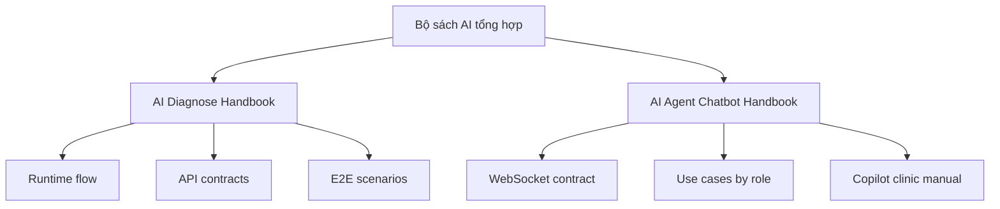

# Bộ sách hướng dẫn AI Diagnose và AI Agent/Chatbot

Version: 2.0.0  
Last Updated: 2026-04-03  
Scope: Tài liệu tổng hợp và điều hướng tới các handbook chi tiết

---

## 1. Mục tiêu

Tài liệu này là trang điều hướng trung tâm cho bộ handbook AI của Petties.

Từ phiên bản 2.0.0, nội dung được tách thành 2 sách chuyên biệt để dễ đào tạo, vận hành và bảo trì:

1. Handbook AI Diagnose (cho STAFF/ADMIN trong EMR)
2. Handbook AI Agent/Chatbot (cho PET_OWNER, CLINIC_MANAGER, CLINIC_OWNER, ADMIN)

---

## 2. Danh mục handbook chính thức

### 2.1 AI Diagnose Handbook

- File: `docs-references/ai_diagnose_service/AI_DIAGNOSE_USER_HANDBOOK_VI.md`
- Phù hợp cho: STAFF, ADMIN, QA, Support kỹ thuật liên quan chẩn đoán
- Nội dung chính:
  - Luồng `describe_only`, `full`, `selected_only`
  - Cách đọc Top 3 differential, evidence, SOAP
  - Chính sách prescription và safety
  - Troubleshooting và checklist QA/UAT

### 2.2 AI Agent/Chatbot Handbook

- File: `docs-references/ai-agent/AI_AGENT_CHATBOT_USER_HANDBOOK_VI.md`
- Phù hợp cho: PET_OWNER flow, CLINIC_MANAGER/OWNER Copilot flow, ADMIN vận hành chatbot
- Nội dung chính:
  - WebSocket contract và event lifecycle
  - Interactive booking flow với guard xác nhận
  - Prompt mẫu theo role
  - Monitoring, troubleshooting và checklist QA/UAT

---

## 3. Sơ đồ điều hướng tài liệu

---

## 4. Tài liệu liên quan bắt buộc

- `docs-references/ai_diagnose_service/01_RUNTIME_FLOW.md`
- `docs-references/ai_diagnose_service/02_API_CONTRACTS.md`
- `docs-references/ai-agent/AI_CHAT_WEBSOCKET_CONTRACT.md`
- `docs-references/ai-agent/AI_SERVICE_USE_CASES_BY_ROLE.md`
- `docs-references/ai-agent/AI_COPILOT_CLINIC_USER_MANUAL.md`
- `docs-references/documentation/TECHNICAL SCOPE PETTIES - AGENT MANAGEMENT.md`

---

## 5. Lịch sử cập nhật

| Date | Version | Changes |
|---|---|---|
| 2026-04-03 | 2.0.0 | Tách handbook tổng hợp thành 2 handbook chuyên biệt, cập nhật tiếng Việt có dấu |
| 2026-04-03 | 1.0.0 | Bản handbook tổng hợp ban đầu |
