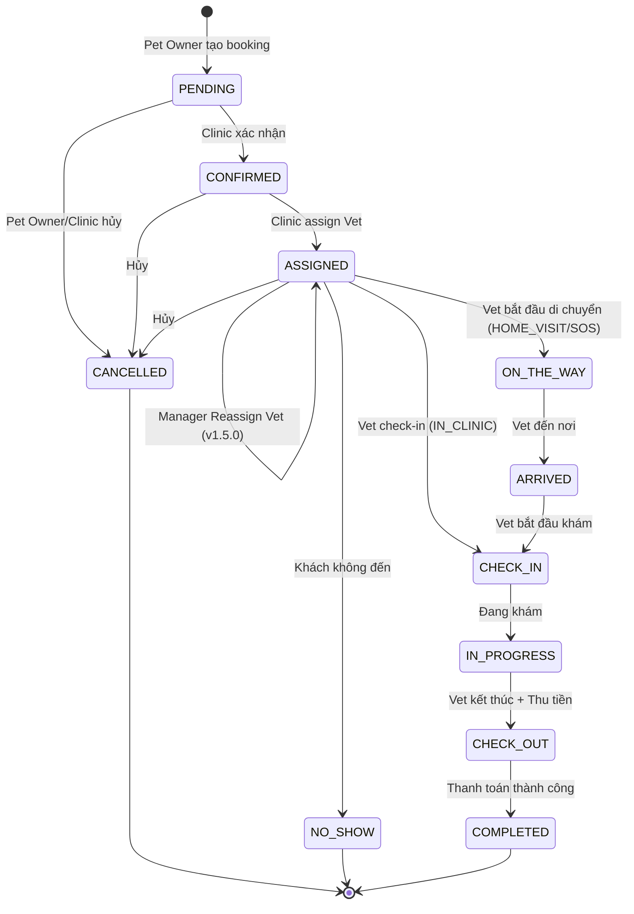
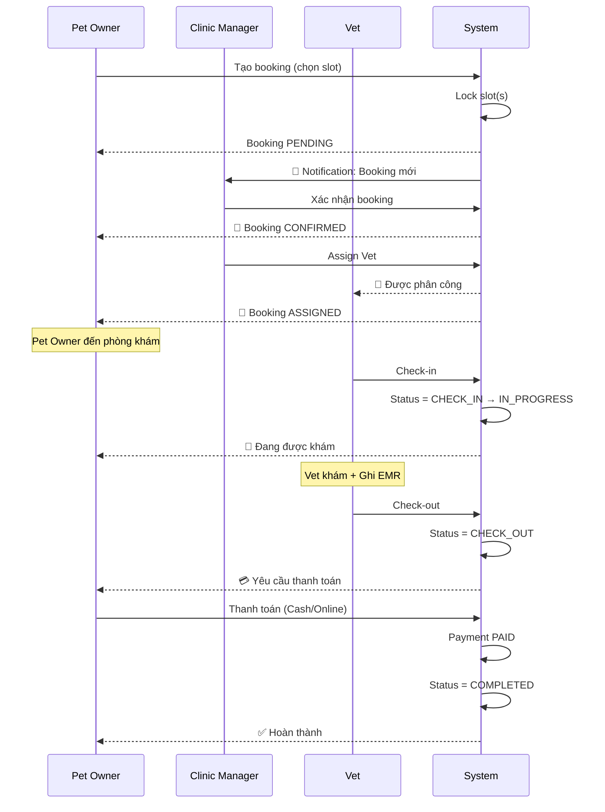
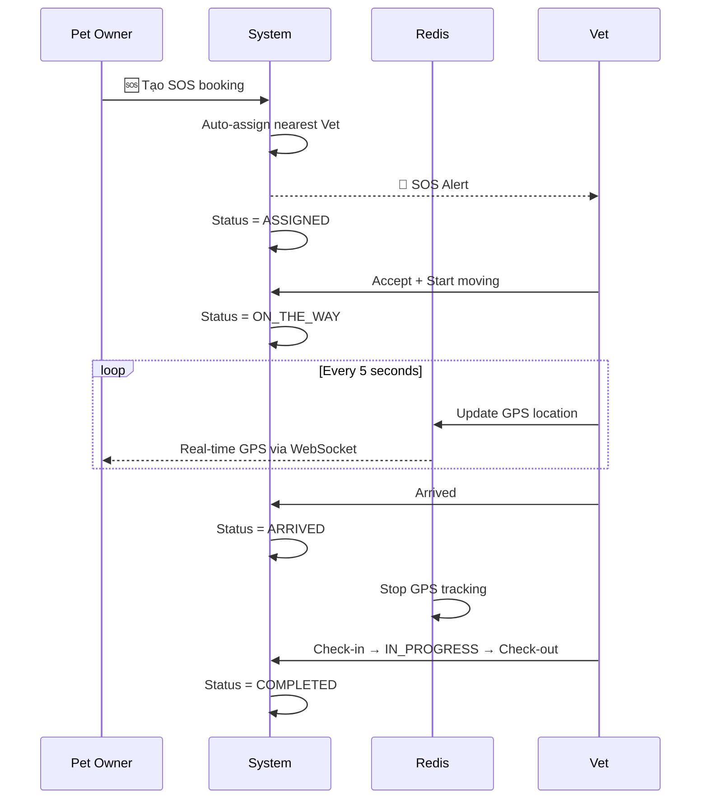
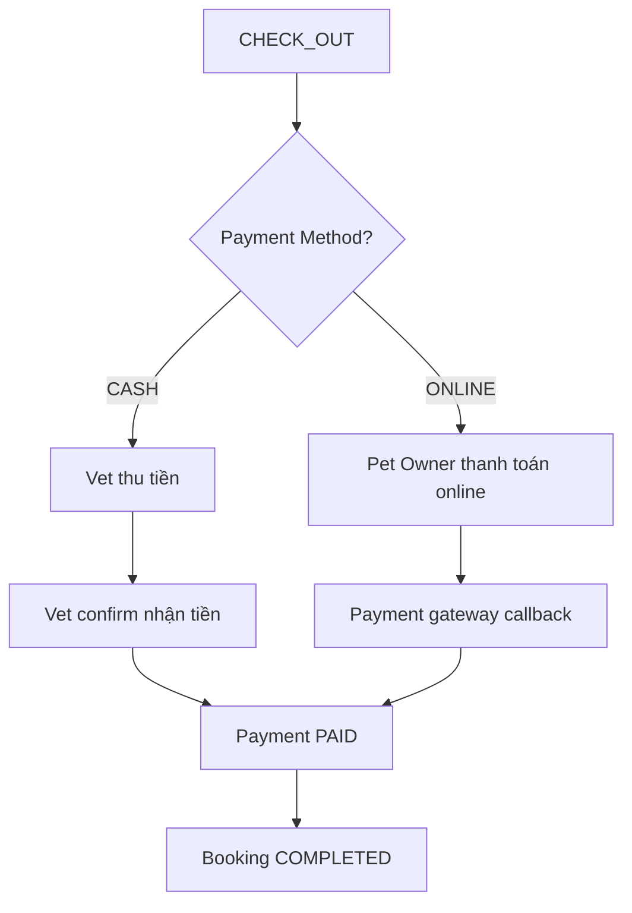

# Booking Workflow - Petties

**Version:** 1.5.0  
**Last Updated:** 2026-01-22  

---

## 1. Booking Status State Machine



---

## 2. Status Definitions

| Status | Mô tả | Actor | Booking Type |
|--------|-------|-------|--------------|
| `PENDING` | Chờ xác nhận | Pet Owner tạo | All |
| `CONFIRMED` | Đã xác nhận | Clinic Manager | All |
| `ASSIGNED` | Đã phân công Vet | Clinic Manager | All |
| `ON_THE_WAY` | Vet đang đến | Vet | HOME_VISIT, SOS |
| `ARRIVED` | Vet đã đến | Vet | HOME_VISIT, SOS |
| `CHECK_IN` | Bắt đầu khám | Vet | All |
| `IN_PROGRESS` | Đang khám | Auto | All |
| `CHECK_OUT` | Kết thúc + Thanh toán | Vet | All |
| `COMPLETED` | Hoàn thành | Auto (after payment) | All |
| `CANCELLED` | Đã hủy | Pet Owner/Clinic | All |
| `NO_SHOW` | Khách không đến | Clinic | All |

---

## 3. Booking Types

### 3.1 IN_CLINIC (Khám tại phòng khám)
```
PENDING → CONFIRMED → ASSIGNED → CHECK_IN → IN_PROGRESS → CHECK_OUT → COMPLETED
```

### 3.2 HOME_VISIT (Khám tại nhà)
```
PENDING → CONFIRMED → ASSIGNED → ON_THE_WAY → ARRIVED → CHECK_IN → IN_PROGRESS → CHECK_OUT → COMPLETED
```

### 3.3 SOS (Cấp cứu)
```
PENDING → CONFIRMED → ASSIGNED → ON_THE_WAY (GPS Tracking) → ARRIVED → CHECK_IN → IN_PROGRESS → CHECK_OUT → COMPLETED
```

> **Note:** SOS có thêm GPS tracking real-time qua Redis

---

## 4. Sequence Diagrams

### 4.1 IN_CLINIC Flow



### 4.2 HOME_VISIT Flow


### 4.3 SOS Flow (với GPS Tracking)



---

## 5. Payment Flow



**Payment entity:**
```
PAYMENT {
    booking_id FK
    amount
    method: CASH | ONLINE
    status: PENDING | PAID | REFUNDED | FAILED
}
```

---

## 6. Cancellation Rules

| Thời điểm | Ai hủy | Hành động |
|-----------|--------|-----------|
| Status = PENDING | Pet Owner | Free cancel |
| Status = CONFIRMED | Pet Owner | Có thể tính phí |
| Status = ASSIGNED | Pet Owner | Cần thông báo Vet |
| Status ≥ CHECK_IN | Không thể | Đã bắt đầu khám |

---

## 7. No-Show Handling

- **Trigger:** Vet đánh dấu NO_SHOW khi khách không đến
- **Thời điểm:** Sau 15 phút kể từ `booking_time`
- **Hậu quả:** Slot được giải phóng, Pet Owner có thể bị ghi nhận

---

## 8. Redis Keys (SOS GPS)

```
Key:   sos:location:{bookingId}
Value: {
  "vetId": "uuid",
  "lat": 10.762622,
  "long": 106.660172,
  "updatedAt": "2026-01-11T00:30:00",
  "status": "ON_THE_WAY"
}
TTL:   60 seconds
```

---

---

## 9. Reassign Vet & Availability Check (v1.5.0) ✅

- **UC-CM-14:** Kiểm tra tính khả dụng của Vet trước khi gán (Check Vet Availability).
- **UC-CM-15:** Gán lại bác sĩ (Reassign Vet) khi có thay đổi nhân sự hoặc cấp cứu.
- **UC-VT-14:** Bác sĩ xem tổng quan Dashboard lịch của mình (Vet Home Dashboard Summary).

*Document này mô tả toàn bộ booking workflow cho project Petties.*
