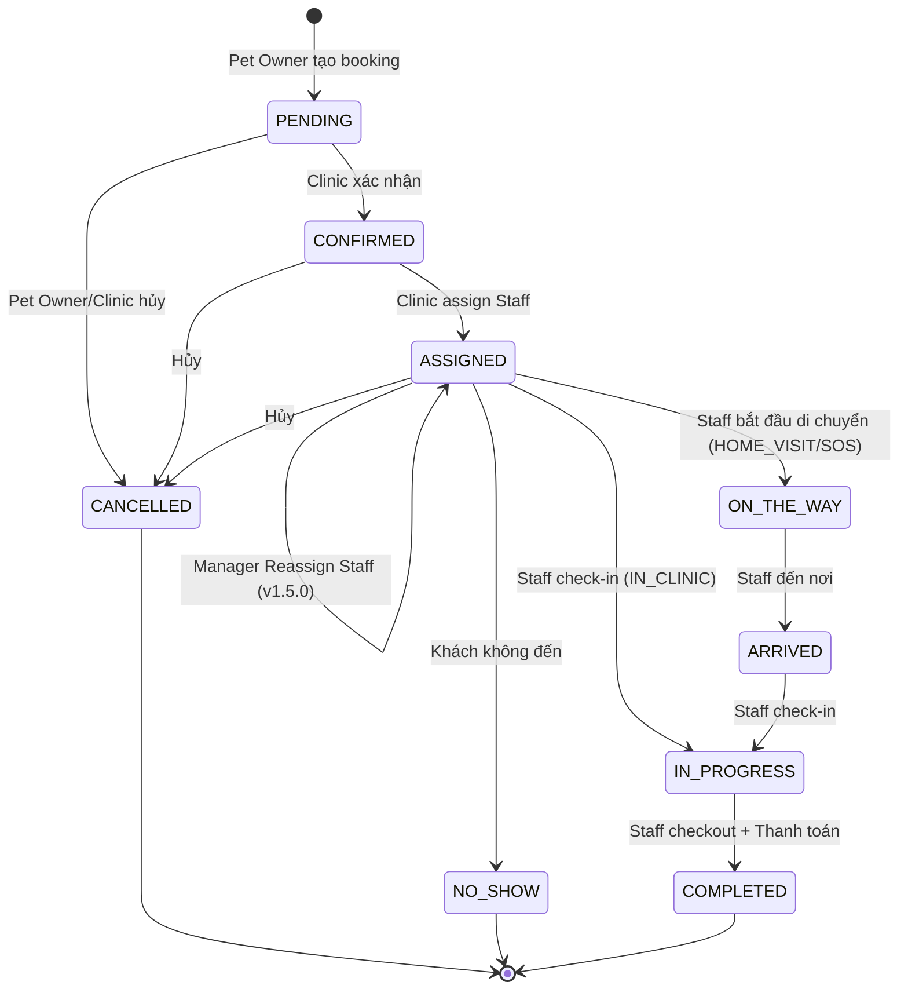
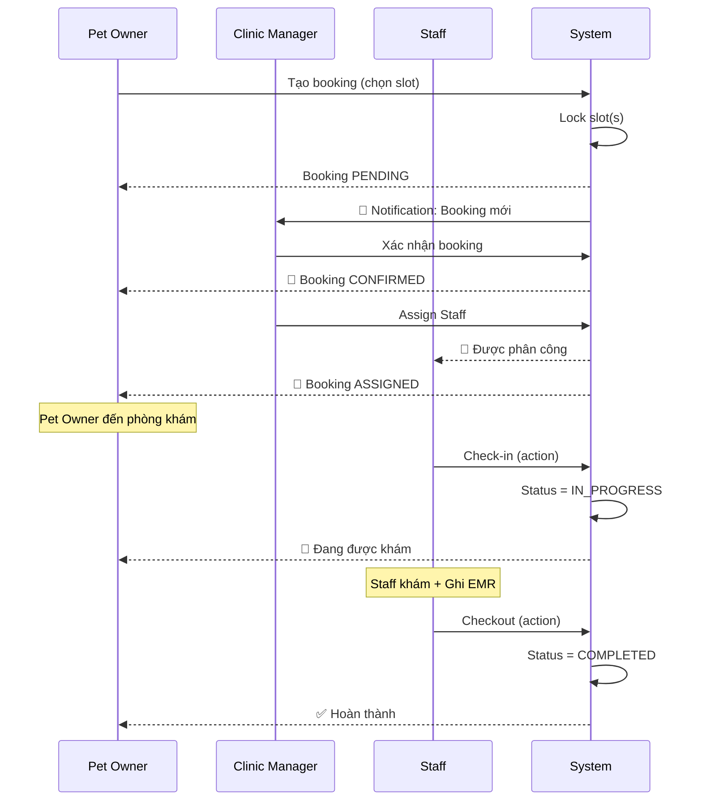
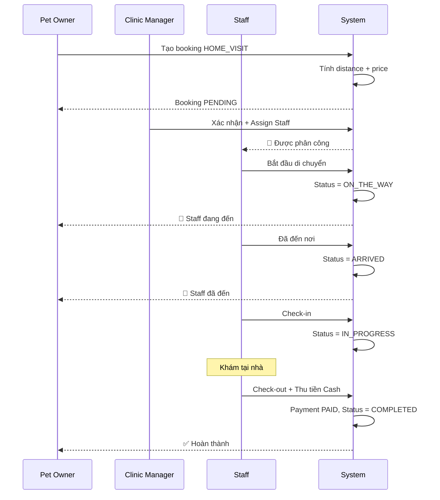
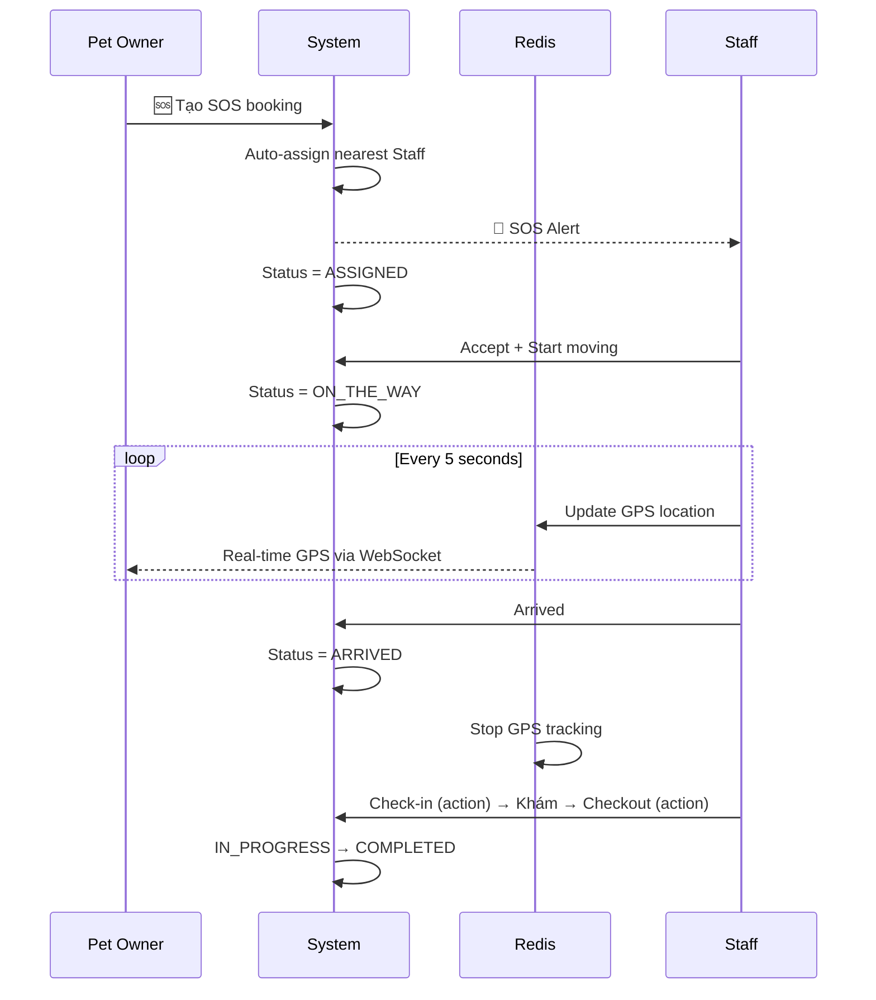
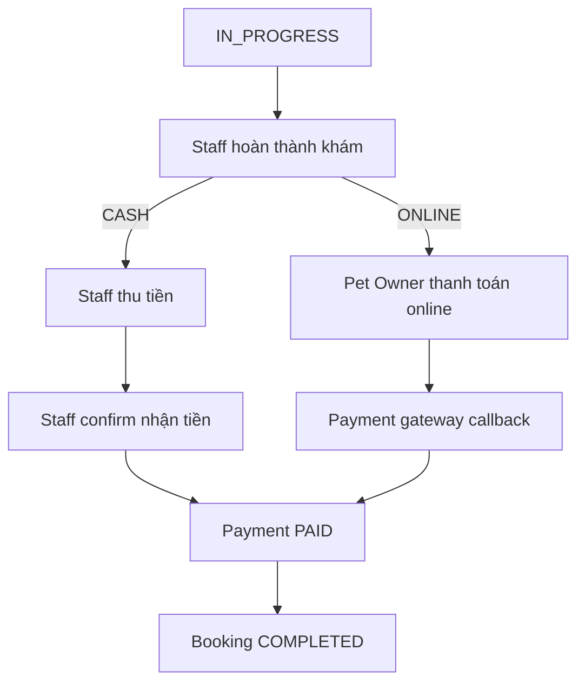

# Booking Workflow - Petties

**Version:** 1.5.0  
**Last Updated:** 2026-01-22  

---

## 1. Booking Status State Machine



> **Note:** `check-in` và `checkout` là **hành động (actions)**, không phải trạng thái. Check-in chuyển booking sang `IN_PROGRESS`, checkout chuyển sang `COMPLETED`.

---

## 2. Status Definitions

| Status | Mô tả | Actor | Booking Type |
|--------|-------|-------|--------------|
| `PENDING` | Chờ xác nhận | Pet Owner tạo | All |
| `CONFIRMED` | Đã xác nhận | Clinic Manager | All |
| `ASSIGNED` | Đã phân công Staff | Clinic Manager | All |
| `ON_THE_WAY` | Staff đang đến | Staff | HOME_VISIT, SOS |
| `ARRIVED` | Staff đã đến | Staff | HOME_VISIT, SOS |
| `IN_PROGRESS` | Đang khám (sau check-in) | Staff | All |
| `COMPLETED` | Hoàn thành (sau checkout + thanh toán) | Staff | All |
| `CANCELLED` | Đã hủy | Pet Owner/Clinic | All |
| `NO_SHOW` | Khách không đến | Clinic | All |

### Actions (Hành động)

| Action | Trigger | Transition |
|--------|---------|------------|
| `check-in` | Staff bấm check-in | ASSIGNED/ARRIVED → IN_PROGRESS |
| `checkout` | Staff bấm checkout | IN_PROGRESS → COMPLETED |

---

## 3. Booking Types

### 3.1 IN_CLINIC (Khám tại phòng khám)
```
PENDING → CONFIRMED → ASSIGNED → (check-in) → IN_PROGRESS → (checkout) → COMPLETED
```

### 3.2 HOME_VISIT (Khám tại nhà)
```
PENDING → CONFIRMED → ASSIGNED → ON_THE_WAY → ARRIVED → (check-in) → IN_PROGRESS → (checkout) → COMPLETED
```

### 3.3 SOS (Cấp cứu)
```
PENDING → CONFIRMED → ASSIGNED → ON_THE_WAY (GPS Tracking) → ARRIVED → (check-in) → IN_PROGRESS → (checkout) → COMPLETED
```

> **Note:** SOS có thêm GPS tracking real-time qua Redis

---

## 4. Sequence Diagrams

### 4.1 IN_CLINIC Flow



### 4.2 HOME_VISIT Flow



### 4.3 SOS Flow (với GPS Tracking)



---

## 5. Payment Flow



**Payment entity:**
```
PAYMENT {
    booking_id FK
    amount
    method: CASH | ONLINE
    status: PENDING | PAID | REFUNDED | FAILED
}
```

---

## 6. Cancellation Rules

| Thời điểm | Ai hủy | Hành động |
|-----------|--------|-----------|
| Status = PENDING | Pet Owner | Free cancel |
| Status = CONFIRMED | Pet Owner | Có thể tính phí |
| Status = ASSIGNED | Pet Owner | Cần thông báo Staff |
| Status ≥ CHECK_IN | Không thể | Đã bắt đầu khám |

---

## 7. No-Show Handling

- **Trigger:** Staff đánh dấu NO_SHOW khi khách không đến
- **Thời điểm:** Sau 15 phút kể từ `booking_time`
- **Hậu quả:** Slot được giải phóng, Pet Owner có thể bị ghi nhận

---

## 8. Redis Keys (SOS GPS)

```
Key:   sos:location:{bookingId}
Value: {
  "vetId": "uuid",
  "lat": 10.762622,
  "long": 106.660172,
  "updatedAt": "2026-01-11T00:30:00",
  "status": "ON_THE_WAY"
}
TTL:   60 seconds
```

---

---

## 9. Reassign Staff & Availability Check (v1.5.0) ✅

- **UC-CM-14:** Kiểm tra tính khả dụng của Staff trước khi gán (Check Staff Availability).
- **UC-CM-15:** Gán lại nhân viên (Reassign Staff) khi có thay đổi nhân sự hoặc cấp cứu.
- **UC-VT-14:** Nhân viên xem tổng quan Dashboard lịch của mình (Staff Home Dashboard Summary).

*Document này mô tả toàn bộ booking workflow cho project Petties.*
