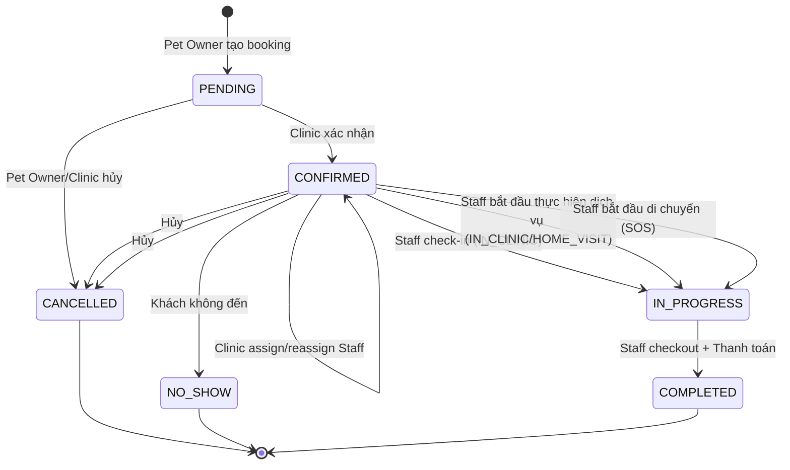
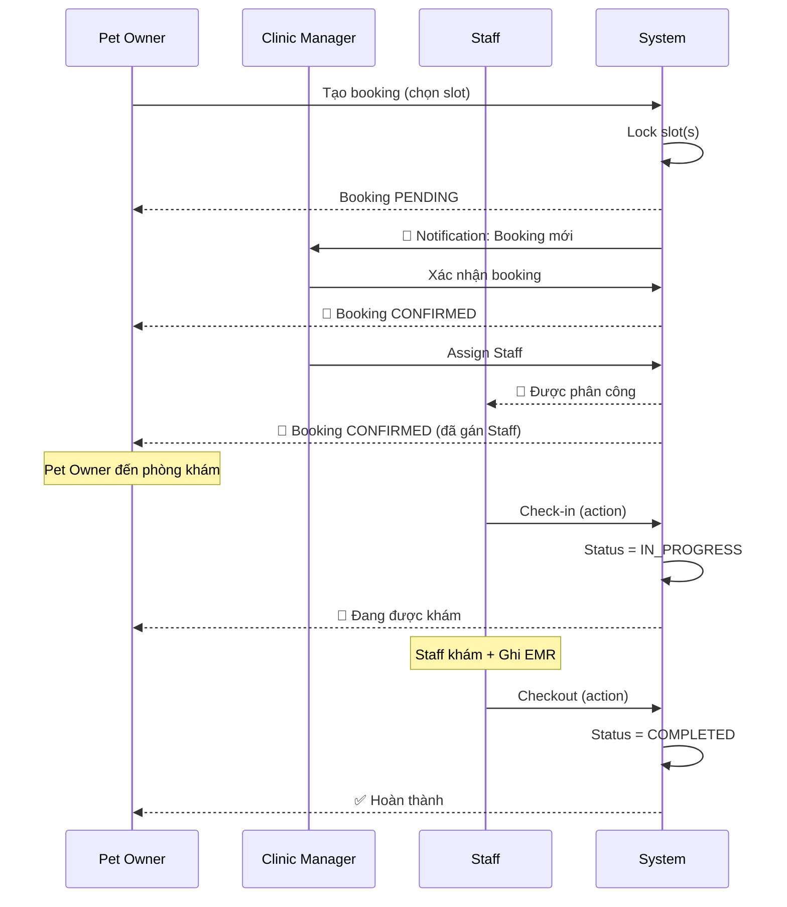
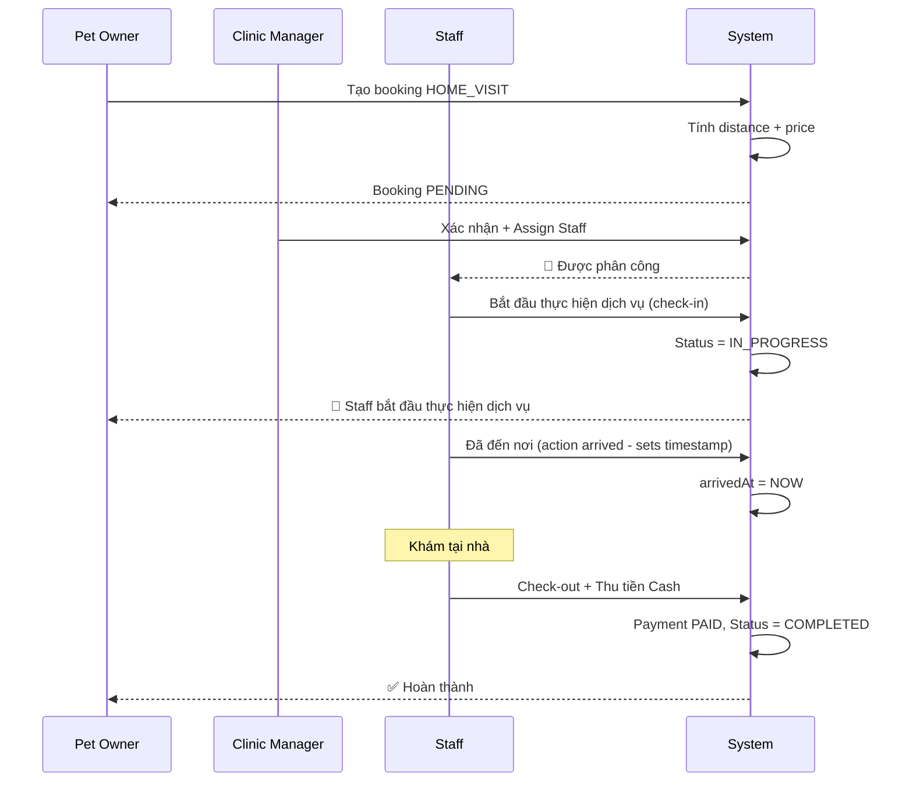
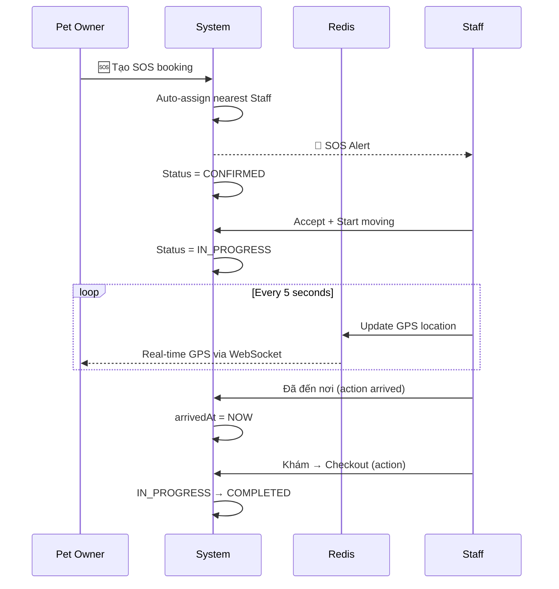
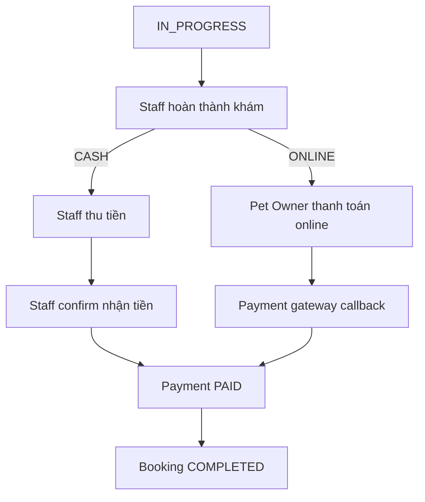

# Booking Workflow - Petties

**Version:** 1.7.0  
**Last Updated:** 2026-03-09  

---

## 1. Booking Status State Machine


```mermaid
stateDiagram-v2
    [*] --> PENDING: Pet Owner tạo booking
    
    PENDING --> CONFIRMED: Clinic xác nhận
    PENDING --> CANCELLED: Pet Owner/Clinic hủy
    
    CONFIRMED --> CONFIRMED: Clinic assign/reassign Staff
    CONFIRMED --> CANCELLED: Hủy

    CONFIRMED --> IN_PROGRESS: Staff check-in (IN_CLINIC)
    CONFIRMED --> IN_PROGRESS: Staff bắt đầu thực hiện dịch vụ (IN_CLINIC/HOME_VISIT)
    CONFIRMED --> IN_PROGRESS: Staff bắt đầu di chuyển (SOS)
    CONFIRMED --> NO_SHOW: Khách không đến
    CONFIRMED --> CANCELLED: Hủy
    
    IN_PROGRESS --> COMPLETED: Staff checkout + Thanh toán
    
    CANCELLED --> [*]
    NO_SHOW --> [*]
    COMPLETED --> [*]
```

> **Note:** `check-in` và `checkout` là **hành động (actions)**, không phải trạng thái. Check-in chuyển booking sang `IN_PROGRESS`, checkout chuyển sang `COMPLETED`.

---

## 2. Status Definitions

| Status | Mô tả | Actor | Booking Type |
|--------|-------|-------|--------------|
| `PENDING` | Chờ xác nhận | Pet Owner tạo | All |
| `CONFIRMED` | Đã xác nhận + đã gán Staff ban đầu | Clinic Manager | All |
| `IN_PROGRESS` | Đang khám / Đang di chuyển (SOS) | Staff | All |
| `COMPLETED` | Hoàn thành (sau checkout + thanh toán) | Staff | All |
| `CANCELLED` | Đã hủy | Pet Owner/Clinic | All |
| `NO_SHOW` | Khách không đến | Clinic | All |

### Actions (Hành động)

| Action | Trigger | Transition |
|--------|---------|------------|
| `check-in` | Staff bấm check-in | CONFIRMED → IN_PROGRESS |
| `start-moving` | Staff bắt đầu di chuyển (SOS) | CONFIRMED → IN_PROGRESS |
| `checkout` | Staff bấm checkout | IN_PROGRESS → COMPLETED |

---

## 3. Booking Types

### 3.1 IN_CLINIC (Khám tại phòng khám)
```
PENDING → CONFIRMED → (check-in) → IN_PROGRESS → (checkout) → COMPLETED
```

### 3.2 HOME_VISIT (Khám tại nhà)
```
PENDING → CONFIRMED → (check-in) → IN_PROGRESS → (checkout) → COMPLETED
```

### 3.3 SOS (Cấp cứu)
```
PENDING → CONFIRMED → (start-moving) → IN_PROGRESS (GPS Tracking) → (checkout) → COMPLETED
```

> **Note:** SOS có thêm GPS tracking real-time qua Redis

---

## 4. Sequence Diagrams

### 4.1 IN_CLINIC Flow


```mermaid
sequenceDiagram
    participant PO as Pet Owner
    participant CM as Clinic Manager
    participant V as Staff
    participant S as System

    PO->>S: Tạo booking (chọn slot)
    S->>S: Lock slot(s)
    S-->>PO: Booking PENDING
    S->>CM: 🔔 Notification: Booking mới

    CM->>S: Xác nhận booking
    S-->>PO: 🔔 Booking CONFIRMED

    CM->>S: Assign Staff
    S-->>V: 🔔 Được phân công
    S-->>PO: 🔔 Booking CONFIRMED (đã gán Staff)

    Note over PO: Pet Owner đến phòng khám

    V->>S: Check-in (action)
    S->>S: Status = IN_PROGRESS
    S-->>PO: 🔔 Đang được khám

    Note over V: Staff khám + Ghi EMR

    V->>S: Checkout (action)
    S->>S: Status = COMPLETED
    S-->>PO: ✅ Hoàn thành
```

### 4.2 HOME_VISIT Flow


```mermaid
sequenceDiagram
    participant PO as Pet Owner
    participant CM as Clinic Manager
    participant V as Staff
    participant S as System

    PO->>S: Tạo booking HOME_VISIT
    S->>S: Tính distance + price
    S-->>PO: Booking PENDING

    CM->>S: Xác nhận + Assign Staff
    S-->>V: 🔔 Được phân công

    V->>S: Bắt đầu thực hiện dịch vụ (check-in)
    S->>S: Status = IN_PROGRESS
    S-->>PO: 🔔 Staff bắt đầu thực hiện dịch vụ

    V->>S: Đã đến nơi (action arrived - sets timestamp)
    S->>S: arrivedAt = NOW

    Note over V: Khám tại nhà

    V->>S: Check-out + Thu tiền Cash
    S->>S: Payment PAID, Status = COMPLETED
    S-->>PO: ✅ Hoàn thành
```

### 4.3 SOS Flow (với GPS Tracking)


```mermaid
sequenceDiagram
    participant PO as Pet Owner
    participant S as System
    participant R as Redis
    participant V as Staff

    PO->>S: 🆘 Tạo SOS booking
    S->>S: Auto-assign nearest Staff
    S-->>V: 🚨 SOS Alert
    S->>S: Status = CONFIRMED

    V->>S: Accept + Start moving
    S->>S: Status = IN_PROGRESS

    loop Every 5 seconds
        V->>R: Update GPS location
        R-->>PO: Real-time GPS via WebSocket
    end

    V->>S: Đã đến nơi (action arrived)
    S->>S: arrivedAt = NOW

    V->>S: Khám → Checkout (action)
    S->>S: IN_PROGRESS → COMPLETED
```

---

## 5. Payment Flow

## 5.1 AI Booking Guardrails

- Với business chat, AI phải hỏi rõ `IN_CLINIC` hay `HOME_VISIT` trước khi kiểm tra slot hoặc tạo booking nếu người dùng chưa nêu rõ.
- Nếu người dùng đã cung cấp sẵn phòng khám, dịch vụ, thú cưng hoặc thời gian, AI không được hỏi lại các trường đã có.
- Với `HOME_VISIT`, AI chỉ được tạo booking khi đã có đủ địa chỉ, GPS và khoảng cách di chuyển.
- Trước khi gọi tool tạo booking, AI phải tóm tắt lại loại khám, pet, clinic, ngày, giờ, dịch vụ và yêu cầu người dùng xác nhận rõ ràng.


```mermaid
flowchart TD
    A[IN_PROGRESS] --> B[Staff hoàn thành khám]
    B -->|CASH| C[Staff thu tiền]
    B -->|ONLINE| D[Pet Owner thanh toán online]
    
    C --> E[Staff confirm nhận tiền]
    D --> F[Payment gateway callback]
    
    E --> G[Payment PAID]
    F --> G
    
    G --> H[Booking COMPLETED]
```

**Payment entity:**
```
PAYMENT {
    booking_id FK
    amount
    method: CASH | ONLINE
    status: PENDING | PAID | REFUNDED | FAILED
}
```

---

## 6. Cancellation Rules

| Thời điểm | Ai hủy | Hành động |
|-----------|--------|-----------|
| Status = PENDING | Pet Owner | Free cancel |
| Status = CONFIRMED | Pet Owner | Có thể tính phí |
| Status = CONFIRMED | Pet Owner | Cần thông báo Staff |
| Status = IN_PROGRESS | Không thể | Đã bắt đầu thực hiện dịch vụ |

---

## 7. No-Show Handling

- **Trigger:** Staff đánh dấu NO_SHOW khi khách không đến
- **Thời điểm:** Sau 15 phút kể từ `booking_time`
- **Hậu quả:** Slot được giải phóng, Pet Owner có thể bị ghi nhận

---

## 8. Redis Keys (SOS GPS)

```
Key:   sos:location:{bookingId}
Value: {
  "vetId": "uuid",
  "lat": 10.762622,
  "long": 106.660172,
  "updatedAt": "2026-01-11T00:30:00",
  "status": "ON_THE_WAY"
}
TTL:   60 seconds
```

---

---

## 9. Reassign Staff & Availability Check (v1.5.0) ✅

- **UC-BOOK-06:** Kiểm tra tính khả dụng của Staff trước khi gán và xác nhận booking.
- **UC-BOOK-07:** Gán lại nhân viên (Reassign Staff) cho từng service item khi có thay đổi nhân sự hoặc cấp cứu.
- **UC-VT-14:** Nhân viên xem tổng quan Dashboard lịch của mình (Staff Home Dashboard Summary).

*Document này mô tả toàn bộ booking workflow cho project Petties.*
