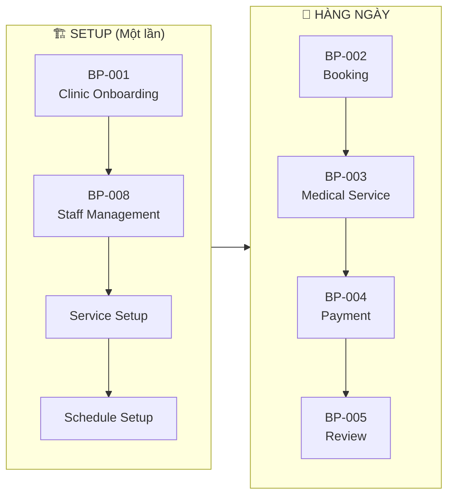

# PETTIES - Business Process Workflow (BPMN)

Tài liệu mô tả luồng nghiệp vụ tổng quan theo chuẩn BPMN 2.0.

---

## 0. Tổng Quan Nghiệp Vụ Dự Án

### 0.1 Mô tả hệ thống

**PETTIES** là nền tảng đặt lịch khám thú y trực tuyến, kết nối:
- **Pet Owner** (Chủ thú cưng) - đặt lịch khám, theo dõi hồ sơ sức khỏe
- **Veterinary Clinics** (Phòng khám thú y) - quản lý dịch vụ, lịch hẹn, nhân sự
- **Vets** (Bác sĩ thú y) - thực hiện khám, ghi hồ sơ bệnh án

### 0.2 Core Business Flows (Luồng nghiệp vụ cốt lõi)

| # | Core Flow | Actor(s) | Mô tả |
|---|-----------|----------|-------|
| **BP-001** | Clinic Onboarding | Clinic Owner → Admin | Đăng ký phòng khám, Admin phê duyệt |
| **BP-002** | Booking Management | Pet Owner → Manager → Vet | Đặt lịch → Gán bác sĩ → Xác nhận |
| **BP-003** | Medical Service | Vet → Pet Owner | Check-in → Khám → EMR → Check-out |
| **BP-004** | Payment Processing | Pet Owner → System | Thanh toán Online/Cash |
| **BP-005** | Review & Feedback | Pet Owner | Đánh giá Vet + Clinic |

### 0.3 Supporting Flows (Luồng hỗ trợ)

| # | Supporting Flow | Actor(s) | Mô tả |
|---|-----------------|----------|-------|
| **BP-006** | AI Assistance | Pet Owner → AI | Chat với AI về sức khỏe thú cưng |
| **BP-007** | SOS Emergency | Pet Owner | Tìm phòng khám gần nhất khi khẩn cấp |
| **BP-008** | Staff Management | Clinic Owner/Manager | Thêm/xóa Manager, Vet |

### 0.4 Business Flow Dependencies

### 0.5 Business Rules Summary

| Rule ID | Business Rule | Impact |
|---------|---------------|--------|
| **BR-001** | Mỗi Clinic chỉ có 1 Manager | Staff Management |
| **BR-002** | Manager chỉ thêm được Vet | Authorization |
| **BR-003** | Mỗi slot = 30 phút | Scheduling |
| **BR-004** | Booking cần Manager gán Vet | Workflow |
| **BR-005** | Manager assign Vet và booking tự động CONFIRMED | Workflow |
| **BR-006** | Payment trước khi COMPLETED | Checkout |

---

## 1. High-Level Business Process Overview

## 2. Core Business Processes

### 2.1 Process Map (Level 0)

## 3. BP-001: Clinic Onboarding Process

### 3.1 BPMN Diagram

### 3.2 Process Description

| Element | Type | Description |
|---------|------|-------------|
| Start | Start Event | Clinic Owner initiates registration |
| Submit Registration | User Task | Fill clinic basic info (name, address, phone) |
| Upload Documents | User Task | Upload business license, certificates |
| Set Service & Pricing | User Task | Configure services with base price + fees |
| Set Operating Hours | User Task | Define working hours for each day |
| Review Application | User Task | Admin reviews submitted information |
| Approval Gateway | Exclusive Gateway | Decision: Approve or Reject |
| Approve Clinic | User Task | Admin approves, clinic becomes ACTIVE |
| Send Approval Email | Service Task | System notifies clinic approval + provides CLINIC_OWNER onboarding instructions |
| Create CLINIC_MANAGER Account | User Task | CLINIC_OWNER creates/invites CLINIC_MANAGER account (auto-provision) |
| Send CLINIC_MANAGER Credentials | Service Task | System sends credentials/invite to CLINIC_MANAGER |
| Reject with Reason | User Task | Admin provides rejection reason |
| Send Rejection Email | Service Task | System notifies rejection |
| End | End Event | Process completes |

---

## 4. BP-002: Booking Management Process (Main Flow)

### 4.1 BPMN Diagram

### 4.2 Booking Status State Machine

### 4.3 Process Description Table

| Status | Trigger | Actions | Next Status |
|--------|---------|---------|-------------|
| PENDING | Pet Owner submits booking (payment method: Online/Cash) | Reduce slot, Notify Clinic, store payment_method + payment_status | ASSIGNED |
| ASSIGNED | Clinic Manager assigns vet | Notify Vet, auto CONFIRMED | CONFIRMED |
| CONFIRMED | Vet assigned | Notify Pet Owner | CHECK_IN |
| CHECK_IN | Pet arrives, Vet checks in | Update status | IN_PROGRESS |
| IN_PROGRESS | Service starts | - | CHECK_OUT |
| CHECK_OUT | Service ends | - | COMPLETED |
| COMPLETED | Vet completes EMR | Enable rating workflow | RATING |
| RATING | Pet Owner submits rating | Store rating & comment, update vet rating average | End |

## 5. BP-003: Medical Service Process

> **Note:** Thanh toán đã được thực hiện khi booking (Online hoặc Cash at checkout). BP-003 chỉ tính phí dựa trên dịch vụ đã book, chưa xử lý additional charges.

### 5.1 BPMN Diagram

### 5.2 Process Description Table

| Bước | Actor | Mô tả | Ghi chú |
|------|-------|-------|---------|
| 1 | VET | Check-in Patient | Status: CHECKIN |
| 2 | VET | View Pet Profile + EMR History | Xem tiền sử bệnh |
| 3 | VET | Examine Pet | Status: IN_PROGRESS |
| 4 | VET | Diagnose | Chẩn đoán |
| 5 | VET | Create Treatment Plan | Kế hoạch điều trị |
| 6 | VET | Write Prescription | **Lưu trong EMR** |
| 7 | VET | Update Vaccination (optional) | **Lưu trong Vaccination Book riêng** |
| 8 | VET | Save/Update EMR | Lưu diagnosis + treatment + prescription |
| 9 | VET | Checkout Patient | Status: CHECKOUT |
| 10 | SYSTEM | Check Payment Status | PAID (Online) vs UNPAID (Cash) |
| 11 | SYSTEM | Collect Cash (if UNPAID) | Chỉ khi payment_status = UNPAID |
| 12 | SYSTEM | Generate Receipt | Hóa đơn theo dịch vụ đã book |
| 13 | SYSTEM | Complete Booking | Status: COMPLETED |
| 14 | PET_OWNER | Nhận thông báo hoàn thành | Push notification |
| 15 | PET_OWNER | Xem EMR trong app | Bao gồm prescription |

### 5.3 Payment Logic

| Payment Method | Khi Booking | Khi Checkout |
|----------------|-------------|--------------|
| **Online** | Thanh toán ngay, status = PAID | Chỉ generate receipt |
| **Cash** | Chưa thanh toán, status = UNPAID | Collect cash → generate receipt |

## 6. BP-004: Payment Processing

> **Note:** Payment xảy ra tại thời điểm booking (BP-002). BP-004 mô tả flow xử lý thanh toán Online qua Stripe.

### 6.1 BPMN Diagram

### 6.2 Revenue Split Model

### 6.3 Revenue Split Table

| Component | Percentage | Example (500K VND) |
|-----------|------------|-------------------|
| **Total Payment** | 100% | 500,000 VND |
| Stripe Fee | ~2.9% + fixed | ~14,500 + 7,000 = ~21,500 VND |
| **Net Amount** | ~95.7% | ~478,500 VND |
| Platform Fee | **15%** of Net | ~71,775 VND |
| Clinic Revenue | **85%** of Net | ~406,725 VND |

## 7. BP-005: Review & Feedback Process

> **Note:** Có 2 loại review:
> - **Vet Review**: Đánh giá ngay sau khi COMPLETED (như Grab)
> - **Clinic Review**: Có thể đánh giá sau, qua notification hoặc trong app

### 7.1 BPMN Diagram - Vet Review (Immediate)

### 7.2 BPMN Diagram - Clinic Review (Later)

### 7.3 Review Types Comparison

| Aspect | Vet Review | Clinic Review |
|--------|------------|---------------|
| **Timing** | Ngay sau COMPLETED | Có thể sau 24h+ |
| **Trigger** | Popup tự động | Push notification |
| **Required** | Optional (can skip) | Optional |
| **Content** | 1-5 Stars only | 1-5 Stars + Comment |
| **UX** | Like Grab/Uber rating | Standard review form |
| **Data Stored** | `vet_rating`, `vet_rated` | `clinic_rating`, `clinic_comment`, `clinic_reviewed` |

### 7.4 Review Flow Summary

---

## 8. BP-006: AI Assistance Process

### 8.1 BPMN Diagram

### 8.2 Agent Routing Decision Table

| User Intent | Keywords/Patterns | Target Agent | Tools Available |
|-------------|-------------------|--------------|-----------------|
| Medical Inquiry | "bệnh", "triệu chứng", "ốm", "sick", "symptom" | Medical Agent | RAG Search, call Research Agent |
| Booking | "đặt lịch", "book", "appointment", "slot" | Booking Agent | check_slot, create_booking |
| Information | "mua", "giá", "ở đâu", "product", "tips" | Research Agent | web_search, youtube_search |
| General Chat | greeting, unclear | Main Agent | Direct response |

---

## 9. BP-007: SOS Emergency Process

### 9.1 BPMN Diagram

---

## 10. End-to-End Customer Journey

### 10.1 Happy Path Journey Map

---

## 11. Data Flow Overview

### 11.1 System Integration Diagram

---

## 12. BPMN Notation Reference

### 12.1 Symbols Used

| Symbol | Name | Description |
|--------|------|-------------|
| ○ | Start Event | Beginning of process |
| ● | End Event | End of process |
| ◇ | Gateway | Decision point (XOR) |
| ◆ | Parallel Gateway | Split/Join parallel flows |
| [ ] | Task | Activity/Action |
| ⏱ | Timer Event | Wait for time duration |
| ✉ | Message Event | Send/Receive message |
| Pool | Pool | Organization/Participant |
| Lane | Lane | Role within organization |
| → | Sequence Flow | Order of activities |
| ⇢ | Message Flow | Communication between pools |

### 12.2 Task Types

| Type | Symbol | Example |
|------|--------|---------|
| User Task | 👤 | Manual action by user |
| Service Task | ⚙️ | Automated system action |
| Script Task | 📜 | Automated script execution |
| Send Task | ✉️ | Send message/notification |
| Receive Task | 📩 | Wait for message |

---

## 13. Process Metrics & KPIs

### 13.1 Key Performance Indicators

| Process | KPI | Target |
|---------|-----|--------|
| Clinic Onboarding | Approval Time | < 48 hours |
| Booking Creation | Completion Rate | > 90% |
| Booking Confirmation | Vet Response Time | < 2 hours |
| Medical Service | Check-in to Check-out | < 60 minutes |
| Payment | Success Rate | > 98% |
| Review Collection | Submission Rate | > 30% |
| AI Response | Response Time | < 3 seconds |
| SOS | Clinic Display Time | < 5 seconds |

### 13.2 Process Health Metrics

**Targets:**
- Cancellation Rate: < 15%
- No-Show Rate: < 5%
- Average Rating: > 4.0/5.0

---

## 14. Exception Handling Processes

### 14.1 Booking Cancellation Sub-Process

> **Note:** Refund policy là clinic tự setup theo contract/cấu hình riêng.

### 14.2 Payment Failure Handling

---

## 15. Glossary

| Term | Definition |
|------|------------|
| **Booking** | An appointment request from Pet Owner |
| **Slot** | Available time unit for appointments |
| **EMR** | Electronic Medical Record |
| **Check-in** | Patient arrival confirmation |
| **Check-out** | Service completion confirmation |
| **RAG** | Retrieval Augmented Generation (AI) |
| **Agent** | AI component handling specific tasks |
| **SOS** | Emergency assistance feature |
| **EN_ROUTE** | Sub-status when vet is traveling to home visit (live tracking on map) |

---

**Document Version:** 3.0  
**Last Updated:** 2025-12-25  
**Author:** Petties Team  
**Standard:** BPMN 2.0 Compliant (Mermaid Visualization)
