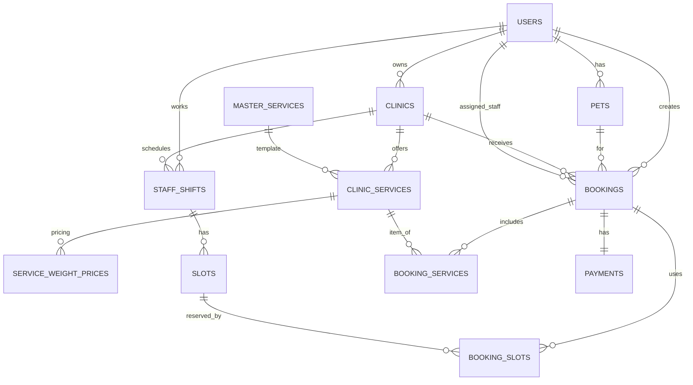

## 1. Tổng quan kiến trúc database

- **Database chính:** PostgreSQL 16.
- **Kiểu thiết kế:** relational, chuẩn hóa quanh các domain chính:
  - `clinics`, `users` (owner/manager/staff), `pets`.
  - `master_services`, `clinic_services`, `service_weight_prices`.
  - `bookings`, `slots`, `staff_shifts`, `booking_slots`, `booking_services`.
  - `payments`, `notifications`, `refresh_tokens`, `blacklisted_tokens`.
- **Quy tắc quan trọng:**
  - Mọi thay đổi cấu trúc đều qua **Flyway migration** (`db/migration`).
  - Booking và Payment là 1–1: mỗi booking tối đa 1 payment (`payments.booking_id UNIQUE`).
  - Staff (ROLE=STAFF) luôn gắn với đúng một `working_clinic`.

## 2. Các bảng cốt lõi theo module

### 2.1 Clinic & User & Pet

- **`clinics`**
  - `clinic_id` (PK, UUID)
  - `owner_id` (FK → `users.user_id`)
  - Thông tin profile: `name`, `description`, `address`, `ward`, `district`, `province`, `phone`, `email`, `logo`…
  - Ngân hàng: `bank_name`, `account_number`.
  - Định vị: `latitude`, `longitude`.
  - Trạng thái: `status` (PENDING/APPROVED/REJECTED…), `rejection_reason`.
  - Chấm điểm: `rating_avg`, `rating_count`.
  - Audit: `approved_at`, `created_at`, `updated_at`, `deleted_at` (soft delete).
  - JSON `operating_hours` (giờ mở cửa theo từng ngày).

- **`users`**
  - `user_id` (PK, UUID)
  - `username`, `password`, `phone`, `email`, `full_name`, avatar fields.
  - `role` (ADMIN, CLINIC_OWNER, CLINIC_MANAGER, STAFF, PET_OWNER).
  - Staff-specific: `specialty`, `rating_avg`, `rating_count`, `fcm_token`, `address`.
  - `working_clinic_id` (FK → `clinics.clinic_id`): phòng khám hiện tại của STAFF/MANAGER.

- **`pets`**
  - `pet_id` (PK, UUID)
  - `user_id` (FK → `users.user_id`) – chủ thú cưng.
  - Thông tin thú cưng: `name`, `species`, `breed`, `date_of_birth`, `weight`, `gender`, `image_url`…

### 2.2 Services & Pricing

- **`master_services`** – danh mục dịch vụ chuẩn cấp platform.
  - `master_service_id` (PK)
  - `name`, `description`, `default_price`, `duration_time`, `slots_required`.
  - `is_home_visit`, `default_price_per_km`, `service_category`, `pet_type`, `icon`.

- **`clinic_services`** – dịch vụ cụ thể tại từng clinic.
  - `service_id` (PK)
  - `clinic_id` (FK → `clinics.clinic_id`)
  - `master_service_id` (FK → `master_services.master_service_id`, nullable).
  - `is_custom` (kế thừa hay custom), `name`, `base_price`, `duration_time`, `slots_required`.
  - `is_active`, `is_home_visit`, `service_category`, `pet_type`.

- **`service_weight_prices`** – bảng giá theo cân nặng.
  - `weight_price_id` (PK)
  - `service_id` (FK → `clinic_services`), `master_service_id` (FK → `master_services`).
  - Khoảng cân nặng: `min_weight`, `max_weight`.
  - `price`: giá áp dụng cho khoảng đó.

### 2.3 Slots, Shifts & Booking

**(Chi tiết đầy đủ trong `V202601032330__create_vet_shifts_slots.sql`, tóm tắt theo entity)**

- **`staff_shifts`** – ca làm việc của Staff.
  - `shift_id` (PK)
  - `staff_id` (FK → `users.user_id`), `clinic_id` (FK → `clinics.clinic_id`).
  - `work_date`, `start_time`, `end_time` (hỗ trợ ca đêm qua ngày hôm sau).

- **`slots`** – slot 30 phút sinh từ shift.
  - `slot_id` (PK)
  - `shift_id` (FK → `staff_shifts.shift_id`)
  - `start_time`, `end_time`, `status` (AVAILABLE/BOOKED/BLOCKED), metadata.

- **`bookings`**
  - `booking_id` (PK), `booking_code` (unique).
  - FKs: `pet_id` (→ `pets`), `pet_owner_id` (→ `users`), `clinic_id` (→ `clinics`), `assigned_staff_id` (→ `users`).
  - Thông tin lịch: `booking_date`, `booking_time`, `type` (IN_CLINIC/HOME_VISIT/SOS).
  - Home-visit: `home_address`, `home_lat`, `home_long`, `distance_km`, `distance_fee`.
  - Giá: `total_price` (đã gồm distance_fee).
  - Trạng thái: `status` (PENDING → CONFIRMED → … → COMPLETED, CANCELLED, NO_SHOW).
  - Hủy: `cancellation_reason`, `cancelled_by`.

- **`booking_slots`** – junction Booking ↔ Slot.
  - `booking_slot_id` (PK)
  - `booking_id` (FK → `bookings`), `slot_id` (FK → `slots`), `UNIQUE(booking_id, slot_id)`.

- **`booking_services`** – junction Booking ↔ ClinicService (chi tiết item).
  - `booking_service_id` (PK)
  - `booking_id` (FK → `bookings`), `service_id` (FK → `clinic_services`)
  - `unit_price`, `quantity`, audit fields.
  - Các migration sau thêm: `base_price`, `weight_price`, `is_add_on`, `assigned_staff_id`…

### 2.4 Payments & Notifications & Auth

- **`payments`**
  - `payment_id` (PK)
  - `booking_id` (FK → `bookings.booking_id`, **UNIQUE** – quan hệ 1–1).
  - `amount`, `method` (CASH/QR/CARD), `status` (PENDING/PAID/REFUNDED/FAILED).
  - `stripe_payment_id`, `payment_description` (SePay), `paid_at`, `created_at`.

- **`notifications`**
  - `notification_id` (PK)
  - `user_id` (FK → `users`), `clinic_id` (FK → `clinics`)
  - `type`, `message`, `reason`, `read`, `created_at` + các cột action bổ sung.

- **`refresh_tokens`, `blacklisted_tokens`**
  - Lưu refresh token & token bị revoke, liên kết tới `users.user_id`, có index `token_hash`.

## 3. Quan hệ chính (ERD tóm tắt)



## 4. Prompt gợi ý cho diagrams.net (SQL → ERD)

Diagrams.net hỗ trợ import trực tiếp từ SQL qua **Arrange → Insert → Advanced → SQL**. Bạn có thể copy block dưới vào dialog đó (hoặc toàn bộ file `V1__init_schema.sql` + `V202601110100__create_booking_system_tables.sql`), diagrams.net sẽ tạo các entity/table tương ứng:

```sql
-- Clinics, Users, Pets
CREATE TABLE clinics (
    clinic_id UUID PRIMARY KEY,
    owner_id UUID NOT NULL,
    name VARCHAR(200) NOT NULL,
    address VARCHAR(500) NOT NULL,
    district VARCHAR(100),
    province VARCHAR(100),
    phone VARCHAR(20) NOT NULL,
    email VARCHAR(100),
    latitude DECIMAL(10, 8),
    longitude DECIMAL(11, 8),
    status VARCHAR(20) NOT NULL,
    created_at TIMESTAMP NOT NULL,
    updated_at TIMESTAMP,
    deleted_at TIMESTAMP
);

CREATE TABLE users (
    user_id UUID PRIMARY KEY,
    username VARCHAR(50) NOT NULL,
    password VARCHAR(255) NOT NULL,
    phone VARCHAR(20),
    email VARCHAR(100),
    full_name VARCHAR(100),
    avatar VARCHAR(500),
    role VARCHAR(20) NOT NULL,
    working_clinic_id UUID,
    created_at TIMESTAMP NOT NULL,
    updated_at TIMESTAMP,
    deleted_at TIMESTAMP
);

CREATE TABLE pets (
    pet_id UUID PRIMARY KEY,
    name VARCHAR(255) NOT NULL,
    species VARCHAR(255) NOT NULL,
    breed VARCHAR(255) NOT NULL,
    date_of_birth DATE NOT NULL,
    weight DOUBLE PRECISION NOT NULL,
    gender VARCHAR(255) NOT NULL,
    user_id UUID NOT NULL,
    created_at TIMESTAMP NOT NULL,
    updated_at TIMESTAMP
);

-- Services & pricing
CREATE TABLE master_services (
    master_service_id UUID PRIMARY KEY,
    name VARCHAR(200) NOT NULL,
    default_price DECIMAL(19, 2) NOT NULL,
    duration_time INTEGER NOT NULL,
    slots_required INTEGER NOT NULL,
    service_category VARCHAR(100)
);

CREATE TABLE clinic_services (
    service_id UUID PRIMARY KEY,
    clinic_id UUID NOT NULL,
    master_service_id UUID,
    is_custom BOOLEAN NOT NULL,
    name VARCHAR(200) NOT NULL,
    base_price DECIMAL(19, 2) NOT NULL,
    duration_time INTEGER NOT NULL,
    slots_required INTEGER NOT NULL,
    is_active BOOLEAN NOT NULL
);

CREATE TABLE service_weight_prices (
    weight_price_id UUID PRIMARY KEY,
    service_id UUID,
    master_service_id UUID,
    min_weight DECIMAL(10, 2) NOT NULL,
    max_weight DECIMAL(10, 2) NOT NULL,
    price DECIMAL(19, 2) NOT NULL
);

-- Booking, slots, payments
CREATE TABLE bookings (
    booking_id UUID PRIMARY KEY,
    booking_code VARCHAR(20) UNIQUE NOT NULL,
    pet_id UUID NOT NULL,
    pet_owner_id UUID NOT NULL,
    clinic_id UUID NOT NULL,
    assigned_vet_id UUID,
    booking_date DATE NOT NULL,
    booking_time TIME NOT NULL,
    type VARCHAR(20) NOT NULL,
    total_price DECIMAL(12, 2) NOT NULL,
    status VARCHAR(20) NOT NULL,
    created_at TIMESTAMP DEFAULT CURRENT_TIMESTAMP
);

CREATE TABLE booking_services (
    booking_service_id UUID PRIMARY KEY,
    booking_id UUID NOT NULL,
    service_id UUID NOT NULL,
    unit_price DECIMAL(12, 2) NOT NULL,
    quantity INTEGER NOT NULL DEFAULT 1
);

CREATE TABLE booking_slots (
    booking_slot_id UUID PRIMARY KEY,
    booking_id UUID NOT NULL,
    slot_id UUID NOT NULL,
    created_at TIMESTAMP DEFAULT CURRENT_TIMESTAMP
);

CREATE TABLE payments (
    payment_id UUID PRIMARY KEY,
    booking_id UUID UNIQUE NOT NULL,
    amount DECIMAL(12, 2) NOT NULL,
    method VARCHAR(20) NOT NULL,
    status VARCHAR(20) NOT NULL,
    paid_at TIMESTAMP,
    created_at TIMESTAMP DEFAULT CURRENT_TIMESTAMP,
    payment_description VARCHAR(100)
);

-- Quan hệ chính (FK) – nếu diagrams.net không parse được, bạn có thể vẽ tay:
ALTER TABLE clinics ADD CONSTRAINT fk_clinics_owner FOREIGN KEY (owner_id) REFERENCES users (user_id);
ALTER TABLE users ADD CONSTRAINT fk_users_clinic FOREIGN KEY (working_clinic_id) REFERENCES clinics (clinic_id);
ALTER TABLE pets ADD CONSTRAINT fk_pets_user FOREIGN KEY (user_id) REFERENCES users (user_id);
ALTER TABLE clinic_services ADD CONSTRAINT fk_clinic_services_clinic FOREIGN KEY (clinic_id) REFERENCES clinics (clinic_id);
ALTER TABLE clinic_services ADD CONSTRAINT fk_clinic_services_master FOREIGN KEY (master_service_id) REFERENCES master_services (master_service_id);
ALTER TABLE service_weight_prices ADD CONSTRAINT fk_weight_prices_service FOREIGN KEY (service_id) REFERENCES clinic_services (service_id);
ALTER TABLE bookings ADD CONSTRAINT fk_bookings_pet FOREIGN KEY (pet_id) REFERENCES pets (pet_id);
ALTER TABLE bookings ADD CONSTRAINT fk_bookings_owner FOREIGN KEY (pet_owner_id) REFERENCES users (user_id);
ALTER TABLE bookings ADD CONSTRAINT fk_bookings_clinic FOREIGN KEY (clinic_id) REFERENCES clinics (clinic_id);
ALTER TABLE bookings ADD CONSTRAINT fk_bookings_staff FOREIGN KEY (assigned_vet_id) REFERENCES users (user_id);
ALTER TABLE booking_services ADD CONSTRAINT fk_booking_services_booking FOREIGN KEY (booking_id) REFERENCES bookings (booking_id);
ALTER TABLE booking_services ADD CONSTRAINT fk_booking_services_service FOREIGN KEY (service_id) REFERENCES clinic_services (service_id);
ALTER TABLE booking_slots ADD CONSTRAINT fk_booking_slots_booking FOREIGN KEY (booking_id) REFERENCES bookings (booking_id);
ALTER TABLE payments ADD CONSTRAINT fk_payments_booking FOREIGN KEY (booking_id) REFERENCES bookings (booking_id);
```

> Gợi ý: trong diagrams.net, bạn có thể paste block SQL trên, sau đó rearrange các entity và vẽ thêm relationship lines nếu cần, hoặc bổ sung thêm các bảng phụ từ các migration khác (notifications, refresh_tokens, blacklisted_tokens, staff_shifts, slots…).

