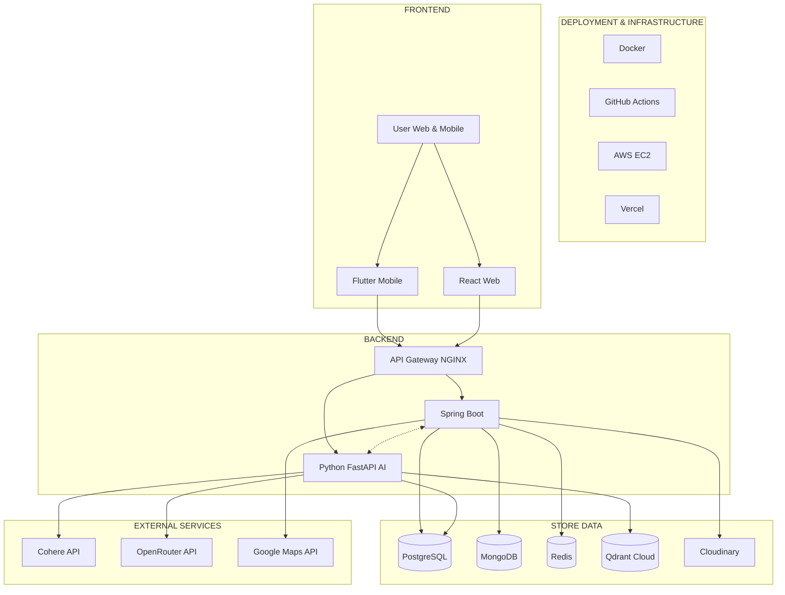
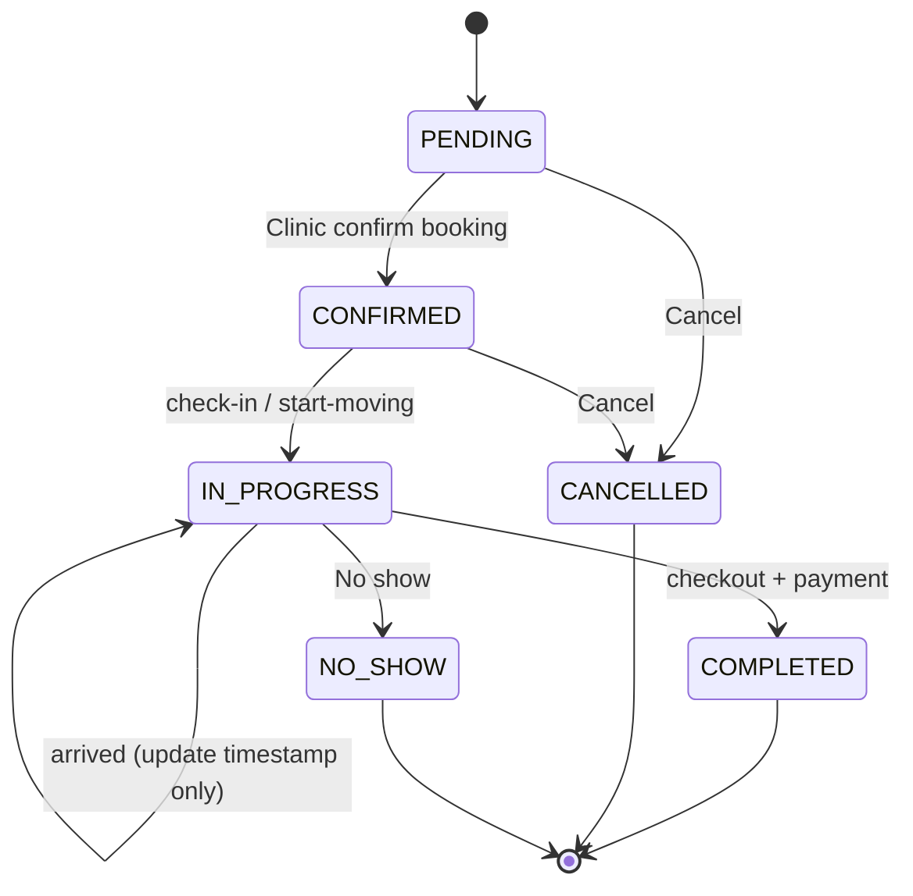
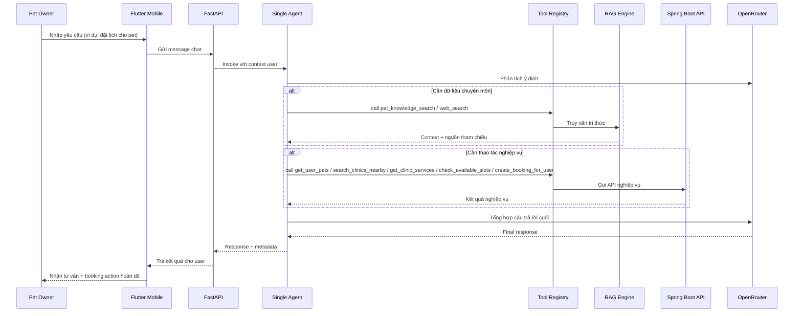
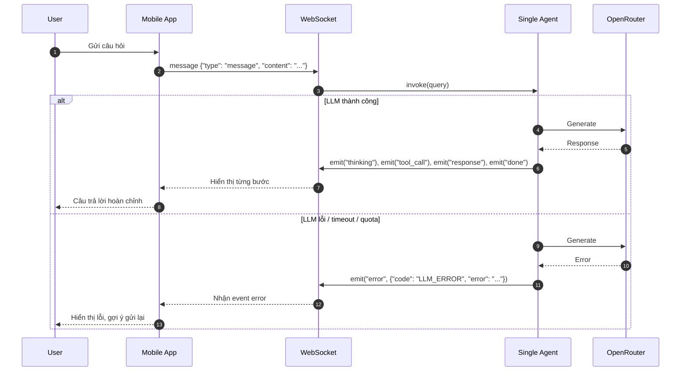
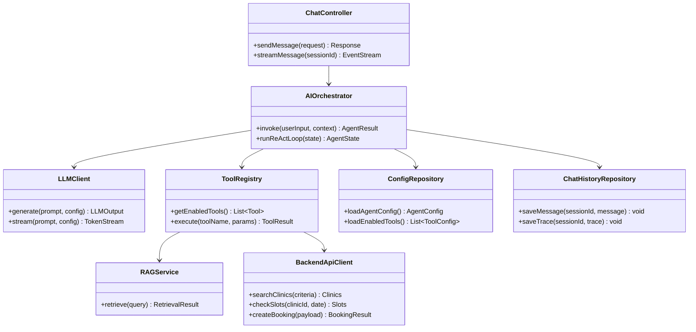

# Đáp án đánh giá Project Petties

**Phiên bản:** 1.1  
**Cập nhật:** 2026-03-04  
**Mục đích:** Trả lời các câu hỏi đánh giá (Software Product, Third Parties, Apply AI) và gợi ý chia slide trình bày. Phần B (Project Management) và C (Interaction with Supervisor) không trình bày trong tài liệu này.

**Tài liệu tham chiếu chính:**
- [REPORT_4_SDD_SYSTEM_DESIGN.md](SDD/REPORT_4_SDD_SYSTEM_DESIGN.md) – Kiến trúc, Package Diagram, Detailed Design
- [PETTIES_ERD_DIAGRAM.md](PETTIES_ERD_DIAGRAM.md) – ERD, thực thể, quan hệ
- [AI_AGENT_SERVICE_SDD.md](SDD/AI_AGENT_SERVICE_SDD.md) – Thiết kế AI Agent (sequence, class, DB, xử lý lỗi)
- [AI_FEATURES_NON_PET_OWNER_IDEA.md](AI_FEATURES_NON_PET_OWNER_IDEA.md) – Ý tưởng tính năng AI cho Clinic Owner / Manager / Staff
- [PROJECT_STATUS.md](../../PROJECT_STATUS.md) – Tiến độ, use case

---

## A. Software Product

### A.1 Kiến trúc hệ thống (deployment view & process view) có được mô tả rõ không?

**Đáp án:** Có. Kiến trúc hệ thống được mô tả rõ ở cả **deployment view** và **process view**.

- **Deployment view:** Trong Report 4 §1.1 System Architecture có flowchart với các khối: **DEPLOYMENT & INFRASTRUCTURE** (Docker, GitHub Actions, AWS EC2, Vercel), **FRONTEND** (Flutter Mobile, React Web), **BACKEND** (API Gateway NGINX, Spring Boot, Python FastAPI), **STORE DATA** (PostgreSQL, MongoDB, Redis, Qdrant Cloud, Cloudinary, Firebase), **EXTERNAL SERVICES** (Cohere, OpenRouter, Google Maps, Stripe). Luồng kết nối giữa từng lớp được vẽ rõ (Frontend → API Gateway → Spring Boot / Python; Spring Boot ↔ Python; Backend → Storage và External).
- **Process view:** Thể hiện qua mô tả luồng xử lý: User (Web/Mobile) → API Gateway (routing, load balancing) → Spring Boot (REST API, auth, business logic) hoặc Python FastAPI (AI Agent, chat streaming, RAG); Spring Boot và Python giao tiếp qua API; cả hai truy vấn PostgreSQL, MongoDB, Redis, Qdrant; Python gọi OpenRouter/Cohere.

**Deployment & Process View – Kiến trúc hệ thống (Report 4 §1.1):**

**Bằng chứng:** `docs-references/documentation/SDD/REPORT_4_SDD_SYSTEM_DESIGN.md` – Mục **1.1 System Architecture** (flowchart và đoạn mô tả 1–5).

---

### A.2 ERD có phản ánh đúng các thực thể, quan hệ và thuộc tính trong hệ thống không?

**Đáp án:** Có. ERD trong PETTIES_ERD_DIAGRAM.md phản ánh đầy đủ với Mermaid Crow's Foot, gồm **28+ thực thể** và quan hệ rõ ràng.

- **PostgreSQL (Core + Auth):** USER, CLINIC, CLINIC_IMAGE, MASTER_SERVICE, SERVICE, SERVICE_WEIGHT_PRICE, PET, STAFF_SHIFT, SLOT, BOOKING_SLOT, BOOKING, BOOKING_SERVICE, PAYMENT, REVIEW, NOTIFICATION, CHAT_CONVERSATION, CHAT_MESSAGE, REFRESH_TOKEN, BLACKLISTED_TOKEN, USER_REPORT.
- **MongoDB:** EMR_RECORD, VACCINATION_RECORD (và các embedded: prescriptions, images).
- **AI Service (PostgreSQL + MongoDB):**
    - **PostgreSQL:** AGENT, TOOL, PROMPT_VERSION, KNOWLEDGE_DOCUMENT, SYSTEM_SETTING.
    - **MongoDB:** AI_CHAT_SESSION (`ai_chat_sessions`), AI_CHAT_MESSAGE (`ai_chat_messages`), AI_PROACTIVE_NOTIFICATION, CHAT_FEEDBACK.
- **Quan hệ:** Đầy đủ cardinality (1-N, N-1, junction tables như BOOKING_SLOT, BOOKING_SERVICE), khóa ngoại và mô tả từng thực thể (mục đích, thuộc tính chính).

**Bằng chứng:** `docs-references/documentation/PETTIES_ERD_DIAGRAM.md` – §1 Complete Mermaid ERD, §2 Detailed Entities Description, §4 Relationship Matrix.

---

### A.3 Các entity model chính có đủ để thể hiện state và behavior như trong state diagram không?

**Đáp án:** Có. Các entity chính có trạng thái và luồng trạng thái được mô tả tương ứng state diagram.

- **BOOKING:** Trạng thái chuẩn là PENDING → CONFIRMED → IN_PROGRESS → COMPLETED; các nhánh phụ gồm CANCELLED, NO_SHOW. Các thao tác như `check-in`, `start-moving`, `arrived`, `checkout` chỉ là action hoặc event, không phải state. Với SOS vẫn có nhánh đặc thù `SEARCHING → PENDING_CLINIC_CONFIRM → CONFIRMED`.
- **USER:** status (ACTIVE | SUSPENDED | PENDING), role (PET_OWNER | STAFF | CLINIC_MANAGER | CLINIC_OWNER | ADMIN).
- **CLINIC:** status (PENDING | APPROVED | REJECTED | SUSPENDED).
- **STAFF_SHIFT:** status (SCHEDULED | COMPLETED | CANCELLED); **SLOT:** status (AVAILABLE | BOOKED | BLOCKED).
- **PAYMENT:** status (PENDING | PAID | REFUNDED | FAILED).

Các enum và trường này đủ để mô hình hóa state và behavior trong state diagram.

**State diagram – Luồng trạng thái BOOKING (happy path & nhánh lỗi):**

**Bằng chứng:** `docs-references/documentation/PETTIES_ERD_DIAGRAM.md` – §2.10 Booking (Status Flow), §5 Booking Lifecycle & Status Flow.

---

### A.4 Việc sử dụng dịch vụ bên ngoài (third-party API) có được biện minh và triển khai hiệu quả không?

**Đáp án:** Có. Các dịch vụ bên ngoài được dùng có mục đích rõ và được triển khai trong từng layer phù hợp.

| Dịch vụ | Mục đích | Nơi sử dụng | Ghi chú |
|--------|----------|-------------|---------|
| **OpenRouter** | LLM cho AI Agent (chat, ReAct) | Python AI Service | API key lưu trong DB (system_settings), Services layer có error handling |
| **Cohere** | Embeddings cho RAG (đa ngôn ngữ) | Python AI Service | Dùng embed-multilingual-v3, tích hợp LlamaIndex |
| **Qdrant Cloud** | Vector store cho RAG | Python AI Service | Lưu embedding 1024 chiều, binary quantization |
| **Cloudinary** | Media (ảnh avatar, clinic, EMR) | Spring Boot | Upload/URL qua config, CDN |
| **Google Maps / Goong** | Geocoding, bản đồ | Spring Boot | Tìm địa chỉ, tọa độ clinic / home visit |
| **Stripe** | Thanh toán online | Spring Boot | [Planned] – tài liệu có đề cập |
| **Firebase** | Push notification (FCM) | Spring Boot / Mobile | Thông báo real-time |

Kiến trúc tách Spring Boot (business logic, auth) và Python (AI, RAG) nên việc gọi API bên ngoài được phân tách rõ; API key và cấu hình được quản lý qua Admin (system_settings) cho AI.

**Bằng chứng:** Report 4 §1.1 EXTERNAL SERVICES; AI Agent SDD §5 (system_settings), §1.2 Services Layer (retry, error handling).

---

### A.5 Cấu trúc source code có hỗ trợ hiểu logic, bảo trì và mở rộng không?

**Đáp án:** Có. Cấu trúc monorepo và package diagram từng service hỗ trợ hiểu logic, bảo trì và mở rộng.

- **Monorepo:** Bốn service chính: `backend-spring/petties/`, `petties-web/`, `petties_mobile/`, `petties-agent-serivce/`, cộng `docs-references/`.
- **Spring Boot (backend-spring):** Các layer Presentation (controller), Business (service, service/impl), Data Access (repository), Domain (model, enums), DTO (dto, mapper), Cross-Cutting (config, security, exception, validation), Infrastructure (util, converter, scheduler, event), Migration (db/migration), Testing (test). Luồng Controller → Service → Repository → Entity được mô tả trong Report 4 §1.2.1.
- **Python AI Service (petties-agent-serivce):** API (routes, websocket, middleware, schemas, dependencies), Core (agents, tools, rag, config_helper), Services (LLM/embedding clients), Database (postgres models, session, migrations), Config, Testing. Package diagram và mô tả từng package trong Report 4 §1.2.1 (Python AI Agent Service).
- **React (petties-web):** Components, pages, store (Zustand), services (api, websocket), hooks, utils, layout; cấu trúc theo feature và shared modules.
- **Flutter (petties_mobile):** data (services, models, repositories), providers, ui/screens, routing, core (auth, error, network).

Cấu trúc này hỗ trợ tìm module theo chức năng, tách biệt cross-cutting (auth, lỗi), và mở rộng (thêm tool AI, thêm API, thêm màn hình) mà không phá vỡ ranh giới layer.

**Bằng chứng:** `docs-references/documentation/SDD/REPORT_4_SDD_SYSTEM_DESIGN.md` – **1.2 Package Diagram** (Spring Boot, Python AI, React, Flutter) và bảng mô tả package.

---

## D. Interaction with Third Parties

### D.1 Giao tiếp với bên thứ ba (Reviewer, doanh nghiệp) có hiệu quả không?

**Đáp án (template – nhóm điền theo thực tế):**  
Có. Giao tiếp với Reviewer/doanh nghiệp qua [kênh cụ thể]. *(Nhóm điền: email, meeting, công cụ; tần suất.)*

---

### D.2 Yêu cầu hoặc feedback từ bên thứ ba có được xử lý chuyên nghiệp và kịp thời không?

**Đáp án (template – nhóm điền theo thực tế):**  
Có. Yêu cầu/feedback được ghi nhận, phân loại và đưa vào backlog hoặc xử lý trong sprint phù hợp. *(Nhóm điền: quy trình cụ thể.)*

---

### D.3 Đóng góp từ bên thứ ba có được tích hợp vào project không?

**Đáp án (template – nhóm điền theo thực tế):**  
Có. Đóng góp (ý kiến nghiệp vụ, yêu cầu tính năng, góp ý UX) được phản ánh trong tài liệu và backlog, và triển khai khi phù hợp. *(Nhóm điền: ví dụ cụ thể.)*

---

## AI. Apply AI

### AI.0 Khung trình bày theo feedback mentor

Khi trình bày AI, chỉ giữ 2 câu hỏi chính:

1. **AI giúp tính năng nào “xịn” hơn?** (giá trị cho người dùng/đơn vị vận hành)
2. **AI được phát triển và vận hành thế nào?** (kiến trúc, gọi AI, xử lý lỗi, cập nhật dữ liệu)

> **Không tách riêng một slide “AI service life cycle”** vì dễ trùng ý và khó liên hệ trực tiếp tới giá trị sản phẩm.

### AI.0.1 Script ngắn cho khách hàng (1–2 phút): “AI update data & cải thiện độ chính xác”

**Mục tiêu:** Trả lời nhanh, dễ hiểu, không dùng thuật ngữ khó.

- **AI update data thế nào?**
  - “Bọn em cập nhật kiến thức cho AI bằng cách **upload tài liệu thú y** vào Knowledge Base.”
  - “Hệ thống tự xử lý tài liệu (chia nhỏ nội dung) và đưa vào kho tra cứu. Khi Pet Owner hỏi, AI sẽ **tra cứu lại kho này** để lấy thông tin đúng rồi mới trả lời.”
  - “Vì vậy khi có phác đồ/hướng dẫn mới, chỉ cần upload tài liệu là AI có thể trả lời theo kiến thức mới, không cần sửa nghiệp vụ Spring Boot.”

- **AI cải thiện độ chính xác ra sao theo thời gian?**
  - “Nếu câu hỏi quá ngắn, AI tự bổ sung từ khóa liên quan để tìm đúng tài liệu hơn.”
  - “Nếu người dùng hoặc Staff xác nhận câu trả lời đúng, hệ thống lưu lại các ‘trường hợp đã được xác nhận’. Lần sau gặp câu hỏi tương tự, AI ưu tiên tham chiếu các trường hợp này nên câu trả lời ngày càng sát thực tế hơn.”

**Tham chiếu (để trả lời khi bị hỏi nguồn):**
- `docs-references/documentation/SDD/REPORT_4_SDD_SYSTEM_DESIGN.md` – Mục **4.19 AI Data Improvement Mechanisms**
- `docs-references/documentation/TECHNICAL SCOPE PETTIES - AGENT MANAGEMENT.md` – Mục **RAG Update / Knowledge Base Management**
- `docs-references/documentation/SRS/PETTIES_SRS.md` – Mục **3.11.1 Consult AI Assistant (Ask ChatBot To Pet Care = Done)**

### AI.1 Kiến trúc hệ thống / package diagram có mô tả AI là thành phần tách biệt hay nhúng trong logic chính không?

**Đáp án:** Có. AI được mô tả rõ là **thành phần tách biệt** (sub-system riêng), không nhúng trong từng API của Spring Boot.

- **Report 4 §1.1:** Backend gồm hai thành phần: **Spring Boot** (API, auth, business logic) và **Python FastAPI** (AI Agent Service, AI Chat Streaming, RAG Pipeline). Hai service này nối với nhau qua API Gateway; Spring Boot và Python có kết nối hai chiều (dashed line) để AI gọi API nghiệp vụ khi cần.
- **Report 4 §1.2:** Có **Package Diagram riêng cho Python AI Agent Service** (api, core/agents, core/tools, core/rag, services, db, config, tests). Điều này thể hiện AI là một service độc lập với cấu trúc package rõ ràng.
- **AI Agent SDD §1.1–1.2:** High-Level Architecture và Service Layers mô tả Client (Web/Mobile) → API Gateway → REST/WebSocket → **Agent Core Layer** (Single Agent, Tool Registry, RAG Engine) → LLM Layer (OpenRouter, Cohere) và Data Layer (PostgreSQL, Qdrant, MongoDB). AI xử lý trong **Single Agent (LangGraph ReAct)**, gọi tools và RAG; logic nghiệp vụ chính vẫn nằm ở Spring Boot.
- **Mở rộng phạm vi AI (Non-Pet Owner):** Tài liệu [AI_FEATURES_NON_PET_OWNER_IDEA.md](AI_FEATURES_NON_PET_OWNER_IDEA.md) mô tả **Petties AI Agent Ecosystem** với nhiều vai trò (Pet Owner, Staff, Clinic Manager, Clinic Owner) và các agent hướng nghiệp vụ: General Agent (entry), Clinical Agent, Operations Agent, Business Agent, Setup Agent. Tools layer tách bạch: RAG (chỉ cho Pet Care Q&A), Database Tools, Spring Boot API, Image Analysis. Điều này củng cố việc AI là **hệ thống con tách biệt** với nhiều use case, không nhúng lẫn vào từng API nghiệp vụ.

**Bằng chứng:**  
- `docs-references/documentation/SDD/REPORT_4_SDD_SYSTEM_DESIGN.md` – §1.1 System Architecture, §1.2 Package Diagram (Python AI).  
- `docs-references/documentation/SDD/AI_AGENT_SERVICE_SDD.md` – §1.1 High-Level Architecture, §1.2 Service Layers.  
- `docs-references/documentation/AI_FEATURES_NON_PET_OWNER_IDEA.md` – §1 Agent Architecture Overview, §1.2 Petties AI Agent Ecosystem.

---

### AI.2 Sequence diagram có thể hiện rõ AI làm tính năng tốt hơn như thế nào không?

**Đáp án:** Có. Nên dùng **1 sequence diagram chính** cho luồng tạo giá trị (tư vấn → hành động), thay vì nhiều sơ đồ nhỏ rời rạc.

**Sequence diagram đề xuất cho slide: “AI hỗ trợ đặt lịch qua chat”**

Tài liệu [AI_FEATURES_NON_PET_OWNER_IDEA.md](AI_FEATURES_NON_PET_OWNER_IDEA.md) §1.3 bổ sung **ReAct Pattern – Agent Reasoning Loop** (Thought → Action → Observation) cho nhiều bước và nhiều tool (get_pet_info, get_booking_history, symptom_to_diagnosis, treatment_recommendation, emr_autonomous_creator), thể hiện gửi/nhận dữ liệu trong vòng lặp lý luận của agent.

**Bằng chứng:**  
- `docs-references/documentation/SDD/AI_AGENT_SERVICE_SDD.md` – §6.1, §6.2, §6.3, §6.4, §6.5.  
- `docs-references/documentation/AI_FEATURES_NON_PET_OWNER_IDEA.md` – §1.3 ReAct Pattern - Agent Reasoning Loop.

---

### AI.3 Sequence diagram hoặc mô tả có nêu rõ: hệ thống gọi AI ở đâu, chờ response thế nào, xử lý khi AI lỗi không?

**Đáp án:** Có.

- **Gọi AI ở đâu:**  
  - **REST:** Client gọi FastAPI endpoint (ví dụ POST /api/v1/chat/sessions/{session_id}/messages). Route handler nhận request → load agent config từ DB → gọi `Agent.invoke(user_query, config)`.  
  - **WebSocket:** Client kết nối `/ws/chat/{session_id}?token=JWT`, gửi message dạng `{ "type": "message", "content": "..." }`. WebSocket handler chuyển vào Single Agent, bắt đầu ReAct loop.  
  (AI_FEATURES_NON_PET_OWNER_IDEA.md mô tả agent được gọi từ nhiều role – Pet Owner, Staff, CM, CO – qua cùng entry point General Agent rồi phân luồng theo ngữ cảnh.)

- **Chờ response:**  
  - **REST:** Endpoint `/api/v1/chat/sessions/{session_id}/messages` hiện chủ yếu persist user message và trả ACK/metadata.  
  - **WebSocket:** Bất đồng bộ – client nhận lần lượt event: `thinking` → `tool_call` → `tool_result` → `stream` (delta) → `complete` (final answer + sources). Client hiển thị từng bước và tích lũy nội dung.

- **Xử lý khi AI lỗi:**  
  - **WebSocket:** Server gửi event `type: "error"`, ví dụ `{ "type": "error", "error": "Failed to connect to LLM service", "code": "LLM_ERROR" }`. Client có thể hiển thị thông báo lỗi và cho phép gửi lại.  
  - **Mã lỗi chuẩn (AI Agent SDD Appendix A):** AGENT_DISABLED (503), TOOL_NOT_FOUND (404), TOOL_DISABLED (400), LLM_ERROR (500), RAG_ERROR (500), INVALID_TOKEN (401), QUOTA_EXCEEDED (429), DOCUMENT_NOT_FOUND (404).  
  - **Implementation:** Services layer (OpenRouter, Cohere) có retry và error handling; Tool Executor xử lý lỗi tool và trả kết quả cấu trúc về agent; core/sentry dùng cho error monitoring.

**Sequence diagram – Gọi AI và xử lý lỗi (WebSocket):**

**Bằng chứng:**  
- `docs-references/documentation/SDD/AI_AGENT_SERVICE_SDD.md` – §4.2 WebSocket Protocol (error event), Appendix A API Error Codes; §2.5 Tool Execution Flow; §1.2 Services Layer.

---

### AI.4 Thiết kế database có hỗ trợ lưu dữ liệu gửi tới AI và kết quả AI trả về để phân tích/kiểm chứng sau không?

**Đáp án:** Có. Thiết kế hiện tại tách rõ trách nhiệm: PostgreSQL cho cấu hình AI, MongoDB cho lịch sử hội thoại AI-user.

- **PostgreSQL (AI config/governance):** lưu `agents`, `tools`, `prompt_versions`, `knowledge_documents`, `system_settings` để quản trị Single Agent, tools và RAG config.

- **MongoDB (AI chat history):**
    - **ai_chat_sessions:** session-level metadata (session_id, user_id, user_role, clinic_id, context_type, agent_id, created_at, updated_at).
    - **ai_chat_messages:** message-level records (message_id, session_id, user_id, role, content, context_type, react_trace, tool_calls, sources, timestamp).
    Cấu trúc này phù hợp truy vấn theo session/user và audit chất lượng phản hồi AI.

- **ERD/SDD:** AI chat runtime được mô tả bằng `ai_chat_sessions`, `ai_chat_messages`, `ai_proactive_notifications`, `chat_feedback`; đủ để audit, debug và phân tích chất lượng câu trả lời / tool usage.

**Bằng chứng:**  
- `docs-references/documentation/SDD/AI_AGENT_SERVICE_SDD.md` – §5.1 PostgreSQL Schema (không lưu chat AI-user), §5.4 MongoDB Schema (`ai_chat_sessions`, `ai_chat_messages`).  
- `docs-references/documentation/PETTIES_ERD_DIAGRAM.md` – §2.24 AI_CHAT_SESSION, §2.25 AI_CHAT_MESSAGE.

---

### AI.5 Class diagram có thể hiện việc gọi và xử lý AI được đóng gói thành class/module riêng (AI Client, Prediction Service, v.v.) không?

**Đáp án:** Có. Nên dùng class diagram tối giản cho slide để người nghe thấy ngay ranh giới module và quan hệ phụ thuộc.

**Class diagram đề xuất cho slide: “AI được phát triển/vận hành như thế nào”**

- **SingleAgent** là lớp điều phối chính (invoke, think/act/observe); **LLMClient** đóng gói gọi LLM bên ngoài; **ToolRegistry** quản lý và gọi tools; **ReActState** lưu trạng thái vòng lặp. Các module RAG (LlamaIndexRAGEngine), Tool (FastMCP, MCPTool, PetCareQATool, SymptomSearchTool) nằm trong §7.2–7.3 – tách biệt với business logic Spring Boot.

Tài liệu [AI_FEATURES_NON_PET_OWNER_IDEA.md](AI_FEATURES_NON_PET_OWNER_IDEA.md) bổ sung **các tool và luồng** cho Clinical/Operations/Business/Setup agents (symptom_to_diagnosis, treatment_recommendation, emr_autonomous_creator, staff_allocation_agent, revenue_insights_agent, v.v.) – các tool này được implement dưới dạng hàm/callable trong Tool Layer và gọi từ Single Agent, vẫn nằm trong cùng kiến trúc class/module tách biệt (core/tools, core/agents).

**Bằng chứng:**  
- `docs-references/documentation/SDD/AI_AGENT_SERVICE_SDD.md` – §7.1 Agent Core Classes, §7.2 RAG Engine Classes, §7.3 Tool System Classes, §7.4 Database Models.  
- `docs-references/documentation/AI_FEATURES_NON_PET_OWNER_IDEA.md` – §2.1 Autonomous Clinical Diagnosis System (tools), §3–5 (Operations, Business tools), §8 Clinic Setup Agent Tools.

---

## Gợi ý chia slide trình bày

| Slide | Nội dung |
|-------|----------|
| **1** | **Bìa** – Tên project (Petties), nhóm, ngày thuyết trình. |
| **2** | **Mục lục / Cấu trúc đánh giá** – A. Software Product, D. Third Parties, AI. Apply AI. (B, C không trình bày.) |
| **3** | **A. Software Product – Kiến trúc & ERD** – Tóm tắt A.1 (deployment + process view) kèm flowchart, A.2 (ERD đầy đủ). |
| **4** | **A. Software Product – Entity, dịch vụ ngoài, code** – A.3 (entity/state) kèm state diagram BOOKING, A.4 (external services), A.5 (package structure). |
| **5** | **D. Interaction with Third Parties** – Giao tiếp (D.1), Xử lý yêu cầu/feedback (D.2), Tích hợp đóng góp (D.3). |
| **6** | **AI tạo giá trị gì** – Chọn 2–3 tính năng “xịn” hơn nhờ AI (chat tư vấn có nguồn, symptom triage, đặt lịch qua chat) + 1 sequence diagram end-to-end. |
| **7** | **AI phát triển & vận hành thế nào** – Class diagram module chính (Controller/Orchestrator/LLM/Tools/RAG/Backend client/Repositories) + luồng xử lý lỗi, logging, cập nhật tri thức. |
| **8** | **Kết luận** – Điểm mạnh, hạn chế (nếu có), hướng phát triển (AI_FEATURES_NON_PET_OWNER_IDEA). |
| **9** | **Q&A** |

**Tổng:** 9 slide (không gồm B, C).

---

## Metadata

| Thuộc tính | Giá trị |
|------------|---------|
| **Document** | EVALUATION_ANSWERS_AND_SLIDES.md |
| **Version** | 1.1 |
| **Last Updated** | 2026-03-04 |
| **Tác giả** | Petties Team (template đáp án) |
| **Tham chiếu** | REPORT_4_SDD, PETTIES_ERD_DIAGRAM, AI_AGENT_SERVICE_SDD, AI_FEATURES_NON_PET_OWNER_IDEA, PROJECT_STATUS |
