# PETTIES ERD - Entity Relationship Diagram

**Version:** 2.0
**Last Updated:** 2025-12-16
**Standard:** Chen Notation + Crow's Foot (Mermaid)

---

## 1. Mermaid ERD Code (Crow's Foot Notation)

```mermaid
erDiagram
    %% ========== USER MANAGEMENT ==========
    USER {
        uuid user_id PK
        varchar username UK "NOT NULL"
        varchar email UK "NOT NULL"
        varchar password "NOT NULL"
        varchar phone
        varchar full_name
        varchar avatar
        enum role "NOT NULL: PET_OWNER|VET|CLINIC_OWNER|CLINIC_MANAGER|ADMIN"
        enum status "NOT NULL: PENDING_ACTIVATION|ACTIVE|DEACTIVATED"
        varchar google_id
        timestamp created_at "NOT NULL"
        timestamp updated_at
        timestamp deleted_at
    }

    %% ========== CLINIC MANAGEMENT ==========
    CLINIC {
        uuid clinic_id PK
        uuid owner_id FK "NOT NULL"
        varchar name "NOT NULL"
        text description
        varchar address "NOT NULL"
        varchar phone "NOT NULL"
        varchar email
        decimal latitude
        decimal longitude
        varchar license_number
        varchar license_document
        json operating_hours
        enum status "NOT NULL: PENDING|APPROVED|REJECTED|SUSPENDED"
        text rejection_reason
        decimal rating_avg
        int rating_count
        timestamp approved_at
        timestamp created_at "NOT NULL"
        timestamp updated_at
        timestamp deleted_at
    }

    SERVICE {
        uuid service_id PK
        uuid clinic_id FK "NOT NULL"
        varchar name "NOT NULL"
        text description
        decimal base_price "NOT NULL"
        int duration_minutes "NOT NULL"
        int slots_required "NOT NULL DEFAULT 1"
        boolean supports_home_visit "DEFAULT FALSE"
        decimal price_per_km
        boolean is_active "DEFAULT TRUE"
        timestamp created_at "NOT NULL"
        timestamp updated_at
        timestamp deleted_at
    }

    %% ========== PET MANAGEMENT ==========
    PET {
        uuid pet_id PK
        uuid owner_id FK "NOT NULL"
        varchar name "NOT NULL"
        enum species "NOT NULL: DOG|CAT|BIRD|RABBIT|HAMSTER|FISH|OTHER"
        varchar breed
        date birth_date
        enum gender "MALE|FEMALE|UNKNOWN"
        decimal weight_kg
        varchar color
        varchar microchip_number
        text special_notes
        varchar avatar
        boolean is_neutered "DEFAULT FALSE"
        timestamp created_at "NOT NULL"
        timestamp updated_at
        timestamp deleted_at
    }

    %% ========== SCHEDULING ==========
    VET_SHIFT {
        uuid shift_id PK
        uuid vet_id FK "NOT NULL"
        uuid clinic_id FK "NOT NULL"
        date work_date "NOT NULL"
        time start_time "NOT NULL"
        time end_time "NOT NULL"
        time break_start
        time break_end
        int slot_duration_minutes "DEFAULT 30"
        enum status "NOT NULL: SCHEDULED|COMPLETED|CANCELLED"
        timestamp created_at "NOT NULL"
        timestamp updated_at
    }

    SLOT {
        uuid slot_id PK
        uuid shift_id FK "NOT NULL"
        int slot_number "NOT NULL"
        time start_time "NOT NULL"
        time end_time "NOT NULL"
        enum status "NOT NULL: AVAILABLE|BOOKED|BLOCKED"
        uuid booking_id FK
        timestamp created_at "NOT NULL"
        timestamp updated_at
    }

    %% ========== BOOKING ==========
    BOOKING {
        uuid booking_id PK
        varchar booking_code UK
        uuid pet_id FK "NOT NULL"
        uuid pet_owner_id FK "NOT NULL"
        uuid clinic_id FK "NOT NULL"
        uuid service_id FK "NOT NULL"
        uuid assigned_vet_id FK
        uuid assigned_by_id FK
        date booking_date "NOT NULL"
        time booking_time "NOT NULL"
        int slots_used "NOT NULL"
        enum appointment_type "NOT NULL: IN_CLINIC|HOME_VISIT"
        varchar home_address
        decimal home_lat
        decimal home_lng
        decimal distance_km
        decimal base_price "NOT NULL"
        decimal distance_fee "DEFAULT 0"
        decimal total_price "NOT NULL"
        enum status "NOT NULL: PENDING|ASSIGNED|CONFIRMED|CHECK_IN|IN_PROGRESS|CHECK_OUT|COMPLETED|CANCELLED|NO_SHOW"
        text pet_owner_notes
        text rejection_reason
        timestamp assigned_at
        timestamp confirmed_at
        timestamp check_in_at
        timestamp check_out_at
        timestamp completed_at
        timestamp cancelled_at
        varchar cancelled_by
        timestamp created_at "NOT NULL"
        timestamp updated_at
    }

    %% ========== PAYMENT ==========
    PAYMENT {
        uuid payment_id PK
        uuid booking_id FK "NOT NULL"
        varchar transaction_id UK
        varchar stripe_payment_intent_id
        decimal amount "NOT NULL"
        decimal platform_fee
        decimal clinic_revenue
        decimal stripe_fee
        enum payment_method "NOT NULL: ONLINE|CASH"
        enum status "NOT NULL: PENDING|PAID|REFUNDED|FAILED"
        timestamp paid_at
        timestamp refunded_at
        text refund_reason
        timestamp created_at "NOT NULL"
        timestamp updated_at
    }

    %% ========== EMR ==========
    EMR {
        uuid emr_id PK
        uuid booking_id FK "NOT NULL"
        uuid pet_id FK "NOT NULL"
        uuid vet_id FK "NOT NULL"
        uuid clinic_id FK "NOT NULL"
        text chief_complaint
        text history
        text physical_examination
        text diagnosis
        text treatment_plan
        text notes
        decimal weight_kg
        decimal temperature_c
        int heart_rate_bpm
        int respiratory_rate
        timestamp examination_date "NOT NULL"
        timestamp created_at "NOT NULL"
        timestamp updated_at
    }

    PRESCRIPTION {
        uuid prescription_id PK
        uuid emr_id FK "NOT NULL"
        varchar medicine_name "NOT NULL"
        varchar dosage "NOT NULL"
        varchar frequency "NOT NULL"
        int duration_days
        text instructions
        int quantity
        varchar unit
        timestamp created_at "NOT NULL"
        timestamp updated_at
    }

    %% ========== VACCINATION ==========
    VACCINATION {
        uuid vaccination_id PK
        uuid pet_id FK "NOT NULL"
        uuid administered_by_id FK "NOT NULL"
        uuid clinic_id FK "NOT NULL"
        uuid booking_id FK
        varchar vaccine_name "NOT NULL"
        varchar batch_number
        varchar manufacturer
        date vaccination_date "NOT NULL"
        date next_due_date
        text notes
        timestamp created_at "NOT NULL"
        timestamp updated_at
    }

    %% ========== REVIEW ==========
    REVIEW {
        uuid review_id PK
        uuid booking_id FK "NOT NULL"
        uuid reviewer_id FK "NOT NULL"
        uuid vet_id FK
        uuid clinic_id FK
        enum review_type "NOT NULL: VET|CLINIC"
        int rating "NOT NULL CHECK 1-5"
        text comment
        boolean is_anonymous "DEFAULT FALSE"
        timestamp reviewed_at "NOT NULL"
        timestamp created_at "NOT NULL"
        timestamp updated_at
    }

    %% ========== NOTIFICATION ==========
    NOTIFICATION {
        uuid notification_id PK
        uuid user_id FK "NOT NULL"
        enum type "NOT NULL"
        varchar title "NOT NULL"
        text content
        json data
        boolean is_read "DEFAULT FALSE"
        timestamp read_at
        timestamp sent_at
        timestamp created_at "NOT NULL"
    }

    %% ========== RELATIONSHIPS ==========
    USER ||--o{ PET : "owns"
    USER ||--o| CLINIC : "owns"
    USER ||--o{ VET_SHIFT : "works"
    USER ||--o{ BOOKING : "creates"
    USER ||--o{ BOOKING : "assigned_to"
    USER ||--o{ EMR : "creates"
    USER ||--o{ VACCINATION : "administers"
    USER ||--o{ REVIEW : "writes"
    USER ||--o{ NOTIFICATION : "receives"

    CLINIC ||--o{ SERVICE : "offers"
    CLINIC ||--o{ VET_SHIFT : "schedules"
    CLINIC ||--o{ BOOKING : "receives"
    CLINIC ||--o{ EMR : "records"
    CLINIC ||--o{ VACCINATION : "records"
    CLINIC ||--o{ REVIEW : "receives"

    SERVICE ||--o{ BOOKING : "used_in"

    PET ||--o{ BOOKING : "has"
    PET ||--o{ EMR : "has"
    PET ||--o{ VACCINATION : "receives"

    VET_SHIFT ||--|{ SLOT : "contains"

    SLOT }o--|| BOOKING : "reserved_by"

    BOOKING ||--|| PAYMENT : "has"
    BOOKING ||--o| EMR : "generates"
    BOOKING ||--o{ REVIEW : "has"
    BOOKING ||--o| VACCINATION : "includes"

    EMR ||--o{ PRESCRIPTION : "contains"
```



---

## 2. Chen Notation Legend

| Symbol | Meaning |
|--------|---------|
| Rectangle | Strong Entity |
| Double Rectangle | Weak Entity |
| Oval | Attribute |
| Underline in Oval | Primary Key (PK) |
| Dashed Underline | Partial Key |
| Double Oval | Multi-valued Attribute |
| Diamond | Relationship |
| Double Diamond | Identifying Relationship |
| 1, N, M | Cardinality |
| Thick line | Total Participation (mandatory) |
| Thin line | Partial Participation (optional) |

---

## 3. Entity Specifications

### 3.1 USER

| Attribute | Type | Constraints | Description |
|-----------|------|-------------|-------------|
| **user_id** | UUID | PK | Primary identifier |
| username | VARCHAR(50) | UK, NOT NULL | Unique login name |
| email | VARCHAR(100) | UK, NOT NULL | Unique email |
| password | VARCHAR(255) | NOT NULL | Hashed password |
| phone | VARCHAR(20) | NULLABLE | Phone number |
| full_name | VARCHAR(100) | NULLABLE | Display name |
| avatar | VARCHAR(500) | NULLABLE | Avatar URL |
| role | ENUM | NOT NULL | PET_OWNER, VET, CLINIC_OWNER, CLINIC_MANAGER, ADMIN |
| status | ENUM | NOT NULL, DEFAULT 'ACTIVE' | PENDING_ACTIVATION, ACTIVE, DEACTIVATED |
| google_id | VARCHAR(100) | NULLABLE | Google OAuth ID |
| created_at | TIMESTAMP | NOT NULL | Creation time |
| updated_at | TIMESTAMP | NULLABLE | Last update time |
| deleted_at | TIMESTAMP | NULLABLE | Soft delete time |

### 3.2 CLINIC

| Attribute | Type | Constraints | Description |
|-----------|------|-------------|-------------|
| **clinic_id** | UUID | PK | Primary identifier |
| owner_id | UUID | FK -> USER, NOT NULL | Clinic owner |
| name | VARCHAR(200) | NOT NULL | Clinic name |
| description | TEXT | NULLABLE | Description |
| address | VARCHAR(500) | NOT NULL | Full address |
| phone | VARCHAR(20) | NOT NULL | Contact phone |
| email | VARCHAR(100) | NULLABLE | Contact email |
| latitude | DECIMAL(10,8) | NULLABLE | GPS latitude |
| longitude | DECIMAL(11,8) | NULLABLE | GPS longitude |
| license_number | VARCHAR(50) | NULLABLE | Business license |
| license_document | VARCHAR(500) | NULLABLE | License doc URL |
| operating_hours | JSON | NULLABLE | Weekly schedule |
| status | ENUM | NOT NULL, DEFAULT 'PENDING' | PENDING, APPROVED, REJECTED, SUSPENDED |
| rejection_reason | TEXT | NULLABLE | If rejected |
| rating_avg | DECIMAL(2,1) | DEFAULT 0 | Average rating 1-5 |
| rating_count | INTEGER | DEFAULT 0 | Total ratings |
| approved_at | TIMESTAMP | NULLABLE | Approval time |
| created_at | TIMESTAMP | NOT NULL | Creation time |
| updated_at | TIMESTAMP | NULLABLE | Last update |
| deleted_at | TIMESTAMP | NULLABLE | Soft delete |

### 3.3 SERVICE

| Attribute | Type | Constraints | Description |
|-----------|------|-------------|-------------|
| **service_id** | UUID | PK | Primary identifier |
| clinic_id | UUID | FK -> CLINIC, NOT NULL | Parent clinic |
| name | VARCHAR(200) | NOT NULL | Service name |
| description | TEXT | NULLABLE | Service description |
| base_price | DECIMAL(12,2) | NOT NULL | Base price (VND) |
| duration_minutes | INTEGER | NOT NULL | Estimated duration |
| slots_required | INTEGER | NOT NULL, DEFAULT 1 | Number of 30-min slots |
| supports_home_visit | BOOLEAN | DEFAULT FALSE | Home visit available |
| price_per_km | DECIMAL(10,2) | NULLABLE | Price per km |
| is_active | BOOLEAN | DEFAULT TRUE | Active status |
| created_at | TIMESTAMP | NOT NULL | Creation time |
| updated_at | TIMESTAMP | NULLABLE | Last update |
| deleted_at | TIMESTAMP | NULLABLE | Soft delete |

### 3.4 PET

| Attribute | Type | Constraints | Description |
|-----------|------|-------------|-------------|
| **pet_id** | UUID | PK | Primary identifier |
| owner_id | UUID | FK -> USER, NOT NULL | Pet owner |
| name | VARCHAR(100) | NOT NULL | Pet name |
| species | ENUM | NOT NULL | DOG, CAT, BIRD, RABBIT, HAMSTER, FISH, OTHER |
| breed | VARCHAR(100) | NULLABLE | Pet breed |
| birth_date | DATE | NULLABLE | Birth date |
| gender | ENUM | NULLABLE | MALE, FEMALE, UNKNOWN |
| weight_kg | DECIMAL(5,2) | NULLABLE | Weight in kg |
| color | VARCHAR(50) | NULLABLE | Color/markings |
| microchip_number | VARCHAR(50) | NULLABLE | Microchip ID |
| special_notes | TEXT | NULLABLE | Special care notes |
| avatar | VARCHAR(500) | NULLABLE | Pet photo URL |
| is_neutered | BOOLEAN | DEFAULT FALSE | Neutered status |
| created_at | TIMESTAMP | NOT NULL | Creation time |
| updated_at | TIMESTAMP | NULLABLE | Last update |
| deleted_at | TIMESTAMP | NULLABLE | Soft delete |

### 3.5 VET_SHIFT

| Attribute | Type | Constraints | Description |
|-----------|------|-------------|-------------|
| **shift_id** | UUID | PK | Primary identifier |
| vet_id | UUID | FK -> USER, NOT NULL | Vet reference |
| clinic_id | UUID | FK -> CLINIC, NOT NULL | Clinic reference |
| work_date | DATE | NOT NULL | Working date |
| start_time | TIME | NOT NULL | Shift start |
| end_time | TIME | NOT NULL | Shift end |
| break_start | TIME | NULLABLE | Break start |
| break_end | TIME | NULLABLE | Break end |
| slot_duration_minutes | INTEGER | DEFAULT 30 | Slot duration |
| status | ENUM | NOT NULL, DEFAULT 'SCHEDULED' | SCHEDULED, COMPLETED, CANCELLED |
| created_at | TIMESTAMP | NOT NULL | Creation time |
| updated_at | TIMESTAMP | NULLABLE | Last update |

### 3.6 SLOT (Weak Entity)

| Attribute | Type | Constraints | Description |
|-----------|------|-------------|-------------|
| **slot_id** | UUID | PK | Primary identifier |
| shift_id | UUID | FK -> VET_SHIFT, NOT NULL | Parent shift |
| slot_number | INTEGER | NOT NULL, Partial Key | Sequential number (1, 2, 3...) |
| start_time | TIME | NOT NULL | Slot start |
| end_time | TIME | NOT NULL | Slot end |
| status | ENUM | NOT NULL, DEFAULT 'AVAILABLE' | AVAILABLE, BOOKED, BLOCKED |
| booking_id | UUID | FK -> BOOKING, NULLABLE | If booked |
| created_at | TIMESTAMP | NOT NULL | Creation time |
| updated_at | TIMESTAMP | NULLABLE | Last update |

### 3.7 BOOKING

| Attribute | Type | Constraints | Description |
|-----------|------|-------------|-------------|
| **booking_id** | UUID | PK | Primary identifier |
| booking_code | VARCHAR(20) | UK | Human-readable code |
| pet_id | UUID | FK -> PET, NOT NULL | Pet reference |
| pet_owner_id | UUID | FK -> USER, NOT NULL | Pet owner |
| clinic_id | UUID | FK -> CLINIC, NOT NULL | Clinic reference |
| service_id | UUID | FK -> SERVICE, NOT NULL | Service reference |
| assigned_vet_id | UUID | FK -> USER, NULLABLE | Assigned vet |
| assigned_by_id | UUID | FK -> USER, NULLABLE | Manager who assigned |
| booking_date | DATE | NOT NULL | Appointment date |
| booking_time | TIME | NOT NULL | Start time |
| slots_used | INTEGER | NOT NULL | Slots consumed |
| appointment_type | ENUM | NOT NULL | IN_CLINIC, HOME_VISIT |
| home_address | VARCHAR(500) | NULLABLE | Home visit address |
| home_lat | DECIMAL(10,8) | NULLABLE | Latitude |
| home_lng | DECIMAL(11,8) | NULLABLE | Longitude |
| distance_km | DECIMAL(6,2) | NULLABLE | Distance |
| base_price | DECIMAL(12,2) | NOT NULL | Base price |
| distance_fee | DECIMAL(12,2) | DEFAULT 0 | Distance fee |
| total_price | DECIMAL(12,2) | NOT NULL | Total price |
| status | ENUM | NOT NULL, DEFAULT 'PENDING' | See status flow below |
| pet_owner_notes | TEXT | NULLABLE | Notes |
| rejection_reason | TEXT | NULLABLE | If rejected |
| assigned_at | TIMESTAMP | NULLABLE | Assignment time |
| confirmed_at | TIMESTAMP | NULLABLE | Confirmation time |
| check_in_at | TIMESTAMP | NULLABLE | Check-in time |
| check_out_at | TIMESTAMP | NULLABLE | Check-out time |
| completed_at | TIMESTAMP | NULLABLE | Completion time |
| cancelled_at | TIMESTAMP | NULLABLE | Cancellation time |
| cancelled_by | VARCHAR(50) | NULLABLE | Who cancelled |
| created_at | TIMESTAMP | NOT NULL | Creation time |
| updated_at | TIMESTAMP | NULLABLE | Last update |

**Booking Status Flow:**
```
PENDING -> ASSIGNED -> CONFIRMED -> CHECK_IN -> IN_PROGRESS -> CHECK_OUT -> COMPLETED
    |          |           |
    v          v           v
CANCELLED  PENDING     CANCELLED
          (reject)
```

### 3.8 PAYMENT

| Attribute | Type | Constraints | Description |
|-----------|------|-------------|-------------|
| **payment_id** | UUID | PK | Primary identifier |
| booking_id | UUID | FK -> BOOKING, NOT NULL | Booking reference |
| transaction_id | VARCHAR(100) | UK | Internal transaction ID |
| stripe_payment_intent_id | VARCHAR(100) | NULLABLE | Stripe ID |
| amount | DECIMAL(12,2) | NOT NULL | Total amount |
| platform_fee | DECIMAL(12,2) | NULLABLE | Platform fee (15%) |
| clinic_revenue | DECIMAL(12,2) | NULLABLE | Clinic revenue (85%) |
| stripe_fee | DECIMAL(12,2) | NULLABLE | Stripe fee |
| payment_method | ENUM | NOT NULL | ONLINE, CASH |
| status | ENUM | NOT NULL, DEFAULT 'PENDING' | PENDING, PAID, REFUNDED, FAILED |
| paid_at | TIMESTAMP | NULLABLE | Payment time |
| refunded_at | TIMESTAMP | NULLABLE | Refund time |
| refund_reason | TEXT | NULLABLE | Refund reason |
| created_at | TIMESTAMP | NOT NULL | Creation time |
| updated_at | TIMESTAMP | NULLABLE | Last update |

### 3.9 EMR

| Attribute | Type | Constraints | Description |
|-----------|------|-------------|-------------|
| **emr_id** | UUID | PK | Primary identifier |
| booking_id | UUID | FK -> BOOKING, NOT NULL | Booking reference |
| pet_id | UUID | FK -> PET, NOT NULL | Pet reference |
| vet_id | UUID | FK -> USER, NOT NULL | Vet who created |
| clinic_id | UUID | FK -> CLINIC, NOT NULL | Clinic reference |
| chief_complaint | TEXT | NULLABLE | Main complaint |
| history | TEXT | NULLABLE | Medical history |
| physical_examination | TEXT | NULLABLE | Exam findings |
| diagnosis | TEXT | NULLABLE | Diagnosis |
| treatment_plan | TEXT | NULLABLE | Treatment plan |
| notes | TEXT | NULLABLE | Additional notes |
| weight_kg | DECIMAL(5,2) | NULLABLE | Weight |
| temperature_c | DECIMAL(4,2) | NULLABLE | Temperature |
| heart_rate_bpm | INTEGER | NULLABLE | Heart rate |
| respiratory_rate | INTEGER | NULLABLE | Respiratory rate |
| examination_date | TIMESTAMP | NOT NULL | Exam date |
| created_at | TIMESTAMP | NOT NULL | Creation time |
| updated_at | TIMESTAMP | NULLABLE | Last update |

### 3.10 PRESCRIPTION (Weak Entity)

| Attribute | Type | Constraints | Description |
|-----------|------|-------------|-------------|
| **prescription_id** | UUID | PK | Primary identifier |
| emr_id | UUID | FK -> EMR, NOT NULL | Parent EMR |
| medicine_name | VARCHAR(200) | NOT NULL | Medicine name |
| dosage | VARCHAR(100) | NOT NULL | Dosage |
| frequency | VARCHAR(100) | NOT NULL | Frequency |
| duration_days | INTEGER | NULLABLE | Duration |
| instructions | TEXT | NULLABLE | Instructions |
| quantity | INTEGER | NULLABLE | Quantity |
| unit | VARCHAR(50) | NULLABLE | Unit |
| created_at | TIMESTAMP | NOT NULL | Creation time |
| updated_at | TIMESTAMP | NULLABLE | Last update |

### 3.11 VACCINATION

| Attribute | Type | Constraints | Description |
|-----------|------|-------------|-------------|
| **vaccination_id** | UUID | PK | Primary identifier |
| pet_id | UUID | FK -> PET, NOT NULL | Pet reference |
| administered_by_id | UUID | FK -> USER, NOT NULL | Vet who administered |
| clinic_id | UUID | FK -> CLINIC, NOT NULL | Clinic reference |
| booking_id | UUID | FK -> BOOKING, NULLABLE | Related booking |
| vaccine_name | VARCHAR(200) | NOT NULL | Vaccine name |
| batch_number | VARCHAR(100) | NULLABLE | Batch number |
| manufacturer | VARCHAR(200) | NULLABLE | Manufacturer |
| vaccination_date | DATE | NOT NULL | Date administered |
| next_due_date | DATE | NULLABLE | Next due date |
| notes | TEXT | NULLABLE | Notes |
| created_at | TIMESTAMP | NOT NULL | Creation time |
| updated_at | TIMESTAMP | NULLABLE | Last update |

### 3.12 REVIEW

| Attribute | Type | Constraints | Description |
|-----------|------|-------------|-------------|
| **review_id** | UUID | PK | Primary identifier |
| booking_id | UUID | FK -> BOOKING, NOT NULL | Booking reference |
| reviewer_id | UUID | FK -> USER, NOT NULL | Reviewer |
| vet_id | UUID | FK -> USER, NULLABLE | Reviewed vet |
| clinic_id | UUID | FK -> CLINIC, NULLABLE | Reviewed clinic |
| review_type | ENUM | NOT NULL | VET, CLINIC |
| rating | INTEGER | NOT NULL, CHECK (1-5) | Rating 1-5 |
| comment | TEXT | NULLABLE | Comment |
| is_anonymous | BOOLEAN | DEFAULT FALSE | Anonymous |
| reviewed_at | TIMESTAMP | NOT NULL | Review time |
| created_at | TIMESTAMP | NOT NULL | Creation time |
| updated_at | TIMESTAMP | NULLABLE | Last update |

### 3.13 NOTIFICATION

| Attribute | Type | Constraints | Description |
|-----------|------|-------------|-------------|
| **notification_id** | UUID | PK | Primary identifier |
| user_id | UUID | FK -> USER, NOT NULL | Recipient |
| type | ENUM | NOT NULL | See types below |
| title | VARCHAR(200) | NOT NULL | Title |
| content | TEXT | NULLABLE | Content |
| data | JSON | NULLABLE | Data payload |
| is_read | BOOLEAN | DEFAULT FALSE | Read status |
| read_at | TIMESTAMP | NULLABLE | Read time |
| sent_at | TIMESTAMP | NULLABLE | Sent time |
| created_at | TIMESTAMP | NOT NULL | Creation time |

**Notification Types:** BOOKING_CREATED, BOOKING_ASSIGNED, BOOKING_CONFIRMED, BOOKING_REMINDER, VACCINATION_REMINDER, PAYMENT_SUCCESS, REVIEW_REQUEST

---

## 4. Relationships Table

| # | From | Relationship | To | Cardinality | Participation | FK Location |
|---|------|--------------|-----|-------------|---------------|-------------|
| 1 | USER | **owns** | PET | 1:N | Total:Partial | PET.owner_id |
| 2 | USER | **owns** | CLINIC | 1:0..1 | Partial:Total | CLINIC.owner_id |
| 3 | USER (VET) | **works** | VET_SHIFT | 1:N | Total:Total | VET_SHIFT.vet_id |
| 4 | CLINIC | **offers** | SERVICE | 1:N | Total:Total | SERVICE.clinic_id |
| 5 | CLINIC | **schedules** | VET_SHIFT | 1:N | Total:Total | VET_SHIFT.clinic_id |
| 6 | VET_SHIFT | **contains** | SLOT | 1:N | Total:Total | SLOT.shift_id |
| 7 | PET | **has** | BOOKING | 1:N | Partial:Total | BOOKING.pet_id |
| 8 | USER | **creates** | BOOKING | 1:N | Partial:Total | BOOKING.pet_owner_id |
| 9 | CLINIC | **receives** | BOOKING | 1:N | Total:Total | BOOKING.clinic_id |
| 10 | SERVICE | **used_in** | BOOKING | 1:N | Partial:Total | BOOKING.service_id |
| 11 | USER (VET) | **assigned_to** | BOOKING | 1:N | Partial:Partial | BOOKING.assigned_vet_id |
| 12 | SLOT | **reserved_by** | BOOKING | N:1 | Partial:Total | SLOT.booking_id |
| 13 | BOOKING | **has** | PAYMENT | 1:1 | Total:Total | PAYMENT.booking_id |
| 14 | BOOKING | **generates** | EMR | 1:0..1 | Partial:Total | EMR.booking_id |
| 15 | PET | **has** | EMR | 1:N | Partial:Total | EMR.pet_id |
| 16 | USER (VET) | **creates** | EMR | 1:N | Partial:Total | EMR.vet_id |
| 17 | EMR | **contains** | PRESCRIPTION | 1:N | Partial:Total | PRESCRIPTION.emr_id |
| 18 | PET | **receives** | VACCINATION | 1:N | Partial:Partial | VACCINATION.pet_id |
| 19 | USER (VET) | **administers** | VACCINATION | 1:N | Partial:Total | VACCINATION.administered_by_id |
| 20 | BOOKING | **has** | REVIEW | 1:0..2 | Partial:Total | REVIEW.booking_id |
| 21 | USER | **writes** | REVIEW | 1:N | Partial:Total | REVIEW.reviewer_id |
| 22 | USER | **receives** | NOTIFICATION | 1:N | Partial:Total | NOTIFICATION.user_id |

---

## 5. Cardinality Constraints

| Relationship | Min:Max (Entity1) | Min:Max (Entity2) | Business Rule |
|--------------|-------------------|-------------------|---------------|
| USER owns PET | 0:N | 1:1 | User can have 0-N pets; Pet must have 1 owner |
| USER owns CLINIC | 0:1 | 1:1 | User can own 0-1 clinic; Clinic must have 1 owner |
| CLINIC offers SERVICE | 1:N | 1:1 | Clinic must have 1+ services; Service belongs to 1 clinic |
| VET_SHIFT contains SLOT | 1:N | 1:1 | Shift has 1+ slots; Slot belongs to 1 shift |
| PET has BOOKING | 0:N | 1:1 | Pet can have 0-N bookings; Booking must have 1 pet |
| BOOKING has PAYMENT | 1:1 | 1:1 | Booking has exactly 1 payment |
| BOOKING generates EMR | 0:1 | 1:1 | Booking may generate 0-1 EMR; EMR must have 1 booking |
| EMR contains PRESCRIPTION | 0:N | 1:1 | EMR can have 0-N prescriptions; Prescription belongs to 1 EMR |
| BOOKING has REVIEW | 0:2 | 1:1 | Booking can have 0-2 reviews (1 VET + 1 CLINIC) |

---

## 6. Draw.io Design Guide (Chen Notation)

### Step 1: Open Draw.io
1. Go to https://app.diagrams.net
2. Select **Create New Diagram**
3. Choose **Entity Relationship Diagram** template or **Blank Diagram**

### Step 2: Access ERD Shapes
1. In left panel, search: **"Entity Relation"**
2. Or go to: **More Shapes** -> **Software** -> **Entity Relation**

### Step 3: Draw Entities (Rectangles)

| Entity Type | Shape | How to Create |
|-------------|-------|---------------|
| Strong Entity | Single Rectangle | Drag **Entity** shape |
| Weak Entity | Double Rectangle | Drag **Weak Entity** or add double border |

**Entities to create:**
- Strong: USER, CLINIC, SERVICE, PET, VET_SHIFT, BOOKING, PAYMENT, EMR, REVIEW, NOTIFICATION, VACCINATION
- Weak: SLOT, PRESCRIPTION

### Step 4: Draw Attributes (Ovals)

| Attribute Type | Shape | Style |
|----------------|-------|-------|
| Regular | Oval | Normal border |
| Primary Key (PK) | Oval | **Underline text** |
| Partial Key | Oval | **Dashed underline** |
| Multi-valued | Double Oval | Double border |
| Derived | Dashed Oval | Dashed border |

**How to:**
1. Drag **Attribute** (oval) shape
2. Connect to entity with line
3. For PK: Select text -> **Format** -> **Font** -> **Underline**

### Step 5: Draw Relationships (Diamonds)

| Relationship Type | Shape | Style |
|-------------------|-------|-------|
| Regular | Diamond | Normal border |
| Identifying (weak entity) | Diamond | **Double border** |

**How to:**
1. Drag **Relationship** (diamond) shape
2. Name it: "owns", "has", "contains", etc.
3. Connect to entities with lines

### Step 6: Add Cardinality

Write cardinality numbers on the lines:

| Symbol | Meaning |
|--------|---------|
| 1 | Exactly one |
| N or M | Many |
| 0..1 | Zero or one |
| 0..N | Zero or many |
| 1..N | One or many |

**Line styles:**
- **Thick line** = Total participation (mandatory)
- **Thin line** = Partial participation (optional)

### Step 7: Color Scheme (Recommended)

| Element | Color | Hex Code |
|---------|-------|----------|
| Strong Entity | Light Blue | #DAE8FC |
| Weak Entity | Light Yellow | #FFF2CC |
| Regular Attribute | Light Gray | #F5F5F5 |
| PK Attribute | Light Green | #D5E8D4 |
| Relationship | Light Orange | #FFE6CC |

### Step 8: Layout Example

```
                        +----------+
                        |  CLINIC  |
                        +----+-----+
              +--------------+---------------+
              |              |               |
              v              v               v
        +----------+  +-----------+   +----------+
        | SERVICE  |  | VET_SHIFT |   |   USER   |
        +----+-----+  +-----+-----+   +-----+----+
             |              |               |
             |              v               |
             |        +----------+          |
             |        |   SLOT   |          |
             |        +----+-----+          |
             |              |               |
             +--------------+---------------+
                            v
                    +---------------+
                    |    BOOKING    |
                    +-------+-------+
              +-------------+-------------+
              |             |             |
              v             v             v
        +---------+   +---------+   +---------+
        | PAYMENT |   |   EMR   |   | REVIEW  |
        +---------+   +----+----+   +---------+
                           |
                           v
                    +-------------+
                    | PRESCRIPTION|
                    +-------------+
```

### Example: USER Entity with Attributes

```
                         (username)
                             |
        (<u>user_id</u>) ----------+---------- (email)
            PK               |
                    +--------+--------+
                    |      USER       |
                    +-----------------+
                             |
        (password) ----------+---------- (phone)
                             |
        (full_name) ---------+---------- (avatar)
                             |
        (role) --------------+---------- (status)
                             |
        (google_id) ---------+---------- (created_at)
                             |
        (updated_at) --------+---------- (deleted_at)
```

### Example: Relationship with Cardinality

```
+----------+           owns           +----------+
|          |  1    <owns>        N    |          |
|   USER   |=======|    |-------------|   PET    |
|          |       <    >             |          |
+----------+      (total)             +----------+
               participation
```

---

**Document Status:** Ready for Implementation
**Maintained By:** Petties Team
