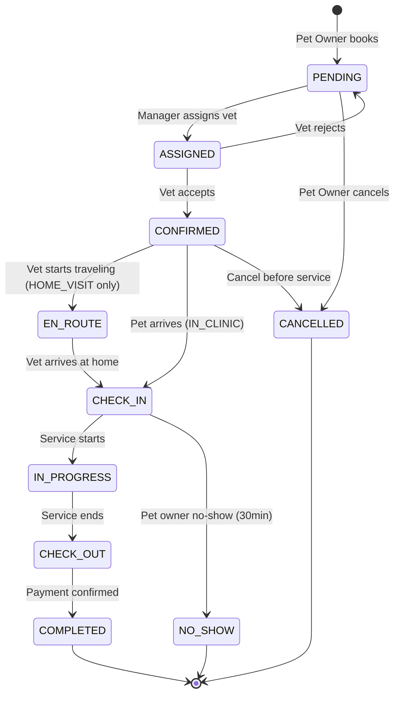

# PETTIES ERD - Entity Relationship Diagram

**Version:** 3.1
**Last Updated:** 2025-12-17
**Standard:** Chen Notation + Crow's Foot (Mermaid)
**Status:** Verified against WBS 13-Sprint scope

---

## 1. Mermaid ERD Code (Crow's Foot Notation)

```mermaid
erDiagram
    %% ========== USER MANAGEMENT ==========
    USER {
        uuid user_id PK
        varchar username UK "NOT NULL"
        varchar email UK "NOT NULL"
        varchar password "NOT NULL"
        varchar phone
        varchar full_name
        varchar avatar
        enum role "NOT NULL: PET_OWNER|VET|CLINIC_OWNER|CLINIC_MANAGER|ADMIN"
        timestamp created_at "NOT NULL"
        timestamp updated_at
        timestamp deleted_at
    }


    %% ========== CLINIC MANAGEMENT ==========
    CLINIC {
        uuid clinic_id PK
        uuid owner_id FK "NOT NULL"
        varchar name "NOT NULL"
        text description
        varchar address "NOT NULL"
        varchar phone "NOT NULL"
        varchar email
        decimal latitude
        decimal longitude
        varchar license_number
        varchar license_document
        json operating_hours
        enum status "NOT NULL: PENDING|APPROVED|REJECTED|SUSPENDED"
        text rejection_reason
        decimal rating_avg
        int rating_count
        timestamp approved_at
        timestamp created_at "NOT NULL"
        timestamp updated_at
        timestamp deleted_at
    }

    CLINIC_STAFF {
        uuid staff_id PK
        uuid clinic_id FK "NOT NULL"
        uuid user_id FK "NOT NULL"
        enum role "NOT NULL: VET|CLINIC_MANAGER"
        varchar specialization
        varchar license_number
        varchar license_document
        enum status "NOT NULL: ACTIVE|INACTIVE"
        timestamp joined_at "NOT NULL"
        timestamp left_at
        timestamp created_at "NOT NULL"
        timestamp updated_at
    }

    CLINIC_IMAGE {
        uuid image_id PK
        uuid clinic_id FK "NOT NULL"
        varchar image_url "NOT NULL"
        varchar caption
        int display_order "DEFAULT 0"
        boolean is_primary "DEFAULT FALSE"
        timestamp created_at "NOT NULL"
    }

    SERVICE {
        uuid service_id PK
        uuid clinic_id FK "NOT NULL"
        varchar name "NOT NULL"
        text description
        decimal base_price "NOT NULL"
        int duration_minutes "NOT NULL"
        int slots_required "NOT NULL DEFAULT 1"
        boolean supports_home_visit "DEFAULT FALSE"
        decimal price_per_km
        boolean is_active "DEFAULT TRUE"
        timestamp created_at "NOT NULL"
        timestamp updated_at
        timestamp deleted_at
    }

    %% ========== PET MANAGEMENT ==========
    PET {
        uuid pet_id PK
        uuid owner_id FK "NOT NULL"
        varchar name "NOT NULL"
        enum species "NOT NULL: DOG|CAT|BIRD|RABBIT|HAMSTER|FISH|OTHER"
        varchar breed
        date birth_date
        enum gender "MALE|FEMALE|UNKNOWN"
        decimal weight_kg
        varchar color
        varchar microchip_number
        text special_notes
        varchar avatar
        boolean is_neutered "DEFAULT FALSE"
        timestamp created_at "NOT NULL"
        timestamp updated_at
        timestamp deleted_at
    }

    %% ========== SCHEDULING ==========
    VET_SHIFT {
        uuid shift_id PK
        uuid vet_id FK "NOT NULL"
        uuid clinic_id FK "NOT NULL"
        date work_date "NOT NULL"
        time start_time "NOT NULL"
        time end_time "NOT NULL"
        time break_start
        time break_end
        int slot_duration_minutes "DEFAULT 30"
        enum status "NOT NULL: SCHEDULED|COMPLETED|CANCELLED"
        timestamp created_at "NOT NULL"
        timestamp updated_at
    }

    SLOT {
        uuid slot_id PK
        uuid shift_id FK "NOT NULL"
        int slot_number "NOT NULL"
        time start_time "NOT NULL"
        time end_time "NOT NULL"
        enum status "NOT NULL: AVAILABLE|BOOKED|BLOCKED"
        uuid booking_id FK
        timestamp created_at "NOT NULL"
        timestamp updated_at
    }

    %% ========== BOOKING ==========
    BOOKING {
        uuid booking_id PK
        varchar booking_code UK
        uuid pet_id FK "NOT NULL"
        uuid pet_owner_id FK "NOT NULL"
        uuid clinic_id FK "NOT NULL"
        uuid service_id FK "NOT NULL"
        uuid assigned_vet_id FK
        uuid assigned_by_id FK
        date booking_date "NOT NULL"
        time booking_time "NOT NULL"
        enum appointment_type "NOT NULL: IN_CLINIC|HOME_VISIT"
        varchar home_address
        decimal home_lat
        decimal home_lng
        decimal distance_km
        decimal base_price "NOT NULL"
        decimal distance_fee "DEFAULT 0"
        decimal total_price "NOT NULL"
        enum status "NOT NULL: PENDING|ASSIGNED|CONFIRMED|EN_ROUTE|CHECK_IN|IN_PROGRESS|CHECK_OUT|COMPLETED|CANCELLED|NO_SHOW"
        text pet_owner_notes
        text rejection_reason
        timestamp assigned_at
        timestamp confirmed_at
        timestamp en_route_at
        timestamp check_in_at
        timestamp check_out_at
        timestamp completed_at
        timestamp cancelled_at
        varchar cancelled_by
        timestamp created_at "NOT NULL"
        timestamp updated_at
    }

    %% ========== PAYMENT ==========
    PAYMENT {
        uuid payment_id PK
        uuid booking_id FK "NOT NULL"
        varchar transaction_id UK
        varchar stripe_payment_intent_id
        decimal amount "NOT NULL"
        decimal platform_fee
        decimal clinic_revenue
        decimal stripe_fee
        enum payment_method "NOT NULL: ONLINE|CASH"
        enum status "NOT NULL: PENDING|PAID|REFUNDED|FAILED"
        timestamp paid_at
        timestamp refunded_at
        text refund_reason
        timestamp created_at "NOT NULL"
        timestamp updated_at
    }

    %% ========== EMR ==========
    EMR {
        uuid emr_id PK
        uuid booking_id FK "NOT NULL"
        uuid pet_id FK "NOT NULL"
        uuid vet_id FK "NOT NULL"
        uuid clinic_id FK "NOT NULL"
        text chief_complaint
        text history
        text physical_examination
        text diagnosis
        text treatment_plan
        text notes
        decimal weight_kg
        decimal temperature_c
        int heart_rate_bpm
        int respiratory_rate
        timestamp examination_date "NOT NULL"
        timestamp created_at "NOT NULL"
        timestamp updated_at
    }

    PRESCRIPTION {
        uuid prescription_id PK
        uuid emr_id FK "NOT NULL"
        varchar medicine_name "NOT NULL"
        varchar dosage "NOT NULL"
        varchar frequency "NOT NULL"
        int duration_days
        text instructions
        int quantity
        varchar unit
        timestamp created_at "NOT NULL"
        timestamp updated_at
    }

    %% ========== VACCINATION ==========
    VACCINATION {
        uuid vaccination_id PK
        uuid pet_id FK "NOT NULL"
        uuid administered_by_id FK "NOT NULL"
        uuid clinic_id FK "NOT NULL"
        uuid booking_id FK
        varchar vaccine_name "NOT NULL"
        varchar batch_number
        varchar manufacturer
        date vaccination_date "NOT NULL"
        date next_due_date
        text notes
        timestamp created_at "NOT NULL"
        timestamp updated_at
    }

    %% ========== REVIEW ==========
    REVIEW {
        uuid review_id PK
        uuid booking_id FK "NOT NULL"
        uuid reviewer_id FK "NOT NULL"
        uuid vet_id FK
        uuid clinic_id FK
        enum review_type "NOT NULL: VET|CLINIC"
        int rating "NOT NULL CHECK 1-5"
        text comment
        boolean is_anonymous "DEFAULT FALSE"
        timestamp reviewed_at "NOT NULL"
        timestamp created_at "NOT NULL"
        timestamp updated_at
    }

    %% ========== NOTIFICATION ==========
    NOTIFICATION {
        uuid notification_id PK
        uuid user_id FK "NOT NULL"
        enum type "NOT NULL"
        varchar title "NOT NULL"
        text content
        json data
        boolean is_read "DEFAULT FALSE"
        timestamp read_at
        timestamp sent_at
        timestamp created_at "NOT NULL"
    }

    %% ========== EMERGENCY (SOS) ==========
    EMERGENCY_REQUEST {
        uuid request_id PK
        uuid pet_owner_id FK "NOT NULL"
        uuid pet_id FK
        uuid clinic_id FK
        decimal latitude "NOT NULL"
        decimal longitude "NOT NULL"
        varchar address
        text description
        enum status "NOT NULL: PENDING|CONTACTED|RESOLVED|CANCELLED"
        varchar contact_phone
        timestamp contacted_at
        timestamp resolved_at
        timestamp created_at "NOT NULL"
        timestamp updated_at
    }

    %% ========== AI AGENT MANAGEMENT ==========
    AGENT_CONFIG {
        uuid agent_id PK
        varchar agent_name UK "NOT NULL"
        enum agent_type "NOT NULL: MAIN|BOOKING|MEDICAL|RESEARCH"
        text system_prompt
        json model_params
        boolean is_enabled "DEFAULT TRUE"
        int version "DEFAULT 1"
        timestamp created_at "NOT NULL"
        timestamp updated_at
    }

    AGENT_TOOL {
        uuid tool_id PK
        varchar tool_name UK "NOT NULL"
        text description "NOT NULL"
        json request_schema
        json response_schema
        varchar function_path "NOT NULL"
        boolean is_enabled "DEFAULT TRUE"
        timestamp created_at "NOT NULL"
        timestamp updated_at
    }

    AGENT_TOOL_ASSIGNMENT {
        uuid assignment_id PK
        uuid agent_id FK "NOT NULL"
        uuid tool_id FK "NOT NULL"
        boolean is_enabled "DEFAULT TRUE"
        timestamp created_at "NOT NULL"
    }

    ROUTING_EXAMPLE {
        uuid example_id PK
        text user_query "NOT NULL"
        uuid target_agent_id FK "NOT NULL"
        varchar language "DEFAULT 'vi'"
        json embedding_vector
        timestamp created_at "NOT NULL"
        timestamp updated_at
    }

    KNOWLEDGE_DOCUMENT {
        uuid document_id PK
        varchar filename "NOT NULL"
        varchar file_url "NOT NULL"
        enum file_type "NOT NULL: PDF|DOCX|TXT|MD"
        enum indexing_status "NOT NULL: PENDING|PROCESSING|INDEXED|FAILED"
        int chunk_count "DEFAULT 0"
        int vector_count "DEFAULT 0"
        text error_message
        timestamp indexed_at
        timestamp created_at "NOT NULL"
        timestamp updated_at
    }

    CHAT_SESSION {
        uuid session_id PK
        uuid user_id FK "NOT NULL"
        varchar session_title
        json context_summary
        boolean is_active "DEFAULT TRUE"
        timestamp last_message_at
        timestamp created_at "NOT NULL"
        timestamp updated_at
    }

    CHAT_MESSAGE {
        uuid message_id PK
        uuid session_id FK "NOT NULL"
        enum role "NOT NULL: USER|ASSISTANT|SYSTEM"
        text content "NOT NULL"
        json tool_calls
        json citations
        uuid routed_to_agent_id FK
        int token_count
        timestamp created_at "NOT NULL"
    }

    SYSTEM_SETTING {
        uuid setting_id PK
        varchar setting_key UK "NOT NULL"
        text setting_value
        boolean is_encrypted "DEFAULT FALSE"
        text description
        timestamp created_at "NOT NULL"
        timestamp updated_at
    }

    %% ========== RELATIONSHIPS ==========
    USER ||--o{ PET : "owns"
    USER ||--o{ CLINIC : "owns"
    USER ||--o{ ACTIVATION_TOKEN : "has"
    USER ||--o{ CLINIC_STAFF : "works_as"
    USER ||--o{ VET_SHIFT : "works"
    USER ||--o{ BOOKING : "creates"
    USER ||--o{ BOOKING : "assigned_to"
    USER ||--o{ EMR : "creates"
    USER ||--o{ VACCINATION : "administers"
    USER ||--o{ REVIEW : "writes"
    USER ||--o{ NOTIFICATION : "receives"
    USER ||--o{ EMERGENCY_REQUEST : "creates"
    USER ||--o{ CHAT_SESSION : "has"

    CLINIC ||--o{ CLINIC_STAFF : "employs"
    CLINIC ||--o{ CLINIC_IMAGE : "has"
    CLINIC ||--o{ SERVICE : "offers"
    CLINIC ||--o{ VET_SHIFT : "schedules"
    CLINIC ||--o{ BOOKING : "receives"
    CLINIC ||--o{ EMR : "records"
    CLINIC ||--o{ VACCINATION : "records"
    CLINIC ||--o{ REVIEW : "receives"

    SERVICE ||--o{ BOOKING : "used_in"

    PET ||--o{ BOOKING : "has"
    PET ||--o{ EMR : "has"
    PET ||--o{ VACCINATION : "receives"
    PET ||--o{ EMERGENCY_REQUEST : "involved_in"

    VET_SHIFT ||--|{ SLOT : "contains"

    SLOT }o--|| BOOKING : "reserved_by"

    BOOKING ||--|| PAYMENT : "has"
    BOOKING ||--o| EMR : "generates"
    BOOKING ||--o{ REVIEW : "has"
    BOOKING ||--o| VACCINATION : "includes"

    EMR ||--o{ PRESCRIPTION : "contains"

    AGENT_CONFIG ||--o{ AGENT_TOOL_ASSIGNMENT : "has"
    AGENT_CONFIG ||--o{ ROUTING_EXAMPLE : "target_of"
    AGENT_TOOL ||--o{ AGENT_TOOL_ASSIGNMENT : "assigned_via"

    CHAT_SESSION ||--o{ CHAT_MESSAGE : "contains"
```



---

## 2. Chen Notation Legend

| Symbol | Meaning |
|--------|---------|
| Rectangle | Strong Entity |
| Double Rectangle | Weak Entity |
| Oval | Attribute |
| Underline in Oval | Primary Key (PK) |
| Dashed Underline | Partial Key |
| Double Oval | Multi-valued Attribute |
| Diamond | Relationship |
| Double Diamond | Identifying Relationship |
| 1, N, M | Cardinality |
| Thick line | Total Participation (mandatory) |
| Thin line | Partial Participation (optional) |

---

## 3. Entity Specifications

### 3.1 USER

| Attribute | Type | Constraints | Description |
|-----------|------|-------------|-------------|
| **user_id** | UUID | PK | Primary identifier |
| username | VARCHAR(50) | UK, NOT NULL | Unique login name |
| email | VARCHAR(100) | UK, NOT NULL | Unique email |
| password | VARCHAR(255) | NOT NULL | Hashed password |
| phone | VARCHAR(20) | NULLABLE | Phone number |
| full_name | VARCHAR(100) | NULLABLE | Display name |
| avatar | VARCHAR(500) | NULLABLE | Avatar URL |
| role | ENUM | NOT NULL | PET_OWNER, VET, CLINIC_OWNER, CLINIC_MANAGER, ADMIN |
| created_at | TIMESTAMP | NOT NULL | Creation time |
| updated_at | TIMESTAMP | NULLABLE | Last update time |
| deleted_at | TIMESTAMP | NULLABLE | Soft delete time |

### 3.2 ACTIVATION_TOKEN (NEW)

| Attribute | Type | Constraints | Description |
|-----------|------|-------------|-------------|
| **token_id** | UUID | PK | Primary identifier |
| user_id | UUID | FK -> USER, NOT NULL | User reference |
| token | VARCHAR(255) | UK, NOT NULL | Unique token string |
| token_type | ENUM | NOT NULL | ACCOUNT_ACTIVATION, PASSWORD_RESET |
| expires_at | TIMESTAMP | NOT NULL | Token expiration (72h for activation) |
| is_used | BOOLEAN | DEFAULT FALSE | Whether token was used |
| used_at | TIMESTAMP | NULLABLE | When token was used |
| created_at | TIMESTAMP | NOT NULL | Creation time |

### 3.3 CLINIC

| Attribute | Type | Constraints | Description |
|-----------|------|-------------|-------------|
| **clinic_id** | UUID | PK | Primary identifier |
| owner_id | UUID | FK -> USER, NOT NULL | Clinic owner |
| name | VARCHAR(200) | NOT NULL | Clinic name |
| description | TEXT | NULLABLE | Description |
| address | VARCHAR(500) | NOT NULL | Full address |
| phone | VARCHAR(20) | NOT NULL | Contact phone |
| email | VARCHAR(100) | NULLABLE | Contact email |
| latitude | DECIMAL(10,8) | NULLABLE | GPS latitude |
| longitude | DECIMAL(11,8) | NULLABLE | GPS longitude |
| license_number | VARCHAR(50) | NULLABLE | Business license |
| license_document | VARCHAR(500) | NULLABLE | License doc URL |
| operating_hours | JSON | NULLABLE | Weekly schedule |
| status | ENUM | NOT NULL, DEFAULT 'PENDING' | PENDING, APPROVED, REJECTED, SUSPENDED |
| rejection_reason | TEXT | NULLABLE | If rejected |
| rating_avg | DECIMAL(2,1) | DEFAULT 0 | Average rating 1-5 |
| rating_count | INTEGER | DEFAULT 0 | Total ratings |
| approved_at | TIMESTAMP | NULLABLE | Approval time |
| created_at | TIMESTAMP | NOT NULL | Creation time |
| updated_at | TIMESTAMP | NULLABLE | Last update |
| deleted_at | TIMESTAMP | NULLABLE | Soft delete |

### 3.4 CLINIC_STAFF (NEW)

| Attribute | Type | Constraints | Description |
|-----------|------|-------------|-------------|
| **staff_id** | UUID | PK | Primary identifier |
| clinic_id | UUID | FK -> CLINIC, NOT NULL | Clinic reference |
| user_id | UUID | FK -> USER, NOT NULL | Staff user |
| role | ENUM | NOT NULL | VET, CLINIC_MANAGER |
| specialization | VARCHAR(100) | NULLABLE | Vet specialty (Noi khoa, Ngoai khoa, etc.) |
| license_number | VARCHAR(50) | NULLABLE | Professional license |
| license_document | VARCHAR(500) | NULLABLE | License doc URL |
| status | ENUM | NOT NULL, DEFAULT 'ACTIVE' | ACTIVE, INACTIVE |
| joined_at | TIMESTAMP | NOT NULL | When joined clinic |
| left_at | TIMESTAMP | NULLABLE | When left clinic |
| created_at | TIMESTAMP | NOT NULL | Creation time |
| updated_at | TIMESTAMP | NULLABLE | Last update |

**Unique Constraint:** (clinic_id, user_id) - One user can only be staff at one clinic

### 3.5 CLINIC_IMAGE (NEW)

| Attribute | Type | Constraints | Description |
|-----------|------|-------------|-------------|
| **image_id** | UUID | PK | Primary identifier |
| clinic_id | UUID | FK -> CLINIC, NOT NULL | Clinic reference |
| image_url | VARCHAR(500) | NOT NULL | Image URL |
| caption | VARCHAR(200) | NULLABLE | Image caption |
| display_order | INTEGER | DEFAULT 0 | Display order |
| is_primary | BOOLEAN | DEFAULT FALSE | Primary/cover image |
| created_at | TIMESTAMP | NOT NULL | Creation time |

### 3.6 SERVICE

| Attribute | Type | Constraints | Description |
|-----------|------|-------------|-------------|
| **service_id** | UUID | PK | Primary identifier |
| clinic_id | UUID | FK -> CLINIC, NOT NULL | Parent clinic |
| name | VARCHAR(200) | NOT NULL | Service name |
| description | TEXT | NULLABLE | Service description |
| base_price | DECIMAL(12,2) | NOT NULL | Base price (VND) |
| duration_minutes | INTEGER | NOT NULL | Estimated duration |
| slots_required | INTEGER | NOT NULL, DEFAULT 1 | Number of 30-min slots |
| supports_home_visit | BOOLEAN | DEFAULT FALSE | Home visit available |
| price_per_km | DECIMAL(10,2) | NULLABLE | Price per km |
| is_active | BOOLEAN | DEFAULT TRUE | Active status |
| created_at | TIMESTAMP | NOT NULL | Creation time |
| updated_at | TIMESTAMP | NULLABLE | Last update |
| deleted_at | TIMESTAMP | NULLABLE | Soft delete |

### 3.7 PET

| Attribute | Type | Constraints | Description |
|-----------|------|-------------|-------------|
| **pet_id** | UUID | PK | Primary identifier |
| owner_id | UUID | FK -> USER, NOT NULL | Pet owner |
| name | VARCHAR(100) | NOT NULL | Pet name |
| species | ENUM | NOT NULL | DOG, CAT, BIRD, RABBIT, HAMSTER, FISH, OTHER |
| breed | VARCHAR(100) | NULLABLE | Pet breed |
| birth_date | DATE | NULLABLE | Birth date |
| gender | ENUM | NULLABLE | MALE, FEMALE, UNKNOWN |
| weight_kg | DECIMAL(5,2) | NULLABLE | Weight in kg |
| color | VARCHAR(50) | NULLABLE | Color/markings |
| microchip_number | VARCHAR(50) | NULLABLE | Microchip ID |
| special_notes | TEXT | NULLABLE | Special care notes |
| avatar | VARCHAR(500) | NULLABLE | Pet photo URL |
| is_neutered | BOOLEAN | DEFAULT FALSE | Neutered status |
| created_at | TIMESTAMP | NOT NULL | Creation time |
| updated_at | TIMESTAMP | NULLABLE | Last update |
| deleted_at | TIMESTAMP | NULLABLE | Soft delete |

### 3.8 VET_SHIFT

| Attribute | Type | Constraints | Description |
|-----------|------|-------------|-------------|
| **shift_id** | UUID | PK | Primary identifier |
| vet_id | UUID | FK -> USER, NOT NULL | Vet reference |
| clinic_id | UUID | FK -> CLINIC, NOT NULL | Clinic reference |
| work_date | DATE | NOT NULL | Working date |
| start_time | TIME | NOT NULL | Shift start |
| end_time | TIME | NOT NULL | Shift end |
| break_start | TIME | NULLABLE | Break start |
| break_end | TIME | NULLABLE | Break end |
| slot_duration_minutes | INTEGER | DEFAULT 30 | Slot duration |
| status | ENUM | NOT NULL, DEFAULT 'SCHEDULED' | SCHEDULED, COMPLETED, CANCELLED |
| created_at | TIMESTAMP | NOT NULL | Creation time |
| updated_at | TIMESTAMP | NULLABLE | Last update |

**Unique Constraint:** (vet_id, clinic_id, work_date) - One shift per vet per day per clinic

### 3.9 SLOT (Weak Entity)

| Attribute | Type | Constraints | Description |
|-----------|------|-------------|-------------|
| **slot_id** | UUID | PK | Primary identifier |
| shift_id | UUID | FK -> VET_SHIFT, NOT NULL | Parent shift |
| slot_number | INTEGER | NOT NULL, Partial Key | Sequential number (1, 2, 3...) |
| start_time | TIME | NOT NULL | Slot start |
| end_time | TIME | NOT NULL | Slot end |
| status | ENUM | NOT NULL, DEFAULT 'AVAILABLE' | AVAILABLE, BOOKED, BLOCKED |
| booking_id | UUID | FK -> BOOKING, NULLABLE | If booked |
| created_at | TIMESTAMP | NOT NULL | Creation time |
| updated_at | TIMESTAMP | NULLABLE | Last update |

### 3.10 BOOKING

| Attribute | Type | Constraints | Description |
|-----------|------|-------------|-------------|
| **booking_id** | UUID | PK | Primary identifier |
| booking_code | VARCHAR(20) | UK | Human-readable code |
| pet_id | UUID | FK -> PET, NOT NULL | Pet reference |
| pet_owner_id | UUID | FK -> USER, NOT NULL | Pet owner |
| clinic_id | UUID | FK -> CLINIC, NOT NULL | Clinic reference |
| service_id | UUID | FK -> SERVICE, NOT NULL | Service reference |
| assigned_vet_id | UUID | FK -> USER, NULLABLE | Assigned vet |
| assigned_by_id | UUID | FK -> USER, NULLABLE | Manager who assigned |
| booking_date | DATE | NOT NULL | Appointment date |
| booking_time | TIME | NOT NULL | Start time |
| appointment_type | ENUM | NOT NULL | IN_CLINIC, HOME_VISIT |
| home_address | VARCHAR(500) | NULLABLE | Home visit address |
| home_lat | DECIMAL(10,8) | NULLABLE | Latitude |
| home_lng | DECIMAL(11,8) | NULLABLE | Longitude |
| distance_km | DECIMAL(6,2) | NULLABLE | Distance |
| base_price | DECIMAL(12,2) | NOT NULL | Base price |
| distance_fee | DECIMAL(12,2) | DEFAULT 0 | Distance fee |
| total_price | DECIMAL(12,2) | NOT NULL | Total price |
| status | ENUM | NOT NULL, DEFAULT 'PENDING' | See status flow below |
| pet_owner_notes | TEXT | NULLABLE | Notes |
| rejection_reason | TEXT | NULLABLE | If rejected |
| assigned_at | TIMESTAMP | NULLABLE | Assignment time |
| confirmed_at | TIMESTAMP | NULLABLE | Confirmation time |
| en_route_at | TIMESTAMP | NULLABLE | Vet started traveling (HOME_VISIT only) |
| check_in_at | TIMESTAMP | NULLABLE | Check-in time |
| check_out_at | TIMESTAMP | NULLABLE | Check-out time |
| completed_at | TIMESTAMP | NULLABLE | Completion time |
| cancelled_at | TIMESTAMP | NULLABLE | Cancellation time |
| cancelled_by | VARCHAR(50) | NULLABLE | Who cancelled |
| created_at | TIMESTAMP | NOT NULL | Creation time |
| updated_at | TIMESTAMP | NULLABLE | Last update |

**Booking Status Flow (from BUSINESS_WORKFLOW_BPMN.md):**



**Status Descriptions:**
| Status | Description | Actor |
|--------|-------------|-------|
| PENDING | Booking created, waiting for vet assignment | System |
| ASSIGNED | Manager assigned vet, waiting for acceptance | Manager |
| CONFIRMED | Vet accepted the booking | Vet |
| EN_ROUTE | Vet traveling to home (HOME_VISIT only, live tracking) | Vet |
| CHECK_IN | Pet arrived / Vet arrived at home | Vet |
| IN_PROGRESS | Service in progress | Vet |
| CHECK_OUT | Service completed, waiting for payment (if CASH) | Vet |
| COMPLETED | Booking fully completed | System |
| CANCELLED | Booking cancelled | Pet Owner/Manager |
| NO_SHOW | Pet owner didn't show up (30min timeout) | Vet/System |

**Note:** `slots_used` is derived from `SERVICE.slots_required` (not stored in BOOKING to avoid redundancy).

### 3.11 PAYMENT

| Attribute | Type | Constraints | Description |
|-----------|------|-------------|-------------|
| **payment_id** | UUID | PK | Primary identifier |
| booking_id | UUID | FK -> BOOKING, NOT NULL | Booking reference |
| transaction_id | VARCHAR(100) | UK | Internal transaction ID |
| stripe_payment_intent_id | VARCHAR(100) | NULLABLE | Stripe ID |
| amount | DECIMAL(12,2) | NOT NULL | Total amount |
| platform_fee | DECIMAL(12,2) | NULLABLE | Platform fee (15%) |
| clinic_revenue | DECIMAL(12,2) | NULLABLE | Clinic revenue (85%) |
| stripe_fee | DECIMAL(12,2) | NULLABLE | Stripe fee |
| payment_method | ENUM | NOT NULL | ONLINE, CASH |
| status | ENUM | NOT NULL, DEFAULT 'PENDING' | PENDING, PAID, REFUNDED, FAILED |
| paid_at | TIMESTAMP | NULLABLE | Payment time |
| refunded_at | TIMESTAMP | NULLABLE | Refund time |
| refund_reason | TEXT | NULLABLE | Refund reason |
| created_at | TIMESTAMP | NOT NULL | Creation time |
| updated_at | TIMESTAMP | NULLABLE | Last update |

### 3.12 EMR

| Attribute | Type | Constraints | Description |
|-----------|------|-------------|-------------|
| **emr_id** | UUID | PK | Primary identifier |
| booking_id | UUID | FK -> BOOKING, NOT NULL | Booking reference |
| pet_id | UUID | FK -> PET, NOT NULL | Pet reference |
| vet_id | UUID | FK -> USER, NOT NULL | Vet who created |
| clinic_id | UUID | FK -> CLINIC, NOT NULL | Clinic reference |
| chief_complaint | TEXT | NULLABLE | Main complaint |
| history | TEXT | NULLABLE | Medical history |
| physical_examination | TEXT | NULLABLE | Exam findings |
| diagnosis | TEXT | NULLABLE | Diagnosis |
| treatment_plan | TEXT | NULLABLE | Treatment plan |
| notes | TEXT | NULLABLE | Additional notes |
| weight_kg | DECIMAL(5,2) | NULLABLE | Weight |
| temperature_c | DECIMAL(4,2) | NULLABLE | Temperature |
| heart_rate_bpm | INTEGER | NULLABLE | Heart rate |
| respiratory_rate | INTEGER | NULLABLE | Respiratory rate |
| examination_date | TIMESTAMP | NOT NULL | Exam date |
| created_at | TIMESTAMP | NOT NULL | Creation time |
| updated_at | TIMESTAMP | NULLABLE | Last update |

### 3.13 PRESCRIPTION (Weak Entity)

| Attribute | Type | Constraints | Description |
|-----------|------|-------------|-------------|
| **prescription_id** | UUID | PK | Primary identifier |
| emr_id | UUID | FK -> EMR, NOT NULL | Parent EMR |
| medicine_name | VARCHAR(200) | NOT NULL | Medicine name |
| dosage | VARCHAR(100) | NOT NULL | Dosage |
| frequency | VARCHAR(100) | NOT NULL | Frequency |
| duration_days | INTEGER | NULLABLE | Duration |
| instructions | TEXT | NULLABLE | Instructions |
| quantity | INTEGER | NULLABLE | Quantity |
| unit | VARCHAR(50) | NULLABLE | Unit |
| created_at | TIMESTAMP | NOT NULL | Creation time |
| updated_at | TIMESTAMP | NULLABLE | Last update |

### 3.14 VACCINATION

| Attribute | Type | Constraints | Description |
|-----------|------|-------------|-------------|
| **vaccination_id** | UUID | PK | Primary identifier |
| pet_id | UUID | FK -> PET, NOT NULL | Pet reference |
| administered_by_id | UUID | FK -> USER, NOT NULL | Vet who administered |
| clinic_id | UUID | FK -> CLINIC, NOT NULL | Clinic reference |
| booking_id | UUID | FK -> BOOKING, NULLABLE | Related booking |
| vaccine_name | VARCHAR(200) | NOT NULL | Vaccine name |
| batch_number | VARCHAR(100) | NULLABLE | Batch number |
| manufacturer | VARCHAR(200) | NULLABLE | Manufacturer |
| vaccination_date | DATE | NOT NULL | Date administered |
| next_due_date | DATE | NULLABLE | Next due date |
| notes | TEXT | NULLABLE | Notes |
| created_at | TIMESTAMP | NOT NULL | Creation time |
| updated_at | TIMESTAMP | NULLABLE | Last update |

### 3.15 REVIEW

| Attribute | Type | Constraints | Description |
|-----------|------|-------------|-------------|
| **review_id** | UUID | PK | Primary identifier |
| booking_id | UUID | FK -> BOOKING, NOT NULL | Booking reference |
| reviewer_id | UUID | FK -> USER, NOT NULL | Reviewer |
| vet_id | UUID | FK -> USER, NULLABLE | Reviewed vet |
| clinic_id | UUID | FK -> CLINIC, NULLABLE | Reviewed clinic |
| review_type | ENUM | NOT NULL | VET, CLINIC |
| rating | INTEGER | NOT NULL, CHECK (1-5) | Rating 1-5 |
| comment | TEXT | NULLABLE | Comment |
| is_anonymous | BOOLEAN | DEFAULT FALSE | Anonymous |
| reviewed_at | TIMESTAMP | NOT NULL | Review time |
| created_at | TIMESTAMP | NOT NULL | Creation time |
| updated_at | TIMESTAMP | NULLABLE | Last update |

### 3.16 NOTIFICATION

| Attribute | Type | Constraints | Description |
|-----------|------|-------------|-------------|
| **notification_id** | UUID | PK | Primary identifier |
| user_id | UUID | FK -> USER, NOT NULL | Recipient |
| type | ENUM | NOT NULL | See types below |
| title | VARCHAR(200) | NOT NULL | Title |
| content | TEXT | NULLABLE | Content |
| data | JSON | NULLABLE | Data payload |
| is_read | BOOLEAN | DEFAULT FALSE | Read status |
| read_at | TIMESTAMP | NULLABLE | Read time |
| sent_at | TIMESTAMP | NULLABLE | Sent time |
| created_at | TIMESTAMP | NOT NULL | Creation time |

**Notification Types:** BOOKING_CREATED, BOOKING_ASSIGNED, BOOKING_CONFIRMED, BOOKING_REMINDER, VACCINATION_REMINDER, PAYMENT_SUCCESS, REVIEW_REQUEST

### 3.17 EMERGENCY_REQUEST (NEW)

| Attribute | Type | Constraints | Description |
|-----------|------|-------------|-------------|
| **request_id** | UUID | PK | Primary identifier |
| pet_owner_id | UUID | FK -> USER, NOT NULL | Requester |
| pet_id | UUID | FK -> PET, NULLABLE | Pet involved |
| clinic_id | UUID | FK -> CLINIC, NULLABLE | Contacted clinic |
| latitude | DECIMAL(10,8) | NOT NULL | User location |
| longitude | DECIMAL(11,8) | NOT NULL | User location |
| address | VARCHAR(500) | NULLABLE | Address |
| description | TEXT | NULLABLE | Emergency description |
| status | ENUM | NOT NULL, DEFAULT 'PENDING' | PENDING, CONTACTED, RESOLVED, CANCELLED |
| contact_phone | VARCHAR(20) | NULLABLE | Emergency contact |
| contacted_at | TIMESTAMP | NULLABLE | When clinic contacted |
| resolved_at | TIMESTAMP | NULLABLE | Resolution time |
| created_at | TIMESTAMP | NOT NULL | Creation time |
| updated_at | TIMESTAMP | NULLABLE | Last update |

### 3.18 AGENT_CONFIG (NEW - AI)

| Attribute | Type | Constraints | Description |
|-----------|------|-------------|-------------|
| **agent_id** | UUID | PK | Primary identifier |
| agent_name | VARCHAR(100) | UK, NOT NULL | Agent name |
| agent_type | ENUM | NOT NULL | MAIN, BOOKING, MEDICAL, RESEARCH |
| system_prompt | TEXT | NULLABLE | System message |
| model_params | JSON | NULLABLE | {temperature, max_tokens, top_p} |
| is_enabled | BOOLEAN | DEFAULT TRUE | Active status |
| version | INTEGER | DEFAULT 1 | Prompt version |
| created_at | TIMESTAMP | NOT NULL | Creation time |
| updated_at | TIMESTAMP | NULLABLE | Last update |

### 3.19 AGENT_TOOL (NEW - AI)

| Attribute | Type | Constraints | Description |
|-----------|------|-------------|-------------|
| **tool_id** | UUID | PK | Primary identifier |
| tool_name | VARCHAR(100) | UK, NOT NULL | Tool function name |
| description | TEXT | NOT NULL | Semantic description |
| request_schema | JSON | NULLABLE | Input schema |
| response_schema | JSON | NULLABLE | Output schema |
| function_path | VARCHAR(200) | NOT NULL | Python path |
| is_enabled | BOOLEAN | DEFAULT TRUE | Active status |
| created_at | TIMESTAMP | NOT NULL | Creation time |
| updated_at | TIMESTAMP | NULLABLE | Last update |

### 3.20 AGENT_TOOL_ASSIGNMENT (NEW - AI)

| Attribute | Type | Constraints | Description |
|-----------|------|-------------|-------------|
| **assignment_id** | UUID | PK | Primary identifier |
| agent_id | UUID | FK -> AGENT_CONFIG, NOT NULL | Agent |
| tool_id | UUID | FK -> AGENT_TOOL, NOT NULL | Tool |
| is_enabled | BOOLEAN | DEFAULT TRUE | Enabled for agent |
| created_at | TIMESTAMP | NOT NULL | Creation time |

**Unique Constraint:** (agent_id, tool_id)

### 3.21 ROUTING_EXAMPLE (NEW - AI)

| Attribute | Type | Constraints | Description |
|-----------|------|-------------|-------------|
| **example_id** | UUID | PK | Primary identifier |
| user_query | TEXT | NOT NULL | Example query |
| target_agent_id | UUID | FK -> AGENT_CONFIG, NOT NULL | Target agent |
| language | VARCHAR(10) | DEFAULT 'vi' | Language code |
| embedding_vector | JSON | NULLABLE | Pre-computed vector |
| created_at | TIMESTAMP | NOT NULL | Creation time |
| updated_at | TIMESTAMP | NULLABLE | Last update |

### 3.22 KNOWLEDGE_DOCUMENT (NEW - AI)

| Attribute | Type | Constraints | Description |
|-----------|------|-------------|-------------|
| **document_id** | UUID | PK | Primary identifier |
| filename | VARCHAR(200) | NOT NULL | Original filename |
| file_url | VARCHAR(500) | NOT NULL | Storage URL |
| file_type | ENUM | NOT NULL | PDF, DOCX, TXT, MD |
| indexing_status | ENUM | NOT NULL, DEFAULT 'PENDING' | PENDING, PROCESSING, INDEXED, FAILED |
| chunk_count | INTEGER | DEFAULT 0 | Number of chunks |
| vector_count | INTEGER | DEFAULT 0 | Vectors indexed |
| error_message | TEXT | NULLABLE | Error if failed |
| indexed_at | TIMESTAMP | NULLABLE | Index completion |
| created_at | TIMESTAMP | NOT NULL | Creation time |
| updated_at | TIMESTAMP | NULLABLE | Last update |

### 3.23 CHAT_SESSION (NEW - AI)

| Attribute | Type | Constraints | Description |
|-----------|------|-------------|-------------|
| **session_id** | UUID | PK | Primary identifier |
| user_id | UUID | FK -> USER, NOT NULL | User |
| session_title | VARCHAR(200) | NULLABLE | Auto-generated title |
| context_summary | JSON | NULLABLE | Summarized context |
| is_active | BOOLEAN | DEFAULT TRUE | Active session |
| last_message_at | TIMESTAMP | NULLABLE | Last activity |
| created_at | TIMESTAMP | NOT NULL | Creation time |
| updated_at | TIMESTAMP | NULLABLE | Last update |

### 3.24 CHAT_MESSAGE (NEW - AI)

| Attribute | Type | Constraints | Description |
|-----------|------|-------------|-------------|
| **message_id** | UUID | PK | Primary identifier |
| session_id | UUID | FK -> CHAT_SESSION, NOT NULL | Parent session |
| role | ENUM | NOT NULL | USER, ASSISTANT, SYSTEM |
| content | TEXT | NOT NULL | Message content |
| tool_calls | JSON | NULLABLE | Tool calls made |
| citations | JSON | NULLABLE | RAG/Web sources |
| routed_to_agent_id | UUID | FK -> AGENT_CONFIG, NULLABLE | Which agent handled |
| token_count | INTEGER | NULLABLE | Token usage |
| created_at | TIMESTAMP | NOT NULL | Creation time |

### 3.25 SYSTEM_SETTING (NEW - AI)

| Attribute | Type | Constraints | Description |
|-----------|------|-------------|-------------|
| **setting_id** | UUID | PK | Primary identifier |
| setting_key | VARCHAR(100) | UK, NOT NULL | Setting name |
| setting_value | TEXT | NULLABLE | Setting value |
| is_encrypted | BOOLEAN | DEFAULT FALSE | Encrypted (API keys) |
| description | TEXT | NULLABLE | Description |
| created_at | TIMESTAMP | NOT NULL | Creation time |
| updated_at | TIMESTAMP | NULLABLE | Last update |

**Common Keys:** QDRANT_API_KEY, QDRANT_URL, OLLAMA_API_KEY, OLLAMA_BASE_URL, OLLAMA_MODE (local/cloud), TAVILY_API_KEY, DEFAULT_MODEL

---

## 4. Relationships Table

| # | From | Relationship | To | Cardinality | Participation | FK Location |
|---|------|--------------|-----|-------------|---------------|-------------|
| 1 | USER | **owns** | PET | 1:N | Total:Partial | PET.owner_id |
| 2 | USER | **owns** | CLINIC | 1:0..1 | Partial:Total | CLINIC.owner_id |
| 3 | USER | **has** | ACTIVATION_TOKEN | 1:N | Partial:Total | ACTIVATION_TOKEN.user_id |
| 4 | USER | **works_as** | CLINIC_STAFF | 1:0..1 | Partial:Total | CLINIC_STAFF.user_id |
| 5 | USER (VET) | **works** | VET_SHIFT | 1:N | Total:Total | VET_SHIFT.vet_id |
| 6 | CLINIC | **employs** | CLINIC_STAFF | 1:N | Total:Total | CLINIC_STAFF.clinic_id |
| 7 | CLINIC | **has** | CLINIC_IMAGE | 1:N | Partial:Total | CLINIC_IMAGE.clinic_id |
| 8 | CLINIC | **offers** | SERVICE | 1:N | Total:Total | SERVICE.clinic_id |
| 9 | CLINIC | **schedules** | VET_SHIFT | 1:N | Total:Total | VET_SHIFT.clinic_id |
| 11 | VET_SHIFT | **contains** | SLOT | 1:N | Total:Total | SLOT.shift_id |
| 12 | PET | **has** | BOOKING | 1:N | Partial:Total | BOOKING.pet_id |
| 13 | USER | **creates** | BOOKING | 1:N | Partial:Total | BOOKING.pet_owner_id |
| 14 | CLINIC | **receives** | BOOKING | 1:N | Total:Total | BOOKING.clinic_id |
| 15 | SERVICE | **used_in** | BOOKING | 1:N | Partial:Total | BOOKING.service_id |
| 16 | USER (VET) | **assigned_to** | BOOKING | 1:N | Partial:Partial | BOOKING.assigned_vet_id |
| 17 | SLOT | **reserved_by** | BOOKING | N:1 | Partial:Total | SLOT.booking_id |
| 18 | BOOKING | **has** | PAYMENT | 1:1 | Total:Total | PAYMENT.booking_id |
| 19 | BOOKING | **generates** | EMR | 1:0..1 | Partial:Total | EMR.booking_id |
| 20 | PET | **has** | EMR | 1:N | Partial:Total | EMR.pet_id |
| 23 | USER (VET) | **creates** | EMR | 1:N | Partial:Total | EMR.vet_id |
| 24 | EMR | **contains** | PRESCRIPTION | 1:N | Partial:Total | PRESCRIPTION.emr_id |
| 25 | PET | **receives** | VACCINATION | 1:N | Partial:Partial | VACCINATION.pet_id |
| 26 | USER (VET) | **administers** | VACCINATION | 1:N | Partial:Total | VACCINATION.administered_by_id |
| 27 | BOOKING | **has** | REVIEW | 1:0..2 | Partial:Total | REVIEW.booking_id |
| 28 | USER | **writes** | REVIEW | 1:N | Partial:Total | REVIEW.reviewer_id |
| 29 | USER | **receives** | NOTIFICATION | 1:N | Partial:Total | NOTIFICATION.user_id |
| 30 | USER | **creates** | EMERGENCY_REQUEST | 1:N | Partial:Total | EMERGENCY_REQUEST.pet_owner_id |
| 31 | USER | **has** | CHAT_SESSION | 1:N | Partial:Total | CHAT_SESSION.user_id |
| 33 | CHAT_SESSION | **contains** | CHAT_MESSAGE | 1:N | Total:Total | CHAT_MESSAGE.session_id |
| 34 | AGENT_CONFIG | **has** | AGENT_TOOL_ASSIGNMENT | 1:N | Partial:Total | AGENT_TOOL_ASSIGNMENT.agent_id |
| 35 | AGENT_TOOL | **assigned_via** | AGENT_TOOL_ASSIGNMENT | 1:N | Partial:Total | AGENT_TOOL_ASSIGNMENT.tool_id |
| 36 | AGENT_CONFIG | **target_of** | ROUTING_EXAMPLE | 1:N | Partial:Total | ROUTING_EXAMPLE.target_agent_id |

---

## 5. Cardinality Constraints

| Relationship | Min:Max (Entity1) | Min:Max (Entity2) | Business Rule |
|--------------|-------------------|-------------------|---------------|
| USER owns PET | 0:N | 1:1 | User can have 0-N pets; Pet must have 1 owner |
| USER owns CLINIC | 0:1 | 1:1 | User can own 0-1 clinic; Clinic must have 1 owner |
| CLINIC employs STAFF | 1:N | 1:1 | Clinic must have 1+ staff; Staff belongs to 1 clinic |
| CLINIC offers SERVICE | 1:N | 1:1 | Clinic must have 1+ services; Service belongs to 1 clinic |
| VET_SHIFT contains SLOT | 1:N | 1:1 | Shift has 1+ slots; Slot belongs to 1 shift |
| PET has BOOKING | 0:N | 1:1 | Pet can have 0-N bookings; Booking must have 1 pet |
| BOOKING has PAYMENT | 1:1 | 1:1 | Booking has exactly 1 payment |
| BOOKING generates EMR | 0:1 | 1:1 | Booking may generate 0-1 EMR; EMR must have 1 booking |
| EMR contains PRESCRIPTION | 0:N | 1:1 | EMR can have 0-N prescriptions; Prescription belongs to 1 EMR |
| BOOKING has REVIEW | 0:2 | 1:1 | Booking can have 0-2 reviews (1 VET + 1 CLINIC) |
| AGENT has TOOL_ASSIGNMENT | 0:N | 1:1 | Agent can have 0-N tools assigned |

---

## 6. Recommended Indexes

### Performance-Critical Indexes

```sql
-- User lookups
CREATE INDEX idx_user_email ON users(email);
CREATE INDEX idx_user_status ON users(status);
CREATE INDEX idx_user_role ON users(role);

-- Clinic searches
CREATE INDEX idx_clinic_status ON clinics(status);
CREATE INDEX idx_clinic_location ON clinics(latitude, longitude);
CREATE INDEX idx_clinic_rating ON clinics(rating_avg DESC);

-- Clinic staff lookups
CREATE UNIQUE INDEX idx_clinic_staff_unique ON clinic_staff(clinic_id, user_id);
CREATE INDEX idx_clinic_staff_role ON clinic_staff(clinic_id, role);

-- Booking searches (most queried)
CREATE INDEX idx_booking_date ON bookings(booking_date);
CREATE INDEX idx_booking_clinic_date ON bookings(clinic_id, booking_date);
CREATE INDEX idx_booking_pet_owner ON bookings(pet_owner_id, status);
CREATE INDEX idx_booking_vet ON bookings(assigned_vet_id, booking_date);
CREATE INDEX idx_booking_status ON bookings(status);

-- Slot availability
CREATE INDEX idx_slot_shift_status ON slots(shift_id, status);
CREATE INDEX idx_slot_booking ON slots(booking_id);

-- VET_SHIFT lookups
CREATE UNIQUE INDEX idx_vet_shift_unique ON vet_shifts(vet_id, clinic_id, work_date);
CREATE INDEX idx_vet_shift_date ON vet_shifts(work_date, status);

-- EMR lookups
CREATE INDEX idx_emr_pet ON emrs(pet_id);
CREATE INDEX idx_emr_booking ON emrs(booking_id);

-- Chat history
CREATE INDEX idx_chat_message_session ON chat_messages(session_id, created_at);
CREATE INDEX idx_chat_session_user ON chat_sessions(user_id, is_active);

-- Notification queries
CREATE INDEX idx_notification_user_read ON notifications(user_id, is_read);

-- Emergency request
CREATE INDEX idx_emergency_request_user ON emergency_requests(pet_owner_id, status);
CREATE INDEX idx_emergency_request_location ON emergency_requests(latitude, longitude);
```

---

## 7. Business Process Mapping

This section maps ERD entities to business processes defined in `VET_SCHEDULING_STRATEGY.md` and `BUSINESS_WORKFLOW_BPMN.md`.

### 7.1 BP-001: Clinic Onboarding

| Process Step | ERD Entities | Key Fields |
|--------------|--------------|------------|
| Register Clinic | CLINIC | name, address, license_number |
| Upload Documents | CLINIC | license_document |
| Set Services | SERVICE | name, base_price, slots_required |
| Set Operating Hours | CLINIC | operating_hours (JSON) |
| Admin Approval | CLINIC | status (PENDING->APPROVED), approved_at |
| Create Manager | USER, CLINIC_STAFF | role=CLINIC_MANAGER |
| Account Activation | ACTIVATION_TOKEN | token_type=ACCOUNT_ACTIVATION |

### 7.2 BP-002: Booking Management (Slot-Based)

| Process Step | ERD Entities | Key Fields |
|--------------|--------------|------------|
| Create Shift | VET_SHIFT | work_date, start_time, end_time, break_start/end |
| Generate Slots | SLOT | slot_number, status=AVAILABLE |
| Pet Owner Books | BOOKING | status=PENDING |
| Lock Slots | SLOT | status=BOOKED, booking_id |
| Manager Assigns | BOOKING | assigned_vet_id, status=ASSIGNED |
| Vet Accepts | BOOKING | status=CONFIRMED |
| Vet Rejects | BOOKING | status=PENDING, SLOT.status=AVAILABLE |
| Home Visit Start | BOOKING | status=EN_ROUTE |
| Check-in | BOOKING | status=CHECK_IN |
| Service | BOOKING | status=IN_PROGRESS |
| Check-out | BOOKING | status=CHECK_OUT |
| Complete | BOOKING | status=COMPLETED |

**Slot Rules (from VET_SCHEDULING_STRATEGY.md):**
- slots_required = CEIL(duration_minutes / 30)
- Slots must be CONSECUTIVE (cannot span break time)
- All slots booked/released together

### 7.3 BP-003: Medical Service

| Process Step | ERD Entities | Key Fields |
|--------------|--------------|------------|
| View Pet History | PET, EMR | pet_id, emr_id |
| Examine | EMR | physical_examination, weight_kg, temperature_c |
| Diagnose | EMR | diagnosis, treatment_plan |
| Prescribe | PRESCRIPTION | medicine_name, dosage, frequency |
| Update Vaccination | VACCINATION | vaccine_name, next_due_date |

### 7.4 BP-004: Payment Processing

| Process Step | ERD Entities | Key Fields |
|--------------|--------------|------------|
| Online Payment | PAYMENT | payment_method=ONLINE, status=PAID |
| Cash Payment | PAYMENT | payment_method=CASH, status=PENDING->PAID |
| Revenue Split | PAYMENT | platform_fee (15%), clinic_revenue (85%) |
| Refund | PAYMENT, CANCELLATION_POLICY | status=REFUNDED, refund_percentage |

### 7.5 BP-005: Review & Feedback

| Process Step | ERD Entities | Key Fields |
|--------------|--------------|------------|
| Vet Review | REVIEW | review_type=VET, rating (immediate) |
| Clinic Review | REVIEW | review_type=CLINIC, rating + comment (later) |
| Update Ratings | CLINIC, USER | rating_avg, rating_count |

### 7.6 BP-006: AI Assistance

| Process Step | ERD Entities | Key Fields |
|--------------|--------------|------------|
| User Query | CHAT_SESSION, CHAT_MESSAGE | role=USER |
| Intent Classification | ROUTING_EXAMPLE | target_agent_id |
| Agent Processing | AGENT_CONFIG, AGENT_TOOL_ASSIGNMENT | agent_type, tools |
| RAG Search | KNOWLEDGE_DOCUMENT | indexing_status=INDEXED |
| Response | CHAT_MESSAGE | role=ASSISTANT, citations |

### 7.7 BP-007: SOS Emergency

| Process Step | ERD Entities | Key Fields |
|--------------|--------------|------------|
| Send SOS | EMERGENCY_REQUEST | latitude, longitude, status=PENDING |
| Find Clinics | CLINIC | latitude, longitude, status=APPROVED |
| Contact | EMERGENCY_REQUEST | status=CONTACTED |
| Resolve | EMERGENCY_REQUEST | status=RESOLVED |

---

## 8. Entity Count Summary

| Category | Entity | New/Existing | WBS Reference |
|----------|--------|--------------|---------------|
| **User Management** | USER | Existing | Sprint 1 |
| | ACTIVATION_TOKEN | NEW | Sprint 1 (Password Reset) |
| **Clinic Management** | CLINIC | Existing | Sprint 2 |
| | CLINIC_STAFF | NEW | Sprint 3 (Vet Management) |
| | CLINIC_IMAGE | NEW | Sprint 2 (Clinic photos) |
| | SERVICE | Existing | Sprint 2 |
| **Pet Management** | PET | Existing | Sprint 2 |
| **Scheduling** | VET_SHIFT | Existing | Sprint 3 |
| | SLOT | Existing | Sprint 3 |
| **Booking** | BOOKING | Existing | Sprint 4-6 |
| **Payment** | PAYMENT | Existing | Sprint 8 |
| **Medical** | EMR | Existing | Sprint 7 |
| | PRESCRIPTION | Existing | Sprint 7 |
| | VACCINATION | Existing | Sprint 7 |
| **Review** | REVIEW | Existing | Sprint 9 |
| **Communication** | NOTIFICATION | Existing | Sprint 9 |
| **Emergency** | EMERGENCY_REQUEST | NEW | Sprint 12 (SOS Feature) |
| **AI Agent** | AGENT_CONFIG | NEW | Sprint 10-11 |
| | AGENT_TOOL | NEW | Sprint 12 |
| | AGENT_TOOL_ASSIGNMENT | NEW | Sprint 11-12 |
| | ROUTING_EXAMPLE | NEW | Sprint 11 |
| | KNOWLEDGE_DOCUMENT | NEW | Sprint 12 |
| | CHAT_SESSION | NEW | Sprint 10 |
| | CHAT_MESSAGE | NEW | Sprint 10 |
| | SYSTEM_SETTING | NEW | Sprint 10-12 |

**Total: 25 entities (13 existing + 12 new)**

### 8.1 Deferred Entities (Post-MVP)

The following entities were considered but deferred to post-MVP due to project scope:

| Entity | Reason for Deferral |
|--------|---------------------|
| VIDEO_SESSION | Video consultation not in WBS 13-sprint scope |
| VET_LOCATION | Live GPS tracking is complex; EN_ROUTE status can work without it |
| CANCELLATION_POLICY | Can be implemented as business rules in code instead of database |
| COMPLAINT | Admin complaint handling not in WBS scope |

---

**Document Status:** Ready for Implementation
**Maintained By:** Petties Team
