# PETTIES MVP ERD - Professional Complete Edition

**Version:** 3.3 MVP (MongoDB Medical Records)  
**Last Updated:** 2026-01-11  
**Scope:** Core Features (Sprint 1-10) + Chat + Medical Records + AI Service  
**Total Entities:** 28 (PostgreSQL: 18 Core + 3 Auth | MongoDB: 4 Documents | AI: 3)  
**Status:** Production-Ready Documentation  

---

## Executive Summary

Petties is a veterinary appointment booking platform connecting pet owners with veterinary clinics. The system uses a **hybrid database architecture**:

**Database Distribution:**
- **PostgreSQL:** Transactional data (Users, Clinics, Bookings, Payments)
- **MongoDB:** Document-based data (Chat, EMR, Vaccination Records)

**Key Design Principles:** 
- **SERVICE owns pricing logic** (base price, weight-based pricing, distance fees)  
- **BOOKING stores final price only** (total_price = calculated during booking)  
- **Medical Records in MongoDB** (EMR with embedded Prescriptions, Vaccination Records)

---

## 1. Complete Mermaid ERD (Crow's Foot Notation)

```mermaid
erDiagram
    %% ========== USER MANAGEMENT ==========
    USER {
        uuid id PK
        varchar username UK "NOT NULL"
        varchar email UK "NOT NULL"
        varchar password "NOT NULL"
        varchar full_name
        varchar phone
        varchar address "nullable (default home address)"
        varchar avatar
        enum status "ACTIVE|SUSPENDED|PENDING"
        enum role "PET_OWNER|VET|CLINIC_MANAGER|CLINIC_OWNER|ADMIN"
        uuid clinic_id FK "nullable (for VET, CLINIC_MANAGER)"
        timestamp created_at
        timestamp updated_at
        timestamp deleted_at
    }

    %% ========== CLINIC MANAGEMENT ==========
    CLINIC {
        uuid id PK
        uuid owner_id FK
        varchar name "NOT NULL"
        varchar address "NOT NULL"
        varchar district "nullable"
        varchar province "nullable"
        varchar specific_location "nullable"
        varchar phone "NOT NULL"
        varchar email "nullable"
        varchar business_license "Giấy phép kinh doanh (URL/ID)"
        varchar logo "nullable"
        text description "nullable"
        decimal latitude
        decimal longitude
        json operating_hours
        enum status "PENDING|APPROVED|REJECTED|SUSPENDED"
        varchar rejection_reason "nullable"
        timestamp status_updated_at
        decimal rating_avg "DEFAULT 0"
        int rating_count "DEFAULT 0"
        timestamp approved_at "nullable"
        timestamp created_at
        timestamp updated_at
        timestamp deleted_at
    }

    CLINIC_IMAGE {
        uuid id PK
        uuid clinic_id FK "NOT NULL"
        varchar image_url "NOT NULL"
        boolean is_primary "DEFAULT FALSE"
        timestamp created_at
    }

    MASTER_SERVICE {
        uuid id PK
        uuid owner_id FK "CLINIC_OWNER"
        varchar name "NOT NULL"
        varchar image_url "nullable"
        text description "nullable"
        enum service_type "SPA|VACCINATION|CHECK_UP|SURGERY|OTHER"
        decimal default_base_price "NOT NULL"
        decimal default_price_per_kg "nullable"
        decimal default_distance_fee_per_km "nullable"
        int duration_minutes "NOT NULL"
        int slots_required "DEFAULT 1"
        boolean is_active "DEFAULT TRUE"
        timestamp created_at
    }

    SERVICE {
        uuid id PK
        uuid clinic_id FK
        uuid master_service_id FK "nullable (linked to Master)"
        boolean is_custom "DEFAULT TRUE"
        varchar name "NOT NULL"
        varchar service_category "nullable"
        varchar pet_type "nullable (DOG|CAT|ALL)"
        decimal base_price "NOT NULL"
        decimal price_per_km "nullable (for home visit)"
        int duration_time "NOT NULL (minutes)"
        int slots_required "DEFAULT 1"
        boolean is_active "DEFAULT TRUE"
        boolean is_home_visit "DEFAULT FALSE"
        timestamp created_at
        timestamp updated_at
    }

    SERVICE_WEIGHT_PRICE {
        uuid id PK
        uuid service_id FK
        decimal min_weight "NOT NULL"
        decimal max_weight "NOT NULL"
        decimal price "NOT NULL (Tiered Price)"
        timestamp created_at
        timestamp updated_at
    }

    %% ========== PET MANAGEMENT ==========
    PET {
        uuid id PK
        uuid owner_id FK
        varchar name "NOT NULL"
        enum species "DOG|CAT|BIRD|OTHER"
        varchar breed
        date birth_date
        enum gender "MALE|FEMALE|UNKNOWN"
        decimal weight_kg
        varchar avatar
        timestamp created_at
        timestamp deleted_at
    }

    %% ========== SCHEDULING ==========
    VET_SHIFT {
        uuid id PK
        uuid vet_id FK
        uuid clinic_id FK
        date work_date "NOT NULL"
        time start_time "NOT NULL"
        time end_time "NOT NULL"
        enum status "SCHEDULED|COMPLETED|CANCELLED"
        timestamp created_at
    }

    SLOT {
        uuid id PK
        uuid shift_id FK
        int slot_number "NOT NULL"
        time start_time "NOT NULL"
        time end_time "NOT NULL"
        enum status "AVAILABLE|BOOKED|BLOCKED"
        timestamp created_at
    }

    BOOKING_SLOT {
        uuid id PK
        uuid booking_id FK
        uuid slot_id FK
    }

    %% ========== BOOKING ==========
    %% Note: Real-time GPS tracking for SOS uses Redis, not stored in BOOKING
    %% Note: Services linked via BOOKING_SERVICE junction table (M:N)
    BOOKING {
        uuid id PK
        varchar booking_code UK
        uuid pet_id FK
        uuid pet_owner_id FK
        uuid clinic_id FK
        uuid assigned_vet_id FK "nullable"
        date booking_date "NOT NULL"
        time booking_time "NOT NULL"
        enum type "IN_CLINIC|HOME_VISIT|SOS"
        varchar home_address "nullable (for HOME_VISIT/SOS)"
        decimal home_lat "nullable (Destination latitude)"
        decimal home_long "nullable (Destination longitude)"
        decimal distance_km "nullable (calculated)"
        decimal total_price "NOT NULL (sum of all services)"
        enum status "PENDING|ASSIGNED|CONFIRMED|ON_THE_WAY|ARRIVED|CHECK_IN|IN_PROGRESS|CHECK_OUT|COMPLETED|CANCELLED|NO_SHOW"
        varchar cancellation_reason "nullable"
        uuid cancelled_by "nullable (USER_ID)"
        text notes
        timestamp created_at
    }

    BOOKING_SERVICE {
        uuid id PK
        uuid booking_id FK "NOT NULL"
        uuid service_id FK "NOT NULL"
        decimal unit_price "NOT NULL (snapshot price at booking time)"
        int quantity "DEFAULT 1"
        timestamp created_at
    }

    %% ========== SOS GPS TRACKING (Redis) ==========
    %% Key: "sos:location:{bookingId}"
    %% Value: {vetId, lat, long, updatedAt, status}
    %% TTL: 60 seconds (auto-expire)
    %% Only for type=SOS bookings

    PAYMENT {
        uuid id PK
        uuid booking_id FK "UNIQUE"
        decimal amount "NOT NULL"
        enum method "ONLINE|CASH"
        enum status "PENDING|PAID|REFUNDED|FAILED"
        varchar stripe_payment_id
        timestamp paid_at
        timestamp created_at
    }

    %% ========== MEDICAL RECORDS (MongoDB) ==========
    %% Note: These are stored in MongoDB, not PostgreSQL
    %% Shown here for reference only

    EMR_RECORD {
        string id PK "MongoDB ObjectId"
        uuid pet_id "Index - NOT NULL"
        uuid booking_id "Index - Links to PostgreSQL"
        uuid vet_id
        uuid clinic_id
        string clinic_name "Denormalized"
        string vet_name "Denormalized"
        text subjective "S - Triệu chứng do chủ nuôi mô tả"
        text objective "O - Quan sát lâm sàng"
        text assessment "A - Chẩn đoán bệnh"
        text plan "P - Phác đồ điều trị"
        text notes "Ghi chú thêm"
        decimal weight_kg
        decimal temperature_c
        array images "Embedded: [{url, description}]"
        array prescriptions "Embedded: [{medicineName, dosage, frequency, durationDays, instructions}]"
        timestamp examination_date
        timestamp created_at
    }

    VACCINATION_RECORD {
        string id PK "MongoDB ObjectId"
        uuid pet_id "Index - NOT NULL"
        uuid booking_id "Links to PostgreSQL"
        uuid vet_id
        uuid clinic_id
        string clinic_name "Denormalized"
        string vet_name "Denormalized"
        string vaccine_name "NOT NULL"
        date vaccination_date "NOT NULL"
        date next_due_date "Index - For reminders"
        text notes "nullable"
        timestamp created_at
    }

    %% ========== REVIEW ==========
    REVIEW {
        uuid id PK
        uuid booking_id FK
        uuid reviewer_id FK
        enum type "VET|CLINIC"
        int rating "1-5"
        text comment
        timestamp created_at
    }

    NOTIFICATION {
        uuid id PK
        uuid user_id FK
        enum type "BOOKING|PAYMENT|CHAT|SYSTEM"
        varchar title "NOT NULL"
        text content
        boolean is_read "DEFAULT FALSE"
        timestamp created_at
    }

    %% ========== CHAT (1-1 Conversation) ==========
    CHAT_CONVERSATION {
        uuid id PK
        uuid user1_id FK "NOT NULL"
        uuid user2_id FK "NOT NULL"
        uuid booking_id FK "nullable"
        timestamp created_at
        timestamp last_message_at
    }

    CHAT_MESSAGE {
        uuid id PK
        uuid conversation_id FK
        uuid sender_id FK
        text content "NOT NULL"
        boolean is_read "DEFAULT FALSE"
        timestamp created_at
    }

    %% ========== AUTHENTICATION ==========
    REFRESH_TOKEN {
        uuid id PK
        uuid user_id FK "NOT NULL"
        varchar token UK "NOT NULL"
        timestamp expires_at "NOT NULL"
        timestamp created_at
    }

    USER_REPORT {
        uuid id PK
        uuid reporter_id FK "NOT NULL (Người báo cáo)"
        uuid reported_user_id FK "nullable (Người bị báo cáo)"
        uuid reported_clinic_id FK "nullable (Phòng khám bị báo cáo)"
        enum category "SCAM|INAPPROPRIATE_BEHAVIOR|MALTREATMENT|OTHER"
        text content "NOT NULL"
        json evidence_images "Dữ liệu ảnh minh chứng"
        enum status "PENDING|REVIEWING|RESOLVED|REJECTED"
        text admin_note "Ghi chú của admin"
        timestamp created_at
        timestamp resolved_at "nullable"
    }

    BLACKLISTED_TOKEN {
        uuid id PK
        varchar token UK "NOT NULL"
        timestamp blacklisted_at "NOT NULL"
        timestamp expires_at "NOT NULL"
    }

    %% ========== AI SERVICE (Agent System) ==========
    AI_AGENT {
        int id PK
        varchar name UK "NOT NULL"
        text description
        float temperature
        int max_tokens
        float top_p
        varchar model
        text system_prompt
        boolean enabled
    }

    AI_TOOL {
        int id PK
        varchar name UK "NOT NULL"
        text description
        enum tool_type "CODE_BASED|API_BASED"
        json input_schema
        json output_schema
        boolean enabled
        json assigned_agents
    }

    AI_PROMPT_VERSION {
        int id PK
        int agent_id FK
        int version
        text prompt_text
        boolean is_active
        varchar created_by
        text notes
    }

    AI_CHAT_SESSION {
        int id PK
        int agent_id FK
        varchar user_id "FK (External Core USER)"
        varchar session_id UK
        timestamp started_at
        timestamp ended_at
    }

    AI_CHAT_MESSAGE {
        int id PK
        int session_id FK
        varchar role "user|assistant|system"
        text content
        json message_metadata "Lưu tool_calls, thinking steps, v.v."
        timestamp timestamp
    }

    AI_KNOWLEDGE_DOC {
        int id PK
        varchar filename
        varchar file_path
        varchar file_type
        int file_size
        boolean processed
        int vector_count
        timestamp uploaded_at
    }

    AI_SYSTEM_SETTING {
        int id PK
        varchar key UK
        text value
        enum category "llm|rag|vector_db|general"
        text description
        boolean is_sensitive
    }

    %% ========== RELATIONSHIPS ==========
    
    %% USER relationships
    USER ||--o{ PET : "owns"
    USER ||--o{ CLINIC : "owns (CLINIC_OWNER)"
    CLINIC ||--o{ USER : "has_staff (VET, CLINIC_MANAGER)"
    USER ||--o{ VET_SHIFT : "works_in"
    USER ||--o{ BOOKING : "books (PET_OWNER)"
    USER ||--o{ BOOKING : "assigned_to (VET)"
    USER ||--o{ EMR : "creates"
    USER ||--o{ VACCINATION : "performs"
    USER ||--o{ REVIEW : "writes"
    USER ||--o{ NOTIFICATION : "receives"
    USER ||--o{ CHAT_CONVERSATION : "participates_in"
    USER ||--o{ CHAT_MESSAGE : "sends"
    USER ||--o{ REFRESH_TOKEN : "has"

    %% CLINIC & SERVICE relationships
    USER ||--o{ MASTER_SERVICE : "defines"
    MASTER_SERVICE ||--o{ SERVICE : "templated_to"
    CLINIC ||--o{ SERVICE : "offers"
    CLINIC ||--o{ CLINIC_IMAGE : "has_images"
    SERVICE ||--o{ SERVICE_WEIGHT_PRICE : "has_tiered_pricing"
    CLINIC ||--o{ VET_SHIFT : "schedules"
    CLINIC ||--o{ BOOKING : "receives"
    CLINIC ||--o{ VACCINATION : "hosts"

    %% SERVICE & PET relationships
    SERVICE ||--o{ BOOKING : "used_in"
    PET ||--o{ BOOKING : "has"
    PET ||--o{ EMR : "has"
    PET ||--o{ VACCINATION : "receives"

    %% SCHEDULING relationships
    VET_SHIFT ||--|{ SLOT : "contains"
    SLOT ||--o{ BOOKING_SLOT : "reserved_in"
    BOOKING ||--|{ BOOKING_SLOT : "uses"

    %% BOOKING relationships
    BOOKING ||--|| PAYMENT : "has"
    BOOKING ||--o| EMR : "documented_by"
    BOOKING ||--o{ VACCINATION : "records"
    BOOKING ||--o{ REVIEW : "receives"
    BOOKING ||--o{ CHAT_CONVERSATION : "has"
    BOOKING ||--o{ NOTIFICATION : "triggers"

    %% EMR relationships
    EMR ||--o{ PRESCRIPTION : "contains"
    EMR ||--o{ EMR_IMAGE : "has_photos"

    %% REPORT relationships
    USER ||--o{ USER_REPORT : "submits"
    USER ||--o{ USER_REPORT : "is_reported"
    CLINIC ||--o{ USER_REPORT : "is_reported"

    %% PAYMENT & notification relationships
    PAYMENT ||--o{ NOTIFICATION : "triggers"

    %% VET_SHIFT notification relationships
    VET_SHIFT ||--o{ NOTIFICATION : "triggers"

    %% CHAT relationships
    CHAT_CONVERSATION ||--|{ CHAT_MESSAGE : "has"
    CHAT_MESSAGE ||--o{ NOTIFICATION : "triggers"

    %% AI SERVICE relationships
    AI_AGENT ||--o{ AI_PROMPT_VERSION : "has_versions"
    AI_AGENT ||--o{ AI_CHAT_SESSION : "handles"
    AI_CHAT_SESSION ||--o{ AI_CHAT_MESSAGE : "contains"
    USER ||--o{ AI_CHAT_SESSION : "initiates (External Link)"
    AI_AGENT }o--o{ AI_TOOL : "uses (JSON assigned_agents)"
    AI_AGENT ||--o{ AI_KNOWLEDGE_DOC : "references (RAG)"
    AI_KNOWLEDGE_DOC }o--o| USER : "uploaded_by"
    AI_SYSTEM_SETTING }o--|| AI_AGENT : "configures"
```



---

## 2. Detailed Entities Description

### **2.1 USER** – System User Account

**Purpose:**  
Central user account entity storing credentials and profile information for all system roles. Acts as the authentication and authorization hub.

**Business Role:**
- User registration, login, and profile management
- Role-based access control (5 distinct roles)
- For VET/CLINIC_MANAGER: linked to exactly one CLINIC via `clinic_id`
- For PET_OWNER: can own multiple PETs and create multiple BOOKINGs; uses `address` for home visits
- For CLINIC_OWNER: can own multiple CLINICs
- For ADMIN: platform-wide oversight

**Key Relationships:**
- Owns PET (pet owner role) – 1:N
- Owns CLINIC (clinic owner role) – 1:N
- Belongs to CLINIC (vet/manager role via clinic_id) – N:1
- Creates VET_SHIFT (vet role) – 1:N
- Books BOOKING (pet owner role) – 1:N
- Assigned to BOOKING (vet role, assigned_vet_id) – 1:N
- Creates EMR (vet role) – 1:N
- Performs VACCINATION (vet role) – 1:N
- Writes REVIEW – 1:N
- Receives NOTIFICATION – 1:N
- Participates in CHAT_CONVERSATION – 1:N
- Sends CHAT_MESSAGE – 1:N

**Design Note:**
- **Soft Delete**: `deleted_at` ensures history remains if user is removed
- Removed CLINIC_STAFF table; staff membership handled via `clinic_id` and `role` directly on USER
- Simplifies queries and eliminates redundancy for staff-to-clinic relationship
- Each staff member (VET, CLINIC_MANAGER) belongs to exactly 1 clinic

---

### **2.2 CLINIC** – Veterinary Clinic

**Purpose:**
Represents a veterinary clinic entity, including basic information, location, operating hours, and regulatory status.

**Business Role:**
- Central service provider in the platform
- Clinic owner registers and provides details (name, address, operating hours, coordinates for map, photos, description)
- Admin approves/rejects/suspends clinic registration (status: PENDING/APPROVED/REJECTED/SUSPENDED)
- Hosts VET_SHIFTs, OFFERs SERVICEs, RECEIVEs BOOKINGs
- Maintains average rating and count from REVIEW records

**Key Attributes:**
| Attribute | Type | Description |
|-----------|------|-------------|
| `name` | varchar | Tên phòng khám (bắt buộc) |
| `address` | varchar | Địa chỉ đầy đủ (bắt buộc) |
| `district` | varchar | Quận/Huyện (nullable) |
| `province` | varchar | Tỉnh/Thành phố (nullable) |
| `specific_location` | varchar | Vị trí chi tiết: tầng, số nhà (nullable) |
| `phone` | varchar | Số điện thoại liên hệ (bắt buộc) |
| `email` | varchar | Email liên hệ (nullable) |
| `logo` | varchar | URL logo phòng khám (nullable) |
| `latitude`, `longitude` | decimal | Tọa độ GPS cho map |
| `operating_hours` | JSON | Giờ hoạt động theo ngày trong tuần |
| `status` | enum | PENDING / APPROVED / REJECTED / SUSPENDED |
| `rejection_reason` | text | Lý do từ chối (nếu REJECTED) |
| `status_updated_at`| timestamp | Thời điểm cập nhật trạng thái gần nhất |
| `approved_at` | timestamp | Thời điểm được duyệt |

**Key Relationships:**
- Owned by USER (clinic owner role) – N:1
- Employs USER (vet/manager staff via clinic_id) – 1:N
- Has CLINIC_IMAGE – 1:N (multiple images)
- Offers SERVICE – 1:N (each service belongs to one clinic)
- Schedules VET_SHIFT – 1:N
- Receives BOOKING – 1:N
- Hosts VACCINATION – 1:N (for record tracking and analytics)

**Design Notes:**
- `operating_hours` stored as JSON to support flexible weekly schedules
- `rating_avg` and `rating_count` are denormalized fields, calculated from REVIEW records
- `latitude`, `longitude` enable map-based clinic discovery
- Multiple images stored in separate CLINIC_IMAGE table
- **Soft Delete**: `deleted_at` field supported to maintain booking history

---

### **2.2.1 CLINIC_IMAGE** – Clinic Photo Gallery

**Purpose:**
Stores multiple images for a clinic, enabling a photo gallery for clinic profile display.

**Business Role:**
- Clinic owner uploads multiple photos during registration or profile updates
- Supports primary image selection for thumbnail display
- Images stored as URLs (uploaded to Cloudinary)

**Key Attributes:**
| Attribute | Type | Description |
|-----------|------|-------------|
| `clinic_id` | uuid FK | Liên kết đến CLINIC |
| `image_url` | varchar | URL ảnh trên Cloudinary |
| `is_primary` | boolean | Ảnh đại diện chính (default: false) |

**Key Relationships:**
- Belongs to CLINIC – N:1 (mỗi ảnh thuộc 1 clinic)

---

### **2.3 MASTER_SERVICE** – Service Template (NEW)

**Purpose:**
Provides a blueprint for standard services across a clinic owner's chain. Stores default configurations and prices to enable rapid synchronization across multiple clinics.

**Business Role:**
- Managed by CLINIC_OWNER.
- Defines common services (e.g., "Standard Vaccination", "Basic SPA").
- Stores default prices (`default_base_price`, etc.) which clinics can use as-is or override.
- Ensures consistency in service naming and categorization (for RAG and Search).

**Key Relationships:**
- Defined by USER (Clinic Owner) – N:1
- Acts as template for SERVICE – 1:N

---

### **2.4 SERVICE** – Clinic-Specific Service (HYBRID MODEL)

**Purpose:**
The actual service instance offered by a specific clinic. It can either be linked to a `MASTER_SERVICE` (Hybrid) or be a completely custom service.

**Business Role:**
- **Hybrid Service:** `is_custom = false`, linked to `master_service_id`. Inherits properties from Master Service but allows overriding `base_price`, `duration`, etc.
- **Custom Service:** `is_custom = true`, `master_service_id` is NULL. All fields are defined specifically for this clinic.
- **Home Visit:** `is_home_visit = true` enables the service to be performed at pet owner's home with additional `price_per_km` fee.
- **Pricing:** Uses a combination of `base_price`, `price_per_km` (for home visits), and tiered pricing defined in `SERVICE_WEIGHT_PRICE`.

**Key Attributes:**
| Attribute | Type | Description |
|-----------|------|-------------|
| `master_service_id` | uuid FK | Liên kết đến MASTER_SERVICE (nullable) |
| `is_custom` | boolean | True = tự tạo, False = kế thừa từ Master |
| `name` | varchar | Tên dịch vụ |
| `service_category` | varchar | Danh mục: SPA, VACCINATION, CHECK_UP, etc. |
| `pet_type` | varchar | Loại thú cưng: DOG, CAT, ALL |
| `base_price` | decimal | Giá cơ bản |
| `price_per_km` | decimal | Phí di chuyển theo km (cho home visit) |
| `duration_time` | int | Thời gian thực hiện (phút) |
| `slots_required` | int | Số slot cần thiết (1 slot = 30 phút) |
| `is_active` | boolean | Trạng thái hoạt động |
| `is_home_visit` | boolean | Có hỗ trợ tại nhà không |

**Key Relationships:**
- Belongs to CLINIC – N:1
- Derived from MASTER_SERVICE – N:1 (optional)
- Has multiple tiers in SERVICE_WEIGHT_PRICE – 1:N
- Used in BOOKING – 1:N

---

### **2.5 SERVICE_WEIGHT_PRICE** – Tiered Pricing Model (NEW)

**Purpose:**
Enables flexible, bracket-based pricing for services where the cost depends on the pet's weight (common in SPA and grooming).

**Business Role:**
- Defines weight brackets (e.g., 0–5kg, 5–10kg, 10–20kg).
- Each bracket has a specific `price` that will be added to the `base_price`.
- Allows precise control over costs for different animal sizes.

**Key Relationships:**
- Belongs to SERVICE – N:1 (each tier is linked to one specific clinic service)

---

### **2.6 PET** – Pet Profile

**Purpose:**
Stores comprehensive information about pet owners' pets, including basic attributes and medical history references.

**Business Role:**
- Owned by PET_OWNER (USER)
- Subject of BOOKINGs (appointment targets)
- Has medical history through EMR (examination records)
- Has VACCINATION records forming a vaccination card/history
- Pet owner views PET profile to track health, booking history, vaccination schedule

**Key Attributes:**
- Identifies the pet by name, species (DOG/CAT/BIRD/OTHER), breed, birth date, gender
- Current weight (updated during examinations)
- Avatar for visual identification

**Key Relationships:**
- Owned by USER (pet owner role) – N:1
- Has BOOKING – 1:N (multiple appointments over lifetime)
- Has EMR – 1:N (medical records)
- Receives VACCINATION – 1:N (vaccination history = vaccination card)

**Design Notes:**
- Weight_kg can be updated during EMR creation (examination update)
- All BOOKINGs for a pet can be queried via PET.id for appointment history
- All VACCINATIONs for a pet form the complete vaccination record
- **Soft Delete**: `deleted_at` field supported; pet owners can "remove" pets without losing history

---

### **2.9 BOOKING_SLOT** – Multi-slot Junction

**Purpose:**
Junction table enabling a single booking to occupy multiple time slots (e.g., a 60-minute SPA service occupying two 30-minute slots).

**Business Role:**
- Created during booking process based on `SERVICE.slots_required`.
- Ensures that complex services block the appropriate amount of time on a vet's calendar.

**Key Relationships:**
- Belongs to BOOKING – N:1
- Belongs to SLOT – N:1

---

### Design Decision 7: Multi-Slot Booking Lifecycle

**Decision:** When a multi-slot booking (e.g., 2 slots) is completed, the slots remain linked to the booking and their status remains `BOOKED`.

**Justification:**
- **Audit Trail**: Preserves the historical record of which slots were used by which booking.
- **Calendar Logic**: Past slots do not need to be returned to `AVAILABLE` because they are in the past; "availability" is a function of time flow, not just status.
- **UI Rendering**: Allows the calendar to correctly render completed appointments as blocks of time (e.g., a 09:00–10:00 block for a 2-slot service).
- **Concurrency**: Prevents accidental double-booking of reached/past time slots.

---

### **2.7 VET_SHIFT** – Veterinarian Work Schedule

**Purpose:**
Defines the work schedule for each veterinarian at each clinic, broken into a series of time slots.

**Business Role:**
- Created by clinic manager for each vet at the clinic
- Covers a specific work_date, with start_time and end_time
- Automatically divided into SLOTs (30-minute units) for pet owner selection
- Status tracks shift state: SCHEDULED (upcoming), COMPLETED (finished), CANCELLED (removed)

**Key Relationships:**
- Assigned to USER (vet role) – N:1
- Belongs to CLINIC – N:1
- Contains SLOT – 1:N (each shift subdivided into multiple slots)
- Triggers NOTIFICATION – 1:N (reminders for upcoming shifts)

**Design Notes:**
- Shifts are the scheduling backbone; all booking availability derives from shifts
- Slots within a shift represent available time units (30 min each)
- Status management allows tracking of planned vs. realized shifts

---

### **2.8 SLOT** – 30-Minute Time Unit

**Purpose:**
Represents a single 30-minute time slot within a veterinarian's shift, used as the atomic unit for appointment booking.

**Business Role:**
- Created from VET_SHIFT (one shift might have 4–8 slots depending on duration)
- Can be in AVAILABLE (unbooked), BOOKED (reserved by a booking), or BLOCKED (reserved by clinic, e.g., lunch break) status
- Pet owner selects a slot when creating a booking
- One BOOKING reserves exactly one SLOT

**Key Relationships:**
- Belongs to VET_SHIFT – N:1
- Occupied by BOOKING_SLOT – 1:0..1 (one slot holds zero or one booking record)

**Design Notes:**
- Fixed 30-minute duration ensures consistent availability display
- Status field tracks actual vs. reserved time
- Multi-slot support: A single service (like SPA) may occupy 2+ consecutive slots.

---

### **2.10 BOOKING** – Appointment Record (SIMPLIFIED)

**Purpose:**
Core entity representing a pet appointment, now with simplified pricing (delegated to SERVICE).

**Business Role:**
- Created by PET_OWNER when scheduling an appointment
- References PET, CLINIC, SERVICE (determines price), and selected SLOT
- Tracks full appointment lifecycle: PENDING → ASSIGNED → CONFIRMED → ON_THE_WAY → CHECK_IN → IN_PROGRESS → CHECK_OUT → COMPLETED/CANCELLED/NO_SHOW
- Stores final `total_price` (calculated at creation time, based on SERVICE pricing rules)
- Specifically for HOME_VISIT: Supports real-time tracking of vet location via `vet_current_lat` and `vet_current_long`.
- Completion logic: Booking reaches COMPLETED only when (Status = CHECK_OUT AND Payment = PAID).
- Optionally generates EMR, PAYMENT, REVIEW, NOTIFICATION, CHAT_CONVERSATION

**Pricing Model (UPDATED):**
- `total_price` = final calculated amount (set at booking creation)
- Calculated from: SERVICE.base_price + weight-based fee (if applicable) + distance fee (if home visit)
- No intermediate pricing fields (base_price, distance_fee removed)
- `distance_km` retained as informational metadata only (not used for pricing)

**Booking Types:**
- IN_CLINIC: appointment at clinic (home_address = NULL, distance_km = 0, no tracking)
- HOME_VISIT: appointment at pet owner's home (home_address specified, tracking enabled)

**Key Relationships:**
- Created by USER (pet owner role) – N:1
- For PET – N:1
- At CLINIC – N:1
- Uses SERVICE – N:1 (service determines pricing and required slots)
- Assigned to USER (vet role, assigned_vet_id) – N:1, optional initially
- Occupies BOOKING_SLOT – 1:N
- Has PAYMENT – 1:1
- Documented by EMR – 1:0..1
- Receives REVIEW – 1:N
- Records VACCINATION – 1:N
- Has CHAT_CONVERSATION – 1:N, optional
- Triggers NOTIFICATION – 1:N

**Completion Dependency:**
- The vet is responsible for moving the booking to `CHECK_OUT` after finishing the service.
- If payment method is `CASH`, the clinic manager or vet must confirm payment receipt to move status from `CHECK_OUT` to `COMPLETED`.
- If payment is `ONLINE` and already `PAID`, the system can auto-complete once vet clicks `CHECK_OUT`.

**Status Flow:**
```
PENDING  
  → (admin assigns vet)
ASSIGNED  
  → (pet owner confirms)
CONFIRMED  
  → (for HOME_VISIT: Vet clicks **"Start Travel"** button)
ON_THE_WAY
  → (for HOME_VISIT: Vet reaches location, clicks **"Arrived"**)
ARRIVED
  → (Vet/Pet owner ready, Vet clicks **"Check-in"**)
CHECK_IN  
  → (Vet examines pet)
IN_PROGRESS  
  → (Vet finishes service, clicks **"Check-out"**)
CHECK_OUT  
  → (Payment finalized: ONLINE already paid or CASH received)
COMPLETED

Alternative paths:
PENDING/ASSIGNED/CONFIRMED/ON_THE_WAY/ARRIVED → CANCELLED (before check-in)
CHECK_IN/IN_PROGRESS/ON_THE_WAY/ARRIVED → NO_SHOW (if either party fails to meet)
```

**Design Notes:**
- Simplified by removing redundant pricing fields (base_price, distance_fee)
- Total price is set once at booking creation, immutable thereafter
- distance_km stored for reference and analytics, not pricing calculations
- Multiple CHATs per booking support different communication contexts (owner ↔ vet, owner ↔ manager)
- **Cancellation Tracking**: `cancellation_reason` and `cancelled_by` store audit trail for cancelled appointments.
- **Real-time Tracking (For HOME_VISIT)**: Triggered when Vet clicks "Start Travel" in the app. The app then pushes GPS coordinates to `vet_current_lat/long` every 30-60 seconds while status is `ON_THE_WAY`.

---

### **2.11 PAYMENT** – Transaction Record

**Purpose:**
Records payment information for each booking, supporting multiple payment methods and tracking transaction lifecycle.

**Business Role:**
- Created when booking is confirmed
- Tracks payment method (ONLINE via Stripe, CASH on-site)
- Supports refunds, tracks payment status (PENDING/PAID/REFUNDED/FAILED)
- Links to Stripe transaction ID for dispute resolution

**Key Relationships:**
- Belongs to BOOKING – 1:1 (each booking has exactly one payment)
- Triggers NOTIFICATION – 1:N (payment success/failure notifications)

**Design Notes:**
- `amount` should match BOOKING.total_price
- `stripe_payment_id` populated only for ONLINE payments
- `paid_at` timestamp tracks actual payment time (distinct from creation)

---

### **2.12 EMR** – Electronic Medical Record (SOAP Standard)

**Purpose:**
Hồ sơ bệnh án điện tử được bác sĩ tạo ra trong/sau quá trình khám, tuân thủ tiêu chuẩn SOAP của y tế.

**Business Role:**
- Được VET tạo ra sau khi khám bệnh.
- Ghi nhận chi tiết theo 4 phần:
    - **Subjective (S):** Triệu chứng, bệnh sử do chủ nuôi cung cấp.
    - **Objective (O):** Các chỉ số lâm sàng (cân nặng, nhiệt độ, nhịp tim...) đo đạc được.
    - **Assessment (A):** Chẩn đoán của bác sĩ.
    - **Plan (P):** Phác đồ điều trị, lời dặn.
- Chứa nhiều bản ghi đơn thuốc (PRESCRIPTION) và ảnh y tế (EMR_IMAGE).

**Key Relationships:**
- Documents BOOKING – 1:0..1
- For PET – N:1
- Created by USER (vet role) – N:1
- Contains PRESCRIPTION – 1:N
- Has EMR_IMAGE – 1:N

**Design Notes:**
- Các trường `subjective`, `objective`, `assessment`, `plan` giúp dữ liệu có cấu trúc, thuận tiện cho AI phân tích.
- `weight_kg` ghi nhận tại thời điểm khám sẽ cập nhật ngược lại hồ sơ thú cưng.

---

### **2.12.1 EMR_IMAGE** – Medical Multimedia

**Purpose:**
Lưu trữ các hình ảnh, video, tài liệu đính kèm liên quan đến một bệnh án cụ thể (vd: ảnh vết thương, phim X-quang, kết quả xét nghiệm).

**Business Role:**
- Bác sĩ upload ảnh trong quá trình tạo/sửa EMR.
- Hỗ trợ lưu nhiều ảnh cho một bệnh án.
- Ảnh được lưu trữ trên Cloudinary, DB chỉ lưu URL.

**Key Attributes:**
| Attribute | Type | Description |
|-----------|------|-------------|
| `emr_id` | uuid FK | Liên kết đến EMR |
| `image_url` | varchar | URL file trên Cloudinary |
| `description` | text | Mô tả về nội dung ảnh (nullable) |

**Key Relationships:**
- Belongs to EMR – N:1

---

### **2.13 PRESCRIPTION** – Medication Record

**Purpose:**
Documents specific medication and instructions within an EMR, enabling pet owner to follow treatment at home.

**Business Role:**
- Created by vet within EMR
- Specifies medication name, dosage, frequency, duration, and special instructions
- Pet owner reads prescriptions to understand medication regimen

**Key Relationships:**
- Belongs to EMR – N:1 (one EMR can contain multiple medicines)

**Design Notes:**
- Simple structure focused on essential medication information
- No drug database integration in MVP (free-text medicine_name)

---

### **2.14 VACCINATION** – Immunization Record

**Purpose:**
Records each vaccination event, forming a complete vaccination history/card when aggregated per pet.

**Business Role:**
- Created by VET during or after a booking
- Each record = one vaccination event (not a card/record object)
- **Full vaccination card of a pet = all VACCINATION records for that pet**
- Tracks vaccine name, vaccination date, next due date (for reminders)
- Clinic uses next_due_date to recommend follow-up vaccinations

**Key Relationships:**
- For PET – N:1 (pet receives multiple vaccinations over lifetime)
- Performed by USER (vet role) – N:1
- Hosted by CLINIC – N:1 (for clinic analytics and record keeping)
- Related to BOOKING – 1:0..1 (vaccination occurred during this appointment, optional)

**UI Representation:**
- Pet Profile displays all VACCINATION records as "Vaccination Card / Vaccination History"
- Shows: vaccine name, date, next due date, clinic, vet
- System can recommend: "Next mũi vaccine [name] due on [date]"

**Design Notes:**
- Each VACCINATION = one needle/one event (not aggregated)
- CLINIC 1:N VACCINATION enables clinic to query "all vaccinations at clinic A" for inventory/statistics
- next_due_date enables proactive notification system

---

### **2.15 REVIEW** – User Feedback

**Purpose:**
Captures user ratings and comments about veterinarian or clinic service quality.

**Business Role:**
- Created by pet owner after a completed booking
- Type indicates target: VET (rate the veterinarian) or CLINIC (rate the clinic)
- Rating scale 1–5, with optional comment
- Used to calculate CLINIC.rating_avg (denormalized field)

**Key Relationships:**
- For BOOKING – N:1 (one booking may have multiple reviews: vet review + clinic review)
- By USER – N:1 (user can write multiple reviews over time)

**Design Notes:**
- Separate VET vs. CLINIC type allows targeting feedback appropriately
- Denormalized CLINIC.rating_avg simplifies clinic discovery and ranking

---

### **2.16 NOTIFICATION** – System Alert

**Purpose:**
Delivers system-generated alerts to users about important events (booking changes, payments, messages, shift reminders).

**Business Role:**
- Triggered by events (see Triggers below)
- Used for in-app badge notifications, email alerts, push notifications
- Tracks read status for UI display (unread count)
- Pet owner, vet, and clinic manager all receive relevant notifications

**Triggers:**
- BOOKING event: creation, status change (ASSIGNED, CONFIRMED, CHECK_IN, COMPLETED, CANCELLED), NO_SHOW
- PAYMENT event: PAID, FAILED, REFUNDED
- VET_SHIFT event: upcoming shift reminder
- CHAT_MESSAGE event: new message from conversation partner

**Key Relationships:**
- Sent to USER – N:1
- Triggered by BOOKING – 1:N
- Triggered by PAYMENT – 1:N
- Triggered by VET_SHIFT – 1:N
- Triggered by CHAT_MESSAGE – 1:N

**Design Notes:**
- Simple design focused on delivery; detailed content in `content` field
- `is_read` supports badge count and notification center functionality
- `type` categorization enables smart deep-linking in mobile app

---

### **2.17 CHAT_CONVERSATION** – 1-to-1 Dialog

**Purpose:**
Represents a single conversation thread between exactly two users (never group chat in MVP).

**Business Role:**
- Created when two users initiate communication
- Can be associated with a specific BOOKING (chat about appointment context)
- Or standalone (general inquiry, follow-up care questions)
- Last_message_at enables sorting conversation list by recency

**Types of Conversations (examples):**
- Pet owner ↔ Assigned vet (about a specific booking)
- Pet owner ↔ Clinic manager (about service, scheduling)
- Vet ↔ Clinic manager (internal consultation, possible future extension)

**Key Relationships:**
- Between two USER entities (user1_id, user2_id) – N:N via this record
- Related to BOOKING – 1:N, optional (a booking may have multiple conversations)
- Contains CHAT_MESSAGE – 1:N

**Design Notes:**
- 1-to-1 design (not group) simplifies MVP, supports future scaling
- Dual FK (user1_id, user2_id) stores both participants
- booking_id optional; null if conversation is general/not appointment-specific

---

### **2.18 CHAT_MESSAGE** – Conversation Message

**Purpose:**
Individual message within a conversation, supporting async communication between users.

**Business Role:**
- Sent by one USER to another (within a CHAT_CONVERSATION)
- Stores plain text content (no file attachments in MVP)
- Tracks read status for "seen" indicators
- Triggers notification to conversation partner

**Key Relationships:**
- Within CHAT_CONVERSATION – N:1
- Sent by USER – N:1
- Triggers NOTIFICATION – 1:N (notify the other party)

- timestamp enables message ordering and timeline display

---

### **2.19 REFRESH_TOKEN** – Auth Refresh Management (NEW)

**Purpose:**
Manages long-lived refresh tokens to provide a seamless user experience by allowing silent re-authentication without prompting for credentials.

**Business Role:**
- Automatically issued upon successful login
- Stored on the server and verified during `/api/auth/refresh` calls
- Can be revoked at any time (logout or security breach)
- Linked to exactly one user

**Key Attributes:**
| Attribute | Type | Description |
|-----------|------|-------------|
| `user_id` | uuid FK | Chủ sở hữu token |
| `token` | varchar | Refresh token string (Unique) |
| `expires_at` | timestamp | Thời điểm hết hạn |

**Key Relationships:**
- Belongs to USER – N:1

---

### **2.20 BLACKLISTED_TOKEN** – Security Revocation (NEW)

**Purpose:**
Stores JWT tokens that have been explicitly invalidated (e.g., after logout) before their natural expiration time.

**Business Role:**
- Used to prevent re-use of valid JWTs after a user logs out
- System checks this table for every authenticated request (optimized via cache in implementation)
- Token is removed once it naturally expires to keep table size manageable

**Key Attributes:**
| Attribute | Type | Description |
|-----------|------|-------------|
| `token` | varchar | JWT token string (Unique) |
| `blacklisted_at` | timestamp | Thời điểm bị đưa vào danh sách đen |
| `expires_at` | timestamp | Thời điểm token gốc hết hạn |

---

### **2.20.1 USER_REPORT** – Platform Violation Handling

**Purpose:**
Quản lý các báo cáo vi phạm từ người dùng đối với các đối tượng khác trên nền tảng (User hoặc Clinic).

**Business Role:**
- Pet Owner báo cáo Vet/Clinic về thái độ hoặc sai sót chuyên môn.
- Clinic báo cáo Pet Owner về hành vi không phù hợp hoặc lừa đảo.
- Admin xem xét và xử lý (Warn, Suspend, Ban).

**Key Attributes:**
| Attribute | Type | Description |
|-----------|------|-------------|
| `reporter_id` | uuid FK | Người gửi báo cáo |
| `reported_user_id`| uuid FK | Đối tượng bị báo cáo (nếu là cá nhân) |
| `reported_clinic_id`| uuid FK | Đối tượng bị báo cáo (nếu là phòng khám) |
| `category` | enum | Phân loại: SCAM, INAPPROPRIATE_BEHAVIOR, v.v. |
| `content` | text | Nội dung chi tiết |
| `evidence_images` | JSON | Danh sách URL ảnh minh chứng |
| `status` | enum | Trạng thái: PENDING, REVIEWING, RESOLVED, REJECTED |

**Key Relationships:**
- Reported by USER – N:1
- Target is USER or CLINIC – N:1

---

### **2.21 AI_AGENT** – AI Assistant Configuration

**Purpose:**
Stores configuration and behavior definitions for the Petties AI Assistant.

**Business Role:**
- Defines which LLM model to use (e.g., Gemini 2.0 via OpenRouter).
- Stores the System Prompt that shapes the AI's personality and rules.
- Contains parameters like temperature, max_tokens, and top_p for response control.

**Key Attributes:**
| Attribute | Type | Description |
|-----------|------|-------------|
| `name` | varchar | Tên agent (e.g., "petties_agent") |
| `model` | varchar | Model ID trên OpenRouter |
| `system_prompt` | text | Nội dung hướng dẫn hành vi cho AI |
| `temperature` | float | Tham số độ sáng tạo (0.0 - 1.0) |

---

### **2.22 AI_TOOL** – Agent Capabilities (Tools)

**Purpose:**
Metadata for tools that the AI Agent can use to perform actions (e.g., checking slots, creating bookings).

**Business Role:**
- Defines the semantic description of the tool for the LLM.
- Stores input/output JSON schemas for parameter validation.
- Allows enabling/disabling individual capabilities without code changes.

**Key Attributes:**
| Attribute | Type | Description |
|-----------|------|-------------|
| `name` | varchar | Tên tool (e.g., "check_clinic_slots") |
| `tool_type` | enum | CODE_BASED (MCP) or API_BASED |
| `input_schema` | JSON | Định nghĩa các tham số đầu vào |
| `enabled` | boolean | Trạng thái kích hoạt tool |

---

### **2.23 AI_PROMPT_VERSION** – Prompt Version Control

**Purpose:**
Provides versioning for System Prompts to allow safe testing and rollback.

**Business Role:**
- Tracks changes in human-written instructions for the AI.
- Allows admins to activate a specific version as the current behavior.

**Key Attributes:**
| Attribute | Type | Description |
|-----------|------|-------------|
| `agent_id` | int FK | Liên kết đến AI_AGENT |
| `version` | int | Số thứ tự phiên bản |
| `is_active` | boolean | Phiên bản này có đang được dùng không |

---

### **2.24 AI_CHAT_SESSION** – AI Conversation History

**Purpose:**
Groups messages between a specific user and the AI agent into a session.

**Business Role:**
- Links AI service data with the Core User ID.
- Tracks session duration and status.

**Key Attributes:**
| Attribute | Type | Description |
|-----------|------|-------------|
| `user_id` | varchar | External ID của USER từ Core system |
| `session_id` | varchar | UUID định danh session |
| `started_at` | timestamp | Thời điểm bắt đầu chat |

---

### **2.25 AI_CHAT_MESSAGE** – AI Chat Logs

**Purpose:**
Stores individual messages within an AI chat session.

**Business Role:**
- Records user queries and AI responses.
- Stores metadata about tool calls and AI thought processes (ReAct steps).

**Key Attributes:**
| Attribute | Type | Description |
|-----------|------|-------------|
| `session_id` | int FK | Liên kết đến AI_CHAT_SESSION |
| `role` | varchar | user, assistant, hoặc system |
| `content` | text | Nội dung tin nhắn |
| `message_metadata` | JSON | Lưu tool_calls, thinking steps, etc. |

---

### **2.26 AI_KNOWLEDGE_DOC** – RAG Knowledge Base

**Purpose:**
Tracks documents uploaded to the system to be used for Retrieval-Augmented Generation (RAG).

**Business Role:**
- Stores information about pet care guides, clinic policies, etc.
- Tracks processing status (chunking and embedding into vector DB).

**Key Attributes:**
| Attribute | Type | Description |
|-----------|------|-------------|
| `filename` | varchar | Tên file gốc |
| `processed` | boolean | Đã được nạp vào Vector DB chưa |
| `vector_count` | int | Số lượng vector đại diện cho file này |

---

### **2.27 AI_SYSTEM_SETTING** – AI System Settings

**Purpose:**
Stores global configurations such as API keys and URLs for AI services. Matches the `system_settings` table in DB.

**Business Role:**
- Allows dynamic update of API keys (OpenRouter, Cohere) via Admin Dashboard.
- Encrypts sensitive values (API keys).
- Provides description for each setting key.

**Key Attributes:**
| Attribute | Type | Description |
|-----------|------|-------------|
| `key` | varchar | Tên cài đặt (e.g., "COHERE_API_KEY") |
| `value` | text | Nội dung giá trị (có thể mã hóa) |
| `category` | enum | llm, rag, vector_db, general |
| `description` | text | Mô tả mục đích của cài đặt |

---

## 3. Entity Summary Table

| ID | Entity | Type | Purpose | Key Relations |
|---|--------|------|---------|----------------|
| 1 | USER | Core | Thông tin người dùng (5 roles) | owns PET, owns CLINIC, works_in VET_SHIFT, submits USER_REPORT |
| 2 | CLINIC | Core | Phòng khám thú y | has USER (staff), offers SERVICE, receives USER_REPORT |
| 3 | SERVICE | Core | Dịch vụ và khung giá | belongs to CLINIC, used_in BOOKING |
| 4 | PET | Core | Hồ sơ thú cưng | owns by USER, has BOOKING, has EMR |
| 5 | VET_SHIFT | Core | Lịch trực bác sĩ | belongs to USER (vet) & CLINIC, contains SLOT |
| 6 | SLOT | Core | Đơn vị thời gian 30p | belongs to VET_SHIFT, reserved_by BOOKING |
| 7 | BOOKING | Core | Lịch hẹn | created by USER, has PAYMENT, has EMR |
| 8 | PAYMENT | Core | Giao dịch thanh toán | for BOOKING (1:1) |
| 9 | EMR | Core | Bệnh án điện tử (SOAP) | for BOOKING, has PRESCRIPTION, has EMR_IMAGE |
| 10 | EMR_IMAGE | Core | Ảnh y tế đính kèm | belongs to EMR (1:N) |
| 11 | PRESCRIPTION | Core | Đơn thuốc | in EMR (1:N) |
| 12 | VACCINATION | Core | Lịch sử tiêm chủng | for PET (1:N), performed by VET |
| 13 | REVIEW | Core | Đánh giá & Phản hồi | for BOOKING (1:N) |
| 14 | NOTIFICATION | Core | Thông báo hệ thống | to USER (1:N) |
| 15 | CHAT_CONVERSATION | Chat | Hội thoại 1-1 | between USERs |
| 16 | CHAT_MESSAGE | Chat | Tin nhắn hội thoại | sent by USER |
| 17 | USER_REPORT | Admin | Báo cáo vi phạm | submits by USER, targets USER/CLINIC |
| 18 | BOOKING_SLOT | Core | Liên kết đa slot | Links BOOKING to multiple SLOTs |
| 19 | MASTER_SERVICE | Core | Dịch vụ mẫu | Blueprint for services |
| 20 | SERVICE_WEIGHT_PRICE | Core | Giá theo cân nặng | Weight-based price tiers |
| 21 | CLINIC_IMAGE | Core | Ảnh phòng khám | Multiple profile images |
| 22 | REFRESH_TOKEN | Auth | Refresh JWT | Silent re-auth |
| 23 | BLACKLISTED_TOKEN | Auth | Token vô hiệu | Revoked tokens after logout |
| 24 | AI_AGENT | AI | Cấu hình Agent | Behavior and LLM settings |
| 25 | AI_TOOL | AI | Công cụ của Agent | Agent capabilities |
| 26 | AI_PROMPT_VERSION | AI | Phiên bản Prompt | Prompt history |
| 27 | AI_CHAT_SESSION | AI | Phiên hội thoại AI | Sessions with AI |
| 28 | AI_CHAT_MESSAGE | AI | Tin nhắn AI | Messages within AI sessions |
| 29 | AI_KNOWLEDGE_DOC | AI | Tri thức RAG | Knowledge base documents |
| 30 | AI_SYSTEM_SETTING | AI | Cài đặt AI (system_settings) | Global API keys & configs |

---

## 4. Complete Relationship Matrix with Cardinality

### User & Ownership Tier

| From | To | Relationship | Cardinality | Description |
|------|-----|-----------|-------------|-------------|
| USER | PET | owns | 1–N | Pet owner has multiple pets; each pet has one owner |
| USER | CLINIC | owns | 1–N | Clinic owner has multiple clinics |
| CLINIC | USER | has_staff | 1–N | Clinic employs multiple staff (VET, CLINIC_MANAGER) via clinic_id |
| USER | REFRESH_TOKEN | has | 1–N | User has multiple refresh tokens (for multiple devices) |
| CLINIC | CLINIC_IMAGE | has_images | 1–N | Clinic has multiple profile images |
| USER | USER_REPORT | submits | 1–N | User submits reports |
| USER | USER_REPORT | is_reported | 1–N | User is the subject of a report |
| CLINIC | USER_REPORT | is_reported | 1–N | Clinic is the subject of a report |

### Clinic Operations Tier

| From | To | Relationship | Cardinality | Description |
|------|-----|-----------|-------------|-------------|
| CLINIC | SERVICE | offers | 1–N | Clinic provides multiple services |
| CLINIC | VET_SHIFT | schedules | 1–N | Clinic creates multiple shifts for vets |
| CLINIC | BOOKING | receives | 1–N | Clinic receives multiple appointments |
| CLINIC | VACCINATION | hosts | 1–N | Clinic records multiple vaccinations (for analytics/inventory) |

### Scheduling Tier (Shift → Slot → Booking)

| From | To | Relationship | Cardinality | Description |
|------|-----|-----------|-------------|-------------|
| USER (VET) | VET_SHIFT | works_in | 1–N | Vet has multiple shifts |
| VET_SHIFT | SLOT | contains | 1–N | One shift contains multiple 30-min slots |
| SLOT | BOOKING | reserved_by | 1–0..1 | Slot is booked by zero or one booking |

### Booking Core Tier (Simplified Pricing)

| From | To | Relationship | Cardinality | Description |
|------|-----|-----------|-------------|-------------|
| USER (PET_OWNER) | BOOKING | books | 1–N | Pet owner creates multiple bookings |
| PET | BOOKING | has | 1–N | Pet has multiple appointments |
| SERVICE | BOOKING | used_in | 1–N | Service used in multiple bookings; **SERVICE sets pricing** |
| USER (VET) | BOOKING | assigned_to | 1–N | Vet is assigned to multiple bookings (assigned_vet_id) |
| BOOKING | SLOT | reserves | 1–1 | Each booking reserves exactly one slot |

### Payment & Medical Tier

| From | To | Relationship | Cardinality | Description |
|------|-----|-----------|-------------|-------------|
| BOOKING | PAYMENT | has | 1–1 | Each booking has one payment |
| BOOKING | EMR | documented_by | 1–0..1 | Booking optionally has one EMR (vet-created) |
| PET | EMR | has | 1–N | Pet has multiple EMRs over time |
| USER (VET) | EMR | creates | 1–N | Vet creates multiple EMRs |
| EMR | PRESCRIPTION | contains | 1–N | EMR contains multiple medicines |
| EMR | EMR_IMAGE | has_photos | 1–N | EMR includes medical photos/files |

### Vaccination & Review Tier

| From | To | Relationship | Cardinality | Description |
|------|-----|-----------|-------------|-------------|
| PET | VACCINATION | receives | 1–N | Pet receives multiple vaccinations (= vaccination card) |
| USER (VET) | VACCINATION | performs | 1–N | Vet administers multiple vaccinations |
| BOOKING | VACCINATION | records | 1–N | Booking records multiple vaccinations if administered during appointment |
| BOOKING | REVIEW | receives | 1–N | Booking receives multiple reviews (vet + clinic) |
| USER | REVIEW | writes | 1–N | User writes multiple reviews |

### Notification Tier

| From | To | Relationship | Cardinality | Description |
|------|-----|-----------|-------------|-------------|
| USER | NOTIFICATION | receives | 1–N | User receives multiple notifications |
| BOOKING | NOTIFICATION | triggers | 1–N | Booking status changes create notifications |
| PAYMENT | NOTIFICATION | triggers | 1–N | Payment status changes create notifications |
| VET_SHIFT | NOTIFICATION | triggers | 1–N | Upcoming/completed shifts create notifications |

### Chat Tier (1-1)

| From | To | Relationship | Cardinality | Description |
|------|-----|-----------|-------------|-------------|
| USER | CHAT_CONVERSATION | participates_in | 1–N | User participates in multiple conversations (via user1_id or user2_id) |
| CHAT_CONVERSATION | CHAT_MESSAGE | has | 1–N | Conversation contains multiple messages |
| USER | CHAT_MESSAGE | sends | 1–N | User sends multiple messages |
| BOOKING | CHAT_CONVERSATION | has | 1–N (opt) | Booking may have 0 or multiple conversations |
| CHAT_MESSAGE | NOTIFICATION | triggers | 1–N | New message triggers notification for conversation partner |

### AI Service Tier

| From | To | Relationship | Cardinality | Description |
|------|-----|-----------|-------------|-------------|
| AI_AGENT | AI_PROMPT_VERSION | has_versions | 1–N | Agent has multiple versions of prompts |
| AI_AGENT | AI_CHAT_SESSION | handles | 1–N | Agent handles multiple user sessions |
| AI_CHAT_SESSION | AI_CHAT_MESSAGE | contains | 1–N | Session contains a sequence of messages |
| USER | AI_CHAT_SESSION | initiates | 1–N | User starts multiple AI chat sessions |
| AI_AGENT | AI_TOOL | uses | N–N | Agent uses multiple tools (via JSON assigned_agents) |

---

## 5. Booking Lifecycle & Status Flow

### Primary Flow (Happy Path)

```
[PET_OWNER creates booking]
           ↓
     PENDING
     (awaiting vet assignment)
           ↓
     ASSIGNED
     (clinic manager assigns vet)
           ↓
     CONFIRMED
     (pet owner confirms appointment)
           ↓
     CHECK_IN
     (pet owner arrives, check-in at clinic)
           ↓
     IN_PROGRESS
     (vet examines pet)
           ↓
     COMPLETED
     (examination done, optionally: EMR created, payment processed, review invited)
```

### Alternative Flows (Error/Exception Paths)

```
PENDING → CANCELLED (owner cancels before confirmation)
ASSIGNED → CANCELLED (owner/clinic cancels before confirmation)
CONFIRMED → CANCELLED (owner/clinic cancels before check-in)

CHECK_IN → NO_SHOW (pet owner doesn't show up)
IN_PROGRESS → NO_SHOW (abandoned during examination)
```

### Notifications Triggered

- **PENDING created**: Notification to pet owner (booking confirmation), clinic manager (new booking)
- **→ ASSIGNED**: Notification to vet (new assignment), pet owner (vet assigned)
- **→ CONFIRMED**: Notification to vet (booking confirmed)
- **ON_THE_WAY**: Notification to pet owner (vet is coming)
- **CHECK_IN**: Notification to vet (pet checked in) or pet owner (vet arrived)
- **→ CHECK_OUT**: Notification to pet owner (service done, please rate or pay)
- **→ COMPLETED**: Notification to pet owner (thank you, review invitation), vet (shift complete)
- **→ CANCELLED**: Notification to all parties
- **→ NO_SHOW**: Notification to clinic (no-show record)

---

## 6. Pricing Calculation Examples

### Example 1: SPA Service (Weight-Based + Distance Fee)

```
SERVICE: "SPA cơ bản" at Clinic A
  - base_price: 500,000 VND
  - price_per_kg: 50,000 VND
  - distance_fee_per_km: 30,000 VND
  - service_type: SPA

PET: Labrador, weight 25 kg

BOOKING 1 (IN_CLINIC):
  - distance_km: 0
  - total_price = 500,000 + (50,000 * 25) + 0 = 500,000 + 1,250,000 = 1,750,000 VND

BOOKING 2 (HOME_VISIT):
  - distance_km: 5
  - total_price = 500,000 + (50,000 * 25) + (30,000 * 5) = 500,000 + 1,250,000 + 150,000 = 1,900,000 VND
```

### Example 2: Vaccination Service (Fixed Price + Distance Fee)

```
SERVICE: "Tiêm vaccine dại" at Clinic A
  - base_price: 300,000 VND
  - price_per_kg: NULL (no weight-based pricing)
  - distance_fee_per_km: 20,000 VND
  - service_type: VACCINATION

PET: Cat, weight 4 kg

BOOKING 1 (IN_CLINIC):
  - distance_km: 0
  - total_price = 300,000 + 0 + 0 = 300,000 VND

BOOKING 2 (HOME_VISIT):
  - distance_km: 3
  - total_price = 300,000 + 0 + (20,000 * 3) = 300,000 + 60,000 = 360,000 VND
```

### Example 3: Check-up Service (Fixed Price, No Weight-Based)

```
SERVICE: "Khám tổng quát" at Clinic A
  - base_price: 200,000 VND
  - price_per_kg: NULL
  - distance_fee_per_km: 20,000 VND
  - service_type: CHECK_UP

PET: Any pet

BOOKING 1 (IN_CLINIC):
  - total_price = 200,000 VND

BOOKING 2 (HOME_VISIT, 2 km):
  - total_price = 200,000 + (20,000 * 2) = 240,000 VND
```

---

## 7. User Roles & Access Matrix

| Role | Platform | Clinic | Key Permissions | Description |
|------|----------|--------|-----------------|-------------|
| **PET_OWNER** | Mobile | N/A | • Own pets<br>• Create bookings<br>• View booking history<br>• View pet medical records<br>• Pay for bookings<br>• Write reviews<br>• Chat with clinic<br>• Receive notifications | Pet owner; only mobile app access |
| **VET** | Mobile + Web | 1 (via clinic_id) | • View assigned bookings<br>• Create EMR after examination<br>• Write prescriptions<br>• Record vaccinations<br>• Create/update VET_SHIFTs<br>• Receive notifications<br>• Chat with clinic staff and owners | Veterinarian; dual-platform for flexibility |
| **CLINIC_MANAGER** | Web | 1 (via clinic_id) | • Create/manage VET_SHIFTs<br>• View all clinic bookings<br>• Assign vets to bookings<br>• View clinic reports<br>• Manage clinic staff<br>• Chat with vets and owners<br>• Receive booking notifications | Clinic operations manager |
| **CLINIC_OWNER** | Web | Many | • Register/edit clinic info<br>• Create services<br>• View all clinic data<br>• View financial reports<br>• Manage staff assignments<br>• View clinic analytics<br>• Receive system-related notifications (registration, approval, etc.) | Business owner; oversees multiple clinics |
| **ADMIN** | Web | N/A | • Approve/reject clinic registration<br>• View platform analytics<br>• Manage user accounts<br>• System settings<br>• Generate reports | Platform administrator |

---

## 8. Design Decisions & Justifications

### Design Decision 1: Service-Centric Pricing Model

**Decision:** All pricing logic managed at SERVICE level; BOOKING stores only final total_price.

**Justification:**
- **Single Source of Truth**: Price changes at SERVICE level automatically apply to new bookings
- **Data Integrity**: Eliminates redundant price fields in BOOKING, preventing sync issues
- **Scalability**: Easy to add new pricing factors (e.g., time-of-day surcharge, package deals) in future
- **Analytics**: SERVICE.service_type enables revenue reporting by service category

**Implementation:**
- SERVICE fields: `base_price`, `price_per_kg` (optional), `distance_fee_per_km` (optional)
- BOOKING field: `total_price` (calculated and stored once at creation)
- Calculation: total_price = base_price + weight_adjustment + distance_adjustment

---

### Design Decision 2: Removed CLINIC_STAFF Table

**Decision:** Staff membership handled directly via USER.clinic_id and USER.role.

**Justification:**
- **Simplification**: One less table, simpler schema
- **Business Constraint**: Each staff member (VET, CLINIC_MANAGER) belongs to exactly one clinic in MVP
- **Query Efficiency**: Direct clinic_id on USER enables simpler queries
- **Future Scalability**: If multi-clinic staff needed, re-introduce CLINIC_STAFF without breaking existing schema

**Trade-offs:**
- Removed: Staff history, multi-clinic simultaneous assignments, role-per-clinic variations
- If needed in future: Add CLINIC_STAFF table, migrate clinic_id data, adjust queries

---

### Design Decision 3: VACCINATION = Event, Not Card

**Decision:** Each VACCINATION record is one immunization event; aggregated records = vaccination card.

**Justification:**
- **Normalization**: Avoids denormalizing vaccination information
- **History Tracking**: Each event properly timestamped and attributed
- **Flexibility**: Easy to query past vaccinations, set reminders, track compliance
- **Aggregation**: UI simply queries all VACCINATION records for a PET → displays as card

**UI Example:**
```
Pet: "Milo" Vaccination Card
├─ 2024-01-15: Vaccine DL by Dr. An at Clinic A (Next: 2025-01-15)
├─ 2024-03-20: Vaccine Rabies by Dr. An at Clinic A (Next: 2025-03-20)
└─ 2024-06-10: Vaccine DHPP by Dr. Linh at Clinic B (Next: 2025-06-10)
```

---

### Design Decision 4: 1-1 Chat (No Group Chat) in MVP

**Decision:** CHAT_CONVERSATION restricted to exactly 2 users; no group messaging.

**Justification:**
- **MVP Scope**: Simplifies initial implementation
- **Primary Use Case**: Owner-to-clinic communication (owner ↔ vet, owner ↔ manager)
- **Future Extensibility**: Can upgrade to N-M via CHAT_PARTICIPANT table without breaking existing data
- **Performance**: No need for complex permission matrices in MVP

**Upgrade Path:**
- Introduce CHAT_PARTICIPANT join table
- Convert CHAT_CONVERSATION to support N users
- Maintain backward compatibility

---

### Design Decision 5: BOOKING 1–0..1 EMR

**Decision:** Booking optionally generates one EMR; EMR only created if vet examines and documents.

**Justification:**
- **Optionality**: Cancelled, no-show bookings don't generate EMR
- **Vet Discretion**: Vet decides whether EMR is necessary (check-up vs. consultation)
- **Data Integrity**: No empty/placeholder EMR records
- **Simplicity**: One-to-optional-one relationship is clearer than null handling

---

### Design Decision 6: Denormalized CLINIC Rating Stats

**Decision:** Store both average rating (`rating_avg`) and total review count (`rating_count`) on CLINIC, updated when a REVIEW is created.

**Justification:**
- **Read Performance**: Clinic discovery, sorting, and displaying (e.g., "4.8 ⭐ (120 reviews)") are high-frequency read operations.
- **Efficiency**: Eliminates the need to perform heavy JOIN and AGGREGATE (COUNT, AVG) operations across the entire REVIEW table during list fetching.
- **UX**: Provides immediate feedback on clinic popularity and reliability in the UI.
- **Calculation Logic**: New_Avg = ((Old_Avg * Old_Count) + New_Rate) / (Old_Count + 1), making `rating_count` a functional dependency for updating the average without re-scanning the history.

---

### Design Decision 7: Multi-Slot Booking Lifecycle

**Decision:** When a multi-slot booking (e.g., 2 slots) is completed, the slots remain linked to the booking and their status remains `BOOKED`.

**Justification:**
- **Audit Trail**: Preserves the historical record of which slots were used by which booking.
- **Calendar Logic**: Past slots do not need to be returned to `AVAILABLE` because they are in the past; "availability" is a function of time flow, not just status.
- **UI Rendering**: Allows the calendar to correctly render completed appointments as blocks of time (e.g., a 09:00–10:00 block for a 2-slot service).
- **Concurrency**: Prevents accidental double-booking of reached/past time slots.

---

### Design Decision 8: Home Visit Geo-Tracking Architecture

**Decision:** Lưu trữ vị trí GPS realtime của Vet trong BOOKING entity, không tạo bảng riêng cho location history.

**Justification:**
- **Simplicity (MVP)**: Không cần lưu lịch sử toàn bộ đường đi, chỉ cần vị trí hiện tại.
- **Performance**: Giảm số lượng writes vào DB (update 1 record thay vì insert liên tục).
- **Privacy**: Không giữ dữ liệu vị trí lâu dài sau khi booking hoàn thành.
- **Data Lifecycle**: Clear `vet_current_lat/long` khi status chuyển từ ON_THE_WAY → CHECK_IN.

**Fields Added:**
| Field | Type | Purpose |
|-------|------|----------|
| `home_lat` | DECIMAL | Latitude của địa chỉ nhà Pet Owner |
| `home_long` | DECIMAL | Longitude của địa chỉ nhà Pet Owner |
| `vet_current_lat` | DECIMAL | Vị trí hiện tại của Vet (cập nhật mỗi 30s) |
| `vet_current_long` | DECIMAL | Longitude hiện tại của Vet |
| `vet_location_updated_at` | TIMESTAMP | Thời điểm cập nhật GPS lần cuối |

**Business Rules:**
1. Home Visit bắt buộc: `home_address`, `home_lat`, `home_long` NOT NULL khi `type = HOME_VISIT`
2. GPS tracking chỉ active khi `status = ON_THE_WAY`
3. System tính ETA dựa trên: `vet_current_lat/long` → `home_lat/home_long`
4. Notification trigger khi distance <= 500m (Vet sắp đến)
5. Clear GPS data khi CHECK_IN (privacy)

**Status Flow for HOME_VISIT:**
```
CONFIRMED
    ↓ (Vet click "Bắt đầu di chuyển")
ON_THE_WAY  ← GPS tracking ACTIVE, update every 30s
    ↓ (Vet click "Check-in")
CHECK_IN    ← GPS tracking STOPPED, vet_current_lat/long = NULL
    ↓
IN_PROGRESS → CHECK_OUT → COMPLETED
```

**Future Enhancement (Post-MVP):**
- VET_LOCATION_HISTORY table: lưu toàn bộ GPS points để render lại đường đi
- Geofencing: Auto-detect khi Vet đến gần
- Firebase Realtime Database: Thay thế polling bằng realtime sync

---

## 9. Implementation Notes & Best Practices

### Database Considerations

- **Indexing**: Primary indexes on all PKs; secondary indexes on FK columns and frequently queried fields (user_id, clinic_id, booking_date, status)
- **Constraints**: Foreign key constraints enforced; unique constraint on BOOKING.booking_code and PAYMENT.booking_id
- **Soft Deletes**: USER.deleted_at enables soft delete for audit trail
- **Timezone**: All timestamps in UTC; client responsible for conversion
- **Concurrency**: Use optimistic locking (version field) on BOOKING and PAYMENT for edit safety

### API Design

- **Price Calculation**: Performed on backend at booking creation; returned as total_price
- **Slot Availability**: Query SLOT table filtered by AVAILABLE status for given shift
- **GPS Tracking API**: Backend endpoint `POST /bookings/{id}/location` used by Vet App to update `vet_current_lat/long` only when status is `ON_THE_WAY`.
- **Vaccination Card**: Query all VACCINATION by pet_id, ordered by vaccination_date DESC
- **Pricing History**: Store calculated price in BOOKING for audit trail; SERVICE changes don't affect historical bookings

### Validation Rules

- **BOOKING.distance_km**: Required if type = HOME_VISIT, must be ≥ 0
- **SERVICE.price_per_kg**: NULL or ≥ 0; if NULL, weight not used in calculation
- **SERVICE.distance_fee_per_km**: NULL or ≥ 0; if NULL, distance not used in calculation
- **BOOKING.total_price**: Immutable after creation; recalculate only if service prices change (future edit)
- **VET_SHIFT**: start_time < end_time; work_date must be future date for SCHEDULED shifts
- **SLOT**: Must fit within parent VET_SHIFT time range

---

## 10. Future Enhancements (Out of MVP Scope)

1. **Group Chat**: Introduce CHAT_PARTICIPANT to enable multiple users in one conversation
2. **Recurring Appointments**: Template-based booking generation for regular check-ups
3. **Dynamic Pricing**: Time-of-day surcharges, promotional discounts, loyalty programs
4. **Multi-Clinic Staff**: CLINIC_STAFF table for vets working across multiple clinics
5. **Appointment Cancellation Policy**: Refund rules based on cancellation timing
6. **Service Packages**: Bundle multiple services with combined pricing
7. **Waitlist Management**: Queue for fully booked slots
8. **Telemedicine Consultations**: Virtual appointments via video call
9. **Prescription Fulfillment**: Integration with pet pharmacies

---

## 11. Document Metadata

| Property | Value |
|----------|-------|
| **Document Title** | Petties MVP ERD – Professional Complete Edition |
| **Version** | 3.1 |
| **Status** | Final – Ready for Development |
| **Last Updated** | 2025-12-21 15:25 UTC+07 |
| **Author** | Petties Product Team |
| **Review Cycle** | Quarterly or upon major feature changes |
| **Target Audience** | Engineers, Product Managers, Stakeholders |
| **Related Documents** | WBS_PETTIES_14_SPRINTS.md, BUSINESS_WORKFLOW_BPMN.md, API_SPECIFICATION.md |

---

**Document Status:** ✅ Complete and Approved for Development  
**Next Review:** 2026-01-21 (or upon completing Sprint 5)  
**Final Sign-off:** Petties Product Leadership
