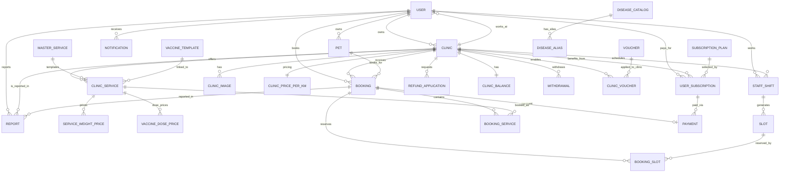
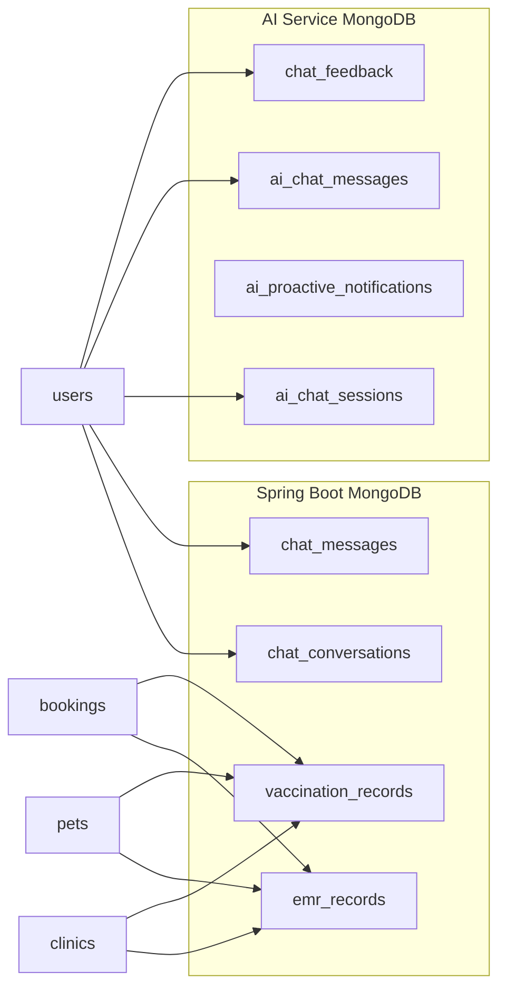
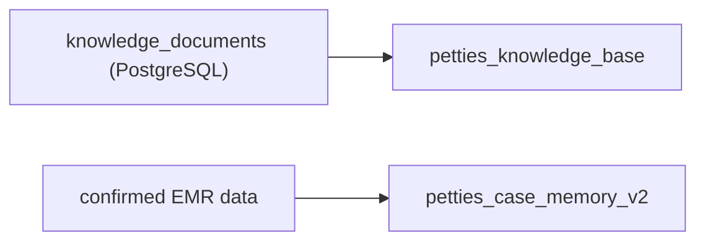

# PETTIES Hybrid Data Model

**Version:** 5.0
**Last Updated:** 2026-03-25
**Status:** Canonical hybrid data model overview

## Summary

This document is the canonical **cross-database logical data model** for Petties.

- PostgreSQL is the transactional source of truth for backend business data and AI governance tables.
- MongoDB stores flexible medical records and chat runtime/audit documents.
- Qdrant stores text and multimodal vectors for knowledge retrieval and case memory.

Use this document together with:

- [PETTIES_DBML.dbml](D:/SEP490/petties/docs-references/database/PETTIES_DBML.dbml) for the PostgreSQL physical schema
- [DATABASE_SCHEMA_ANALYSIS.md](D:/SEP490/petties/docs-references/documentation/DATABASE_SCHEMA_ANALYSIS.md) for the narrative schema analysis

## 1. Storage Overview

| Storage | Role | Canonical scope |
|---|---|---|
| PostgreSQL | Relational source of truth | Spring Boot transactional schema + AI configuration/governance schema |
| MongoDB | Flexible document store | EMR, vaccination history, owner-clinic chat, AI chat runtime, AI feedback |
| Qdrant | Vector database | Knowledge base vectors, KB image vectors, EMR-confirmed case memory |

### Current logical inventory

| Storage | Current scope |
|---|---|
| Spring Boot PostgreSQL | 30 tables |
| AI Service PostgreSQL | 7 tables |
| Spring Boot MongoDB | 4 collections |
| AI Service MongoDB | 4 collections |
| Qdrant | 3 collections |

> Optional operational note: `langgraph_checkpoints` may be created at runtime by the AI service checkpointer, but it is not currently part of the migration-backed canonical schema package.

## 2. PostgreSQL Domains

### 2.1 Spring Boot relational schema

| Domain | Tables |
|---|---|
| Identity and access | `users`, `refresh_tokens`, `blacklisted_tokens` |
| Pet and clinic | `pets`, `clinics`, `clinic_images`, `clinic_price_per_km` |
| Services and vaccination masters | `master_services`, `clinic_services`, `service_weight_prices`, `vaccine_templates`, `vaccine_dose_prices` |
| Scheduling and booking | `staff_shifts`, `slots`, `bookings`, `booking_services`, `booking_slots`, `payments` |
| Finance and settlement | `refund_applications`, `clinic_balances`, `withdrawals` |
| Governance and monetization | `reports`, `subscription_plans`, `user_subscriptions`, `vouchers`, `clinic_vouchers`, `clinic_strike_config`, `user_strike_config` |
| Operations | `notifications`, `chat_auto_reply_settings` |

### 2.2 AI service relational schema

| Domain | Tables |
|---|---|
| Runtime configuration | `agents`, `tools`, `knowledge_documents`, `system_settings` |
| Disease normalization | `disease_catalog`, `disease_aliases` |

### 2.3 Relational ERD

```mermaid
erDiagram
    USER ||--o{ PET : owns
    USER ||--o{ CLINIC : owns
    USER }o--|| CLINIC : works_at
    USER ||--o{ STAFF_SHIFT : works
    USER ||--o{ BOOKING : books
    USER ||--o{ USER_SUBSCRIPTION : pays_for
    USER ||--o{ REPORT : reports
    USER ||--o{ NOTIFICATION : receives

    CLINIC ||--o{ CLINIC_IMAGE : has
    CLINIC ||--|| CLINIC_PRICE_PER_KM : pricing
    CLINIC ||--o{ CLINIC_SERVICE : offers
    CLINIC ||--o{ STAFF_SHIFT : schedules
    CLINIC ||--o{ BOOKING : receives
    CLINIC ||--o{ REFUND_APPLICATION : requests
    CLINIC ||--|| CLINIC_BALANCE : has
    CLINIC ||--o{ WITHDRAWAL : withdraws
    CLINIC ||--o{ REPORT : is_reported_in
    CLINIC ||--o{ USER_SUBSCRIPTION : benefits_from
    CLINIC ||--o{ CLINIC_VOUCHER : enables

    MASTER_SERVICE ||--o{ CLINIC_SERVICE : templates
    VACCINE_TEMPLATE ||--o{ CLINIC_SERVICE : linked_to
    CLINIC_SERVICE ||--o{ SERVICE_WEIGHT_PRICE : prices
    CLINIC_SERVICE ||--o{ VACCINE_DOSE_PRICE : dose_prices

    STAFF_SHIFT ||--o{ SLOT : generates
    PET ||--o{ BOOKING : books_for

    BOOKING ||--o{ BOOKING_SERVICE : contains
    BOOKING ||--o{ BOOKING_SLOT : reserves
    BOOKING ||--o| PAYMENT : payment
    BOOKING ||--o{ REPORT : reported_in
    SLOT ||--o{ BOOKING_SLOT : reserved_by
    CLINIC_SERVICE ||--o{ BOOKING_SERVICE : booked_as

    SUBSCRIPTION_PLAN ||--o{ USER_SUBSCRIPTION : selected_by
    USER_SUBSCRIPTION ||--o{ PAYMENT : paid_via

    VOUCHER ||--o{ CLINIC_VOUCHER : applied_to_clinic

    DISEASE_CATALOG ||--o{ DISEASE_ALIAS : has_alias
```

## 3. MongoDB Collections

### 3.1 Spring Boot MongoDB

| Collection | Purpose | Logical references |
|---|---|---|
| `emr_records` | SOAP-based medical records | `pet_id`, `booking_id`, `staff_id`, `clinic_id` |
| `vaccination_records` | Vaccination history and reminder data | `pet_id`, `booking_id`, `staff_id`, `clinic_id` |
| `chat_conversations` | Owner-clinic conversation headers | `pet_owner_id`, `clinic_id` |
| `chat_messages` | Owner-clinic messages | `sender_id`, `chat_box_id` |

### 3.2 AI service MongoDB

| Collection | Purpose | Key indexes or references |
|---|---|---|
| `ai_chat_sessions` | Session metadata for AI chat isolation | unique `session_id`, `user_id`, `context_type`, `updated_at` |
| `ai_chat_messages` | Assistant/user messages with trace metadata | unique `message_id`, `session_id`, `timestamp` |
| `ai_proactive_notifications` | AI proactive notification log | `user_id`, `timestamp`, `read_status` |
| `chat_feedback` | Feedback and moderation data | `message_id`, `user_id`, `timestamp` |

### 3.3 Document model overview

```mermaid
flowchart LR
    subgraph SpringMongo["Spring Boot MongoDB"]
        EMR["emr_records"]
        VAX["vaccination_records"]
        CONV["chat_conversations"]
        MSG["chat_messages"]
    end

    subgraph AIMongo["AI Service MongoDB"]
        AIC["ai_chat_sessions"]
        AIM["ai_chat_messages"]
        AIP["ai_proactive_notifications"]
        FDB["chat_feedback"]
    end

    USER["users"] --> CONV
    USER --> MSG
    USER --> AIC
    USER --> AIM
    USER --> FDB
    CLINIC["clinics"] --> EMR
    CLINIC --> VAX
    PET["pets"] --> EMR
    PET --> VAX
    BOOKING["bookings"] --> EMR
    BOOKING --> VAX
```

## 4. Qdrant Collections

| Collection | Vector model | Purpose |
|---|---|---|
| `petties_knowledge_base` | text only, 1024-dim | RAG text chunks from uploaded knowledge documents |
| `petties_case_memory_v2` | named vectors `text` + `image`, both 1024-dim | Confirmed EMR case memory for diagnosis support |

**Note:** `petties_kb_images` was removed (migration 010) - PDF image extraction was never used in production.

```mermaid
flowchart LR
    KD["knowledge_documents (PostgreSQL)"] --> KB["petties_knowledge_base"]
    EMR["confirmed EMR data"] --> CM["petties_case_memory_v2"]
```

## 5. Key Modeling Rules

- PostgreSQL remains the authoritative store for relational identity and business invariants.
- MongoDB stores flexible document payloads and streaming-friendly runtime traces.
- Qdrant stores embeddings and retrieval payload metadata, not transactional business records.
- AI chat runtime is **MongoDB-based**, not PostgreSQL-based.
- `prompt_versions` is **not** part of the current AI PostgreSQL schema.
- `tools` no longer use per-agent assignment FKs; tool availability is governed by runtime policy and enablement state.

## 6. Source-of-Truth Notes

- The canonical PostgreSQL artifact is [PETTIES_DBML.dbml](D:/SEP490/petties/docs-references/database/PETTIES_DBML.dbml).
- If a future feature adds a PostgreSQL entity, it must be added to:
  1. Flyway or Alembic migration
  2. `PETTIES_DBML.dbml`
  3. this hybrid ERD document
  4. `DATABASE_SCHEMA_ANALYSIS.md`
