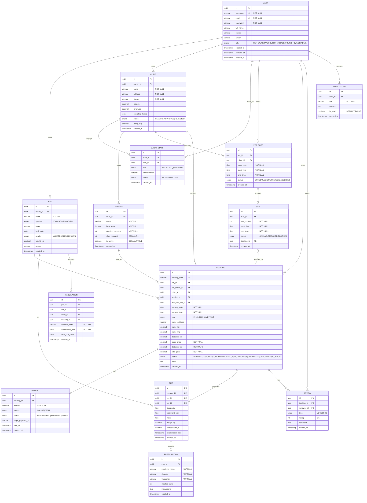

# PETTIES MVP ERD - Simplified Version

**Version:** 1.0 MVP  
**Last Updated:** 2025-12-17  
**Scope:** Core Features (Sprint 1-9)  
**Total Entities:** 15

---

## 1. Mermaid ERD (Crow's Foot)



---

## 2. Entity Summary

| # | Entity | Description | Sprint |
|---|--------|-------------|--------|
| 1 | USER | Người dùng (5 roles) | 1 |
| 2 | CLINIC | Phòng khám thú y | 2 |
| 3 | CLINIC_STAFF | Nhân viên phòng khám | 3 |
| 4 | SERVICE | Dịch vụ khám | 2 |
| 5 | PET | Thú cưng | 2 |
| 6 | VET_SHIFT | Ca làm việc bác sĩ | 3 |
| 7 | SLOT | Slot thời gian 30 phút | 3 |
| 8 | BOOKING | Lịch hẹn khám | 4-6 |
| 9 | PAYMENT | Thanh toán | 8 |
| 10 | EMR | Hồ sơ bệnh án | 7 |
| 11 | PRESCRIPTION | Đơn thuốc | 7 |
| 12 | VACCINATION | Tiêm chủng | 7 |
| 13 | REVIEW | Đánh giá | 9 |
| 14 | NOTIFICATION | Thông báo | 9 |

---

## 3. Key Relationships

| From | To | Type | Description |
|------|-----|------|-------------|
| USER | PET | 1:N | User sở hữu nhiều pet |
| USER | CLINIC | 1:N | User (CLINIC_OWNER) sở hữu nhiều clinic |
| CLINIC | SERVICE | 1:N | Clinic có nhiều dịch vụ |
| CLINIC | CLINIC_STAFF (manager) | 1:1 | Mỗi clinic có 1 manager |
| CLINIC | CLINIC_STAFF | 1:N | Clinic có nhiều nhân viên |
| VET_SHIFT | SLOT | 1:N | Ca làm có nhiều slot 30 phút |
| BOOKING | PAYMENT | 1:1 | Mỗi booking có 1 payment |
| BOOKING | EMR | 1:0..1 | Booking có thể tạo 1 EMR |
| EMR | PRESCRIPTION | 1:N | EMR có nhiều đơn thuốc |

---

## 4. Booking Status Flow

```
PENDING → ASSIGNED → CONFIRMED → CHECK_IN → IN_PROGRESS → COMPLETED
                                     ↓
                                  NO_SHOW
    ↓ (any time before CHECK_IN)
CANCELLED
```

---

## 5. User Roles

| Role | Platform | Description |
|------|----------|-------------|
| PET_OWNER | Mobile | Chủ thú cưng, đặt lịch khám |
| VET | Mobile + Web | Bác sĩ thú y |
| CLINIC_MANAGER | Web | Quản lý phòng khám |
| CLINIC_OWNER | Web | Chủ phòng khám |
| ADMIN | Web | Admin nền tảng |

---

**Document Status:** MVP Ready  
**Next Phase:** Add AI Agent entities (Sprint 10-12)
