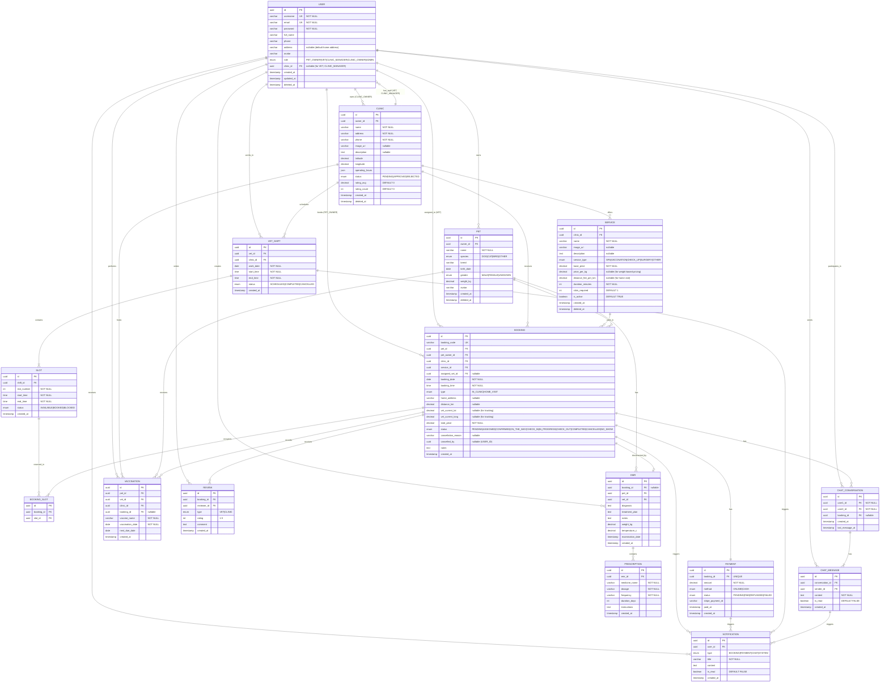

# PETTIES MVP ERD - Professional Complete Edition

**Version:** 3.0 MVP (Updated Service Pricing Model)  
**Last Updated:** 2025-12-21 13:56 UTC+07  
**Scope:** Core Features (Sprint 1-9) + Chat Extension  
**Total Entities:** 16 (Optimized for Service-Centric Pricing)  
**Status:** Production-Ready Documentation  

---

## Executive Summary

Petties is a veterinary appointment booking platform connecting pet owners with veterinary clinics. The system uses a **service-centric pricing model** where all pricing logic is managed at the SERVICE level, ensuring scalability and easy maintenance. BOOKING entities store only the final calculated price, not intermediate pricing components.

**Key Design Principle:** 
- **SERVICE owns pricing logic** (base price, weight-based pricing, distance fees)  
- **BOOKING stores final price only** (total_price = calculated during booking)  
- **No redundant price data** in BOOKING to ensure data consistency

---

## 1. Complete Mermaid ERD (Crow's Foot Notation)



---

## 2. Detailed Entities Description

### **2.1 USER** – System User Account

**Purpose:**  
Central user account entity storing credentials and profile information for all system roles. Acts as the authentication and authorization hub.

**Business Role:**
- User registration, login, and profile management
- Role-based access control (5 distinct roles)
- For VET/CLINIC_MANAGER: linked to exactly one CLINIC via `clinic_id`
- For PET_OWNER: can own multiple PETs and create multiple BOOKINGs; uses `address` for home visits
- For CLINIC_OWNER: can own multiple CLINICs
- For ADMIN: platform-wide oversight

**Key Relationships:**
- Owns PET (pet owner role) – 1:N
- Owns CLINIC (clinic owner role) – 1:N
- Belongs to CLINIC (vet/manager role via clinic_id) – N:1
- Creates VET_SHIFT (vet role) – 1:N
- Books BOOKING (pet owner role) – 1:N
- Assigned to BOOKING (vet role, assigned_vet_id) – 1:N
- Creates EMR (vet role) – 1:N
- Performs VACCINATION (vet role) – 1:N
- Writes REVIEW – 1:N
- Receives NOTIFICATION – 1:N
- Participates in CHAT_CONVERSATION – 1:N
- Sends CHAT_MESSAGE – 1:N

**Design Note:**
- **Soft Delete**: `deleted_at` ensures history remains if user is removed
- Removed CLINIC_STAFF table; staff membership handled via `clinic_id` and `role` directly on USER
- Simplifies queries and eliminates redundancy for staff-to-clinic relationship
- Each staff member (VET, CLINIC_MANAGER) belongs to exactly 1 clinic

---

### **2.2 CLINIC** – Veterinary Clinic

**Purpose:**
Represents a veterinary clinic entity, including basic information, location, operating hours, and regulatory status.

**Business Role:**
- Central service provider in the platform
- Clinic owner registers and provides details (name, address, operating hours, coordinates for map, photos, description)
- Admin approves/rejects clinic registration (status: PENDING/APPROVED/REJECTED)
- Hosts VET_SHIFTs, OFFERs SERVICEs, RECEIVEs BOOKINGs
- Maintains average rating and count from REVIEW records

**Key Relationships:**
- Owned by USER (clinic owner role) – N:1
- Employs USER (vet/manager staff via clinic_id) – 1:N
- Offers SERVICE – 1:N (each service belongs to one clinic)
- Schedules VET_SHIFT – 1:N
- Receives BOOKING – 1:N
- Hosts VACCINATION – 1:N (for record tracking and analytics)

**Design Notes:**
- `operating_hours` stored as JSON to support flexible weekly schedules
- `rating_avg` and `rating_count` are denormalized fields, calculated from REVIEW records
- `latitude`, `longitude` enable map-based clinic discovery
- **Soft Delete**: `deleted_at` field supported to maintain booking history

---

### **2.3 SERVICE** – Veterinary Service (UPDATED)

**Purpose:**
Defines veterinary services offered by each clinic with comprehensive pricing model. **This entity is the single source of truth for all pricing calculations.**

**Business Role:**
- Each service has a type (SPA, VACCINATION, CHECK_UP, SURGERY, OTHER)
- Pricing managed centrally: base_price, optional weight-based pricing (price_per_kg), optional distance fees (distance_fee_per_km)
- Each service has an image and detailed description for owner clarity
- Services can be customized per clinic (same service type, different clinics may have different prices)
- Specifies duration and required slots (1 slot = 30 minutes)

**Key Pricing Components:**
- `base_price` – Mandatory base cost of the service
- `price_per_kg` – Optional, for weight-based services (SPA, grooming); NULL for fixed-price services
- `distance_fee_per_km` – Optional, applied when booking.type = HOME_VISIT
- These three components are summed to calculate BOOKING.total_price

**Example Services:**
```
Clinic A - SPA Service:
  name: "SPA cơ bản"
  service_type: SPA
  base_price: 500,000 VND
  price_per_kg: 50,000 VND (added per kg of pet weight)
  distance_fee_per_km: 30,000 VND (if home visit)
  duration_minutes: 60
  slots_required: 2

Clinic A - Vaccination Service:
  name: "Tiêm vaccine dại"
  service_type: VACCINATION
  base_price: 300,000 VND
  price_per_kg: NULL (no weight-based pricing)
  distance_fee_per_km: 20,000 VND (if home visit)
  duration_minutes: 30
  slots_required: 1

Clinic A - Check-up Service:
  name: "Khám tổng quát"
  service_type: CHECK_UP
  base_price: 200,000 VND
  price_per_kg: NULL
  distance_fee_per_km: 20,000 VND (if home visit)
  duration_minutes: 30
  slots_required: 1

Clinic A - Surgery Service:
  name: "Phẫu thuật triệt sản"
  service_type: SURGERY
  base_price: 2,500,000 VND
  price_per_kg: NULL
  distance_fee_per_km: 30,000 VND (if home visit)
  duration_minutes: 120
  slots_required: 4
```

**Price Calculation Logic (at Booking Time):**
```
total_price = SERVICE.base_price 
            + (SERVICE.price_per_kg * PET.weight_kg if SERVICE.price_per_kg is NOT NULL else 0)
            + (SERVICE.distance_fee_per_km * BOOKING.distance_km if BOOKING.type = HOME_VISIT else 0)
```

**Key Relationships:**
- Belongs to CLINIC – N:1
- Used in BOOKING – 1:N

**Design Notes:**
- Centralized pricing eliminates redundancy and ensures consistency
- SERVICE changes automatically apply to future bookings, not past ones
- Type-based categorization enables revenue analytics and filtering
- **Soft Delete**: `deleted_at` field supported; inactive services are hidden from new bookings

---

### **2.4 PET** – Pet Profile

**Purpose:**
Stores comprehensive information about pet owners' pets, including basic attributes and medical history references.

**Business Role:**
- Owned by PET_OWNER (USER)
- Subject of BOOKINGs (appointment targets)
- Has medical history through EMR (examination records)
- Has VACCINATION records forming a vaccination card/history
- Pet owner views PET profile to track health, booking history, vaccination schedule

**Key Attributes:**
- Identifies the pet by name, species (DOG/CAT/BIRD/OTHER), breed, birth date, gender
- Current weight (updated during examinations)
- Avatar for visual identification

**Key Relationships:**
- Owned by USER (pet owner role) – N:1
- Has BOOKING – 1:N (multiple appointments over lifetime)
- Has EMR – 1:N (medical records)
- Receives VACCINATION – 1:N (vaccination history = vaccination card)

**Design Notes:**
- Weight_kg can be updated during EMR creation (examination update)
- All BOOKINGs for a pet can be queried via PET.id for appointment history
- All VACCINATIONs for a pet form the complete vaccination record
- **Soft Delete**: `deleted_at` field supported; pet owners can "remove" pets without losing history

---

### **2.16 BOOKING_SLOT** – Multi-slot Junction

**Purpose:**
Junction table enabling a single booking to occupy multiple time slots (e.g., a 60-minute SPA service occupying two 30-minute slots).

**Business Role:**
- Created during booking process based on `SERVICE.slots_required`.
- Ensures that complex services block the appropriate amount of time on a vet's calendar.

**Key Relationships:**
- Belongs to BOOKING – N:1
- Belongs to SLOT – N:1

---

### Design Decision 7: Multi-Slot Booking Lifecycle

**Decision:** When a multi-slot booking (e.g., 2 slots) is completed, the slots remain linked to the booking and their status remains `BOOKED`.

**Justification:**
- **Audit Trail**: Preserves the historical record of which slots were used by which booking.
- **Calendar Logic**: Past slots do not need to be returned to `AVAILABLE` because they are in the past; "availability" is a function of time flow, not just status.
- **UI Rendering**: Allows the calendar to correctly render completed appointments as blocks of time (e.g., a 09:00–10:00 block for a 2-slot service).
- **Concurrency**: Prevents accidental double-booking of reached/past time slots.

---

### **2.5 VET_SHIFT** – Veterinarian Work Schedule

**Purpose:**
Defines the work schedule for each veterinarian at each clinic, broken into a series of time slots.

**Business Role:**
- Created by clinic manager for each vet at the clinic
- Covers a specific work_date, with start_time and end_time
- Automatically divided into SLOTs (30-minute units) for pet owner selection
- Status tracks shift state: SCHEDULED (upcoming), COMPLETED (finished), CANCELLED (removed)

**Key Relationships:**
- Assigned to USER (vet role) – N:1
- Belongs to CLINIC – N:1
- Contains SLOT – 1:N (each shift subdivided into multiple slots)
- Triggers NOTIFICATION – 1:N (reminders for upcoming shifts)

**Design Notes:**
- Shifts are the scheduling backbone; all booking availability derives from shifts
- Slots within a shift represent available time units (30 min each)
- Status management allows tracking of planned vs. realized shifts

---

### **2.6 SLOT** – 30-Minute Time Unit

**Purpose:**
Represents a single 30-minute time slot within a veterinarian's shift, used as the atomic unit for appointment booking.

**Business Role:**
- Created from VET_SHIFT (one shift might have 4–8 slots depending on duration)
- Can be in AVAILABLE (unbooked), BOOKED (reserved by a booking), or BLOCKED (reserved by clinic, e.g., lunch break) status
- Pet owner selects a slot when creating a booking
- One BOOKING reserves exactly one SLOT

**Key Relationships:**
- Belongs to VET_SHIFT – N:1
- Occupied by BOOKING_SLOT – 1:0..1 (one slot holds zero or one booking record)

**Design Notes:**
- Fixed 30-minute duration ensures consistent availability display
- Status field tracks actual vs. reserved time
- Multi-slot support: A single service (like SPA) may occupy 2+ consecutive slots.

---

### **2.7 BOOKING** – Appointment Record (SIMPLIFIED)

**Purpose:**
Core entity representing a pet appointment, now with simplified pricing (delegated to SERVICE).

**Business Role:**
- Created by PET_OWNER when scheduling an appointment
- References PET, CLINIC, SERVICE (determines price), and selected SLOT
- Tracks full appointment lifecycle: PENDING → ASSIGNED → CONFIRMED → ON_THE_WAY → CHECK_IN → IN_PROGRESS → CHECK_OUT → COMPLETED/CANCELLED/NO_SHOW
- Stores final `total_price` (calculated at creation time, based on SERVICE pricing rules)
- Specifically for HOME_VISIT: Supports real-time tracking of vet location via `vet_current_lat` and `vet_current_long`.
- Completion logic: Booking reaches COMPLETED only when (Status = CHECK_OUT AND Payment = PAID).
- Optionally generates EMR, PAYMENT, REVIEW, NOTIFICATION, CHAT_CONVERSATION

**Pricing Model (UPDATED):**
- `total_price` = final calculated amount (set at booking creation)
- Calculated from: SERVICE.base_price + weight-based fee (if applicable) + distance fee (if home visit)
- No intermediate pricing fields (base_price, distance_fee removed)
- `distance_km` retained as informational metadata only (not used for pricing)

**Booking Types:**
- IN_CLINIC: appointment at clinic (home_address = NULL, distance_km = 0, no tracking)
- HOME_VISIT: appointment at pet owner's home (home_address specified, tracking enabled)

**Key Relationships:**
- Created by USER (pet owner role) – N:1
- For PET – N:1
- At CLINIC – N:1
- Uses SERVICE – N:1 (service determines pricing and required slots)
- Assigned to USER (vet role, assigned_vet_id) – N:1, optional initially
- Occupies BOOKING_SLOT – 1:N
- Has PAYMENT – 1:1
- Documented by EMR – 1:0..1
- Receives REVIEW – 1:N
- Records VACCINATION – 1:N
- Has CHAT_CONVERSATION – 1:N, optional
- Triggers NOTIFICATION – 1:N

**Completion Dependency:**
- The vet is responsible for moving the booking to `CHECK_OUT` after finishing the service.
- If payment method is `CASH`, the clinic manager or vet must confirm payment receipt to move status from `CHECK_OUT` to `COMPLETED`.
- If payment is `ONLINE` and already `PAID`, the system can auto-complete once vet clicks `CHECK_OUT`.

**Status Flow:**
```
PENDING  
  → (admin assigns vet)
ASSIGNED  
  → (pet owner confirms)
CONFIRMED  
  → (for HOME_VISIT: Vet clicks **"Start Travel"** button)
ON_THE_WAY
  → (Vet arrives/Pet owner arrives, Vet clicks **"Check-in"**)
CHECK_IN  
  → (Vet examines pet)
IN_PROGRESS  
  → (Vet finishes service, clicks **"Check-out"**)
CHECK_OUT  
  → (Payment finalized: ONLINE already paid or CASH received)
COMPLETED

Alternative paths:
PENDING/ASSIGNED/CONFIRMED/ON_THE_WAY → CANCELLED (before check-in)
CHECK_IN/IN_PROGRESS/ON_THE_WAY → NO_SHOW (if either party fails to meet)
```

**Design Notes:**
- Simplified by removing redundant pricing fields (base_price, distance_fee)
- Total price is set once at booking creation, immutable thereafter
- distance_km stored for reference and analytics, not pricing calculations
- Multiple CHATs per booking support different communication contexts (owner ↔ vet, owner ↔ manager)
- **Cancellation Tracking**: `cancellation_reason` and `cancelled_by` store audit trail for cancelled appointments.
- **Real-time Tracking (For HOME_VISIT)**: Triggered when Vet clicks "Start Travel" in the app. The app then pushes GPS coordinates to `vet_current_lat/long` every 30-60 seconds while status is `ON_THE_WAY`.

---

### **2.8 PAYMENT** – Transaction Record

**Purpose:**
Records payment information for each booking, supporting multiple payment methods and tracking transaction lifecycle.

**Business Role:**
- Created when booking is confirmed
- Tracks payment method (ONLINE via Stripe, CASH on-site)
- Supports refunds, tracks payment status (PENDING/PAID/REFUNDED/FAILED)
- Links to Stripe transaction ID for dispute resolution

**Key Relationships:**
- Belongs to BOOKING – 1:1 (each booking has exactly one payment)
- Triggers NOTIFICATION – 1:N (payment success/failure notifications)

**Design Notes:**
- `amount` should match BOOKING.total_price
- `stripe_payment_id` populated only for ONLINE payments
- `paid_at` timestamp tracks actual payment time (distinct from creation)

---

### **2.9 EMR** – Electronic Medical Record

**Purpose:**
Comprehensive medical examination record created by a veterinarian during/after a booking consultation.

**Business Role:**
- Created by VET after examining a pet
- Optional per booking (may not exist if cancelled, no-show, or vet doesn't create one)
- Documents diagnosis, treatment plan, clinical measurements (weight, temperature)
- Contains multiple PRESCRIPTION records for medication instructions
- Pet owner views EMR history for past medical information

**Key Relationships:**
- Documents BOOKING – 1:0..1 (booking may have zero or one EMR)
- For PET – N:1 (pet has multiple EMR over time)
- Created by USER (vet role) – N:1
- Contains PRESCRIPTION – 1:N

**Design Notes:**
- `examination_date` can differ from booking_date (e.g., recorded later)
- Weight_kg from examination updates PET.weight_kg
- Multiple EMR per pet provides complete medical history timeline

---

### **2.10 PRESCRIPTION** – Medication Record

**Purpose:**
Documents specific medication and instructions within an EMR, enabling pet owner to follow treatment at home.

**Business Role:**
- Created by vet within EMR
- Specifies medication name, dosage, frequency, duration, and special instructions
- Pet owner reads prescriptions to understand medication regimen

**Key Relationships:**
- Belongs to EMR – N:1 (one EMR can contain multiple medicines)

**Design Notes:**
- Simple structure focused on essential medication information
- No drug database integration in MVP (free-text medicine_name)

---

### **2.11 VACCINATION** – Immunization Record

**Purpose:**
Records each vaccination event, forming a complete vaccination history/card when aggregated per pet.

**Business Role:**
- Created by VET during or after a booking
- Each record = one vaccination event (not a card/record object)
- **Full vaccination card of a pet = all VACCINATION records for that pet**
- Tracks vaccine name, vaccination date, next due date (for reminders)
- Clinic uses next_due_date to recommend follow-up vaccinations

**Key Relationships:**
- For PET – N:1 (pet receives multiple vaccinations over lifetime)
- Performed by USER (vet role) – N:1
- Hosted by CLINIC – N:1 (for clinic analytics and record keeping)
- Related to BOOKING – 1:0..1 (vaccination occurred during this appointment, optional)

**UI Representation:**
- Pet Profile displays all VACCINATION records as "Vaccination Card / Vaccination History"
- Shows: vaccine name, date, next due date, clinic, vet
- System can recommend: "Next mũi vaccine [name] due on [date]"

**Design Notes:**
- Each VACCINATION = one needle/one event (not aggregated)
- CLINIC 1:N VACCINATION enables clinic to query "all vaccinations at clinic A" for inventory/statistics
- next_due_date enables proactive notification system

---

### **2.12 REVIEW** – User Feedback

**Purpose:**
Captures user ratings and comments about veterinarian or clinic service quality.

**Business Role:**
- Created by pet owner after a completed booking
- Type indicates target: VET (rate the veterinarian) or CLINIC (rate the clinic)
- Rating scale 1–5, with optional comment
- Used to calculate CLINIC.rating_avg (denormalized field)

**Key Relationships:**
- For BOOKING – N:1 (one booking may have multiple reviews: vet review + clinic review)
- By USER – N:1 (user can write multiple reviews over time)

**Design Notes:**
- Separate VET vs. CLINIC type allows targeting feedback appropriately
- Denormalized CLINIC.rating_avg simplifies clinic discovery and ranking

---

### **2.13 NOTIFICATION** – System Alert

**Purpose:**
Delivers system-generated alerts to users about important events (booking changes, payments, messages, shift reminders).

**Business Role:**
- Triggered by events (see Triggers below)
- Used for in-app badge notifications, email alerts, push notifications
- Tracks read status for UI display (unread count)
- Pet owner, vet, and clinic manager all receive relevant notifications

**Triggers:**
- BOOKING event: creation, status change (ASSIGNED, CONFIRMED, CHECK_IN, COMPLETED, CANCELLED), NO_SHOW
- PAYMENT event: PAID, FAILED, REFUNDED
- VET_SHIFT event: upcoming shift reminder
- CHAT_MESSAGE event: new message from conversation partner

**Key Relationships:**
- Sent to USER – N:1
- Triggered by BOOKING – 1:N
- Triggered by PAYMENT – 1:N
- Triggered by VET_SHIFT – 1:N
- Triggered by CHAT_MESSAGE – 1:N

**Design Notes:**
- Simple design focused on delivery; detailed content in `content` field
- `is_read` supports badge count and notification center functionality
- `type` categorization enables smart deep-linking in mobile app

---

### **2.14 CHAT_CONVERSATION** – 1-to-1 Dialog

**Purpose:**
Represents a single conversation thread between exactly two users (never group chat in MVP).

**Business Role:**
- Created when two users initiate communication
- Can be associated with a specific BOOKING (chat about appointment context)
- Or standalone (general inquiry, follow-up care questions)
- Last_message_at enables sorting conversation list by recency

**Types of Conversations (examples):**
- Pet owner ↔ Assigned vet (about a specific booking)
- Pet owner ↔ Clinic manager (about service, scheduling)
- Vet ↔ Clinic manager (internal consultation, possible future extension)

**Key Relationships:**
- Between two USER entities (user1_id, user2_id) – N:N via this record
- Related to BOOKING – 1:N, optional (a booking may have multiple conversations)
- Contains CHAT_MESSAGE – 1:N

**Design Notes:**
- 1-to-1 design (not group) simplifies MVP, supports future scaling
- Dual FK (user1_id, user2_id) stores both participants
- booking_id optional; null if conversation is general/not appointment-specific

---

### **2.15 CHAT_MESSAGE** – Conversation Message

**Purpose:**
Individual message within a conversation, supporting async communication between users.

**Business Role:**
- Sent by one USER to another (within a CHAT_CONVERSATION)
- Stores plain text content (no file attachments in MVP)
- Tracks read status for "seen" indicators
- Triggers notification to conversation partner

**Key Relationships:**
- Within CHAT_CONVERSATION – N:1
- Sent by USER – N:1
- Triggers NOTIFICATION – 1:N (notify the other party)

**Design Notes:**
- Simple text-only implementation for MVP
- Read status supports UX feedback (message seen/unseen)
- timestamp enables message ordering and timeline display

---

## 3. Entity Summary Table

| ID | Entity | Type | Purpose | Key Relations |
|---|--------|------|---------|----------------|
| 1 | USER | Core | System user (5 roles) | owns PET, owns CLINIC, works_in VET_SHIFT, books BOOKING, creates EMR, receives NOTIFICATION |
| 2 | CLINIC | Core | Veterinary clinic | owns by USER, has USER (staff), offers SERVICE, schedules VET_SHIFT, receives BOOKING |
| 3 | SERVICE | Core | Service offering with pricing | belongs to CLINIC, used_in BOOKING (1:N), sets price rules for bookings |
| 4 | PET | Core | Pet profile | owns by USER, has BOOKING, has EMR, receives VACCINATION |
| 5 | VET_SHIFT | Core | Vet schedule | belongs to USER (vet) & CLINIC, contains SLOT, triggers NOTIFICATION |
| 6 | SLOT | Core | 30-min time unit | belongs to VET_SHIFT, reserved_by BOOKING (1:0..1) |
| 7 | BOOKING | Core | Appointment (simplified) | created by USER (owner), for PET, at CLINIC, uses SERVICE, reserves SLOT, has PAYMENT, has EMR, triggers NOTIFICATION |
| 8 | PAYMENT | Core | Payment transaction | for BOOKING (1:1), triggers NOTIFICATION |
| 9 | EMR | Core | Medical record | for BOOKING (1:0..1), for PET (1:N), created by USER (vet), contains PRESCRIPTION |
| 10 | PRESCRIPTION | Core | Medication record | in EMR (1:N) |
| 11 | VACCINATION | Core | Immunization event | for PET (1:N), performed by USER (vet), hosted by CLINIC, related to BOOKING |
| 12 | REVIEW | Core | User feedback | for BOOKING (1:N), by USER (1:N) |
| 13 | NOTIFICATION | Core | System alert | to USER (1:N), triggered by BOOKING/PAYMENT/VET_SHIFT/CHAT_MESSAGE |
| 14 | CHAT_CONVERSATION | Chat | 1-1 dialog | between USER (user1, user2), related to BOOKING (opt), contains CHAT_MESSAGE |
| 15 | CHAT_MESSAGE | Chat | Conversation message | in CHAT_CONVERSATION (1:N), sent by USER (1:N), triggers NOTIFICATION |
| 16 | BOOKING_SLOT | Core | Multi-slot link | Links one BOOKING to multiple SLOTs |

---

## 4. Complete Relationship Matrix with Cardinality

### User & Ownership Tier

| From | To | Relationship | Cardinality | Description |
|------|-----|-----------|-------------|-------------|
| USER | PET | owns | 1–N | Pet owner has multiple pets; each pet has one owner |
| USER | CLINIC | owns | 1–N | Clinic owner has multiple clinics |
| CLINIC | USER | has_staff | 1–N | Clinic employs multiple staff (VET, CLINIC_MANAGER) via clinic_id |

### Clinic Operations Tier

| From | To | Relationship | Cardinality | Description |
|------|-----|-----------|-------------|-------------|
| CLINIC | SERVICE | offers | 1–N | Clinic provides multiple services |
| CLINIC | VET_SHIFT | schedules | 1–N | Clinic creates multiple shifts for vets |
| CLINIC | BOOKING | receives | 1–N | Clinic receives multiple appointments |
| CLINIC | VACCINATION | hosts | 1–N | Clinic records multiple vaccinations (for analytics/inventory) |

### Scheduling Tier (Shift → Slot → Booking)

| From | To | Relationship | Cardinality | Description |
|------|-----|-----------|-------------|-------------|
| USER (VET) | VET_SHIFT | works_in | 1–N | Vet has multiple shifts |
| VET_SHIFT | SLOT | contains | 1–N | One shift contains multiple 30-min slots |
| SLOT | BOOKING | reserved_by | 1–0..1 | Slot is booked by zero or one booking |

### Booking Core Tier (Simplified Pricing)

| From | To | Relationship | Cardinality | Description |
|------|-----|-----------|-------------|-------------|
| USER (PET_OWNER) | BOOKING | books | 1–N | Pet owner creates multiple bookings |
| PET | BOOKING | has | 1–N | Pet has multiple appointments |
| SERVICE | BOOKING | used_in | 1–N | Service used in multiple bookings; **SERVICE sets pricing** |
| USER (VET) | BOOKING | assigned_to | 1–N | Vet is assigned to multiple bookings (assigned_vet_id) |
| BOOKING | SLOT | reserves | 1–1 | Each booking reserves exactly one slot |

### Payment & Medical Tier

| From | To | Relationship | Cardinality | Description |
|------|-----|-----------|-------------|-------------|
| BOOKING | PAYMENT | has | 1–1 | Each booking has one payment |
| BOOKING | EMR | documented_by | 1–0..1 | Booking optionally has one EMR (vet-created) |
| PET | EMR | has | 1–N | Pet has multiple EMRs over time |
| USER (VET) | EMR | creates | 1–N | Vet creates multiple EMRs |
| EMR | PRESCRIPTION | contains | 1–N | EMR contains multiple medicines |

### Vaccination & Review Tier

| From | To | Relationship | Cardinality | Description |
|------|-----|-----------|-------------|-------------|
| PET | VACCINATION | receives | 1–N | Pet receives multiple vaccinations (= vaccination card) |
| USER (VET) | VACCINATION | performs | 1–N | Vet administers multiple vaccinations |
| BOOKING | VACCINATION | records | 1–N | Booking records multiple vaccinations if administered during appointment |
| BOOKING | REVIEW | receives | 1–N | Booking receives multiple reviews (vet + clinic) |
| USER | REVIEW | writes | 1–N | User writes multiple reviews |

### Notification Tier

| From | To | Relationship | Cardinality | Description |
|------|-----|-----------|-------------|-------------|
| USER | NOTIFICATION | receives | 1–N | User receives multiple notifications |
| BOOKING | NOTIFICATION | triggers | 1–N | Booking status changes create notifications |
| PAYMENT | NOTIFICATION | triggers | 1–N | Payment status changes create notifications |
| VET_SHIFT | NOTIFICATION | triggers | 1–N | Upcoming/completed shifts create notifications |

### Chat Tier (1-1)

| From | To | Relationship | Cardinality | Description |
|------|-----|-----------|-------------|-------------|
| USER | CHAT_CONVERSATION | participates_in | 1–N | User participates in multiple conversations (via user1_id or user2_id) |
| CHAT_CONVERSATION | CHAT_MESSAGE | has | 1–N | Conversation contains multiple messages |
| USER | CHAT_MESSAGE | sends | 1–N | User sends multiple messages |
| BOOKING | CHAT_CONVERSATION | has | 1–N (opt) | Booking may have 0 or multiple conversations |
| CHAT_MESSAGE | NOTIFICATION | triggers | 1–N | New message triggers notification for conversation partner |

---

## 5. Booking Lifecycle & Status Flow

### Primary Flow (Happy Path)

```
[PET_OWNER creates booking]
           ↓
     PENDING
     (awaiting vet assignment)
           ↓
     ASSIGNED
     (clinic manager assigns vet)
           ↓
     CONFIRMED
     (pet owner confirms appointment)
           ↓
     CHECK_IN
     (pet owner arrives, check-in at clinic)
           ↓
     IN_PROGRESS
     (vet examines pet)
           ↓
     COMPLETED
     (examination done, optionally: EMR created, payment processed, review invited)
```

### Alternative Flows (Error/Exception Paths)

```
PENDING → CANCELLED (owner cancels before confirmation)
ASSIGNED → CANCELLED (owner/clinic cancels before confirmation)
CONFIRMED → CANCELLED (owner/clinic cancels before check-in)

CHECK_IN → NO_SHOW (pet owner doesn't show up)
IN_PROGRESS → NO_SHOW (abandoned during examination)
```

### Notifications Triggered

- **PENDING created**: Notification to pet owner (booking confirmation), clinic manager (new booking)
- **→ ASSIGNED**: Notification to vet (new assignment), pet owner (vet assigned)
- **→ CONFIRMED**: Notification to vet (booking confirmed)
- **ON_THE_WAY**: Notification to pet owner (vet is coming)
- **CHECK_IN**: Notification to vet (pet checked in) or pet owner (vet arrived)
- **→ CHECK_OUT**: Notification to pet owner (service done, please rate or pay)
- **→ COMPLETED**: Notification to pet owner (thank you, review invitation), vet (shift complete)
- **→ CANCELLED**: Notification to all parties
- **→ NO_SHOW**: Notification to clinic (no-show record)

---

## 6. Pricing Calculation Examples

### Example 1: SPA Service (Weight-Based + Distance Fee)

```
SERVICE: "SPA cơ bản" at Clinic A
  - base_price: 500,000 VND
  - price_per_kg: 50,000 VND
  - distance_fee_per_km: 30,000 VND
  - service_type: SPA

PET: Labrador, weight 25 kg

BOOKING 1 (IN_CLINIC):
  - distance_km: 0
  - total_price = 500,000 + (50,000 * 25) + 0 = 500,000 + 1,250,000 = 1,750,000 VND

BOOKING 2 (HOME_VISIT):
  - distance_km: 5
  - total_price = 500,000 + (50,000 * 25) + (30,000 * 5) = 500,000 + 1,250,000 + 150,000 = 1,900,000 VND
```

### Example 2: Vaccination Service (Fixed Price + Distance Fee)

```
SERVICE: "Tiêm vaccine dại" at Clinic A
  - base_price: 300,000 VND
  - price_per_kg: NULL (no weight-based pricing)
  - distance_fee_per_km: 20,000 VND
  - service_type: VACCINATION

PET: Cat, weight 4 kg

BOOKING 1 (IN_CLINIC):
  - distance_km: 0
  - total_price = 300,000 + 0 + 0 = 300,000 VND

BOOKING 2 (HOME_VISIT):
  - distance_km: 3
  - total_price = 300,000 + 0 + (20,000 * 3) = 300,000 + 60,000 = 360,000 VND
```

### Example 3: Check-up Service (Fixed Price, No Weight-Based)

```
SERVICE: "Khám tổng quát" at Clinic A
  - base_price: 200,000 VND
  - price_per_kg: NULL
  - distance_fee_per_km: 20,000 VND
  - service_type: CHECK_UP

PET: Any pet

BOOKING 1 (IN_CLINIC):
  - total_price = 200,000 VND

BOOKING 2 (HOME_VISIT, 2 km):
  - total_price = 200,000 + (20,000 * 2) = 240,000 VND
```

---

## 7. User Roles & Access Matrix

| Role | Platform | Clinic | Key Permissions | Description |
|------|----------|--------|-----------------|-------------|
| **PET_OWNER** | Mobile | N/A | • Own pets<br>• Create bookings<br>• View booking history<br>• View pet medical records<br>• Pay for bookings<br>• Write reviews<br>• Chat with clinic<br>• Receive notifications | Pet owner; only mobile app access |
| **VET** | Mobile + Web | 1 (via clinic_id) | • View assigned bookings<br>• Create EMR after examination<br>• Write prescriptions<br>• Record vaccinations<br>• Create/update VET_SHIFTs<br>• Receive notifications<br>• Chat with clinic staff and owners | Veterinarian; dual-platform for flexibility |
| **CLINIC_MANAGER** | Web | 1 (via clinic_id) | • Create/manage VET_SHIFTs<br>• View all clinic bookings<br>• Assign vets to bookings<br>• View clinic reports<br>• Manage clinic staff<br>• Chat with vets and owners<br>• Receive booking notifications | Clinic operations manager |
| **CLINIC_OWNER** | Web | Many | • Register/edit clinic info<br>• Create services<br>• View all clinic data<br>• View financial reports<br>• Manage staff assignments<br>• View clinic analytics<br>• Receive notifications | Business owner; oversees multiple clinics |
| **ADMIN** | Web | N/A | • Approve/reject clinic registration<br>• View platform analytics<br>• Manage user accounts<br>• System settings<br>• Generate reports | Platform administrator |

---

## 8. Design Decisions & Justifications

### Design Decision 1: Service-Centric Pricing Model

**Decision:** All pricing logic managed at SERVICE level; BOOKING stores only final total_price.

**Justification:**
- **Single Source of Truth**: Price changes at SERVICE level automatically apply to new bookings
- **Data Integrity**: Eliminates redundant price fields in BOOKING, preventing sync issues
- **Scalability**: Easy to add new pricing factors (e.g., time-of-day surcharge, package deals) in future
- **Analytics**: SERVICE.service_type enables revenue reporting by service category

**Implementation:**
- SERVICE fields: `base_price`, `price_per_kg` (optional), `distance_fee_per_km` (optional)
- BOOKING field: `total_price` (calculated and stored once at creation)
- Calculation: total_price = base_price + weight_adjustment + distance_adjustment

---

### Design Decision 2: Removed CLINIC_STAFF Table

**Decision:** Staff membership handled directly via USER.clinic_id and USER.role.

**Justification:**
- **Simplification**: One less table, simpler schema
- **Business Constraint**: Each staff member (VET, CLINIC_MANAGER) belongs to exactly one clinic in MVP
- **Query Efficiency**: Direct clinic_id on USER enables simpler queries
- **Future Scalability**: If multi-clinic staff needed, re-introduce CLINIC_STAFF without breaking existing schema

**Trade-offs:**
- Removed: Staff history, multi-clinic simultaneous assignments, role-per-clinic variations
- If needed in future: Add CLINIC_STAFF table, migrate clinic_id data, adjust queries

---

### Design Decision 3: VACCINATION = Event, Not Card

**Decision:** Each VACCINATION record is one immunization event; aggregated records = vaccination card.

**Justification:**
- **Normalization**: Avoids denormalizing vaccination information
- **History Tracking**: Each event properly timestamped and attributed
- **Flexibility**: Easy to query past vaccinations, set reminders, track compliance
- **Aggregation**: UI simply queries all VACCINATION records for a PET → displays as card

**UI Example:**
```
Pet: "Milo" Vaccination Card
├─ 2024-01-15: Vaccine DL by Dr. An at Clinic A (Next: 2025-01-15)
├─ 2024-03-20: Vaccine Rabies by Dr. An at Clinic A (Next: 2025-03-20)
└─ 2024-06-10: Vaccine DHPP by Dr. Linh at Clinic B (Next: 2025-06-10)
```

---

### Design Decision 4: 1-1 Chat (No Group Chat) in MVP

**Decision:** CHAT_CONVERSATION restricted to exactly 2 users; no group messaging.

**Justification:**
- **MVP Scope**: Simplifies initial implementation
- **Primary Use Case**: Owner-to-clinic communication (owner ↔ vet, owner ↔ manager)
- **Future Extensibility**: Can upgrade to N-M via CHAT_PARTICIPANT table without breaking existing data
- **Performance**: No need for complex permission matrices in MVP

**Upgrade Path:**
- Introduce CHAT_PARTICIPANT join table
- Convert CHAT_CONVERSATION to support N users
- Maintain backward compatibility

---

### Design Decision 5: BOOKING 1–0..1 EMR

**Decision:** Booking optionally generates one EMR; EMR only created if vet examines and documents.

**Justification:**
- **Optionality**: Cancelled, no-show bookings don't generate EMR
- **Vet Discretion**: Vet decides whether EMR is necessary (check-up vs. consultation)
- **Data Integrity**: No empty/placeholder EMR records
- **Simplicity**: One-to-optional-one relationship is clearer than null handling

---

### Design Decision 6: Denormalized CLINIC Rating Stats

**Decision:** Store both average rating (`rating_avg`) and total review count (`rating_count`) on CLINIC, updated when a REVIEW is created.

**Justification:**
- **Read Performance**: Clinic discovery, sorting, and displaying (e.g., "4.8 ⭐ (120 reviews)") are high-frequency read operations.
- **Efficiency**: Eliminates the need to perform heavy JOIN and AGGREGATE (COUNT, AVG) operations across the entire REVIEW table during list fetching.
- **UX**: Provides immediate feedback on clinic popularity and reliability in the UI.
- **Calculation Logic**: New_Avg = ((Old_Avg * Old_Count) + New_Rate) / (Old_Count + 1), making `rating_count` a functional dependency for updating the average without re-scanning the history.

---

## 9. Implementation Notes & Best Practices

### Database Considerations

- **Indexing**: Primary indexes on all PKs; secondary indexes on FK columns and frequently queried fields (user_id, clinic_id, booking_date, status)
- **Constraints**: Foreign key constraints enforced; unique constraint on BOOKING.booking_code and PAYMENT.booking_id
- **Soft Deletes**: USER.deleted_at enables soft delete for audit trail
- **Timezone**: All timestamps in UTC; client responsible for conversion
- **Concurrency**: Use optimistic locking (version field) on BOOKING and PAYMENT for edit safety

### API Design

- **Price Calculation**: Performed on backend at booking creation; returned as total_price
- **Slot Availability**: Query SLOT table filtered by AVAILABLE status for given shift
- **GPS Tracking API**: Backend endpoint `POST /bookings/{id}/location` used by Vet App to update `vet_current_lat/long` only when status is `ON_THE_WAY`.
- **Vaccination Card**: Query all VACCINATION by pet_id, ordered by vaccination_date DESC
- **Pricing History**: Store calculated price in BOOKING for audit trail; SERVICE changes don't affect historical bookings

### Validation Rules

- **BOOKING.distance_km**: Required if type = HOME_VISIT, must be ≥ 0
- **SERVICE.price_per_kg**: NULL or ≥ 0; if NULL, weight not used in calculation
- **SERVICE.distance_fee_per_km**: NULL or ≥ 0; if NULL, distance not used in calculation
- **BOOKING.total_price**: Immutable after creation; recalculate only if service prices change (future edit)
- **VET_SHIFT**: start_time < end_time; work_date must be future date for SCHEDULED shifts
- **SLOT**: Must fit within parent VET_SHIFT time range

---

## 10. Future Enhancements (Out of MVP Scope)

1. **Multi-Slot Bookings**: Allow one BOOKING to reserve multiple consecutive SLOTs
2. **Group Chat**: Introduce CHAT_PARTICIPANT to enable multiple users in one conversation
3. **Recurring Appointments**: Template-based booking generation for regular check-ups
4. **Dynamic Pricing**: Time-of-day surcharges, promotional discounts, loyalty programs
5. **Multi-Clinic Staff**: CLINIC_STAFF table for vets working across multiple clinics
6. **Appointment Cancellation Policy**: Refund rules based on cancellation timing
7. **Service Packages**: Bundle multiple services with combined pricing
8. **Waitlist Management**: Queue for fully booked slots
9. **Telemedicine Consultations**: Virtual appointments via video call
10. **Prescription Fulfillment**: Integration with pet pharmacies

---

## 11. Document Metadata

| Property | Value |
|----------|-------|
| **Document Title** | Petties MVP ERD – Professional Complete Edition |
| **Version** | 3.0 |
| **Status** | Final – Ready for Development |
| **Last Updated** | 2025-12-21 13:56 UTC+07 |
| **Author** | Petties Product Team |
| **Review Cycle** | Quarterly or upon major feature changes |
| **Target Audience** | Engineers, Product Managers, Stakeholders |
| **Related Documents** | WBS_PETTIES_14_SPRINTS.md, BUSINESS_WORKFLOW_BPMN.md, API_SPECIFICATION.md |

---

**Document Status:** ✅ Complete and Approved for Development  
**Next Review:** 2026-01-21 (or upon completing Sprint 5)  
**Final Sign-off:** Petties Product Leadership
