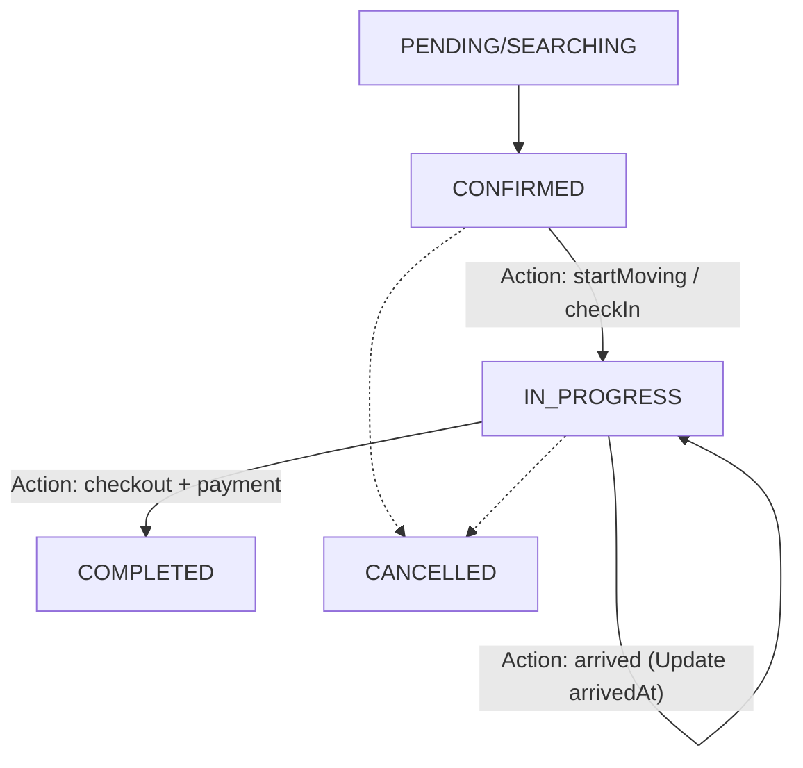

# PETTIES MVP - Happy Flows

**Version:** 1.4.0
**Last Updated:** 2026-01-22  
**Scope:** Core Features (Sprint 1-14)

---

## 1. HF-001: Đăng ký & Đăng nhập

### Pet Owner (Mobile)

```
1. Mở app → Onboarding slides (3 trang)
2. Chọn "Đăng ký" → Nhập email, mật khẩu, họ tên
3. Xác nhận email → Click link kích hoạt
4. Đăng nhập → Vào trang chủ Pet Owner
```

### Clinic Owner (Web)

```
1. Truy cập petties.world → Chọn "Đăng ký Phòng khám"
2. Nhập thông tin: Tên, địa chỉ, SĐT, email
3. Upload giấy phép kinh doanh
4. Wait Admin approve → Nhận email thông báo
5. Đăng nhập → Dashboard Clinic Owner
```

---

## 2. HF-002: Tạo hồ sơ thú cưng

**Actor:** Pet Owner (Mobile)

```
1. Trang chủ → Chọn "Thêm thú cưng"
2. Nhập thông tin: Tên, loài (Chó/Mèo/...), giống, ngày sinh
3. Upload ảnh (optional)
4. Lưu → Pet hiển thị trên trang chủ
```

---

## 3. HF-003: Đặt lịch khám (Booking)

**Actor:** Pet Owner (Mobile)

```
1. Trang chủ → Chọn "Đặt lịch"
2. Tìm phòng khám (theo vị trí/tên)
3. Chọn phòng khám → Xem danh sách dịch vụ
4. Chọn dịch vụ → Chọn ngày → Chọn slot trống
5. Chọn pet → Thêm ghi chú (optional)
6. Chọn phương thức: "Thanh toán online" / "Tiền mặt"
7. Xác nhận → Booking tạo (status: PENDING)
8. Nhận thông báo xác nhận
```

**Actor:** Clinic Manager (Web)

```
1. Dashboard → Xem booking mới (PENDING)
2. Chọn booking → Gán nhân viên
3. Xác nhận → Status: CONFIRMED
4. Nhân viên nhận thông báo
```

**Actor:** Staff (Mobile/Web)

```
1. Xem lịch hẹn → Booking mới (CONFIRMED)
2. Mở chi tiết booking
3. Pet Owner đã nhận thông báo "Đã xác nhận"
```

---

## 4. HF-004: Thực hiện khám (Medical Service)

**Actor:** Staff (Mobile/Web)

```
1. Pet Owner đến phòng khám
2. Check-in (action) → Booking chuyển sang `IN_PROGRESS`
3. Bắt đầu khám khi booking đã ở `IN_PROGRESS`
4. Xem lịch sử bệnh (EMR cũ)
5. Khám, chẩn đoán → Nhập EMR mới:
   - Triệu chứng
   - Chẩn đoán
   - Kế hoạch điều trị
   - Đơn thuốc (optional)
   - Cập nhật tiêm chủng (optional)
6. Lưu EMR → Checkout (action)
7. Thu tiền (nếu Cash) → Status: COMPLETED
```

**Actor:** Pet Owner (Mobile)

```
1. Nhận thông báo "Khám xong"
2. Xem EMR + đơn thuốc trong app
```

---

## 5. HF-005: Thanh toán

### Online (Stripe)

```
1. Khi đặt lịch → Chọn "Thanh toán online"
2. Nhập thẻ → Xác nhận
3. Payment status: PAID
4. Checkout → Không cần thu tiền
```

### Cash

```
1. Khi đặt lịch → Chọn "Tiền mặt"
2. Payment status: UNPAID
3. Checkout → Staff thu tiền
4. Xác nhận → Payment status: PAID
```

---

## 6. HF-006: Đánh giá sau khám

**Actor:** Pet Owner (Mobile)

```
1. Sau khi COMPLETED → Popup đánh giá nhân viên
2. Chọn 1-5 sao → Submit (hoặc Skip)
3. Sau 24h → Nhận thông báo "Đánh giá phòng khám"
4. Chọn 1-5 sao + Viết nhận xét → Submit
```

---

## 7. HF-007: Xem hồ sơ y tế

**Actor:** Pet Owner (Mobile)

```
1. Trang chủ → Chọn pet
2. Tab "Hồ sơ bệnh án" → Danh sách EMR
3. Chọn EMR → Xem chi tiết:
   - Ngày khám
   - Nhân viên
   - Chẩn đoán
   - Đơn thuốc
4. Tab "Tiêm chủng" → Lịch sử tiêm + nhắc nhở
```

---

## 8. HF-008: Quản lý phòng khám

**Actor:** Clinic Owner (Web)

```
1. Dashboard → "Quản lý nhân viên" (Staff Management)
2. Chọn "Thêm nhân viên" (Quick Add)
3. Nhập: Email, Vai trò (Staff/Manager), Specialty (nếu Staff)
4. Lưu → Tài khoản được tạo ngay lập tức (Status: ACTIVE)
5. Nhân viên đăng nhập bằng: Google OAuth (Email đã mời)
```

---

## 9. HF-009: Quản lý lịch nhân viên (Clinic Manager)

**Actor:** Clinic Manager (Web)

### 9.1 Tạo lịch thủ công

```
1. Dashboard → "Lịch làm việc"
2. Chọn nhân viên → Chọn ngày/tuần/tháng
3. Click vào ô trống → Popup "Thêm ca"
4. Nhập: Giờ bắt đầu, Giờ kết thúc, Giờ nghỉ (optional)
5. Lưu → Slots tự động tạo (mỗi 30 phút)
```

### 9.2 Clinic 24/7 - Tạo ca đêm

```
1. Thêm ca đêm: Start = 22:00, End = 06:00
   → System hiểu: Ca kết thúc sáng hôm sau
2. Ví dụ:
   - Dr. Minh: 17/12 06:00 - 14:00 (Ca sáng)
   - Dr. Lan: 17/12 14:00 - 22:00 (Ca chiều)  
   - Dr. Hùng: 17/12 22:00 - 06:00 (Ca đêm → 18/12)
```

### 9.3 Quản lý lịch đã có

```
1. Xem lịch tuần/tháng → Thấy ca của tất cả nhân viên
2. Click ca → Xem chi tiết: slots booked/available
3. Sửa ca → Chỉ được nếu không có booking
4. Xóa ca → Chỉ được nếu không có booking
```

---

## 10. HF-010: Staff xem và quản lý lịch cá nhân

**Actor:** Staff (Mobile/Web)

### 10.1 Xem lịch làm việc

```
1. Mobile: Tab "Lịch" / Web: Menu "Lịch của tôi"
2. Xem calendar tháng → Ngày có ca = đánh dấu màu
3. Chọn ngày → Xem chi tiết ca:
   - Giờ làm: 08:00 - 18:00
   - Nghỉ trưa: 12:00 - 14:00
   - Số slots: 16 slots (8 sáng + 8 chiều)
   - Đã book: 5/16 slots
```

### 10.2 Xem booking trong ca

```
1. Trong ca → Tab "Lịch hẹn"
2. Danh sách booking theo giờ:
   - 08:00 - Mèo Mimi - Khám tổng quát (1 slot)
   - 09:00 - Chó Bobby - Tiêm vaccine (1 slot)
   - 10:00 - 10:30 TRỐNG
   - 11:00 - Mèo Tom - Grooming (2 slots)
3. Click booking → Xem chi tiết pet + owner
```

### 10.3 Xin đổi/hủy ca (nếu cho phép)

```
1. Chọn ca → "Yêu cầu thay đổi"
2. Nhập lý do
3. Gửi → Manager nhận thông báo
4. Manager approve/reject → Staff nhận kết quả
```

---

## 11. HF-011: Admin duyệt phòng khám

**Actor:** Admin (Web)

```
1. Dashboard → "Pending Clinics"
2. Xem chi tiết: Thông tin, giấy phép
3. Approve → Clinic status: APPROVED
4. Clinic Owner nhận email thông báo
   (hoặc)
   Reject + Lý do → Clinic Owner nhận email
```

---

## Status Flow Summary

```
BOOKING:
PENDING → CONFIRMED → IN_PROGRESS → COMPLETED

PAYMENT:
UNPAID (Cash) → PAID (after checkout)
PAID (Online) → PAID (at booking)

STAFF_SHIFT:
SCHEDULED → COMPLETED (sau khi hết ngày)
          → CANCELLED (nếu hủy trước)
```

---

## 12. HF-012: Đổi Email (Change Email)

**Actor:** Pet Owner, Staff, Clinic Owner, Clinic Manager

```
1. Profile Page → Click icon "Edit" cạnh Email
2. Modal hiện ra: "Đổi Email"
3. Nhập email mới
4. Click "Gửi mã OTP"
5. Hệ thống gửi Email chứa OTP (6 số) đến email MỚI
6. User check mail → Lấy OTP (hiệu lực 5 phút)
7. Nhập OTP vào form confirm
8. Click "Xác nhận"
9. Nếu OTP đúng → Email user được cập nhật
10. Hệ thống hiển thị Toast "Cập nhật email thành công"
```

---

## 13. HF-013: Assign Staff to Booking (Chi tiết)

**Actors:** Pet Owner (Mobile), Clinic Manager (Web), Staff (Mobile/Web)

> 📌 **Nguyên tắc:** Mỗi slot = 30 phút. Dịch vụ dù ngắn hơn 30 phút vẫn chiếm tối thiểu 1 slot.

### 13.1 Kịch bản: Đặt lịch "Tiêm Vaccine" (1 slot = 30 phút)

#### Phase 1: Pet Owner Đặt Lịch

```
1. Pet Owner mở app → Chọn "Đặt lịch"
2. Tìm và chọn "Phòng khám ABC"
3. Chọn dịch vụ: "Tiêm Vaccine" (10 phút thực tế, 1 slot required)
4. Chọn ngày: 25/12/2024
5. Hệ thống hiển thị các slot trống:
   ✅ 08:00 | ✅ 08:30 | ✅ 09:00 | ❌ 09:30 (đã book)
   ✅ 10:00 | ✅ 10:30 | ...
6. Pet Owner chọn: 09:00
7. Chọn pet: "Mèo Mimi"
8. Chọn thanh toán: "Tiền mặt"
9. Xác nhận đặt lịch
```

**Database Changes:**
```
✅ BOOKING created:
   - id: #B001
   - clinic_id: ABC
   - service_id: VACCINE_001
   - pet_id: MIMI
   - booking_date: 2024-12-25
   - booking_time: 09:00
   - assigned_staff_id: NULL
   - status: PENDING
   - total_price: 150,000 VND

✅ NOTIFICATION created → Clinic Manager
   - "Booking mới #B001 cần gán nhân viên"
```

---

#### Phase 2: Manager Xem Dashboard

```
1. Manager đăng nhập Web Dashboard
2. Thấy badge "3 booking pending" 
3. Click vào "Booking cần xử lý"
4. Danh sách hiển thị:
   
   | # | Booking | Pet | Service | Thời gian | Status |
   |---|---------|-----|---------|-----------|--------|
   | 1 | #B001 | Mèo Mimi | Tiêm Vaccine | 25/12 09:00 | PENDING |
   | 2 | #B002 | Chó Max | Khám TQ | 25/12 10:00 | PENDING |
   | 3 | #B003 | Mèo Luna | Grooming (2 slots) | 25/12 14:00 | PENDING |
```

---

#### Phase 3: Manager Gán Staff

```
1. Manager click vào booking #B001
2. Popup chi tiết hiển thị:
   ┌─────────────────────────────────────────┐
   │ BOOKING #B001                           │
   ├─────────────────────────────────────────┤
   │ 🐱 Pet: Mèo Mimi (Mèo Anh lông ngắn)   │
   │ 👤 Owner: Nguyễn Văn A - 0909xxx       │
   │ 💉 Service: Tiêm Vaccine (1 slot)       │
   │ 📅 Thời gian: 25/12/2024 09:00-09:30   │
   │ 💰 Giá: 150,000 VND (Tiền mặt)         │
   │ 📝 Ghi chú: (không có)                  │
   └─────────────────────────────────────────┘

3. Click nút "Gán Nhân viên"
4. Hệ thống query: Tìm STAFF có slot 09:00 AVAILABLE ngày 25/12
   
   SELECT v.id, v.full_name, shift.start_time, shift.end_time
   FROM users v
   JOIN staff_shifts shift ON shift.staff_id = v.id
   JOIN slots s ON s.shift_id = shift.id
   WHERE shift.clinic_id = 'ABC'
     AND shift.work_date = '2024-12-25'
     AND s.start_time = '09:00'
     AND s.status = 'AVAILABLE';

5. Popup hiển thị danh sách Staff khả dụng:
   ┌─────────────────────────────────────────┐
   │ CHỌN BÁC SĨ CHO SLOT 09:00             │
   ├─────────────────────────────────────────┤
   │ ✅ Dr. Minh Nguyễn                      │
   │    Ca: 08:00-18:00 | Trống: 12/16 slots │
   │    Rating: ⭐ 4.8 (120 reviews)         │
   ├─────────────────────────────────────────┤
   │ ✅ Dr. Lan Trần                         │
   │    Ca: 08:00-12:00 | Trống: 6/8 slots   │
   │    Rating: ⭐ 4.5 (85 reviews)          │
   ├─────────────────────────────────────────┤
   │ ❌ Dr. Hùng Phạm                        │
   │    Ca: 14:00-22:00 (Chưa bắt đầu)       │
   └─────────────────────────────────────────┘

6. Manager chọn "Dr. Minh Nguyễn"
7. Confirm → Hệ thống xử lý
```

**Database Changes (Transaction):**
```
BEGIN TRANSACTION;

-- 1. Lock slot 09:00
UPDATE slots SET status = 'BOOKED'
WHERE shift_id = [Dr.Minh's shift] AND start_time = '09:00';

-- 2. Create junction record
INSERT INTO booking_slots (booking_id, slot_id)
VALUES ('B001', [slot_09:00_id]);

-- 3. Update booking
UPDATE bookings SET 
    assigned_staff_id = [Dr.Minh_id],
    status = 'PENDING_CLINIC_CONFIRM'
WHERE id = 'B001';

-- 4. Create notification for Staff
INSERT INTO notifications (user_id, type, title, content)
VALUES ([Dr.Minh_id], 'BOOKING', 'Booking mới', 
        'Bạn được gán booking #B001 - Tiêm Vaccine lúc 09:00');

COMMIT;
```

**UI Feedback:**
```
✅ Toast: "Đã gán Dr. Minh cho booking #B001"
✅ Booking status badge: PENDING → CONFIRMED (màu xanh)
✅ Staff nhận push notification
```

---

#### Phase 4: Staff Nhận Assignment (Không cần Accept/Reject)

> 💡 **Lưu ý:** Staff KHÔNG có quyền Accept/Reject. Khi Manager assign, booking tự động CONFIRMED.

**Khi Manager assign xong:**

```
1. System tự động:
   - Status: PENDING → CONFIRMED
   - Notify Pet Owner: "Lịch hẹn đã xác nhận"
   - Notify Staff: "Bạn có lịch hẹn mới"

2. Dr. Minh nhận notification trên app
3. Click vào → Xem chi tiết booking:
   ┌─────────────────────────────────────────┐
   │ 📅 LỊCH HẸN ĐƯỢC GÁN                    │
   ├─────────────────────────────────────────┤
   │ 🐱 Pet: Mèo Mimi                        │
   │ 💉 Dịch vụ: Tiêm Vaccine                │
   │ ⏰ Thời gian: 25/12 09:00-09:30         │
   │ 📍 Địa điểm: Phòng khám ABC             │
   │ 👤 Chủ: Nguyễn Văn A                    │
   ├─────────────────────────────────────────┤
   │   [📞 GỌI CHỦ PET]   [🗺️ XEM ĐỊA CHỈ]   │
   └─────────────────────────────────────────┘
4. Staff chuẩn bị thực hiện dịch vụ vào giờ hẹn
```

**Database Changes (khi Manager assign):**
```sql
-- 1. Update booking - trực tiếp CONFIRMED
UPDATE bookings SET 
    assigned_staff_id = [Dr.Minh_id],
    status = 'CONFIRMED'
WHERE id = 'B001';

-- 2. Notify Pet Owner
INSERT INTO notifications (user_id, type, title, content)
VALUES ([PetOwner_id], 'BOOKING', 'Lịch hẹn đã xác nhận', 
        'Dr. Minh sẽ khám Tiêm Vaccine lúc 09:00 ngày 25/12');

-- 3. Notify Staff
INSERT INTO notifications (user_id, type, title, content)
VALUES ([Dr.Minh_id], 'BOOKING', 'Lịch hẹn mới', 
        'Bạn được gán booking #B001 - Tiêm Vaccine lúc 09:00');
```

**UI Feedback:**
```
✅ Manager Dashboard: Toast "Đã gán Dr. Minh cho booking #B001"
✅ Booking status badge: PENDING → CONFIRMED (màu xanh)
✅ Staff nhận push notification
✅ Pet Owner nhận push notification xác nhận
```

---

### 13.2 Kịch bản: Đặt lịch Multi-Slot (Grooming 2 slots)

#### Khác biệt chính:

```
1. Service: "Grooming cơ bản" (60 phút, 2 slots required)
2. Pet Owner chọn: 14:00
3. Hệ thống check: slot 14:00 + 14:30 đều AVAILABLE?
   - Nếu cả 2 trống → ✅ Hiển thị 14:00
   - Nếu thiếu 1 slot → ❌ Không hiển thị 14:00
4. Manager gán Staff → Hệ thống lock CẢ 2 slots:
   - slot 14:00: BOOKED
   - slot 14:30: BOOKED
5. Tạo 2 records trong BOOKING_SLOT:
   - (booking_id, slot_14:00)
   - (booking_id, slot_14:30)
6. Status tự động CONFIRMED (không cần Staff accept)
```

**Query tìm Staff có đủ 2 slot liên tiếp:**
```sql
SELECT v.id, v.full_name
FROM users v
 JOIN staff_shifts shift ON shift.staff_id = v.id
WHERE shift.clinic_id = 'ABC'
  AND shift.work_date = '2024-12-25'
  AND EXISTS (
    SELECT 1 FROM slots s1, slots s2
    WHERE s1.shift_id = shift.id
      AND s2.shift_id = shift.id
      AND s1.start_time = '14:00'
      AND s2.start_time = '14:30'
      AND s1.status = 'AVAILABLE'
      AND s2.status = 'AVAILABLE'
  );
```

---

### 13.3 Timeline Ví Dụ Sau Assign

**Dr. Minh - 25/12/2024 - Buổi sáng:**

```
| Slot | S1     | S2     | S3     | S4     | S5     | S6     | S7     | S8     |
|------|--------|--------|--------|--------|--------|--------|--------|--------|
| Giờ  | 08:00  | 08:30  | 09:00  | 09:30  | 10:00  | 10:30  | 11:00  | 11:30  |
| Book | FREE   | FREE   | #B001  | #B002  | #B002  | #B003  | #B003  | FREE   |
|      |        |        | Vaccine| Khám+XN| Khám+XN| Groom  | Groom  |        |
|      |        |        | 1 slot | 2 slots        | 2 slots        |        |
```

**Legend:**
- 🟢 FREE: Slot trống, có thể nhận booking mới
- 🔵 #B001, #B002, #B003: Booking đã CONFIRMED (sau khi Manager assign)

---

### 13.4 Minimum Slot Rule trong Action

| Service | Thời gian thực | Slots | Slot Time | Buffer |
|---------|----------------|-------|-----------|--------|
| Tiêm vaccine | 10 phút | 1 | 09:00-09:30 | +20 phút |
| Khám nhanh | 15 phút | 1 | 09:30-10:00 | +15 phút |
| Tư vấn | 20 phút | 1 | 10:00-10:30 | +10 phút |
| Khám TQ | 30 phút | 1 | 10:30-11:00 | 0 phút |
| Khám+XN | 45 phút | 2 | 11:00-12:00 | +15 phút |
| Grooming | 60 phút | 2 | 14:00-15:00 | 0 phút |

> 💡 **Buffer time** được sử dụng cho: ghi EMR, chuẩn bị dụng cụ, nghỉ ngơi giữa ca.

---

### 13.5 Error Cases

| Case | Xử lý |
|------|-------|
| Không có Staff nào có slot trống | Hiển thị "Không có nhân viên khả dụng. Vui lòng chọn giờ khác." |
| Staff được gán nhưng shift bị hủy | Manager tự động được notify để gán lại |
| Pet Owner hủy lúc CONFIRMED | Slot được restore, Staff được notify |
| Double-assign (race condition) | Database constraint + Transaction isolation |

---

## 14. HF-014: SOS Emergency Geo-Tracking (Real-time)

**Actors:** Staff (Mobile), Pet Owner (Mobile), System

> 📌 **Áp dụng cho:** Tất cả booking có `type = SOS` (Cấp cứu khẩn cấp)
> 
> 🗺️ **Tính năng:** Tracking vị trí nhân viên realtime giống Grab/Gojek

### 14.1 Preconditions

```
✅ Booking type = SOS (Emergency)
✅ Booking status = CONFIRMED hoặc IN_PROGRESS (SOS mode)
✅ Đến giờ hẹn (hoặc trước 30 phút)
✅ Staff app có quyền GPS
✅ Pet Owner app có internet
```

---

### 14.2 Kịch bản Chi Tiết

#### Phase 1: Staff Bắt Đầu Di Chuyển (Start Travel)

**Actor:** Staff (Mobile)

```
1. Staff mở app → Tab "Lịch hẹn hôm nay"
2. Thấy booking HOME_VISIT với badge "CONFIRMED"
3. Click vào booking → Chi tiết hiển thị:
   ┌─────────────────────────────────────────┐
   │ 🏠 HOME VISIT - #B001                   │
   ├─────────────────────────────────────────┤
   │ 🐱 Pet: Mèo Mimi                        │
   │ 👤 Chủ: Nguyễn Văn A - 0909xxx         │
   │ 💉 Dịch vụ: Tiêm Vaccine                │
   │ ⏰ Giờ hẹn: 14:00                       │
   │ 📍 Địa chỉ: 123 Nguyễn Văn Linh, Q.7   │
   │    Khoảng cách: ~5.2 km                 │
   ├─────────────────────────────────────────┤
   │         [🚗 BẮT ĐẦU DI CHUYỂN]          │
   └─────────────────────────────────────────┘

4. Staff click "Bắt đầu di chuyển"
5. App yêu cầu quyền GPS (nếu chưa có)
6. Confirm popup: "Bắt đầu tracking vị trí?"
7. Click "Xác nhận"
```

**Database Changes:**
```sql
-- 1. Update booking status
UPDATE bookings SET 
    status = 'IN_PROGRESS',
    staff_current_lat = [current_lat],
    staff_current_long = [current_long]
WHERE id = 'B001';

-- 2. Notify Pet Owner
INSERT INTO notifications (user_id, type, title, content)
VALUES ([PetOwner_id], 'BOOKING', 'Nhân viên đang đến!', 
        'Dr. Minh đã bắt đầu di chuyển đến nhà bạn.');
```

**System Actions:**
```
✅ Booking status: CONFIRMED → IN_PROGRESS
✅ GPS tracking started (interval: 30 giây)
✅ Push notification → Pet Owner
✅ Staff app hiển thị: "Đang tracking vị trí..."
```

---

#### Phase 2: GPS Tracking Realtime

**Actor:** System (Background Service)

```
Trong khi status = IN_PROGRESS:
  1. App Staff gửi GPS coordinates mỗi 30 giây
  2. System cập nhật vào booking:
     - staff_current_lat
     - staff_current_long
  3. Tính toán ETA (estimated time of arrival)
  4. Kiểm tra khoảng cách đến địa chỉ
```

**API Call (mỗi 30 giây):**
```json
PUT /api/bookings/B001/location
{
    "latitude": 10.7456789,
    "longitude": 106.6789012,
    "accuracy": 15.5,
    "timestamp": "2024-12-25T13:45:30Z"
}
```

**Response:**
```json
{
    "success": true,
    "distance_remaining_km": 3.2,
    "eta_minutes": 8
}
```

---

#### Phase 3: Pet Owner Xem Bản Đồ Realtime

**Actor:** Pet Owner (Mobile)

```
1. Pet Owner nhận push notification: "Nhân viên cứu hộ đang đến!"
2. Click vào notification → Mở app
3. Xem booking detail → Tab "SOS Tracking"
4. Bản đồ hiển thị:

   ┌─────────────────────────────────────────┐
   │      🗺️ BẢN ĐỒ TRACKING                │
   ├─────────────────────────────────────────┤
   │                                         │
   │  [Map với 2 markers:]                   │
   │                                         │
   │  🏥 Phòng khám ABC                      │
   │    │                                    │
   │    │ ← Đường di chuyển (polyline)       │
   │    │                                    │
   │  👨‍⚕️ Dr. Minh (realtime)                │
   │    │                                    │
   │    │                                    │
   │  🏠 Nhà bạn                             │
   │                                         │
   ├─────────────────────────────────────────┤
   │ 📍 Còn ~3.2 km | ⏱️ ~8 phút nữa         │
   │ 🚗 Dr. Minh đang di chuyển...          │
   └─────────────────────────────────────────┘

5. Bản đồ tự động cập nhật mỗi 30 giây
6. Pet Owner có thể:
   - Phóng to/thu nhỏ bản đồ
   - Xem đường đi dự kiến
   - Gọi điện cho nhân viên
```

**Tech Implementation:**
```
📍 Map Provider: Google Maps / Mapbox
🔄 Realtime Update: WebSocket hoặc Polling (30s)
📏 Route Display: Directions API
⏱️ ETA Calculation: Distance Matrix API
```

---

#### Phase 4: Thông Báo Sắp Đến & Tự Động Ngưng Tracking

**Actor:** System, Pet Owner (Mobile)

```
1. Khi khoảng cách <= 500m:
   - System gởi notification: "Nhân viên sắp đến!"
2. Khi Staff nhấn "ĐÃ ĐẾN NƠI" (Phase 5) hoặc hệ thống phát hiện `arrivedAt` được set:
   - App Pet Owner (polling mỗi 15s) tự động cancel Timer polling và unsubscribe WebSocket tracking.
   - Giao diện tracking chuyển từ "Bác sĩ đang trên đường" sang "✅ Bác sĩ đã đến và đang hỗ trợ thú cưng của bạn".
```

**Push Notification:**
```json
{
    "title": "Nhân viên sắp đến!",
    "body": "Dr. Minh còn cách nhà bạn khoảng 500m. Vui lòng chuẩn bị.",
    "data": {
        "booking_id": "B001",
        "type": "STAFF_ARRIVING"
    }
}
```

---

#### Phase 5: Đến Nơi & Checkout (Xác nhận & Thu phí)

**Actor:** Staff (Mobile)

```
1. Staff đến địa chỉ khách hàng.
2. Staff nhấn nút "ĐÃ ĐẾN NƠI" trên App:
   - App Staff tự động dừng background GPS tracking.
   - Gọi API /arrived → cập nhật `arrivedAt` trong database.
   - Badge "Đã đến nơi ✓" hiện thị màu xanh trên màn hình detail.
3. Sau khi hỗ trợ thú cưng xong, Staff nhấn "THANH TOÁN":
   - Checkout Confirmation Dialog hiện lên với đầy đủ thông tin:
     + Thông tin khách hàng (Tên, SĐT, Địa chỉ).
     + Thông tin thú cưng.
     + Danh sách dịch vụ phát sinh đã thêm.
     + Phí SOS & Phí di chuyển (từ cấu hình clinic).
     + Tổng tiền in đậm.
4. Staff xác nhận → Booking status: di chuyển từ CONFIRMED sang IN_PROGRESS (từ hành động startMoving) và kết thúc tại COMPLETED (sau checkout).
```
 
 **System Actions:**
 ```sql
 -- 1. Notify Pet Owner
 INSERT INTO notifications (user_id, type, title, content)
 VALUES ([PetOwner_id], 'BOOKING', 'Bắt đầu cứu hộ/khám', 
         'Dr. Minh đã đến và bắt đầu quá trình hỗ trợ thú cưng của bạn.');
 ```

---

### 14.3 Status Flow (Home Visit & SOS)



> [!IMPORTANT]
> `ON_THE_WAY` and `CHECK_OUT` are NOT official statuses in the database.
> They are UI states or logical actions that happen while the Booking is in `IN_PROGRESS` or transitioning to it.

---

### 14.4 Database Fields Used

| Field | Type | Description |
|-------|------|-------------|
| `booking.type` | ENUM | = 'HOME_VISIT' |
| `booking.status` | ENUM | PENDING → CONFIRMED → IN_PROGRESS → COMPLETED |
| `booking.home_address` | VARCHAR | Địa chỉ nhà khách |
| `booking.staff_current_lat` | DECIMAL | Latitude hiện tại của Staff |
| `booking.staff_current_long` | DECIMAL | Longitude hiện tại của Staff |
| `booking.distance_km` | DECIMAL | Khoảng cách tính từ clinic |

---

### 14.5 Notification Timeline

| Thời điểm | Notification | Gửi đến |
|-----------|--------------|---------|
| Staff click "Bắt đầu di chuyển" | "Nhân viên đang đến!" | Pet Owner |
| Khoảng cách <= 500m | "Nhân viên sắp đến!" | Pet Owner |
| Staff check-in | "Bắt đầu cứu hộ/khám" | Pet Owner |

---

### 14.6 Error Cases

| Case | Xử lý |
|------|-------|
| Staff mất GPS signal | Hiển thị vị trí cuối cùng + badge "GPS yếu" |
| Pet Owner không có internet | Cache vị trí cuối, hiển thị khi có mạng |
| Staff đi sai đường / delay | ETA tự động update |
| Staff hủy giữa chừng | Notify Pet Owner + Manager, status = CANCELLED |
| Pet Owner không ở nhà | Staff gọi điện, nếu không được → NO_SHOW |

---

### 14.7 Technical Notes

```
📱 Mobile Implementation (Flutter):
- Geolocator package: GPS tracking
- Google Maps Flutter: Bản đồ
- WebSocket / SSE: Realtime updates
- Background service: Track khi app minimized

🖥️ Backend Implementation (Spring Boot):
- WebSocket endpoint: /ws/booking/{id}/location
- REST endpoint: PUT /api/bookings/{id}/location
- Redis PubSub: Broadcast location updates
- Haversine formula: Tính khoảng cách

🔔 Notifications:
- Firebase Cloud Messaging (FCM)
- Scheduled notifications (ETA-based)
```

---

## 15. HF-015: Chat 1-1 (Pet Owner ↔ Manager/Staff)

**Actors:** Pet Owner (Mobile), Clinic Manager (Web), Staff (Mobile/Web)

> 📌 **Mục đích:** Giao tiếp trực tiếp giữa Pet Owner với nhân viên Clinic về booking

### 15.1 Preconditions

```
✅ Pet Owner có booking với Clinic
✅ Booking status: CONFIRMED hoặc IN_PROGRESS
✅ Cả 2 bên có tài khoản active
```

---

### 15.2 Kịch bản: Pet Owner Chat với Manager

**Actor:** Pet Owner (Mobile)

```
1. Pet Owner mở chi tiết booking
2. Thấy nút "💬 Chat với Phòng khám"
3. Click → Mở màn hình chat
4. Nhập tin nhắn: "Tôi muốn đổi giờ hẹn..."
5. Send → Tin nhắn gửi đi
6. Manager nhận notification
7. Manager reply → Pet Owner nhận tin
```

**Actor:** Clinic Manager (Web)

```
1. Dashboard → Section "Tin nhắn mới" (badge count)
2. Click → Danh sách conversations
3. Chọn conversation với Pet Owner
4. Xem booking context (pet, service, date)
5. Reply: "Dạ, chị có thể đổi sang 15:00 không ạ?"
6. Pet Owner nhận notification
```

---

### 15.3 Kịch bản: Pet Owner Chat với Staff

**Trigger:** Sau khi Staff được gán cho booking (status = CONFIRMED)

```
1. Pet Owner mở chi tiết booking
2. Thấy thông tin Staff được gán
3. Nút "💬 Chat với Nhân viên" xuất hiện
4. Click → Mở chat với Staff
5. Nhắn: "Nhân viên ơi, mèo em bị nôn từ sáng..."
6. Staff nhận notification + reply
```

---

### 15.4 Database Schema

```sql
-- CHAT_CONVERSATION: 1-1 only
CREATE TABLE chat_conversations (
    id UUID PRIMARY KEY,
    user1_id UUID REFERENCES users(id),
    user2_id UUID REFERENCES users(id),
    booking_id UUID REFERENCES bookings(id) NULL,
    created_at TIMESTAMP,
    last_message_at TIMESTAMP
);

-- CHAT_MESSAGE
CREATE TABLE chat_messages (
    id UUID PRIMARY KEY,
    conversation_id UUID REFERENCES chat_conversations(id),
    sender_id UUID REFERENCES users(id),
    content TEXT NOT NULL,
    is_read BOOLEAN DEFAULT FALSE,
    created_at TIMESTAMP
);
```

---

### 15.5 Notifications

| Event | Notification | Gửi đến |
|-------|--------------|---------|
| New message | "Tin nhắn mới từ [Name]" | Recipient |
| First message | "Cuộc hội thoại mới về booking #XXX" | Recipient |

---

## 16. HF-016: AI Chatbot (Single Agent + ReAct)

**Actors:** Pet Owner (Mobile), AI Agent (System), Admin (Web - Config)

> 📌 **Architecture:** Single Agent với ReAct pattern, nhiều skills/tools từ MCP

### 16.1 Preconditions

```
✅ Pet Owner đã đăng nhập
✅ AI Agent status = ENABLED (Admin config)
✅ Knowledge Base đã được index
```

---

### 16.2 Kịch bản: Hỏi Đáp Chăm Sóc Pet (RAG)

**Actor:** Pet Owner (Mobile)

```
1. Pet Owner mở tab "AI Assistant" 🤖
2. Nhập: "Mèo của tôi bị sổ mũi nên làm gì?"
3. Send → Loading indicator
4. Agent reasoning (internal):
   ┌─────────────────────────────────────────────┐
   │ THOUGHT: User hỏi về triệu chứng sổ mũi    │
   │ ACTION: Call pet_knowledge_search("mèo sổ mũi") │
   │ OBSERVATION: RAG trả về 3 chunks...        │
   │ THOUGHT: Có đủ thông tin để trả lời        │
   │ ANSWER: "Mèo sổ mũi có thể do..."          │
   └─────────────────────────────────────────────┘
5. Response hiển thị với citations (nguồn tham khảo)
6. Pet Owner có thể hỏi tiếp (multi-turn)
```

---

### 16.3 Kịch bản: Tìm Bệnh Theo Triệu Chứng

**Actor:** Pet Owner (Mobile)

```
1. Nhập: "Chó nhà tôi bỏ ăn 2 ngày, uống nước nhiều, lông xù"
2. Agent reasoning:
   ┌─────────────────────────────────────────────┐
   │ THOUGHT: User mô tả triệu chứng, cần lookup │
   │ ACTION: pet_knowledge_search("chó bỏ ăn, uống │
   │         nước nhiều, lông xù")               │
   │ OBSERVATION: Có thể: Tiểu đường, Suy thận..│
   │ THOUGHT: Cần thêm context từ RAG           │
   │ ACTION: pet_knowledge_search("chó tiểu đường") │
   │ OBSERVATION: Triệu chứng, cách nhận biết...│
   │ ANSWER: "Dựa trên triệu chứng, có thể..."  │
   └─────────────────────────────────────────────┘
3. Response với danh sách bệnh có thể + khuyến nghị đi khám
```

---

### 16.4 Kịch bản: Đặt Lịch Qua Chat

**Actor:** Pet Owner (Mobile)

```
1. Nhập: "Tôi muốn đặt lịch khám cho mèo ở Quận 7"
2. Agent reasoning:
   ┌─────────────────────────────────────────────┐
   │ THOUGHT: User muốn đặt lịch, cần tìm clinic │
   │ ACTION: search_clinics_nearby(user_location) │
   │ OBSERVATION: 3 clinics: ABC, XYZ, DEF...    │
   │ ANSWER: "Có 3 phòng khám gần bạn..."        │
   └─────────────────────────────────────────────┘
3. User: "Chọn ABC, ngày mai có slot không?"
4. Agent:
   ┌─────────────────────────────────────────────┐
   │ ACTION: check_available_slots("clinic_abc", │
   │         "2025-01", ["service_checkup"])    │
   │ OBSERVATION: Slots: 09:00, 10:30, 14:00... │
   │ ANSWER: "Ngày mai có các slot: ..."         │
   └─────────────────────────────────────────────┘
5. User: "Đặt lúc 14:00 cho mèo Mimi, khám tổng quát"
6. Agent:
   ┌─────────────────────────────────────────────┐
   │ ACTION: create_booking_for_user(            │
   │         pet_mimi, clinic_abc, date_tomorrow,│
   │         slot_14, [service_checkup])         │
   │ OBSERVATION: Booking created, code: #B123   │
   │ ANSWER: "Đã đặt lịch thành công! #B123..."  │
   └─────────────────────────────────────────────┘
```

---

### 16.5 Admin Config Flow

**Actor:** Admin (Web)

```
1. Admin truy cập "AI Configuration"
2. Màn hình config:
   ┌─────────────────────────────────────────────┐
   │ AI AGENT CONFIGURATION                      │
   ├─────────────────────────────────────────────┤
   │ Status: [🟢 ENABLED]                        │
   │                                             │
   │ System Prompt:                              │
   │ ┌─────────────────────────────────────────┐ │
   │ │ Bạn là trợ lý AI của Petties...        │ │
   │ └─────────────────────────────────────────┘ │
   │                                             │
   │ Model: [gemini-2.0-flash ▼]                 │
   │ Temperature: [0.7]                          │
   │ Max Tokens: [2048]                          │
   │                                             │
   │ Tools:                                      │
   │ [✅] pet_knowledge_search                   │
   │ [✅] web_search                             │
   │ [✅] get_user_pets                          │
   │ [✅] search_clinics_nearby                  │
   │ [✅] check_available_slots                  │
   │ [✅] create_booking_for_user                │
   │                                             │
   │ Knowledge Base: 15 docs | 2,456 vectors     │
   │ [📤 Upload] [🗑️ Clear] [🔄 Re-index]        │
   │                                             │
   │              [💾 SAVE]                      │
   └─────────────────────────────────────────────┘
3. Admin chỉnh sửa → Save → Hot reload (không restart)
```

---

### 16.7 Kịch bản: Phân tích hình ảnh (Vision Health Analysis - Planned Scope, chưa implement)

**Actor:** Pet Owner (Mobile)

```
1. Pet Owner gặp vấn đề (ví dụ: pet bị phát ban, vết thương hở).
2. Mở "AI Assistant" → Nhấn icon Camera/Gallery.
3. Chọn/Chụp ảnh vần đề của pet → Gửi.
4. Ảnh được upload lên Cloudinary → URL gửi về AI Agent.
5. Agent reasoning:
   ┌─────────────────────────────────────────────┐
   │ THOUGHT: Nhận được hình ảnh từ user         │
   │ ACTION: analyze_pet_image(image_url)        │
   │ OBSERVATION: Phát hiện "viêm da dị ứng",    │
   │              mức độ: Moderate               │
   │ THOUGHT: Cần tìm clinic gần nhất để gợi ý   │
   │ ACTION: search_clinics_nearby(lat, lng)     │
   │ OBSERVATION: 3 clinics nearby...            │
   │ ANSWER: "Phát hiện dấu hiệu viêm da. Nên..."│
   └─────────────────────────────────────────────┘
6. AI trả lời kèm Cảnh báo + Booking Suggestion Card.
7. Pet Owner nhấn "Đặt lịch ngay" trên card → Chuyển đến Booking Flow với thông tin điền sẵn.
```

---

### 16.8 Tech Stack


```
📱 Mobile (Flutter):
- Chat UI với message bubbles
- Typing indicator
- Citation display (expandable)

🖥️ Backend (FastAPI):
- POST /api/v1/chat - Send message
- GET /api/v1/chat/history - Chat history
- WebSocket /ws/chat/{session_id} - Realtime

🤖 AI Agent:
- LLM: OpenRouter (gemini-2.0-flash, llama-3.3, claude)
- Pattern: ReAct (Reason + Act)
- Tools: FastMCP (@mcp.tool)
- RAG: LlamaIndex + Qdrant Cloud
- Embeddings: Cohere embed-multilingual-v3

⚙️ Admin Config:
- DB-stored configuration
- Hot-reload without restart
```

---

### 16.7 Error Cases

| Case | Xử lý |
|------|-------|
| Agent disabled | Hiển thị "Trợ lý AI đang bảo trì" |
| LLM API error | Retry 3 lần, sau đó show "Vui lòng thử lại" |
| Tool execution failed | Agent tự handle, fallback to general response |
| RAG no results | Agent sử dụng general knowledge |
| Rate limit exceeded | Queue request, notify user |

---

## 17. HF-017: Tìm Kiếm & Xem Chi Tiết Phòng Khám

**Actors:** Pet Owner (Mobile)

> 📌 **Mục đích:** Pet Owner tìm phòng khám phù hợp dựa trên vị trí, dịch vụ và đánh giá

### 17.1 Preconditions

```
✅ Pet Owner đã đăng nhập trên Mobile App
✅ GPS permission được cấp (optional cho nearby search)
✅ Có ít nhất 1 Clinic status = APPROVED trong hệ thống
```

---

### 17.2 Kịch bản: Tìm Phòng Khám Gần Đây

**Actor:** Pet Owner (Mobile)

```
1. Pet Owner mở app → Tab "Khám phá"
2. Hiển thị bản đồ với các phòng khám gần nhất (GPS-based)
   ┌─────────────────────────────────────────┐
   │      🗺️ BẢN ĐỒ PHÒNG KHÁM              │
   ├─────────────────────────────────────────┤
   │                                         │
   │  [Map với markers phòng khám]           │
   │                                         │
   │  📍 Vị trí của bạn                      │
   │  🏥 Phòng khám ABC (0.5km)              │
   │  🏥 Phòng khám XYZ (1.2km)              │
   │  🏥 Pet Care Center (2.0km)             │
   │                                         │
   ├─────────────────────────────────────────┤
   │ 🔍 [Tìm kiếm theo tên hoặc địa chỉ]    │
   │ 📋 [Xem danh sách] | 🗺️ [Xem bản đồ]   │
   └─────────────────────────────────────────┘

3. Chuyển sang chế độ List → Danh sách dọc:
   ┌─────────────────────────────────────────┐
   │ 🏥 Phòng khám ABC                       │
   │    📍 0.5 km | ⭐ 4.8 (120 đánh giá)    │
   │    🏷️ Khám tổng quát, Tiêm vaccine     │
   │    ⏰ Đang mở (8:00 - 20:00)            │
   ├─────────────────────────────────────────┤
   │ 🏥 Phòng khám XYZ                       │
   │    📍 1.2 km | ⭐ 4.5 (85 đánh giá)     │
   │    🏷️ Phẫu thuật, Cấp cứu 24/7         │
   │    ⏰ Mở 24/7                           │
   └─────────────────────────────────────────┘
```

---

### 17.3 Kịch bản: Lọc Phòng Khám

**Actor:** Pet Owner (Mobile)

```
1. Trên màn hình danh sách → Nhấn icon "Bộ lọc" 🔽
2. Modal Filter hiển thị:
   ┌─────────────────────────────────────────┐
   │ 🔽 BỘ LỌC                               │
   ├─────────────────────────────────────────┤
   │ 📍 Khoảng cách:                         │
   │    ○ Dưới 1 km                          │
   │    ● Dưới 5 km                          │
   │    ○ Dưới 10 km                         │
   │    ○ Tất cả                             │
   ├─────────────────────────────────────────┤
   │ 🏷️ Dịch vụ:                             │
   │    [✅] Khám tổng quát                  │
   │    [  ] Tiêm vaccine                    │
   │    [✅] Cấp cứu 24/7                    │
   │    [  ] Grooming                        │
   ├─────────────────────────────────────────┤
   │ ⭐ Đánh giá tối thiểu:                  │
   │    ★★★★☆ (4 sao trở lên)               │
   ├─────────────────────────────────────────┤
   │ 🏙️ Khu vực:                             │
   │    [Quận 7 ▼]                           │
   ├─────────────────────────────────────────┤
   │         [🔄 XÓA BỘ LỌC]                 │
   │         [✅ ÁP DỤNG]                    │
   └─────────────────────────────────────────┘

3. Nhấn "Áp dụng" → Danh sách được lọc
4. Badge hiển thị số filter đang active
```

---

### 17.4 Kịch bản: Xem Chi Tiết Phòng Khám

**Actor:** Pet Owner (Mobile)

```
1. Từ danh sách → Click vào phòng khám
2. Màn hình chi tiết hiển thị:
   ┌─────────────────────────────────────────┐
   │ ← PHÒNG KHÁM ABC                        │
   ├─────────────────────────────────────────┤
   │ [Gallery ảnh - swipe]                   │
   │ 📷 📷 📷                                │
   ├─────────────────────────────────────────┤
   │ 📍 123 Nguyễn Văn Linh, Quận 7, TP.HCM │
   │ 📞 028 1234 5678                        │
   │ ⏰ Đang mở: 8:00 - 20:00                │
   │ ⭐ 4.8 (120 đánh giá)                   │
   ├─────────────────────────────────────────┤
   │ 🏷️ DỊCH VỤ                              │
   │ • Khám tổng quát - 200,000₫            │
   │ • Tiêm vaccine - 150,000₫              │
   │ • Xét nghiệm máu - 350,000₫            │
   │ • Grooming - 250,000₫                  │
   ├─────────────────────────────────────────┤
   │ 👨‍⚕️ ĐỘI NGŨ BÁC SĨ                       │
   │ [Avatar] Dr. Minh ⭐4.9                 │
   │ [Avatar] Dr. Lan ⭐4.7                  │
   ├─────────────────────────────────────────┤
   │ 💬 ĐÁNH GIÁ GẦN ĐÂY                     │
   │ ⭐⭐⭐⭐⭐ - "Nhân viên rất tận tình..."    │
   │ ⭐⭐⭐⭐☆ - "Phòng khám sạch sẽ..."      │
   │ [Xem tất cả 120 đánh giá →]            │
   ├─────────────────────────────────────────┤
   │         [📅 ĐẶT LỊCH NGAY]              │
   └─────────────────────────────────────────┘

3. Nhấn "Đặt lịch ngay" → Chuyển sang HF-003 (Booking Flow)
```

---

### 17.5 API Endpoints

| Endpoint | Method | Description |
|----------|--------|-------------|
| `/api/clinics/nearby` | GET | Lấy phòng khám gần vị trí (lat, long, radius) |
| `/api/clinics/{id}` | GET | Chi tiết phòng khám |
| `/api/clinics/{id}/services` | GET | Danh sách dịch vụ |
| `/api/clinics/{id}/vets` | GET | Danh sách nhân viên |
| `/api/clinics/{id}/reviews` | GET | Đánh giá phòng khám |
| `/api/clinics/search` | GET | Tìm kiếm theo tên/địa chỉ |

---

### 17.6 Database Query (Nearby Search)

```sql
-- Haversine formula for nearby clinics
SELECT c.*, 
       (6371 * acos(cos(radians(:lat)) * cos(radians(c.latitude)) 
        * cos(radians(c.longitude) - radians(:long)) 
        + sin(radians(:lat)) * sin(radians(c.latitude)))) AS distance
FROM clinics c
WHERE c.status = 'APPROVED'
  AND c.is_active = true
HAVING distance < :radius_km
ORDER BY distance ASC
LIMIT 20;
```

---

## 18. HF-018: Đánh Giá Clinic & Staff Sau Khám

**Actors:** Pet Owner (Mobile)

> 📌 **Mục đích:** Pet Owner đánh giá chất lượng dịch vụ sau khi hoàn thành booking

### 18.1 Preconditions

```
✅ Pet Owner có booking với status = COMPLETED
✅ Chưa đánh giá booking này trước đó
✅ Booking được hoàn thành trong vòng 7 ngày (optional policy)
```

---

### 18.2 Kịch bản: Đánh Giá Bác Sĩ (Ngay Sau Khám)

**Actor:** Pet Owner (Mobile)

```
1. Booking status chuyển → COMPLETED
2. App hiển thị popup đánh giá nhân viên:
   ┌─────────────────────────────────────────┐
   │ ⭐ ĐÁNH GIÁ BÁC SĨ                      │
   ├─────────────────────────────────────────┤
   │ 👨‍⚕️ Dr. Minh Nguyễn                     │
   │    Phòng khám ABC                       │
   ├─────────────────────────────────────────┤
   │ Trải nghiệm của bạn thế nào?            │
   │                                         │
   │    ☆  ☆  ☆  ☆  ☆                       │
   │    1  2  3  4  5                        │
   ├─────────────────────────────────────────┤
   │ Nhận xét (tùy chọn):                    │
   │ ┌─────────────────────────────────────┐ │
   │ │ Nhân viên rất tận tình và chuyên      │ │
   │ │ nghiệp, mèo của tôi đã...          │ │
   │ └─────────────────────────────────────┘ │
   ├─────────────────────────────────────────┤
   │  [BỎ QUA]        [GỬI ĐÁNH GIÁ]        │
   └─────────────────────────────────────────┘

3. Pet Owner chọn số sao (1-5) → Nhập nhận xét (optional)
4. Nhấn "Gửi đánh giá" → Toast "Cảm ơn đánh giá của bạn!"
5. Nếu "Bỏ qua" → Có thể đánh giá sau trong mục "Lịch sử đặt lịch"
```

**Database Changes:**
```sql
INSERT INTO staff_reviews (
    booking_id, pet_owner_id, staff_id, rating, comment, created_at
) VALUES (
    'B001', 'owner_123', 'staff_minh', 5, 
    'Nhân viên rất tận tình...', NOW()
);

-- Update Staff's average rating
UPDATE users SET 
    rating_avg = (SELECT AVG(rating) FROM staff_reviews WHERE staff_id = 'staff_minh'),
    rating_count = (SELECT COUNT(*) FROM staff_reviews WHERE staff_id = 'staff_minh')
WHERE user_id = 'staff_minh';
```

---

### 18.3 Kịch bản: Đánh Giá Phòng Khám (Sau 24h)

**Actor:** Pet Owner (Mobile)

```
1. 24 giờ sau COMPLETED → Push notification:
   "Bạn có hài lòng với Phòng khám ABC? Đánh giá ngay!"

2. Pet Owner click notification → Mở màn hình đánh giá:
   ┌─────────────────────────────────────────┐
   │ ⭐ ĐÁNH GIÁ PHÒNG KHÁM                  │
   ├─────────────────────────────────────────┤
   │ 🏥 Phòng khám ABC                       │
   │    Dịch vụ: Khám tổng quát             │
   │    Ngày khám: 25/12/2024                │
   ├─────────────────────────────────────────┤
   │ Chất lượng dịch vụ:                     │
   │    ★ ★ ★ ★ ☆  (4/5)                    │
   ├─────────────────────────────────────────┤
   │ Tags nhanh (chọn nhiều):                │
   │ [✅ Sạch sẽ] [  Thân thiện]            │
   │ [✅ Đúng giờ] [  Giá hợp lý]           │
   │ [  Chuyên nghiệp] [  Hiện đại]         │
   ├─────────────────────────────────────────┤
   │ Nhận xét chi tiết:                      │
   │ ┌─────────────────────────────────────┐ │
   │ │ Phòng khám sạch sẽ, nhân viên      │ │
   │ │ lễ phép. Tuy nhiên hơi đông...     │ │
   │ └─────────────────────────────────────┘ │
   ├─────────────────────────────────────────┤
   │ 📷 Thêm ảnh (tùy chọn):                 │
   │ [+] [+] [+]                             │
   ├─────────────────────────────────────────┤
   │         [GỬI ĐÁNH GIÁ]                  │
   └─────────────────────────────────────────┘

3. Pet Owner hoàn thành → Toast "Đánh giá đã được gửi!"
4. Review hiển thị trên trang chi tiết phòng khám
```

**Database Changes:**
```sql
INSERT INTO clinic_reviews (
    booking_id, pet_owner_id, clinic_id, rating, 
    tags, comment, images, created_at
) VALUES (
    'B001', 'owner_123', 'clinic_abc', 4,
    '["clean", "punctual"]',
    'Phòng khám sạch sẽ...', 
    '["img1.jpg", "img2.jpg"]',
    NOW()
);

-- Update Clinic's average rating
UPDATE clinics SET 
    rating_avg = (SELECT AVG(rating) FROM clinic_reviews WHERE clinic_id = 'clinic_abc'),
    rating_count = (SELECT COUNT(*) FROM clinic_reviews WHERE clinic_id = 'clinic_abc')
WHERE clinic_id = 'clinic_abc';
```

---

### 18.4 Kịch bản: Xem Và Quản Lý Đánh Giá

**Actor:** Pet Owner (Mobile)

```
1. Profile → "Đánh giá của tôi"
2. Danh sách đánh giá đã gửi:
   ┌─────────────────────────────────────────┐
   │ 📝 ĐÁNH GIÁ CỦA TÔI                     │
   ├─────────────────────────────────────────┤
   │ 🏥 Phòng khám ABC        ⭐⭐⭐⭐☆     │
   │    25/12/2024 | Khám tổng quát         │
   │    "Phòng khám sạch sẽ..."             │
   │    [Sửa] [Xóa]                          │
   ├─────────────────────────────────────────┤
   │ 👨‍⚕️ Dr. Minh Nguyễn      ⭐⭐⭐⭐⭐    │
   │    25/12/2024 | Tiêm vaccine           │
   │    "Nhân viên rất tận tình..."            │
   │    [Sửa] [Xóa]                          │
   └─────────────────────────────────────────┘

3. Nhấn "Sửa" → Chỉnh sửa đánh giá (trong 48h)
4. Nhấn "Xóa" → Confirm → Xóa đánh giá
```

---

### 18.5 Edge Cases

| Case | Xử lý |
|------|-------|
| Pet Owner bỏ qua đánh giá | Có thể đánh giá sau trong "Lịch sử đặt lịch" |
| Booking bị hủy | Không yêu cầu đánh giá |
| Đánh giá spam/abuse | Flag cho Admin review |
| Rating 1-2 sao | Yêu cầu nhập lý do bắt buộc |
| Clinic reply to review | Hiển thị reply bên dưới review |

---

### 18.6 Notification Timeline

| Thời điểm | Notification | Gửi đến |
|-----------|--------------|---------|
| Booking COMPLETED | "Đánh giá nhân viên?" (popup) | Pet Owner |
| +24 giờ | "Đánh giá phòng khám?" | Pet Owner |
| +48 giờ (nếu chưa đánh giá) | "Nhắc: Đánh giá phòng khám ABC" | Pet Owner |
| Sau 7 ngày | Không nhắc nữa | - |

---

**Document Status:** MVP Ready  
**Last Updated:** 2026-01-11

