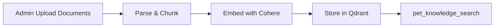
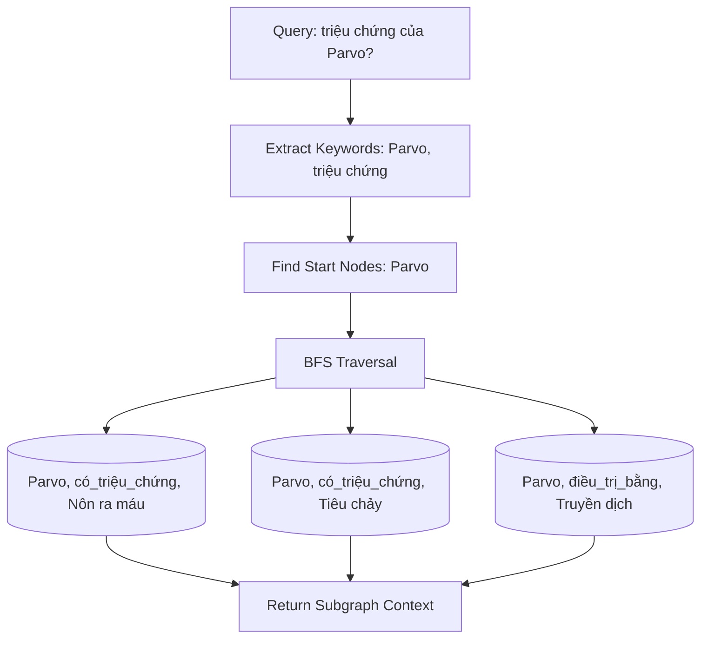
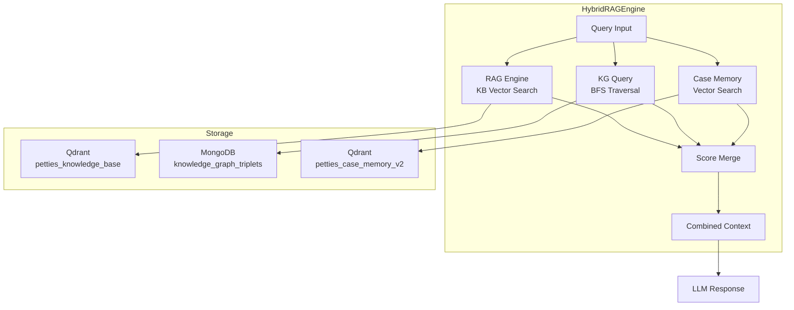
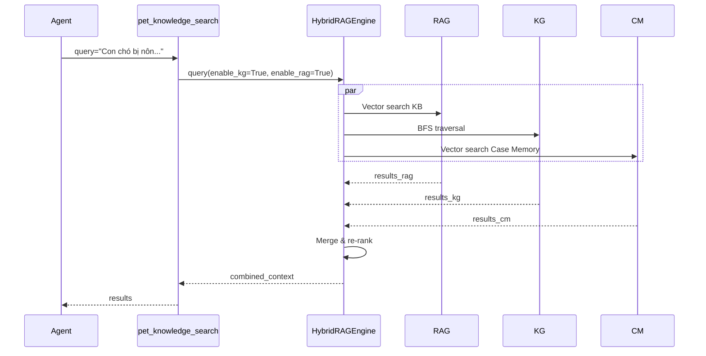
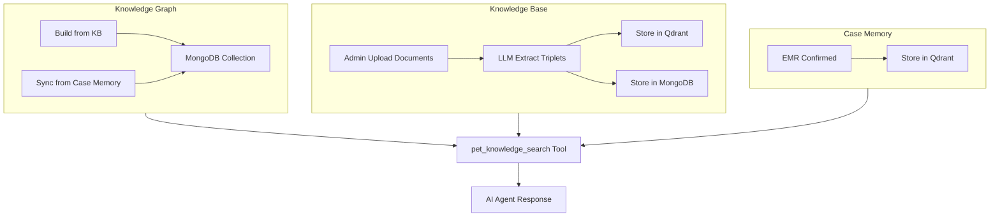

# Petties RAG Engine Technical Specification

**Phiên bản:** 1.1  
**Cập nhật:** 2026-03-21  
**Tham chiếu:** `AI_SERVICE_TECHNICAL_SPECIFICATION.md`

---

## 1. Tổng quan

RAG Engine (Retrieval-Augmented Generation) là hệ thống tìm kiếm thông tin nội bộ của Petties, cung cấp context đáng tin cậy cho AI Agent trả lời câu hỏi về thú y.

### 1.1 Mục tiêu

- Cung cấp thông tin thú y nội bộ cho AI Agent
- Hỗ trợ multi-hop reasoning qua Knowledge Graph
- Tích hợp case đã xác nhận từ EMR vào luồng tư vấn
- Đảm bảo câu trả lời được grounding từ dữ liệu đáng tin cậy

### 1.2 Components

| Component | Storage | Purpose |
|----------|---------|---------|
| **Knowledge Base (KB)** | Qdrant Cloud | Document chunks với vector embeddings |
| **Knowledge Graph (KG)** | MongoDB | Triplets (subject, predicate, object) cho multi-hop reasoning |
| **Case Memory** | Qdrant Cloud | EMR confirmed cases với text + image embeddings |

---

## 2. Knowledge Base (KB)

### 2.1 Mô tả

Knowledge Base là tập hợp các tài liệu thú y nội bộ, được chunk và embed thành vectors để tìm kiếm theo semantic similarity.

### 2.2 Storage

- **Database:** Qdrant Cloud
- **Collection:** `petties_knowledge_base`
- **Vector Model:** Cohere embed-multilingual-v3 (1024 dimensions)
- **Indexing:** HNSW algorithm

### 2.3 Data Flow



### 2.4 API Endpoints

| Endpoint | Method | Auth | Purpose |
|----------|--------|------|---------|
| `/knowledge/upload` | POST | Admin | Upload tài liệu lên KB |
| `/knowledge/build-kb` | POST | Admin | Index documents vào Qdrant |
| `/knowledge/kb-stats` | GET | Public | Thống kê KB |
| `/knowledge/documents` | GET | Public | List uploaded documents |

### 2.5 Use Cases

- Tra cứu thông tin bệnh, triệu chứng, điều trị
- Tìm kiếm theo ngữ nghĩa (semantic search)
- Fallback khi KG không có kết quả

---

## 3. Knowledge Graph (KG)

### 3.1 Mô tả

Knowledge Graph lưu trữ triplets (chủ thể, quan hệ, đối tượng) theo cấu trúc đồ thị, cho phép truy vấn multi-hop và reasoning chuỗi.

### 3.2 Storage

- **Database:** MongoDB
- **Collection:** `knowledge_graph_triplets` (config: `MONGODB_KG_TRIPLETS_COLLECTION`)
- **Persistence:** MongoDB volume (`mongodb_dev_data`) - persist qua container rebuilds

### 3.3 Schema

```json
{
  "_id": "ObjectId",
  "subject": "string",
  "predicate": "string",
  "object": "string",
  "source": "kb | case_memory",
  "source_id": "string (document_id hoặc case_id)",
  "triplet_hash": "string (MD5 hash để deduplicate)",
  "metadata": {
    "extracted_at": "datetime",
    "confidence": "float (0-1)",
    "created_by": "llm | admin",
    "model_used": "string",
    "batch_id": "uuid"
  }
}
```

### 3.4 Relation Types

| Predicate | Vietnamese | Example |
|-----------|-----------|---------|
| `có_triệu_chứng` | Disease has symptom | (Parvo, có_triệu_chứng, Nôn ra máu) |
| `điều_trị_bằng` | Disease treated by | (Parvo, điều_trị_bằng, Truyền dịch) |
| `nguyên_nhân` | Disease caused by | (Viêm da, nguyên_nhân, Dị ứng) |
| `thường_gặp_ở` | Common in species | (Bệnh Carre, thường_gặp_ở, Chó) |
| `phòng_ngừa` | Prevention method | (Parvo, phòng_ngừa, Vaccine) |
| `liều_dùng` | Drug dosage | (Amoxicillin, liều_dùng, 10-20mg/kg) |
| `thuộc_nhóm` | Belongs to group | (Viêm phổi, thuộc_nhóm, Hô hấp) |

### 3.5 Data Sources

KG được tổng hợp từ 2 nguồn:

#### 3.5.1 Knowledge Base (KB)

- Admin build KG từ uploaded documents
- LLM extract triplets từ document chunks
- Endpoint: `POST /knowledge/build-kg`

#### 3.5.2 Case Memory (EMR)

- Sync định kỳ từ Case Memory
- Extract triplets từ EMR confirmed cases
- Endpoint: `POST /knowledge/sync-from-case-memory`

### 3.6 Query Method

KG sử dụng **BFS (Breadth-First Search)** traversal:



### 3.7 API Endpoints

| Endpoint | Method | Auth | Purpose |
|----------|--------|------|---------|
| `/knowledge/build-kg` | POST | Admin | Build KG từ KB documents |
| `/knowledge/sync-from-case-memory` | POST | Admin | Sync KG từ Case Memory |
| `/knowledge/kg-stats` | GET | Public | Thống kê KG |
| `/knowledge/kg-visualize` | GET | Public | Dữ liệu visualize D3.js |
| `/knowledge/kg-query` | POST | Public | Query KG |

### 3.8 Implementation

**File:** `petties-agent-serivce/app/core/rag/knowledge_graph.py`

**Key Methods:**
```python
class KnowledgeGraphService:
    async def initialize()                    # Khởi tạo MongoDB connection
    async def build_from_documents()         # Build từ KB documents
    async def build_from_case_memory()        # Sync từ Case Memory
    async def query_graph()                  # BFS traversal query
    async def get_graph_stats()              # Statistics
    async def reset_knowledge_graph()        # Reset KG (all hoặc theo source)
    async def get_graph_visualization_data() # D3.js data
```

---

## 4. Case Memory

### 4.1 Mô tả

Case Memory lưu trữ các ca bệnh đã được xác nhận từ EMR, sử dụng cho staff diagnosis và reference.

### 4.2 Storage

- **Database:** Qdrant Cloud
- **Collection:** `petties_case_memory_v2`
- **Vectors:** 2 named vectors
  - `text`: Cohere embed-multilingual-v3 (1024 dimensions)
  - `image`: Jina CLIP v2 (1024 dimensions, optional)

### 4.3 Payload Schema

```json
{
  "case_id": "string",
  "species": "Chó | Mèo",
  "breed": "string",
  "age": "string",
  "weight": "number",
  "symptoms": ["string"],
  "diagnosis": "string",
  "treatment": "string",
  "vet_verified": "boolean",
  "emr_id": "string",
  "clinic_id": "string",
  "created_at": "datetime",
  "feedback_count": "number"
}
```

### 4.4 Data Source

- **Primary:** EMR confirmed (final_diagnosis từ VET/STAFF)
- **Deprecated:** Thumbs up feedback (đã loại bỏ theo AI_DIAGNOSIS_FEATURE_PLAN.md)

### 4.5 Re-ranking Formula

```
final_score = cosine_similarity
            + min(feedback_count / 100, 0.3)
            + (0.1 nếu vet_verified)
```

---

## 5. HybridRAGEngine

### 5.1 Mô tả

HybridRAGEngine là engine tổng hợp kết quả từ KB, KG, và Case Memory, merge thành context duy nhất cho LLM.

### 5.2 Architecture



### 5.3 Weight Configuration

| Source | Weight | Notes |
|--------|--------|-------|
| RAG (KB) | 1.0 | Base weight |
| KG | 0.8 | Lower due to extraction quality variance |
| Case Memory | 1.2 | Higher due to verified clinical data |

### 5.4 Merge Strategy

```python
# Pseudocode
results = []
results.extend(rag_results * RAG_WEIGHT)
results.extend(kg_results * KG_WEIGHT)
results.extend(case_memory_results * CASE_MEMORY_WEIGHT)
results.sort_by_score(descending=True)
results.deduplicate_by_content()
return top_k(results)
```

---

## 6. Integration với AI Agent

### 6.1 pet_knowledge_search Tool

Tool chính để truy vấn RAG engine:

```python
@mcp_server.tool
async def pet_knowledge_search(
    query: str,
    pet_type: Optional[str] = None,  # Chó | Mèo
    top_k: int = 5,
    min_score: float = 0.4
) -> dict:
    """
    Truy vấn hybrid RAG: KB + KG + Case Memory
    
    Returns:
        dict với keys:
        - answer: Câu trả lời từ LLM
        - sources: Danh sách sources đã sử dụng
        - context: Combined context đã dùng
    """
```

### 6.2 Query Flow



### 6.3 Role-based Behavior

| Role | RAG | KG | Case Memory | Web Search |
|------|-----|----|-------------|------------|
| PET_OWNER | ✅ | ✅ | ✅ (if has pets) | ✅ fallback |
| STAFF/VET | ✅ | ✅ | ✅ | ❌ |
| CLINIC_MANAGER | ✅ | ✅ | ❌ | ❌ |
| ADMIN | ✅ | ✅ | ❌ | ✅ |

---

## 7. Implementation Files

### 7.1 Core Files

```
petties-agent-serivce/
├── app/
│   ├── core/
│   │   ├── rag/
│   │   │   ├── __init__.py
│   │   │   ├── rag_engine.py              # KB vector search
│   │   │   ├── knowledge_graph.py         # KG service (MongoDB backend) ⭐
│   │   │   ├── case_memory.py             # Case memory (Qdrant)
│   │   │   └── hybrid_engine.py           # Hybrid merge logic
│   │   ├── database/
│   │   │   └── mongodb.py                # MongoDB indexes (KG collection)
│   │   └── tools/
│   │       └── mcp_tools/
│   │           └── medical_tools.py       # pet_knowledge_search tool
│   ├── api/
│   │   └── routes/
│   │       └── knowledge.py               # KB & KG endpoints ⭐
│   └── config/
│       └── settings.py                    # MONGODB_KG_TRIPLETS_COLLECTION ⭐
```

### 7.2 Configuration

```python
# settings.py
MONGODB_KG_TRIPLETS_COLLECTION: str = Field(
    default="knowledge_graph_triplets",
    description="Collection name cho Knowledge Graph triplets (MongoDB)",
)
```

### 7.3 MongoDB Indexes

```javascript
// mongodb.py - create_mongodb_indexes()
db.knowledge_graph_triplets.createIndex(
  { subject: 1, predicate: 1, object: 1 },
  { unique: true }
)
db.knowledge_graph_triplets.createIndex({ subject: 1, predicate: 1 })
db.knowledge_graph_triplets.createIndex({ object: 1, predicate: 1 })
db.knowledge_graph_triplets.createIndex(
  { subject: "text", object: "text" },
  { weights: { subject: 2, object: 1 } }
)
db.knowledge_graph_triplets.createIndex({ source: 1 })
```

---

## 8. Data Flow



---

## 9. Roadmap

### 9.1 Phase 1: MongoDB Migration ✅ (2026-03-21)

- [x] Thêm collection `knowledge_graph_triplets` vào MongoDB
- [x] Tạo indexes cho BFS query
- [x] Refactor `knowledge_graph.py` dùng MongoDB thay SimpleGraphStore
- [x] Thêm method `build_from_case_memory()`
- [x] Thêm endpoint `POST /knowledge/sync-from-case-memory`
- [x] KG data persist qua MongoDB volume mount

### 9.2 Phase 2: Case Memory Sync

- [ ] Auto-sync trigger on EMR confirmation
- [ ] Implement incremental sync (chỉ sync new cases)

### 9.3 Phase 3: Production Scale

- [ ] Thêm indexes tối ưu cho BFS
- [ ] Implement caching layer
- [ ] Monitoring & alerting

### 9.4 Phase 4: Advanced Features

- [ ] Neo4j migration (nếu cần scale lớn)
- [ ] KG visualization improvements
- [ ] KG editing UI cho admin

---

## 10. Best Practices

### 10.1 Triplet Extraction

- Sử dụng LLM với system prompt chuyên biệt cho thú y
- Validate triplet length: subject ≤200, predicate ≤100, object ≤200
- Filter garbage characters và duplicates (MD5 hash)
- Store confidence score để filter low-quality triplets

### 10.2 Query Optimization

- Limit BFS depth (default: 2) để tránh context explosion
- Use top_k limits để control response size
- Deduplicate results before merging

### 10.3 Data Quality

- KG từ KB: phụ thuộc vào document quality
- KG từ Case Memory: phụ thuộc vào EMR completeness
- Regular cleanup của low-confidence triplets

---

## 11. Error Handling

### 11.1 KG Service Errors

| Error | Handling | User Message |
|-------|----------|--------------|
| MongoDB connection | Log error, return empty | "Knowledge Graph temporarily unavailable" |
| Empty KG | Fallback to KB only | N/A - transparent |
| LLM extraction failed | Skip triplet, log | N/A - silent skip |
| Invalid triplet | Filter out | N/A - silent skip |

### 11.2 Hybrid Engine Errors

| Error | Handling |
|-------|----------|
| KB unavailable | Query KG + CM only |
| KG unavailable | Query KB + CM only |
| CM unavailable | Query KB + KG only |
| All unavailable | Return error to user |

---

## 12. Monitoring

### 12.1 Metrics

- KG triplet count (total, by source)
- KG query latency
- Case Memory sync count
- Hybrid merge success rate

### 12.2 Logging

```python
logger.info(f"KG query '{query[:50]}' returned {len(results)} triplets")
logger.info(f"Synced {count} triplets from Case Memory")
logger.warning(f"KG query failed: {e}, falling back to KB only")
```

### 12.3 Stats Endpoint

```bash
GET /knowledge/kg-stats
Response:
{
  "initialized": true,
  "triplet_count": 150,
  "entity_count": 80,
  "relation_types": ["có_triệu_chứng", "điều_trị_bằng", ...],
  "by_source": {
    "kb": 100,
    "case_memory": 50
  }
}
```

---

## 13. Security

### 13.1 Access Control

| Endpoint | Auth | Purpose |
|----------|------|---------|
| `/knowledge/build-kg` | Admin | Build KG từ KB |
| `/knowledge/sync-from-case-memory` | Admin | Sync KG từ Case Memory |
| `/knowledge/kg-query` | Public | Read-only query |
| `/knowledge/kg-stats` | Public | Statistics |
| `/knowledge/kg-visualize` | Public | Visualization |

### 13.2 Data Validation

- Sanitize user input trong query
- Validate triplet format trước insert
- Rate limiting trên query endpoints

---

## 14. References

- [AI_SERVICE_TECHNICAL_SPECIFICATION.md](./AI_SERVICE_TECHNICAL_SPECIFICATION.md)
- [AI_DIAGNOSIS_FEATURE_PLAN.md](./AI_DIAGNOSIS_FEATURE_PLAN.md)
- [AI_DIAGNOSIS_PROGRESS.md](./AI_DIAGNOSIS_PROGRESS.md)
- MongoDB Documentation: https://www.mongodb.com/docs/
- Motor (async MongoDB driver): https://motor.readthedocs.io/
