# II. Software Design Document

**Project:** Petties - Veterinary Appointment Booking Platform
**Version:** 3.3.18 (Mobile staff QR display after checkout for regular and SOS bookings)
**Last Updated:** 2026-04-20
**Document Status:** In Progress


## TABLE OF CONTENTS
- [1. System Design](#1-system-design)
    - [1.1 System Architecture](#11-system-architecture)
    - [1.2 Package Diagram](#12-package-diagram)
    - [1.3 UML Diagram Standards](#13-uml-diagram-standards)
- [2. Database Design](#2-database-design)
    - [2.1 Relational Database Design (PostgreSQL)](#21-relational-database-design-postgresql)
    - [2.2 NoSQL Database Design (MongoDB)](#22-nosql-database-design-mongodb)
    - [2.3 Vector Database Design (Qdrant)](#23-vector-database-design-qdrant)
    - [2.4 Cache Database Design (Redis)](#24-cache-database-design-redis)
- [4. Detailed Design](#4-detailed-design)
    - [4.1 Authentication](#41-authentication)
    - [4.2 User Profile Management](#42-user-profile-management)
    - [4.3 Staff and Scheduling Management](#43-staff-and-scheduling-management)
    - [4.4 Pet Profile Management](#44-pet-profile-management)
    - [4.5 Patient Management](#45-patient-management)
    - [4.6 EMR & Vaccination Management](#46-emr--vaccination-management)
    - [4.7 Service Management](#47-service-management)
    - [4.8 Chat Management](#48-chat-management)
    - [4.9 Booking Review Management](#49-booking-review-management)
    - [4.10 Clinic Management](#410-clinic-management)
    - [4.11 SOS Booking](#411-sos-booking)
    - [4.12 Booking Management](#412-booking-management)
    - [4.13 Settlement Management](#413-settlement-management)
    - [4.14 Payment Management](#414-payment-management)
    - [4.15 Clinic Discovery Management](#415-clinic-discovery-management)
    - [4.16 Notification Management](#416-notification-management)
    - [4.17 System Management](#417-system-management)
    - [4.18 Report Management](#418-report-management)
    - [4.19 AI Assistant](#419-ai-assistant)
    - [4.20 AI Subscriptions Management](#420-ai-subscriptions-management)
    - [4.21 Voucher Management](#421-voucher-management)


## 1. System Design

### 1.1 System Architecture

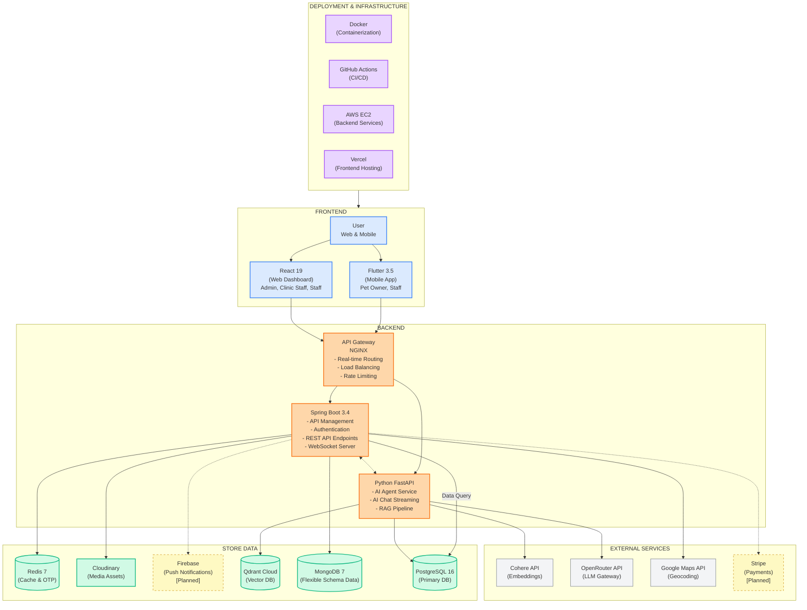

**Layered view (FE → BE → AI → DB)** – The diagram below illustrates the same architecture following a left-to-right flow: Frontend → Core Backend → AI Agent Service (at the same level as Backend) → Data & External. AI is separated into an independent layer to clarify responsibilities and request flow.

```mermaid
flowchart LR
    subgraph FE["FRONTEND"]
        direction TB
        U["User<br/>Web & Mobile"]
        F["Flutter 3.5<br/>Mobile"]
        R["React 19<br/>Web"]
        U --> F
        U --> R
    end

    subgraph BE["CORE BACKEND"]
        direction TB
        NGINX["API Gateway<br/>NGINX"]
        SB["Spring Boot 3.4<br/>REST · Auth · Biz"]
        NGINX --> SB
    end

    subgraph AI["AI AGENT SERVICE"]
        direction TB
        FA["FastAPI<br/>Single Agent · ReAct"]
        RAG["RAG Pipeline<br/>LlamaIndex"]
        MCP["Tools<br/>FastMCP"]
        FA --> RAG
        FA --> MCP
    end

    subgraph DB["DATA & KNOWLEDGE"]
        direction TB
        PG[("PostgreSQL 16")]
        MDB[("MongoDB 7")]
        RD[("Redis 7")]
        QD[("Qdrant Cloud")]
        CL["Cloudinary"]
        PG
        MDB
        RD
        QD
        CL
    end

    subgraph EXT["EXTERNAL SERVICES"]
        direction TB
        OR["OpenRouter<br/>LLM"]
        CO["Cohere<br/>Embeddings"]
        GM["Google Maps"]
        OR
        CO
        GM
    end

    FE -->|"HTTPS / WSS"| BE
    BE -->|"Proxy / API"| AI
    AI -->|"Query · Config"| PG
    AI -->|"Vectors"| QD
    BE -->|"CRUD"| PG
    BE --> RD
    BE --> MDB
    BE --> CL
    BE --> GM
    AI --> OR
    AI --> CO

    style AI fill:#c4b5fd,stroke:#6d28d9,stroke-width:3px
    style FE fill:#dbeafe,stroke:#3b82f6
    style BE fill:#fed7aa,stroke:#f97316
    style DB fill:#d1fae5,stroke:#10b981
    style EXT fill:#f3f4f6,stroke:#6b7280
```

**The Petties Platform** is designed with a modern, scalable, and modular architecture, clearly separating frontend and backend responsibilities. This ensures high performance, flexibility for scaling, and easy integration with third-party services.

**1. User Role:**
- **Guest** - Can view clinic listings, search clinics, and view basic information
- **Pet Owner** - Can register pets, book appointments, chat with AI assistant, view EMR history, and manage profile (Mobile only)
- **Staff** - Can view appointments, manage schedule, create EMR records, and access patient history (Web + Mobile)
- **Clinic Manager** - Manages clinic operations, staff scheduling, booking management, and patient records (Web only)
- **Clinic Owner** - Manages clinic profile, services, pricing, staff, and views analytics (Web only)
- **Admin** - Manages the system, user accounts, clinic approvals, AI agent configuration, and oversees system operations (Web only)

**2. Frontend Layer:**
- Built with **React 19** (Web Dashboard) and **Flutter 3.5** (Mobile App) for responsive and real-time user experiences
- Uses **WebSocket clients** to receive live AI chat streaming
- Integrates **Neobrutalism design system** for consistent UI/UX
- Static assets are distributed through **Cloudinary CDN** to improve performance

**3. Backend Layer:**
- **Spring Boot 3.4 Server:** Handles API management, authentication (JWT), REST API endpoints, and business logic for clinics, bookings, users, pets, and EMR
- **Python FastAPI Service:** Processes AI chat requests, runs Single Agent with ReAct pattern, performs RAG queries, and supports real-time WebSocket streaming
- **API Gateway (NGINX):** Manages real-time routing, SSL termination, load balancing, and rate limiting

**4. Store Data:**
- **PostgreSQL 16** - Primary relational database storing users, clinics, bookings, pets, EMR, and AI agent configurations (shared by both services)
- **MongoDB 7** - Used for auditing, logs, and flexible schema data (e.g., patient records or specialized logs)
- **Redis 7** - Caches OTP codes, session data, and rate limiting counters with TTL-based expiration
- **Qdrant Cloud** - Stores vector embeddings for RAG knowledge base (1024 dimensions, Binary Quantization)
- **Cloudinary** - Manages media assets (images, avatars, clinic photos) efficiently with CDN delivery
- **Firebase** - Used for push notifications to mobile devices [Planned]

**5. Deployment & Infrastructure:**
- **Vercel** - Used for frontend (React) deployment with automatic preview deployments
- **AWS EC2** - Provides backend infrastructure and scalable cloud hosting for Spring Boot and FastAPI services
- **Docker** - Containerizes backend services (Spring Boot, FastAPI, NGINX), enabling flexible deployment and CI/CD pipelines
- **GitHub Actions** - Automated CI/CD for building, testing, and deploying all services

---

### 1.2 Package Diagram

#### 1.2.1 Back-End Package Diagram

##### Spring Boot Service (backend-spring)

```mermaid
flowchart TB
    subgraph BACKEND["backend-spring (Spring Boot 3.4 + Java 21)"]
        direction TB

        subgraph PRESENTATION["Presentation Layer (Controllers)"]
            style PRESENTATION fill:#90EE90
            direction LR
            controller["controller"]
        end

        subgraph BUSINESS["Business Layer"]
            style BUSINESS fill:#98FB98
            direction LR
            service["service"]
            serviceImpl["service/impl"]
        end

        subgraph DATA_ACCESS["Data Access Layer"]
            style DATA_ACCESS fill:#87CEEB
            direction LR
            repository["repository"]
        end

        subgraph DOMAIN["Domain Layer"]
            style DOMAIN fill:#FFB6C1
            direction LR
            model["model"]
            enums["model/enums"]
        end

        subgraph DTO_LAYER["DTO Layer"]
            style DTO_LAYER fill:#DDA0DD
            direction LR
            dto["dto"]
            mapper["mapper"]
        end

        subgraph CROSS_CUTTING["Cross-Cutting Concerns"]
            style CROSS_CUTTING fill:#F0E68C
            direction LR
            config["config"]
            security["security"]
            exception["exception"]
            validation["validation"]
        end

        subgraph INFRASTRUCTURE["Infrastructure Layer"]
            style INFRASTRUCTURE fill:#D3D3D3
            direction LR
            util["util"]
            converter["converter"]
            scheduler["scheduler"]
            event["event"]
        end

        subgraph MIGRATION["Database Migration"]
            style MIGRATION fill:#FFFACD
            direction LR
            dbMigration["db/migration"]
        end

        subgraph TESTING["Testing Layer"]
            style TESTING fill:#E6E6FA
            direction LR
            test["test"]
        end
    end

    %% Layer dependencies with <<import>> and <<use>> stereotypes
    %% Flow: Controller → DTO → Service → Repository → Entity
    PRESENTATION -.->|"<<use>>"| DTO_LAYER
    PRESENTATION -.->|"<<import>>"| BUSINESS
    BUSINESS -.->|"<<use>>"| DTO_LAYER
    BUSINESS -.->|"<<import>>"| DATA_ACCESS
    BUSINESS -.->|"<<use>>"| DOMAIN
    DATA_ACCESS -.->|"<<import>>"| DOMAIN
    DTO_LAYER -.->|"<<use>>"| DOMAIN

    %% Cross-Cutting Concerns (applies to all layers)
    CROSS_CUTTING -.->|"<<configure>>"| PRESENTATION
    CROSS_CUTTING -.->|"<<configure>>"| BUSINESS
    CROSS_CUTTING -.->|"<<configure>>"| DATA_ACCESS

    %% Infrastructure dependencies
    BUSINESS -.->|"<<use>>"| INFRASTRUCTURE

    %% Migration applies to Domain
    MIGRATION -.->|"<<migrate>>"| DOMAIN

    %% Testing dependencies
    TESTING -.->|"<<import>>"| PRESENTATION
    TESTING -.->|"<<import>>"| BUSINESS
```

##### Python AI Agent Service (petties-agent-serivce)

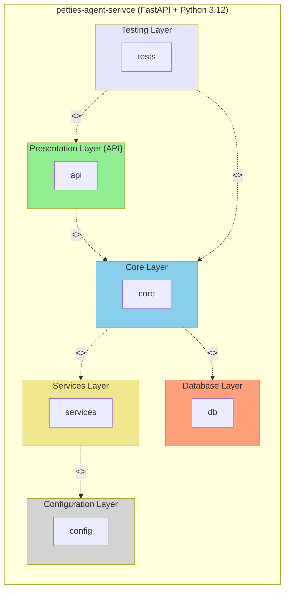

##### Package Descriptions - Spring Boot Service:

| No | Package | Layer Responsibility |
|----|---------|---------------------|
| **Presentation Layer** |
| 01 | controller | **REST API Layer** - Handles HTTP requests and maps them to service methods. Responsible for request validation, authentication checks, and response formatting. Implements `@RestController` pattern with route mapping to `/api/*` endpoints. |
| **Business Layer** |
| 02 | service | **Business Logic Layer** - Contains core business rules, transaction management (`@Transactional`), and orchestration of operations. Implements concrete Service classes for simplicity and direct implementation. Coordinates between repositories and external integrations. |

| **Data Access Layer** |
| 04 | repository | **Data Access Layer** - Provides CRUD operations and custom query methods using Spring Data JPA. Abstracts database interactions with PostgreSQL. Implements Repository pattern with method naming conventions for query generation. |
| **Domain Layer** |
| 05 | model | **Domain Entity Layer** - JPA entities mapped to PostgreSQL tables. Defines data structure, relationships (`@OneToMany`, `@ManyToOne`, `@ManyToMany`), and lifecycle hooks. Uses Hibernate for ORM with auditing fields (createdAt, updatedAt). |
| 06 | model/enums | **Enumeration Types** - Type-safe constants for domain concepts (Role, Status, Type). Ensures data integrity and provides readable code instead of magic strings/numbers. |
| **DTO Layer** |
| 07 | dto | **Data Transfer Objects** - Defines API contracts between client and server. Handles request validation (Jakarta Bean Validation annotations), response shaping, and prevents entity exposure. Organized by feature domain. |
| 08 | mapper | **Object Mapping Layer** - MapStruct-based mappers for Entity ↔ DTO conversion. Eliminates boilerplate mapping code and ensures type-safe transformations between layers. |
| **Cross-Cutting Concerns** |
| 09 | config | **Configuration Layer** - Spring beans for cross-cutting concerns: Security (JWT filter, authentication), external services (Redis, Cloudinary, Google Maps), JPA/Hibernate settings, WebSocket, Swagger/OpenAPI, and CORS configuration. |
| 10 | security | **Security Layer** - JWT token provider, authentication filter, custom `UserDetailsService`, and role-based access control. Implements Spring Security 6.x with stateless session management. |
| 11 | exception | **Error Handling Layer** - Centralized exception handling with `@ControllerAdvice`. Defines custom exceptions (BadRequest, NotFound, Unauthorized, Forbidden) and standardized error responses with Vietnamese messages. |
| 12 | validation | **Custom Validation Layer** - Custom Bean Validation annotations and validators for business rules not covered by standard annotations (e.g., phone format, date range validation). |
| **Infrastructure Layer** |
| 13 | util | **Utility Layer** - Stateless helper classes for common operations (token manipulation, date formatting, string processing, slug generation). Shared across multiple services without business logic. |
| 14 | converter | **Data Conversion Layer** - JPA `AttributeConverter` implementations for complex type mappings (JSON ↔ Object, Enum ↔ String). Enables storing structured data in database columns. |
| 15 | scheduler | **Scheduled Tasks Layer** - Spring `@Scheduled` jobs for background processing (appointment reminders, expired token cleanup, report generation). Implements cron-based and fixed-rate scheduling. |
| 16 | event | **Event Handling Layer** - Spring Application Events for decoupled communication between components. Implements async event publishing and listeners for notifications, audit logging, and side effects. |
| **Database Migration** |
| 17 | db/migration | **Schema Migration Layer** - Flyway SQL migration scripts with versioned naming (`V{timestamp}__{description}.sql`). Manages database schema evolution across environments. |
| **Testing Layer** |
| 18 | test | **Testing Layer** - JUnit 5 + Mockito test suites organized by component type (controller, service, repository). Includes unit tests with mocked dependencies and integration tests with `@SpringBootTest`. Follows Arrange-Act-Assert pattern with test fixtures for data setup. |

##### Package Descriptions - Python AI Agent Service:

| No | Package | Layer Responsibility |
|----|---------|---------------------|
| **API Layer** |
| 01 | api/routes | **REST Endpoint Layer** - FastAPI route handlers exposing AI service capabilities. Manages HTTP endpoints for chat sessions, agent configuration, tool registry, knowledge base, and settings. Uses Pydantic for request/response validation. |
| 02 | api/websocket | **Real-time Communication Layer** - WebSocket endpoints for bidirectional streaming. Enables real-time AI chat with token-by-token streaming and ReAct trace visualization. Handles connection lifecycle and message protocols. |
| 03 | api/middleware | **Request Interception Layer** - Cross-cutting middleware for authentication (JWT validation), logging, and request preprocessing. Integrates with Spring Boot's auth system for user context extraction. |
| 04 | api/schemas | **API Contract Layer** - Pydantic models defining request/response structures. Provides runtime validation, serialization, and OpenAPI documentation generation for all API endpoints. |
| 05 | api/dependencies | **Dependency Injection Layer** - FastAPI dependencies for common operations (database sessions, current user, pagination). Enables reusable request-scoped resources across routes. |
| **Core - Agent Layer** |
| 06 | core/agents | **AI Agent Orchestration** - Implements Single Agent with ReAct pattern (Thought → Action → Observation loop) using LangGraph StateGraph. Manages agent state, decision-making, and response generation. |
| 07 | core/agents/state | **Agent State Management** - TypedDict definitions for ReAct state (messages, steps, current thought, tool calls). Enables stateful conversation and reasoning trace tracking. |
| 08 | core/agents/factory | **Agent Construction Layer** - Factory pattern for dynamic agent instantiation. Loads configuration (prompts, parameters, enabled tools) from PostgreSQL database at runtime. |
| **Core - Tool Layer** |
| 09 | core/tools | **Tool Infrastructure Layer** - FastMCP server setup for tool registration and execution. Provides decorator-based tool definition (`@mcp.tool`) with semantic descriptions for LLM function calling. |
| 10 | core/tools/mcp_tools | **Tool Implementation Layer** - Code-based tools with semantic descriptions. Each tool is a function decorated with `@mcp.tool()` providing capabilities like Q&A, symptom search, clinic lookup, booking creation. |
| 11 | core/tools/scanner | **Tool Discovery Layer** - Auto-scans Python modules for `@mcp.tool` decorated functions. Syncs discovered tools to database for admin management (enable/disable, assign to agents). |
| 12 | core/tools/executor | **Tool Execution Layer** - Validates tool parameters against schema and executes through MCP server. Handles tool errors gracefully and returns structured results to agent. |
| **Core - RAG Layer** |
| 13 | core/rag | **Knowledge Retrieval Layer** - LlamaIndex-based RAG engine with Cohere embeddings (1024 dims) and Qdrant Cloud vector storage. Handles document chunking, embedding, indexing, and semantic search for context augmentation. |
| **Core - Utilities** |
| 14 | core/config_helper | **Dynamic Configuration Layer** - Loads API keys, model settings, and prompts from PostgreSQL. Enables runtime configuration changes without service restart. |
| 15 | core/init_db | **Database Initialization** - Seed data scripts and initial setup for agents, tools, and system settings. Runs on application startup. |
| 16 | core/sentry | **Error Monitoring Layer** - Sentry SDK integration for error tracking, performance monitoring, and distributed tracing across async operations. |
| **Services Layer** |
| 17 | services | **External Integration Layer** - Clients for external APIs (OpenRouter LLM, Cohere embeddings). Handles streaming responses, retry logic, and error handling for cloud AI providers. |
| **Database Layer** |
| 18 | db/postgres/models | **ORM Model Layer** - SQLAlchemy ORM models defining entities (Agent, Tool, KnowledgeDocument, SystemSetting). AI chat session/message không thuộc PostgreSQL scope; toàn bộ AI chat history lưu trên MongoDB. |
| 19 | db/postgres/session | **Session Management Layer** - AsyncSession factory for database connections. Manages connection pooling and transaction scopes for async operations. |
| 20 | db/migrations | **Schema Migration Layer** - Alembic migration scripts for database schema versioning. Enables safe schema evolution across environments with up/down migrations. |
| **Configuration Layer** |
| 21 | config | **Environment Configuration** - Pydantic Settings for environment variables. Centralized configuration for database URLs, API keys, and logging setup with validation. |
| 22 | config/logging | **Logging Configuration** - Structured logging setup with JSON formatting for production. Configures log levels, handlers, and formatters per environment. |
| **Testing Layer** |
| 23 | tests | **Testing Layer** - pytest test suites for API endpoints, agent logic, tool execution, and RAG pipeline. Includes unit tests with mocks and integration tests with test database. Uses pytest-asyncio for async testing. |

---

#### 1.2.2 Front-End Package Diagram

##### React Web Dashboard (petties-web)

```mermaid
flowchart TB
    subgraph WEB["petties-web (React 19 + Vite + TypeScript)"]
        direction TB

        subgraph SIDE_PANELS["Shared Modules"]
            style SIDE_PANELS fill:#D3D3D3
            direction TB
            store["store"]
            hooks["hooks"]
            utils["utils"]
            config["config"]
            lib["lib"]
        end

        subgraph PAGES["pages"]
            style PAGES fill:#90EE90
            direction LR
            pagesAuth["auth"]
            pagesAdmin["admin"]
            pagesClinicOwner["clinic-owner"]
            pagesClinicManager["clinic-manager"]
            pagesVet["vet"]
            pagesShared["shared"]
        end

        subgraph COMPONENTS["components"]
            style COMPONENTS fill:#98FB98
            direction LR
            compCore["core"]
            compModules["modules"]
        end

        subgraph LAYOUTS["layouts"]
            style LAYOUTS fill:#DDA0DD
            direction LR
            layouts["layouts"]
        end

        subgraph SERVICES["services"]
            style SERVICES fill:#F0E68C
            direction LR
            servicesApi["api"]
            servicesWebsocket["websocket"]
        end

        subgraph TYPES["types"]
            style TYPES fill:#87CEEB
            direction LR
            types["types"]
        end

        subgraph TESTING["__tests__"]
            style TESTING fill:#E6E6FA
            direction LR
            tests["__tests__"]
        end
    end

    %% Layer dependencies with <<import>> and <<use>> stereotypes
    %% Flow: Layouts → Pages → Components → Services → Types
    SIDE_PANELS -.->|"<<use>>"| COMPONENTS
    layouts -.->|"<<import>>"| PAGES
    PAGES -.->|"<<use>>"| COMPONENTS
    PAGES -.->|"<<use>>"| SIDE_PANELS
    COMPONENTS -.->|"<<import>>"| SERVICES
    SERVICES -.->|"<<use>>"| TYPES
    TESTING -.->|"<<import>>"| COMPONENTS
```

##### Flutter Mobile App (petties_mobile)

```mermaid
flowchart TB
    subgraph MOBILE["petties_mobile (Flutter 3.5 + Dart)"]
        direction TB

        subgraph SIDE_PANELS["Shared Modules"]
            style SIDE_PANELS fill:#D3D3D3
            direction TB
            providers["providers"]
            utils["utils"]
            cfgConstants["config/constants"]
            cfgTheme["config/theme"]
            cfgEnv["config/env"]
        end

        subgraph UI_SCREENS["ui (screens)"]
            style UI_SCREENS fill:#90EE90
            direction LR
            uiAuth["auth"]
            uiPetOwner["pet_owner"]
            uiVet["vet"]
            uiPet["pet"]
            uiProfile["profile"]
        end

        subgraph UI_WIDGETS["ui/widgets"]
            style UI_WIDGETS fill:#98FB98
            direction LR
            coreWidgets["core/widgets"]
            widgets["widgets"]
        end

        subgraph DATA["data"]
            style DATA fill:#F0E68C
            direction LR
            dataServices["services"]
            dataModels["models"]
            dataDatasources["datasources"]
            dataRepositories["repositories"]
        end

        subgraph ROUTING["routing"]
            style ROUTING fill:#87CEEB
            direction LR
            routing["routing"]
        end

        subgraph CORE["core"]
            style CORE fill:#FFB6C1
            direction LR
            coreError["error"]
            coreNetwork["network"]
        end

        subgraph TESTING["test"]
            style TESTING fill:#E6E6FA
            direction LR
            test["test"]
        end
    end

    %% Layer dependencies with <<import>> and <<use>> stereotypes
    %% Flow: Routing → Screens → Widgets → Providers → Data → Core
    routing -.->|"<<import>>"| UI_SCREENS
    UI_SCREENS -.->|"<<use>>"| UI_WIDGETS
    UI_SCREENS -.->|"<<use>>"| SIDE_PANELS
    SIDE_PANELS -.->|"<<import>>"| DATA
    DATA -.->|"<<use>>"| CORE
    TESTING -.->|"<<import>>"| UI_SCREENS
    TESTING -.->|"<<import>>"| SIDE_PANELS
```

##### Package Descriptions - React Web Dashboard:

| No | Package | Layer Responsibility |
|----|---------|---------------------|
| **Pages Layer** |
| 01 | pages | **Route Page Layer** - Top-level page components mapping to routes. Each page represents a complete view for a specific role (Admin, Clinic Owner, Clinic Manager, Staff). Organized by role and feature domain. |
| 02 | pages/auth | **Authentication Pages** - Login, registration, and password recovery flows with OTP verification. Handles unauthenticated user journeys. |
| 03 | pages/admin | **Admin Dashboard Pages** - System administration views including clinic approvals, AI agent configuration, tool management, knowledge base, and system settings. |
| 04 | pages/clinic-owner | **Clinic Owner Pages** - Clinic management views for owners including profile editing, service configuration, pricing, and staff management. |
| 05 | pages/clinic-manager | **Clinic Manager Pages** - Operational views for daily clinic management including bookings, schedules, and patient records. |
| 06 | pages/vet | **Veterinarian Pages** - Staff-specific views for appointments, patient records, and schedule management. |
| 07 | pages/shared | **Shared Pages** - Cross-role pages like profile management accessible by all authenticated users. |
| **Components Layer** |
| 08 | components | **Reusable UI Components** - Modular, composable UI building blocks organized by domain (auth, clinic, profile, dashboard). Follows atomic design principles with consistent Neobrutalism styling. |
| 09 | components/common | **Shared Components** - Generic UI components used across multiple features (modals, inputs, dialogs, loading states). Framework-agnostic and highly reusable. |
| **Layouts Layer** |
| 10 | layouts | **Page Layout Layer** - Role-based layout wrappers providing consistent navigation, sidebar, and header structure. Implements layout composition pattern for DRY page structure. |
| **Services Layer** |
| 11 | services/api | **API Client Layer** - Axios-based HTTP client with interceptors for JWT handling, error transformation, and request/response logging. Provides typed service methods for each API domain. |
| 12 | services/websocket | **WebSocket Client Layer** - Real-time communication for AI chat streaming. Manages connection lifecycle, reconnection, and message handling. |
| **State Management** |
| 13 | store | **Global State Layer** - Zustand stores for application-wide state (auth, user profile, clinic data). Provides selectors, actions, and persistence for client-side state management. |
| **Hooks Layer** |
| 14 | hooks | **Custom React Hooks** - Reusable stateful logic encapsulation (useAuth, useToast, useDebounce). Abstracts common patterns and side effects for clean component code. |
| **Types Layer** |
| 15 | types | **TypeScript Definitions** - Shared type definitions for API responses, domain models, and component props. Ensures type safety across the application. |
| **Utils Layer** |
| 16 | utils | **Utility Functions** - Pure helper functions for common operations (date formatting, validation, token handling, error processing). Stateless and side-effect free. |
| **Config Layer** |
| 17 | config | **Environment Configuration** - Environment-specific settings (API URLs, feature flags). Centralizes configuration management with type-safe access. |
| **Lib Layer** |
| 18 | lib | **Third-party Integrations** - Wrappers and configurations for external libraries (Sentry error tracking). Isolates vendor-specific code from application logic. |
| **Testing Layer** |
| 19 | __tests__ | **Testing Layer** - Vitest/Jest test suites for components and hooks. Includes unit tests with React Testing Library and integration tests for user flows. Uses MSW for API mocking. |

##### Package Descriptions - Flutter Mobile App:

| No | Package | Layer Responsibility |
|----|---------|---------------------|
| **UI Layer - Screens** |
| 01 | ui/screens | **Screen Layer** - Full-page widget compositions representing complete views. Each screen corresponds to a route and composes widgets for specific user flows. Organized by user role (pet_owner, vet) and feature domain (auth, pet, profile). |
| 02 | ui/auth | **Authentication Screens** - Login, registration, password recovery flows with OTP verification. Handles unauthenticated user journeys with form validation. |
| 03 | ui/pet_owner | **Pet Owner Screens** - Home and feature screens exclusive to pet owners including booking, AI chat, and pet management. |
| 04 | ui/vet | **Veterinarian Screens** - Staff-specific screens for appointments, patient records, and schedule management. |
| **UI Layer - Widgets** |
| 05 | ui/core/widgets | **Core Widgets** - Foundational reusable widgets (buttons, text fields, loaders). Implements Neobrutalism design system with consistent styling across the app. |
| 06 | ui/widgets | **Feature Widgets** - Domain-specific widgets organized by feature (profile, pet, booking). Composable building blocks for screens. |
| **Data Layer** |
| 07 | data/services | **API Service Layer** - Dio-based HTTP services for backend communication. Handles request construction, response parsing, and error transformation. Implements service classes per domain (auth, user, pet). |
| 08 | data/models | **Data Model Layer** - Dart classes representing API responses and domain entities. Provides fromJson/toJson methods for serialization. Immutable data structures with factory constructors. |
| 09 | data/datasources | **Data Source Layer** - Abstracts data retrieval from local (SharedPreferences, Hive) and remote (API) sources. Implements Repository pattern's data source abstraction. |
| 10 | data/repositories | **Repository Layer** - Orchestrates between local and remote data sources. Implements caching strategies, offline-first logic, and data synchronization. Single source of truth for data access. |
| **State Management** |
| 11 | providers | **State Provider Layer** - Provider/Riverpod state management. Exposes reactive state to widgets with notifyListeners for UI updates. Handles async state loading and error states. |
| **Routing Layer** |
| 12 | routing | **Navigation Layer** - GoRouter configuration with role-based route guards. Defines route paths, redirects, and deep linking. Implements declarative navigation pattern. |
| **Config Layer** |
| 13 | config/constants | **App Constants** - Static configuration values (colors, strings, dimensions). Centralizes magic values for consistent UI and easy theming. |
| 14 | config/theme | **Theme Configuration** - MaterialApp theme definition with Neobrutalism styling. Defines colors, typography, component themes, and dark mode support. |
| 15 | config/env | **Environment Configuration** - Environment-specific settings (dev, test, prod). Manages API URLs and feature flags per build configuration. |
| **Core Layer** |
| 16 | core/error | **Error Handling Layer** - Custom exception classes and failure types. Standardizes error representation for consistent handling across the app. |
| 17 | core/network | **Network Layer** - Dio client setup with interceptors for JWT injection, token refresh, and error mapping. Centralizes HTTP configuration. |
| **Utils Layer** |
| 18 | utils | **Utility Layer** - Stateless helper functions for common operations (validators, date formatters, storage helpers, permission handling, API error processing). Shared across all layers without business logic. |
| **Entry Points** |
| 19 | main.dart | **Application Entry** - App initialization including Provider setup, Firebase init, GoRouter configuration, and theme application. |
| **Testing Layer** |
| 20 | test | **Testing Layer** - Flutter test suites for widgets, providers, and services. Includes unit tests with mocktail/mockito, widget tests with WidgetTester, and integration tests with flutter_driver. |

---

### 1.3 UML Diagram Standards

Tài liệu này định nghĩa các quy tắc chuẩn hóa khi viết Class Diagram và Sequence Diagram cho Petties SDD.

#### 1.3.1 Class Diagram Rules

> Canonical alignment rule (2026-04-10): Every class diagram and sequence diagram in section 4 must map to the exact feature/function names defined in SRS section `2.2` (no aliases, no renamed variants).

**1. Class Structure:**
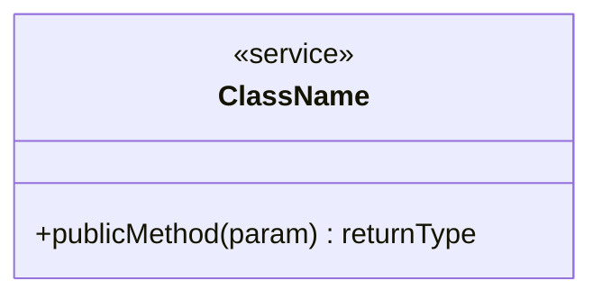
- `-` : private field
- `+` : public method
- Không cần ghi getter/setter

**2. Class Types:**
| Type | Content |
|------|---------|
| Controller | Methods là các API endpoints |
| Service | Methods là business logic |
| Repository | Interface với `<<interface>>`, methods là query |
| Entity | Fields đầy đủ, không có methods (trừ isExpired, etc.) |
| Enum | Dùng `<<enumeration>>` stereotype |

**3. Stereotypes:**
- `<<interface>>` : cho Repository interfaces
- `<<enumeration>>` : cho Enum types
- `<<abstract>>` : cho abstract classes

**4. Relationships:**
| Symbol | Meaning |
|--------|---------|
| `-->` | Dependency (Controller --> Service, Service --> Repository) |
| `--o` | Aggregation |
| `--*` | Composition |
| `--|>` | Inheritance |
| `..|>` | Implementation |

**Multiplicity Rule (Mandatory for Entity Relations):**
- Every `Entity <-> Entity` and `Entity -> Enum` relation must include both-side multiplicity.
- Allowed multiplicities: `0..1`, `0..*`, `1..*`.
- Examples:
  - `Booking "0..1" --* "0..*" BookingServiceItem`
  - `Report "0..*" --o "0..1" ReportStatus`
  - `ClinicService "0..*" --o "0..1" ServiceCategory`

**5. Field Naming:**
- Fields viết camelCase
- Type viết sau field: `+UUID userId`
- Generic types dùng `~`: `Optional~User~`, `List~Pet~`

**6. Method Signatures:**
- Format: `+methodName(paramType) ReturnType`
- Nhiều params: `+method(String, UUID) ResponseEntity`
- Không có return: `+method(param) void`

**7. Dependency Grouping:**
- Nhóm dependencies theo comment: `%% Controller Dependencies`
- Thứ tự: Controller → Service → Repository → Entity

**8. Classes bắt buộc cho mỗi module:**
- 1 Controller
- 1+ Services
- 1+ Repositories
- 1+ Entities
- 1+ Enums (nếu có)

**9. Naming Convention:**
| Type | Pattern |
|------|---------|
| Controller | `[Feature]Controller` |
| Service | `[Feature]Service` |
| Repository | `[Entity]Repository` |
| Entity | `[EntityName]` (singular) |

---

#### 1.3.2 Sequence Diagram Rules

**1. Required Participants:**
```
actor User as [Role Name]                       %% Example: Pet Owner, Staff, Clinic Manager
participant UI as [Screen Name]                 %% Mobile/Web screen
participant [Abbrev] as [ControllerName]
participant [Abbrev] as [ServiceName]
participant [Abbrev] as [RepositoryName]
participant [Abbrev] as [ExternalServiceName]   %% Optional, only if used in the flow
participant DB as Database                      %% Mandatory and must be the last participant
```

**2. Message Numbering:**
- Prefix every message with continuous numbering: `1.`, `2.`, `3.` ...
- Start from 1 and keep numbering continuous throughout the diagram.
- Do not use `autonumber`.

**3. Database Actions (No SQL in sequence):**
When Repository calls Database, describe business actions instead of raw SQL statements.
```
Check user existence by email
Create user record
Update booking status
Delete report by id
```

**4. Activation Bars:**
- Every `activate` must have a matching `deactivate`.
- Activate when processing starts, deactivate when control returns.

**5. Arrow Types:**
| Arrow | Meaning |
|-------|---------|
| `->>` | Synchronous request (method call) |
| `-->>` | Response (return result) |
| `->` | Asynchronous message (fire-and-forget) |

**6. Standard Flow Pattern:**
```
User -> UI -> Controller -> Service -> Repository -> Database
(Response returns in reverse order)
```

**7. Error Handling:**
- Use `alt` / `else` blocks for success and error paths.

**8. Abbreviation Convention:**
| Abbreviation | Full Name |
|--------------|-----------|
| AC | AuthController |
| AS | AuthService |
| UR | UserRepository |
| CR | ClinicRepository |
| DB | Database |
| ES | EmailService |
| JTP | JwtTokenProvider |

**9. Role Abbreviations:**
| Abbrev | Role |
|--------|------|
| PO | Pet Owner |
| V | Staff |
| CM | Clinic Manager |
| CO | Clinic Owner |
| A | Admin |

---

**Complete Example - Delete Flow (with numbering, alt/else, and full activation pairs):**

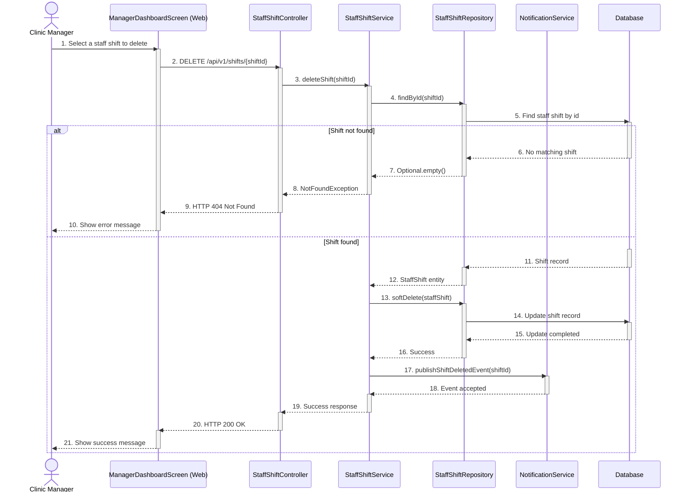

---

## 2. DATABASE DESIGN

Petties uses a **Polyglot Persistence** architecture with multiple database types serving different purposes:

| Database | Type | Use Case | Tables/Collections |
|----------|------|----------|-------------------|
| **PostgreSQL 16** (Backend) | Relational (RDBMS) | Structured data with strict relationships | 21 tables |
| **PostgreSQL 16** (AI Service) | Relational (RDBMS) | Agent configuration, tool governance, RAG metadata | 5 tables |
| **MongoDB 7** | Document (NoSQL) | Flexible, nested, schema-less data, AI chat history | 6 collections |

---

### 2.1 Relational Database Design (PostgreSQL)

PostgreSQL is used as the primary relational database for both Spring Boot Backend and AI Agent Service, providing foreign keys, ACID transactions, and complex queries.

> **Database Architecture:**
> - **Shared PostgreSQL Instance**: Both services connect to the same PostgreSQL server
> - **Separate Schemas (optional)**: AI Service tables can use separate schema or logical naming for operational isolation
> - **Total Tables in Current Codebase**: 26 tables (21 Backend + 5 AI Service)

#### 2.1.0 Presentation Notes

Phần này có thể dùng trực tiếp khi thuyết trình Database Design trong buổi báo cáo.

**Talking Script - PostgreSQL Overview:**

"Trong Petties, PostgreSQL là lớp dữ liệu quan hệ trung tâm cho toàn bộ nghiệp vụ chính. Hiện tại hệ thống có 26 bảng PostgreSQL, trong đó 21 bảng phục vụ backend Spring Boot và 5 bảng phục vụ AI service. Chúng tôi chọn PostgreSQL vì cần tính toàn vẹn dữ liệu, ràng buộc khóa ngoại, và khả năng xử lý tốt các nghiệp vụ booking, phân ca, thanh toán và cấu hình hệ thống."

"Ở backend nghiệp vụ, nhóm bảng quan trọng nhất gồm User, Clinic, Pet, StaffShift, Slot, Booking, BookingService, Payment và Review. Các bảng này tạo thành luồng dữ liệu xuyên suốt từ lúc người dùng đăng ký tài khoản, tạo hồ sơ thú cưng, tìm phòng khám, đặt lịch, phân công nhân sự, đến thanh toán và đánh giá sau dịch vụ."

"Một điểm quan trọng trong thiết kế là chúng tôi tách booking thành nhiều lớp dữ liệu. Bảng Booking lưu thông tin lịch hẹn tổng thể, bảng booking_services lưu từng dịch vụ cụ thể trong lịch hẹn, còn bảng booking_slots quản lý các slot thời gian thực sự bị chiếm dụng. Cách tách này giúp hệ thống hỗ trợ nhiều dịch vụ trong một booking, nhiều slot cho một booking, và dễ mở rộng cho các luồng như home visit hoặc SOS."

"Ngoài ra, module dịch vụ cũng được chuẩn hóa khá rõ. Chúng tôi có master_services làm template dùng chung, clinic_services là dịch vụ thực tế của từng phòng khám, service_weight_prices cho giá theo cân nặng, và vaccine_templates cùng vaccine_dose_prices cho nghiệp vụ tiêm chủng. Nhờ vậy, hệ thống vừa tái sử dụng được cấu hình chung, vừa cho phép từng phòng khám tùy biến dịch vụ riêng."

"For the AI service, PostgreSQL is used for governance data such as agents, tools, knowledge_documents, disease normalization tables, and system_settings. AI chat runtime data is intentionally stored in MongoDB, while vector search and case memory are stored in Qdrant. This separation mirrors the current codebase and keeps the data model aligned with runtime behavior."

**Talking Script - Key Design Rationale:**

"Về mặt thiết kế, chúng tôi chia PostgreSQL thành ba lớp logic. Lớp thứ nhất là dữ liệu lõi nghiệp vụ như user, clinic, pet, booking. Lớp thứ hai là dữ liệu cấu hình và pricing như master service, clinic service, vaccine template. Lớp thứ ba là dữ liệu hỗ trợ vận hành như notification, chat auto reply setting và AI system settings. Cách phân tách này giúp tài liệu, code và database dễ bảo trì hơn khi hệ thống mở rộng."

"Một điểm nữa là phần quan hệ được thiết kế theo hướng bám sát nghiệp vụ thực tế. Ví dụ một clinic có nhiều staff shift, một shift có nhiều slot, một booking có nhiều service và nhiều slot, còn một payment gắn 1-1 với một booking. Các cardinality này giúp hệ thống kiểm soát rõ dữ liệu và giảm rủi ro inconsistency khi xử lý booking đồng thời."

#### 2.1.1 Entity Relationship Diagram (Conceptual)

> **Lưu ý:** ERD ở mức Conceptual tập trung vào **dữ liệu** và **quan hệ** giữa các đối tượng trong hệ thống, không đi sâu vào chi tiết database design (columns, types, constraints).

##### A. Core Business Entities

| Entity | Description | Key Relationships |
|--------|-------------|-------------------|
| **User** | System user across all roles | 1 User -> N Pets, N Bookings, N Notifications, N Reports, N Subscriptions |
| **Pet** | Pet profile registered in the platform | 1 Pet -> N Bookings, N EMRs, N Vaccination Records |
| **Clinic** | Approved veterinary clinic | 1 Clinic -> N Services, N Staff Shifts, N Bookings, N Reports |
| **ClinicService** | Clinic-specific service offering | 1 Service -> N BookingServiceItems, N Weight Prices, N VaccineDosePrices |
| **VaccineTemplate** | Vaccination template and reminder rule | 1 Template -> N Clinic Services |
| **Booking** | Appointment / home-visit / SOS booking | 1 Booking -> 1 Pet, 1 Clinic, N Services, N Slots, 1 Payment, 0..N RefundApplications |
| **RefundApplication** | Refund workflow for disputed or cancelled bookings | N RefundApplications -> 1 Booking, 1 Clinic |
| **Report** | Incident report raised by users | N Reports -> 1 Booking, 1 User, 1 Clinic |
| **UserSubscription** | Purchased AI subscription plan | N Subscriptions -> 1 User, 1 Plan |
| **Voucher** | Voucher definition and discount rules | N ClinicVouchers -> 1 Voucher |
| **ChatAutoReplySetting** | Clinic auto-reply configuration | N Settings -> 1 Clinic |
| **EMRRecord** | Electronic medical record (MongoDB) | 1 EMR -> 1 Pet, 1 Staff, 1 Booking (optional) |
| **VaccinationRecord** | Vaccination history (MongoDB) | 1 Record -> 1 Pet, 1 Staff |
| **ChatConversation** | Pet Owner <-> Clinic thread (MongoDB) | 1 Conversation -> N Messages |
| **Agent** | Single-agent AI runtime configuration | 1 Agent -> N AI Chat Sessions (logical, MongoDB runtime) |
| **Tool** | FastMCP tool registry metadata | Governed independently in PostgreSQL; enabled by runtime policy |
| **KnowledgeDocument** | RAG document metadata | Metadata in PostgreSQL, vectors in Qdrant |
| **DiseaseCatalog** | Canonical disease taxonomy | 1 DiseaseCatalog -> N DiseaseAliases |
| **SystemSetting** | Runtime AI provider/settings registry | Standalone configuration table for API keys and defaults |

##### B. Entity Relationships Diagram (ERD)

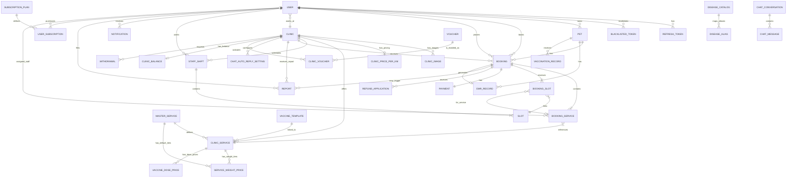

##### C. Entity Groups by Domain

| Domain | Entities | Purpose |
|--------|----------|---------|
| **User Management** | User, RefreshToken, BlacklistedToken | Users, authentication, authorization |
| **Pet Health** | Pet, EMRRecord (MongoDB), VaccinationRecord (MongoDB) | Pet profile and medical history |
| **Clinic Operations** | Clinic, ClinicImage, ClinicPricePerKm, ChatAutoReplySetting, ClinicBalance, Withdrawal | Clinic setup, operations, finance, chat automation |
| **Services & Pricing** | MasterService, ClinicService, ServiceWeightPrice, VaccineTemplate, VaccineDosePrice, Voucher, ClinicVoucher | Service catalog, pricing, vaccination templates, promotions |
| **Scheduling** | StaffShift, Slot | Staff schedules and time-slot inventory |
| **Booking & Revenue** | Booking, BookingServiceItem, BookingSlot, Payment, RefundApplication, Report | Appointments, payments, refund processing, incident governance |
| **AI Subcriptions + Report + Voucher Governance** | SubscriptionPlan, UserSubscription, Report, Voucher, ClinicVoucher, ClinicStrikeConfig, UserStrikeConfig | AI subscription lifecycle, report moderation, voucher controls, and strike policies |
| **Notifications** | Notification | System notifications |
| **Chat Management** | ChatConversation (Mongo), ChatMessage (Mongo) | Direct chat between pet owner and clinic |
| **AI Service** | Agent, Tool, KnowledgeDocument, DiseaseCatalog, DiseaseAlias, DiseaseMappingReviewItem, SystemSetting, AIChatSession (Mongo), AIChatMessage (Mongo), AIProactiveNotification (Mongo), ChatFeedback (Mongo) | Single-agent governance, diagnosis normalization, RAG, and AI runtime telemetry |

##### D. Detailed ERD (Database Design)

> **Note:** The detailed ERD is generated from the canonical PostgreSQL DBML artifact.
> DBML source code: [`docs-references/database/PETTIES_DBML.dbml`](../../database/PETTIES_DBML.dbml)
> Current DBML scope: PostgreSQL only (30 Spring Boot tables + 7 AI service tables). MongoDB and Qdrant are documented separately in Sections 2.2 and 2.3.

**Instructions to generate Detailed ERD:**
1. Visit https://dbdiagram.io/
2. Copy content from `PETTIES_DBML.dbml`
3. Paste into editor
4. Export PNG/PDF

```
[Detailed ERD Diagram - Paste screenshot from dbdiagram.io here]
```
#### 2.1.2 Table Groups

##### Spring Boot Backend Tables (30 tables)

| Group | Tables | Description |
|-------|--------|-------------|
| **Auth & User** | users, refresh_tokens, blacklisted_tokens | User management and authentication |
| **Pet** | pets | Pet profiles |
| **Clinic** | clinics, clinic_images, clinic_price_per_km | Clinic management and distance pricing |
| **Services** | master_services, clinic_services, service_weight_prices, vaccine_templates, vaccine_dose_prices | Services, pricing, and vaccination master data |
| **Scheduling** | staff_shifts, slots | Staff work schedules |
| **Booking & Payment** | bookings, booking_services, booking_slots, payments, refund_applications, clinic_balances, withdrawals | Appointments, payments, refunds, clinic finance |
| **Report/Subscription/Voucher Governance** | reports, subscription_plans, user_subscriptions, vouchers, clinic_vouchers, clinic_strike_config, user_strike_config | Incident governance, AI subscriptions, vouchers, and strike policies |
| **Operations** | notifications, chat_auto_reply_settings | System notifications and clinic chat automation |

##### AI Agent Service Tables (7 tables)

| Group | Tables | Description |
|-------|--------|-------------|
| **Agent Runtime** | agents, tools | Single-agent runtime parameters and tool registry |
| **Knowledge Base** | knowledge_documents | RAG document metadata |
| **Diagnosis Normalization** | disease_catalog, disease_aliases | Canonical disease taxonomy and active alias registry |
| **Settings** | system_settings | API keys and runtime/provider configuration |

##### AI Agent Service Relationship Notes

| Relationship | Type | Source of Truth | Presentation Guidance |
|-------------|------|-----------------|-----------------------|
| `disease_aliases.canonical_code -> disease_catalog.canonical_code` | Physical FK | SQLAlchemy model + Alembic migration | Show as solid FK relation in ERD |
| `agents`, `tools`, `knowledge_documents`, `system_settings` | Standalone governance tables | SQLAlchemy model | Show as independent administrative tables |
| `ai_chat_sessions.user_id` -> Spring `users.user_id` | Logical cross-database reference | MongoDB runtime document | Document as logical reference, not FK |
| `ai_chat_messages.session_id` -> `ai_chat_sessions._id` | Logical document relation | MongoDB runtime document | Keep in MongoDB documentation, not PostgreSQL ERD |

#### 2.1.3 Table Descriptions
#### 2.1.3 Table Descriptions

##### 2.1.3.1 Spring Boot Backend Tables

###### Auth & User Tables

**Table: users**

**Description:** Stores all user accounts with different roles (Pet Owner, Staff, Clinic Manager, Clinic Owner, Admin). Supports soft delete for data retention.

| Column | Type | Constraints | Description |
|--------|------|-------------|-------------|
| user_id | UUID | PK | Primary Key |
| username | VARCHAR(50) | UNIQUE, NOT NULL | Login username |
| password | VARCHAR(255) | NOT NULL | Password (hashed) |
| phone | VARCHAR(20) | UNIQUE | Phone number |
| email | VARCHAR(100) | UNIQUE, NOT NULL | Email address |
| full_name | VARCHAR(100) | | Full name |
| avatar | VARCHAR(500) | | Avatar URL (Cloudinary) |
| avatar_public_id | VARCHAR(100) | | Cloudinary public ID |
| role | ENUM | NOT NULL | PET_OWNER, STAFF, CLINIC_MANAGER, CLINIC_OWNER, ADMIN |
| specialty | ENUM | | MEDICAL, GROOMER |
| rating_avg | DECIMAL(2,1) | DEFAULT 0.0 | Average rating |
| rating_count | INT | DEFAULT 0 | Number of ratings |
| fcm_token | VARCHAR(500) | | Firebase Cloud Messaging token |
| address | VARCHAR(500) | | Default address (Pet Owner) |
| working_clinic_id | UUID | FK→clinics | Working clinic |
| created_at | TIMESTAMP | DEFAULT now() | Created date |
| updated_at | TIMESTAMP | DEFAULT now() | Updated date |
| deleted_at | TIMESTAMP | | Soft delete timestamp |

**Table: refresh_tokens**

**Description:** JWT refresh tokens for multi-device authentication. Allows users to stay logged in across sessions without re-entering credentials.

| Column | Type | Constraints | Description |
|--------|------|-------------|-------------|
| token_id | UUID | PK | Primary Key |
| user_id | UUID | FK→users, NOT NULL | Token owner |
| token_hash | VARCHAR(255) | UNIQUE, NOT NULL | Refresh token hash |
| expires_at | TIMESTAMP | NOT NULL | Expiration time |
| created_at | TIMESTAMP | DEFAULT now() | Created date |

**Table: blacklisted_tokens**

**Description:** Invalidated tokens after logout to prevent reuse until expiration. Ensures security when users explicitly log out.

| Column | Type | Constraints | Description |
|--------|------|-------------|-------------|
| token_id | UUID | PK | Primary Key |
| token_hash | VARCHAR(255) | UNIQUE, NOT NULL | Blacklisted token hash |
| user_id | UUID | NOT NULL | Token owner |
| expires_at | TIMESTAMP | NOT NULL | Expiration time |
| created_at | TIMESTAMP | DEFAULT now() | Created date |

###### Pet Table

**Table: pets**

**Description:** Pet profiles belonging to Pet Owners. Contains medical information like allergies, weight, and species for veterinary services.

| Column | Type | Constraints | Description |
|--------|------|-------------|-------------|
| pet_id | UUID | PK | Primary Key |
| user_id | UUID | FK→users, NOT NULL | Owner (Pet Owner) |
| name | VARCHAR(255) | NOT NULL | Pet name |
| species | ENUM | NOT NULL | DOG, CAT, BIRD, RABBIT, HAMSTER, FISH, OTHER |
| breed | VARCHAR(255) | NOT NULL | Breed |
| date_of_birth | DATE | NOT NULL | Birth date |
| weight | DECIMAL(10,2) | NOT NULL | Weight (kg) |
| gender | VARCHAR(50) | NOT NULL | Gender |
| color | VARCHAR(100) | | Fur color |
| allergies | TEXT | | Allergies (if any) |
| image_url | VARCHAR(500) | | Pet image |
| image_public_id | VARCHAR(100) | | Cloudinary public ID |
| created_at | TIMESTAMP | NOT NULL | Created date |
| updated_at | TIMESTAMP | | Updated date |
| deleted_at | TIMESTAMP | | Soft delete timestamp |

###### Clinic Tables

**Table: clinics**

**Description:** Veterinary clinic profiles registered by Clinic Owners. Requires admin approval before becoming visible to users. Supports soft delete for data retention.

| Column | Type | Constraints | Description |
|--------|------|-------------|-------------|
| clinic_id | UUID | PK | Primary Key |
| owner_id | UUID | FK→users, NOT NULL | Clinic owner |
| name | VARCHAR(200) | NOT NULL | Clinic name |
| description | TEXT | | Description |
| address | VARCHAR(500) | NOT NULL | Full address |
| ward | VARCHAR(100) | | Ward |
| district | VARCHAR(100) | | District |
| province | VARCHAR(100) | | Province/City |
| specific_location | VARCHAR(200) | | Specific location |
| phone | VARCHAR(20) | NOT NULL | Phone number |
| email | VARCHAR(100) | | Contact email |
| bank_name | VARCHAR(100) | | Bank name for payments |
| account_number | VARCHAR(50) | | Bank account number |
| latitude | DECIMAL(10,8) | | Latitude |
| longitude | DECIMAL(11,8) | | Longitude |
| logo | VARCHAR(500) | | Logo URL |
| business_license_url | VARCHAR(500) | | Business license URL |
| operating_hours | JSONB | | Operating hours (JSON) |
| status | ENUM | NOT NULL, DEFAULT 'PENDING' | PENDING, APPROVED, REJECTED, SUSPENDED |
| rejection_reason | TEXT | | Rejection reason |
| rating_avg | DECIMAL(2,1) | DEFAULT 0.0 | Rating score |
| rating_count | INT | DEFAULT 0 | Number of ratings |
| approved_at | TIMESTAMP | | Approval date |
| created_at | TIMESTAMP | NOT NULL | Created date |
| updated_at | TIMESTAMP | | Updated date |
| deleted_at | TIMESTAMP | | Soft delete |
| version | BIGINT | DEFAULT 0 | Optimistic locking |

**operating_hours JSONB Structure:**
```json
{
  "monday": {"open_time": "08:00", "close_time": "18:00", "break_start": "12:00", "break_end": "13:00", "is_closed": false},
  "tuesday": {...},
  "sunday": {"is_closed": true}
}
```

**Table: clinic_images**

**Description:** Gallery images for clinic profiles with ordering support. Clinics can upload multiple images to showcase their facilities.

| Column | Type | Constraints | Description |
|--------|------|-------------|-------------|
| image_id | UUID | PK | Primary Key |
| clinic_id | UUID | FK→clinics, NOT NULL | Clinic |
| image_url | VARCHAR(500) | NOT NULL | Image URL |
| caption | VARCHAR(200) | | Image caption |
| display_order | INT | DEFAULT 0 | Display order |
| is_primary | BOOLEAN | DEFAULT false | Primary image |
| created_at | TIMESTAMP | DEFAULT now() | Created date |

**Table: clinic_price_per_km**

**Description:** Travel pricing for Home Visit services. One-to-one relationship with clinics. Used to calculate distance-based fees.

| Column | Type | Constraints | Description |
|--------|------|-------------|-------------|
| clinic_id | UUID | PK, FK→clinics | 1:1 with clinics (@MapsId) |
| price_per_km | DECIMAL(12,2) | | Travel price per km |
| sos_fee | DECIMAL(12,2) | | Additional SOS travel fee |
| version | BIGINT | NOT NULL, DEFAULT 0 | Optimistic locking |
| created_at | TIMESTAMP | | Created date |
| updated_at | TIMESTAMP | | Updated date |

###### Service Tables

**Table: master_services**

**Description:** Service templates created by Clinic Owner, inherited by individual clinic services. Defines default pricing, duration, and categories.

| Column | Type | Constraints | Description |
|--------|------|-------------|-------------|
| master_service_id | UUID | PK | Primary Key |
| name | VARCHAR(200) | NOT NULL | Service name |
| description | TEXT | | Description |
| default_price | DECIMAL(19,2) | | Default price |
| duration_time | INT | | Duration (minutes) |
| slots_required | INT | DEFAULT 1 | Required slots |
| is_home_visit | BOOLEAN | DEFAULT false | Supports Home Visit |
| default_price_per_km | DECIMAL(19,2) | | Default price/km |
| service_category | VARCHAR(100) | | Category |
| pet_type | VARCHAR(100) | | Pet type (Dog, Cat, All) |
| icon | VARCHAR(100) | | Icon identifier |
| created_at | TIMESTAMP | DEFAULT now() | Created date |
| updated_at | TIMESTAMP | DEFAULT now() | Updated date |

**Table: clinic_services**

**Description:** Actual services offered by clinics, either inherited from master_services or custom created. Clinics can customize pricing and availability.

| Column | Type | Constraints | Description |
|--------|------|-------------|-------------|
| service_id | UUID | PK | Primary Key |
| clinic_id | UUID | FK→clinics, NOT NULL | Clinic |
| master_service_id | UUID | FK→master_services | Template (nullable) |
| is_custom | BOOLEAN | DEFAULT true | true=Custom, false=Inherited |
| name | VARCHAR(200) | NOT NULL | Service name |
| description | TEXT | | Description |
| base_price | DECIMAL(19,2) | NOT NULL | Base price |
| duration_time | INT | NOT NULL | Duration (minutes) |
| slots_required | INT | NOT NULL | Required slots |
| is_active | BOOLEAN | DEFAULT true | Is active |
| is_home_visit | BOOLEAN | DEFAULT false | Supports Home Visit |
| service_category | ENUM | | GROOMING_SPA, VACCINATION, CHECK_UP, SURGERY, DENTAL, DERMATOLOGY, OTHER |
| pet_type | VARCHAR(100) | | Pet type |
| reminder_interval | INT | | Reminder amount before due date |
| reminder_unit | VARCHAR(50) | | Reminder unit (DAYS, WEEKS, MONTHS, YEARS) |
| vaccine_template_id | UUID | FK→vaccine_templates | Linked vaccine template when service is vaccination |
| created_at | TIMESTAMP | NOT NULL | Created date |
| updated_at | TIMESTAMP | | Updated date |
| version | BIGINT | DEFAULT 0 | Optimistic locking |

**Table: vaccine_templates**

**Description:** Vaccine master data used for clinic vaccination services and scheduling reminders.

| Column | Type | Constraints | Description |
|--------|------|-------------|-------------|
| vaccine_template_id | UUID | PK | Primary Key |
| name | VARCHAR(100) | NOT NULL | Vaccine name |
| manufacturer | VARCHAR(100) | | Manufacturer |
| description | TEXT | | Description |
| default_price | DECIMAL(19,2) | | Suggested default price |
| min_age_weeks | INT | | Minimum age in weeks |
| repeat_interval_days | INT | | Suggested repeat interval |
| series_doses | INT | | Number of doses in series |
| is_annual_repeat | BOOLEAN | DEFAULT false | Annual booster flag |
| min_interval_days | INT | | Minimum interval between doses |
| target_species | ENUM | NOT NULL | Target species |
| created_at | TIMESTAMP | DEFAULT now() | Created date |
| updated_at | TIMESTAMP | DEFAULT now() | Updated date |

**Table: vaccine_dose_prices**

**Description:** Price breakdown by dose number for vaccination services.

| Column | Type | Constraints | Description |
|--------|------|-------------|-------------|
| id | UUID | PK | Primary Key |
| service_id | UUID | FK→clinic_services, NOT NULL | Vaccination service |
| dose_number | INT | NOT NULL | Dose order in series |
| dose_label | VARCHAR(100) | | Human-readable label |
| price | DECIMAL(19,2) | NOT NULL | Dose price |
| is_active | BOOLEAN | DEFAULT true | Is active |
| created_at | TIMESTAMP | DEFAULT now() | Created date |
| updated_at | TIMESTAMP | DEFAULT now() | Updated date |

**Table: service_weight_prices**

**Description:** Weight-based pricing tiers for services (e.g., grooming costs more for larger pets). Links to either clinic services or master services.

| Column | Type | Constraints | Description |
|--------|------|-------------|-------------|
| weight_price_id | UUID | PK | Primary Key |
| service_id | UUID | FK→clinic_services | Clinic service (nullable) |
| master_service_id | UUID | FK→master_services | Master template (nullable) |
| min_weight | DECIMAL(10,2) | NOT NULL | Minimum weight (kg) |
| max_weight | DECIMAL(10,2) | NOT NULL | Maximum weight (kg) |
| price | DECIMAL(19,2) | NOT NULL | Price for weight range |
| created_at | TIMESTAMP | DEFAULT now() | Created date |
| updated_at | TIMESTAMP | DEFAULT now() | Updated date |

###### Scheduling Tables

**Table: staff_shifts**

**Description:** Work schedules for staff at specific clinics. Auto-generates 30-minute slots for booking. Supports overnight shifts and break times.

| Column | Type | Constraints | Description |
|--------|------|-------------|-------------|
| shift_id | UUID | PK | Primary Key |
| staff_id | UUID | FK→users, NOT NULL | Staff member |
| clinic_id | UUID | FK→clinics, NOT NULL | Clinic |
| work_date | DATE | NOT NULL | Work date |
| start_time | TIME | NOT NULL | Shift start time |
| end_time | TIME | NOT NULL | Shift end time |
| break_start | TIME | | Lunch break start |
| break_end | TIME | | Lunch break end |
| is_overnight | BOOLEAN | DEFAULT false | Overnight shift flag |
| notes | VARCHAR(500) | | Notes |
| created_at | TIMESTAMP | DEFAULT now() | Created date |
| updated_at | TIMESTAMP | DEFAULT now() | Updated date |

**Table: slots**

**Description:** 30-minute time blocks auto-generated from staff_shifts. Used for booking appointments. Status tracks availability.

| Column | Type | Constraints | Description |
|--------|------|-------------|-------------|
| slot_id | UUID | PK | Primary Key |
| shift_id | UUID | FK→staff_shifts, NOT NULL | Parent shift |
| start_time | TIME | NOT NULL | Slot start time |
| end_time | TIME | NOT NULL | Slot end time |
| status | ENUM | NOT NULL, DEFAULT 'AVAILABLE' | AVAILABLE, BOOKED, BLOCKED |
| created_at | TIMESTAMP | DEFAULT now() | Created date |
| updated_at | TIMESTAMP | DEFAULT now() | Updated date |

###### Booking Tables

**Table: bookings**

**Description:** Appointment records connecting pets, pet owners, clinics, and optional assigned staff. Core booking entity supporting IN_CLINIC, HOME_VISIT, and SOS types.

| Column | Type | Constraints | Description |
|--------|------|-------------|-------------|
| booking_id | UUID | PK | Primary Key |
| version | BIGINT | | Optimistic locking |
| booking_code | VARCHAR(20) | UNIQUE, NOT NULL | Booking code (BK-YYYYMMDD-XXXX) |
| pet_id | UUID | FK→pets, NOT NULL | Pet being treated |
| pet_owner_id | UUID | FK→users, NOT NULL | Pet owner |
| clinic_id | UUID | FK→clinics | Target clinic (nullable while SOS is SEARCHING) |
| assigned_staff_id | UUID | FK→users | Assigned staff |
| proxy_booker_id | UUID | FK→users | Staff who created booking on behalf of pet owner (NULL if self-booked) |
| booking_date | DATE | NOT NULL | Appointment date |
| booking_time | TIME | NOT NULL | Appointment time |
| type | ENUM | NOT NULL | IN_CLINIC, HOME_VISIT, SOS |
| home_address | VARCHAR(500) | | Address (Home Visit/SOS only) |
| home_lat | DECIMAL(10,7) | | Home latitude |
| home_long | DECIMAL(10,7) | | Home longitude |
| distance_km | DECIMAL(5,2) | | Distance in km |
| distance_fee | DECIMAL(12,2) | | Travel fee |
| sos_fee | DECIMAL(12,2) | | SOS emergency surcharge |
| total_price | DECIMAL(12,2) | NOT NULL | Total price |
| status | ENUM | NOT NULL, DEFAULT 'PENDING' | (See State Machine below) |
| cancellation_reason | VARCHAR(255) | | Cancellation reason |
| cancelled_by | UUID | | Cancelled by user |
| notes | TEXT | | Notes |
| symptoms | TEXT | | Symptom description (SOS bookings) |
| confirmed_at | TIMESTAMP | | When clinic confirmed the booking |
| arrived_at | TIMESTAMP | | When staff arrived (Home Visit/SOS) |
| created_at | TIMESTAMP | | Created date |

**Booking Status State Machine (persisted in DB):**
```
PENDING → CONFIRMED → IN_PROGRESS → COMPLETED
PENDING → SEARCHING → PENDING_CLINIC_CONFIRM → CONFIRMED
```
Alternative persisted paths: CANCELLED, NO_SHOW

**Table: booking_services**

**Description:** Junction table linking bookings to specific clinic services (Many-to-Many). Captures price snapshot at booking time for historical accuracy.

| Column | Type | Constraints | Description |
|--------|------|-------------|-------------|
| booking_service_id | UUID | PK | Primary Key |
| booking_id | UUID | FK→bookings, NOT NULL | Parent booking |
| pet_id | UUID | FK→pets | Pet receiving the service |
| service_id | UUID | FK→clinic_services, NOT NULL | Clinic service |
| assigned_staff_id | UUID | FK→users | Staff assigned to this service |
| unit_price | DECIMAL(12,2) | | Price snapshot at booking time |
| base_price | DECIMAL(12,2) | | Base price |
| weight_price | DECIMAL(12,2) | | Weight-based price |
| quantity | INT | DEFAULT 1 | Quantity |
| is_add_on | BOOLEAN | DEFAULT false | Arising/add-on service flag |
| created_at | TIMESTAMP | DEFAULT now() | Created date |

**Table: booking_slots**

**Description:** Junction table linking bookings to specific time slots (Many-to-Many). Allows services to occupy multiple consecutive slots.

| Column | Type | Constraints | Description |
|--------|------|-------------|-------------|
| booking_slot_id | UUID | PK | Primary Key |
| booking_id | UUID | FK→bookings, NOT NULL | Parent booking |
| slot_id | UUID | FK→slots, NOT NULL | Reserved slot |
| booking_service_id | UUID | FK→booking_services | Associated service item |
| created_at | TIMESTAMP | DEFAULT now() | Created date |

**Table: payments**

**Description:** Payment records with 1:1 relationship to bookings. Supports multiple payment methods (CASH, QR, CARD) with Stripe integration.

| Column | Type | Constraints | Description |
|--------|------|-------------|-------------|
| payment_id | UUID | PK | Primary Key |
| booking_id | UUID | FK→bookings, UNIQUE, NOT NULL | 1:1 with Booking |
| amount | DECIMAL(12,2) | NOT NULL | Payment amount |
| payment_description | VARCHAR(100) | | Payment description |
| method | ENUM | NOT NULL | CASH, QR, CARD |
| status | ENUM | NOT NULL, DEFAULT 'PENDING' | PENDING, PAID, REFUNDED, FAILED |
| stripe_payment_id | VARCHAR(255) | | Stripe transaction ID |
| paid_at | TIMESTAMP | | Payment timestamp |
| created_at | TIMESTAMP | | Created date |

###### Notification Table

**Table: notifications**

**Description:** In-app notifications for users about clinic approvals, shift assignments, booking updates, and medical reminders. Supports read/unread status.

| Column | Type | Constraints | Description |
|--------|------|-------------|-------------|
| notification_id | UUID | PK | Primary Key |
| user_id | UUID | FK→users, NOT NULL | Notification recipient |
| clinic_id | UUID | FK→clinics | Related clinic (optional) |
| shift_id | UUID | FK→staff_shifts | Related shift (optional) |
| type | ENUM | NOT NULL | (See Notification Types) |
| emr_id | VARCHAR(50) | | MongoDB ObjectId |
| message | TEXT | NOT NULL | Notification content |
| reason | TEXT | | Reason (for rejection) |
| read | BOOLEAN | DEFAULT false | Read status |
| action_type | VARCHAR(100) | | Action type (e.g., QUICK_BOOKING, INFO_ONLY) |
| action_data | TEXT | | JSON payload for action buttons |
| created_at | TIMESTAMP | NOT NULL | Created date |

**Notification Types:**
- Clinic: APPROVED, REJECTED, PENDING, CLINIC_PENDING_APPROVAL, CLINIC_VERIFIED
- StaffShift: STAFF_SHIFT_ASSIGNED, STAFF_SHIFT_UPDATED, STAFF_SHIFT_DELETED
- Booking: BOOKING_CREATED, BOOKING_CONFIRMED, BOOKING_ASSIGNED, BOOKING_CANCELLED, BOOKING_CHECKIN, BOOKING_COMPLETED, STAFF_ON_WAY, STAFF_ARRIVED
- Medical: RE_EXAMINATION_REMINDER, VACCINATION_REMINDER
- DB CHECK only (not yet in JPA enum): BOOKING_REMINDER, SYSTEM, PROMOTION

##### 2.1.3.2 AI Agent Service Tables

###### Table: agents

**Purpose:** Stores the single-agent runtime configuration for Petties AI Assistant. This table controls model selection and generation parameters without storing prompt version history in PostgreSQL.

**Relationship status in current codebase:**
- There is **no `prompt_versions` table** in the active schema.
- There is **no `system_prompt` column** in `agents`; the default system prompt is hardcoded in `app/core/agents/single_agent.py`.
- Tools are managed as standalone registry records, not as child rows of `agents`.

| Column | Type | Constraints | Purpose & Business Context |
|--------|------|-------------|---------------------------|
| id | INT | PK, AUTO_INCREMENT | Auto-increment primary key for internal references |
| name | VARCHAR(100) | UNIQUE, NOT NULL | Unique runtime identifier such as `petties_agent` |
| description | TEXT | | Human-readable description shown in admin tools |
| temperature | FLOAT | DEFAULT 0.7 | Controls response randomness |
| max_tokens | INT | DEFAULT 2000 | Maximum response length limit |
| top_p | FLOAT | DEFAULT 0.9 | Nucleus sampling parameter |
| model | VARCHAR(100) | DEFAULT OpenRouter model ID | Runtime LLM model selection |
| enabled | BOOLEAN | DEFAULT true | Master switch for assistant availability |
| created_at | TIMESTAMPTZ | DEFAULT now() | Creation timestamp |
| updated_at | TIMESTAMPTZ | onupdate=now() | Last modification timestamp |

###### Table: tools

**Purpose:** Stores metadata for code-based tools decorated with `@mcp.tool`. These rows define semantic descriptions and schemas used by the runtime when deciding which tool can be called.

**Relationship status in current codebase:**
- There is **no physical foreign key** from `tools` to `agents`.
- There is **no active `assigned_agents` JSON field** in the current schema.
- Tool availability is governed by scanner/policy/runtime logic, not by relational assignment rows.

| Column | Type | Constraints | Purpose & Business Context |
|--------|------|-------------|---------------------------|
| id | INT | PK, AUTO_INCREMENT | Auto-increment primary key |
| name | VARCHAR(100) | UNIQUE, NOT NULL | Tool identifier matching the Python function name |
| description | TEXT | | Semantic description used by the LLM for tool selection |
| tool_type | ENUM(`tooltype`) | DEFAULT `CODE_BASED` | Distinguishes FastMCP tools from API-based tools |
| input_schema | JSON | | JSON schema describing input parameters |
| output_schema | JSON | | JSON schema describing output structure |
| enabled | BOOLEAN | DEFAULT false | Default registry state before runtime policy enables the tool |
| created_at | TIMESTAMPTZ | DEFAULT now() | Record creation timestamp |
| updated_at | TIMESTAMPTZ | onupdate=now() | Last modification timestamp |

###### Table: knowledge_documents

**Purpose:** Tracks documents uploaded to the RAG knowledge base. PostgreSQL stores metadata while text embeddings live in Qdrant (`petties_knowledge_base`). Only text content is indexed - no image extraction is performed.

| Column | Type | Constraints | Purpose & Business Context |
|--------|------|-------------|---------------------------|
| id | INT | PK, AUTO_INCREMENT | Auto-increment primary key |
| filename | VARCHAR(255) | NOT NULL | Original uploaded filename |
| file_path | VARCHAR(500) | NOT NULL | File storage path |
| file_type | VARCHAR(10) | | File extension used for parsing strategy |
| file_size | INT | | File size in bytes |
| processed | BOOLEAN | DEFAULT false | Whether the file has been chunked and indexed |
| vector_count | INT | DEFAULT 0 | Number of generated text vectors (Cohere embed-multilingual-v3.0) |
| uploaded_by | VARCHAR(100) | | Admin username for audit |
| notes | TEXT | | Optional document note |
| uploaded_at | TIMESTAMPTZ | DEFAULT now() | Upload timestamp |
| processed_at | TIMESTAMPTZ | | Processing completion timestamp |

###### Table: disease_catalog

**Purpose:** Stores canonical disease identities used by the AI diagnosis pipeline so KB, KG, EMR, and vision outputs can normalize into the same disease code.

| Column | Type | Constraints | Purpose & Business Context |
|--------|------|-------------|---------------------------|
| id | INT | PK, AUTO_INCREMENT | Internal primary key |
| canonical_code | VARCHAR(100) | UNIQUE, NOT NULL | Canonical disease code shared across diagnosis flows |
| display_name_vi | VARCHAR(255) | NOT NULL | Vietnamese display name for staff-facing diagnosis flows |
| species | VARCHAR(50) | DEFAULT `all` | Species scoping |
| is_active | BOOLEAN | DEFAULT true | Canonical disease activation flag |
| notes | TEXT | | Clinical note or mapping note |
| created_at | TIMESTAMPTZ | DEFAULT now() | Creation timestamp |
| updated_at | TIMESTAMPTZ | onupdate=now() | Last modification timestamp |

###### Table: disease_aliases

**Purpose:** Stores aliases and synonyms that map free-text disease labels back to canonical disease codes.

| Column | Type | Constraints | Purpose & Business Context |
|--------|------|-------------|---------------------------|
| id | INT | PK, AUTO_INCREMENT | Internal primary key |
| canonical_code | VARCHAR(100) | FK -> disease_catalog.canonical_code | Canonical disease link |
| source_type | VARCHAR(50) | NOT NULL | Source of alias such as EMR, KG, KB, or vision |
| alias_text | VARCHAR(255) | NOT NULL | Original alias text |
| normalized_alias | VARCHAR(255) | NOT NULL | Normalized lookup value |
| species | VARCHAR(50) | DEFAULT `all` | Species scoping |
| is_active | BOOLEAN | DEFAULT true | Alias activation flag |
| created_at | TIMESTAMPTZ | DEFAULT now() | Creation timestamp |
| updated_at | TIMESTAMPTZ | onupdate=now() | Last modification timestamp |

###### Table: system_settings

**Purpose:** Stores runtime-configurable settings for the AI service, including provider credentials and vector-store endpoints editable from the admin dashboard.

| Column | Type | Constraints | Purpose & Business Context |
|--------|------|-------------|---------------------------|
| id | INT | PK, AUTO_INCREMENT | Auto-increment primary key |
| key | VARCHAR(100) | UNIQUE, NOT NULL | Unique setting key such as `OPENROUTER_API_KEY` |
| value | TEXT | NOT NULL | Setting value; masked in admin UI when sensitive |
| category | ENUM(`settingcategory`) | DEFAULT `general` | Groups settings by provider or subsystem |
| is_sensitive | BOOLEAN | DEFAULT false | Marks credentials and secrets |
| description | TEXT | | Human-readable admin tooltip |
| created_at | TIMESTAMPTZ | DEFAULT now() | Creation timestamp |
| updated_at | TIMESTAMPTZ | DEFAULT now(), onupdate=now() | Last modification timestamp |

**Setting Categories:**
- `llm`: OpenRouter settings
- `rag`: Shared RAG orchestration settings
- `embeddings`: Embedding provider settings
- `vector_db`: Qdrant settings
- `general`: Generic application settings
- `web_search`: Tavily/web-search provider settings

###### AI Runtime Storage Decision

**Decision:** AI governance state stays in PostgreSQL, conversational runtime state stays in MongoDB, and retrieval/case-memory vectors stay in Qdrant.

**Active storage split:**
- PostgreSQL: `agents`, `tools`, `knowledge_documents`, `disease_catalog`, `disease_aliases`, `system_settings` (6 tables)
- MongoDB: `ai_chat_sessions`, `ai_chat_messages`, `ai_proactive_notifications`, `chat_feedback` (4 collections)
- Qdrant: `petties_knowledge_base`, `petties_case_memory_v2` (2 collections)

**Note:** `petties_kb_images` was previously used for PDF image extraction but has been removed as an unused feature. Jina CLIP v2 image embeddings are still used for Case Memory (`petties_case_memory_v2`) with named vectors `text` + `image`.

**Migration History (Alembic):**
| Version | Description | Status |
|---------|-------------|--------|
| 001 | Initial AI schema (agents, tools, prompt_versions, chat_sessions, chat_messages, knowledge_documents, system_settings) | Applied |
| 002 | vision_disease_classes table | **Dropped in 009** (unused) |
| 003 | Add image_count to knowledge_documents | Applied |
| 004 | Disease mapping catalog (disease_catalog, disease_aliases, disease_mapping_review_items) | Partial (review_items dropped in 008) |
| 005 | Remove system_prompt column and prompt_versions table | Applied |
| 006 | Remove assigned_agents from tools table | Applied |
| 007 | Add WEB_SEARCH to settingcategory enum | Applied |
| 008 | Drop disease_mapping_review_items, remove body_system/protocol_key from disease_catalog, remove review_status from disease_aliases | Applied |
| 009 | Drop vision_disease_classes table (deadcode) | Applied |
| 010 | Drop image_count from knowledge_documents (unused PDF image indexing) | Applied |

###### AI PostgreSQL Relationship Summary

| Source Table | Target Table | Relationship Type | Implemented In Code | Notes |
|-------------|--------------|-------------------|---------------------|-------|
| `disease_aliases` | `disease_catalog` | Physical FK | Yes | `disease_aliases.canonical_code -> disease_catalog.canonical_code` |
| `agents` | - | Standalone | Yes | Single runtime agent row with independent parameters |
| `tools` | - | Standalone | Yes | Tool registry governed by runtime policy |
| `knowledge_documents` | - | Standalone | Yes | RAG metadata table |
| `system_settings` | - | Standalone | Yes | Runtime configuration store |

###### AI Table Description Summary

| Table | Primary Role | Why Separate | Main Users |
|------|--------------|-------------|-----------|
| `agents` | LLM runtime parameters | Keeps model tuning separate from code deploys | Admin, AI service |
| `tools` | Tool registry metadata | Supports runtime tool governance and discovery | Admin, AI service |
| `knowledge_documents` | RAG document metadata | Tracks upload and indexing lifecycle | Admin, AI service |
| `disease_catalog` | Canonical diagnosis dictionary | Normalizes diagnosis outputs across sources | Staff AI diagnosis, AI service |
| `disease_aliases` | Alias normalization layer | Maps free-text disease labels to canonical codes | Staff AI diagnosis, AI service |
| `system_settings` | Runtime secrets and provider configs | Centralized operational configuration | Admin, AI service |

###### AI Table Description Summary

| Table | Primary Role | Why Separate | Main Users |
|------|--------------|-------------|-----------|
| `agents` | LLM runtime parameters | Keeps model tuning separate from code deploys | Admin, AI service |
| `tools` | Tool registry metadata | Supports runtime tool governance and discovery | Admin, AI service |
| `knowledge_documents` | RAG document metadata | Tracks upload and indexing lifecycle (text only) | Admin, AI service |
| `disease_catalog` | Canonical diagnosis dictionary | Normalizes diagnosis outputs across sources | Staff AI diagnosis, AI service |
| `disease_aliases` | Alias normalization layer | Maps free-text disease labels to canonical codes | Staff AI diagnosis, AI service |
| `system_settings` | Runtime secrets and provider configs | Centralized operational configuration | Admin, AI service |

###### Dropped Tables (Historical)

| Table | Added In | Dropped In | Reason |
|-------|----------|------------|--------|
| `prompt_versions` | 001 | 005 | System prompt moved to code (single_agent.py) |
| `disease_mapping_review_items` | 004 | 008 | Autonomous canonicalization removed manual review |
| `vision_disease_classes` | 002 | 009 | Never used - no SQLAlchemy model or code references |
| `petties_kb_images` (Qdrant) | - | Migration 010 | PDF image extraction unused - removed from RAG engine |

#### 2.1.4 Enum Types Summary
#### 2.1.4 Enum Types Summary

##### Spring Boot Backend Enums

| Enum | Values |
|------|--------|
| **role** | PET_OWNER, STAFF, CLINIC_MANAGER, CLINIC_OWNER, ADMIN |
| **staff_specialty** | MEDICAL, GROOMER |
| **clinic_status** | PENDING, APPROVED, REJECTED, SUSPENDED |
| **booking_type** | IN_CLINIC, HOME_VISIT, SOS |
| **booking_status** | PENDING, SEARCHING, PENDING_CLINIC_CONFIRM, CONFIRMED, IN_PROGRESS, COMPLETED, CANCELLED, NO_SHOW |
| **slot_status** | AVAILABLE, BOOKED, BLOCKED |
| **service_category** | GROOMING_SPA, VACCINATION, CHECK_UP, SURGERY, DENTAL, DERMATOLOGY, OTHER |
| **payment_method** | CASH, QR, CARD |
| **payment_status** | PENDING, PAID, REFUNDED, FAILED |
| **notification_type** | APPROVED, REJECTED, PENDING, CLINIC_PENDING_APPROVAL, STAFF_SHIFT_ASSIGNED, STAFF_SHIFT_UPDATED, STAFF_SHIFT_DELETED, BOOKING_CREATED, BOOKING_CONFIRMED, BOOKING_CANCELLED, BOOKING_CHECKIN, BOOKING_COMPLETED, STAFF_ON_WAY, STAFF_ARRIVED, BOOKING_ASSIGNED, CLINIC_VERIFIED, RE_EXAMINATION_REMINDER, VACCINATION_REMINDER (+ DB CHECK: BOOKING_REMINDER, SYSTEM, PROMOTION) |
| **pet_species** | DOG, CAT, BIRD, RABBIT, HAMSTER, FISH, OTHER |
| **target_species** | DOG, CAT, BOTH |
| **auto_reply_condition** | OFF_HOURS, ALWAYS |

##### AI Agent Service Enums

| Enum | Values |
|------|--------|
| **tool_type** | CODE_BASED, API_BASED |
| **setting_category** | Stored as VARCHAR in `system_settings.category` (values used in code: llm, rag, embeddings, vector_db, general, web_search) |
| **message_role** | Document-level value in MongoDB messages (`user`, `assistant`, `system`, `tool`) |
| **file_type** | Stored as VARCHAR in `knowledge_documents.file_type` (examples: pdf, docx, txt, md) |

#### 2.1.5 Index Strategy

##### Spring Boot Backend Indexes

| Table | Index Name | Columns | Type | Purpose |
|-------|------------|---------|------|---------|
| users | idx_users_email | email | UNIQUE | Email lookup |
| users | idx_users_phone | phone | UNIQUE | Phone lookup |
| users | idx_users_role | role | B-TREE | Role filtering |
| clinics | idx_clinics_status | status | B-TREE | Status filtering |
| clinics | idx_clinics_location | (latitude, longitude) | B-TREE | Geo queries |
| bookings | idx_bookings_code | booking_code | UNIQUE | Code lookup |
| bookings | idx_bookings_status | status | B-TREE | Status filtering |
| bookings | idx_bookings_date | booking_date | B-TREE | Date range queries |
| staff_shifts | idx_shift_staff_date | (staff_id, work_date) | COMPOSITE | Staff schedule lookup |
| staff_shifts | idx_shift_clinic_date | (clinic_id, work_date) | COMPOSITE | Clinic schedule |
| slots | idx_slot_shift | shift_id | B-TREE | Shift lookup |
| slots | idx_slot_status | status | B-TREE | Available slots |

##### AI Agent Service Indexes

| Table | Index Name | Columns | Type | Purpose |
|-------|------------|---------|------|---------|
| agents | idx_agents_name | name | UNIQUE | Agent lookup by name |
| tools | idx_tools_name | name | UNIQUE | Tool lookup by name |
| system_settings | idx_system_settings_key | key | UNIQUE | Setting lookup |

##### Cross-Service References

> **Note:** Với quyết định lưu AI chat trên MongoDB, mapping `user_id` từ Spring Boot backend được lưu như logical reference trong document Mongo (`ai_chat_sessions.user_id`).

#### 2.1.6 Complete ERD (All Tables)

> **Note:** Complete ERD covers the full active PostgreSQL schema: 37 tables (30 Spring Boot + 7 AI service).
> This ERD is the detailed database-design view with columns, types, and constraints.
> DBML source code: [`docs-references/database/PETTIES_DBML.dbml`](../../database/PETTIES_DBML.dbml)
> MongoDB collections and Qdrant collections are documented separately in Sections 2.2 and 2.3.

**Instructions to generate Complete ERD:**
1. Visit https://dbdiagram.io/
2. Copy content from `PETTIES_DBML.dbml`
3. Paste into editor
4. Export PNG/PDF

```
[Complete ERD Diagram - Paste screenshot from dbdiagram.io here]
```
---

### 2.2 NoSQL Database Design (MongoDB)

MongoDB is used for flexible data with nested documents, no strict schema required.

#### 2.2.0 Presentation Notes

**Talking Script - MongoDB Overview:**

"Bên cạnh PostgreSQL, Petties sử dụng MongoDB cho các dữ liệu có cấu trúc linh hoạt và thay đổi thường xuyên. Thay vì ép toàn bộ dữ liệu vào mô hình quan hệ, chúng tôi tách các phần phù hợp hơn với document model sang MongoDB. Hiện tại MongoDB phục vụ hai nhóm chính: dữ liệu y tế và dữ liệu chat."

"Nhóm thứ nhất là EMR và Vaccination Record. Đây là dữ liệu có nhiều trường mô tả, nội dung dài, và các phần tử lồng nhau như prescriptions hoặc images. Dùng MongoDB giúp lưu trữ các hồ sơ này tự nhiên hơn, không cần tách quá nhiều bảng phụ như trong relational model."

"Nhóm thứ hai là chat. Hệ thống có chat giữa Pet Owner và Clinic, đồng thời có AI chat giữa User và AI Agent. Các message trong chat thường phát sinh liên tục, có metadata khác nhau theo từng loại message, nên MongoDB phù hợp hơn để lưu session, message, tool trace, feedback và proactive notification log."

"Tuy dùng MongoDB, chúng tôi vẫn giữ liên kết logic với PostgreSQL thông qua các khóa tham chiếu như pet_id, booking_id, clinic_id hoặc user_id. Nghĩa là PostgreSQL vẫn là nguồn định danh chuẩn của hệ thống, còn MongoDB tối ưu cho việc lưu document giàu nội dung và đọc ghi linh hoạt. Đây là lý do kiến trúc dữ liệu của Petties được thiết kế theo hướng polyglot persistence thay vì chỉ dùng một loại database duy nhất."

#### 2.2.1 Collections Overview

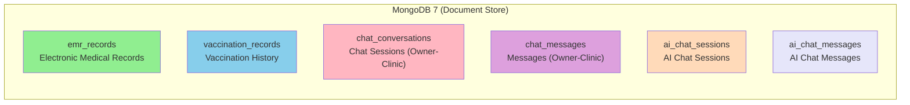

| Collection | Description | Avg Doc Size | Reference to PostgreSQL |
|------------|-------------|--------------|------------------------|
| emr_records | Electronic Medical Records (SOAP format) | ~2KB | pet_id, booking_id, staff_id, clinic_id |
| vaccination_records | Vaccination history | ~500B | pet_id, booking_id, staff_id, clinic_id |
| chat_conversations | 1-1 chat sessions | ~300B | pet_owner_id, clinic_id |
| chat_messages | Messages | ~200B | sender_id, chat_box_id (MongoDB _id) |
| ai_chat_sessions | AI-user chat sessions | ~500B | user_id, agent_id (logical ref) |
| ai_chat_messages | AI-user chat messages + metadata | ~1KB | session_id (MongoDB _id) |

#### 2.2.2 Collection Descriptions

##### Collection: emr_records

**Description:** Electronic Medical Records in SOAP format (Subjective, Objective, Assessment, Plan) with embedded prescriptions and images.

**Sample Document:**
```json
{
  "_id": ObjectId("507f1f77bcf86cd799439011"),
  "petId": "550e8400-e29b-41d4-a716-446655440000",
  "bookingId": "550e8400-e29b-41d4-a716-446655440001",
  "staffId": "550e8400-e29b-41d4-a716-446655440002",
  "clinicId": "550e8400-e29b-41d4-a716-446655440003",
  "clinicName": "ABC Veterinary Clinic",
  "staffName": "Dr. Nguyen Van A",

  "subjective": "Owner reports pet stopped eating for 2 days, lethargic, vomited once this morning.",

  "objective": "Temperature: 39.5°C (mild fever). Heart: normal. Breathing: normal. Abdomen: slightly distended, tender in epigastric region. Mucous membranes: slightly pale.",

  "assessment": "Acute gastritis. Suspected ingestion of inappropriate food.",

  "plan": "Medical treatment for 5 days. Rest, feed soft and digestible food. Follow-up in 5 days if no improvement.",

  "notes": "",
  "weightKg": 4.5,
  "temperatureC": 39.5,
  "heartRate": 120,
  "bcs": 5,

  "prescriptions": [
    {
      "medicineName": "Amoxicillin 250mg",
      "dosage": "1 tablet",
      "frequency": "Twice daily",
      "durationDays": 5,
      "instructions": "Take after meals"
    },
    {
      "medicineName": "Omeprazole 20mg",
      "dosage": "1/2 tablet",
      "frequency": "Once daily (morning)",
      "durationDays": 5,
      "instructions": "Take 30 minutes before meals"
    }
  ],

  "images": [
    {
      "url": "https://res.cloudinary.com/petties/emr/xray-abdomen-001.jpg",
      "description": "Abdominal X-ray - No foreign body detected"
    }
  ],

  "examinationDate": ISODate("2025-01-26T10:30:00Z"),
  "reExaminationDate": ISODate("2025-01-31T00:00:00Z"),
  "createdAt": ISODate("2025-01-26T10:30:00Z")
}
```

**Fields:**

| Field | Type | Description |
|-------|------|-------------|
| petId | UUID | Pet reference (indexed) |
| bookingId | UUID | Booking reference (indexed) |
| staffId | UUID | Staff who created EMR |
| clinicId | UUID | Clinic reference |
| clinicName | String | Denormalized clinic name |
| staffName | String | Denormalized staff name |
| subjective | String | S - Symptoms described by owner |
| objective | String | O - Clinical observations |
| assessment | String | A - Diagnosis |
| plan | String | P - Treatment plan |
| notes | String | Additional notes |
| weightKg | BigDecimal | Pet weight at examination |
| temperatureC | BigDecimal | Body temperature |
| heartRate | Integer | Heart rate (bpm) |
| bcs | Integer | Body Condition Score (1-9) |
| images | EmrImage[] | Embedded images (url, description) |
| prescriptions | Prescription[] | Embedded prescriptions (medicineName, dosage, frequency, durationDays, instructions) |
| examinationDate | DateTime | Examination date |
| reExaminationDate | DateTime | Scheduled re-examination date |
| createdAt | DateTime | Record creation timestamp |

**Indexes:**
- `{ petId: 1 }` - Find EMR by pet
- `{ bookingId: 1 }` - Find by booking

##### Collection: vaccination_records

**Description:** Pet vaccination history, tracking administered vaccines and booster schedules.

**Sample Document:**
```json
{
  "_id": ObjectId("507f1f77bcf86cd799439012"),
  "petId": "550e8400-e29b-41d4-a716-446655440000",
  "bookingId": "550e8400-e29b-41d4-a716-446655440001",
  "staffId": "550e8400-e29b-41d4-a716-446655440002",
  "clinicId": "550e8400-e29b-41d4-a716-446655440003",
  "clinicName": "ABC Veterinary Clinic",
  "staffName": "Dr. Nguyen Van A",

  "vaccineName": "5-in-1 Vaccine (DHPP+Lepto)",
  "batchNumber": "VN2025-001234",
  "status": "COMPLETED",

  "vaccineTemplateId": "550e8400-e29b-41d4-a716-446655440010",
  "doseNumber": 2,
  "totalDoses": 3,
  "seriesId": "550e8400-e29b-41d4-a716-446655440020",

  "vaccinationDate": "2025-01-26",
  "nextDueDate": "2026-01-26",
  "reminderSent": false,

  "notes": "Booster dose 2. Pet is healthy, no adverse reactions. Schedule dose 3 in 1 year.",

  "createdAt": ISODate("2025-01-26T10:15:00Z")
}
```

**Fields:**

| Field | Type | Description |
|-------|------|-------------|
| petId | UUID | Pet reference (indexed) |
| bookingId | UUID | Booking reference |
| staffId | UUID | Staff who administered |
| clinicId | UUID | Clinic reference |
| clinicName | String | Denormalized clinic name |
| staffName | String | Denormalized staff name |
| vaccineName | String | Vaccine name |
| batchNumber | String | Batch number for tracking |
| status | String | PENDING, COMPLETED |
| vaccineTemplateId | UUID | Link to vaccine_templates master data |
| doseNumber | Integer | Dose number in series (e.g., 1, 2, 3) |
| totalDoses | Integer | Total doses in series (e.g., 3) |
| seriesId | UUID | Groups related doses together |
| vaccinationDate | LocalDate | Date administered |
| nextDueDate | LocalDate | Next due date (indexed) |
| reminderSent | Boolean | Whether reminder notification was sent |
| notes | String | Additional notes |
| createdAt | DateTime | Record creation timestamp |

**Indexes:**
- `{ petId: 1, vaccinationDate: -1 }` - Pet's vaccination history
- `{ nextDueDate: 1 }` - Find upcoming vaccinations

##### Collection: chat_conversations

**Description:** 1-1 chat sessions between Pet Owner and Clinic.

**Sample Document:**
```json
{
  "_id": ObjectId("507f1f77bcf86cd799439013"),
  "petOwnerId": "550e8400-e29b-41d4-a716-446655440000",
  "clinicId": "550e8400-e29b-41d4-a716-446655440001",

  "clinicName": "ABC Veterinary Clinic",
  "clinicLogo": "https://res.cloudinary.com/petties/clinics/clinic-001-logo.jpg",
  "petOwnerName": "Nguyen Van A",
  "petOwnerAvatar": "https://res.cloudinary.com/petties/avatars/user-001.jpg",

  "lastMessage": "Cam on Staff, ngay mai em se dem be den!",
  "lastMessageSender": "PET_OWNER",
  "lastMessageAt": ISODate("2025-01-26T15:30:00Z"),

  "unreadCountPetOwner": 0,
  "unreadCountClinic": 1,

  "petOwnerOnline": false,
  "clinicOnline": true,

  "lastAutoReplyAt": ISODate("2025-01-26T12:00:00Z"),
  "lastAutoReplyType": "QUICK_REPLY",

  "createdAt": ISODate("2025-01-20T08:00:00Z"),
  "updatedAt": ISODate("2025-01-26T15:30:00Z")
}
```

**Indexes:**
- `{ petOwnerId: 1, clinicId: 1 }` (unique) - One conversation per pet owner-clinic pair
- `{ lastMessageAt: -1 }` - Sort by most recent activity

##### Collection: chat_messages

**Description:** Messages within a conversation.

**Sample Document:**
```json
{
  "_id": ObjectId("507f1f77bcf86cd799439014"),
  "chatBoxId": "507f1f77bcf86cd799439013",

  "senderId": "550e8400-e29b-41d4-a716-446655440000",
  "senderType": "PET_OWNER",
  "senderName": "Nguyen Van A",
  "senderAvatar": "https://res.cloudinary.com/petties/avatars/user-001.jpg",

  "content": "Xin chao, em muon hoi lich tiem phong cho be nha em?",
  "messageType": "TEXT",
  "imageUrl": null,

  "status": "DELIVERED",
  "isRead": true,
  "readAt": ISODate("2025-01-26T14:35:00Z"),

  "actionButtons": [
    {
      "id": "btn-1",
      "label": "Dat lich ngay",
      "type": "BOOKING"
    }
  ],

  "createdAt": ISODate("2025-01-26T14:30:00Z")
}
```

**Inner Enums:**
- **SenderType:** PET_OWNER, CLINIC
- **MessageType:** TEXT, IMAGE, IMAGE_TEXT
- **MessageStatus:** SENT, DELIVERED, SEEN

**Inner Class ActionButton:**
- `id` (String), `label` (String), `type` (String: MENU, OFFER, BOOKING, CUSTOM)

##### Collection: ai_chat_sessions

**Description:** Session-level data cho hội thoại AI với người dùng.

**Sample Document:**
```json
{
    "_id": ObjectId("507f1f77bcf86cd799439015"),
    "session_id": "ai-sess-9e5a",
    "user_id": "550e8400-e29b-41d4-a716-446655440000",
    "agent_name": "petties_agent",
    "started_at": ISODate("2026-03-04T09:00:00Z"),
    "ended_at": null,
    "status": "ACTIVE"
}
```

**Indexes:**
- `{ session_id: 1 }` unique - session lookup
- `{ user_id: 1, started_at: -1 }` - user session history

##### Collection: ai_chat_messages

**Description:** Message-level data cho chat AI-user, bao gồm trace metadata từ ReAct/tool execution.

**Sample Document:**
```json
{
    "_id": ObjectId("507f1f77bcf86cd799439016"),
    "session_id": ObjectId("507f1f77bcf86cd799439015"),
    "role": "assistant",
    "content": "Bé có thể đang bị viêm dạ dày nhẹ...",
    "react_trace": {
        "steps": [
            {"type": "thought", "content": "Cần tra cứu knowledge base"}
        ]
    },
    "tool_calls": [
        {"tool_name": "pet_knowledge_search"}
    ],
    "sources": ["doc_12_chunk_3"],
    "timestamp": ISODate("2026-03-04T09:00:05Z")
}
```

**Indexes:**
- `{ session_id: 1, timestamp: 1 }` - ordered conversation replay
- `{ role: 1, timestamp: -1 }` - analytics by role

##### Chat Message Indexes (chat_messages)

**Indexes:**
- `{ chatBoxId: 1, createdAt: -1 }` - Messages in conversation
- `{ chatBoxId: 1, isRead: 1 }` - Unread message queries

##### Collection: ai_proactive_notifications

**Description:** Lưu trữ lịch sử hệ thống AI chủ động gửi thông báo (Push/Email) cho người dùng dựa trên phân tích dữ liệu (ví dụ: nhắc lịch tiêm phòng, cảnh báo sức khỏe).

**Sample Document:**
```json
{
    "_id": ObjectId("507f1f77bcf86cd799439017"),
    "user_id": "550e8400-e29b-41d4-a716-446655440000",
    "pet_id": "550e8400-e29b-41d4-a716-446655440011",
    "notification_type": "VACCINE_REMINDER",
    "title": "Đã đến lịch tiêm phòng Dại cho bé Miu",
    "content": "Theo hồ sơ, bé Miu cần tiêm nhắc lại vaccine Dại vào tuần tới. Vui lòng đặt lịch sớm nhé!",
    "status": "SENT",
    "error_message": null,
    "context_data": {
        "vaccine_name": "Rabies",
        "last_dose_date": "2025-03-10"
    },
    "created_at": ISODate("2026-03-05T08:00:00Z"),
    "sent_at": ISODate("2026-03-05T08:00:05Z")
}
```

**Indexes:**
- `{ user_id: 1, created_at: -1 }` - Lịch sử thông báo của user
- `{ status: 1 }` - Truy vấn các thông báo lỗi hoặc pending

##### Collection: chat_feedback

**Description:** Store user feedback for AI responses (thumbs up, thumbs down, report, confirmed) for analytics, audit, and operational monitoring. Feedback does not update Case Memory.

**Sample Document:**
```json
{
    "_id": ObjectId("507f1f77bcf86cd799439018"),
    "message_id": ObjectId("507f1f77bcf86cd799439016"),
    "session_id": ObjectId("507f1f77bcf86cd799439015"),
    "user_id": "550e8400-e29b-41d4-a716-446655440000",
    "feedback_type": "THUMBS_UP",
    "feedback_category": "medical",
    "feedback_text": "The answer was useful and clinically clear.",
    "weight": 0.6,
    "used_for_enrichment": false,
    "created_at": ISODate("2026-03-04T09:15:00Z")
}
```

**Indexes:**
- `{ message_id: 1 }` (unique) - 1 feedback / 1 message
- `{ session_id: 1 }` - Analyze feedback by session
- `{ user_id: 1 }` - Analyze satisfaction by user

---

## 2.3 Vector Database Design (Qdrant)

Hệ thống sử dụng **Qdrant Cloud** làm Vector Database chính để lưu trữ các metadata và vector embeddings phục vụ cho tính năng RAG (Retrieval-Augmented Generation) và Visual Case Memory. 
Toàn bộ collection sử dụng metric **Cosine Similarity** và vector dimensions từ mô hình **Cohere** (`1024` chiều) kết hợp với **Jina CLIP v2** (`1024` chiều) cho hình ảnh.

### 2.3.1 Collection: petties_knowledge_base

**Description:** Lưu trữ các chunks văn bản trích xuất từ tài liệu y khoa do Admin upload (PDF, DOCX) để cung cấp kiến thức nền cho RAG. Chỉ sử dụng text embedding.

**Vector Configuration:**
- Tên vector mặc định (`""`): Size 1024, Distance COSINE (Cohere embed-multilingual-v3.0)

**Payload Structure (Metadata):**
| Field | Type | Description |
|-------|------|-------------|
| document_id | String | UUID tham chiếu tới bảng `knowledge_documents` trong PostgreSQL |
| chunk_id | String | ID duy nhất cho đoạn trích (text chunk) |
| text_content | String | Nội dung văn bản của đoạn trích phục vụ retrieval |
| source_file | String | Tên file gốc |
| page_num | Integer | Số trang (nếu có từ cấu trúc tài liệu) |
| created_at | String | ISO-8601 Timestamp thời điểm index |

### 2.3.2 Collection: petties_case_memory_v2

**Description:** EMR-driven Case Memory for confirmed veterinary records. Stores text and image evidence from confirmed EMR so AI can retrieve similar real cases during diagnosis support.

**Vector Configuration:**
Use separate vectors for text and image retrieval:
- `text`: Size 1024, Distance COSINE (Cohere embed-multilingual-v3.0)
- `image`: Size 1024, Distance COSINE (Jina CLIP v2)

**Payload Structure (Metadata):**
| Field | Type | Description |
|-------|------|-------------|
| case_id | String | Stable identifier in the form `emr:{emr_id}` |
| source_type | String | Data source marker such as `confirmed_emr` |
| clinic_id | String | Clinic UUID associated with the EMR |
| pet_id | String | Pet UUID associated with the EMR |
| booking_id | String | Booking UUID if the EMR originated from a booking |
| doctor_id | String | Doctor/staff UUID who confirmed the EMR |
| species | String | Pet species |
| breed | String | Pet breed |
| chief_complaint | String | Chief complaint captured in the EMR |
| symptoms | Array | Structured symptom list |
| physical_exam | Array | Structured physical examination findings |
| clinical_notes | String | Additional clinical notes |
| final_diagnosis_text | String | Final diagnosis text from confirmed EMR |
| canonical_code | String | Normalized disease code when mapping is available; otherwise null/provisional |
| exam_at | String | Examination timestamp |
| emr_updated_at | String | Last EMR update timestamp used for case-memory upsert |
| image_urls | Array | Clinical image URLs attached to the EMR |
| image_embedding_provider | String | Image embedding provider metadata, for example `jina-clip-v2` |

---

## 2.4 Cache Database Design (Redis)

Redis 7 is used as a dedicated cache and short-lived state store for both Backend and AI Service runtime needs.

### 2.4.1 Purpose and Scope

- OTP and reset-code TTL storage for authentication workflows.
- Short-lived session/cache keys to reduce repeated database reads.
- Rate-limit counters and anti-abuse controls for selected API paths.
- Lightweight feature flags or temporary runtime coordination values when required.

### 2.4.2 Key Naming Convention

Use namespaced keys to avoid collision and simplify cleanup:

- `auth:otp:{email}`
- `auth:reset:{email}`
- `ratelimit:{route}:{userId}`
- `cache:{domain}:{id}`

### 2.4.3 TTL Strategy

- OTP/reset keys: strict short TTL (for example 5–15 minutes based on policy).
- Rate-limit keys: rolling window TTL matching policy window.
- Cache keys: domain-specific TTL (short for volatile data, longer for stable lookup data).
- Never store long-term source-of-truth business data in Redis.

### 2.4.4 Data Safety Rules

- Do not store plaintext secrets in Redis values.
- Minimize personal data in cached payloads.
- Ensure key invalidation on critical state transitions (password reset success, logout-all, policy updates).

### 2.4.5 Operational Notes

- Monitor hit rate, memory pressure, eviction policy, and latency.
- Validate TTL behavior in test environment before production rollout.
- Keep Redis as a performance layer; PostgreSQL/MongoDB remain system-of-record stores.

---

## 4. DETAILED DESIGN

### 4.1 Authentication

#### 4.1.1 Class Diagram - Authentication

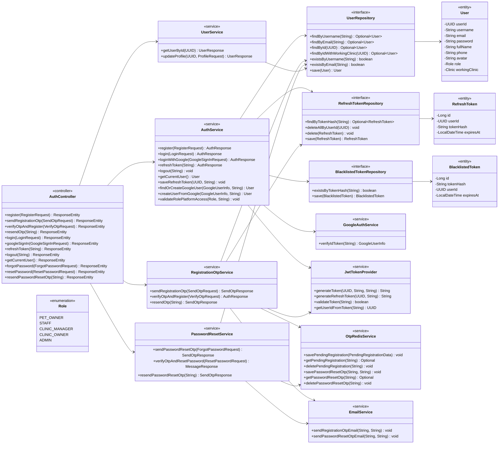

#### 4.1.2 User Registration with OTP (UC-PO-01)

```mermaid
sequenceDiagram
    actor User as Pet Owner
    participant UI as RegisterScreen (Mobile/Web)
    participant AC as AuthController
    participant ROS as RegistrationOtpService
    participant ORS as OtpRedisService
    participant ES as EmailService
    participant UR as UserRepository
    participant RTR as RefreshTokenRepository
    participant JTP as JwtTokenProvider
    participant DB as Database

    User->>UI: 1. Input info and click Send OTP
    activate UI
    UI->>AC: 2. sendRegistrationOtp(Request)
    activate AC
    AC->>ROS: 3. sendRegistrationOtp(Request)
    activate ROS
    ROS->>UR: 4. existsByEmail(email)
    activate UR
    UR->>DB: 5. Check email exists
    activate DB
    DB-->>UR: 6. Not exists
    deactivate DB
    UR-->>ROS: 7. false
    deactivate UR
    ROS->>ORS: 8. savePendingRegistration(data)
    activate ORS
    ORS-->>ROS: 9. OK
    deactivate ORS
    ROS->>ES: 10. sendRegistrationOtpEmail(email, otp)
    activate ES
    ES-->>User: 11. Receive OTP via Email
    deactivate ES
    ROS-->>AC: 12. SendOtpResponse
    deactivate ROS
    AC-->>UI: 13. 200 OK
    deactivate AC
    UI-->>User: 14. Show OTP Input Screen
    deactivate UI

    User->>UI: 15. Input OTP and click Register
    activate UI
    UI->>AC: 16. verifyOtpAndRegister(VerifyOtpRequest)
    activate AC
    AC->>ROS: 17. verifyOtpAndRegister(Request)
    activate ROS
    ROS->>ORS: 18. getPendingRegistration(email)
    activate ORS
    ORS-->>ROS: 19. PendingRegistrationData
    deactivate ORS
    ROS->>ROS: 20. validateOtp
    ROS->>UR: 21. save(New User)
    activate UR
    UR->>DB: 22. Create user record
    activate DB
    DB-->>UR: 23. Inserted
    deactivate DB
    UR-->>ROS: 24. Saved User
    deactivate UR
    ROS->>ORS: 25. deletePendingRegistration(email)
    activate ORS
    ROS->>JTP: 26. generateToken
    activate JTP
    JTP-->>ROS: 27. Access Token
    deactivate JTP
    ROS->>JTP: 28. generateRefreshToken
    activate JTP
    JTP-->>ROS: 29. Refresh Token
    deactivate JTP
    ROS->>RTR: 30. save(RefreshToken)
    activate RTR
    RTR->>DB: 31. Create refresh token record
    activate DB
    DB-->>RTR: 32. Inserted
    deactivate DB
    RTR-->>ROS: 33. OK
    deactivate RTR
    ROS-->>AC: 34. AuthResponse
    deactivate ROS
    AC-->>UI: 35. 201 Created
    deactivate AC
    UI-->>User: 36. Redirect to Home
    deactivate UI
    deactivate ORS
    deactivate ROS
```

#### 4.1.3 Login with Username/Password

```mermaid
sequenceDiagram
    actor User as User
    participant UI as LoginScreen
    participant AC as AuthController
    participant AS as AuthService
    participant AM as AuthenticationManager
    participant UR as UserRepository
    participant JTP as JwtTokenProvider
    participant RTR as RefreshTokenRepository
    participant DB as Database

    User->>UI: 1. Input username/password and click Login
    activate UI
    UI->>AC: 2. login(LoginRequest)
    activate AC
    AC->>AS: 3. login(LoginRequest)
    activate AS
    AS->>AM: 4. authenticate(credentials)
    activate AM
    AM->>UR: 5. loadUserByUsername(username)
    activate UR
    UR->>DB: 6. Query user by username
    activate DB
    DB-->>UR: 7. User record
    deactivate DB
    UR-->>AM: 8. UserDetails
    deactivate UR
    AM-->>AS: 9. Authentication Object
    deactivate AM
    AS->>UR: 10. findByIdWithWorkingClinic(userId)
    activate UR
    UR->>DB: 11. Query user with working clinic
    activate DB
    DB-->>UR: 12. User with Clinic
    deactivate DB
    UR-->>AS: 13. User Entity
    deactivate UR
    alt Role equals PET_OWNER and Platform equals Web
        AS-->>AC: 14. 403 Forbidden
        deactivate AS
        AC-->>UI: 15. Error Mobile Only
        deactivate AC
        UI-->>User: 16. Show Mobile App prompt
        deactivate UI
    else Valid Platform
        AS->>RTR: 17. deleteAllByUserId(userId)
        activate RTR
        RTR->>DB: 18. Delete existing refresh tokens
        activate DB
        DB-->>RTR: 19. Deleted
        deactivate DB
        AS->>JTP: 20. generateToken
        activate JTP
        JTP-->>AS: 21. Access Token
        deactivate JTP
        AS->>JTP: 22. generateRefreshToken
        activate JTP
        JTP-->>AS: 23. Refresh Token
        deactivate JTP
        AS->>RTR: 24. save(RefreshToken)
        activate RTR
        RTR->>DB: 25. Create refresh token record
        activate DB
        DB-->>RTR: 26. Inserted
        deactivate DB
        RTR-->>AS: 27. OK
        deactivate RTR
        AS-->>AC: 28. AuthResponse
        deactivate AS
        AC-->>UI: 29. 200 OK
        deactivate AC
        UI-->>User: 30. Login Success
        deactivate UI
    end
```

#### 4.1.4 Sign in with Google Account

```mermaid
sequenceDiagram
    actor User as User
    participant UI as LoginScreen
    participant AC as AuthController
    participant AS as AuthService
    participant GAS as GoogleAuthService
    participant UR as UserRepository
    participant RTR as RefreshTokenRepository
    participant JTP as JwtTokenProvider
    participant DB as Database

    User->>UI: 1. Click Sign in with Google
    activate UI
    UI->>GAS: 2. Redirect to Google Sign-In
    activate GAS
    GAS-->>UI: 3. Return ID Token
    deactivate GAS
    UI->>AC: 4. googleSignIn(idToken, platform)
    activate AC
    AC->>AS: 5. loginWithGoogle(request)
    activate AS
    AS->>GAS: 6. verifyIdToken(idToken)
    activate GAS
    GAS-->>AS: 7. GoogleUserInfo
    deactivate GAS
    AS->>UR: 8. findByEmail(email)
    activate UR
    UR->>DB: 9. Query user by email
    activate DB
    DB-->>UR: 10. Result
    deactivate DB
    UR-->>AS: 11. Optional User
    deactivate UR
    alt User not exists
        AS->>AS: 12. createUserFromGoogle
        AS->>UR: 13. save(New User)
        activate UR
        UR->>DB: 14. Create user record
        activate DB
        DB-->>UR: 15. Inserted
        deactivate DB
        UR-->>AS: 16. Saved User
        deactivate UR
    end
    AS->>AS: 17. validateRolePlatformAccess
    alt Role-Platform Mismatch
        AS-->>AC: 18. 403 Forbidden
        deactivate AS
        AC-->>UI: 19. Error mismatch
        deactivate AC
        UI-->>User: 20. Show error message
        deactivate UI
    else Valid Access
        AS->>RTR: 21. deleteAllByUserId(userId)
        activate RTR
        RTR->>DB: 22. Delete existing refresh tokens
        activate DB
        DB-->>RTR: 23. Deleted
        deactivate DB
        AS->>JTP: 24. generateToken
        activate JTP
        JTP-->>AS: 25. Access Token
        deactivate JTP
        AS->>JTP: 26. generateRefreshToken
        activate JTP
        JTP-->>AS: 27. Refresh Token
        deactivate JTP
        AS->>RTR: 28. save(RefreshToken)
        activate RTR
        RTR->>DB: 29. Create refresh token record
        activate DB
        DB-->>RTR: 30. Inserted
        deactivate DB
        RTR-->>AS: 31. OK
        deactivate RTR
        AS-->>AC: 32. AuthResponse
        deactivate AS
        AC-->>UI: 33. 200 OK
        deactivate AC
        UI-->>User: 34. Login Successful
        deactivate UI
    end
```

#### 4.1.5 Forgot Password

```mermaid
sequenceDiagram
    actor User as User
    participant UI as ForgotPasswordScreen
    participant AC as AuthController
    participant PRS as PasswordResetService
    participant ORS as OtpRedisService
    participant ES as EmailService
    participant UR as UserRepository
    participant DB as Database

    User->>UI: 1. Input email and click Send OTP
    activate UI
    UI->>AC: 2. forgotPassword(ForgotPasswordRequest)
    activate AC
    AC->>PRS: 3. sendPasswordResetOtp(request)
    activate PRS
    PRS->>UR: 4. findByEmail(email)
    activate UR
    UR->>DB: 5. Query user by email
    activate DB
    DB-->>UR: 6. User record
    deactivate DB
    UR-->>PRS: 7. User Entity
    deactivate UR
    PRS->>ORS: 8. getPasswordResetCooldownRemaining
    activate ORS
    ORS-->>PRS: 9. 0
    deactivate ORS
    PRS->>ORS: 10. savePasswordResetOtp
    activate ORS
    ORS-->>PRS: 11. OK
    deactivate ORS
    PRS->>ES: 12. sendPasswordResetOtpEmail
    activate ES
    ES-->>User: 13. Receive OTP via Email
    deactivate ES
    PRS-->>AC: 14. SendOtpResponse
    deactivate PRS
    AC-->>UI: 15. 200 OK
    deactivate AC
    UI-->>User: 16. Show Reset Password Form
    deactivate UI
    deactivate ORS
```

#### 4.1.6 Reset Password

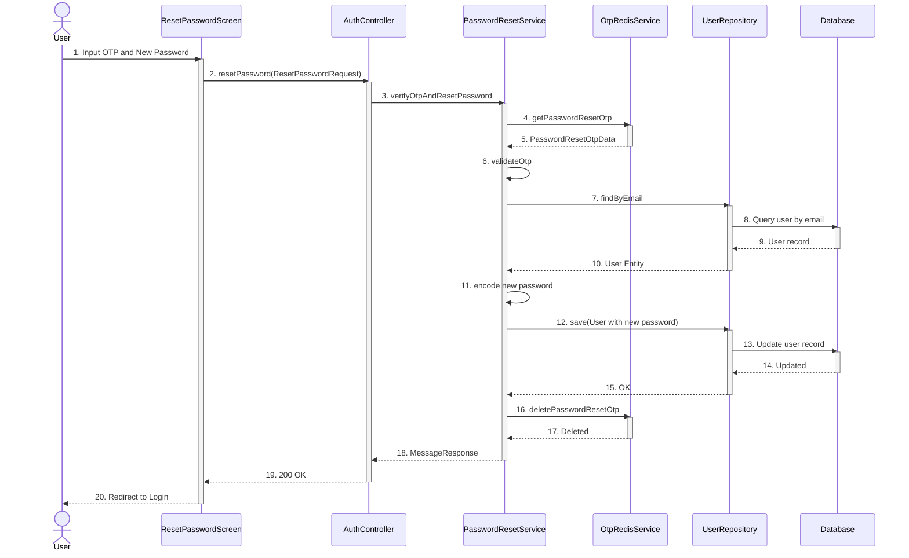

#### 4.1.7 Logout

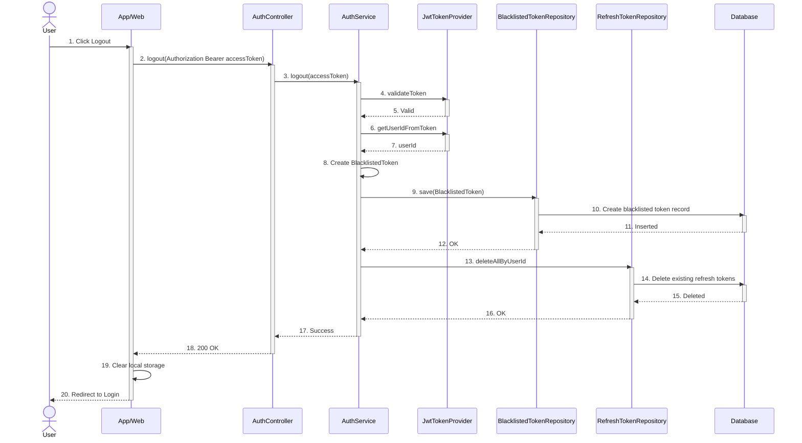

---

### 4.2 User Profile Management

#### 4.2.1 Class Diagram - User Profile

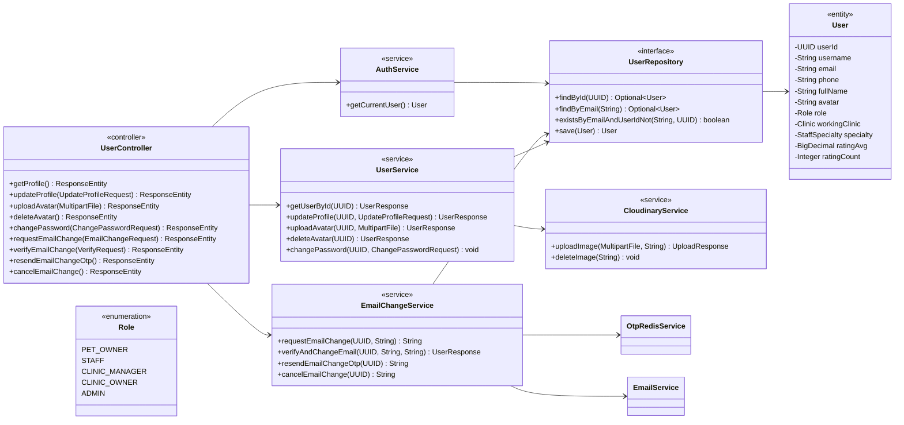

#### 4.2.2 View Profile

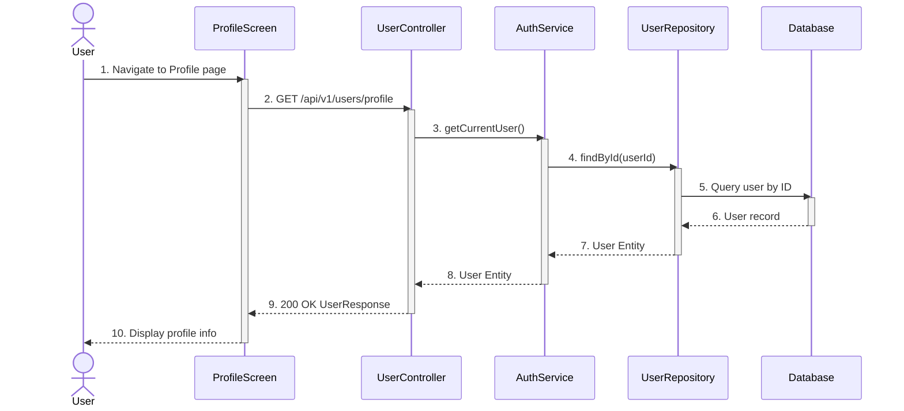

#### 4.2.3 Update Profile

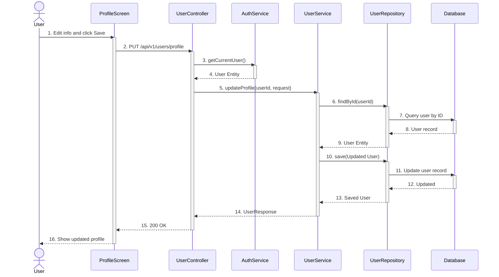

#### 4.2.4 Change Password

```mermaid
sequenceDiagram
    actor User as User
    participant UI as ChangePasswordScreen
    participant UC as UserController
    participant AS as AuthService
    participant US as UserService
    participant UR as UserRepository
    participant DB as Database

    User->>UI: 1. Input current and new password
    activate UI
    UI->>UC: 2. PUT /api/v1/users/change-password
    activate UC
    UC->>AS: 3. getCurrentUser()
    activate AS
    AS-->>UC: 4. User Entity
    deactivate AS
    UC->>US: 5. changePassword(userId, request)
    activate US
    US->>UR: 6. findById(userId)
    activate UR
    UR->>DB: 7. Query user by ID
    activate DB
    DB-->>UR: 8. User record
    deactivate DB
    UR-->>US: 9. User Entity
    deactivate UR
    alt Password mismatch
        US-->>UC: 10. BadRequestException
        deactivate US
        UC-->>UI: 11. 400 Error
        deactivate UC
        UI-->>User: 12. Show error
        deactivate UI
    else Password matches
        US->>US: 13. encode new password
        US->>UR: 14. save(User)
        activate UR
        UR->>DB: 15. Update user record
        activate DB
        DB-->>UR: 16. Updated
        deactivate DB
        UR-->>US: 17. OK
        deactivate UR
        US-->>UC: 18. Success
        deactivate US
        UC-->>UI: 19. 200 OK
        deactivate UC
        UI-->>User: 20. Show success message
        deactivate UI
    end
```

---

### 4.3 Staff and Scheduling Management

#### 4.3.1 Class Diagram - Staff and Scheduling

```mermaid
classDiagram
    direction LR

    %% Controller Dependencies
    ClinicStaffController --> ClinicStaffService
    StaffShiftController --> StaffShiftService

    %% Service Dependencies
    ClinicStaffService --> UserRepository
    ClinicStaffService --> StaffShiftRepository
    StaffShiftService --> StaffShiftRepository
    StaffShiftService --> SlotRepository

    %% Repository Dependencies
    UserRepository --> User
    StaffShiftRepository --> StaffShift
    SlotRepository --> Slot

    %% Entities
    class ClinicStaffController {
        <<controller>>
        +getStaff(UUID) ResponseEntity
        +inviteByEmail(UUID, InviteByEmailRequest) ResponseEntity
        +getStaffList(UUID) ResponseEntity
        +removeStaff(UUID, UUID) ResponseEntity
    }
    class ClinicStaffService {
        <<service>>
        +getClinicStaff(UUID) List~StaffResponse~
        +inviteByEmail(UUID, InviteByEmailRequest) void
        +removeStaff(UUID, UUID) void
    }
    class StaffShiftController {
        <<controller>>
        +createShift(UUID, StaffShiftRequest) ResponseEntity
        +getShiftsByClinic(UUID, LocalDate, LocalDate) ResponseEntity
        +getShift(UUID) ResponseEntity
        +deleteShift(UUID) ResponseEntity
    }
    class StaffShiftService {
        <<service>>
        +createShifts(UUID, StaffShiftRequest) List~StaffShiftResponse~
        +generateSlots(StaffShift, LocalTime, LocalTime) void
        +validateOperatingHours(...) void
        +deleteShift(UUID) void
    }
    class UserRepository {
        <<interface>>
        +findByEmail(String) Optional~User~
        +findById(UUID) Optional~User~
        +save(User) User
    }
    class StaffShiftRepository {
        <<interface>>
        +findByClinicAndDateRange(...) List~StaffShift~
        +existsByVetUserIdAndWorkDateAndTimeRange(...) boolean
        +findById(UUID) Optional~StaffShift~
        +save(StaffShift) StaffShift
        +delete(StaffShift) void
    }
    class SlotRepository {
        <<interface>>
        +deleteAll(List~Slot~) void
    }
    class User {
        <<entity>>
        -UUID userId
        -String username
        -String email
        -String fullName
        -String phone
        -Role role
        -Clinic workingClinic
        -StaffSpecialty specialty
    }
    class StaffShift {
        <<entity>>
        -UUID shiftId
        -User vet
        -Clinic clinic
        -LocalDate workDate
        -LocalTime startTime
        -LocalTime endTime
        -List~Slot~ slots
    }
    class Slot {
        <<entity>>
        -UUID slotId
        -StaffShift shift
        -LocalTime startTime
        -LocalTime endTime
        -SlotStatus status
    }
    class Role {
        <<enumeration>>
        PET_OWNER
        STAFF
        CLINIC_MANAGER
        CLINIC_OWNER
        ADMIN
    }
    class StaffSpecialty {
        <<enumeration>>
        GENERAL
        DERMATOLOGY
        SURGERY
        DENTISTRY
    }
    class SlotStatus {
        <<enumeration>>
        AVAILABLE
        BOOKED
        BLOCKED
    }
    StaffShift "1" --* "0..*" Slot
    StaffShift "0..*" --o "1" User
    User "0..*" --o "1" Role
    Slot "0..*" --o "1" SlotStatus
    User "0..*" --o "1" StaffSpecialty
```

#### 4.3.2 View Staff Dashboard

```mermaid
sequenceDiagram
    actor Staff as STAFF
    participant UI as Staff Dashboard (Mobile/Web)
    participant SC as StaffDashboardController
    participant SS as StaffDashboardService
    participant BR as BookingRepository
    participant SSR as StaffShiftRepository
    participant DB as Database

    Staff->>UI: 1. Login and navigate to Staff Dashboard
    activate UI
    UI->>SC: 2. GET /api/v1/staff/dashboard
    activate SC
    SC->>SS: 3. getDashboardData(staffId)
    activate SS
    SS->>SSR: 4. findByVetUserIdAndDateRange(staffId, today)
    activate SSR
    SSR->>DB: 5. Retrieve shifts for today
    activate DB
    DB-->>SSR: 6. Today's shifts
    deactivate DB
    SSR-->>SS: 7. Shift list
    deactivate SSR
    SS->>BR: 8. findByAssignedStaffIdAndStatus(staffId, TODAY)
    activate BR
    BR->>DB: 9. Retrieve today's assigned bookings
    activate DB
    DB-->>BR: 10. Booking list
    deactivate DB
    BR-->>SS: 11. Booking list
    deactivate BR
    SS-->>SC: 12. DashboardResponse (shifts, bookings, stats)
    deactivate SS
    SC-->>UI: 13. 200 OK
    deactivate SC
    UI-->>Staff: 14. Display dashboard with today's schedule and assigned bookings
    deactivate UI
```

#### 4.3.3 Invite Staff by Email (UC-CM-03, UC-CO-06)

```mermaid
sequenceDiagram
    actor User as Clinic Owner/Manager
    participant UI as StaffListScreen
    participant CFC as ClinicStaffController
    participant CFS as ClinicStaffService
    participant AS as AuthService
    participant UR as UserRepository
    participant DB as Database

    User->>UI: 1. Input email, role, specialty
    activate UI
    UI->>CFC: 2. inviteByEmail(clinicId, request)
    activate CFC
    CFC->>CFS: 3. inviteByEmail(clinicId, request)
    activate CFS
    CFS->>AS: 4. getCurrentUser()
    activate AS
    AS-->>CFS: 5. currentUser
    deactivate AS
    CFS->>CFS: 6. Validate permissions
    CFS->>UR: 7. findByEmail(email)
    activate UR
    UR->>DB: 8. Search user by email
    activate DB
    DB-->>UR: 9. User or null
    deactivate DB
    UR-->>CFS: 10. User or null
    deactivate UR
    alt User already exists
        CFS->>CFS: 11. Check clinic assignment
        CFS->>CFS: 12. Update role and workingClinic
    else New user
        CFS->>CFS: 13. Create User with random password
        CFS->>CFS: 14. Set workingClinic
    end
    CFS->>UR: 15. save(User)
    activate UR
    UR->>DB: 16. Persist user record
    activate DB
    DB-->>UR: 17. OK
    deactivate DB
    UR-->>CFS: 18. OK
    deactivate UR
    CFS-->>CFC: 19. void
    deactivate CFS
    CFC-->>UI: 20. 200 OK
    deactivate CFC
    UI-->>User: 21. Staff invited successfully
    deactivate UI
```

#### 4.3.4 View List of Staffs

```mermaid
sequenceDiagram
    actor User as Clinic Manager
    participant UI as StaffListScreen
    participant CFC as ClinicStaffController
    participant CFS as ClinicStaffService
    participant UR as UserRepository
    participant DB as Database

    User->>UI: 1. Navigate to Staff List
    activate UI
    UI->>CFC: 2. GET /api/v1/clinic/staff
    activate CFC
    CFC->>CFS: 3. getClinicStaff(clinicId)
    activate CFS
    CFS->>UR: 4. findByWorkingClinic(clinicId)
    activate UR
    UR->>DB: 5. Retrieve staff by clinic
    activate DB
    DB-->>UR: 6. Staff list
    deactivate DB
    UR-->>CFS: 7. Staff list
    deactivate UR
    CFS-->>CFC: 8. List~StaffResponse~
    deactivate CFS
    CFC-->>UI: 9. 200 OK
    deactivate CFC
    UI-->>User: 10. Display staff list
    deactivate UI
```

#### 4.3.5 View Own Work Schedule

```mermaid
sequenceDiagram
    actor User as Staff
    participant UI as StaffDashboard (Mobile/Web)
    participant SSC as StaffShiftController
    participant SSR as StaffShiftRepository
    participant DB as Database

    User->>UI: 1. Navigate to My Schedule
    activate UI
    UI->>SSC: 2. GET /api/v1/shifts/my
    activate SSC
    SSC->>SSR: 3. findByVetUserIdAndDateRange(userId, from, to)
    activate SSR
    SSR->>DB: 4. Retrieve shifts for user
    activate DB
    DB-->>SSR: 5. Shift list
    deactivate DB
    SSR-->>SSC: 6. List~StaffShift~
    deactivate SSR
    SSC-->>UI: 7. 200 OK
    deactivate SSC
    UI-->>User: 8. Display work schedule
    deactivate UI
```

#### 4.3.6 Create Staff Shift

```mermaid
sequenceDiagram
    actor User as Clinic Manager
    participant UI as StaffShiftDashboard (Web)
    participant SSC as StaffShiftController
    participant SSS as StaffShiftService
    participant SSR as StaffShiftRepository
    participant DB as Database

    User->>UI: 1. Choose staff, dates, time range
    activate UI
    UI->>SSC: 2. createShift(clinicId, request)
    activate SSC
    SSC->>SSS: 3. createShifts(clinicId, request)
    activate SSS
    loop For each workDate
        SSS->>SSR: 4. Check for overlaps
        activate SSR
        SSR->>DB: 5. Retrieve existing shifts
        activate DB
        DB-->>SSR: 6. Conflict result
        deactivate DB
        SSR-->>SSS: 7. Conflict result
        deactivate SSR
        alt forceUpdate equals false and conflicts exist
            SSS-->>SSC: 8. throw ConflictException
            deactivate SSS
            SSC-->>UI: 9. 409 Conflict
            deactivate SSC
            UI-->>User: 10. Show conflict warning
            deactivate UI
        else No conflicts or forceUpdate equals true
            SSS->>SSS: 11. Create StaffShift entity
            SSS->>SSS: 12. Generate 30-min slots
            SSS->>SSR: 13. save(StaffShift with slots)
            activate SSR
            SSR->>DB: 14. Persist shift and slots
            activate DB
            DB-->>SSR: 15. OK
            deactivate DB
            SSR-->>SSS: 16. Saved StaffShift
            deactivate SSR
        end
    end
    SSS-->>SSC: 17. List~StaffShiftResponse~
    deactivate SSS
    SSC-->>UI: 18. 201 Created
    deactivate SSC
    UI-->>User: 19. Refresh calendar
    deactivate UI
```

#### 4.3.7 View Staff Shift

```mermaid
sequenceDiagram
    actor User as Clinic Manager
    participant UI as ManagerDashboard (Web)
    participant SSC as StaffShiftController
    participant SSR as StaffShiftRepository
    participant DB as Database

    User->>UI: 1. Select a staff shift
    activate UI
    UI->>SSC: 2. GET /api/v1/shifts/shiftId
    activate SSC
    SSC->>SSR: 3. findById(shiftId)
    activate SSR
    SSR->>DB: 4. Retrieve shift by ID
    activate DB
    DB-->>SSR: 5. StaffShift with slots
    deactivate DB
    SSR-->>SSC: 6. StaffShift entity
    deactivate SSR
    SSC-->>UI: 7. 200 OK
    deactivate SSC
    UI-->>User: 8. Display shift details with slots
    deactivate UI
```

#### 4.3.8 Delete Staff Shift

```mermaid
sequenceDiagram
    actor User as Clinic Manager
    participant UI as ManagerDashboard (Web)
    participant SSC as StaffShiftController
    participant SSS as StaffShiftService
    participant SSR as StaffShiftRepository
    participant SR as SlotRepository
    participant DB as Database

    User->>UI: 1. Select shift and click Delete
    activate UI
    UI->>SSC: 2. deleteShift(shiftId)
    activate SSC
    SSC->>SSS: 3. deleteShift(id)
    activate SSS
    SSS->>SSR: 4. findById(id)
    activate SSR
    SSR->>DB: 5. Retrieve shift by ID
    activate DB
    DB-->>SSR: 6. StaffShift with slots
    deactivate DB
    SSR-->>SSS: 7. StaffShift entity
    deactivate SSR
    SSS->>SSS: 8. Check slot statuses
    alt Has BOOKED slots
        SSS-->>SSC: 9. throw BadRequestException
        deactivate SSS
        SSC-->>UI: 10. 400 Error cannot delete
        deactivate SSC
        UI-->>User: 11. Show error message
        deactivate UI
    else All slots deletable
        SSS->>SR: 12. deleteAll(slots)
        activate SR
        SR->>DB: 13. Remove slot records
        activate DB
        DB-->>SR: 14. Deleted
        deactivate DB
        SR-->>SSS: 15. OK
        deactivate SR
        SSS->>SSR: 16. delete(shift)
        activate SSR
        SSR->>DB: 17. Remove shift record
        activate DB
        DB-->>SSR: 18. Deleted
        deactivate DB
        SSR-->>SSS: 19. OK
        deactivate SSR
        SSS-->>SSC: 20. void
        deactivate SSS
        SSC-->>UI: 21. 204 No Content
        deactivate SSC
        UI-->>User: 22. Remove shift from calendar
        deactivate UI
    end
```

#### 4.3.9 Delete Staff

```mermaid
sequenceDiagram
    actor Manager as CLINIC_MANAGER
    participant UI as Manager Dashboard (Web)
    participant CFC as ClinicStaffController
    participant CFS as ClinicStaffService
    participant UR as UserRepository
    participant DB as Database

    Manager->>UI: 1. Select staff member -> Click "Remove Staff"
    activate UI
    UI->>Manager: 2. Show confirmation modal
    Manager->>UI: 3. Confirm removal
    UI->>CFC: 4. DELETE /api/v1/clinic/staff/{staffId}
    activate CFC
    CFC->>CFS: 5. removeStaff(clinicId, staffId)
    activate CFS
    CFS->>UR: 6. findById(staffId)
    activate UR
    UR->>DB: 7. Retrieve staff by ID
    activate DB
    DB-->>UR: 8. Staff entity
    deactivate DB
    UR-->>CFS: 9. Staff entity
    deactivate UR
    CFS->>CFS: 10. Validate staff belongs to clinic
    CFS->>CFS: 11. Check no pending/confirmed bookings
    alt Has active bookings
        CFS-->>CFC: 12. throw BadRequestException("Nhân viên có lịch hẹn chưa hoàn thành")
        deactivate CFS
        CFC-->>UI: 13. 400 Bad Request
        deactivate CFC
        UI-->>Manager: 14. Show error toast "Nhân viên có lịch hẹn chưa hoàn thành"
    else No active bookings
        CFS->>UR: 15. save(staff with workingClinic=null)
        activate UR
        UR->>DB: 16. Remove clinic assignment from staff
        activate DB
        DB-->>UR: 17. Updated
        deactivate DB
        UR-->>CFS: 18. Updated staff
        deactivate UR
        CFS-->>CFC: 19. void
        deactivate CFS
        CFC-->>UI: 20. 204 No Content
        deactivate CFC
        UI-->>Manager: 21. Remove staff from clinic list and show success toast
    end
    deactivate UI
```

---

### 4.4 Pet Profile Management

#### 4.4.1 Class Diagram - Pet Profile

```mermaid
classDiagram
    direction LR

    %% Controller Dependencies
    PetController --> PetService

    %% Service Dependencies
    PetService --> PetRepository
    PetService --> CloudinaryService

    %% Repository Dependencies
    PetRepository --> Pet
    PetRepository --> User

    %% Entities
    class PetController {
        <<controller>>
        +getPets(String, String, Pageable) ResponseEntity
        +getMyPets() ResponseEntity
        +getPet(UUID) ResponseEntity
        +createPet(PetRequest, MultipartFile) ResponseEntity
        +updatePet(UUID, PetRequest, MultipartFile) ResponseEntity
        +deletePet(UUID) ResponseEntity
    }
    class PetService {
        <<service>>
        +createPet(PetRequest, MultipartFile) PetResponse
        +getMyPets() List~PetResponse~
        +getPet(UUID) PetResponse
        +updatePet(UUID, PetRequest, MultipartFile) PetResponse
        +deletePet(UUID) void
    }
    class CloudinaryService {
        <<service>>
        +uploadImage(MultipartFile, String) UploadResponse
        +deleteImage(String) void
    }
    class PetRepository {
        <<interface>>
        +findById(UUID) Optional~Pet~
        +findByOwner(User) List~Pet~
        +findAllByUserId(UUID) List~Pet~
        +save(Pet) Pet
        +delete(Pet) void
    }
    class Pet {
        <<entity>>
        -UUID id
        -String name
        -String species
        -String breed
        -LocalDate dateOfBirth
        -Double weight
        -String gender
        -String imageUrl
        -User owner
    }
    class User {
        <<entity>>
        -UUID userId
        -String username
        -String email
    }
    class PetSpecies {
        <<enumeration>>
        DOG
        CAT
        BIRD
        RABBIT
        HAMSTER
        FISH
        REPTILE
        OTHER
    }
    class Gender {
        <<enumeration>>
        MALE
        FEMALE
    }
    Pet "0..*" --o "1" User
    Pet "0..*" --o "1" PetSpecies
    Pet "0..*" --o "1" Gender
```

#### 4.4.2 View Pet Profile

```mermaid
sequenceDiagram
    actor User as Pet Owner
    participant UI as PetDetailScreen (Mobile)
    participant PC as PetController
    participant PS as PetService
    participant PR as PetRepository
    participant DB as Database

    User->>UI: 1. Navigate to Pet Profile
    activate UI
    UI->>PC: 2. GET /api/v1/pets/petId
    activate PC
    PC->>PS: 3. getPet(petId)
    activate PS
    PS->>PR: 4. findById(petId)
    activate PR
    PR->>DB: 5. Query pet by ID
    activate DB
    DB-->>PR: 6. Pet record
    deactivate DB
    PR-->>PS: 7. Pet Entity
    deactivate PR
    PS->>PS: 8. validateOwnership
    PS-->>PC: 9. PetResponse
    deactivate PS
    PC-->>UI: 10. 200 OK
    deactivate PC
    UI-->>User: 11. Display pet profile
    deactivate UI
```

#### 4.4.3 Create Pet Profile

```mermaid
sequenceDiagram
    actor User as Pet Owner
    participant UI as AddPetScreen (Mobile)
    participant PC as PetController
    participant PS as PetService
    participant AS as AuthService
    participant CS as CloudinaryService
    participant PR as PetRepository
    participant DB as Database

    User->>UI: 1. Input pet info and select image
    activate UI
    UI->>PC: 2. createPet(petRequest, imageFile)
    activate PC
    PC->>PS: 3. createPet(request, image)
    activate PS
    PS->>AS: 4. getCurrentUser()
    activate AS
    AS-->>PS: 5. User Entity
    deactivate AS
    alt Image provided
        PS->>CS: 6. uploadImage(image, pets)
        activate CS
        CS-->>PS: 7. UploadResponse URL
        deactivate CS
    end
    PS->>PR: 8. save(Pet Entity)
    activate PR
    PR->>DB: 9. Create pet record
    activate DB
    DB-->>PR: 10. Inserted
    deactivate DB
    PR-->>PS: 11. Saved Pet
    deactivate PR
    PS-->>PC: 12. PetResponse
    deactivate PS
    PC-->>UI: 13. 201 Created
    deactivate PC
    UI-->>User: 14. Show new pet in list
    deactivate UI
```

#### 4.4.4 Edit Pet Profile

```mermaid
sequenceDiagram
    actor User as Pet Owner
    participant UI as EditPetScreen (Mobile)
    participant PC as PetController
    participant PS as PetService
    participant CS as CloudinaryService
    participant PR as PetRepository
    participant DB as Database

    User->>UI: 1. Edit pet info and click Save
    activate UI
    UI->>PC: 2. updatePet(petId, request, imageFile)
    activate PC
    PC->>PS: 3. updatePet(id, request, image)
    activate PS
    PS->>PR: 4. findById(id)
    activate PR
    PR->>DB: 5. Query pet by ID
    activate DB
    DB-->>PR: 6. Pet Entity
    deactivate DB
    PR-->>PS: 7. Pet Entity
    deactivate PR
    PS->>PS: 8. validateOwnership
    alt New image provided
        PS->>CS: 9. deleteImage(oldPublicId)
        activate CS
        CS-->>PS: 10. OK
        deactivate CS
        PS->>CS: 11. uploadImage(newImage, pets)
        activate CS
        CS-->>PS: 12. New URL
        deactivate CS
    end
    PS->>PR: 13. save(Updated Pet)
    activate PR
    PR->>DB: 14. Update pet record
    activate DB
    DB-->>PR: 15. Updated
    deactivate DB
    PR-->>PS: 16. OK
    deactivate PR
    PS-->>PC: 17. PetResponse
    deactivate PS
    PC-->>UI: 18. 200 OK
    deactivate PC
    UI-->>User: 19. Show updated pet
    deactivate UI
```

#### 4.4.5 Delete Pet Profile

```mermaid
sequenceDiagram
    actor User as Pet Owner
    participant UI as PetDetailScreen (Mobile)
    participant PC as PetController
    participant PS as PetService
    participant CS as CloudinaryService
    participant PR as PetRepository
    participant DB as Database

    User->>UI: 1. Click Delete and confirm
    activate UI
    UI->>PC: 2. deletePet(petId)
    activate PC
    PC->>PS: 3. deletePet(id)
    activate PS
    PS->>PR: 4. findById(id)
    activate PR
    PR->>DB: 5. Query pet by ID
    activate DB
    DB-->>PR: 6. Pet Entity
    deactivate DB
    PR-->>PS: 7. Pet Entity
    deactivate PR
    PS->>PS: 8. validateOwnership
    alt Pet has image
        PS->>CS: 9. deleteImage(publicId)
        activate CS
        CS-->>PS: 10. OK
        deactivate CS
    end
    PS->>PR: 11. delete(pet)
    activate PR
    PR->>DB: 12. Delete pet record
    activate DB
    DB-->>PR: 13. Deleted
    deactivate DB
    PR-->>PS: 14. OK
    deactivate PR
    PS-->>PC: 15. 204 No Content
    deactivate PS
    PC-->>UI: 16. Success
    deactivate PC
    UI-->>User: 17. Remove pet from list
    deactivate UI
```

---

### 4.5 Patient Management

#### 4.5.1 Class Diagram - Patient Management

```mermaid
classDiagram
    direction LR

    %% Controller Dependencies
    PetController --> PatientService

    %% Service Dependencies
    PatientService --> PetRepository
    PatientService --> BookingRepository
    PatientService --> UserRepository
    PatientService --> EmrRecordRepository

    %% Repository Dependencies
    PetRepository --> Pet
    BookingRepository --> Booking
    UserRepository --> User
    EmrRecordRepository --> EmrRecord

    %% Entities
    class PetController {
        <<controller>>
        +searchPatients(UUID, String) ResponseEntity
        +getClinicPatients(UUID, Pageable) ResponseEntity
        +getPatientDetail(UUID) ResponseEntity
    }
    class PatientService {
        <<service>>
        +searchPatients(UUID, String) List~PatientResponse~
        +getClinicPatients(UUID, Pageable) Page~PatientResponse~
        +getPatientDetail(UUID) PatientDetailResponse
    }
    class PetRepository {
        <<interface>>
        +findById(UUID) Optional~Pet~
        +findAllByUserId(UUID) List~Pet~
        +findByNameContainingIgnoreCase(String) List~Pet~
    }
    class BookingRepository {
        <<interface>>
        +findDistinctPetsByClinicId(UUID) List~UUID~
    }
    class UserRepository {
        <<interface>>
        +findById(UUID) Optional~User~
        +findByNameContainingIgnoreCase(String) List~User~
    }
    class EmrRecordRepository {
        <<interface>>
        +findByPetIdAndClinicId(UUID, UUID) List~EmrRecord~
    }
    class Pet {
        <<entity>>
        -UUID id
        -String name
        -String species
        -String breed
        -LocalDate dateOfBirth
        -Double weight
        -String gender
        -String imageUrl
        -User owner
    }
    class User {
        <<entity>>
        -UUID userId
        -String username
        -String email
        -String fullName
    }
    class EmrRecord {
        <<entity>>
        -UUID emrId
        -Booking booking
        -Pet pet
        -String subjective
        -String objective
        -String assessment
        -String plan
        -LocalDateTime createdAt
    }
    class Booking {
        <<entity>>
        -UUID bookingId
        -Pet pet
        -Clinic clinic
        -BookingStatus status
        -LocalDate bookingDate
    }
    class PetSpecies {
        <<enumeration>>
        DOG
        CAT
        BIRD
        RABBIT
        HAMSTER
        FISH
        REPTILE
        OTHER
    }
    class BookingStatus {
        <<enumeration>>
        PENDING
        CONFIRMED
        IN_PROGRESS
        COMPLETED
        CANCELLED
    }
    Pet "0..*" --o "1" User
    Pet "0..*" --o "1" PetSpecies
    Booking "0..*" --o "1" Pet
    Booking "0..*" --o "1" BookingStatus
    EmrRecord "0..*" --o "1" Pet
    EmrRecord "0..*" --o "1" Booking
```

#### 4.5.2 View Patient History List

```mermaid
sequenceDiagram
    actor User as Clinic Manager
    participant UI as PatientListPage (Web)
    participant PC as PetController
    participant PS as PatientService
    participant BR as BookingRepository
    participant PR as PetRepository
    participant DB as Database

    User->>UI: 1. Navigate to Patients tab
    activate UI
    UI->>PC: 2. GET /api/v1/pets/clinic/clinicId
    activate PC
    PC->>PS: 3. getClinicPatients(clinicId, pageable)
    activate PS
    PS->>BR: 4. findDistinctPetsByClinicId(clinicId)
    activate BR
    BR->>DB: 5. Query bookings for clinic
    activate DB
    DB-->>BR: 6. List of petIds
    deactivate DB
    BR-->>PS: 7. List of UUID
    deactivate BR
    PS->>PR: 8. findAllById(petIds)
    activate PR
    PR->>DB: 9. Query pets by IDs
    activate DB
    DB-->>PR: 10. List of Pet
    deactivate DB
    PR-->>PS: 11. Pets with owner info
    deactivate PR
    PS->>PS: 12. Aggregate visit counts
    PS-->>PC: 13. Page~PatientListResponse~
    deactivate PS
    PC-->>UI: 14. 200 OK
    deactivate PC
    UI-->>User: 15. Display patient table
    deactivate UI
```

#### 4.5.3 View Patient Details

```mermaid
sequenceDiagram
    actor User as Manager
    participant UI as PatientDetailPage (Web)
    participant PC as PetController
    participant PS as PatientService
    participant PR as PetRepository
    participant ER as EmrRecordRepository
    participant DB as Database

    User->>UI: 1. Click patient row
    activate UI
    UI->>PC: 2. GET /api/v1/pets/petId/records
    activate PC
    PC->>PS: 3. getPatientRecords(petId, clinicId)
    activate PS
    PS->>PR: 4. findById(petId)
    activate PR
    PR->>DB: 5. Query pet profile
    activate DB
    DB-->>PR: 6. Pet Entity
    deactivate DB
    PR-->>PS: 7. Pet with owner
    deactivate PR
    PS->>ER: 8. findByPetIdAndClinicId(petId, clinicId)
    activate ER
    ER->>DB: 9. Query EMR documents
    activate DB
    DB-->>ER: 10. List of EmrRecord
    deactivate DB
    ER-->>PS: 11. EMR history
    deactivate ER
    PS->>PS: 12. Build timeline
    PS-->>PC: 13. PatientRecordsResponse
    deactivate PS
    PC-->>UI: 14. 200 OK
    deactivate PC
    UI-->>User: 15. Render patient details
    deactivate UI
```

---

### 4.6 EMR & Vaccination Management

#### 4.6.1 Class Diagram

```mermaid
classDiagram
    direction LR

    %% Controller Dependencies
    class EmrController {
        <<controller>>
        +createEmr(CreateEmrRequest) ResponseEntity
        +updateEmr(String, CreateEmrRequest) ResponseEntity
        +getEmrById(String) ResponseEntity
        +getEmrsByPetId(UUID) ResponseEntity
        +getEmrByBookingId(UUID) ResponseEntity
    }
    class VaccinationController {
        <<controller>>
        +createVaccination(CreateVaccinationRequest) ResponseEntity
        +updateVaccination(String, CreateVaccinationRequest) ResponseEntity
        +deleteVaccination(String) ResponseEntity
        +getVaccinationsByPet(UUID) ResponseEntity
        +getUpcomingVaccinations(UUID) ResponseEntity
    }

    %% Service Dependencies
    class EmrService {
        <<service>>
        +createEmr(CreateEmrRequest, UUID) EmrResponse
        +updateEmr(String, CreateEmrRequest, UUID) EmrResponse
        +getEmrById(String) EmrResponse
        +getEmrsByPetId(UUID) List~EmrResponse~
        +getEmrByBookingId(UUID) EmrResponse
    }
    class VaccinationService {
        <<service>>
        +createVaccination(CreateVaccinationRequest, UUID) VaccinationResponse
        +updateVaccination(String, CreateVaccinationRequest, UUID) VaccinationResponse
        +deleteVaccination(String) void
        +getVaccinationsByPet(UUID) List~VaccinationResponse~
        +getUpcomingVaccinations(UUID) List~VaccinationResponse~
    }
    class VaccinationReminderService {
        <<service>>
        +sendUpcomingVaccinationReminders() void
    }

    %% Repository Dependencies
    class EmrRecordRepository {
        <<interface>>
        +findById(String) Optional~EmrRecord~
        +findByPetId(UUID) List~EmrRecord~
        +findByBookingId(UUID) Optional~EmrRecord~
        +save(EmrRecord) EmrRecord
    }
    class VaccinationRecordRepository {
        <<interface>>
        +findById(String) Optional~VaccinationRecord~
        +findByPetId(UUID) List~VaccinationRecord~
        +save(VaccinationRecord) VaccinationRecord
        +deleteById(String) void
    }
    class NotificationRepository {
        <<interface>>
        +findByUserId(UUID, Pageable) Page~Notification~
        +save(Notification) Notification
    }

    %% Entities
    class EmrRecord {
        <<entity>>
        -String emrId
        -UUID bookingId
        -UUID petId
        -UUID staffId
        -String chiefComplaint
        -String subjective
        -String objective
        -String assessment
        -String plan
        -BigDecimal weight
        -LocalDateTime createdAt
    }
    class EmrImage {
        <<entity>>
        -UUID imageId
        -String imageUrl
        -String description
    }
    class VaccinationRecord {
        <<entity>>
        -String vaccinationId
        -UUID petId
        -String vaccineName
        -String batchNumber
        -LocalDate administeredDate
        -LocalDate nextDueDate
        -UUID staffId
        -LocalDateTime createdAt
    }
    class Notification {
        <<entity>>
        -UUID notificationId
        -UUID userId
        -String title
        -String message
        -Boolean isRead
        -NotificationType type
        -LocalDateTime createdAt
    }

    %% Enumerations
    class NotificationType {
        <<enumeration>>
        VACCINATION_REMINDER
        BOOKING_CONFIRMATION
        GENERAL
    }

    %% Relationships
    EmrController --> EmrService
    VaccinationController --> VaccinationService
    EmrService --> EmrRecordRepository
    VaccinationService --> VaccinationRecordRepository
    VaccinationReminderService --> VaccinationRecordRepository
    VaccinationReminderService --> NotificationRepository
    EmrRecordRepository --> EmrRecord
    VaccinationRecordRepository --> VaccinationRecord
    NotificationRepository --> Notification
    EmrRecord "1" --* "0..*" EmrImage
    VaccinationRecord "0..*" --o "1" EmrRecord
    Notification "0..*" --o "1" NotificationType
```

#### 4.6.2 View Pet's Medical Record

```mermaid
sequenceDiagram
    actor User as Staff
    participant UI as EMR Screen
    participant EC as EmrController
    participant ES as EmrService
    participant ER as EmrRecordRepository
    participant DB as Database

    User->>UI: 1. Select pet to view medical history
    UI->>EC: 2. GET /emr/pet/{petId}
    EC->>ES: 3. getEmrsByPetId(petId)
    ES->>ER: 4. findByPetId(petId)
    ER->>DB: 5. SELECT * FROM emr_records WHERE pet_id = ?
    DB-->>ER: 6. List of EmrRecord
    ER-->>ES: 7. EMR records
    ES-->>EC: 8. List~EmrResponse~
    EC-->>UI: 9. 200 OK
    UI-->>User: 10. Display medical history timeline
```

#### 4.6.3 Update Pet's Medical Record

```mermaid
sequenceDiagram
    actor User as Staff
    participant UI as EMR Form
    participant EC as EmrController
    participant ES as EmrService
    participant ER as EmrRecordRepository
    participant DB as Database

    User->>UI: 1. Edit existing EMR and submit
    UI->>EC: 2. PUT /emr/{emrId}
    EC->>ES: 3. updateEmr(emrId, request, staffId)
    ES->>ER: 4. findById(emrId)
    ER->>DB: 5. SELECT * FROM emr_records WHERE emr_id = ?
    DB-->>ER: 6. EmrRecord
    ER-->>ES: 7. EmrRecord
    ES->>ES: 8. Validate staff ownership
    ES->>ER: 9. save(updatedEmrRecord)
    ER->>DB: 10. UPDATE emr_records SET ...
    DB-->>ER: 11. Updated
    ER-->>ES: 12. Saved EmrRecord
    ES-->>EC: 13. EmrResponse
    EC-->>UI: 14. 200 OK
    UI-->>User: 15. Show updated medical record
```

#### 4.6.4 Create Pet's Medical Record

```mermaid
sequenceDiagram
    actor User as Staff
    participant UI as EMR Form
    participant EC as EmrController
    participant ES as EmrService
    participant ER as EmrRecordRepository
    participant DB as Database

    User->>UI: 1. Fill SOAP notes and submit
    UI->>EC: 2. POST /emr
    EC->>ES: 3. createEmr(request, staffId)
    ES->>ES: 4. Validate booking status IN_PROGRESS
    ES->>ER: 5. save(newEmrRecord)
    ER->>DB: 6. INSERT INTO emr_records ...
    DB-->>ER: 7. Inserted
    ER-->>ES: 8. Saved EmrRecord
    ES-->>EC: 9. EmrResponse
    EC-->>UI: 10. 200 OK
    UI-->>User: 11. Show success and update timeline
```

#### 4.6.5 View Pet's Vaccination Record

```mermaid
sequenceDiagram
    actor User as Staff
    participant UI as Vaccination Screen
    participant VC as VaccinationController
    participant VS as VaccinationService
    participant VR as VaccinationRecordRepository
    participant DB as Database

    User->>UI: 1. Select pet to view vaccination history
    UI->>VC: 2. GET /vaccinations/pet/{petId}
    VC->>VS: 3. getVaccinationsByPet(petId)
    VS->>VR: 4. findByPetId(petId)
    VR->>DB: 5. SELECT * FROM vaccination_records WHERE pet_id = ?
    DB-->>VR: 6. List of VaccinationRecord
    VR-->>VS: 7. Vaccination records
    VS-->>VC: 8. List~VaccinationResponse~
    VC-->>UI: 9. 200 OK
    UI-->>User: 10. Display vaccination history
```

#### 4.6.6 Update Pet's Vaccination Record

```mermaid
sequenceDiagram
    actor User as Staff
    participant UI as Vaccination Form
    participant VC as VaccinationController
    participant VS as VaccinationService
    participant VR as VaccinationRecordRepository
    participant DB as Database

    User->>UI: 1. Edit vaccination details and submit
    UI->>VC: 2. PUT /vaccinations/{id}
    VC->>VS: 3. updateVaccination(id, request, staffId)
    VS->>VR: 4. findById(id)
    VR->>DB: 5. SELECT * FROM vaccination_records WHERE vaccination_id = ?
    DB-->>VR: 6. VaccinationRecord
    VR-->>VS: 7. VaccinationRecord
    VS->>VS: 8. Validate staff permissions
    VS->>VR: 9. save(updatedVaccination)
    VR->>DB: 10. UPDATE vaccination_records SET ...
    DB-->>VR: 11. Updated
    VR-->>VS: 12. Saved VaccinationRecord
    VS-->>VC: 13. VaccinationResponse
    VC-->>UI: 14. 200 OK
    UI-->>User: 15. Show updated vaccination details
```

#### 4.6.7 Create Pet's Vaccination Record

```mermaid
sequenceDiagram
    actor User as Staff
    participant UI as Vaccination Form
    participant VC as VaccinationController
    participant VS as VaccinationService
    participant VR as VaccinationRecordRepository
    participant DB as Database

    User->>UI: 1. Enter vaccine details and click Add
    UI->>VC: 2. POST /vaccinations
    VC->>VS: 3. createVaccination(request, staffId)
    VS->>VR: 4. save(newVaccination)
    VR->>DB: 5. INSERT INTO vaccination_records ...
    DB-->>VR: 6. Inserted
    VR-->>VS: 7. Saved VaccinationRecord
    VS-->>VC: 8. VaccinationResponse
    VC-->>UI: 9. 200 OK
    UI-->>User: 10. Show success and update vaccination list
```

#### 4.6.8 Receive Medication Reminders

```mermaid
sequenceDiagram
    actor User as Pet Owner
    participant UI as Mobile App
    participant NC as NotificationController
    participant NS as NotificationService
    participant VRS as VaccinationReminderService
    participant NR as NotificationRepository
    participant DB as Database

    User->>UI: 1. Open notifications screen
    UI->>NC: 2. GET /notifications/me
    NC->>NS: 3. getNotificationsByUserId(userId, pageable)
    NS->>NR: 4. findByUserId(userId, pageable)
    NR->>DB: 5. SELECT * FROM notifications WHERE user_id = ?
    DB-->>NR: 6. Page of Notification
    NR-->>NS: 7. Notifications
    NS-->>NC: 8. Page~NotificationResponse~
    NC-->>UI: 9. 200 OK
    UI-->>User: 10. Display notification list

    Note over VRS,DB: Scheduled job runs daily
    VRS->>VRS: 11. Find upcoming vaccinations
    VRS->>NR: 12. save(new Reminder Notification)
    NR->>DB: 13. INSERT INTO notifications ...
    DB-->>NR: 14. Inserted
    NR-->>VRS: 15. Saved
    VRS->>VRS: 16. Send push notification via Firebase
```

---

### 4.7 Service Management

#### 4.7.1 Class Diagram

```mermaid
classDiagram
    direction LR

    %% Controller Dependencies
    class ClinicServiceController {
        <<controller>>
        +createService(ClinicServiceRequest) ResponseEntity
        +getAllServices() ResponseEntity
        +getServiceById(UUID) ResponseEntity
        +updateService(UUID, ClinicServiceUpdateRequest) ResponseEntity
        +deleteService(UUID, UUID) ResponseEntity
        +updateServiceStatus(UUID, Boolean) ResponseEntity
        +updateHomeVisitStatus(UUID, Boolean) ResponseEntity
        +inheritFromMasterService(UUID, UUID, BigDecimal, BigDecimal) ResponseEntity
        +getServicesByClinicId(UUID) ResponseEntity
        +getCompatibleServices(UUID, PetSpecies, Boolean) ResponseEntity
        +getDosePrices(UUID) ResponseEntity
        +setDosePrice(UUID, Integer, String, BigDecimal) ResponseEntity
    }
    class MasterServiceController {
        <<controller>>
        +createMasterService(MasterServiceRequest) ResponseEntity
        +getAllMasterServices() ResponseEntity
        +getMasterServiceById(UUID) ResponseEntity
        +updateMasterService(UUID, MasterServiceUpdateRequest) ResponseEntity
        +deleteMasterService(UUID) ResponseEntity
        +searchMasterServices(String) ResponseEntity
        +getMasterServicesByCategory(String) ResponseEntity
        +getMasterServicesByPetType(String) ResponseEntity
    }

    %% Service Dependencies
    class ClinicServiceService {
        <<service>>
        +createService(ClinicServiceRequest) ClinicServiceResponse
        +getAllServices() List~ClinicServiceResponse~
        +getServiceById(UUID) ClinicServiceResponse
        +updateService(UUID, ClinicServiceUpdateRequest) ClinicServiceResponse
        +deleteService(UUID, UUID) void
        +updateServiceStatus(UUID, Boolean) ClinicServiceResponse
        +updateHomeVisitStatus(UUID, Boolean) ClinicServiceResponse
        +inheritFromMasterService(UUID, UUID, BigDecimal, BigDecimal) ClinicServiceResponse
        +getCompatibleServices(UUID, PetSpecies, Boolean) List~ClinicServiceResponse~
    }
    class MasterServiceService {
        <<service>>
        +createMasterService(MasterServiceRequest) MasterServiceResponse
        +getAllMasterServices() List~MasterServiceResponse~
        +getMasterServiceById(UUID) MasterServiceResponse
        +updateMasterService(UUID, MasterServiceUpdateRequest) MasterServiceResponse
        +deleteMasterService(UUID) void
        +searchMasterServicesByName(String) List~MasterServiceResponse~
        +getMasterServicesByCategory(String) List~MasterServiceResponse~
        +getMasterServicesByPetType(String) List~MasterServiceResponse~
    }
    class VaccineDosePriceService {
        <<service>>
        +getDosePrices(UUID) List~VaccineDosePriceDTO~
        +setDosePrice(UUID, Integer, String, BigDecimal) VaccineDosePriceDTO
        +deleteDosePrice(UUID, Integer) void
    }

    %% Repository Dependencies
    class ClinicServiceRepository {
        <<interface>>
        +findById(UUID) Optional~ClinicService~
        +findByClinicId(UUID) List~ClinicService~
        +save(ClinicService) ClinicService
        +deleteById(UUID) void
    }
    class MasterServiceRepository {
        <<interface>>
        +findById(UUID) Optional~MasterService~
        +findAll() List~MasterService~
        +findByNameContaining(String) List~MasterService~
    }

    %% Entities
    class ClinicService {
        <<entity>>
        -UUID serviceId
        -UUID clinicId
        -UUID masterServiceId
        -Boolean isCustom
        -String name
        -String description
        -BigDecimal basePrice
        -Integer durationTime
        -Integer slotsRequired
        -Boolean isActive
        -Boolean isHomeVisit
        -ServiceCategory serviceCategory
    }
    class MasterService {
        <<entity>>
        -UUID masterServiceId
        -String name
        -String description
        -BigDecimal defaultPrice
        -Integer durationTime
        -Boolean isHomeVisit
        -String serviceCategory
        -String petType
    }

    %% Enumerations
    class ServiceCategory {
        <<enumeration>>
        GROOMING_SPA
        VACCINATION
        CHECK_UP
        SURGERY
        DENTAL
        DERMATOLOGY
        OTHER
    }

    %% Relationships
    ClinicServiceController --> ClinicServiceService
    ClinicServiceController --> VaccineDosePriceService
    MasterServiceController --> MasterServiceService
    ClinicServiceService --> ClinicServiceRepository
    ClinicServiceService --> MasterServiceRepository
    MasterServiceService --> MasterServiceRepository
    VaccineDosePriceService --> ClinicServiceRepository
    ClinicServiceRepository --> ClinicService
    MasterServiceRepository --> MasterService
    ClinicService "0..*" --o "1" ServiceCategory
    ClinicService "0..*" --o "1" MasterService
```

#### 4.7.2 Create Service

```mermaid
sequenceDiagram
    actor User as Clinic Owner
    participant UI as Service Management Screen
    participant CSC as ClinicServiceController
    participant CSS as ClinicServiceService
    participant CSR as ClinicServiceRepository
    participant DB as Database

    User->>UI: 1. Fill service details and click Create
    UI->>CSC: 2. POST /services
    CSC->>CSS: 3. createService(request)
    CSS->>CSR: 4. save(newClinicService)
    CSR->>DB: 5. INSERT INTO clinic_services ...
    DB-->>CSR: 6. Inserted
    CSR-->>CSS: 7. Saved ClinicService
    CSS-->>CSC: 8. ClinicServiceResponse
    CSC-->>UI: 9. 201 Created
    UI-->>User: 10. Show success and add to service list
```

#### 4.7.3 Create Master Service

```mermaid
sequenceDiagram
    actor User as Clinic Owner
    participant UI as Master Service Screen
    participant MSC as MasterServiceController
    participant MSS as MasterServiceService
    participant MSR as MasterServiceRepository
    participant DB as Database

    User->>UI: 1. Fill master service details and click Create
    UI->>MSC: 2. POST /master-services
    MSC->>MSS: 3. createMasterService(request)
    MSS->>MSR: 4. save(newMasterService)
    MSR->>DB: 5. INSERT INTO master_services ...
    DB-->>MSR: 6. Inserted
    MSR-->>MSS: 7. Saved MasterService
    MSS-->>MSC: 8. MasterServiceResponse
    MSC-->>UI: 9. 201 Created
    UI-->>User: 10. Show success and add to list
```

#### 4.7.4 Update Service

```mermaid
sequenceDiagram
    actor User as Clinic Owner
    participant UI as Service Edit Screen
    participant CSC as ClinicServiceController
    participant CSS as ClinicServiceService
    participant CSR as ClinicServiceRepository
    participant DB as Database

    User->>UI: 1. Edit service details and submit
    UI->>CSC: 2. PUT /services/{serviceId}
    CSC->>CSS: 3. updateService(serviceId, request)
    CSS->>CSR: 4. findById(serviceId)
    CSR->>DB: 5. SELECT * FROM clinic_services WHERE service_id = ?
    DB-->>CSR: 6. ClinicService
    CSR-->>CSS: 7. ClinicService
    CSS->>CSR: 8. save(updatedClinicService)
    CSR->>DB: 9. UPDATE clinic_services SET ...
    DB-->>CSR: 10. Updated
    CSR-->>CSS: 11. Saved ClinicService
    CSS-->>CSC: 12. ClinicServiceResponse
    CSC-->>UI: 13. 200 OK
    UI-->>User: 14. Show updated service details
```

#### 4.7.5 Update Master Service

```mermaid
sequenceDiagram
    actor User as Clinic Owner
    participant UI as Master Service Edit Screen
    participant MSC as MasterServiceController
    participant MSS as MasterServiceService
    participant MSR as MasterServiceRepository
    participant DB as Database

    User->>UI: 1. Edit master service details and submit
    UI->>MSC: 2. PUT /master-services/{masterServiceId}
    MSC->>MSS: 3. updateMasterService(masterServiceId, request)
    MSS->>MSR: 4. findById(masterServiceId)
    MSR->>DB: 5. SELECT * FROM master_services WHERE master_service_id = ?
    DB-->>MSR: 6. MasterService
    MSR-->>MSS: 7. MasterService
    MSS->>MSR: 8. save(updatedMasterService)
    MSR->>DB: 9. UPDATE master_services SET ...
    DB-->>MSR: 10. Updated
    MSR-->>MSS: 11. Saved MasterService
    MSS-->>MSC: 12. MasterServiceResponse
    MSC-->>UI: 13. 200 OK
    UI-->>User: 14. Show updated master service details
```

#### 4.7.6 Delete Service

```mermaid
sequenceDiagram
    actor User as Clinic Owner
    participant UI as Service List Screen
    participant CSC as ClinicServiceController
    participant CSS as ClinicServiceService
    participant CSR as ClinicServiceRepository
    participant DB as Database

    User->>UI: 1. Select service and click Delete
    UI->>CSC: 2. DELETE /services/{serviceId}
    CSC->>CSS: 3. deleteService(serviceId, clinicId)
    CSS->>CSR: 4. findById(serviceId)
    CSR->>DB: 5. SELECT * FROM clinic_services WHERE service_id = ?
    DB-->>CSR: 6. ClinicService
    CSR-->>CSS: 7. ClinicService
    CSS->>CSS: 8. Validate ownership
    CSS->>CSR: 9. deleteById(serviceId)
    CSR->>DB: 10. DELETE FROM clinic_services WHERE service_id = ?
    DB-->>CSR: 11. Deleted
    CSR-->>CSS: 12. OK
    CSS-->>CSC: 13. 204 No Content
    CSC-->>UI: 14. Success
    UI-->>User: 15. Remove service from list
```

#### 4.7.7 Delete Master Service

```mermaid
sequenceDiagram
    actor User as Clinic Owner
    participant UI as Master Service List Screen
    participant MSC as MasterServiceController
    participant MSS as MasterServiceService
    participant MSR as MasterServiceRepository
    participant DB as Database

    User->>UI: 1. Select master service and click Delete
    UI->>MSC: 2. DELETE /master-services/{masterServiceId}
    MSC->>MSS: 3. deleteMasterService(masterServiceId)
    MSS->>MSR: 4. findById(masterServiceId)
    MSR->>DB: 5. SELECT * FROM master_services WHERE master_service_id = ?
    DB-->>MSR: 6. MasterService
    MSR-->>MSS: 7. MasterService
    MSS->>MSR: 8. deleteById(masterServiceId)
    MSR->>DB: 9. DELETE FROM master_services WHERE master_service_id = ?
    DB-->>MSR: 10. Deleted
    MSR-->>MSS: 11. OK
    MSS-->>MSC: 12. 204 No Content
    MSC-->>UI: 13. Success
    UI-->>User: 14. Remove master service from list
```

#### 4.7.8 View All Service

```mermaid
sequenceDiagram
    actor User as Clinic Staff
    participant UI as Service List Screen
    participant CSC as ClinicServiceController
    participant CSS as ClinicServiceService
    participant CSR as ClinicServiceRepository
    participant DB as Database

    User->>UI: 1. Navigate to Services page
    UI->>CSC: 2. GET /services
    CSC->>CSS: 3. getAllServices()
    CSS->>CSR: 4. findByClinicId(clinicId)
    CSR->>DB: 5. SELECT * FROM clinic_services WHERE clinic_id = ?
    DB-->>CSR: 6. List of ClinicService
    CSR-->>CSS: 7. Services
    CSS-->>CSC: 8. List~ClinicServiceResponse~
    CSC-->>UI: 9. 200 OK
    UI-->>User: 10. Display service table
```

#### 4.7.9 View All Master Service

```mermaid
sequenceDiagram
    actor User as Clinic Owner
    participant UI as Master Service List Screen
    participant MSC as MasterServiceController
    participant MSS as MasterServiceService
    participant MSR as MasterServiceRepository
    participant DB as Database

    User->>UI: 1. Navigate to Master Services page
    UI->>MSC: 2. GET /master-services
    MSC->>MSS: 3. getAllMasterServices()
    MSS->>MSR: 4. findAll()
    MSR->>DB: 5. SELECT * FROM master_services
    DB-->>MSR: 6. List of MasterService
    MSR-->>MSS: 7. Master services
    MSS-->>MSC: 8. List~MasterServiceResponse~
    MSC-->>UI: 9. 200 OK
    UI-->>User: 10. Display master service table
```

#### 4.7.10 View Detail Service

```mermaid
sequenceDiagram
    actor User as Clinic Staff
    participant UI as Service Detail Screen
    participant CSC as ClinicServiceController
    participant CSS as ClinicServiceService
    participant CSR as ClinicServiceRepository
    participant DB as Database

    User->>UI: 1. Click on service row
    UI->>CSC: 2. GET /services/{serviceId}
    CSC->>CSS: 3. getServiceById(serviceId)
    CSS->>CSR: 4. findById(serviceId)
    CSR->>DB: 5. SELECT * FROM clinic_services WHERE service_id = ?
    DB-->>CSR: 6. ClinicService
    CSR-->>CSS: 7. ClinicService
    CSS-->>CSC: 8. ClinicServiceResponse
    CSC-->>UI: 9. 200 OK
    UI-->>User: 10. Display service details
```

#### 4.7.11 View Detail Master Service

```mermaid
sequenceDiagram
    actor User as Clinic Owner
    participant UI as Master Service Detail Screen
    participant MSC as MasterServiceController
    participant MSS as MasterServiceService
    participant MSR as MasterServiceRepository
    participant DB as Database

    User->>UI: 1. Click on master service row
    UI->>MSC: 2. GET /master-services/{masterServiceId}
    MSC->>MSS: 3. getMasterServiceById(masterServiceId)
    MSS->>MSR: 4. findById(masterServiceId)
    MSR->>DB: 5. SELECT * FROM master_services WHERE master_service_id = ?
    DB-->>MSR: 6. MasterService
    MSR-->>MSS: 7. MasterService
    MSS-->>MSC: 8. MasterServiceResponse
    MSC-->>UI: 9. 200 OK
    UI-->>User: 10. Display master service details
```

#### 4.7.12 Inheritance Master Service For Clinics

```mermaid
sequenceDiagram
    actor User as Clinic Owner
    participant UI as Service Inheritance Screen
    participant CSC as ClinicServiceController
    participant CSS as ClinicServiceService
    participant MSR as MasterServiceRepository
    participant CSR as ClinicServiceRepository
    participant DB as Database

    User->>UI: 1. Select master service and click Inherit
    UI->>CSC: 2. POST /services/inherit/{masterServiceId}
    CSC->>CSS: 3. inheritFromMasterService(masterServiceId, clinicId, clinicPrice, clinicPricePerKm)
    CSS->>MSR: 4. findById(masterServiceId)
    MSR->>DB: 5. SELECT * FROM master_services WHERE master_service_id = ?
    DB-->>MSR: 6. MasterService
    MSR-->>CSS: 7. MasterService
    CSS->>CSS: 8. Create ClinicService from master template
    CSS->>CSR: 9. save(newClinicService)
    CSR->>DB: 10. INSERT INTO clinic_services ...
    DB-->>CSR: 11. Inserted
    CSR-->>CSS: 12. Saved ClinicService
    CSS-->>CSC: 13. ClinicServiceResponse
    CSC-->>UI: 14. 201 Created
    UI-->>User: 15. Show inherited service in list
```

---

### 4.8 Chat Management

#### 4.8.1 Class Diagram

```mermaid
classDiagram
    direction LR

    %% Controller Dependencies
    class ChatController {
        <<controller>>
        +createOrGetConversation(CreateConversationRequest) ResponseEntity
        +getConversations(int, int) ResponseEntity
        +getConversation(String) ResponseEntity
        +getMessages(String, int, int) ResponseEntity
        +sendMessage(String, SendMessageRequest) ResponseEntity
        +markAsRead(String) ResponseEntity
        +getUnreadCount() ResponseEntity
    }
    class ChatAutoReplyController {
        <<controller>>
        +getSettings() ResponseEntity
        +updateSettings(UpdateChatAutoReplySettingsRequest) ResponseEntity
    }

    %% Service Dependencies
    class ChatService {
        <<service>>
        +createOrGetConversation(UUID, CreateConversationRequest) ConversationResponse
        +getConversations(UUID, Role, Pageable) Page~ConversationResponse~
        +getConversation(String, UUID) ConversationResponse
        +sendMessage(String, UUID, SenderType, SendMessageRequest) MessageResponse
        +getMessages(String, UUID, Pageable) Page~MessageResponse~
        +markAsRead(String, UUID) void
        +getUnreadCount(UUID, Role) UnreadCountResponse
    }
    class ChatAutoReplyService {
        <<service>>
        +getSettingsForUser(User) ChatAutoReplySettingsResponse
        +updateSettingsForUser(User, UpdateChatAutoReplySettingsRequest) ChatAutoReplySettingsResponse
    }

    %% Repository Dependencies
    class ChatConversationRepository {
        <<interface>>
        +findById(String) Optional~ChatConversation~
        +findByPetOwnerId(UUID) List~ChatConversation~
        +findByClinicId(UUID) List~ChatConversation~
        +save(ChatConversation) ChatConversation
    }
    class ChatMessageRepository {
        <<interface>>
        +findByChatBoxId(String, Pageable) Page~ChatMessage~
        +save(ChatMessage) ChatMessage
    }

    %% Entities
    class ChatConversation {
        <<entity>>
        -String id
        -UUID petOwnerId
        -UUID clinicId
        -String lastMessage
        -String lastMessageSender
        -LocalDateTime lastMessageAt
        -Integer unreadCountPetOwner
        -Integer unreadCountClinic
    }
    class ChatMessage {
        <<entity>>
        -String id
        -String chatBoxId
        -UUID senderId
        -SenderType senderType
        -String content
        -MessageType messageType
        -String imageUrl
        -Boolean isRead
        -LocalDateTime createdAt
    }

    %% Enumerations
    class SenderType {
        <<enumeration>>
        PET_OWNER
        CLINIC
    }
    class MessageType {
        <<enumeration>>
        TEXT
        IMAGE
    }

    %% Relationships
    ChatController --> ChatService
    ChatAutoReplyController --> ChatAutoReplyService
    ChatService --> ChatConversationRepository
    ChatService --> ChatMessageRepository
    ChatAutoReplyService --> ChatConversationRepository
    ChatConversationRepository --> ChatConversation
    ChatMessageRepository --> ChatMessage
    ChatConversation "1" --* "0..*" ChatMessage
    ChatMessage "0..*" --o "1" SenderType
    ChatMessage "0..*" --o "1" MessageType
```

#### 4.8.2 Create Conversation

```mermaid
sequenceDiagram
    actor User as Pet Owner
    participant UI as Chat Screen
    participant CC as ChatController
    participant CS as ChatService
    participant CCR as ChatConversationRepository
    participant DB as Database

    User->>UI: 1. Select clinic and start chat
    UI->>CC: 2. POST /chat/conversations
    CC->>CS: 3. createOrGetConversation(userId, request)
    CS->>CCR: 4. findByPetOwnerIdAndClinicId(userId, clinicId)
    CCR->>DB: 5. SELECT * FROM chat_conversations WHERE pet_owner_id = ? AND clinic_id = ?
    DB-->>CCR: 6. Existing or null
    alt Conversation exists
        CCR-->>CS: 7. Existing ChatConversation
    else New conversation
        CS->>CCR: 8. save(newChatConversation)
        CCR->>DB: 9. INSERT INTO chat_conversations ...
        DB-->>CCR: 10. Inserted
        CCR-->>CS: 11. Saved ChatConversation
    end
    CS-->>CC: 12. ConversationResponse
    CC-->>UI: 13. 200 OK
    UI-->>User: 14. Open chat window
```

#### 4.8.3 View All Conversation

```mermaid
sequenceDiagram
    actor User as User
    participant UI as Chat List Screen
    participant CC as ChatController
    participant CS as ChatService
    participant CCR as ChatConversationRepository
    participant DB as Database

    User->>UI: 1. Open chat list
    UI->>CC: 2. GET /chat/conversations?page=0&size=20
    CC->>CS: 3. getConversations(userId, role, pageable)
    CS->>CCR: 4. findByPetOwnerId(userId) or findByClinicId(clinicId)
    CCR->>DB: 5. SELECT * FROM chat_conversations WHERE ... LIMIT ? OFFSET ?
    DB-->>CCR: 6. Page of ChatConversation
    CCR-->>CS: 7. Conversations
    CS-->>CC: 8. Page~ConversationResponse~
    CC-->>UI: 9. 200 OK
    UI-->>User: 10. Display conversation list
```

#### 4.8.4 Send Message

```mermaid
sequenceDiagram
    actor User as User
    participant UI as Chat Screen
    participant CC as ChatController
    participant CS as ChatService
    participant CMR as ChatMessageRepository
    participant CCR as ChatConversationRepository
    participant DB as Database

    User->>UI: 1. Type message and click Send
    UI->>CC: 2. POST /chat/conversations/{id}/messages
    CC->>CS: 3. sendMessage(chatBoxId, userId, senderType, request)
    CS->>CMR: 4. save(newChatMessage)
    CMR->>DB: 5. INSERT INTO chat_messages ...
    DB-->>CMR: 6. Inserted
    CMR-->>CS: 7. Saved ChatMessage
    CS->>CCR: 8. Update lastMessage, lastMessageAt, unreadCount
    CCR->>DB: 9. UPDATE chat_conversations SET last_message = ?, last_message_at = ?
    DB-->>CCR: 10. Updated
    CCR-->>CS: 11. Updated ChatConversation
    CS-->>CC: 12. MessageResponse
    CC-->>UI: 13. 200 OK
    UI-->>User: 14. Display message in chat
```

#### 4.8.5 View Chat History

```mermaid
sequenceDiagram
    actor User as User
    participant UI as Chat Screen
    participant CC as ChatController
    participant CS as ChatService
    participant CMR as ChatMessageRepository
    participant DB as Database

    User->>UI: 1. Open conversation
    UI->>CC: 2. GET /chat/conversations/{id}/messages?page=0&size=50
    CC->>CS: 3. getMessages(chatBoxId, userId, pageable)
    CS->>CMR: 4. findByChatBoxId(chatBoxId, pageable)
    CMR->>DB: 5. SELECT * FROM chat_messages WHERE chat_box_id = ? ORDER BY created_at DESC LIMIT ?
    DB-->>CMR: 6. Page of ChatMessage
    CMR-->>CS: 7. Messages
    CS-->>CC: 8. Page~MessageResponse~
    CC-->>UI: 9. 200 OK
    UI-->>User: 10. Display message history
```

#### 4.8.6 Create Auto Reply

```mermaid
sequenceDiagram
    actor User as Clinic Manager
    participant UI as Auto Reply Settings Screen
    participant CARC as ChatAutoReplyController
    participant CARS as ChatAutoReplyService
    participant CCR as ChatConversationRepository
    participant DB as Database

    User->>UI: 1. Configure auto reply settings and save
    UI->>CARC: 2. PUT /chat/auto-reply/settings
    CARC->>CARS: 3. updateSettingsForUser(user, request)
    CARS->>CCR: 4. Find clinic settings by clinicId
    CCR->>DB: 5. SELECT * FROM chat_auto_reply_settings WHERE clinic_id = ?
    DB-->>CCR: 6. Current settings
    CCR-->>CARS: 7. ChatAutoReplySettings
    CARS->>CARS: 8. Build new settings from request
    CARS->>CCR: 9. save(updatedSettings)
    CCR->>DB: 10. INSERT/UPDATE chat_auto_reply_settings ...
    DB-->>CCR: 11. Saved
    CCR-->>CARS: 12. Saved
    CARS-->>CARC: 13. ChatAutoReplySettingsResponse
    CARC-->>UI: 14. 200 OK
    UI-->>User: 15. Show success message
```

#### 4.8.7 Update Auto Reply Message

```mermaid
sequenceDiagram
    actor User as Clinic Manager
    participant UI as Auto Reply Settings Screen
    participant CARC as ChatAutoReplyController
    participant CARS as ChatAutoReplyService
    participant CCR as ChatConversationRepository
    participant DB as Database

    User->>UI: 1. Modify auto reply message and save
    UI->>CARC: 2. PUT /chat/auto-reply/settings
    CARC->>CARS: 3. updateSettingsForUser(user, request)
    CARS->>CCR: 4. findByClinicId(clinicId)
    CCR->>DB: 5. SELECT * FROM chat_auto_reply_settings WHERE clinic_id = ?
    DB-->>CCR: 6. Existing settings
    CCR-->>CARS: 7. ChatAutoReplySettings
    CARS->>CARS: 8. Update autoReplyMessage field
    CARS->>CCR: 9. save(updatedSettings)
    CCR->>DB: 10. UPDATE chat_auto_reply_settings SET auto_reply_message = ?
    DB-->>CCR: 11. Updated
    CCR-->>CARS: 12. Saved
    CARS-->>CARC: 13. ChatAutoReplySettingsResponse
    CARC-->>UI: 14. 200 OK
    UI-->>User: 15. Show updated settings
```

---

### 4.9 Booking Review Management

#### 4.9.1 Class Diagram

```mermaid
classDiagram
    direction LR

    %% Controller Dependencies
    class ReviewController {
        <<controller>>
        +createReview(ReviewRequestDTO, UserDetails) ResponseEntity
        +updateReview(UUID, ReviewRequestDTO, UserDetails) ResponseEntity
        +deleteReview(UUID, UserDetails) ResponseEntity
        +getClinicReviews(UUID) ResponseEntity
    }

    %% Service Dependencies
    class ReviewService {
        <<service>>
        +createReview(User, ReviewRequestDTO) ReviewResponseDTO
        +updateReview(UUID, User, ReviewRequestDTO) ReviewResponseDTO
        +deleteReview(UUID, User) void
        +getClinicReviews(UUID) List~ReviewResponseDTO~
    }

    %% Repository Dependencies
    class ReviewRepository {
        <<interface>>
        +findById(UUID) Optional~Review~
        +findByClinicId(UUID) List~Review~
        +findByBookingId(UUID) Optional~Review~
        +save(Review) Review
        +delete(Review) void
    }
    class UserRepository {
        <<interface>>
        +findById(UUID) Optional~User~
    }

    %% Entities
    class Review {
        <<entity>>
        -UUID reviewId
        -UUID bookingId
        -UUID petOwnerId
        -UUID clinicId
        -Integer rating
        -String comment
        -LocalDateTime createdAt
        -LocalDateTime updatedAt
    }
    class User {
        <<entity>>
        -UUID userId
        -String email
        -String fullName
        -String password
        -String phone
        -String role
        -LocalDateTime createdAt
    }

    %% Relationships
    ReviewController --> ReviewService
    ReviewController --> UserRepository
    ReviewService --> ReviewRepository
    ReviewService --> UserRepository
    ReviewRepository --> Review
    UserRepository --> User
    Review "0..*" --o "1" User
    Review "0..*" --o "1" User
```

#### 4.9.2 Create Review

```mermaid
sequenceDiagram
    actor User as Pet Owner
    participant UI as Review Screen
    participant RC as ReviewController
    participant RS as ReviewService
    participant UR as UserRepository
    participant RR as ReviewRepository
    participant DB as Database

    User->>UI: 1. Enter rating and comment, click Submit
    UI->>RC: 2. POST /reviews
    RC->>UR: 3. findById(userId)
    UR->>DB: 4. SELECT * FROM users WHERE user_id = ?
    DB-->>UR: 5. User
    UR-->>RC: 6. User
    RC->>RS: 7. createReview(user, request)
    RS->>RS: 8. Validate booking completed and no existing review
    RS->>RR: 9. save(newReview)
    RR->>DB: 10. INSERT INTO reviews ...
    DB-->>RR: 11. Inserted
    RR-->>RS: 12. Saved Review
    RS-->>RC: 13. ReviewResponseDTO
    RC-->>UI: 14. 201 Created
    UI-->>User: 15. Show success message
```

#### 4.9.3 Delete Review

```mermaid
sequenceDiagram
    actor User as Pet Owner
    participant UI as Review Screen
    participant RC as ReviewController
    participant RS as ReviewService
    participant UR as UserRepository
    participant RR as ReviewRepository
    participant DB as Database

    User->>UI: 1. Click Delete on review
    UI->>RC: 2. DELETE /reviews/{reviewId}
    RC->>UR: 3. findById(userId)
    UR->>DB: 4. SELECT * FROM users WHERE user_id = ?
    DB-->>UR: 5. User
    UR-->>RC: 6. User
    RC->>RS: 7. deleteReview(reviewId, user)
    RS->>RR: 8. findById(reviewId)
    RR->>DB: 9. SELECT * FROM reviews WHERE review_id = ?
    DB-->>RR: 10. Review
    RR-->>RS: 11. Review
    RS->>RS: 12. Validate ownership (petOwnerId matches)
    RS->>RR: 13. delete(review)
    RR->>DB: 14. DELETE FROM reviews WHERE review_id = ?
    DB-->>RR: 15. Deleted
    RR-->>RS: 16. OK
    RS-->>RC: 17. 204 No Content
    RC-->>UI: 18. Success
    UI-->>User: 19. Remove review from list
```

#### 4.9.4 Update Review

```mermaid
sequenceDiagram
    actor User as Pet Owner
    participant UI as Review Screen
    participant RC as ReviewController
    participant RS as ReviewService
    participant UR as UserRepository
    participant RR as ReviewRepository
    participant DB as Database

    User->>UI: 1. Edit rating or comment and submit
    UI->>RC: 2. PUT /reviews/{reviewId}
    RC->>UR: 3. findById(userId)
    UR->>DB: 4. SELECT * FROM users WHERE user_id = ?
    DB-->>UR: 5. User
    UR-->>RC: 6. User
    RC->>RS: 7. updateReview(reviewId, user, request)
    RS->>RR: 8. findById(reviewId)
    RR->>DB: 9. SELECT * FROM reviews WHERE review_id = ?
    DB-->>RR: 10. Review
    RR-->>RS: 11. Review
    RS->>RS: 12. Validate ownership
    RS->>RR: 13. save(updatedReview)
    RR->>DB: 14. UPDATE reviews SET rating = ?, comment = ?, updated_at = ?
    DB-->>RR: 15. Updated
    RR-->>RS: 16. Saved Review
    RS-->>RC: 17. ReviewResponseDTO
    RC-->>UI: 18. 200 OK
    UI-->>User: 19. Show updated review
```

#### 4.9.5 View Clinic Review

```mermaid
sequenceDiagram
    actor User as User
    participant UI as Clinic Detail Screen
    participant RC as ReviewController
    participant RS as ReviewService
    participant RR as ReviewRepository
    participant DB as Database

    User->>UI: 1. Navigate to clinic reviews tab
    UI->>RC: 2. GET /reviews/clinic/{clinicId}
    RC->>RS: 3. getClinicReviews(clinicId)
    RS->>RR: 4. findByClinicId(clinicId)
    RR->>DB: 5. SELECT * FROM reviews WHERE clinic_id = ? ORDER BY created_at DESC
    DB-->>RR: 6. List of Review
    RR-->>RS: 7. Reviews
    RS-->>RC: 8. List~ReviewResponseDTO~
    RC-->>UI: 9. 200 OK
    UI-->>User: 10. Display review list with average rating
```

---

### 4.10 Clinic Management

#### 4.10.1 Class Diagram

```mermaid
classDiagram
    direction LR

    %% Controller Dependencies
    class ClinicController {
        <<controller>>
        +getAllClinics(ClinicStatus, String, Pageable) ResponseEntity
        +getClinicById(UUID) ResponseEntity
        +createClinic(ClinicRequest) ResponseEntity
        +updateClinic(UUID, ClinicRequest) ResponseEntity
        +getMyClinics(int, int) ResponseEntity
        +getPendingClinics(int, int) ResponseEntity
        +approveClinic(UUID, ApproveClinicRequest) ResponseEntity
        +rejectClinic(UUID, RejectClinicRequest) ResponseEntity
        +adminBanClinic(UUID, AdminBanClinicRequest) ResponseEntity
        +adminLiftClinicStrike(UUID) ResponseEntity
        +uploadClinicImage(UUID, MultipartFile) ResponseEntity
    }

    %% Service Dependencies
    class ClinicService {
        <<service>>
        +getAllClinics(ClinicStatus, String, Pageable) Page~ClinicResponse~
        +getClinicById(UUID) ClinicResponse
        +createClinic(ClinicRequest, UUID) ClinicResponse
        +updateClinic(UUID, ClinicRequest, UUID) ClinicResponse
        +getClinicsByOwner(UUID, Pageable) Page~ClinicResponse~
        +getPendingClinics(Pageable) Page~ClinicResponse~
        +approveClinic(UUID, String) ClinicResponse
        +rejectClinic(UUID, String) ClinicResponse
        +adminBanClinic(UUID, String) ClinicResponse
        +adminLiftClinicStrike(UUID) ClinicResponse
    }
    class AuthService {
        <<service>>
        +getCurrentUser() User
    }
    class CloudinaryService {
        <<service>>
        +uploadClinicImage(MultipartFile) UploadResponse
    }

    %% Repository Dependencies
    class ClinicRepository {
        <<interface>>
        +findById(UUID) Optional~Clinic~
        +findAll(Specification, Pageable) Page~Clinic~
        +findByOwnerId(UUID, Pageable) Page~Clinic~
        +findByStatus(ClinicStatus, Pageable) Page~Clinic~
        +save(Clinic) Clinic
    }

    %% Entities
    class Clinic {
        <<entity>>
        -UUID clinicId
        -User owner
        -String name
        -String description
        -String address
        -String ward
        -String district
        -String province
        -String phone
        -String email
        -BigDecimal latitude
        -BigDecimal longitude
        -String logo
        -Map operatingHours
        -ClinicStatus status
        -LocalDateTime strikeUntil
        -BigDecimal ratingAvg
        -Integer ratingCount
        -LocalDateTime createdAt
    }
    class ClinicImage {
        <<entity>>
        -UUID imageId
        -Clinic clinic
        -String imageUrl
        -String caption
        -Integer displayOrder
        -Boolean isPrimary
    }
    class User {
        <<entity>>
        -UUID userId
        -String email
        -String fullName
        -String password
        -String phone
        -String role
        -LocalDateTime createdAt
    }

    %% Enumerations
    class ClinicStatus {
        <<enumeration>>
        PENDING
        APPROVED
        REJECTED
        SUSPENDED
    }

    %% Relationships
    ClinicController --> ClinicService
    ClinicController --> AuthService
    ClinicController --> CloudinaryService
    ClinicService --> ClinicRepository
    ClinicRepository --> Clinic
    Clinic "1" --* "0..*" ClinicImage
    Clinic "0..*" --o "1" User
    Clinic "0..*" --o "1" ClinicStatus
```

#### 4.10.2 Register Clinic

```mermaid
sequenceDiagram
    actor User as Clinic Owner
    participant UI as Clinic Registration Screen
    participant CC as ClinicController
    participant CS as ClinicService
    participant AS as AuthService
    participant CR as ClinicRepository
    participant DB as Database

    User->>UI: 1. Fill clinic info and click Register
    UI->>CC: 2. POST /clinics
    CC->>AS: 3. getCurrentUser()
    AS-->>CC: 4. User (CLINIC_OWNER)
    CC->>CS: 5. createClinic(request, ownerId)
    CS->>CR: 6. save(newClinic with status=PENDING)
    CR->>DB: 7. INSERT INTO clinics ...
    DB-->>CR: 8. Inserted
    CR-->>CS: 9. Saved Clinic
    CS-->>CC: 10. ClinicResponse
    CC-->>UI: 11. 201 Created
    UI-->>User: 12. Show pending approval message
```

#### 4.10.3 View Clinic List

```mermaid
sequenceDiagram
    actor User as User
    participant UI as Clinic List Screen
    participant CC as ClinicController
    participant CS as ClinicService
    participant CR as ClinicRepository
    participant DB as Database

    User->>UI: 1. Navigate to clinic listing
    UI->>CC: 2. GET /clinics?status=&name=&page=0&size=20
    CC->>CS: 3. getAllClinics(status, name, pageable)
    CS->>CR: 4. findAll(specification, pageable)
    CR->>DB: 5. SELECT * FROM clinics WHERE ... LIMIT ? OFFSET ?
    DB-->>CR: 6. Page of Clinic
    CR-->>CS: 7. Clinics
    CS-->>CC: 8. Page~ClinicResponse~
    CC-->>UI: 9. 200 OK
    UI-->>User: 10. Display clinic list with pagination
```

#### 4.10.4 Update Clinic

```mermaid
sequenceDiagram
    actor User as Clinic Owner
    participant UI as Clinic Edit Screen
    participant CC as ClinicController
    participant CS as ClinicService
    participant AS as AuthService
    participant CR as ClinicRepository
    participant DB as Database

    User->>UI: 1. Edit clinic details and save
    UI->>CC: 2. PUT /clinics/{id}
    CC->>AS: 3. getCurrentUser()
    AS-->>CC: 4. User
    CC->>CS: 5. updateClinic(id, request, userId)
    CS->>CR: 6. findById(id)
    CR->>DB: 7. SELECT * FROM clinics WHERE clinic_id = ?
    DB-->>CR: 8. Clinic
    CR-->>CS: 9. Clinic
    CS->>CS: 10. Validate ownership
    CS->>CR: 11. save(updatedClinic)
    CR->>DB: 12. UPDATE clinics SET ...
    DB-->>CR: 13. Updated
    CR-->>CS: 14. Saved Clinic
    CS-->>CC: 15. ClinicResponse
    CC-->>UI: 16. 200 OK
    UI-->>User: 17. Show updated clinic details
```

#### 4.10.5 View My Clinic Details

```mermaid
sequenceDiagram
    actor User as Clinic Owner
    participant UI as My Clinic Screen
    participant CC as ClinicController
    participant CS as ClinicService
    participant AS as AuthService
    participant CR as ClinicRepository
    participant DB as Database

    User->>UI: 1. Open My Clinic page
    UI->>CC: 2. GET /clinics/owner/my-clinics?page=0&size=20
    CC->>AS: 3. getCurrentUser()
    AS-->>CC: 4. User
    CC->>CS: 5. getClinicsByOwner(userId, pageable)
    CS->>CR: 6. findByOwnerId(userId, pageable)
    CR->>DB: 7. SELECT * FROM clinics WHERE owner_id = ? LIMIT ? OFFSET ?
    DB-->>CR: 8. Page of Clinic
    CR-->>CS: 9. Clinics
    CS-->>CC: 10. Page~ClinicResponse~
    CC-->>UI: 11. 200 OK
    UI-->>User: 12. Display owned clinic details
```

#### 4.10.6 View clinic pending list

```mermaid
sequenceDiagram
    actor User as Admin
    participant UI as Admin Dashboard
    participant CC as ClinicController
    participant CS as ClinicService
    participant CR as ClinicRepository
    participant DB as Database

    User->>UI: 1. Navigate to Pending Clinics tab
    UI->>CC: 2. GET /clinics/admin/pending?page=0&size=20
    CC->>CS: 3. getPendingClinics(pageable)
    CS->>CR: 4. findByStatus(PENDING, pageable)
    CR->>DB: 5. SELECT * FROM clinics WHERE status = 'PENDING' LIMIT ? OFFSET ?
    DB-->>CR: 6. Page of Clinic
    CR-->>CS: 7. Pending clinics
    CS-->>CC: 8. Page~ClinicResponse~
    CC-->>UI: 9. 200 OK
    UI-->>User: 10. Display pending clinic table
```

#### 4.10.7 Approve/Reject Clinic

```mermaid
sequenceDiagram
    actor User as Admin
    participant UI as Admin Dashboard
    participant CC as ClinicController
    participant CS as ClinicService
    participant CR as ClinicRepository
    participant DB as Database

    alt Approve Clinic
        User->>UI: 1. Select pending clinic and click Approve
        UI->>CC: 2. POST /clinics/{id}/approve
        CC->>CS: 3. approveClinic(id, reason)
        CS->>CR: 4. findById(id)
        CR->>DB: 5. SELECT * FROM clinics WHERE clinic_id = ?
        DB-->>CR: 6. Clinic
        CR-->>CS: 7. Clinic
        CS->>CS: 8. Validate status == PENDING
        CS->>CR: 9. save(clinic with status=APPROVED)
        CR->>DB: 10. UPDATE clinics SET status = 'APPROVED'
        DB-->>CR: 11. Updated
        CR-->>CS: 12. Saved Clinic
        CS-->>CC: 13. ClinicResponse
        CC-->>UI: 14. 200 OK
        UI-->>User: 15. Show approved status
    else Reject Clinic
        User->>UI: 16. Select pending clinic and click Reject
        UI->>CC: 17. POST /clinics/{id}/reject
        CC->>CS: 18. rejectClinic(id, reason)
        CS->>CR: 19. findById(id)
        CR->>DB: 20. SELECT * FROM clinics WHERE clinic_id = ?
        DB-->>CR: 21. Clinic
        CR-->>CS: 22. Clinic
        CS->>CR: 23. save(clinic with status=REJECTED)
        CR->>DB: 24. UPDATE clinics SET status = 'REJECTED'
        DB-->>CR: 25. Updated
        CR-->>CS: 26. Saved Clinic
        CS-->>CC: 27. ClinicResponse
        CC-->>UI: 28. 200 OK
        UI-->>User: 29. Show rejected status
    end
```

#### 4.10.8 Active/ Suspend Clinic

```mermaid
sequenceDiagram
    actor User as Admin
    participant UI as Admin Dashboard
    participant CC as ClinicController
    participant CS as ClinicService
    participant CR as ClinicRepository
    participant DB as Database

    alt Suspend Clinic (Ban)
        User->>UI: 1. Select clinic and click Suspend
        UI->>CC: 2. POST /clinics/admin/{id}/ban
        CC->>CS: 3. adminBanClinic(id, reason)
        CS->>CR: 4. findById(id)
        CR->>DB: 5. SELECT * FROM clinics WHERE clinic_id = ?
        DB-->>CR: 6. Clinic
        CR-->>CS: 7. Clinic
        CS->>CS: 8. Set strikeUntil to permanent
        CS->>CR: 9. save(clinic with status=SUSPENDED)
        CR->>DB: 10. UPDATE clinics SET status = 'SUSPENDED', strike_until = ?
        DB-->>CR: 11. Updated
        CR-->>CS: 12. Saved Clinic
        CS-->>CC: 13. ClinicResponse
        CC-->>UI: 14. 200 OK
        UI-->>User: 15. Show suspended status
    else Lift Suspension
        User->>UI: 16. Select suspended clinic and click Lift Strike
        UI->>CC: 17. POST /clinics/admin/{id}/lift-strike
        CC->>CS: 18. adminLiftClinicStrike(id)
        CS->>CR: 19. findById(id)
        CR->>DB: 20. SELECT * FROM clinics WHERE clinic_id = ?
        DB-->>CR: 21. Clinic
        CR-->>CS: 22. Clinic
        CS->>CS: 23. Clear strikeUntil, set status=APPROVED
        CS->>CR: 24. save(clinic with status=APPROVED)
        CR->>DB: 25. UPDATE clinics SET status = 'APPROVED', strike_until = NULL
        DB-->>CR: 26. Updated
        CR-->>CS: 27. Saved Clinic
        CS-->>CC: 28. ClinicResponse
        CC-->>UI: 29. 200 OK
        UI-->>User: 30. Show active status
    end
```

#### 4.10.9 View Clinic Dashboard

```mermaid
sequenceDiagram
    actor User as Clinic Owner
    participant UI as Clinic Dashboard Screen
    participant CC as ClinicController
    participant CS as ClinicService
    participant AS as AuthService
    participant CR as ClinicRepository
    participant DB as Database

    User->>UI: 1. Navigate to Dashboard
    UI->>CC: 2. GET /clinics/owner/my-clinics
    CC->>AS: 3. getCurrentUser()
    AS-->>CC: 4. User
    CC->>CS: 5. getClinicsByOwner(userId, pageable)
    CS->>CR: 6. findByOwnerId(userId, pageable)
    CR->>DB: 7. SELECT * FROM clinics WHERE owner_id = ? LIMIT ? OFFSET ?
    DB-->>CR: 8. Page of Clinic
    CR-->>CS: 9. Clinics with stats
    CS-->>CC: 10. Page~ClinicResponse~
    CC-->>UI: 11. 200 OK
    UI-->>User: 12. Display dashboard with clinic overview
```

---

### 4.11 SOS Booking

#### 4.11.1 Class Diagram

```mermaid
classDiagram
direction LR
class SosController {
    <<controller>>
    +startSos(SosRequest) SosResponse
    +confirmSos(UUID bookingId) SosResponse
    +cancelSos(UUID bookingId) SosResponse
    +trackStaffLocation(UUID bookingId) LocationResponse
    +checkoutSos(UUID bookingId, CheckoutRequest) CheckoutResponse
}
class SosMatchingService {
    <<service>>
    +matchNearbyStaff(Location location) List~Staff~
    +sendSosAlert(Staff staff, SosRequest request) void
    +confirmMatching(UUID bookingId, UUID staffId) SosResponse
    +cancelMatching(UUID bookingId) void
    +updateStaffLocation(UUID staffId, Location location) void
}
class BookingService {
    <<service>>
    +createSosBooking(SosRequest) Booking
    +updateBookingStatus(UUID bookingId, BookingStatus status) Booking
    +processSosCheckout(UUID bookingId, CheckoutRequest) CheckoutResponse
}
class LocationService {
    <<service>>
    +calculateDistance(Location from, Location to) Double
    +findNearbyStaff(Location location, Double radius) List~Staff~
}
class SosNotificationService {
    <<service>>
    +notifyStaffOfSos(Staff staff, SosRequest request) void
    +notifyOwnerOfConfirmation(UUID bookingId) void
    +notifyOwnerOfCancellation(UUID bookingId) void
}
class BookingRepository {
    <<interface>>
    +save(Booking booking) Booking
    +findById(UUID bookingId) Optional~Booking~
    +findByBookingTypeAndStatus(BookingType type, BookingStatus status) List~Booking~
}
class SosAlertRepository {
    <<interface>>
    +save(SosAlert alert) SosAlert
    +findByBookingId(UUID bookingId) Optional~SosAlert~
    +deleteByBookingId(UUID bookingId) void
}
class StaffLocationRepository {
    <<interface>>
    +save(StaffLocation location) StaffLocation
    +findByStaffIdAndDate(UUID staffId, LocalDate date) List~StaffLocation~
}
class Booking {
    <<entity>>
    -UUID bookingId
    -User petOwner
    -Staff assignedStaff
    -Pet pet
    -Clinic clinic
    -BookingType bookingType
    -BookingStatus status
    -LocalDateTime bookingDate
    -LocalDateTime startTime
    -LocalDateTime endTime
    -BigDecimal sosFee
    -BigDecimal customFee
    -BigDecimal distance
    -Location pickupLocation
    -Location currentLocation
    -LocalDateTime createdAt
    -LocalDateTime updatedAt
}
class SosAlert {
    <<entity>>
    -UUID alertId
    -UUID bookingId
    -UUID staffId
    -SosAlertStatus status
    -Integer contactedClinicsCount
    -LocalDateTime createdAt
    -LocalDateTime expiresAt
}
class StaffLocation {
    <<entity>>
    -UUID locationId
    -UUID staffId
    -Double latitude
    -Double longitude
    -LocalDateTime timestamp
}
class BookingType {
    <<enumeration>>
    CLINIC_VISIT
    HOME_VISIT
    SOS
}
class BookingStatus {
    <<enumeration>>
    PENDING
    MATCHING
    CONFIRMED
    IN_PROGRESS
    COMPLETED
    CANCELLED
}
class SosAlertStatus {
    <<enumeration>>
    PENDING
    ACCEPTED
    REJECTED
    EXPIRED
}

%% Controller Dependencies
SosController --> SosMatchingService
SosController --> BookingService

%% Service Dependencies
SosMatchingService --> BookingRepository
SosMatchingService --> SosAlertRepository
SosMatchingService --> StaffLocationRepository
SosMatchingService --> LocationService
SosMatchingService --> SosNotificationService
BookingService --> BookingRepository

%% Repository Dependencies
BookingRepository --> Booking
SosAlertRepository --> SosAlert
StaffLocationRepository --> StaffLocation

%% Entities
Booking "1" --* "0..*" SosAlert
SosAlert "0..*" --o "1" SosAlertStatus
Booking "0..*" --o "1" BookingType
Booking "0..*" --o "1" BookingStatus
StaffLocation "0..*" --o "1" Staff
```

#### 4.11.2 Start SOS Matching

```mermaid
sequenceDiagram
    actor User as Pet Owner
    participant UI as Mobile SOS Screen
    participant SC as SosController
    participant SMS as SosMatchingService
    participant BS as BookingService
    participant BR as BookingRepository
    participant DB as Database

    User->>UI: 1. Tap "Start SOS" button
    activate UI
    UI->>SC: 2. startSos(request)
    activate SC
    SC->>BS: 3. createSosBooking(request)
    activate BS
    BS->>BR: 4. save(new Booking with type=SOS)
    activate BR
    BR->>DB: 5. Insert booking record
    activate DB
    DB-->>BR: 6. Booking created
    deactivate DB
    BR-->>BS: 7. Booking
    deactivate BR
    BS-->>SC: 8. Booking
    deactivate BS
    SC->>SMS: 9. matchNearbyStaff(location)
    activate SMS
    SMS-->>SC: 10. List of nearby staff
    deactivate SMS
    SC->>SMS: 11. sendSosAlert(first staff)
    activate SMS
    SMS-->>SC: 12. Alert sent
    deactivate SMS
    SC-->>UI: 13. SosResponse (matching started)
    deactivate SC
    UI-->>User: 14. Show matching status with timer
    deactivate UI
```

#### 4.11.3 Receive SOS alert

```mermaid
sequenceDiagram
    actor Staff as Staff Member
    participant App as Staff Mobile App
    participant SNS as SosNotificationService
    participant SC as SosController
    participant SMS as SosMatchingService
    participant BR as BookingRepository
    participant DB as Database

    SNS->>App: 1. Push notification "SOS emergency nearby"
    activate App
    App-->>Staff: 2. Show alert with pet info and location
    Staff->>App: 3. Tap "Accept SOS"
    App->>SC: 4. confirmSos(bookingId)
    activate SC
    SC->>SMS: 5. confirmMatching(bookingId, staffId)
    activate SMS
    SMS->>BR: 6. findById(bookingId)
    activate BR
    BR->>DB: 7. Retrieve booking by ID
    activate DB
    DB-->>BR: 8. Booking
    deactivate DB
    BR-->>SMS: 9. Booking
    deactivate BR
    SMS->>BR: 10. save(Booking with status=CONFIRMED)
    activate BR
    BR->>DB: 11. Update booking status
    activate DB
    DB-->>BR: 12. Updated booking
    deactivate DB
    BR-->>SMS: 13. Updated booking
    deactivate BR
    SMS-->>SC: 14. SosResponse
    deactivate SMS
    SC-->>App: 15. 200 OK
    deactivate SC
    App-->>Staff: 16. Show confirmed SOS booking details
    deactivate App
```

#### 4.11.4 Track Staff location

```mermaid
sequenceDiagram
    actor User as Pet Owner
    participant UI as Mobile SOS Screen
    participant SC as SosController
    participant SMS as SosMatchingService
    participant SLR as StaffLocationRepository
    participant DB as Database

    User->>UI: 1. Open SOS tracking screen
    activate UI
    UI->>SC: 2. trackStaffLocation(bookingId)
    activate SC
    SC->>SMS: 3. getStaffLocation(bookingId)
    activate SMS
    SMS->>SLR: 4. findByStaffIdAndDate(staffId, today)
    activate SLR
    SLR->>DB: 5. Retrieve staff locations
    activate DB
    DB-->>SLR: 6. List~StaffLocation~
    deactivate DB
    SLR-->>SMS: 7. Latest location
    deactivate SLR
    SMS-->>SC: 8. LocationResponse
    deactivate SMS
    SC-->>UI: 9. 200 OK
    deactivate SC
    UI-->>User: 10. Display staff location on map with ETA
    deactivate UI
    Note over UI: Auto-refresh every 10 seconds
```

#### 4.11.5 Cancel SOS Matching

```mermaid
sequenceDiagram
    actor User as Pet Owner
    participant UI as Mobile SOS Screen
    participant SC as SosController
    participant SMS as SosMatchingService
    participant BR as BookingRepository
    participant DB as Database

    User->>UI: 1. Tap "Cancel SOS" button
    activate UI
    UI->>SC: 2. cancelSos(bookingId)
    activate SC
    SC->>SMS: 3. cancelMatching(bookingId)
    activate SMS
    SMS->>BR: 4. findById(bookingId)
    activate BR
    BR->>DB: 5. Retrieve booking by ID
    activate DB
    DB-->>BR: 6. Booking with status=MATCHING
    deactivate DB
    BR-->>SMS: 7. Booking
    deactivate BR
    SMS->>BR: 8. save(Booking with status=CANCELLED)
    activate BR
    BR->>DB: 9. Update booking status
    activate DB
    DB-->>BR: 10. Updated booking
    deactivate DB
    BR-->>SMS: 11. Updated booking
    deactivate BR
    SMS-->>SC: 12. SosResponse (cancelled)
    deactivate SMS
    SC-->>UI: 13. 200 OK
    deactivate SC
    UI-->>User: 14. Show cancellation confirmation
    deactivate UI
```

#### 4.11.6 Checkout with Custom Fee

```mermaid
sequenceDiagram
    actor Staff as Staff Member
    participant UI as Staff Mobile App
    participant SC as SosController
    participant BS as BookingService
    participant BR as BookingRepository
    participant DB as Database

    Staff->>UI: 1. Enter custom fee and services
    activate UI
    UI->>SC: 2. checkoutSos(bookingId, request)
    activate SC
    SC->>BS: 3. processSosCheckout(bookingId, request)
    activate BS
    BS->>BR: 4. findById(bookingId)
    activate BR
    BR->>DB: 5. Retrieve booking by ID
    activate DB
    DB-->>BR: 6. Booking
    deactivate DB
    BR-->>BS: 7. Booking
    deactivate BR
    BS->>BS: 8. Calculate total (sosFee + customFee + services)
    BS->>BR: 9. save(Booking with status=COMPLETED)
    activate BR
    BR->>DB: 10. Update booking status and fees
    activate DB
    DB-->>BR: 11. Updated booking
    deactivate DB
    BR-->>BS: 12. Updated booking
    deactivate BR
    BS-->>SC: 13. CheckoutResponse
    deactivate BS
    SC-->>UI: 14. 200 OK
    deactivate SC
    UI-->>Staff: 15. Show checkout summary with total
    deactivate UI
```

---


### 4.19 AI Assistant

#### 4.19.1 Class Diagram

```mermaid
classDiagram
direction LR
class AiChatController {
    <<controller>>
    +handleChatMessage(ChatMessageRequest) void
    +createSession(CreateSessionRequest) SessionResponse
    +listSessions(UUID userId) List~SessionResponse~
}
class AiAdminConfigController {
    <<controller>>
    +updateAgentConfig(AgentConfigRequest) void
    +updateToolStatus(ToolStatusRequest) void
    +uploadDocument(MultipartFile file) void
    +deleteDocument(UUID documentId) void
    +listCaseMemories(List~String~ filters) List~CaseMemory~
    +deleteCaseMemory(UUID caseId) void
    +getFeedbackStats(DateRange range) FeedbackStats
}
class AiAgentService {
    <<service>>
    +processMessage(UUID userId, String message) Stream~String~
    +createSession(UUID userId, String role) SessionDocument
    +loadHistory(String sessionId) List~MessageDocument~
}
class AgentConfigService {
    <<service>>
    +updateParameters(Map params) void
    +updateToolStatus(String toolId, Boolean enabled) void
    +uploadAndIndexDocument(MultipartFile file) void
    +deleteDocument(UUID documentId) void
    +getCaseMemories(List~String~ filters) List~CaseMemoryDocument~
    +deleteCaseMemory(UUID caseId) void
    +getFeedbackStats(DateRange range) FeedbackStats
}
class SingleAgent {
    <<service>>
    +invoke(String message, Map context) String
    +stream(String message) AsyncIterator~String~
}
class ToolExecutor {
    <<service>>
    +execute(String toolName, Map args) ToolResult
}
class RagEngine {
    <<service>>
    +retrieve(String query) List~Document~
    +indexDocument(MultipartFile file) void
}
class ChatSessionRepository {
    <<interface>>
    +save(SessionDocument doc) SessionDocument
    +findBySessionId(String sessionId) Optional~SessionDocument~
    +findByUserId(UUID userId) List~SessionDocument~
    +deleteBySessionId(String sessionId) void
}
class ChatMessageRepository {
    <<interface>>
    +save(MessageDocument doc) MessageDocument
    +findBySessionIdOrderByCreatedAt(String sessionId) List~MessageDocument~
    +deleteBySessionId(String sessionId) void
}
class AgentConfigRepository {
    <<interface>>
    +save(AgentConfig config) AgentConfig
    +findActiveConfig() Optional~AgentConfig~
}
class ToolConfigRepository {
    <<interface>>
    +save(ToolConfig config) ToolConfig
    +findAll() List~ToolConfig~
    +findByToolId(String toolId) Optional~ToolConfig~
}
class KnowledgeDocumentRepository {
    <<interface>>
    +save(KnowledgeDocument doc) KnowledgeDocument
    +findById(UUID documentId) Optional~KnowledgeDocument~
    +findAll() List~KnowledgeDocument~
    +deleteById(UUID documentId) void
}
class CaseMemoryRepository {
    <<interface>>
    +save(CaseMemoryDocument doc) CaseMemoryDocument
    +findById(UUID caseId) Optional~CaseMemoryDocument~
    +findByFilters(List~String~ filters) List~CaseMemoryDocument~
    +deleteById(UUID caseId) void
}
class FeedbackRepository {
    <<interface>>
    +save(FeedbackDocument doc) FeedbackDocument
    +findByDateRange(DateRange range) List~FeedbackDocument~
    +getStatsByRange(DateRange range) FeedbackStats
}
class ChatSessionDocument {
    <<entity>>
    -String sessionId
    -UUID userId
    -String userRole
    -UUID clinicId
    -String contextType
    -Instant createdAt
    -Instant updatedAt
}
class ChatMessageDocument {
    <<entity>>
    -String messageId
    -String sessionId
    -String role
    -String content
    -Map uiSchema
    -List~String~ citations
    -Instant createdAt
}
class AgentConfig {
    <<entity>>
    -UUID configId
    -String modelName
    -Float temperature
    -Float topP
    -Integer maxTokens
    -Boolean enabled
    -LocalDateTime updatedAt
}
class ToolConfig {
    <<entity>>
    -String toolId
    -String toolName
    -String description
    -Boolean enabled
    -String schema
    -LocalDateTime updatedAt
}
class KnowledgeDocument {
    <<entity>>
    -UUID documentId
    -String title
    -String fileName
    -String status
    -Integer vectorCount
    -LocalDateTime createdAt
    -LocalDateTime indexedAt
}
class CaseMemoryDocument {
    <<entity>>
    -UUID caseId
    -UUID petId
    -String symptoms
    -String diagnosis
    -String treatment
    -Float confidenceScore
    -String verifiedBy
    -Instant createdAt
}
class FeedbackDocument {
    <<entity>>
    -String feedbackId
    -String messageId
    -String userId
    -String feedbackType
    -String reason
    -Instant createdAt
}
class ContextType {
    <<enumeration>>
    BUSINESS_CHAT
    PLAYGROUND_TEST
}
class FeedbackType {
    <<enumeration>>
    POSITIVE
    NEGATIVE
}

%% Controller Dependencies
AiChatController --> AiAgentService
AiAdminConfigController --> AgentConfigService
%% Service Dependencies
AiAgentService --> SingleAgent
AiAgentService --> ToolExecutor
AiAgentService --> RagEngine
AiAgentService --> ChatSessionRepository
AiAgentService --> ChatMessageRepository
AgentConfigService --> AgentConfigRepository
AgentConfigService --> ToolConfigRepository
AgentConfigService --> KnowledgeDocumentRepository
AgentConfigService --> CaseMemoryRepository
AgentConfigService --> FeedbackRepository
%% Repository Dependencies
ChatSessionRepository --> ChatSessionDocument
ChatMessageRepository --> ChatMessageDocument
AgentConfigRepository --> AgentConfig
ToolConfigRepository --> ToolConfig
KnowledgeDocumentRepository --> KnowledgeDocument
CaseMemoryRepository --> CaseMemoryDocument
FeedbackRepository --> FeedbackDocument
%% Entities
ChatSessionDocument "1" --* "0..*" ChatMessageDocument
ChatSessionDocument "0..*" --o "1" ContextType
FeedbackDocument "0..*" --o "1" FeedbackType
```

#### 4.19.2 Interact with ChatBot

```mermaid
sequenceDiagram
    actor User as PET_OWNER/STAFF
    participant UI as Chat UI
    participant AC as AiChatController
    participant AS as AiAgentService
    participant Agent as SingleAgent
    participant CMRepo as ChatMessageRepository
    participant DB as Database

    User->>UI: 1. Send message
    activate UI
    UI->>AC: 2. handleChatMessage(request)
    activate AC
    AC->>AS: 3. processMessage(userId, message)
    activate AS
    AS->>Agent: 4. stream(message, context)
    activate Agent
    Agent-->>AS: 5. Stream chunks
    deactivate Agent
    AS-->>AC: 6. WebSocket stream
    deactivate AS
    AC-->>UI: 7. Display response progressively
    deactivate AC
    UI-->>User: 8. AI response in Vietnamese
    deactivate UI
    AS->>CMRepo: 9. save(messageDocument)
    activate CMRepo
    CMRepo->>DB: 10. Persist message
    activate DB
    DB-->>CMRepo: 11. Saved
    deactivate DB
    CMRepo-->>AS: 12. OK
    deactivate CMRepo
```

#### 4.19.3 Config Agent Parameter

```mermaid
sequenceDiagram
    actor Admin as ADMIN
    participant UI as Admin Config UI
    participant AC as AiAdminConfigController
    participant ACS as AgentConfigService
    participant ARepo as AgentConfigRepository
    participant DB as Database

    Admin->>UI: 1. Adjust temperature/model parameters
    activate UI
    UI->>AC: 2. updateAgentConfig(request)
    activate AC
    AC->>ACS: 3. updateParameters(params)
    activate ACS
    ACS->>ARepo: 4. findActiveConfig()
    activate ARepo
    ARepo->>DB: 5. Query active config
    activate DB
    DB-->>ARepo: 6. Current config
    deactivate DB
    ARepo-->>ACS: 7. AgentConfig
    deactivate ARepo
    ACS->>ARepo: 8. save(updatedConfig)
    activate ARepo
    ARepo->>DB: 9. Update config
    activate DB
    DB-->>ARepo: 10. Saved
    deactivate DB
    ARepo-->>ACS: 11. Saved
    deactivate ARepo
    ACS-->>AC: 12. Success
    deactivate ACS
    AC-->>UI: 13. "Đã lưu thành công"
    deactivate AC
    UI-->>Admin: 14. Toast notification
    deactivate UI
```

#### 4.19.4 Test Agent Playground

```mermaid
sequenceDiagram
    actor Admin as ADMIN
    participant UI as Playground UI
    participant AC as AiAdminConfigController
    participant AS as AiAgentService
    participant Agent as SingleAgent
    participant CSRepo as ChatSessionRepository
    participant DB as Database

    Admin->>UI: 1. Enter test prompt
    activate UI
    UI->>AC: 2. handleChatMessage(PLAYGROUND session)
    activate AC
    AC->>AS: 3. processMessage(adminId, prompt)
    activate AS
    AS->>CSRepo: 4. findBySessionId(playgroundSessionId)
    activate CSRepo
    CSRepo->>DB: 5. Query playground session by ID
    activate DB
    DB-->>CSRepo: 6. Playground session document
    deactivate DB
    CSRepo-->>AS: 7. Playground Session
    deactivate CSRepo
    AS->>Agent: 8. stream(prompt, context=PLAYGROUND)
    activate Agent
    Agent-->>AS: 9. Stream response + ReAct trace
    deactivate Agent
    AS-->>AC: 10. WebSocket stream with trace
    deactivate AS
    AC-->>UI: 11. Display response + trace visibility
    deactivate AC
    UI-->>Admin: 12. Response with tool calls visible
    deactivate UI
```

#### 4.19.5 Turn On/Off Agent Tools

```mermaid
sequenceDiagram
    actor Admin as ADMIN
    participant UI as Admin Tools UI
    participant AC as AiAdminConfigController
    participant ACS as AgentConfigService
    participant TRepo as ToolConfigRepository
    participant DB as Database

    Admin->>UI: 1. Toggle tool On/Off
    activate UI
    UI->>AC: 2. updateToolStatus(toolId, enabled)
    activate AC
    AC->>ACS: 3. updateToolStatus(toolId, enabled)
    activate ACS
    ACS->>TRepo: 4. findByToolId(toolId)
    activate TRepo
    TRepo-->>ACS: 5. ToolConfig
    deactivate TRepo
    ACS->>TRepo: 6. save(updatedToolConfig)
    activate TRepo
    TRepo->>DB: 7. Update tool status
    activate DB
    DB-->>TRepo: 8. Updated tool config
    deactivate DB
    TRepo-->>ACS: 9. Saved
    deactivate TRepo
    ACS-->>AC: 10. Success
    deactivate ACS
    AC-->>UI: 11. "Đã cập nhật công cụ"
    deactivate AC
    UI-->>Admin: 12. Toast notification
    deactivate UI
```

#### 4.19.6 Upload Document To Knowledge Base

```mermaid
sequenceDiagram
    actor Admin as ADMIN
    participant UI as Admin Knowledge UI
    participant AC as AiAdminConfigController
    participant ACS as AgentConfigService
    participant RAG as RagEngine
    participant KDRepo as KnowledgeDocumentRepository
    participant QD as Database
    participant DB as Database

    Admin->>UI: 1. Select file to upload
    activate UI
    UI->>AC: 2. uploadDocument(file)
    activate AC
    AC->>ACS: 3. uploadAndIndexDocument(file)
    activate ACS
    ACS->>KDRepo: 4. save(pendingDocument)
    activate KDRepo
    KDRepo->>DB: 5. Create document record (status=INDEXING)
    activate DB
    deactivate DB
    KDRepo-->>ACS: 6. Pending document saved
    deactivate KDRepo
    ACS->>RAG: 7. indexDocument(file)
    activate RAG
    RAG->>RAG: 8. Extract text + chunk + embeddings
    RAG->>QD: 9. Store vectors in Database
    activate QD
    QD-->>RAG: 10. Vector count returned
    deactivate QD
    RAG-->>ACS: 11. Indexing complete
    deactivate RAG
    ACS->>KDRepo: 12. updateStatus(INDEXED, vectorCount)
    activate KDRepo
    KDRepo->>DB: 13. Update document status
    activate DB
    deactivate DB
    KDRepo-->>ACS: 14. Status updated
    deactivate KDRepo
    ACS-->>AC: 15. Success
    deactivate ACS
    AC-->>UI: 16. "Đã upload và indexing thành công"
    deactivate AC
    UI-->>Admin: 17. Document appears in list
    deactivate UI
```

#### 4.19.7 Delete Document from Knowledge Base

```mermaid
sequenceDiagram
    actor Admin as ADMIN
    participant UI as Admin Knowledge UI
    participant AC as AiAdminConfigController
    participant ACS as AgentConfigService
    participant KDRepo as KnowledgeDocumentRepository
    participant QD as Database
    participant DB as Database

    Admin->>UI: 1. Click Delete on document
    activate UI
    UI->>Admin: 2. Show confirmation modal
    Admin->>UI: 3. Confirm deletion
    UI->>AC: 4. deleteDocument(documentId)
    activate AC
    AC->>ACS: 5. deleteDocument(documentId)
    activate ACS
    ACS->>KDRepo: 6. findById(documentId)
    activate KDRepo
    KDRepo-->>ACS: 7. KnowledgeDocument
    deactivate KDRepo
    ACS->>QD: 8. Remove vectors from Database
    activate QD
    QD-->>ACS: 9. Vectors deleted
    deactivate QD
    ACS->>KDRepo: 10. deleteById(documentId)
    activate KDRepo
    KDRepo->>DB: 11. Delete document record
    activate DB
    deactivate DB
    KDRepo-->>ACS: 12. Record deleted
    deactivate KDRepo
    ACS-->>AC: 13. Success
    deactivate ACS
    AC-->>UI: 14. "Đã xóa tài liệu thành công"
    deactivate AC
    UI-->>Admin: 15. Document removed from list
    deactivate UI
```

#### 4.19.8 View Case Memory

```mermaid
sequenceDiagram
    actor Admin as ADMIN
    participant UI as Admin AI Insights UI
    participant AC as AiAdminConfigController
    participant ACS as AgentConfigService
    participant CMRepo as CaseMemoryRepository
    participant DB as Database

    Admin->>UI: 1. Navigate to Case Memory tab
    activate UI
    UI->>AC: 2. listCaseMemories(filters)
    activate AC
    AC->>ACS: 3. getCaseMemories(filters)
    activate ACS
    ACS->>CMRepo: 4. findByFilters(filters)
    activate CMRepo
    CMRepo->>DB: 5. Query cases
    activate DB
    DB-->>CMRepo: 6. List~CaseMemoryDocument~
    deactivate DB
    CMRepo-->>ACS: 7. Case memories
    deactivate CMRepo
    ACS-->>AC: 8. List~CaseMemory~
    deactivate ACS
    AC-->>UI: 9. CaseMemoryResponse
    deactivate AC
    UI-->>Admin: 10. Display case list
    deactivate UI
```

#### 4.19.9 Delete Case Memory

```mermaid
sequenceDiagram
    actor Admin as ADMIN
    participant UI as Admin AI Insights UI
    participant AC as AiAdminConfigController
    participant ACS as AgentConfigService
    participant CMRepo as CaseMemoryRepository
    participant QD as Database
    participant DB as Database

    Admin->>UI: 1. Click Delete on case memory
    activate UI
    UI->>Admin: 2. Show confirmation modal
    Admin->>UI: 3. Confirm deletion
    UI->>AC: 4. deleteCaseMemory(caseId)
    activate AC
    AC->>ACS: 5. deleteCaseMemory(caseId)
    activate ACS
    ACS->>CMRepo: 6. findById(caseId)
    activate CMRepo
    CMRepo-->>ACS: 7. CaseMemoryDocument
    deactivate CMRepo
    ACS->>QD: 8. Remove case embedding from Database
    activate QD
    QD-->>ACS: 9. Embedding deleted
    deactivate QD
    ACS->>CMRepo: 10. deleteById(caseId)
    activate CMRepo
    CMRepo->>DB: 11. Delete case record
    activate DB
    deactivate DB
    CMRepo-->>ACS: 12. Case record deleted
    deactivate CMRepo
    ACS-->>AC: 13. Success
    deactivate ACS
    AC-->>UI: 14. "Đã xóa ca thành công"
    deactivate AC
    UI-->>Admin: 15. Case removed from list
    deactivate UI
```

#### 4.19.10 Use AI-Assisted Clinic Setup, Operation

```mermaid
sequenceDiagram
    actor CO as CLINIC_OWNER
    participant UI as Web Dashboard
    participant AC as AiAdminConfigController
    participant ACS as AgentConfigService
    participant Agent as SingleAgent
    participant CSRepo as ClinicServiceRepository
    participant DB as Database

    CO->>UI: 1. Click "AI Generate Services"
    activate UI
    UI->>AC: 2. generateServices(request)
    activate AC
    AC->>ACS: 3. generateClinicServices(request)
    activate ACS
    ACS->>Agent: 4. invoke(generate prompt)
    activate Agent
    Agent-->>ACS: 5. Generated services list
    deactivate Agent
    ACS-->>AC: 6. List~GeneratedService~
    AC-->>UI: 7. ServicesResponse
    UI-->>CO: 8. Display service cards for review
    CO->>UI: 9. Edit services -> Click "Save All"
    UI->>AC: 10. saveServices(clinicId, services)
    AC->>ACS: 11. saveGeneratedServices(clinicId, services)
    ACS->>CSRepo: 12. save(each service)
    activate CSRepo
    CSRepo->>DB: 13. Insert clinic_services
    activate DB
    deactivate DB
    CSRepo-->>ACS: 14. Services saved
    deactivate CSRepo
    ACS-->>AC: 15. SaveResult
    deactivate ACS
    AC-->>UI: 16. "Đã lưu dịch vụ thành công"
    deactivate AC
    UI-->>CO: 17. Services appear in clinic catalog
    deactivate UI
```

#### 4.19.11 Use Summarize patient info & EMR

```mermaid
sequenceDiagram
    actor Staff as STAFF
    participant UI as EMR UI
    participant AC as AiChatController
    participant AS as AiAgentService
    participant Agent as SingleAgent
    participant DB as Database

    Staff->>UI: 1. Open patient record -> Click "Summarize EMR"
    activate UI
    UI->>AC: 2. handleChatMessage("Summarize patient")
    activate AC
    AC->>AS: 3. processMessage(staffId, request)
    activate AS
    AS->>Agent: 4. invoke(message, patientContext)
    activate Agent
    Agent->>DB: 5. Query patient EMR records
    activate DB
    DB-->>Agent: 6. EMR history
    deactivate DB
    Agent-->>AS: 7. Summary: timeline, diagnoses, vaccinations
    deactivate Agent
    AS-->>AC: 8. Stream response
    deactivate AS
    AC-->>UI: 9. Display summary in Vietnamese
    deactivate AC
    UI-->>Staff: 10. Medical summary with key points
    deactivate UI
```

#### 4.19.12 Use Summarize pet's EMR

```mermaid
sequenceDiagram
    actor PO as PET_OWNER
    participant UI as Pet Details UI
    participant AC as AiChatController
    participant AS as AiAgentService
    participant Agent as SingleAgent
    participant DB as Database

    PO->>UI: 1. Open pet profile
    activate UI
    UI->>AC: 2. Auto-request pet health summary
    activate AC
    AC->>AS: 3. processMessage(ownerId, "summarize pet")
    activate AS
    AS->>Agent: 4. invoke(message, petContext)
    activate Agent
    Agent->>DB: 5. Query pet EMR + vaccination records
    activate DB
    DB-->>Agent: 6. Pet medical history
    deactivate DB
    Agent-->>AS: 7. Friendly summary (no jargon)
    deactivate Agent
    AS-->>AC: 8. Stream response
    deactivate AS
    AC-->>UI: 9. Display AI Health Note card
    deactivate AC
    UI-->>PO: 10. Friendly health overview + reminders
    deactivate UI
```

#### 4.19.13 View aggregate feedback stats

```mermaid
sequenceDiagram
    actor Admin as ADMIN
    participant UI as AI Insights Dashboard
    participant AC as AiAdminConfigController
    participant ACS as AgentConfigService
    participant FRepo as FeedbackRepository
    participant DB as Database

    Admin->>UI: 1. Navigate to AI Insights -> Feedback Stats
    activate UI
    UI->>AC: 2. getFeedbackStats(dateRange)
    activate AC
    AC->>ACS: 3. getFeedbackStats(dateRange)
    activate ACS
    ACS->>FRepo: 4. findByDateRange(range)
    activate FRepo
    FRepo->>DB: 5. Aggregate feedback data
    activate DB
    DB-->>FRepo: 6. List~FeedbackDocument~
    deactivate DB
    FRepo-->>ACS: 7. FeedbackStats
    deactivate FRepo
    ACS-->>AC: 8. Stats: avgRating, total, trends
    deactivate ACS
    AC-->>UI: 9. FeedbackStatsResponse
    deactivate AC
    UI-->>Admin: 10. Display charts and metrics
    deactivate UI
```

#### 4.19.14 Provide AI's Response Feedback

```mermaid
sequenceDiagram
    actor User as Any Role
    participant UI as Chat UI
    participant AC as AiAdminConfigController
    participant ACS as AgentConfigService
    participant FRepo as FeedbackRepository
    participant DB as Database

    User->>UI: 1. Click thumbs up/down on AI message
    activate UI
    UI->>AC: 2. submitFeedback(messageId, type, reason)
    activate AC
    AC->>ACS: 3. Save feedback record
    activate ACS
    ACS->>FRepo: 4. save(feedbackDocument)
    activate FRepo
    FRepo->>DB: 5. Insert feedback record
    activate DB
    deactivate DB
    FRepo-->>ACS: 6. Saved
    deactivate FRepo
    ACS-->>AC: 7. Success
    deactivate ACS
    AC-->>UI: 8. "Cảm ơn phản hồi của bạn"
    deactivate AC
    UI-->>User: 9. Toast confirmation
    deactivate UI
```

#### 4.19.15 Use AI Diagnostic Support

```mermaid
sequenceDiagram
    actor Staff as STAFF
    participant UI as EMR Editor
    participant AC as AiChatController
    participant AS as AiAgentService
    participant Agent as SingleAgent
    participant RAG as RagEngine
    participant CMRepo as CaseMemoryRepository
    participant DB as Database

    Staff->>UI: 1. Enter symptoms
    activate UI
    Staff->>UI: 2. Open AI Diagnosis Panel -> Click "Phân tích"
    UI->>AC: 3. handleChatMessage(diagnosisRequest)
    activate AC
    AC->>AS: 4. processMessage(staffId, request)
    activate AS
    AS->>Agent: 5. invoke(symptoms, petContext)
    activate Agent
    Agent->>RAG: 6. Query knowledge base
    activate RAG
    RAG-->>Agent: 7. Relevant medical documents
    deactivate RAG
    Agent->>CMRepo: 8. Search similar cases
    activate CMRepo
    CMRepo->>DB: 9. Query similar confirmed cases
    activate DB
    DB-->>CMRepo: 10. Similar case records
    deactivate DB
    CMRepo-->>Agent: 11. Similar confirmed cases
    deactivate CMRepo
    Agent-->>AS: 12. Differential diagnoses + SOAP draft
    deactivate Agent
    AS-->>AC: 13. Stream response
    deactivate AS
    AC-->>UI: 14. Display diagnoses list with confidence
    deactivate AC
    UI-->>Staff: 15. Show: diagnosis options + SOAP suggestions
    Staff->>UI: 16. Select diagnosis -> Apply to EMR
    Staff->>UI: 17. Review/edit EMR fields -> Save
    deactivate UI
```


### 4.12 Booking Management

#### 4.12.1 Class Diagram

```mermaid
classDiagram
direction LR
class BookingController {
    <<controller>>
    +createBooking(BookingRequest) BookingResponse
    +getBookingDetails(UUID bookingId) BookingResponse
    +getUserBookings(UUID userId) List~BookingResponse~
    +cancelBooking(UUID bookingId) BookingResponse
    +assignStaff(UUID bookingId, UUID staffId) BookingResponse
    +reassignStaff(UUID bookingId, UUID newStaffId) BookingResponse
    +updateBookingProgress(UUID bookingId, BookingStatus status) BookingResponse
    +addAddonService(UUID bookingId, UUID serviceId) BookingResponse
    +removeAddonService(UUID bookingId, UUID serviceId) BookingResponse
    +getNewBookings(UUID clinicId) List~BookingResponse~
}
class BookingService {
    <<service>>
    +createBooking(BookingRequest, UUID userId) Booking
    +getBookingDetails(UUID bookingId) Booking
    +getUserBookings(UUID userId) List~Booking~
    +cancelBooking(UUID bookingId, UUID userId) Booking
    +assignStaff(UUID bookingId, UUID staffId) Booking
    +reassignStaff(UUID bookingId, UUID newStaffId, UUID userId) Booking
    +updateProgress(UUID bookingId, BookingStatus status) Booking
    +addAddonService(UUID bookingId, UUID serviceId) Booking
    +removeAddonService(UUID bookingId, UUID serviceId) Booking
    +getNewBookings(UUID clinicId) List~Booking~
}
class ClinicServiceService {
    <<service>>
    +getAvailableSlots(UUID clinicId, LocalDate date, UUID serviceId) List~Slot~
    +getServiceDetails(UUID serviceId) ClinicService
}
class StaffShiftService {
    <<service>>
    +getAvailableStaffForService(UUID clinicId, UUID serviceId, LocalDate date) List~Staff~
}
class BookingRepository {
    <<interface>>
    +save(Booking booking) Booking
    +findById(UUID bookingId) Optional~Booking~
    +findByPetOwnerId(UUID userId) List~Booking~
    +findByClinicIdAndStatus(UUID clinicId, BookingStatus status) List~Booking~
    +deleteById(UUID bookingId) void
}
class Booking {
    <<entity>>
    -UUID bookingId
    -User petOwner
    -Staff assignedStaff
    -Pet pet
    -Clinic clinic
    -BookingType bookingType
    -BookingStatus status
    -LocalDate bookingDate
    -LocalTime startTime
    -LocalTime endTime
    -BigDecimal totalPrice
    -String notes
    -LocalDateTime createdAt
    -LocalDateTime updatedAt
}
class BookingServiceLink {
    <<entity>>
    -UUID linkId
    -Booking booking
    -ClinicService service
    -BigDecimal price
    -Boolean isAddon
}
class ClinicService {
    <<entity>>
    -UUID serviceId
    -Clinic clinic
    -MasterService masterService
    -String name
    -BigDecimal basePrice
    -Integer duration
    -Boolean isActive
}
class BookingType {
    <<enumeration>>
    CLINIC_VISIT
    HOME_VISIT
    SOS
}
class BookingStatus {
    <<enumeration>>
    PENDING
    CONFIRMED
    IN_PROGRESS
    COMPLETED
    CANCELLED
}

%% Controller Dependencies
BookingController --> BookingService
BookingController --> ClinicServiceService

%% Service Dependencies
BookingService --> BookingRepository
BookingService --> StaffShiftService
ClinicServiceService --> ClinicServiceRepository

%% Repository Dependencies
BookingRepository --> Booking
BookingRepository --> BookingServiceLink

%% Entities
Booking "1" --* "0..*" BookingServiceLink
BookingServiceLink "0..*" --o "1" ClinicService
Booking "0..*" --o "1" BookingType
Booking "0..*" --o "1" BookingStatus
```

#### 4.12.2 Book an appointment

```mermaid
sequenceDiagram
    actor User as PET_OWNER
    participant UI as Mobile Booking Screen
    participant BC as BookingController
    participant BS as BookingService
    participant BR as BookingRepository
    participant DB as Database

    User->>UI: 1. Select pet, clinic, service, date, time
    activate UI
    UI->>BC: 2. createBooking(request)
    activate BC
    BC->>BS: 3. createBooking(request, userId)
    activate BS
    BS->>BR: 4. save(new Booking with status=PENDING)
    activate BR
    BR->>DB: 5. Insert booking record
    activate DB
    DB-->>BR: 6. Booking created
    deactivate DB
    BR-->>BS: 7. Booking
    deactivate BR
    BS-->>BC: 8. BookingResponse
    deactivate BS
    BC-->>UI: 9. 201 Created
    deactivate BC
    UI-->>User: 10. Show booking confirmation
    deactivate UI
```

#### 4.12.3 Book on behalf

```mermaid
sequenceDiagram
    actor Staff as STAFF
    participant UI as Staff Web Dashboard
    participant BC as BookingController
    participant BS as BookingService
    participant BR as BookingRepository
    participant DB as Database

    Staff->>UI: 1. Select pet owner, pet, clinic, service, date, time
    activate UI
    UI->>BC: 2. createBooking(onBehalfRequest)
    activate BC
    BC->>BS: 3. createBooking(request, petOwnerId)
    activate BS
    BS->>BS: 4. Validate pet ownership
    BS->>BR: 5. save(Booking with bookedByStaff=staffId)
    activate BR
    BR->>DB: 6. Insert booking record
    activate DB
    DB-->>BR: 7. Booking created
    deactivate DB
    BR-->>BS: 8. Booking
    deactivate BR
    BS-->>BC: 9. BookingResponse
    deactivate BS
    BC-->>UI: 10. 201 Created
    deactivate BC
    UI-->>Staff: 11. Show booking confirmation
    deactivate UI
```

#### 4.12.4 View Appointment Details

```mermaid
sequenceDiagram
    actor User as PET_OWNER
    participant UI as Mobile Booking Detail Screen
    participant BC as BookingController
    participant BS as BookingService
    participant BR as BookingRepository
    participant DB as Database

    User->>UI: 1. Tap on booking from list
    activate UI
    UI->>BC: 2. getBookingDetails(bookingId)
    activate BC
    BC->>BS: 3. getBookingDetails(bookingId)
    activate BS
    BS->>BR: 4. findById(bookingId)
    activate BR
    BR->>DB: 5. Retrieve booking by ID
    activate DB
    DB-->>BR: 6. Booking
    deactivate DB
    BR-->>BS: 7. Booking with services
    deactivate BR
    BS-->>BC: 8. BookingResponse
    deactivate BS
    BC-->>UI: 9. 200 OK
    deactivate BC
    UI-->>User: 10. Display booking details
    deactivate UI
```

#### 4.12.5 View My Appointment Status

```mermaid
sequenceDiagram
    actor User as PET_OWNER
    participant UI as Mobile My Bookings Screen
    participant BC as BookingController
    participant BS as BookingService
    participant BR as BookingRepository
    participant DB as Database

    User->>UI: 1. Navigate to My Bookings
    activate UI
    UI->>BC: 2. getUserBookings(userId)
    activate BC
    BC->>BS: 3. getUserBookings(userId)
    activate BS
    BS->>BR: 4. findByPetOwnerId(userId)
    activate BR
    BR->>DB: 5. Retrieve bookings by owner
    activate DB
    DB-->>BR: 6. List~Booking~
    deactivate DB
    BR-->>BS: 7. Bookings
    deactivate BR
    BS-->>BC: 8. List~BookingResponse~
    deactivate BS
    BC-->>UI: 9. 200 OK
    deactivate BC
    UI-->>User: 10. Display booking list with status badges
    deactivate UI
```

#### 4.12.6 Cancel booking

```mermaid
sequenceDiagram
    actor User as PET_OWNER
    participant UI as Mobile Booking Detail Screen
    participant BC as BookingController
    participant BS as BookingService
    participant BR as BookingRepository
    participant DB as Database

    User->>UI: 1. Tap "Cancel Booking"
    activate UI
    UI->>BC: 2. cancelBooking(bookingId)
    activate BC
    BC->>BS: 3. cancelBooking(bookingId, userId)
    activate BS
    BS->>BR: 4. findById(bookingId)
    activate BR
    BR->>DB: 5. Retrieve booking by ID
    activate DB
    DB-->>BR: 6. Booking
    deactivate DB
    BR-->>BS: 7. Booking
    deactivate BR
    BS->>BS: 8. Validate cancellation policy
    BS->>BR: 9. save(Booking with status=CANCELLED)
    activate BR
    BR->>DB: 10. Update booking status
    activate DB
    DB-->>BR: 11. Updated booking
    deactivate DB
    BR-->>BS: 12. Updated booking
    deactivate BR
    BS-->>BC: 13. BookingResponse
    deactivate BS
    BC-->>UI: 14. 200 OK
    deactivate BC
    UI-->>User: 15. Show cancellation confirmation
    deactivate UI
```

#### 4.12.7 Reassign Staff

```mermaid
sequenceDiagram
    actor Manager as CLINIC_MANAGER
    participant UI as Manager Web Dashboard
    participant BC as BookingController
    participant BS as BookingService
    participant BR as BookingRepository
    participant DB as Database

    Manager->>UI: 1. Select booking -> Click "Reassign Staff"
    activate UI
    UI->>BC: 2. reassignStaff(bookingId, newStaffId)
    activate BC
    BC->>BS: 3. reassignStaff(bookingId, newStaffId, managerId)
    activate BS
    BS->>BR: 4. findById(bookingId)
    activate BR
    BR->>DB: 5. Retrieve booking by ID
    activate DB
    DB-->>BR: 6. Booking
    deactivate DB
    BR-->>BS: 7. Booking
    deactivate BR
    BS->>BS: 8. Validate staff availability
    BS->>BR: 9. save(Booking with new assignedStaff)
    activate BR
    BR->>DB: 10. Update assigned staff
    activate DB
    DB-->>BR: 11. Updated booking
    deactivate DB
    BR-->>BS: 12. Updated booking
    deactivate BR
    BS-->>BC: 13. BookingResponse
    deactivate BS
    BC-->>UI: 14. 200 OK
    deactivate BC
    UI-->>Manager: 15. Show reassignment confirmation
    deactivate UI
```

#### 4.12.8 Assign Staff to Booking

```mermaid
sequenceDiagram
    actor Manager as CLINIC_MANAGER
    participant UI as Manager Web Dashboard
    participant BC as BookingController
    participant BS as BookingService
    participant BR as BookingRepository
    participant DB as Database

    Manager->>UI: 1. Select pending booking -> Click "Assign Staff"
    activate UI
    UI->>BC: 2. assignStaff(bookingId, staffId)
    activate BC
    BC->>BS: 3. assignStaff(bookingId, staffId)
    activate BS
    BS->>BR: 4. findById(bookingId)
    activate BR
    BR->>DB: 5. Retrieve booking by ID
    activate DB
    DB-->>BR: 6. Booking
    deactivate DB
    BR-->>BS: 7. Booking
    deactivate BR
    BS->>BS: 8. Validate staff availability
    BS->>BR: 9. save(Booking with assignedStaff)
    activate BR
    BR->>DB: 10. Update assigned staff
    activate DB
    DB-->>BR: 11. Updated booking
    deactivate DB
    BR-->>BS: 12. Updated booking
    deactivate BR
    BS-->>BC: 13. BookingResponse
    deactivate BS
    BC-->>UI: 14. 200 OK
    deactivate BC
    UI-->>Manager: 15. Show assignment confirmation
    deactivate UI
```

#### 4.12.9 Update Booking Progress

```mermaid
sequenceDiagram
    actor Staff as STAFF
    participant UI as Staff Mobile App
    participant BC as BookingController
    participant BS as BookingService
    participant BR as BookingRepository
    participant DB as Database

    Staff->>UI: 1. Click status button (PENDING -> CONFIRMED -> IN_PROGRESS -> COMPLETED)
    activate UI
    UI->>BC: 2. updateBookingProgress(bookingId, status)
    activate BC
    BC->>BS: 3. updateProgress(bookingId, status)
    activate BS
    BS->>BR: 4. findById(bookingId)
    activate BR
    BR->>DB: 5. Retrieve booking by ID
    activate DB
    DB-->>BR: 6. Booking
    deactivate DB
    BR-->>BS: 7. Booking
    deactivate BR
    BS->>BR: 8. save(Booking with new status)
    activate BR
    BR->>DB: 9. Update booking status
    activate DB
    DB-->>BR: 10. Updated booking
    deactivate DB
    BR-->>BS: 11. Updated booking
    deactivate BR
    BS-->>BC: 12. BookingResponse
    deactivate BS
    BC-->>UI: 13. 200 OK
    deactivate BC
    UI-->>Staff: 14. Show status update confirmation
    deactivate UI
```

#### 4.12.10 Add Add-on Services

```mermaid
sequenceDiagram
    actor Staff as STAFF
    participant UI as Staff Mobile App
    participant BC as BookingController
    participant BS as BookingService
    participant BR as BookingRepository
    participant DB as Database

    Staff->>UI: 1. Select add-on service to add
    activate UI
    UI->>BC: 2. addAddonService(bookingId, serviceId)
    activate BC
    BC->>BS: 3. addAddonService(bookingId, serviceId)
    activate BS
    BS->>BR: 4. findById(bookingId)
    activate BR
    BR->>DB: 5. Retrieve booking by ID
    activate DB
    DB-->>BR: 6. Booking
    deactivate DB
    BR-->>BS: 7. Booking
    deactivate BR
    BS->>BS: 8. Create BookingServiceLink with isAddon=true
    BS->>BR: 9. save(Booking with updated totalPrice)
    activate BR
    BR->>DB: 10. Update booking total price
    activate DB
    DB-->>BR: 11. Updated booking
    deactivate DB
    BR-->>BS: 12. Updated booking
    deactivate BR
    BS-->>BC: 13. BookingResponse
    deactivate BS
    BC-->>UI: 14. 200 OK
    deactivate BC
    UI-->>Staff: 15. Show service added confirmation
    deactivate UI
```

#### 4.12.11 Remove Add-on Services

```mermaid
sequenceDiagram
    actor Staff as STAFF
    participant UI as Staff Mobile App
    participant BC as BookingController
    participant BS as BookingService
    participant BR as BookingRepository
    participant DB as Database

    Staff->>UI: 1. Select add-on service to remove
    activate UI
    UI->>BC: 2. removeAddonService(bookingId, serviceId)
    activate BC
    BC->>BS: 3. removeAddonService(bookingId, serviceId)
    activate BS
    BS->>BR: 4. findById(bookingId)
    activate BR
    BR->>DB: 5. Retrieve booking by ID
    activate DB
    DB-->>BR: 6. Booking
    deactivate DB
    BR-->>BS: 7. Booking
    deactivate BR
    BS->>BS: 8. Remove BookingServiceLink
    BS->>BR: 9. save(Booking with updated totalPrice)
    activate BR
    BR->>DB: 10. Update booking total price
    activate DB
    DB-->>BR: 11. Updated booking
    deactivate DB
    BR-->>BS: 12. Updated booking
    deactivate BR
    BS-->>BC: 13. BookingResponse
    deactivate BS
    BC-->>UI: 14. 200 OK
    deactivate BC
    UI-->>Staff: 15. Show service removed confirmation
    deactivate UI
```

#### 4.12.12 View New Bookings

```mermaid
sequenceDiagram
    actor Manager as CLINIC_MANAGER
    participant UI as Manager Web Dashboard
    participant BC as BookingController
    participant BS as BookingService
    participant BR as BookingRepository
    participant DB as Database

    Manager->>UI: 1. Navigate to New Bookings tab
    activate UI
    UI->>BC: 2. getNewBookings(clinicId)
    activate BC
    BC->>BS: 3. getNewBookings(clinicId)
    activate BS
    BS->>BR: 4. findByClinicIdAndStatus(clinicId, PENDING)
    activate BR
    BR->>DB: 5. Retrieve pending bookings by clinic
    activate DB
    DB-->>BR: 6. List~Booking~
    deactivate DB
    BR-->>BS: 7. Pending bookings
    deactivate BR
    BS-->>BC: 8. List~BookingResponse~
    deactivate BS
    BC-->>UI: 9. 200 OK
    deactivate BC
    UI-->>Manager: 10. Display new bookings table
    deactivate UI
```

#### 4.12.13 Display post-checkout QR for Staff and Clinic Manager

```mermaid
sequenceDiagram
    actor Staff as STAFF
    participant UI as Staff or Manager Booking Detail Screen
    participant BC as BookingController
    participant PC as PaymentController
    participant BS as BookingService
    participant PR as PaymentRepository
    participant BR as BookingRepository
    participant DB as Database

    Staff->>UI: 1. Open completed booking detail
    UI->>BC: 2. getBookingById(bookingId)
    BC->>BS: 3. getBookingById(bookingId)
    BS->>BR: 4. findById(bookingId)
    BR->>DB: 5. Retrieve booking with payment data
    DB-->>BR: 6. Booking entity
    BR-->>BS: 7. Booking entity
    BS-->>BC: 8. BookingResponse with qrImageUrl/paymentDescription
    BC-->>UI: 9. 200 OK
    UI-->>Staff: 10. Render QR panel when status=COMPLETED, method=QR, payment not paid

    Staff->>UI: 11. Click "Kiểm tra thanh toán"
    UI->>PC: 12. checkPaymentStatus(bookingId)
    PC->>PR: 13. findByBookingBookingId(bookingId)
    PR->>DB: 14. Retrieve payment and matching state
    DB-->>PR: 15. Payment state
    PR-->>PC: 16. Payment state
    PC-->>UI: 17. Payment status response
    UI->>BC: 18. Refresh booking detail when status changed
    BC-->>UI: 19. Updated booking response
    UI-->>Staff: 20. Show updated payment badge and keep/hide QR panel
```

#### 4.12.14 Display post-checkout QR on Staff mobile

```mermaid
sequenceDiagram
    actor Staff as STAFF
    participant UI as Staff Mobile Booking Detail Screen
    participant BC as BookingController
    participant PC as PaymentController
    participant BS as BookingService
    participant BR as BookingRepository
    participant PR as PaymentRepository
    participant DB as Database

    Staff->>UI: 1. Complete checkout with paymentMethod=QR
    UI->>BC: 2. checkout(bookingId, paymentMethod)
    BC->>BS: 3. checkoutBooking(bookingId, paymentMethod)
    BS->>BR: 4. save(booking status=COMPLETED)
    BR->>DB: 5. Persist booking and payment metadata
    DB-->>BR: 6. Booking saved
    BR-->>BS: 7. Updated booking
    BS-->>BC: 8. BookingResponse with qrImageUrl/paymentDescription
    BC-->>UI: 9. 200 OK
    UI-->>Staff: 10. Render mobile QR section for scan

    Staff->>UI: 11. Tap "Kiểm tra thanh toán"
    UI->>PC: 12. checkPaymentStatus(bookingId)
    PC->>PR: 13. findByBookingBookingId(bookingId)
    PR->>DB: 14. Read current payment state
    DB-->>PR: 15. Payment state
    PR-->>PC: 16. Payment entity
    PC-->>UI: 17. Payment status response
    UI->>BC: 18. Refresh booking detail
    BC-->>UI: 19. Updated booking response
    UI-->>Staff: 20. Update payment badge and hide QR if paid
```

### 4.13 Settlement Management

#### 4.13.1 Class Diagram

```mermaid
classDiagram
direction LR
class WithdrawalController {
    <<controller>>
    +getClinicRevenue(UUID clinicId) RevenueResponse
    +submitWithdrawal(WithdrawalRequest) WithdrawalResponse
    +approveWithdrawal(UUID withdrawalId) WithdrawalResponse
    +rejectWithdrawal(UUID withdrawalId, String reason) WithdrawalResponse
    +getWithdrawalRequests(UUID clinicId) List~WithdrawalResponse~
    +processTransfer(UUID withdrawalId) TransferResponse
}
class WithdrawalService {
    <<service>>
    +getClinicRevenue(UUID clinicId) RevenueResponse
    +submitWithdrawal(WithdrawalRequest, UUID clinicId) Withdrawal
    +approveWithdrawal(UUID withdrawalId, UUID approverId) Withdrawal
    +rejectWithdrawal(UUID withdrawalId, String reason, UUID approverId) Withdrawal
    +getWithdrawalRequests(UUID clinicId) List~Withdrawal~
    +processTransfer(UUID withdrawalId) TransferResult
}
class BookingRepository {
    <<interface>>
    +findByClinicIdAndStatus(UUID clinicId, BookingStatus status) List~Booking~
}
class WithdrawalRepository {
    <<interface>>
    +save(Withdrawal withdrawal) Withdrawal
    +findById(UUID withdrawalId) Optional~Withdrawal~
    +findByClinicId(UUID clinicId) List~Withdrawal~
    +findByStatus(WithdrawalStatus status) List~Withdrawal~
}
class Withdrawal {
    <<entity>>
    -UUID withdrawalId
    -Clinic clinic
    -User requestedBy
    -User approvedBy
    -BigDecimal requestedAmount
    -BigDecimal transferredAmount
    -BigDecimal platformFee
    -WithdrawalStatus status
    -String bankAccountName
    -String bankAccountNumber
    -String bankName
    -String rejectionReason
    -LocalDateTime requestedAt
    -LocalDateTime approvedAt
    -LocalDateTime transferredAt
}
class Clinic {
    <<entity>>
    -UUID clinicId
    -String name
    -String address
    -User owner
    -ClinicStatus status
}
class WithdrawalStatus {
    <<enumeration>>
    PENDING
    APPROVED
    REJECTED
    TRANSFERRED
}
class ClinicStatus {
    <<enumeration>>
    PENDING
    APPROVED
    REJECTED
    SUSPENDED
}

%% Controller Dependencies
WithdrawalController --> WithdrawalService

%% Service Dependencies
WithdrawalService --> WithdrawalRepository
WithdrawalService --> BookingRepository

%% Repository Dependencies
WithdrawalRepository --> Withdrawal
BookingRepository --> Booking

%% Entities
Withdrawal "0..*" --o "1" Clinic
Withdrawal "0..*" --o "1" WithdrawalStatus
```

#### 4.13.2 View clinic revenue and withdrawable balance

```mermaid
sequenceDiagram
    actor CO as CLINIC_OWNER
    participant UI as Clinic Dashboard
    participant WC as WithdrawalController
    participant WS as WithdrawalService
    participant BR as BookingRepository
    participant DB as Database

    CO->>UI: 1. Navigate to Revenue section
    UI->>WC: 2. getClinicRevenue(clinicId)
    WC->>WS: 3. getClinicRevenue(clinicId)
    WS->>BR: 4. findByClinicIdAndStatus(clinicId, COMPLETED)
    BR->>DB: 5. Query completed bookings
    DB-->>BR: 6. List~Booking~
    BR-->>WS: 7. Completed bookings
    WS->>WS: 8. Calculate totalRevenue, withdrawableBalance
    WS-->>WC: 9. RevenueResponse
    WC-->>UI: 10. 200 OK
    UI-->>CO: 11. Display revenue dashboard
```

#### 4.13.3 Submit withdraw request

```mermaid
sequenceDiagram
    actor CO as CLINIC_OWNER
    participant UI as Withdrawal Request Screen
    participant WC as WithdrawalController
    participant WS as WithdrawalService
    participant WR as WithdrawalRepository
    participant DB as Database

    CO->>UI: 1. Enter amount and bank details
    UI->>WC: 2. submitWithdrawal(request)
    WC->>WS: 3. submitWithdrawal(request, clinicId)
    WS->>WS: 4. Validate amount <= withdrawableBalance
    WS->>WR: 5. save(new Withdrawal with status=PENDING)
    WR->>DB: 6. INSERT INTO withdrawals
    WR-->>WS: 7. Withdrawal created
    WS-->>WC: 8. WithdrawalResponse
    WC-->>UI: 9. 201 Created
    UI-->>CO: 10. Show submission confirmation
```

#### 4.13.4 Approve/Reject withdraw request

```mermaid
sequenceDiagram
    actor Admin as ADMIN
    participant UI as Admin Withdrawal Dashboard
    participant WC as WithdrawalController
    participant WS as WithdrawalService
    participant WR as WithdrawalRepository
    participant DB as Database

    alt Approve Withdrawal
        Admin->>UI: 1. Select pending withdrawal -> Click Approve
        UI->>WC: 2. approveWithdrawal(withdrawalId)
        WC->>WS: 3. approveWithdrawal(withdrawalId, adminId)
        WS->>WR: 4. findById(withdrawalId)
        WR->>DB: 5. SELECT * FROM withdrawals
        DB-->>WR: 6. Withdrawal
        WR-->>WS: 7. Withdrawal
        WS->>WR: 8. save(Withdrawal with status=APPROVED)
        WR->>DB: 9. UPDATE withdrawals SET status
        WR-->>WS: 10. Updated withdrawal
        WS-->>WC: 11. WithdrawalResponse
        WC-->>UI: 12. 200 OK
        UI-->>Admin: 13. Show approved status
    else Reject Withdrawal
        Admin->>UI: 14. Select pending withdrawal -> Click Reject
        UI->>WC: 15. rejectWithdrawal(withdrawalId, reason)
        WC->>WS: 16. rejectWithdrawal(withdrawalId, reason, adminId)
        WS->>WR: 17. findById(withdrawalId)
        WR->>DB: 18. SELECT * FROM withdrawals
        DB-->>WR: 19. Withdrawal
        WR-->>WS: 20. Withdrawal
        WS->>WR: 21. save(Withdrawal with status=REJECTED)
        WR->>DB: 22. UPDATE withdrawals SET status
        WR-->>WS: 23. Updated withdrawal
        WS-->>WC: 24. WithdrawalResponse
        WC-->>UI: 25. 200 OK
        UI-->>Admin: 26. Show rejected status
    end
```

#### 4.13.5 View list withdraw request

```mermaid
sequenceDiagram
    actor CO as CLINIC_OWNER
    participant UI as Withdrawal History Screen
    participant WC as WithdrawalController
    participant WS as WithdrawalService
    participant WR as WithdrawalRepository
    participant DB as Database

    CO->>UI: 1. Navigate to Withdrawal History
    UI->>WC: 2. getWithdrawalRequests(clinicId)
    WC->>WS: 3. getWithdrawalRequests(clinicId)
    WS->>WR: 4. findByClinicId(clinicId)
    WR->>DB: 5. SELECT * FROM withdrawals WHERE clinic_id = ?
    DB-->>WR: 6. List~Withdrawal~
    WR-->>WS: 7. Withdrawals
    WS-->>WC: 8. List~WithdrawalResponse~
    WC-->>UI: 9. 200 OK
    UI-->>CO: 10. Display withdrawal history table
```

#### 4.13.6 Process withdrawal transfer

```mermaid
sequenceDiagram
    actor Admin as ADMIN
    participant UI as Admin Withdrawal Dashboard
    participant WC as WithdrawalController
    participant WS as WithdrawalService
    participant WR as WithdrawalRepository
    participant DB as Database

    Admin->>UI: 1. Select approved withdrawal -> Click Process Transfer
    UI->>WC: 2. processTransfer(withdrawalId)
    WC->>WS: 3. processTransfer(withdrawalId)
    WS->>WR: 4. findById(withdrawalId)
    WR->>DB: 5. SELECT * FROM withdrawals
    DB-->>WR: 6. Withdrawal
    WR-->>WS: 7. Withdrawal
    WS->>WS: 8. Execute bank transfer (external service)
    WS->>WR: 9. save(Withdrawal with status=TRANSFERRED)
    WR->>DB: 10. UPDATE withdrawals SET status, transferred_at
    WR-->>WS: 11. Updated withdrawal
    WS-->>WC: 12. TransferResponse
    WC-->>UI: 13. 200 OK
    UI-->>Admin: 14. Show transfer confirmation
```

### 4.14 Payment Management

#### 4.14.1 Class Diagram

```mermaid
classDiagram
direction LR
class PaymentController {
    <<controller>>
    +createQrPayment(UUID bookingId) QrPaymentResponse
    +verifyQrPaymentStatus(UUID paymentId) PaymentStatusResponse
    +getBookingPaymentDetails(UUID bookingId) PaymentDetailsResponse
    +getPaymentTransactionHistory(UUID bookingId) List~TransactionResponse~
}
class PaymentService {
    <<service>>
    +createQrPayment(UUID bookingId) QrPayment
    +verifyPaymentStatus(UUID paymentId) PaymentStatus
    +getBookingPaymentDetails(UUID bookingId) PaymentDetails
    +getTransactionHistory(UUID bookingId) List~Transaction~
}
class PaymentRepository {
    <<interface>>
    +save(Payment payment) Payment
    +findById(UUID paymentId) Optional~Payment~
    +findByBookingId(UUID bookingId) Optional~Payment~
    +findByBookingIdOrderByCreatedAt(UUID bookingId) List~Payment~
}
class Payment {
    <<entity>>
    -UUID paymentId
    -UUID bookingId
    -BigDecimal amount
    -PaymentMethod method
    -PaymentStatus status
    -String qrCodeUrl
    -String transactionId
    -String bankReference
    -LocalDateTime createdAt
    -LocalDateTime paidAt
}
class Booking {
    <<entity>>
    -UUID bookingId
    -User petOwner
    -Staff assignedStaff
    -Pet pet
    -Clinic clinic
    -BookingType bookingType
    -BookingStatus status
    -LocalDate bookingDate
    -LocalTime startTime
    -LocalTime endTime
    -BigDecimal totalPrice
    -String notes
    -LocalDateTime createdAt
    -LocalDateTime updatedAt
}
class PaymentMethod {
    <<enumeration>>
    QR_CODE
    CASH
    ONLINE
}
class PaymentStatus {
    <<enumeration>>
    PENDING
    PAID
    FAILED
    REFUNDED
}

%% Controller Dependencies
PaymentController --> PaymentService

%% Service Dependencies
PaymentService --> PaymentRepository

%% Repository Dependencies
PaymentRepository --> Payment

%% Entities
Payment "0..*" --o "1" Booking
Payment "0..*" --o "1" PaymentMethod
Payment "0..*" --o "1" PaymentStatus
```

#### 4.14.2 Create QR payment

```mermaid
sequenceDiagram
    actor User as PET_OWNER
    participant UI as Mobile Payment Screen
    participant PC as PaymentController
    participant PS as PaymentService
    participant PR as PaymentRepository
    participant DB as Database

    User->>UI: 1. Select QR payment method
    UI->>PC: 2. createQrPayment(bookingId)
    PC->>PS: 3. createQrPayment(bookingId)
    PS->>PS: 4. Generate QR code with payment info
    PS->>PR: 5. save(new Payment with method=QR_CODE)
    PR->>DB: 6. INSERT INTO payments
    PR-->>PS: 7. Payment created
    PS-->>PC: 8. QrPaymentResponse
    PC-->>UI: 9. 201 Created
    UI-->>User: 10. Display QR code for scanning
```

#### 4.14.3 View QR payment status verification

```mermaid
sequenceDiagram
    actor User as PET_OWNER
    participant UI as Mobile Payment Screen
    participant PC as PaymentController
    participant PS as PaymentService
    participant PR as PaymentRepository
    participant DB as Database

    User->>UI: 1. Tap "Check Payment Status"
    UI->>PC: 2. verifyQrPaymentStatus(paymentId)
    PC->>PS: 3. verifyPaymentStatus(paymentId)
    PS->>PR: 4. findById(paymentId)
    PR->>DB: 5. SELECT * FROM payments
    DB-->>PR: 6. Payment
    PR-->>PS: 7. Payment
    PS-->>PC: 8. PaymentStatusResponse
    PC-->>UI: 9. 200 OK
    UI-->>User: 10. Display payment status (Pending/Paid/Failed)
```

#### 4.14.4 View booking payment details

```mermaid
sequenceDiagram
    actor User as PET_OWNER
    participant UI as Mobile Booking Detail Screen
    participant PC as PaymentController
    participant PS as PaymentService
    participant PR as PaymentRepository
    participant DB as Database

    User->>UI: 1. Navigate to Payment section
    UI->>PC: 2. getBookingPaymentDetails(bookingId)
    PC->>PS: 3. getBookingPaymentDetails(bookingId)
    PS->>PR: 4. findByBookingId(bookingId)
    PR->>DB: 5. SELECT * FROM payments WHERE booking_id = ?
    DB-->>PR: 6. Payment
    PR-->>PS: 7. Payment
    PS-->>PC: 8. PaymentDetailsResponse
    PC-->>UI: 9. 200 OK
    UI-->>User: 10. Display payment details with amount and status
```

#### 4.14.5 View payment transaction history

```mermaid
sequenceDiagram
    actor User as PET_OWNER
    participant UI as Mobile Payment History Screen
    participant PC as PaymentController
    participant PS as PaymentService
    participant PR as PaymentRepository
    participant DB as Database

    User->>UI: 1. Navigate to Transaction History
    UI->>PC: 2. getPaymentTransactionHistory(bookingId)
    PC->>PS: 3. getTransactionHistory(bookingId)
    PS->>PR: 4. findByBookingIdOrderByCreatedAt(bookingId)
    PR->>DB: 5. SELECT * FROM payments WHERE booking_id = ? ORDER BY created_at
    DB-->>PR: 6. List~Payment~
    PR-->>PS: 7. Transactions
    PS-->>PC: 8. List~TransactionResponse~
    PC-->>UI: 9. 200 OK
    UI-->>User: 10. Display transaction timeline
```

### 4.15 Clinic Discovery Management

#### 4.15.1 Class Diagram

```mermaid
classDiagram
direction LR
class ClinicDiscoveryController {
    <<controller>>
    +searchClinics(ClinicSearchRequest) List~ClinicResponse~
    +getClinicDetails(UUID clinicId) ClinicDetailResponse
    +getClinicServices(UUID clinicId) List~ServiceResponse~
    +getClinicsOnMap(BigDecimal lat, BigDecimal lng, Double radius) List~ClinicMapResponse~
}
class ClinicDiscoveryService {
    <<service>>
    +searchClinics(ClinicSearchRequest) List~Clinic~
    +getClinicDetails(UUID clinicId) Clinic
    +getClinicServices(UUID clinicId) List~ClinicService~
    +getClinicsOnMap(Location location, Double radius) List~Clinic~
}
class ClinicRepository {
    <<interface>>
    +findById(UUID clinicId) Optional~Clinic~
    +findByStatus(ClinicStatus status) List~Clinic~
    +searchByNameOrLocation(String query, Pageable) List~Clinic~
    +findNearby(BigDecimal lat, BigDecimal lng, Double radius) List~Clinic~
}
class ClinicServiceRepository {
    <<interface>>
    +findByClinicId(UUID clinicId) List~ClinicService~
    +findByClinicIdAndIsActive(UUID clinicId, Boolean active) List~ClinicService~
}
class Clinic {
    <<entity>>
    -UUID clinicId
    -String name
    -String description
    -String address
    -String ward
    -String district
    -String province
    -String phone
    -String email
    -BigDecimal latitude
    -BigDecimal longitude
    -String logo
    -ClinicStatus status
    -BigDecimal ratingAvg
    -Integer ratingCount
}
class ClinicService {
    <<entity>>
    -UUID serviceId
    -Clinic clinic
    -String name
    -String description
    -BigDecimal basePrice
    -Integer duration
    -Boolean isActive
}
class ClinicStatus {
    <<enumeration>>
    PENDING
    APPROVED
    REJECTED
    SUSPENDED
}

%% Controller Dependencies
ClinicDiscoveryController --> ClinicDiscoveryService

%% Service Dependencies
ClinicDiscoveryService --> ClinicRepository
ClinicDiscoveryService --> ClinicServiceRepository

%% Repository Dependencies
ClinicRepository --> Clinic
ClinicServiceRepository --> ClinicService

%% Entities
Clinic "1" --* "0..*" ClinicService
Clinic "0..*" --o "1" ClinicStatus
```

#### 4.15.2 View Clinic On Map

```mermaid
sequenceDiagram
    actor User as PET_OWNER
    participant UI as Mobile Map Screen
    participant CDC as ClinicDiscoveryController
    participant CDS as ClinicDiscoveryService
    participant CR as ClinicRepository
    participant DB as Database

    User->>UI: 1. Open clinic map view
    UI->>CDC: 2. getClinicsOnMap(lat, lng, radius)
    CDC->>CDS: 3. getClinicsOnMap(location, radius)
    CDS->>CR: 4. findNearby(lat, lng, radius)
    CR->>DB: 5. SELECT * FROM clinics WHERE status='APPROVED' AND nearby
    DB-->>CR: 6. List~Clinic~
    CR-->>CDS: 7. Clinics
    CDS-->>CDC: 8. List~ClinicMapResponse~
    CDC-->>UI: 9. 200 OK
    UI-->>User: 10. Display clinics as map markers
```

#### 4.15.3 Search clinics

```mermaid
sequenceDiagram
    actor User as PET_OWNER
    participant UI as Mobile Search Screen
    participant CDC as ClinicDiscoveryController
    participant CDS as ClinicDiscoveryService
    participant CR as ClinicRepository
    participant DB as Database

    User->>UI: 1. Enter search query and filters
    UI->>CDC: 2. searchClinics(request)
    CDC->>CDS: 3. searchClinics(request)
    CDS->>CR: 4. searchByNameOrLocation(query, pageable)
    CR->>DB: 5. SELECT * FROM clinics WHERE name ILIKE ? OR location ILIKE ?
    DB-->>CR: 6. List~Clinic~
    CR-->>CDS: 7. Clinics
    CDS-->>CDC: 8. List~ClinicResponse~
    CDC-->>UI: 9. 200 OK
    UI-->>User: 10. Display search results list
```

#### 4.15.4 View Service List

```mermaid
sequenceDiagram
    actor User as PET_OWNER
    participant UI as Clinic Services Screen
    participant CDC as ClinicDiscoveryController
    participant CDS as ClinicDiscoveryService
    participant CSR as ClinicServiceRepository
    participant DB as Database

    User->>UI: 1. Navigate to Services tab
    UI->>CDC: 3. getClinicServices(clinicId)
    CDC->>CDS: 3. getClinicServices(clinicId)
    CDS->>CSR: 4. findByClinicIdAndIsActive(clinicId, true)
    CSR->>DB: 5. SELECT * FROM clinic_services WHERE clinic_id = ? AND is_active = true
    DB-->>CSR: 6. List~ClinicService~
    CSR-->>CDS: 7. Services
    CDS-->>CDC: 8. List~ServiceResponse~
    CDC-->>UI: 9. 200 OK
    UI-->>User: 10. Display service list with prices
```

#### 4.15.5 View Clinic Details

```mermaid
sequenceDiagram
    actor User as PET_OWNER
    participant UI as Clinic Detail Screen
    participant CDC as ClinicDiscoveryController
    participant CDS as ClinicDiscoveryService
    participant CR as ClinicRepository
    participant DB as Database

    User->>UI: 1. Tap on clinic from search/map
    UI->>CDC: 2. getClinicDetails(clinicId)
    CDC->>CDS: 3. getClinicDetails(clinicId)
    CDS->>CR: 4. findById(clinicId)
    CR->>DB: 5. SELECT * FROM clinics WHERE clinic_id = ?
    DB-->>CR: 6. Clinic
    CR-->>CDS: 7. Clinic with details
    CDS-->>CDC: 8. ClinicDetailResponse
    CDC-->>UI: 9. 200 OK
    UI-->>User: 10. Display clinic profile with info, services, reviews
```

### 4.16 Notification Management

#### 4.16.1 Class Diagram

```mermaid
classDiagram
direction LR
class NotificationController {
    <<controller>>
    +getNotifications(UUID userId) List~NotificationResponse~
    +updateNotification(UUID notificationId, UpdateNotificationRequest) NotificationResponse
    +createNotification(CreateNotificationRequest) NotificationResponse
    +deleteNotification(UUID notificationId) void
}
class NotificationService {
    <<service>>
    +getNotifications(UUID userId) List~Notification~
    +updateNotification(UUID notificationId, UpdateNotificationRequest) Notification
    +createNotification(CreateNotificationRequest) Notification
    +deleteNotification(UUID notificationId) void
    +sendPushNotification(UUID userId, String message) void
}
class NotificationRepository {
    <<interface>>
    +save(Notification notification) Notification
    +findById(UUID notificationId) Optional~Notification~
    +findByUserIdOrderByCreatedAt(UUID userId) List~Notification~
    +deleteById(UUID notificationId) void
}
class Notification {
    <<entity>>
    -UUID notificationId
    -UUID userId
    -String title
    -String message
    -NotificationType type
    -Boolean isRead
    -String actionUrl
    -LocalDateTime createdAt
    -LocalDateTime readAt
}
class NotificationType {
    <<enumeration>>
    BOOKING_CONFIRMED
    BOOKING_CANCELLED
    SOS_ALERT
    PAYMENT_RECEIVED
    REMINDER
    SYSTEM
}
class User {
    <<entity>>
    -UUID id
    -String username
    -String email
    -String fullName
    -Role role
    -LocalDateTime createdAt
}

%% Controller Dependencies
NotificationController --> NotificationService
%% Service Dependencies
NotificationService --> NotificationRepository
%% Repository Dependencies
NotificationRepository --> Notification
%% Entities
```

#### 4.16.2 Update Notification

```mermaid
sequenceDiagram
    actor User as Any Role
    participant UI as Notification Screen
    participant NC as NotificationController
    participant NS as NotificationService
    participant NR as NotificationRepository
    participant DB as Database

    User->>UI: 1. Tap on notification to mark as read
    UI->>NC: 2. updateNotification(notificationId, request)
    NC->>NS: 3. updateNotification(notificationId, request)
    NS->>NR: 4. findById(notificationId)
    NR->>DB: 5. SELECT * FROM notifications
    DB-->>NR: 6. Notification
    NR-->>NS: 7. Notification
    NS->>NR: 8. save(Notification with isRead=true)
    NR->>DB: 9. UPDATE notifications SET is_read
    NR-->>NS: 10. Updated notification
    NS-->>NC: 11. NotificationResponse
    NC-->>UI: 12. 200 OK
    UI-->>User: 13. Mark notification as read
```

#### 4.16.3 View Notification

```mermaid
sequenceDiagram
    actor User as Any Role
    participant UI as Notification Screen
    participant NC as NotificationController
    participant NS as NotificationService
    participant NR as NotificationRepository
    participant DB as Database

    User->>UI: 1. Open Notifications tab
    UI->>NC: 2. getNotifications(userId)
    NC->>NS: 3. getNotifications(userId)
    NS->>NR: 4. findByUserIdOrderByCreatedAt(userId)
    NR->>DB: 5. SELECT * FROM notifications WHERE user_id = ? ORDER BY created_at DESC
    DB-->>NR: 6. List~Notification~
    NR-->>NS: 7. Notifications
    NS-->>NC: 8. List~NotificationResponse~
    NC-->>UI: 9. 200 OK
    UI-->>User: 10. Display notification list with unread badges
```

#### 4.16.4 Create Notification

```mermaid
sequenceDiagram
    actor System as System/Service
    participant NS as NotificationService
    participant NR as NotificationRepository
    participant DB as Database
    participant FCM as Firebase Cloud Messaging

    System->>NS: 1. Trigger notification event
    NS->>NS: 2. Build notification message
    NS->>NR: 3. save(new Notification)
    NR->>DB: 4. INSERT INTO notifications
    NR-->>NS: 5. Notification created
    NS->>FCM: 6. sendPushNotification(userId, message)
    FCM-->>NS: 7. Push sent
    NS-->>System: 8. Notification created and sent
```

#### 4.16.5 Delete Notification

```mermaid
sequenceDiagram
    actor User as Any Role
    participant UI as Notification Screen
    participant NC as NotificationController
    participant NS as NotificationService
    participant NR as NotificationRepository
    participant DB as Database

    User->>UI: 1. Swipe to delete notification
    UI->>NC: 2. deleteNotification(notificationId)
    NC->>NS: 3. deleteNotification(notificationId)
    NS->>NR: 4. findById(notificationId)
    NR->>DB: 5. SELECT * FROM notifications
    DB-->>NR: 6. Notification
    NR-->>NS: 7. Notification
    NS->>NR: 8. deleteById(notificationId)
    NR->>DB: 9. DELETE FROM notifications WHERE notification_id = ?
    NR-->>NS: 10. Deleted
    NS-->>NC: 11. Success
    NC-->>UI: 12. 204 No Content
    UI-->>User: 13. Notification removed from list
```

### 4.17 System Management

#### 4.17.1 Class Diagram

```mermaid
classDiagram
direction LR
class SystemManagementController {
    <<controller>>
    +getPlatformStatistics() PlatformStatsResponse
}
class SystemManagementService {
    <<service>>
    +getPlatformStatistics() PlatformStats
}
class UserRepository {
    <<interface>>
    +countByRole(Role role) Long
    +count() Long
}
class ClinicRepository {
    <<interface>>
    +countByStatus(ClinicStatus status) Long
}
class BookingRepository {
    <<interface>>
    +count() Long
    +countByStatus(BookingStatus status) Long
}
class User {
    <<entity>>
    -UUID id
    -String username
    -String email
    -String fullName
    -Role role
    -LocalDateTime createdAt
}
class Clinic {
    <<entity>>
    -UUID id
    -String name
    -String address
    -String phone
    -ClinicStatus status
    -LocalDateTime createdAt
}
class Booking {
    <<entity>>
    -UUID id
    -UUID userId
    -UUID clinicId
    -BookingType bookingType
    -BookingStatus status
    -LocalDateTime bookingDate
    -LocalDateTime createdAt
}
class PlatformStatsResponse {
    -Long totalUsers
    -Long totalPetOwners
    -Long totalClinics
    -Long approvedClinics
    -Long totalBookings
    -Long completedBookings
    -Long totalRevenue
}
class Role {
    <<enumeration>>
    PET_OWNER
    STAFF
    CLINIC_OWNER
    CLINIC_MANAGER
    ADMIN
}
class ClinicStatus {
    <<enumeration>>
    PENDING
    APPROVED
    REJECTED
    SUSPENDED
}
class BookingType {
    <<enumeration>>
    CLINIC_VISIT
    HOME_VISIT
    SOS
}
class BookingStatus {
    <<enumeration>>
    PENDING
    MATCHING
    CONFIRMED
    IN_PROGRESS
    COMPLETED
    CANCELLED
}

%% Controller Dependencies
SystemManagementController --> SystemManagementService
%% Service Dependencies
SystemManagementService --> UserRepository
SystemManagementService --> ClinicRepository
SystemManagementService --> BookingRepository
%% Repository Dependencies
UserRepository --> User
ClinicRepository --> Clinic
BookingRepository --> Booking
%% Entities
```

#### 4.17.2 View Platform Statistics

```mermaid
sequenceDiagram
    actor Admin as ADMIN
    participant UI as Admin Dashboard
    participant SMC as SystemManagementController
    participant SMS as SystemManagementService
    participant UR as UserRepository
    participant CR as ClinicRepository
    participant BR as BookingRepository
    participant DB as Database

    Admin->>UI: 1. Navigate to Platform Statistics
    UI->>SMC: 2. getPlatformStatistics()
    SMC->>SMS: 3. getPlatformStatistics()
    SMS->>UR: 4. count() and countByRole(PET_OWNER)
    UR->>DB: 5. SELECT COUNT(*) FROM users
    DB-->>UR: 6. User counts
    UR-->>SMS: 7. User stats
    SMS->>CR: 8. countByStatus(APPROVED)
    CR->>DB: 9. SELECT COUNT(*) FROM clinics WHERE status='APPROVED'
    DB-->>CR: 10. Clinic count
    CR-->>SMS: 11. Clinic stats
    SMS->>BR: 12. count() and countByStatus(COMPLETED)
    BR->>DB: 13. SELECT COUNT(*) FROM bookings
    DB-->>BR: 14. Booking counts
    BR-->>SMS: 15. Booking stats
    SMS->>SMS: 16. Aggregate PlatformStatsResponse
    SMS-->>SMC: 17. PlatformStatsResponse
    SMC-->>UI: 18. 200 OK
    UI-->>Admin: 19. Display platform statistics dashboard
```

### 4.18 Report Management

#### 4.18.1 Class Diagram

```mermaid
classDiagram
direction LR
class ReportController {
    <<controller>>
    +createReport(ReportRequest) ReportResponse
    +getMyReports(UUID userId) List~ReportResponse~
    +deleteReport(UUID reportId) void
    +updateReport(UUID reportId, UpdateReportRequest) ReportResponse
    +getAllReports(Pageable pageable) List~ReportResponse~
    +approveReport(UUID reportId) ReportResponse
    +rejectReport(UUID reportId, String reason) ReportResponse
}
class ReportService {
    <<service>>
    +createReport(ReportRequest, UUID userId) Report
    +getMyReports(UUID userId) List~Report~
    +deleteReport(UUID reportId, UUID userId) void
    +updateReport(UUID reportId, UpdateReportRequest, UUID userId) Report
    +getAllReports(Pageable pageable) List~Report~
    +approveReport(UUID reportId, UUID adminId) Report
    +rejectReport(UUID reportId, String reason, UUID adminId) Report
}
class ReportRepository {
    <<interface>>
    +save(Report report) Report
    +findById(UUID reportId) Optional~Report~
    +findByReporterId(UUID userId) List~Report~
    +findAll(Pageable pageable) List~Report~
    +deleteById(UUID reportId) void
}
class Report {
    <<entity>>
    -UUID reportId
    -User reporter
    -UUID bookingId
    -String reason
    -String description
    -String evidenceUrls
    -ReportStatus status
    -String adminNotes
    -UUID reviewedBy
    -LocalDateTime createdAt
    -LocalDateTime reviewedAt
}
class ReportStatus {
    <<enumeration>>
    PENDING
    APPROVED
    REJECTED
    RESOLVED
}
class User {
    <<entity>>
    -UUID id
    -String username
    -String email
    -String fullName
    -Role role
    -LocalDateTime createdAt
}

%% Controller Dependencies
ReportController --> ReportService
%% Service Dependencies
ReportService --> ReportRepository
%% Repository Dependencies
ReportRepository --> Report
%% Entities
Report "0..*" --o "1" User
```

#### 4.18.2 Create Report

```mermaid
sequenceDiagram
    actor User as Any Role
    participant UI as Report Form Screen
    participant RC as ReportController
    participant RS as ReportService
    participant RR as ReportRepository
    participant DB as Database

    User->>UI: 1. Fill report form with reason and evidence
    UI->>RC: 2. createReport(request)
    RC->>RS: 3. createReport(request, userId)
    RS->>RR: 4. save(new Report with status=PENDING)
    RR->>DB: 5. INSERT INTO reports
    RR-->>RS: 6. Report created
    RS-->>RC: 7. ReportResponse
    RC-->>UI: 8. 201 Created
    UI-->>User: 9. Show submission confirmation
```

#### 4.18.3 View My Report

```mermaid
sequenceDiagram
    actor User as Any Role
    participant UI as My Reports Screen
    participant RC as ReportController
    participant RS as ReportService
    participant RR as ReportRepository
    participant DB as Database

    User->>UI: 1. Navigate to My Reports
    UI->>RC: 2. getMyReports(userId)
    RC->>RS: 3. getMyReports(userId)
    RS->>RR: 4. findByReporterId(userId)
    RR->>DB: 5. SELECT * FROM reports WHERE reporter_id = ?
    DB-->>RR: 6. List~Report~
    RR-->>RS: 7. Reports
    RS-->>RC: 8. List~ReportResponse~
    RC-->>UI: 9. 200 OK
    UI-->>User: 10. Display report list with status badges
```

#### 4.18.4 Delete Report

```mermaid
sequenceDiagram
    actor User as Any Role
    participant UI as My Reports Screen
    participant RC as ReportController
    participant RS as ReportService
    participant RR as ReportRepository
    participant DB as Database

    User->>UI: 1. Click delete on report
    UI->>RC: 2. deleteReport(reportId)
    RC->>RS: 3. deleteReport(reportId, userId)
    RS->>RR: 4. findById(reportId)
    RR->>DB: 5. SELECT * FROM reports
    DB-->>RR: 6. Report
    RR-->>RS: 7. Report
    RS->>RS: 8. Validate ownership
    RS->>RR: 9. deleteById(reportId)
    RR->>DB: 10. DELETE FROM reports WHERE report_id = ?
    RR-->>RS: 11. Deleted
    RS-->>RC: 12. Success
    RC-->>UI: 13. 204 No Content
    UI-->>User: 14. Report removed from list
```

#### 4.18.5 Update Report

```mermaid
sequenceDiagram
    actor User as Any Role
    participant UI as Report Detail Screen
    participant RC as ReportController
    participant RS as ReportService
    participant RR as ReportRepository
    participant DB as Database

    User->>UI: 1. Edit report description or add evidence
    UI->>RC: 2. updateReport(reportId, request)
    RC->>RS: 3. updateReport(reportId, request, userId)
    RS->>RR: 4. findById(reportId)
    RR->>DB: 5. SELECT * FROM reports
    DB-->>RR: 6. Report
    RR-->>RS: 7. Report
    RS->>RS: 8. Validate ownership and status=PENDING
    RS->>RR: 9. save(updated Report)
    RR->>DB: 10. UPDATE reports SET description, evidence_urls
    RR-->>RS: 11. Updated report
    RS-->>RC: 12. ReportResponse
    RC-->>UI: 13. 200 OK
    UI-->>User: 14. Show update confirmation
```

#### 4.18.6 View All Report

```mermaid
sequenceDiagram
    actor Admin as ADMIN
    participant UI as Admin Reports Dashboard
    participant RC as ReportController
    participant RS as ReportService
    participant RR as ReportRepository
    participant DB as Database

    Admin->>UI: 1. Navigate to Reports Management
    UI->>RC: 2. getAllReports(pageable)
    RC->>RS: 3. getAllReports(pageable)
    RS->>RR: 4. findAll(pageable)
    RR->>DB: 5. SELECT * FROM reports ORDER BY created_at DESC LIMIT ? OFFSET ?
    DB-->>RR: 6. List~Report~
    RR-->>RS: 7. Reports
    RS-->>RC: 8. List~ReportResponse~
    RC-->>UI: 9. 200 OK
    UI-->>Admin: 10. Display reports table with pagination
```

#### 4.18.7 Approve/ Reject Report

```mermaid
sequenceDiagram
    actor Admin as ADMIN
    participant UI as Admin Reports Dashboard
    participant RC as ReportController
    participant RS as ReportService
    participant RR as ReportRepository
    participant DB as Database

    alt Approve Report
        Admin->>UI: 1. Select report -> Click Approve
        UI->>RC: 2. approveReport(reportId)
        RC->>RS: 3. approveReport(reportId, adminId)
        RS->>RR: 4. findById(reportId)
        RR->>DB: 5. SELECT * FROM reports
        DB-->>RR: 6. Report
        RR-->>RS: 7. Report
        RS->>RR: 8. save(Report with status=APPROVED)
        RR->>DB: 9. UPDATE reports SET status
        RR-->>RS: 10. Updated report
        RS-->>RC: 11. ReportResponse
        RC-->>UI: 12. 200 OK
        UI-->>Admin: 13. Show approved status
    else Reject Report
        Admin->>UI: 14. Select report -> Click Reject with reason
        UI->>RC: 15. rejectReport(reportId, reason)
        RC->>RS: 16. rejectReport(reportId, reason, adminId)
        RS->>RR: 17. findById(reportId)
        RR->>DB: 18. SELECT * FROM reports
        DB-->>RR: 19. Report
        RR-->>RS: 20. Report
        RS->>RR: 21. save(Report with status=REJECTED)
        RR->>DB: 22. UPDATE reports SET status, admin_notes
        RR-->>RS: 23. Updated report
        RS-->>RC: 24. ReportResponse
        RC-->>UI: 25. 200 OK
        UI-->>Admin: 26. Show rejected status
    end
```

### 4.20 AI Subscriptions Management

#### 4.20.1 Class Diagram

```mermaid
classDiagram
direction LR
class AiSubscriptionController {
    <<controller>>
    +createSubscription(CreateSubscriptionRequest) SubscriptionResponse
    +editSubscription(UUID subscriptionId, EditSubscriptionRequest) SubscriptionResponse
    +getSubscription(UUID subscriptionId) SubscriptionResponse
    +getSubscriberBadge(UUID userId) BadgeResponse
    +getMySubscriberDetails(UUID userId) SubscriberDetailsResponse
}
class AiSubscriptionService {
    <<service>>
    +createSubscription(CreateSubscriptionRequest) Subscription
    +editSubscription(UUID subscriptionId, EditSubscriptionRequest) Subscription
    +getSubscription(UUID subscriptionId) Subscription
    +getSubscriberBadge(UUID userId) Badge
    +getMySubscriberDetails(UUID userId) SubscriberDetails
}
class SubscriptionRepository {
    <<interface>>
    +save(Subscription subscription) Subscription
    +findById(UUID subscriptionId) Optional~Subscription~
    +findByUserId(UUID userId) Optional~Subscription~
    +findAll() List~Subscription~
}
class Subscription {
    <<entity>>
    -UUID subscriptionId
    -User user
    -String planName
    -String description
    -BigDecimal price
    -Integer durationMonths
    -List~String~ features
    -SubscriptionStatus status
    -LocalDateTime startDate
    -LocalDateTime endDate
    -LocalDateTime createdAt
    -LocalDateTime updatedAt
}
class SubscriptionStatus {
    <<enumeration>>
    ACTIVE
    EXPIRED
    CANCELLED
    PENDING
}
class User {
    <<entity>>
    -UUID id
    -String username
    -String email
    -String fullName
    -Role role
    -LocalDateTime createdAt
}

%% Controller Dependencies
AiSubscriptionController --> AiSubscriptionService
%% Service Dependencies
AiSubscriptionService --> SubscriptionRepository
%% Repository Dependencies
SubscriptionRepository --> Subscription
%% Entities
Subscription "0..*" --o "1" User
```

#### 4.20.2 Create subscription information

```mermaid
sequenceDiagram
    actor Admin as ADMIN
    participant UI as Admin Subscription Screen
    participant ASC as AiSubscriptionController
    participant ASS as AiSubscriptionService
    participant SR as SubscriptionRepository
    participant DB as Database

    Admin->>UI: 1. Fill subscription plan details
    UI->>ASC: 2. createSubscription(request)
    ASC->>ASS: 3. createSubscription(request)
    ASS->>SR: 4. save(new Subscription)
    SR->>DB: 5. INSERT INTO subscriptions
    SR-->>ASS: 6. Subscription created
    ASS-->>ASC: 7. SubscriptionResponse
    ASC-->>UI: 8. 201 Created
    UI-->>Admin: 9. Show creation confirmation
```

#### 4.20.3 Edit subscription information

```mermaid
sequenceDiagram
    actor Admin as ADMIN
    participant UI as Admin Subscription Edit Screen
    participant ASC as AiSubscriptionController
    participant ASS as AiSubscriptionService
    participant SR as SubscriptionRepository
    participant DB as Database

    Admin->>UI: 1. Edit subscription plan details
    UI->>ASC: 2. editSubscription(subscriptionId, request)
    ASC->>ASS: 3. editSubscription(subscriptionId, request)
    ASS->>SR: 4. findById(subscriptionId)
    SR->>DB: 5. SELECT * FROM subscriptions
    DB-->>SR: 6. Subscription
    SR-->>ASS: 7. Subscription
    ASS->>SR: 8. save(updated Subscription)
    SR->>DB: 9. UPDATE subscriptions SET ...
    SR-->>ASS: 10. Updated subscription
    ASS-->>ASC: 11. SubscriptionResponse
    ASC-->>UI: 12. 200 OK
    UI-->>Admin: 13. Show edit confirmation
```

#### 4.20.4 View subscription information

```mermaid
sequenceDiagram
    actor User as Any Role
    participant UI as Subscription Detail Screen
    participant ASC as AiSubscriptionController
    participant ASS as AiSubscriptionService
    participant SR as SubscriptionRepository
    participant DB as Database

    User->>UI: 1. Navigate to subscription details
    UI->>ASC: 2. getSubscription(subscriptionId)
    ASC->>ASS: 3. getSubscription(subscriptionId)
    ASS->>SR: 4. findById(subscriptionId)
    SR->>DB: 5. SELECT * FROM subscriptions
    DB-->>SR: 6. Subscription
    SR-->>ASS: 7. Subscription
    ASS-->>ASC: 8. SubscriptionResponse
    ASC-->>UI: 9. 200 OK
    UI-->>User: 10. Display subscription details
```

#### 4.20.5 View subscriber badge

```mermaid
sequenceDiagram
    actor User as Subscribed User
    participant UI as User Profile Screen
    participant ASC as AiSubscriptionController
    participant ASS as AiSubscriptionService
    participant SR as SubscriptionRepository
    participant DB as Database

    User->>UI: 1. Open profile page
    UI->>ASC: 2. getSubscriberBadge(userId)
    ASC->>ASS: 3. getSubscriberBadge(userId)
    ASS->>SR: 4. findByUserId(userId)
    SR->>DB: 5. SELECT * FROM subscriptions WHERE user_id = ? AND status='ACTIVE'
    DB-->>SR: 6. Active subscription
    SR-->>ASS: 7. Subscription
    ASS->>ASS: 8. Build BadgeResponse
    ASS-->>ASC: 9. BadgeResponse
    ASC-->>UI: 10. 200 OK
    UI-->>User: 11. Display badge icon on profile
```

#### 4.20.6 View my subscriber details

```mermaid
sequenceDiagram
    actor User as Subscribed User
    participant UI as Subscriber Dashboard
    participant ASC as AiSubscriptionController
    participant ASS as AiSubscriptionService
    participant SR as SubscriptionRepository
    participant DB as Database

    User->>UI: 1. Navigate to My Subscription
    UI->>ASC: 2. getMySubscriberDetails(userId)
    ASC->>ASS: 3. getMySubscriberDetails(userId)
    ASS->>SR: 4. findByUserId(userId)
    SR->>DB: 5. SELECT * FROM subscriptions WHERE user_id = ?
    DB-->>SR: 6. Subscription
    SR-->>ASS: 7. Subscription
    ASS->>ASS: 8. Build SubscriberDetailsResponse
    ASS-->>ASC: 9. SubscriberDetailsResponse
    ASC-->>UI: 10. 200 OK
    UI-->>User: 11. Display subscription dashboard with plan, expiry, features
```

### 4.21 Voucher Management

#### 4.21.1 Class Diagram

```mermaid
classDiagram
direction LR
class VoucherController {
    <<controller>>
    +createVoucher(VoucherRequest) VoucherResponse
    +editVoucher(UUID voucherId, VoucherRequest) VoucherResponse
    +deleteVoucher(UUID voucherId) void
    +applyVoucherForClinic(UUID voucherId, UUID clinicId) VoucherApplyResponse
    +useVoucher(UUID voucherId, UUID bookingId) VoucherUseResponse
}
class VoucherService {
    <<service>>
    +createVoucher(VoucherRequest) Voucher
    +editVoucher(UUID voucherId, VoucherRequest) Voucher
    +deleteVoucher(UUID voucherId) void
    +applyVoucherForClinic(UUID voucherId, UUID clinicId) VoucherApply
    +useVoucher(UUID voucherId, UUID bookingId) VoucherUse
}
class VoucherRepository {
    <<interface>>
    +save(Voucher voucher) Voucher
    +findById(UUID voucherId) Optional~Voucher~
    +findAll() List~Voucher~
    +deleteById(UUID voucherId) void
}
class Voucher {
    <<entity>>
    -UUID voucherId
    -String code
    -String description
    -DiscountType discountType
    -BigDecimal discountValue
    -BigDecimal minOrderValue
    -BigDecimal maxDiscountAmount
    -Integer usageLimit
    -Integer usedCount
    -LocalDateTime startDate
    -LocalDateTime endDate
    -VoucherStatus status
    -List~Clinic~ applicableClinics
    -LocalDateTime createdAt
}
class DiscountType {
    <<enumeration>>
    PERCENTAGE
    FIXED_AMOUNT
}
class VoucherStatus {
    <<enumeration>>
    ACTIVE
    EXPIRED
    DEACTIVATED
}
class Clinic {
    <<entity>>
    -UUID id
    -String name
    -String address
    -String phone
    -ClinicStatus status
    -LocalDateTime createdAt
}

%% Controller Dependencies
VoucherController --> VoucherService
%% Service Dependencies
VoucherService --> VoucherRepository
%% Repository Dependencies
VoucherRepository --> Voucher
%% Entities
```

#### 4.21.2 Create Voucher

```mermaid
sequenceDiagram
    actor Admin as ADMIN
    participant UI as Admin Voucher Screen
    participant VC as VoucherController
    participant VS as VoucherService
    participant VR as VoucherRepository
    participant DB as Database

    Admin->>UI: 1. Fill voucher details
    UI->>VC: 2. createVoucher(request)
    VC->>VS: 3. createVoucher(request)
    VS->>VR: 4. save(new Voucher)
    VR->>DB: 5. INSERT INTO vouchers
    VR-->>VS: 6. Voucher created
    VS-->>VC: 7. VoucherResponse
    VC-->>UI: 8. 201 Created
    UI-->>Admin: 9. Show creation confirmation
```

#### 4.21.3 Edit Voucher

```mermaid
sequenceDiagram
    actor Admin as ADMIN
    participant UI as Admin Voucher Edit Screen
    participant VC as VoucherController
    participant VS as VoucherService
    participant VR as VoucherRepository
    participant DB as Database

    Admin->>UI: 1. Edit voucher details
    UI->>VC: 2. editVoucher(voucherId, request)
    VC->>VS: 3. editVoucher(voucherId, request)
    VS->>VR: 4. findById(voucherId)
    VR->>DB: 5. SELECT * FROM vouchers
    DB-->>VR: 6. Voucher
    VR-->>VS: 7. Voucher
    VS->>VR: 8. save(updated Voucher)
    VR->>DB: 9. UPDATE vouchers SET ...
    VR-->>VS: 10. Updated voucher
    VS-->>VC: 11. VoucherResponse
    VC-->>UI: 12. 200 OK
    UI-->>Admin: 13. Show edit confirmation
```

#### 4.21.4 Delete Voucher

```mermaid
sequenceDiagram
    actor Admin as ADMIN
    participant UI as Admin Voucher List Screen
    participant VC as VoucherController
    participant VS as VoucherService
    participant VR as VoucherRepository
    participant DB as Database

    Admin->>UI: 1. Click delete on voucher
    UI->>VC: 2. deleteVoucher(voucherId)
    VC->>VS: 3. deleteVoucher(voucherId)
    VS->>VR: 4. findById(voucherId)
    VR->>DB: 5. SELECT * FROM vouchers
    DB-->>VR: 6. Voucher
    VR-->>VS: 7. Voucher
    VS->>VR: 8. deleteById(voucherId)
    VR->>DB: 9. DELETE FROM vouchers WHERE voucher_id = ?
    VR-->>VS: 10. Deleted
    VS-->>VC: 11. Success
    VC-->>UI: 12. 204 No Content
    UI-->>Admin: 13. Voucher removed from list
```

#### 4.21.5 Applied Voucher For Clinic

```mermaid
sequenceDiagram
    actor CO as CLINIC_OWNER
    participant UI as Clinic Dashboard
    participant VC as VoucherController
    participant VS as VoucherService
    participant VR as VoucherRepository
    participant DB as Database

    CO->>UI: 1. Select voucher to apply for clinic
    UI->>VC: 2. applyVoucherForClinic(voucherId, clinicId)
    VC->>VS: 3. applyVoucherForClinic(voucherId, clinicId)
    VS->>VR: 4. findById(voucherId)
    VR->>DB: 5. SELECT * FROM vouchers
    DB-->>VR: 6. Voucher
    VR-->>VS: 7. Voucher
    VS->>VS: 8. Add clinic to applicableClinics list
    VS->>VR: 9. save(updated Voucher)
    VR->>DB: 10. UPDATE vouchers SET applicable_clinics
    VR-->>VS: 11. Updated voucher
    VS-->>VC: 12. VoucherApplyResponse
    VC-->>UI: 13. 200 OK
    UI-->>CO: 14. Show voucher applied confirmation
```

#### 4.21.6 Use Voucher

```mermaid
sequenceDiagram
    actor User as PET_OWNER
    participant UI as Mobile Booking Screen
    participant VC as VoucherController
    participant VS as VoucherService
    participant VR as VoucherRepository
    participant BR as BookingRepository
    participant DB as Database

    User->>UI: 1. Enter voucher code at checkout
    UI->>VC: 2. useVoucher(voucherId, bookingId)
    VC->>VS: 3. useVoucher(voucherId, bookingId)
    VS->>VR: 4. findById(voucherId)
    VR->>DB: 5. SELECT * FROM vouchers
    DB-->>VR: 6. Voucher
    VR-->>VS: 7. Voucher
    VS->>VS: 8. Validate voucher (active, within date, usage limit)
    VS->>BR: 9. findById(bookingId)
    BR->>DB: 10. SELECT * FROM bookings
    DB-->>BR: 11. Booking
    BR-->>VS: 12. Booking
    VS->>VS: 13. Calculate discount and update booking price
    VS->>VR: 14. save(Voucher with usedCount+1)
    VR->>DB: 15. UPDATE vouchers SET used_count
    VR-->>VS: 16. Updated voucher
    VS-->>VC: 17. VoucherUseResponse
    VC-->>UI: 18. 200 OK
    UI-->>User: 19. Show discount applied and new total
```
