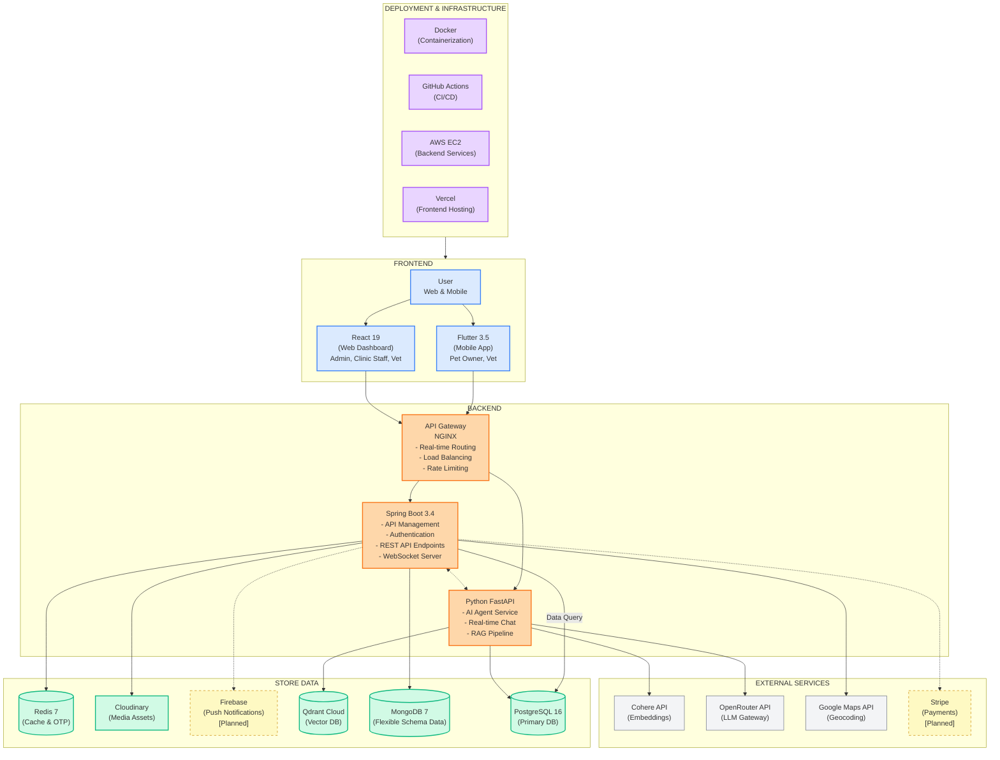
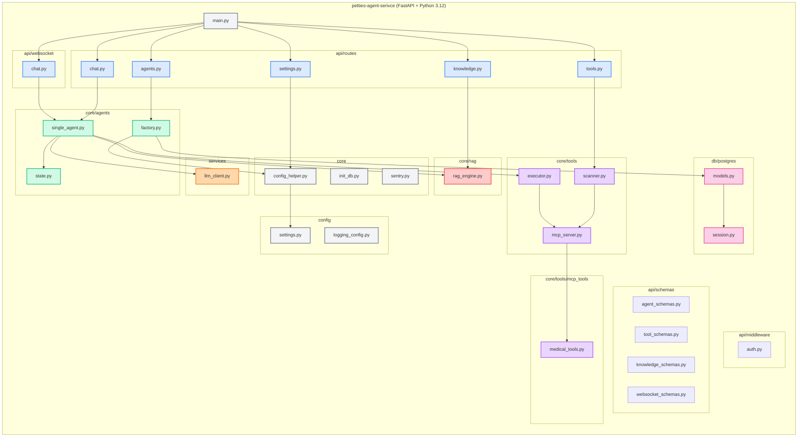

# II. Software Design Document

## 1. System Design

### 1.1 System Architecture

**The Petties Platform** is designed with a modern, scalable, and modular architecture, clearly separating frontend and backend responsibilities. This ensures high performance, flexibility for scaling, and easy integration with third-party services.

**1. User Role:**
- **Guest** - Can view clinic listings, search clinics, and view basic information
- **Pet Owner** - Can register pets, book appointments, chat with AI assistant, view EMR history, and manage profile (Mobile only)
- **Vet** - Can view appointments, manage schedule, create EMR records, and access patient history (Web + Mobile)
- **Clinic Manager** - Manages clinic operations, staff scheduling, booking management, and patient records (Web only)
- **Clinic Owner** - Manages clinic profile, services, pricing, staff, and views analytics (Web only)
- **Admin** - Manages the system, user accounts, clinic approvals, AI agent configuration, and oversees system operations (Web only)

**2. Frontend Layer:**
- Built with **React 19** (Web Dashboard) and **Flutter 3.5** (Mobile App) for responsive and real-time user experiences
- Uses **WebSocket clients** to receive live AI chat streaming
- Integrates **Neobrutalism design system** for consistent UI/UX
- Static assets are distributed through **Cloudinary CDN** to improve performance

**3. Backend Layer:**
- **Spring Boot 3.4 Server:** Handles API management, authentication (JWT), REST API endpoints, and business logic for clinics, bookings, users, pets, and EMR
- **Python FastAPI Service:** Processes AI chat requests, runs Single Agent with ReAct pattern, performs RAG queries, and supports real-time WebSocket streaming
- **API Gateway (NGINX):** Manages real-time routing, SSL termination, load balancing, and rate limiting

**4. Store Data:**
- **PostgreSQL 16** - Primary relational database storing users, clinics, bookings, pets, EMR, and AI agent configurations (shared by both services)
- **MongoDB 7** - Used for auditing, logs, and flexible schema data (e.g., patient records or specialized logs)
- **Redis 7** - Caches OTP codes, session data, and rate limiting counters with TTL-based expiration
- **Qdrant Cloud** - Stores vector embeddings for RAG knowledge base (1024 dimensions, Binary Quantization)
- **Cloudinary** - Manages media assets (images, avatars, clinic photos) efficiently with CDN delivery
- **Firebase** - Used for push notifications to mobile devices [Planned]

**5. Deployment & Infrastructure:**
- **Vercel** - Used for frontend (React) deployment with automatic preview deployments
- **AWS EC2** - Provides backend infrastructure and scalable cloud hosting for Spring Boot and FastAPI services
- **Docker** - Containerizes backend services (Spring Boot, FastAPI, NGINX), enabling flexible deployment and CI/CD pipelines
- **GitHub Actions** - Automated CI/CD for building, testing, and deploying all services

---

### 1.2 Package Diagram

#### 1.2.1 Back-End Package Diagram

##### Spring Boot Service (backend-spring)

```mermaid
flowchart TB
    subgraph "backend-spring (Spring Boot 3.4 + Java 21)"
        direction TB

        subgraph "controller"
            AuthController["AuthController"]
            UserController["UserController"]
            ClinicController["ClinicController"]
            ClinicStaffController["ClinicStaffController"]
            ClinicServiceController["ClinicServiceController"]
            MasterServiceController["MasterServiceController"]
            PetController["PetController"]
            FileController["FileController"]
            NotificationController["NotificationController"]
            ClinicPriceController["ClinicPriceController"]
        end

        subgraph "service"
            AuthService["AuthService"]
            UserService["UserService"]
            ClinicService["ClinicService"]
            ClinicStaffService["ClinicStaffService"]
            ClinicServiceService["ClinicServiceService"]
            MasterServiceService["MasterServiceService"]
            PetService["PetService"]
            NotificationService["NotificationService"]
            EmailService["EmailService"]
            CloudinaryService["CloudinaryService"]
            GoogleAuthService["GoogleAuthService"]
            GoogleMapsService["GoogleMapsService"]
            OtpRedisService["OtpRedisService"]
            PasswordResetService["PasswordResetService"]
            RegistrationOtpService["RegistrationOtpService"]
            ClinicPriceService["ClinicPriceService"]
        end

        subgraph "repository"
            UserRepository["UserRepository"]
            ClinicRepository["ClinicRepository"]
            ClinicImageRepository["ClinicImageRepository"]
            ClinicServiceRepository["ClinicServiceRepository"]
            MasterServiceRepository["MasterServiceRepository"]
            PetRepository["PetRepository"]
            NotificationRepository["NotificationRepository"]
            RefreshTokenRepository["RefreshTokenRepository"]
            BlacklistedTokenRepository["BlacklistedTokenRepository"]
            ClinicPricePerKmRepository["ClinicPricePerKmRepository"]
            ServiceWeightPriceRepository["ServiceWeightPriceRepository"]
        end

        subgraph "model"
            User["User"]
            Clinic["Clinic"]
            ClinicImage["ClinicImage"]
            ClinicServiceEntity["ClinicService"]
            MasterService["MasterService"]
            ServiceWeightPrice["ServiceWeightPrice"]
            Pet["Pet"]
            Notification["Notification"]
            RefreshToken["RefreshToken"]
            BlacklistedToken["BlacklistedToken"]
            ClinicPricePerKm["ClinicPricePerKm"]
            OperatingHours["OperatingHours"]
        end

        subgraph "model/enums"
            Role["Role"]
            StaffRole["StaffRole"]
            StaffStatus["StaffStatus"]
            ClinicStatus["ClinicStatus"]
            NotificationType["NotificationType"]
        end

        subgraph "dto"
            AuthDTOs["dto/auth/*"]
            UserDTOs["dto/user/*"]
            ClinicDTOs["dto/clinic/*"]
            ClinicServiceDTOs["dto/clinicService/*"]
            MasterServiceDTOs["dto/masterService/*"]
            PetDTOs["dto/pet/*"]
            NotificationDTOs["dto/notification/*"]
            OtpDTOs["dto/otp/*"]
            FileDTOs["dto/file/*"]
        end

        subgraph "config"
            SecurityConfig["SecurityConfig"]
            JwtAuthenticationFilter["JwtAuthenticationFilter"]
            JwtTokenProvider["JwtTokenProvider"]
            RedisConfig["RedisConfig"]
            CloudinaryConfig["CloudinaryConfig"]
            WebSocketConfig["WebSocketConfig"]
            JpaConfig["JpaConfig"]
            MongoDBConfig["MongoDBConfig"]
            UserDetailsServiceImpl["UserDetailsServiceImpl"]
        end

        subgraph "exception"
            GlobalExceptionHandler["GlobalExceptionHandler"]
            BadRequestException["BadRequestException"]
            ResourceNotFoundException["ResourceNotFoundException"]
            ResourceAlreadyExistsException["ResourceAlreadyExistsException"]
            UnauthorizedException["UnauthorizedException"]
            ForbiddenException["ForbiddenException"]
            ErrorResponse["ErrorResponse"]
        end

        subgraph "util"
            TokenUtil["TokenUtil"]
        end

        subgraph "converter"
            OperatingHoursConverter["OperatingHoursConverter"]
        end
    end

    %% Flow connections
    controller --> service
    service --> repository
    repository --> model
    controller --> dto
    service --> dto
    config --> service
    controller --> exception

    %% Styling
    classDef controllerStyle fill:#dbeafe,stroke:#3b82f6,stroke-width:2px
    classDef serviceStyle fill:#d1fae5,stroke:#10b981,stroke-width:2px
    classDef repoStyle fill:#e9d5ff,stroke:#a855f7,stroke-width:2px
    classDef modelStyle fill:#fecaca,stroke:#ef4444,stroke-width:2px
    classDef dtoStyle fill:#fbcfe8,stroke:#ec4899,stroke-width:2px
    classDef configStyle fill:#fed7aa,stroke:#f97316,stroke-width:2px
    classDef exceptionStyle fill:#f3f4f6,stroke:#6b7280,stroke-width:2px

    class AuthController,UserController,ClinicController,ClinicStaffController,ClinicServiceController,MasterServiceController,PetController,FileController,NotificationController,ClinicPriceController controllerStyle
    class AuthService,UserService,ClinicService,ClinicStaffService,ClinicServiceService,MasterServiceService,PetService,NotificationService,EmailService,CloudinaryService,GoogleAuthService,GoogleMapsService,OtpRedisService,PasswordResetService,RegistrationOtpService,ClinicPriceService serviceStyle
    class UserRepository,ClinicRepository,ClinicImageRepository,ClinicServiceRepository,MasterServiceRepository,PetRepository,NotificationRepository,RefreshTokenRepository,BlacklistedTokenRepository,ClinicPricePerKmRepository,ServiceWeightPriceRepository repoStyle
    class User,Clinic,ClinicImage,ClinicServiceEntity,MasterService,ServiceWeightPrice,Pet,Notification,RefreshToken,BlacklistedToken,ClinicPricePerKm,OperatingHours modelStyle
    class AuthDTOs,UserDTOs,ClinicDTOs,ClinicServiceDTOs,MasterServiceDTOs,PetDTOs,NotificationDTOs,OtpDTOs,FileDTOs dtoStyle
    class SecurityConfig,JwtAuthenticationFilter,JwtTokenProvider,RedisConfig,CloudinaryConfig,WebSocketConfig,JpaConfig,MongoDBConfig,UserDetailsServiceImpl configStyle
    class GlobalExceptionHandler,BadRequestException,ResourceNotFoundException,ResourceAlreadyExistsException,UnauthorizedException,ForbiddenException,ErrorResponse exceptionStyle
```

##### Python AI Agent Service (petties-agent-serivce)

##### Package Descriptions - Spring Boot Service:

| No | Package | Description |
|----|---------|-------------|
| **Controller Layer** |
| 01 | controller | REST API layer handling HTTP requests. Includes controllers for Auth, User, Clinic, Pet, File, Notification, and other business endpoints. Maps to `/api/v1/*` routes. |
| **Service Layer** |
| 02 | service | Core business logic layer. Contains services for authentication, user management, clinic operations, pet management, email sending, file upload (Cloudinary), OTP verification, and Google Maps integration. |
| 03 | service/impl | Implementation classes for service interfaces (e.g., GoogleMapsServiceImpl). |
| **Repository Layer** |
| 04 | repository | Data access layer using Spring Data JPA. Provides CRUD operations for all entities with custom query methods. |
| **Model Layer** |
| 05 | model | JPA entity classes mapped to PostgreSQL tables. Includes User, Clinic, ClinicImage, ClinicService, MasterService, Pet, Notification, RefreshToken, BlacklistedToken. |
| 06 | model/enums | Enum definitions: Role (PET_OWNER, VET, CLINIC_MANAGER, CLINIC_OWNER, ADMIN), StaffRole, StaffStatus, ClinicStatus, NotificationType. |
| **DTO Layer** |
| 07 | dto/auth | Authentication DTOs: LoginRequest, RegisterRequest, GoogleSignInRequest, SendOtpRequest, VerifyOtpRequest, ForgotPasswordRequest, ResetPasswordRequest, MessageResponse. |
| 08 | dto/user | User profile DTOs: UpdateProfileRequest, ChangePasswordRequest, EmailChangeRequest, EmailChangeVerifyRequest, AvatarResponse. |
| 09 | dto/clinic | Clinic DTOs: ClinicRequest, ClinicResponse, QuickAddStaffRequest, StaffResponse, ClinicPriceRequest, ClinicPriceResponse, ApproveClinicRequest, RejectClinicRequest, DistanceResponse, GeocodeResponse. |
| 10 | dto/clinicService | Clinic service DTOs: ClinicServiceResponse, ClinicServiceUpdateRequest, WeightPriceDto. |
| 11 | dto/masterService | Master service DTOs: MasterServiceRequest, MasterServiceResponse, MasterServiceUpdateRequest. |
| 12 | dto/pet | Pet DTOs: PetRequest, PetResponse. |
| 13 | dto/notification | Notification DTOs: NotificationResponse. |
| 14 | dto/otp | OTP data DTOs: PendingRegistrationData, PasswordResetOtpData, EmailChangeOtpData. |
| 15 | dto/file | File upload DTOs: UploadResponse. |
| **Configuration Layer** |
| 16 | config | Application configuration beans: SecurityConfig (Spring Security + JWT), JwtAuthenticationFilter, JwtTokenProvider, RedisConfig, CloudinaryConfig, WebSocketConfig, JpaConfig, UserDetailsServiceImpl. |
| **Exception Layer** |
| 17 | exception | Global exception handling with Vietnamese messages. Includes GlobalExceptionHandler, BadRequestException, ResourceNotFoundException, ResourceAlreadyExistsException, UnauthorizedException, ForbiddenException, ErrorResponse. |
| **Utility Layer** |
| 18 | util | Utility classes: TokenUtil for JWT token operations. |
| 19 | converter | JPA converters: OperatingHoursConverter for JSON-to-object mapping. |

##### Package Descriptions - Python AI Agent Service:

| No | Package | Description |
|----|---------|-------------|
| **API Layer** |
| 01 | api/routes | FastAPI route handlers for Chat (sessions, messages), Agents (CRUD, config), Tools (scan, enable/disable), Knowledge (upload, query), Settings (API keys, seed data). |
| 02 | api/websocket | WebSocket endpoint for real-time AI chat streaming with ReAct trace visualization. |
| 03 | api/middleware | Authentication middleware for JWT token validation and user extraction. |
| 04 | api/schemas | Pydantic schemas for request/response validation: agent_schemas, tool_schemas, knowledge_schemas, websocket_schemas. |
| **Core - Agent Layer** |
| 05 | core/agents | Single Agent implementation with ReAct pattern (Think -> Act -> Observe loop). Uses LangGraph StateGraph for state management. |
| 06 | core/agents/state | ReActState TypedDict definition with messages, react_steps, current_thought, tool_calls. |
| 07 | core/agents/factory | Dynamic Agent Builder that loads configuration from PostgreSQL database. |
| **Core - Tool Layer** |
| 08 | core/tools | FastMCP server infrastructure for tool registration and execution. |
| 09 | core/tools/mcp_server | FastMCP Server instance with @mcp.tool decorator for tool registration. |
| 10 | core/tools/scanner | Tool Scanner for auto-discovery of @mcp.tool decorated functions and syncing to database. |
| 11 | core/tools/executor | Tool Executor for validating parameters and executing tools through MCP server. |
| 12 | core/tools/mcp_tools | Code-based tools with semantic descriptions: medical_tools.py (pet_care_qa, symptom_search). |
| **Core - RAG Layer** |
| 13 | core/rag | 100% LlamaIndex RAG Engine with VectorStoreIndex, SentenceSplitter, CohereEmbedding (1024 dims), QdrantVectorStore. |
| **Core - Utilities** |
| 14 | core/config_helper | Dynamic configuration loader from PostgreSQL (API keys, model settings, prompts). |
| 15 | core/init_db | Database initialization and seed data scripts. |
| 16 | core/sentry | Sentry integration for error tracking and monitoring. |
| **Services Layer** |
| 17 | services | Business logic services: llm_client.py for OpenRouter/DeepSeek API calls with streaming support. |
| **Database Layer** |
| 18 | db/postgres/models | SQLAlchemy ORM models: Agent, Tool, SystemSetting, KnowledgeDocument, ChatSession, ChatMessage. |
| 19 | db/postgres/session | AsyncSession factory for database connections. |
| 20 | db/postgres/migrations | Alembic migration scripts for schema versioning. |
| **Configuration Layer** |
| 21 | config | Pydantic Settings for environment configuration and logging setup. |

---

#### 1.2.2 Front-End Package Diagram

##### React Web Dashboard (petties-web)

```mermaid
flowchart TB
    subgraph "petties-web (React 19 + Vite + TypeScript)"
        direction TB

        subgraph "pages"
            PagesAuth["pages/auth<br/>LoginPage, RegisterPage,<br/>ForgotPasswordPage"]
            PagesOnboarding["pages/onboarding<br/>OnboardingPage"]
            PagesAdmin["pages/admin<br/>DashboardPage, ClinicApprovalPage"]
            PagesAdminTools["pages/admin/tools<br/>ToolsPage"]
            PagesAdminKnowledge["pages/admin/knowledge<br/>KnowledgeBasePage"]
            PagesAdminPlayground["pages/admin/playground<br/>PlaygroundPage"]
            PagesAdminClinics["pages/admin/clinics<br/>ClinicApprovalPage"]
            PagesClinicOwner["pages/clinic-owner<br/>MasterServicesPage, ServicesPage"]
            PagesClinicOwnerClinics["pages/clinic-owner/clinics<br/>ClinicCreatePage, ClinicEditPage"]
            PagesClinicManager["pages/clinic-manager<br/>DashboardPage"]
            PagesVet["pages/vet<br/>DashboardPage"]
            PagesShared["pages/shared<br/>ProfilePage"]
        end

        subgraph "components"
            CompAuth["components/auth<br/>RoleGuard, RoleBasedRedirect"]
            CompAdmin["components/admin<br/>ApiKeyManager, ChatMessage,<br/>DocumentUpload, ModelParametersConfig,<br/>RAGQueryTester, ToolCard,<br/>SystemPromptEditor, RoutingExamplesManager,<br/>ApproveRejectModal"]
            CompClinic["components/clinic<br/>ClinicCard, ClinicForm,<br/>ClinicImageUpload, ClinicLogoUpload,<br/>ClinicMapOSM, DistanceCalculator,<br/>AddressAutocompleteOSM"]
            CompClinicOwner["components/clinic-owner<br/>ClinicSelectModal, InheritServiceModal"]
            CompClinicStaff["components/clinic-staff<br/>QuickAddStaffModal"]
            CompOnboarding["components/onboarding<br/>HeroSection, FeaturesSection,<br/>HowItWorksSection, ProblemStatement,<br/>TargetUsersSection, NavigationBar,<br/>CTAFooter"]
            CompProfile["components/profile<br/>AvatarUpload, ChangePasswordModal,<br/>EmailChangeModal, ImageCropModal"]
            CompDashboard["components/dashboard<br/>DashboardCard, DashboardSidebar"]
            CompCommon["components/common<br/>OtpInput, ProtectedRoute,<br/>ConfirmDialog"]
            CompToast["components/Toast"]
        end

        subgraph "layouts"
            AdminLayout["AdminLayout"]
            VetLayout["VetLayout"]
            ClinicOwnerLayout["ClinicOwnerLayout"]
            ClinicManagerLayout["ClinicManagerLayout"]
            AuthLayout["AuthLayout"]
            MainLayout["MainLayout"]
        end

        subgraph "services"
            ServicesAPI["services/api<br/>client, userService,<br/>clinicService, notificationService"]
            ServicesEndpoints["services/endpoints<br/>masterService, service"]
            ServicesWebSocket["services/websocket<br/>WebSocket client"]
        end

        subgraph "store"
            UserStore["store/userStore"]
            ClinicStore["store/clinicStore"]
        end

        subgraph "hooks"
            UseAuth["hooks/useAuth"]
            UseToast["hooks/useToast"]
        end

        subgraph "types"
            TypesUser["types/user"]
            TypesClinic["types/clinic"]
            TypesIndex["types/index"]
        end

        subgraph "utils"
            UtilsLogger["utils/logger"]
            UtilsErrorHandler["utils/errorHandler"]
            UtilsTokenUtils["utils/tokenUtils"]
        end

        subgraph "config"
            ConfigEnv["config/env"]
        end

        subgraph "lib"
            LibSentry["lib/sentry"]
        end

        AppProviders["app/providers"]
        Main["main.tsx"]
    end

    %% Flow connections
    Main --> AppProviders
    AppProviders --> layouts
    layouts --> pages
    pages --> components
    components --> ServicesAPI
    ServicesAPI --> ServicesEndpoints
    components --> store
    components --> hooks
    hooks --> store
    ServicesAPI --> types
    components --> utils
    ServicesAPI --> ConfigEnv

    %% Styling
    classDef pageStyle fill:#dbeafe,stroke:#3b82f6,stroke-width:2px
    classDef compStyle fill:#d1fae5,stroke:#10b981,stroke-width:2px
    classDef layoutStyle fill:#e9d5ff,stroke:#a855f7,stroke-width:2px
    classDef serviceStyle fill:#fed7aa,stroke:#f97316,stroke-width:2px
    classDef storeStyle fill:#fecaca,stroke:#ef4444,stroke-width:2px
    classDef utilStyle fill:#f3f4f6,stroke:#6b7280,stroke-width:2px

    class PagesAuth,PagesOnboarding,PagesAdmin,PagesAdminTools,PagesAdminKnowledge,PagesAdminPlayground,PagesAdminClinics,PagesClinicOwner,PagesClinicOwnerClinics,PagesClinicManager,PagesVet,PagesShared pageStyle
    class CompAuth,CompAdmin,CompClinic,CompClinicOwner,CompClinicStaff,CompOnboarding,CompProfile,CompDashboard,CompCommon,CompToast compStyle
    class AdminLayout,VetLayout,ClinicOwnerLayout,ClinicManagerLayout,AuthLayout,MainLayout layoutStyle
    class ServicesAPI,ServicesEndpoints,ServicesWebSocket serviceStyle
    class UserStore,ClinicStore storeStyle
    class UseAuth,UseToast,TypesUser,TypesClinic,TypesIndex,UtilsLogger,UtilsErrorHandler,UtilsTokenUtils,ConfigEnv,LibSentry,AppProviders,Main utilStyle
```

##### Flutter Mobile App (petties_mobile)

```mermaid
flowchart TB
    subgraph "petties_mobile (Flutter 3.5 + Dart)"
        direction TB

        subgraph "ui/auth"
            LoginScreen["login_screen.dart"]
            RegisterScreen["register_screen.dart"]
            ForgotPasswordScreen["forgot_password_screen.dart"]
            ResetPasswordScreen["reset_password_screen.dart"]
        end

        subgraph "ui/onboarding"
            OnboardingScreen["onboarding_screen.dart"]
        end

        subgraph "ui/pet_owner"
            PetOwnerHomeScreen["pet_owner_home_screen.dart"]
        end

        subgraph "ui/vet"
            VetHomeScreen["vet_home_screen.dart"]
        end

        subgraph "ui/pet"
            PetListScreen["pet_list_screen.dart"]
            PetDetailScreen["pet_detail_screen.dart"]
            AddEditPetScreen["add_edit_pet_screen.dart"]
        end

        subgraph "ui/screens/profile"
            ProfileScreen["profile_screen.dart"]
            EditProfileScreen["edit_profile_screen.dart"]
            ChangePasswordScreen["change_password_screen.dart"]
            ChangeEmailScreen["change_email_screen.dart"]
        end

        subgraph "ui/home"
            HomeScreen["home_screen.dart"]
        end

        subgraph "ui/core/widgets"
            CustomButton["custom_button.dart"]
            CustomTextField["custom_text_field.dart"]
            LoadingOverlay["loading_overlay.dart"]
            EmptyState["empty_state.dart"]
        end

        subgraph "ui/widgets/profile"
            AvatarPicker["avatar_picker.dart"]
            ProfileInfoCard["profile_info_card.dart"]
            ProfileWidgets["profile_widgets.dart"]
            EmailInlineEdit["email_inline_edit.dart"]
        end

        subgraph "data/services"
            ApiClient["api_client.dart"]
            ApiInterceptor["api_interceptor.dart"]
            AuthService["auth_service.dart"]
            UserService["user_service.dart"]
            PetService["pet_service.dart"]
            GoogleAuthService["google_auth_service.dart"]
        end

        subgraph "data/models"
            UserModel["user_model.dart"]
            UserProfile["user_profile.dart"]
            UserResponse["user_response.dart"]
            AuthResponse["auth_response.dart"]
            SendOtpResponse["send_otp_response.dart"]
            PetModel["pet.dart"]
            BaseModel["base_model.dart"]
        end

        subgraph "data/datasources"
            AuthLocalDatasource["local/auth_local_datasource.dart"]
            AuthRemoteDatasource["remote/auth_remote_datasource.dart"]
        end

        subgraph "data/repositories"
            AuthRepositoryImpl["auth_repository_impl.dart"]
        end

        subgraph "providers"
            AuthProvider["auth_provider.dart"]
            UserProvider["user_provider.dart"]
        end

        subgraph "routing"
            AppRoutes["app_routes.dart"]
            RouterConfig["router_config.dart"]
        end

        subgraph "config/constants"
            AppConstants["app_constants.dart"]
            AppColors["app_colors.dart"]
            AppStrings["app_strings.dart"]
        end

        subgraph "config/theme"
            AppTheme["app_theme.dart"]
        end

        subgraph "config/env"
            Environment["environment.dart"]
        end

        subgraph "config/routes"
            ConfigAppRoutes["app_routes.dart"]
            ConfigRouterConfig["router_config.dart"]
        end

        subgraph "core/error"
            Exceptions["exceptions.dart"]
            Failures["failures.dart"]
        end

        subgraph "core/network"
            CoreApiClient["api_client.dart"]
            CoreApiInterceptor["api_interceptor.dart"]
        end

        subgraph "core/services"
            SentryService["sentry_service.dart"]
        end

        subgraph "core/utils"
            CoreDatetimeUtils["datetime_utils.dart"]
            CoreStorageService["storage_service.dart"]
            CoreValidators["validators.dart"]
        end

        subgraph "utils"
            DatetimeUtils["datetime_utils.dart"]
            StorageService["storage_service.dart"]
            Validators["validators.dart"]
            PermissionHelper["permission_helper.dart"]
            ApiErrorHandler["api_error_handler.dart"]
        end

        MainDart["main.dart"]
        FirebaseOptions["firebase_options.dart"]
    end

    %% Flow connections
    MainDart --> routing
    routing --> ui/auth
    routing --> ui/pet_owner
    routing --> ui/vet
    routing --> ui/pet
    routing --> ui/screens/profile

    ui/auth --> providers
    ui/pet_owner --> providers
    ui/pet --> providers
    providers --> data/services
    data/services --> data/models
    data/services --> core/network
    providers --> data/repositories
    data/repositories --> data/datasources

    %% Styling
    classDef screenStyle fill:#dbeafe,stroke:#3b82f6,stroke-width:2px
    classDef widgetStyle fill:#d1fae5,stroke:#10b981,stroke-width:2px
    classDef serviceStyle fill:#fed7aa,stroke:#f97316,stroke-width:2px
    classDef modelStyle fill:#fecaca,stroke:#ef4444,stroke-width:2px
    classDef providerStyle fill:#e9d5ff,stroke:#a855f7,stroke-width:2px
    classDef configStyle fill:#f3f4f6,stroke:#6b7280,stroke-width:2px

    class LoginScreen,RegisterScreen,ForgotPasswordScreen,ResetPasswordScreen,OnboardingScreen,PetOwnerHomeScreen,VetHomeScreen,PetListScreen,PetDetailScreen,AddEditPetScreen,ProfileScreen,EditProfileScreen,ChangePasswordScreen,ChangeEmailScreen,HomeScreen screenStyle
    class CustomButton,CustomTextField,LoadingOverlay,EmptyState,AvatarPicker,ProfileInfoCard,ProfileWidgets,EmailInlineEdit widgetStyle
    class ApiClient,ApiInterceptor,AuthService,UserService,PetService,GoogleAuthService serviceStyle
    class UserModel,UserProfile,UserResponse,AuthResponse,SendOtpResponse,PetModel,BaseModel modelStyle
    class AuthProvider,UserProvider providerStyle
    class AppRoutes,RouterConfig,AppConstants,AppColors,AppStrings,AppTheme,Environment,ConfigAppRoutes,ConfigRouterConfig,Exceptions,Failures,CoreApiClient,CoreApiInterceptor,SentryService,CoreDatetimeUtils,CoreStorageService,CoreValidators,DatetimeUtils,StorageService,Validators,PermissionHelper,ApiErrorHandler,MainDart,FirebaseOptions,AuthLocalDatasource,AuthRemoteDatasource,AuthRepositoryImpl configStyle
```

##### Package Descriptions - React Web Dashboard:

| No | Package | Description |
|----|---------|-------------|
| **Pages Layer** |
| 01 | pages/auth | Authentication pages: LoginPage, RegisterPage, ForgotPasswordPage with OTP verification flow. |
| 02 | pages/onboarding | Landing page with hero section, features, and call-to-action for new users. |
| 03 | pages/admin | Admin dashboard pages: System overview, clinic approval management. |
| 04 | pages/admin/tools | AI Tool Management page: Scan, enable/disable, and assign tools to agents. |
| 05 | pages/admin/knowledge | Knowledge Base page: Upload documents, manage RAG pipeline, test queries. |
| 06 | pages/admin/playground | AI Playground page: Test chat with agent, view ReAct traces. |
| 07 | pages/admin/clinics | Clinic Approval page: Review and approve/reject clinic registrations. |
| 08 | pages/clinic-owner | Clinic Owner dashboard: Manage master services, clinic services, pricing. |
| 09 | pages/clinic-owner/clinics | Clinic CRUD pages: Create and edit clinic profiles, upload images. |
| 10 | pages/clinic-manager | Clinic Manager dashboard: Manage bookings, staff schedules, patients. |
| 11 | pages/vet | Vet dashboard: View appointments, manage schedule, access patient records. |
| 12 | pages/shared | Shared pages: Profile management, settings accessible by all roles. |
| **Components Layer** |
| 13 | components/auth | Authentication components: RoleGuard (route protection), RoleBasedRedirect (auto-redirect by role). |
| 14 | components/admin | Admin components: ApiKeyManager, ChatMessage, DocumentUpload, ModelParametersConfig, RAGQueryTester, ToolCard, SystemPromptEditor, RoutingExamplesManager, ApproveRejectModal. |
| 15 | components/clinic | Clinic components: ClinicCard, ClinicForm, ClinicImageUpload, ClinicLogoUpload, ClinicMapOSM (OpenStreetMap), DistanceCalculator, AddressAutocompleteOSM. |
| 16 | components/clinic-owner | Clinic Owner components: ClinicSelectModal, InheritServiceModal. |
| 17 | components/clinic-staff | Staff management components: QuickAddStaffModal for adding Vet/Manager. |
| 18 | components/onboarding | Landing page components: HeroSection, FeaturesSection, HowItWorksSection, ProblemStatement, TargetUsersSection, NavigationBar, CTAFooter. |
| 19 | components/profile | Profile components: AvatarUpload, ChangePasswordModal, EmailChangeModal, ImageCropModal. |
| 20 | components/dashboard | Dashboard widgets: DashboardCard, DashboardSidebar. |
| 21 | components/common | Shared UI components: OtpInput, ProtectedRoute, ConfirmDialog. |
| **Layouts Layer** |
| 22 | layouts | Role-based layouts: AdminLayout, VetLayout, ClinicOwnerLayout, ClinicManagerLayout, AuthLayout, MainLayout. Each includes appropriate sidebar, header, and navigation. |
| **Services Layer** |
| 23 | services/api | Axios-based API client with interceptors, userService, clinicService, notificationService. |
| 24 | services/endpoints | API endpoint definitions: masterService, service endpoints. |
| 25 | services/websocket | WebSocket client for real-time AI chat streaming. |
| **State Management** |
| 26 | store | Zustand stores: userStore (auth state, user profile), clinicStore (clinic data). |
| **Hooks Layer** |
| 27 | hooks | Custom React hooks: useAuth (authentication), useToast (notifications). |
| **Types Layer** |
| 28 | types | TypeScript type definitions: user, clinic, index. |
| **Utils Layer** |
| 29 | utils | Utility functions: logger, errorHandler, tokenUtils. |
| **Config Layer** |
| 30 | config | Environment configuration: env.ts with API base URLs. |
| **Lib Layer** |
| 31 | lib | Third-party integrations: sentry.ts for error tracking. |

##### Package Descriptions - Flutter Mobile App:

| No | Package | Description |
|----|---------|-------------|
| **UI Layer - Screens** |
| 01 | ui/auth | Authentication screens: LoginScreen, RegisterScreen, ForgotPasswordScreen, ResetPasswordScreen with OTP verification. |
| 02 | ui/onboarding | Onboarding screen for first-time users with app introduction slides. |
| 03 | ui/pet_owner | Pet Owner home screen with quick actions for booking, pets, and AI chat. |
| 04 | ui/vet | Vet home screen with appointments, schedule, and patient list. |
| 05 | ui/pet | Pet management screens: PetListScreen, PetDetailScreen, AddEditPetScreen. |
| 06 | ui/screens/profile | Profile management: ProfileScreen, EditProfileScreen, ChangePasswordScreen, ChangeEmailScreen. |
| 07 | ui/home | Main home screen with navigation and role-based content. |
| **UI Layer - Widgets** |
| 08 | ui/core/widgets | Core reusable widgets: CustomButton, CustomTextField, LoadingOverlay, EmptyState. |
| 09 | ui/widgets/profile | Profile-specific widgets: AvatarPicker, ProfileInfoCard, ProfileWidgets, EmailInlineEdit. |
| **Data Layer - Services** |
| 10 | data/services | API services: ApiClient (Dio-based), ApiInterceptor (JWT handling), AuthService, UserService, PetService, GoogleAuthService. |
| **Data Layer - Models** |
| 11 | data/models | Data models: UserModel, UserProfile, UserResponse, AuthResponse, SendOtpResponse, Pet, BaseModel. |
| **Data Layer - Datasources** |
| 12 | data/datasources | Data sources: AuthLocalDatasource (SharedPreferences), AuthRemoteDatasource (API calls). |
| **Data Layer - Repositories** |
| 13 | data/repositories | Repository implementations: AuthRepositoryImpl combining local and remote data sources. |
| **Providers Layer** |
| 14 | providers | State management with Provider pattern: AuthProvider, UserProvider. |
| **Routing Layer** |
| 15 | routing | GoRouter configuration: AppRoutes (route constants), RouterConfig (route definitions with guards). |
| **Config Layer** |
| 16 | config/constants | App constants: AppConstants, AppColors, AppStrings. |
| 17 | config/theme | App theme: AppTheme with Neobrutalism styling. |
| 18 | config/env | Environment configuration: Environment with API URLs per environment. |
| 19 | config/routes | Route configuration (alternative structure): app_routes, router_config. |
| **Core Layer** |
| 20 | core/error | Error handling: Exceptions, Failures classes. |
| 21 | core/network | Network layer: ApiClient, ApiInterceptor. |
| 22 | core/services | Core services: SentryService for error tracking. |
| 23 | core/utils | Core utilities: datetime_utils, storage_service, validators. |
| **Utils Layer** |
| 24 | utils | Utility functions: datetime_utils, storage_service, validators, permission_helper, api_error_handler. |
| **Entry Point** |
| 25 | main.dart | Application entry point with Provider setup and Firebase initialization. |
| 26 | firebase_options.dart | Firebase configuration for push notifications. |

---

## 2. API DESIGN SPECIFICATIONS

> **Note:** API version prefix `/api/v1` (Backend) has been simplified to `/api`. AI Service is accessed via `/ai` prefix through NGINX.

### 2.1 Implemented Modules (Backend - Spring Boot)

> **Base Path:** `/api`
> **Access:** Requires JWT, Public for Auth/Search

#### 2.1.1 Authentication (`/auth`)
| Method | Endpoint | Description | Access |
|--------|----------|-------------|--------|
| POST | `/api/auth/login` | Email/Password login | Public |
| POST | `/api/auth/google` | Google OAuth login/register | Public |
| POST | `/api/auth/register/send-otp` | Init registration with Email OTP | Public |
| POST | `/api/auth/register/verify-otp` | Complete registration | Public |
| POST | `/api/auth/refresh` | Refresh Access Token (Rotation) | Public |
| GET | `/api/auth/me` | Get current user basic info | Auth |
| POST | `/api/auth/forgot-password` | Request password reset OTP | Public |
| POST | `/api/auth/logout` | Revoke token | Auth |

#### 2.1.2 User Profile (`/users`)
| Method | Endpoint | Description | Access |
|--------|----------|-------------|--------|
| GET | `/api/users/profile` | Get detailed profile | Auth |
| PUT | `/api/users/profile` | Update profile info | Auth |
| POST | `/api/users/profile/avatar` | Upload avatar | Auth |
| DELETE | `/api/users/profile/avatar` | Delete avatar | Auth |
| PUT | `/api/users/profile/password` | Change password | Auth |
| POST | `/api/users/profile/email/request-change` | Request email change (Step 1) | Auth |
| POST | `/api/users/profile/email/verify-change` | Verify email change (Step 2) | Auth |

#### 2.1.3 Clinic Management (`/clinics`)
| Method | Endpoint | Description | Access |
|--------|----------|-------------|--------|
| GET | `/api/clinics` | List all clinics (Filter/Page) | Public |
| GET | `/api/clinics/{id}` | Get details | Public |
| POST | `/api/clinics` | Create clinic | Clinic Owner |
| PUT | `/api/clinics/{id}` | Update profile | Clinic Owner |
| POST | `/api/clinics/{id}/images` | Upload gallery image | Clinic Owner |
| POST | `/api/clinics/{id}/logo` | Upload logo | Clinic Owner |
| DELETE | `/api/clinics/{id}/images/{imageId}` | Delete gallery image | Clinic Owner |
| GET | `/api/clinics/nearby` | Geo-search nearby | Public |
| GET | `/api/clinics/search` | Name search | Public |
| GET | `/api/clinics/owner/my-clinics` | Get my clinics | Clinic Owner |

#### 2.1.4 Clinic Staff Management (`/clinics/{id}/staff`)
| Method | Endpoint | Description | Access |
|--------|----------|-------------|--------|
| GET | `/api/clinics/{id}/staff` | List all staff | CM, CO, Admin |
| GET | `/api/clinics/{id}/staff/has-manager` | Check manager logic | CM, CO |
| POST | `/api/clinics/{id}/staff/quick-add` | Quick add Vet/Manager | CM, CO |
| DELETE | `/api/clinics/{id}/staff/{userId}` | Remove staff | CM, CO |

#### 2.1.5 Clinic Services (`/services`)
| Method | Endpoint | Description | Access |
|--------|----------|-------------|--------|
| GET | `/api/services` | List own services | Clinic Owner |
| POST | `/api/services` | Create service | Clinic Owner |
| PUT | `/api/services/{id}` | Update service | Clinic Owner |
| DELETE | `/api/services/{id}` | Delete service | Clinic Owner |
| PATCH | `/api/services/{id}/status` | Toggle active | Clinic Owner |
| PATCH | `/api/services/{id}/home-visit` | Toggle Home Visit | Clinic Owner |

#### 2.1.6 File Management (`/files`)
| Method | Endpoint | Description | Access |
|--------|----------|-------------|--------|
| POST | `/api/files/upload` | Upload generic file | Auth |
| POST | `/api/files/upload/avatar` | Upload avatar (resize) | Auth |

### 2.2 Implemented Modules (AI Service - Python)

> **Base Path:** `/ai` (Mapped via NGINX to Internal Port 8000)

#### 2.2.1 Chat & Sessions (`/ai/chat`)
| Method | Endpoint | Description | Access |
|--------|----------|-------------|--------|
| POST | `/ai/chat/sessions` | Create new chat session | Auth |
| GET | `/ai/chat/sessions` | List history sessions | Auth |
| GET | `/ai/chat/sessions/{id}` | Get session details | Auth |
| WS | `/ws/chat/{session_id}` | WebSocket Real-time Chat | Auth |

#### 2.2.2 Agent Management (`/ai/agents`)
| Method | Endpoint | Description | Access |
|--------|----------|-------------|--------|
| GET | `/ai/agents` | List agents (Single/Multi) | Auth |
| GET | `/ai/agents/{id}` | Get agent detail | Auth |
| PUT | `/ai/agents/{id}` | Update config (Temp, Model, Params) | Admin |
| PUT | `/ai/agents/{id}/prompt` | Update System Prompt (Versioning) | Admin |
| GET | `/ai/agents/{id}/prompt-history` | View Prompt History | Admin |
| POST | `/ai/agents/{id}/test` | Test Agent (ReAct Trace) | Admin |

#### 2.2.3 Tool Registry (`/ai/tools`)
| Method | Endpoint | Description | Access |
|--------|----------|-------------|--------|
| POST | `/ai/tools/scan` | Scan & Sync Code-based Tools (FastMCP) | Admin |
| GET | `/ai/tools` | List Registered Tools | Admin |
| PUT | `/ai/tools/{id}/enable` | Enable/Disable Tool | Admin |
| POST | `/ai/tools/{id}/assign` | Assign tool to Agent | Admin |

#### 2.2.4 Knowledge Base RAG (`/ai/knowledge`)
| Method | Endpoint | Description | Access |
|--------|----------|-------------|--------|
| POST | `/ai/knowledge/upload` | Upload PDF/Docx | Admin |
| POST | `/ai/knowledge/documents/{id}/process` | Index to Qdrant (Cohere Embedding) | Admin |
| GET | `/ai/knowledge/documents` | List documents status | Admin |
| POST | `/ai/knowledge/query` | Test RAG Retrieval | Admin |
| GET | `/ai/knowledge/status` | KB Status & Stats | Admin |

### 2.3 Planned Modules (Backend)

#### 2.3.1 Patient Management Module

> **Status:** Design Approved. Endpoint paths finalized.

| Method | Endpoint | Description | Access |
|--------|----------|-------------|--------|
| GET | `/api/clinics/{id}/patients` | List patients of clinic | CM, VET |
| GET | `/api/patients/{id}` | Get Patient & Owner details | CM, VET |
| PUT | `/api/pets/{id}` | Update Patient Info | CM, VET |
| GET | `/api/patients/{id}/emrs` | Get EMR History (Shared) | CM, VET |
| POST | `/api/bookings/{id}/emr` | Create EMR for Booking | VET |
| PUT | `/api/emrs/{id}` | Update EMR Content | VET |
| GET | `/api/patients/{id}/vaccinations` | Get Vaccination History | CM, VET |
| POST | `/api/patients/{id}/vaccinations` | Add Vaccination Record | VET |
| PUT | `/api/vaccinations/{id}` | Edit Vaccination Record | VET |
| DELETE | `/api/vaccinations/{id}` | Delete Vaccination Record | VET |

#### 2.3.2 Shift & Slot Management Module
| Method | Endpoint | Description | Access |
|--------|----------|-------------|--------|
| GET | `/api/clinics/{id}/shifts` | Get shift list (filter: dateRange, vetId) | CM, CO |
| POST | `/api/clinics/{id}/shifts` | Create new shift (Auto-generate 30min slots) | CM, CO |
| PUT | `/api/shifts/{id}` | Update shift time | CM, CO |
| DELETE | `/api/shifts/{id}` | Delete shift (Delete unbooked slots) | CM, CO |
| GET | `/api/shifts/my-shifts` | View own schedule | VET |
| GET | `/api/clinics/{id}/slots` | Get slots for the day | CM, VET, Public |
| PATCH | `/api/slots/{id}/block` | Block/Unblock slot manually | CM, VET |

#### 2.3.3 Discovery & Search Module
| Method | Endpoint | Description | Access |
|--------|----------|-------------|--------|
| GET | `/api/discovery/nearby` | Find clinics by coordinates (lat, lng, radius) | Public |
| GET | `/api/discovery/search` | Search by keyword, service, area | Public |
| GET | `/api/discovery/geocoding` | Convert address to coordinates (Map API proxy) | Public |

#### 2.3.4 Vaccination History Module (Merged)
| Method | Endpoint | Description | Access |
|--------|----------|-------------|--------|
| GET | `/api/pets/{petId}/vaccinations` | Get full vaccination history | Auth |
| POST | `/api/bookings/{bookingId}/vaccinations` | Add new vaccination record (Must link to Booking) | VET |
| PUT | `/api/vaccinations/{id}` | Edit record | VET |
| DELETE | `/api/vaccinations/{id}` | Delete record | VET |

---

## 3. TECHNOLOGY STACK SUMMARY

### Frontend (petties-web)
- **Framework:** React 19 + Vite (rolldown-vite)
- **Language:** TypeScript 5.9.x
- **State Management:** Zustand 5.x
- **Routing:** React Router v7.9
- **Styling:** Tailwind CSS v4 (Neobrutalism design)
- **HTTP Client:** Axios
- **Real-time:** Native WebSocket API

### Backend (backend-spring)
- **Framework:** Spring Boot 3.4.x
- **Language:** Java 21
- **Architecture:** Layered (Controller -> Service -> Repository)
- **Security:** Spring Security 6.x + JWT
- **Database Access:** Spring Data JPA + Hibernate
- **Validation:** Jakarta Bean Validation
- **Caching:** Spring Data Redis
- **Image Upload:** Cloudinary SDK

### AI Agent Service (petties-agent-serivce)
- **Framework:** FastAPI 0.115.x
- **Language:** Python 3.12
- **Agent Framework:** LangGraph 0.2.x (Single Agent + ReAct Pattern)
- **RAG Framework:** LlamaIndex 0.11.x
- **Tool Protocol:** FastMCP 2.3.x (@mcp.tool() decorator)
- **LLM Provider:** OpenRouter API (Gemini 2.0 Flash, Llama 3.3 70B)
- **Embeddings:** Cohere embed-multilingual-v3.0 (1024 dimensions)
- **Vector DB:** Qdrant Cloud (Binary Quantization)

### Mobile (petties_mobile)
- **Framework:** Flutter 3.x
- **Language:** Dart SDK 3.x
- **State Management:** Provider 6.x
- **Routing:** GoRouter 14.x
- **HTTP Client:** Dio 5.x
- **Local Storage:** SharedPreferences, Hive
- **Auth:** Google Sign-In, JWT

### Databases
- **PostgreSQL 16:** Primary relational database (Neon Cloud)
- **Redis 7:** OTP, session caching (Upstash Cloud)
- **Qdrant Cloud:** Vector embeddings (1024 dimensions)

### Infrastructure
- **Development:** Docker Compose (local databases)
- **Test Environment:** AWS EC2, Neon Test Branch
- **Production:** AWS EC2 (backend + AI), Vercel (frontend), Neon Main
- **CI/CD:** GitHub Actions
- **Reverse Proxy:** NGINX with SSL (Let's Encrypt)
- **Image Storage:** Cloudinary
- **Push Notifications:** Firebase [Planned]
- **Payments:** Stripe [Planned]

---

**Prepared by:** Petties Development Team
**Document Version:** 2.0
**Last Updated:** 2025-12-30
